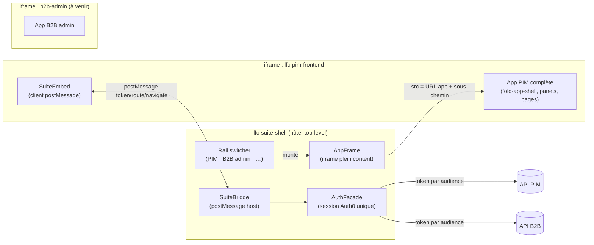
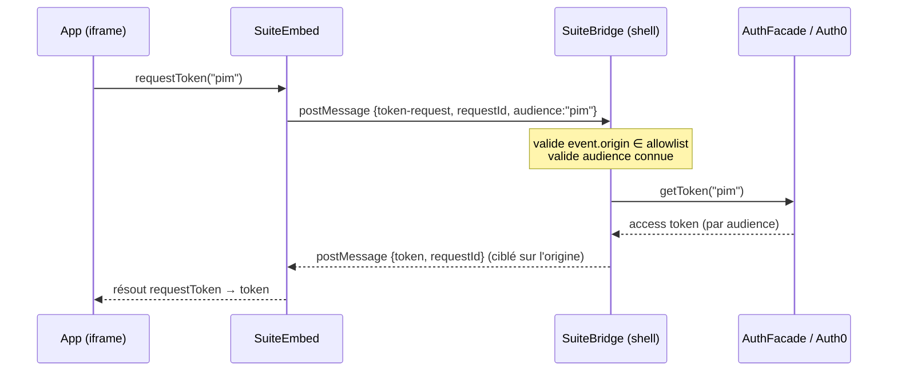
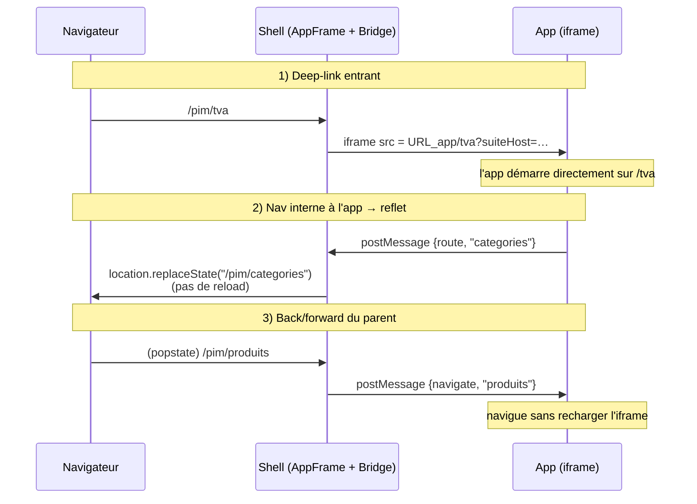

# Suite interne LFC — architecture

`lfc-suite-shell` est l'**hôte** de la suite d'outils internes de La Folie Coffee
(PIM, futur B2B admin, …). Il présente sous **un seul login** et **un menu
d'apps** des applications qui restent, chacune, des **apps autonomes**. Ce
document explique **ce qu'on a construit, pourquoi l'iframe, et comment les
pièces s'emboîtent**.

---

## 1. En une phrase

> Un **shell mince** (login + switcher d'apps) qui **héberge chaque app dans une
> iframe** — l'app tourne exactement comme en standalone (sa chrome, ses panels,
> son scroll) — avec une **passerelle postMessage** qui donne l'illusion d'un
> tout : login unique (relais de token), URL synchronisée, pannes isolées.

---

## 2. Pourquoi l'iframe (et pas les micro-frontends fédérés)

On a **d'abord essayé Native Federation** (le shell charge les apps comme des
_remotes_ au runtime, dépendances Angular/fold partagées). On l'a **abandonné**.
La raison est un principe, pas un détail technique :

| | Fédération (essayée) | **Iframe (retenue)** |
| --- | --- | --- |
| L'app hostée | **doit s'adapter** : retirer son `fold-app-shell`, ré-exposer son menu en donnée, partager le `panel-host` du shell | **tourne telle quelle** — standalone === embarqué |
| Panels / overlays | conflit (deux `panel-host`) | chacun le sien, isolé ✅ |
| Dépendances | partagées (1 Angular/fold) — mais **skew de version** au runtime | rechargées par app (coût assumé) |
| Isolation des pannes | partielle | **totale** (process navigateur séparé) |
| Complexité | remote-entry, baseline strictVersion, contrat d'exposition | `<iframe src>` |

**Le point qui a tranché** : une app fédérée _diverge_ de son mode standalone, et
les **panels** (côté fold) posaient un vrai problème. Or toutes les apps de la
suite **doivent marcher en standalone**. L'iframe donne « ouvrir l'app entière »
sans aucune adaptation. On paie le non-partage des dépendances — négligeable
pour des outils internes lancés à la demande.

> Deux shells **séparés**, à ne jamais fusionner : le **shell client** (la
> boutique B2B, public = clients) et **ce shell suite** (public = staff). Modèles
> d'accès opposés.

---

## 3. Topologie



- **Le shell** est le cadre top-level : rail switcher + `AppFrame` (l'iframe) +
  `SuiteBridge` + `AuthFacade`. Zéro métier — c'est le **point de défaillance
  unique**, on le garde minimal.
- **Chaque app** tourne dans son iframe, avec son `SuiteEmbed` pour dialoguer
  avec le shell. Standalone, `SuiteEmbed` est inerte (no-op).

---

## 4. Les composants clés

### Shell (`src/app/`)

| Fichier | Rôle |
| --- | --- |
| `app.ts` / `app.html` | Rail switcher (= le menu d'apps), gate d'auth, démarre le bridge. **Pas de header** (l'app hostée a le sien). |
| `suite/suite-registry.ts` | La liste des apps (id, titre, icône, routePath). |
| `suite/suite-config(.dev).ts` | Les **URLs par environnement** (Pages / localhost), swap par `fileReplacements`. |
| `suite/app-frame/` | L'`AppFrame` : l'iframe **durcie** (probe, erreur+reload, deep-link). |
| `suite/suite-bridge.ts` | Le **host postMessage** : relais de token, sync d'URL. |
| `suite/embed-protocol.ts` | Le **contrat** de messages (source de vérité). |
| `auth/auth.facade.ts` | **Seul propriétaire** d'Auth0 : gate + `getToken(audience)`. |

### App embarquée (ex. `lfc-pim-frontend/src/app/`)

| Fichier | Rôle |
| --- | --- |
| `suite-embed/suite-embed.ts` | Client : `hello`, reflète ses routes, écoute la nav parent, `requestToken()`. |
| `suite-embed/embed-protocol.ts` | Copie du contrat (à garder en phase). |
| `app.ts` | `hosted` vient de `SuiteEmbed` → rail `level=secondary` en embarqué. |

---

## 5. Le modèle d'auth

**Un seul login, dans le shell.** L'`AuthFacade` détient la session Auth0. Chaque
app a besoin d'auth (pour tourner standalone) ; embarquée, elle **ne peut souvent
pas** faire son propre silent-auth (les cookies tiers vers Auth0 sont bloqués
dans un cadre cross-origin). D'où le **relais de token** : le shell (contexte
top-level, first-party) obtient le token et le passe à l'iframe.



**Sécurité du bridge** (non négociable) :

- **Mur d'origine** : le shell n'écoute QUE les origines des apps déclarées
  (allowlist dérivée de `suite-config`). Un message d'ailleurs est ignoré.
- **Réponses ciblées** : jamais `postMessage(..., '*')` — toujours l'origine
  émettrice.
- **Audience connue seulement** : un token n'est délivré que pour une audience
  déclarée, sinon `null`. Aucun détail d'erreur ne fuit.
- Côté app, `SuiteEmbed` n'accepte QUE les messages de l'origine du shell (lue
  depuis `?suiteHost=` posé dans l'`src` de l'iframe).

**Détail d'implémentation important** : l'`AuthService` d'Auth0 est
`providedIn: 'root'` **et** enregistre son propre `APP_INITIALIZER`. L'injecter
depuis deux services provoque une résolution cyclique (NG0200). On le concentre
donc dans **un seul** singleton (`AuthFacade`) ; le bridge le consomme via cette
façade — injection normale, pas de lazy ni de service-locator.

> État : le relais est **prêt mais pas encore consommé** (PIM est front-only). Le
> modèle définitif (refresh, expiration) se **finalisera contre B2B admin**, la
> 1ʳᵉ app avec un backend — un vrai consommateur.

---

## 6. Synchronisation d'URL

Objectif : que l'URL du navigateur reflète où on est **dans** l'app hostée, pour
que **deep-link, refresh et back/forward** marchent.



- **Entrant (deep-link/refresh)** : `AppFrame` lit le sous-chemin de l'URL parent
  et le met dans l'`src` de l'iframe → l'app démarre au bon endroit.
- **Sortant (reflet)** : l'app poste ses changements de route ; le bridge fait
  `replaceState` (l'URL suit, sans nav router, sans reload).
- **Back/forward** : sur `popstate`, le bridge demande à l'app de naviguer
  (postMessage) — **sans recharger** l'iframe. L'app-driven utilise
  `replaceState` (pas d'event router), donc aucune boucle avec le back/forward.

---

## 7. Robustesse & isolation des pannes

- **Reachability** : `AppFrame` sonde le serveur de l'app (`fetch` en `no-cors`)
  avant de monter l'iframe — car un échec de chargement cross-origin n'est **pas
  détectable** depuis l'iframe. La sonde **réessaie** (backoff borné) avant
  d'abandonner : au (re)chargement de la suite, le dev-server de l'app finit
  parfois son build un instant plus tard — le cadre se rattrape seul, sans F5.
  Toujours injoignable → **état d'erreur + bouton Recharger**, jamais le
  « refused » brut du navigateur.
- **Isolation** : une app qui plante/est down n'entraîne pas les autres (process
  navigateur séparé). Le shell reste utilisable.
- **SPOF** : le **shell** est le point de défaillance unique — d'où « shell
  mince ». Auth0 partagé = login global (inévitable).

---

## 8. Environnements

| Aspect | Dev | Prod |
| --- | --- | --- |
| URLs d'apps | `suite-config.dev.ts` (localhost) | `suite-config.ts` (Pages) — via `fileReplacements` |
| Auth | **bypass** (`DEV_BYPASS_AUTH`, éliminé du bundle prod par DCE) | vrai gate Auth0 |
| Tokens fold | asset `fold-tokens/` + `<link>` (pas d'`@import` Sass) | idem |

---

## 9. Lancer en dev

Le shell iframe les apps par leur URL — il faut donc que ces apps tournent :

```bash
pnpm suite:dev          # shell (7300) + PIM front (7315) — cas courant
pnpm suite:dev:full     # tout : fronts (ng serve) + backends (nest --watch)
                        #        + packages (tsc -b --watch) + infra Postgres
pnpm suite:status       # doctor : ping les 6 ports, affiche up/down
```

`suite:dev:full` met **tout en watch** — chaque service a son propre watcher
indépendant (une correction ne recompile que le service concerné, pas les
autres), et les **packages `@lfd/*` sont surveillés** (`dev:watch`) pour que leur
`dist` se rebuild à chaud → les backends qui les consomment reprennent le
changement sans relance manuelle. Les ports viennent du registre `@lfd/endpoints`
(`DEV_PORTS`) ; `^build` construit les packages avant les apps → un checkout
frais démarre sans « module introuvable ».

Puis ouvrir `http://localhost:7300`. Au tout premier démarrage, si l'app hostée
n'a pas fini son build, le cadre **re-sonde tout seul** (quelques secondes) puis
monte l'iframe — pas de F5, pas de redémarrage. Le bouton **Recharger** reste là
si l'app est réellement down.

> ⚠️ Après un changement de **config** (`angular.json`, `fileReplacements`),
> vider le cache : `rm -rf apps/*/.angular`, et vérifier dans un **onglet frais**
> (le cache navigateur + `.angular` peuvent servir du stale).

---

## 10. Reste à faire

- Renseigner les **vraies URLs Pages** dans `suite-config.ts` au déploiement.
- Finaliser le **flux d'auth** (refresh, expiration) contre **B2B admin**.
- Construire **B2B admin** puis retirer sa tuile stub.
- Cosmétique : masquer le **double « Déconnexion »** quand l'app est hostée.
- ~~Extraire le contrat postMessage dans `@lfd/suite-embed` au 2ᵉ consommateur~~
  **✅ fait** : `packages/suite-embed` est la source de vérité unique (shell + PIM
  + B2B admin l'importent ; plus de copie dupliquée).
```
