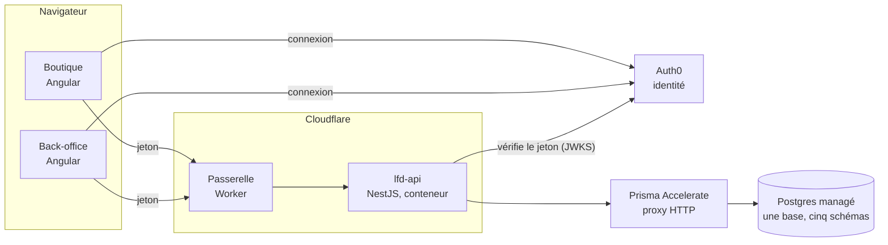
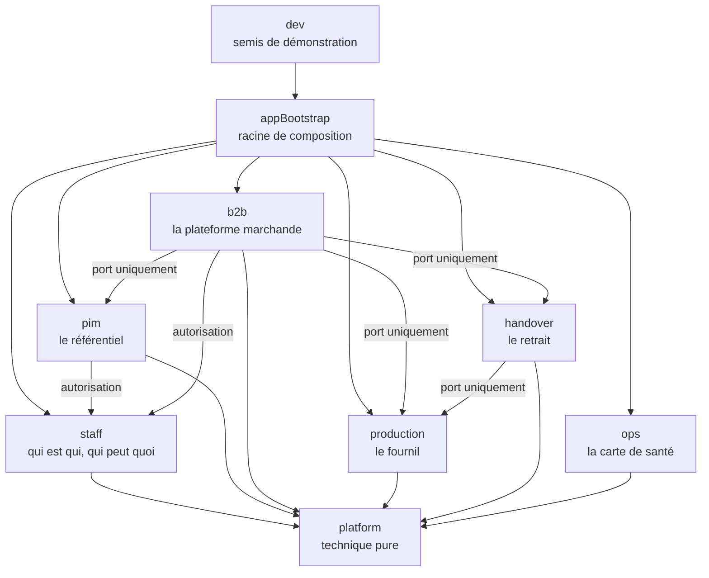
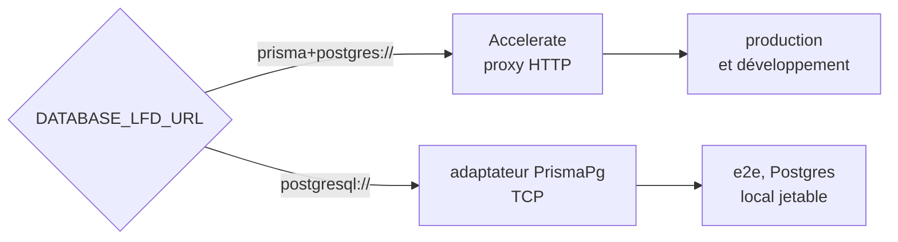
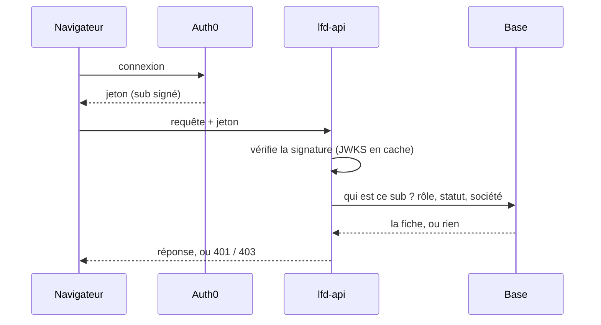

# Architecture Decision Records — le dépôt

> Une entrée par choix structurant qui engage **tout le monorepo** — les deux
> backends, les deux fronts, la passerelle. Les choix propres au référentiel
> (allergènes, agrégats du catalogue, SKU, canaux) vivent dans
> [`pim/adr.md`](pim/adr.md).
>
> **Forme d'une entrée** : la décision, sa raison, ce qu'elle implique au
> quotidien, puis son historique — ce qui a changé depuis qu'elle a été prise,
> daté. Une décision qu'on a cessé d'appliquer reste écrite : l'effacer ferait
> disparaître la question qui se reposera.
>
> **Numérotation partagée** avec `pim/adr.md`, pour que les citations
> existantes (`ADR-09`, `ADR-13`) restent vraies : 01–06, 08–10 et 12 ici ;
> 07, 11 et 13–17 là-bas.
>
> **Réécrit le 2026-09-19**, chaque affirmation confrontée au code ce jour-là.
> La version précédente (2026-09-13, née de la scission de `pim/adr.md`)
> empilait des bandeaux « la v1 disait… » : leur contenu est repris dans les
> historiques.

## Vue d'ensemble

Les deux fronts sont servis en statique par Cloudflare Pages. La passerelle est
le seul chemin public vers l'API (`gateway/`, `CLAUDE.md` en tête).

---

## ADR-01 — Monolithe modulaire, pas de microservices

**Décision.** Une seule application backend, découpée en **blocs** : un
dossier de premier niveau de `apps/lfd-api/src/` par bloc.

**Pourquoi.** L'échelle d'une boulangerie ne justifie pas la complexité
opérationnelle du distribué : réseau entre services, versions croisées,
transactions réparties. Des frontières nettes à l'intérieur d'un seul
processus gardent la porte ouverte à une extraction, le jour où un vrai
déclencheur apparaît (charge, autre runtime, consommateur externe).

**Ce que ça implique.** Neuf dossiers sous `src/` (vérifié le 2026-09-19) :

La matrice complète, avec les interdits, est dans `CLAUDE.md` §3 ; elle est
tenue par `lint:context-boundaries`. Deux règles à retenir : `platform` ne
connaît aucun métier, et `production → b2b` est interdit — le fournil déclare
ce dont il a besoin, le commerce l'implémente.

**Historique.**

- La première version citait des modules qui n'ont jamais existé sous ces noms
  (`catalogue`, `pricing`, `disponibilite-production`, `publication`).
- Au 2026-09-13, la matrice de `CLAUDE.md` ne nommait pas `handover`, `ops` ni
  `dev`, que la porte connaissait déjà ; elle les nomme depuis.

## ADR-02 — Un seul déployable pour l'API

**Décision.** L'API se déploie en **une unité** : une image de conteneur,
poussée sur Cloudflare Containers par `wrangler`
(`.github/workflows/deploy_lfd_api.yml`). Merger `dev` dans `main` déploie.

**Pourquoi.** Un seul artefact à construire, versionner et revenir en arrière.
Les migrations s'appliquent dans le même pipeline, avant la bascule.

**Ce que ça implique.**

- Il n'y a **aucune tâche planifiée dans l'API** : ni `ScheduleModule`, ni
  `@Cron`, ni worker séparé. Le travail périodique (recalculs) est déclenché
  **de l'extérieur**, par une route protégée d'un jeton (`RECOMPUTE_TOKEN`,
  `platform/auth/recompute.guard.ts`).
- Le conteneur doit rester **sans état** : rien sur le disque local qui doive
  survivre à un redémarrage.

**Historique.** La première version disait « un hôte qui tourne en continu
(Railway, Fly, Render, VPS), pas de serverless », au motif que des crons et un
worker de push supportent mal les timeouts. Ni les crons ni le worker n'ont
été construits, et l'hébergement est devenu Cloudflare. La décision « un seul
déployable » tient ; sa raison d'origine, non.

## ADR-03 — Angular devant, NestJS derrière, dans un monorepo

**Décision.** Fronts en **Angular** (testés avec Vitest), backend en
**NestJS** (testé avec Jest).

**Pourquoi.** Les modules de Nest épousent le découpage du domaine. Un front
SPA n'accède jamais à la base : la sécurité se tient côté serveur, par
construction.

**Ce que ça implique.**

- Les deux fronts se **déploient séparément** de l'API, en statique sur
  Cloudflare Pages (`deploy_lfc_boutique.yml`, `deploy_lfd_backoffice.yml`).
- L'API expose des **vues**, jamais un modèle Prisma.
- Les contrats partagés vivent **par domaine** — `@lfd/contracts`,
  `@lfd/pim-contracts`. Un paquet unique de types est **interdit**
  (`CLAUDE.md` §1) : il mélangerait deux langages métier (le `User` du
  référentiel est le staff, celui du B2B est le client).

**Historique.** La première version annonçait que « Nest sert le build
Angular » et une lib `shared-types` : ni l'un ni l'autre n'a existé, et le
second est désormais interdit.

## ADR-04 — Prisma comme ORM, SQL brut en échappatoire

**Décision.** **Prisma** pour l'accès aux données. Le SQL brut est réservé
aux agrégations et au `jsonb`.

**Pourquoi.** Migrations, relations typées et sécurité de type, plutôt
qu'une couche d'accès écrite à la main.

**Ce que ça implique.** C'est **le schéma de l'URL qui choisit le transport**
(`platform/database/prisma.service.ts`) :

Accelerate étant un proxy HTTP, **`psql` et `pg_dump` ne le traversent pas**,
et `$connect()` y est paresseux : il ne prouve pas que la base répond. C'est
ce qui a dicté la forme de `prisma/clone-dev.ts`. Le client généré vit dans
`src/platform/database/client/`, hors de git (régénéré au `postinstall`).

**Historique.** La première version ne nommait que l'adaptateur `pg`
(« TCP + pool, cohérent avec le long-running »), et un dossier
`src/infra/database/client/` qui n'a jamais existé.

## ADR-05 — PostgreSQL pour tout, catalogue compris

**Décision.** **Une seule base PostgreSQL**, découpée en **schémas**, avec
du `jsonb` pour les parties réellement variables (`options`, `attributes`,
`snapshot`, `diff`).

**Pourquoi.** Le domaine est relationnel : jointures, agrégations,
intégrité. Le catalogue est le point où tout se rattache ; le mettre dans un
second store créerait des cohérences inter-bases à tenir à la main.

**Ce que ça implique.** Cinq schémas (`prisma/schema/datasource.prisma`,
vérifié le 2026-09-19) : `public` (commerce), `growth` (croissance et
journal), `ops`, `pim`, `production`. `AppConfig` ne lit qu'une URL.

La conséquence qui compte : une jointure `b2b → pim` **marcherait**. Elle
reste interdite, mais par discipline et par porte (`lint:cross-schema-join`,
`lint:prisma-model-ownership`), plus par la physique (`CLAUDE.md` §1).

**Historique.** Le référentiel a eu sa propre base ; il l'a perdue lors de la
fusion en une seule (étape B4).

## ADR-06 — Postgres managé

**Décision.** Un Postgres **managé**, plutôt qu'une instance tenue à la main.

**Pourquoi.** Sauvegardes et haute disponibilité déléguées, pour des volumes
très en deçà de ce qui se facture.

**Ce que ça implique.** La portabilité tient par Prisma (ADR-04) : changer
d'hébergeur, c'est restaurer une sauvegarde et changer une URL. Mais depuis ce
dépôt, la base de production n'est joignable **que par Accelerate** : un
`pg_dump` passe par l'URL directe de l'hébergeur, hors du dépôt.

**Historique.** La première version citait `pg_dump` comme geste de
portabilité à portée de commande ; Accelerate l'a rendu faux depuis ce dépôt.

## ADR-08 — Monorepo pnpm + Turborepo, pas Nx

**Décision.** **pnpm workspaces + Turborepo.** Les applications sont
générées par les CLI officiels (`ng new`, `nest new`).

**Pourquoi.** Tout est dans `package.json` et `turbo.json`, donc greppable :
pas de cible inférée. Et aucune friction avec le découpage TypeScript
d'Angular, que Nx bouscule.

**Ce que ça implique.**

- `turbo run <tâche> --filter=…`, et des configurations WebStorm dans `.run/`.
- Toute dépendance partagée par deux paquets vit dans le `catalog:` de
  `pnpm-workspace.yaml`, épinglée exactement (`lint:catalog-shared-deps`,
  `CLAUDE.md` §6).
- Un succès **mis en cache** par turbo ne prouve rien sur un paquet touché :
  chercher `cache miss, executing` (`CLAUDE.md` §9 bis).

## ADR-09 — L'hébergeur de la base

**Décision.** Aucune, à ce jour — et c'est écrit plutôt que deviné.

**Pourquoi.** La première version nommait Neon. L'URL de production est une
URL Accelerate, qui masque l'hébergeur réel, et rien dans le code, les
workflows ou les migrations ne le nomme (vérifié le 2026-09-13).

**Ce qui reste vrai quel que soit le fournisseur** : un modèle facturé à
l'opération pénalise le travail de fond, là où un modèle au temps de calcul le
tolère. Prisma parlant à n'importe quel Postgres, la bascule reste ouverte.

**À faire.** Nommer l'hébergeur ici, ou écrire qu'on ne le documente pas dans
le dépôt.

## ADR-10 — Backend en ESM, flags TypeScript stricts partagés

**Décision.** Backend en **ESM** (`"type": "module"`, imports en `.js`,
résolution NodeNext). Les flags stricts sont posés en deux couches :
[`tsconfig.base.json`](../tsconfig.base.json) pour tout le monorepo, puis
[`tsconfig/tsflags.backend.json`](../tsconfig/tsflags.backend.json) pour ce
qui est propre à Node et Nest.

**Pourquoi.** `verbatimModuleSyntax` impose l'ESM ; les flags forcent à
traiter `undefined` et le hors-borne explicitement, donc moins de pannes
silencieuses.

**Ce qui est durci** :

| Flag                                            | Ce qu'il change                                                                                    |
| ----------------------------------------------- | -------------------------------------------------------------------------------------------------- |
| `exactOptionalPropertyTypes`                    | `{a?: T}` n'est plus `{a: T \| undefined}` : une clé posée à `undefined` n'est pas une clé absente |
| `noUncheckedIndexedAccess` (backend)            | un accès indexé rend `T \| undefined`                                                              |
| `noImplicitReturns`, `allowUnusedLabels: false` | deux trous que `strict` ne couvre pas                                                              |
| les flags de `strict`, épinglés un à un         | l'intention survit à une couche enfant qui toucherait `strict`                                     |

**Écartés délibérément** : `erasableSyntaxOnly`, qui interdit les
_parameter properties_ (`constructor(private readonly x: X)`) et casserait
Nest de fond en comble ; `isolatedDeclarations`, dont le gain vise une
bibliothèque publiée.

**Ce que ça implique.**

- Les tests backend tournent en ESM (`--experimental-vm-modules`), parce que
  le client Prisma généré emploie `import.meta`.
- **esbuild n'émet pas `emitDecoratorMetadata`** : tout script qui démarre
  l'`AppModule` passe par `tsc`, jamais par `tsx` (`apps/lfd-api/tsconfig.seed.json`).
  C'est ce qui a fait échouer `mercuriale:import` à son premier lancement.
- TypeScript reste en 6.x : la 7.0 n'a pas encore d'API programmatique, dont
  dépendent `nest build`, ts-jest et ESLint (`CLAUDE.md` §6).

## ADR-12 — Authentification déléguée à Auth0, vérifiée avec `jose`

**Décision.** L'authentification est **déléguée à Auth0** (OIDC). L'API
valide les jetons **JWT RS256** contre le **JWKS** du tenant avec **`jose`**,
pas Passport. Le garde est un `APP_GUARD` : l'API est **fermée par défaut** et
s'ouvre explicitement avec `@Public()`.

**Pourquoi.** Connexion, réinitialisation, MFA, connexion sociale : du travail
non différenciant. `jose` est ESM natif (ADR-10) et typé, sans l'échafaudage
de Passport.

**Ce que ça implique.** Le jeton n'atteste **que l'identité** ; tout le reste
se relit en base, à chaque requête :

- **La base est autoritaire.** Un compte désactivé est bloqué à la requête
  suivante, pas à l'expiration du jeton, et aucun claim forgé n'élargit la
  portée.
- **Le `sub` ne sort pas de la frontière d'identité.** Côté staff, la garde
  le traduit en **id de fiche**, et c'est cette fiche qui est l'auteur de tout
  ce qui s'écrit ensuite — journal compris
  ([`journalisation/architecture-journalisation.md`](journalisation/architecture-journalisation.md) §12).
  Deux portes le tiennent : `lint:subject-readers` et `lint:auth0-id-readers`.
- `AUTH0_DOMAIN` et `AUTH0_AUDIENCE` sont obligatoires : l'API **refuse de
  démarrer** sans, parce qu'une configuration incomplète validerait des jetons
  contre le mauvais émetteur.
- Le JWKS est résolu paresseusement et mis en cache par `jose` : aucun appel
  réseau au démarrage.

**Historique.**

- La première version renvoyait à « une table interne à créer » : elle existe
  (`StaffUser`) depuis, et la résolution du principal passe par elle.
- Elle disait aussi que « l'acteur d'un fait n'est qu'un `sub` vérifié ».
  C'était vrai jusqu'au 2026-09-18 ; depuis, l'auteur est la fiche, et le
  `sub` ne s'écrit plus que dans les tables d'identité (la fiche et la table
  de ses `sub`).
