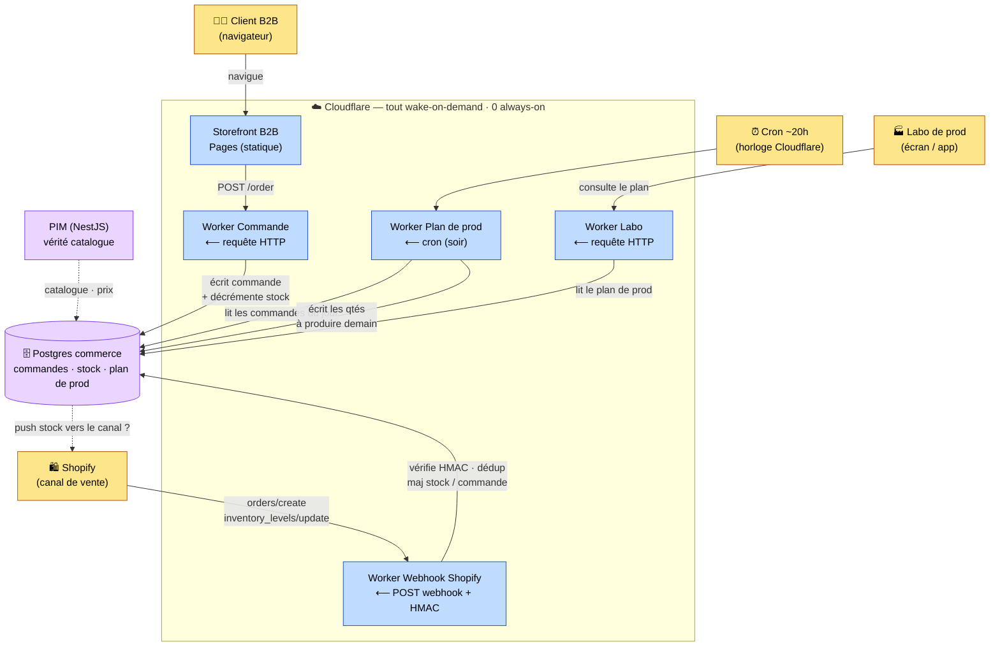

# Flux commande → stock → plan de prod (0 always-on)

Principe : **rien ne tourne en continu**. Chaque brique est **toujours joignable**
mais **jamais allumée** — elle se réveille sur un déclencheur (requête HTTP,
webhook Shopify, ou horloge), traite, puis se rendort. Aucun serveur ne se paie à
l'idle.

## Qui réveille qui

| Brique             | Déclencheur              | Fait quoi                                                  | Allumé ? |
| ------------------ | ------------------------ | --------------------------------------------------------- | -------- |
| Storefront (Pages) | —                        | sert le SPA statique                                       | non (CDN) |
| Worker Commande    | requête HTTP du client   | écrit la commande, décrémente le stock                    | **non**  |
| Worker Webhook     | POST webhook de Shopify  | vérifie HMAC, déduplique, met à jour stock/commande       | **non**  |
| Worker Plan de prod| cron (le soir)           | agrège les commandes du jour → qtés à produire demain     | **non**  |
| Worker Labo        | requête HTTP du labo     | lit et renvoie le plan de prod                            | **non**  |

## Les 4 garde-fous webhook (sinon stock faux)

1. **HMAC** — vérifier `X-Shopify-Hmac-Sha256` (sinon n'importe qui fausse le stock).
2. **Ack < 5 s** — répondre 200 vite ; boulot lourd → asynchrone (DB puis cron/queue).
3. **Idempotence** — at-least-once : dédupliquer par id d'évènement/commande (sinon double décompte).
4. **Pas d'ordre garanti** — préférer les **valeurs autoritaires** de Shopify aux deltas.

## Décisions encore ouvertes (à trancher avant de coder)

- **Source de vérité du stock** : Shopify (on mirror ses `inventory_levels`) **ou**
  notre système (Shopify = simple canal, on **pousse** le stock vers lui). Pour une
  boulangerie qui produit à la demande, le « stock » ≈ capacité à produire → penche
  pour « notre système est la vérité ».
- **Plan de prod : cron nightly (gratuit) vs Queues temps réel (~5 $/mois)**. « Pour
  demain » = batch → le cron suffit. Queues seulement si le labo veut un compteur live.
- **Où atterrissent les webhooks Shopify** : un nouveau Worker, **ou** le PIM NestJS
  existant (qui fait déjà la sync Shopify). Le pattern « webhook réveille un handler »
  marche dans les deux cas.

## Modèle de messagerie : point-to-point + batch, **pas** pub/sub

Choix acté : la communication entre briques se fait par **webhooks (push HTTP)**,
**Cloudflare Queues (file point-to-point + retry)** et **cron (pull/batch)** — et
**pas** par du pub/sub. Les 3 modèles :

| Modèle              | Qui → qui                                         | Ici                                        |
| ------------------- | ------------------------------------------------- | ------------------------------------------ |
| Point-to-point      | 1 producteur → cible(s) **connue(s)**, hand-off   | Shopify → endpoint ; Commande → Notif (Queue) |
| **Pub/sub**         | 1 producteur → **N abonnés inconnus**, broadcast  | **non retenu**                             |
| Pull / batch        | on **lit** un état partagé, personne ne pousse    | le cron du soir relit les commandes        |

**Pourquoi pas pub/sub :**

- Nos réactions sont **connues et peu nombreuses** (notifier, décrémenter stock,
  maj prod) — le découplage broadcast du pub/sub ne se rentabilise qu'avec
  **beaucoup d'abonnés évolutifs**, pas notre cas.
- Le pub/sub classique (Redis pub/sub, NATS, MQTT) impose un **broker always-on**
  → il **réintroduit le serveur allumé 24/7 qu'on fuit**. Webhook + Queue reste
  **serverless, sans broker**.
- Cloudflare n'a de toute façon pas de pub/sub broadcast GA : le « bus »
  serverless natif est **Queues** (une queue → **un** Worker consommateur), qui
  donne déjà **découplage + fiabilité + retry** sans broker.

**Si un jour un évènement doit déclencher N réactions** (imiter le fan-out sans
pub/sub) : enqueue dans **plusieurs queues** (une par réaction), **ou** un **Worker
dispatcher** qui appelle les handlers concernés, **ou** un seul consommateur qui
fait les N réactions.

## Panier — persistance & trajectoire

- **Maintenant (fait)** : le panier est un **brouillon client**, persisté en
  **localStorage réactif** (écrit à chaque mutation, ré-hydraté à l'init du
  singleton `CartService`). On ne persiste que la source de vérité `id→qty` ;
  prix/lignes/total sont dérivés et re-résolus. Survit reload / fermeture d'onglet
  / navigation. **Par appareil.** La `Order` (validée) est la seule chose en
  Postgres — jamais le brouillon.
- **📌 NOTE — avant launch, si voulu : « cart Redis » multi-appareil.** Le pattern
  des concurrents multi-plateformes = **cart serveur** (Redis actif → `Order` en
  DB au checkout) + **merge-on-login** du panier device dans le panier user.
  Choisir **Upstash Redis** (serverless, free tier, TTL, edge-compatible) — **pas**
  un Redis always-on. **Jamais** le brouillon en Postgres (churny → brûle
  ops/compute). La **surface de `CartService` ne change pas** : seule la couche
  persistance (localStorage → API cart) + l'étape merge-on-login. Décision : à
  trancher avant launch selon le besoin cross-device / 2ᵉ plateforme.

## Coût

- Chemin **tout Workers + cron** : **0 €** (Workers free + Cron Triggers gratuits).
- Ajouter **Queues** (temps réel) : **~5 $/mois** (Workers Paid).
- Aucune brique always-on à payer.
