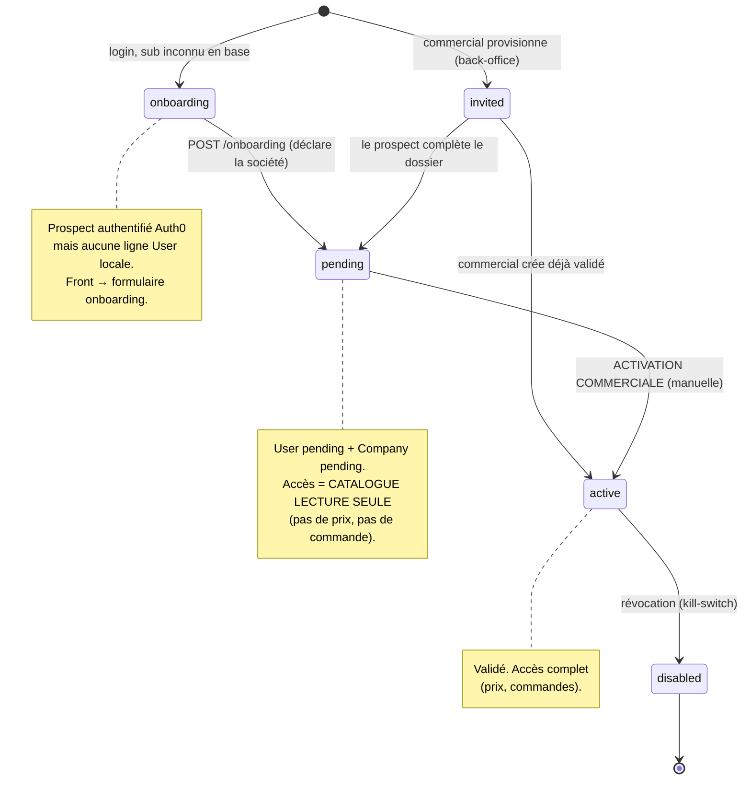
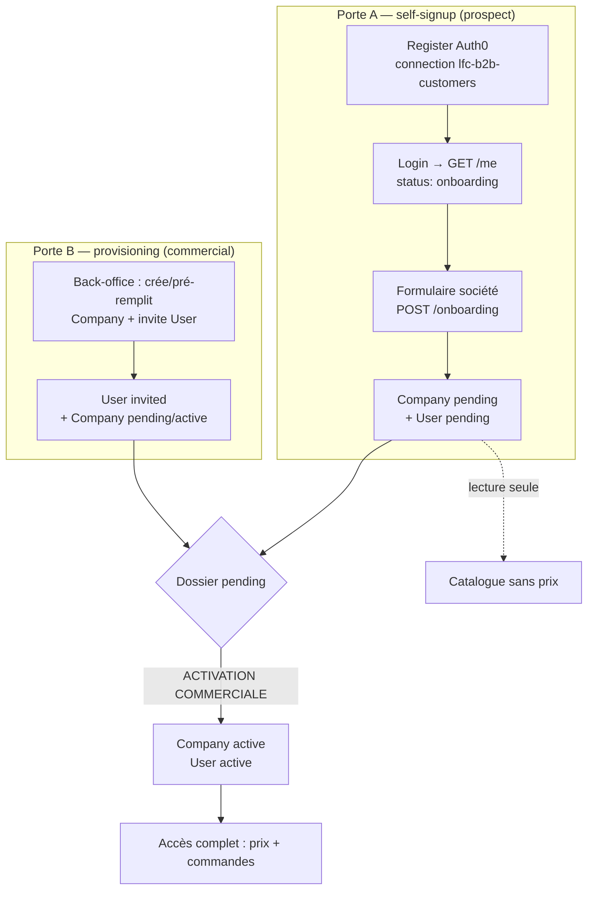

# Onboarding & provisioning B2B — design

> Comment un client entre dans la plateforme B2B. **Deux portes d'entrée, un
> seul pipeline** : le prospect s'inscrit seul **et** le commercial provisionne —
> les deux alimentent le même dossier, validé manuellement côté commercial.
>
> Décidé le **2026-07-29**. Prérequis lus : [`architecture-identite-auth-tenancy.md`](architecture-identite-auth-tenancy.md)
> (Auth0 = auth, DB = identité/authz, mur `company_id`) et
> [`auth0-setup-b2b.md`](auth0-setup-b2b.md) (config tenant). **Statut : design,
> pas encore implémenté.**

---

## 1. Le principe : signup ≠ accès client

Rappel du modèle DB-autoritaire : Auth0 prouve « tu possèdes cet email »
(`sub`) ; **notre** base décide « tu es client de telle société, avec tel
accès ». Un `register` Auth0 crée un utilisateur **dans Auth0**, jamais dans
notre Postgres.

En B2B de gros, devenir « client » = **une société** avec conditions négociées
(délais de paiement, grille tarifaire, TVA). On ne laisse donc pas un email
s'auto-attribuer une société et l'accès commande. Le self-signup est **autorisé**
mais **gated** : il produit un **dossier en attente**, pas un client actif.

---

## 2. Décisions (verrouillées 2026-07-29)

| Sujet | Décision |
|-------|----------|
| Self-signup autorisé ? | **Oui** — le prospect peut s'inscrire seul. |
| Accès d'un compte **non validé** (`pending`) | **Catalogue en lecture seule** — parcourt le catalogue **sans prix ni commande** tant qu'il n'est pas activé. |
| Infos société collectées quand ? | **Au signup** — un formulaire d'onboarding crée une `Company` en état `pending` (raison sociale, SIRET, TVA, contact) déclarée par le prospect. |
| Activation `pending → active` | **Manuelle, côté commercial** (« activation commerciale »). Jamais automatique. |
| Gestion du dossier | **Par les deux bouts** — le prospect le déclare/complète ; le commercial peut aussi l'initier, le pré-remplir, le corriger. Seule la **validation** est réservée au commercial. |
| Connection Auth0 | Une connection dédiée **`lfc-b2b-customers`** (isolée des autres apps du tenant), activée seulement sur l'app SPA B2B. |

---

## 3. Machine à états

Un **User** local et sa **Company** portent chacun un statut. Le « pas de ligne
en base » (sub Auth0 connu, aucun `User` chez nous) est un état à part entière :
`onboarding`.

**User.status** : `invited` (créé par le commercial, pas encore de dossier
complété) · `pending` (dossier déclaré, en attente de validation) · `active`
(validé) · `disabled` (révoqué). **Company.status** : `pending` (déclarée, pas
validée) · `active` (validée) · `suspended` (plus tard).

> `onboarding` n'est PAS un `User.status` : c'est l'**absence** de ligne `User`
> pour un `sub` Auth0 valide. Le premier `POST /onboarding` matérialise la ligne.

---

## 4. Les deux portes → un pipeline

Le **dossier** = la `Company` (pending) + son/ses `User`. Les deux bouts lisent
et écrivent ce dossier ; la transition `pending → active` est **commerciale**.

---

## 5. Contrat `GET /me` — état d'accès discriminé

Aujourd'hui `/me` renvoie un `Principal` plat ou `401`. On le fait évoluer vers
un **état d'accès** discriminé par `status`, qui pilote le routage front :

| Cas backend | Réponse `/me` | Front |
|-------------|---------------|-------|
| Token valide, **aucune** ligne `User` | `200 { status: "onboarding" }` | Formulaire d'onboarding |
| `User.status = pending` | `200 { status: "pending", user, company }` | Catalogue lecture seule (bandeau « en cours de validation ») |
| `User.status = active` | `200 { status: "active", ...principal }` | App complète |
| `User.status = disabled` | `401` | Retour login (révocation) |

La **garde** de sécurité reste inchangée (un token valide = authentifié) ;
l'`état d'accès` n'est qu'une **autorisation applicative**, portée par la base.
Le resolver ne rejette plus « sub inconnu » : il renvoie `onboarding`.

---

## 6. Endpoints (backend B2B)

| Méthode | But | Auteur | Effet |
|---------|-----|--------|-------|
| `GET /me` | état d'accès | user connecté | lecture (cf. §5) |
| `POST /onboarding` | déclarer sa société | prospect (`onboarding`) | crée `Company(pending)` + `User(pending)`, lie `sub`+email ; idempotent par `sub` |
| `POST /companies/:id/activate` | **activation commerciale** | commercial (back-office) | `Company → active`, ses `User pending → active` |
| `POST /companies` · `POST /invitations` | provisioning porte B | commercial (back-office) | crée le dossier / invite (porte B) |

Le catalogue en lecture seule pour `pending` se gate **des deux côtés** : le
backend ne sert pas les prix et refuse toute création de commande à un non-`active`
(invariant), le front masque prix/commande.

> Les endpoints commerciaux (`/companies/*`, `/invitations`) vivent dans le
> **back-office staff** (contexte séparé, DB staff) — pas dans l'API customer.
> Voir la frontière staff/customer de [`architecture-identite-auth-tenancy.md`](architecture-identite-auth-tenancy.md).

---

## 7. Plan d'implémentation (phases)

- **Phase 0 — Auth0** *(toi, dashboard)* : connection dédiée `lfc-b2b-customers`,
  activée seulement sur l'app SPA B2B ; ouvrir les sign-ups sur cette connection.
- **Phase 1 — backend model** : ajouter `pending` à `CompanyStatus`/`UserStatus` ;
  resolver → renvoie `onboarding` au lieu de rejeter ; contrat `/me` discriminé ;
  `POST /onboarding` (crée Company+User pending) ; invariant « commande réservée
  aux `active` ». Tests colocalisés.
- **Phase 2 — frontend** : router sur l'état d'accès — écran onboarding
  (formulaire société), catalogue lecture seule + bandeau pour `pending`, app
  complète pour `active`.
- **Phase 3 — back-office (porte B + activation)** : app staff — liste des
  dossiers `pending`, validation (activation commerciale), création/invitation.
  Contexte + DB séparés ; vient après.

---

## 8. Points ouverts

- **Company en lecture seule pour `pending`** : catalogue visible **sans prix**,
  ou avec prix « publics » indicatifs ? (défaut retenu : **sans prix**.)
- **Un prospect = une nouvelle Company** systématiquement, ou possibilité de
  **rejoindre une Company existante** (2ᵉ user d'une même société) ? Le self-signup
  crée par défaut une nouvelle société ; le rattachement d'un collègue à une
  société déjà cliente est un flux distinct (invitation intra-société, plus tard).
- **Dé-duplication SIRET** : deux prospects déclarant le même SIRET → fusion /
  alerte côté commercial à la validation (non tranché).
