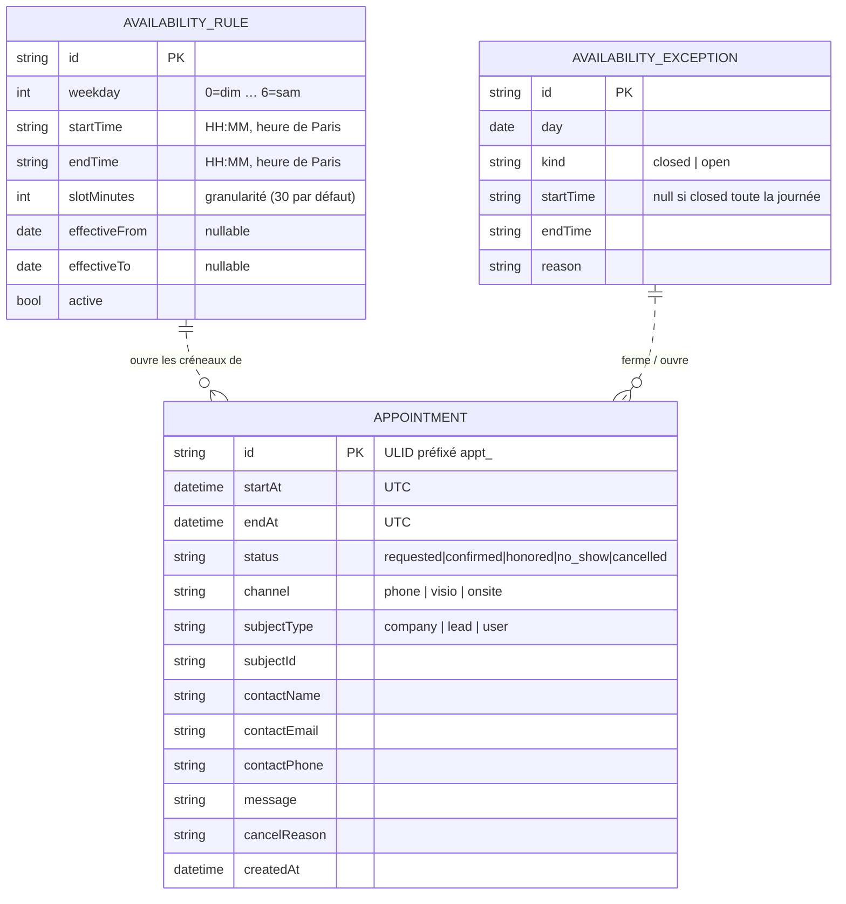
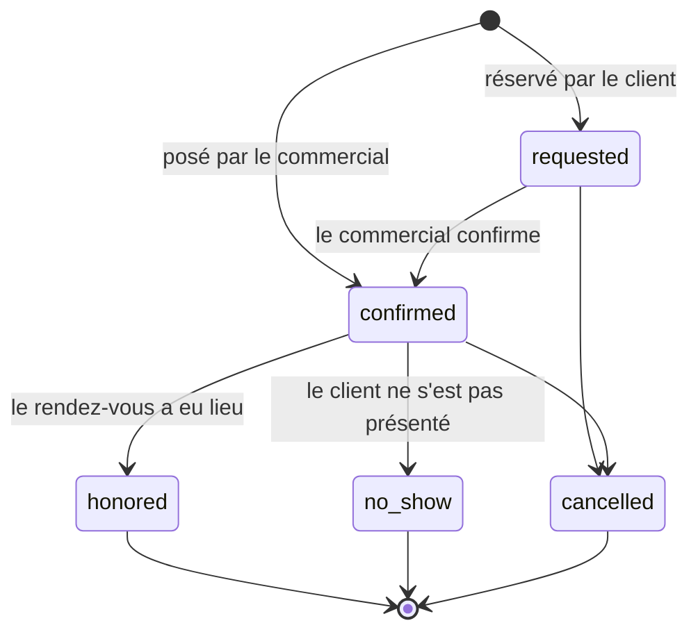
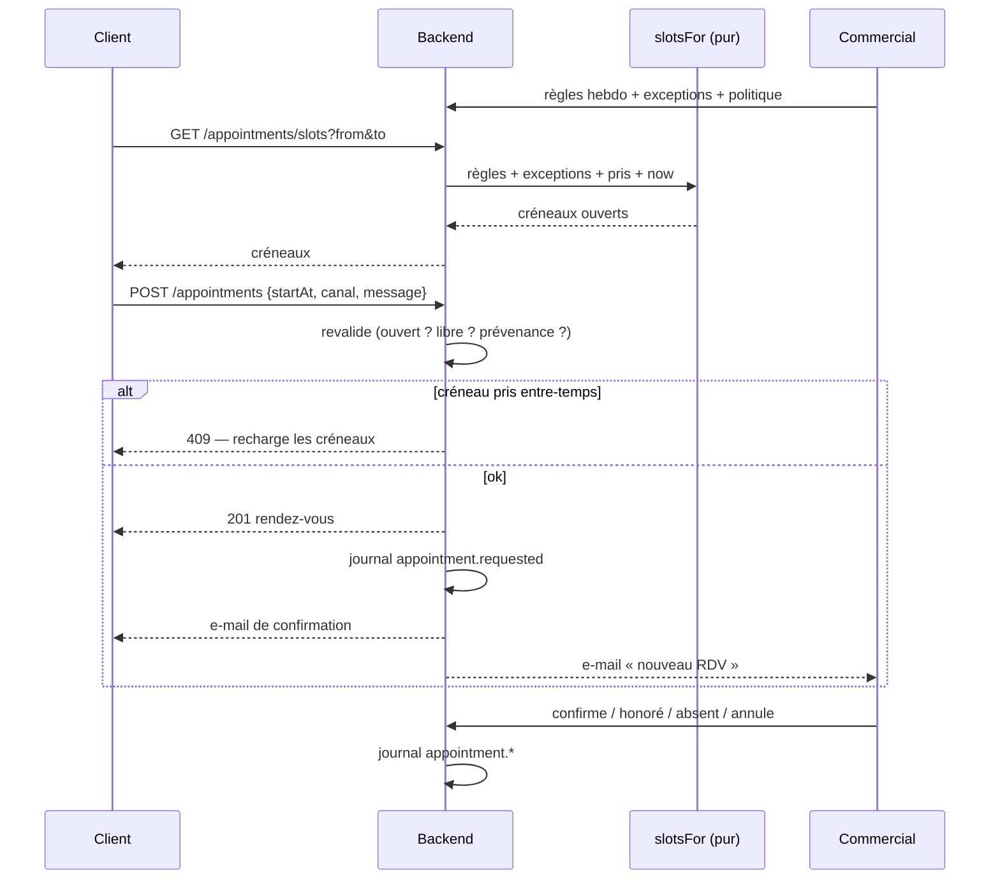

# Prise de rendez-vous — disponibilités commerciales, réservation client, suivi staff

> **Doc-first.** Rien de ce qui suit n'est implémenté. Ce document fige le modèle,
> les invariants et la découpe **avant** d'écrire une ligne de code.
>
> Contexte de release : [`release-acquisition-commerciale.md`](release-acquisition-commerciale.md)
> (§3 « Le trou central » et Lot 1 — ce document **remplace** et précise ce lot).
> Garde-fous d'architecture : [`espace-commercial-prospects-leads-todo-tech.md`](espace-commercial-prospects-leads-todo-tech.md).

---

## 1. Ce qu'on veut, en une phrase

**Le commercial déclare quand il est disponible ; le client réserve un créneau
réel ; les deux voient le même rendez-vous, et il se clôt.**

Aujourd'hui aucune des trois moitiés n'existe : le client propose une date et une
demi-journée dans le vide, le staff ne voit qu'un booléen, et rien ne se clôt
(cf. release §3.3).

---

## 2. Les trois décisions structurantes

### 2.1 La disponibilité est une **règle**, pas une liste de créneaux

Deux modèles possibles :

| Approche                                                 | Ce que ça donne                                                                                                                                                                     |
| -------------------------------------------------------- | ----------------------------------------------------------------------------------------------------------------------------------------------------------------------------------- |
| **Créneaux matérialisés** — une ligne par créneau ouvert | Il faut générer d'avance (jusqu'à quand ?), régénérer à chaque changement d'horaire, et purger. La table grossit sans fin pour des créneaux que personne ne réservera.              |
| **Règles + exceptions, créneaux dérivés** ✅             | Deux petites tables stables. Les créneaux se **calculent** pour la fenêtre demandée, par une **fonction pure** testable sans I/O. Changer un horaire est un `UPDATE` sur une ligne. |

On prend la seconde. Elle colle au reste du projet : le domaine calcule, l'infra
lit. Elle donne aussi gratuitement la propriété qui compte — **il n'existe pas de
« créneau » persisté qu'on pourrait désynchroniser de l'horaire réel**.

```
disponibilité affichée = règles hebdo
                       − exceptions (fermetures)
                       + exceptions (ouvertures ponctuelles)
                       − rendez-vous déjà pris
                       − délai de prévenance
                       ∩ horizon de réservation
```

### 2.2 Un rendez-vous est un **agrégat**, une demande de contact n'en est pas un

Test de tri (§3.1 des conventions) : _une règle peut-elle refuser cette écriture ?_

- **Rendez-vous** → oui. Le créneau est déjà pris, il est hors disponibilité, il
  est dans le passé, il est sous le délai de prévenance. **Invariants réfutables
  ⇒ agrégat `load/save`.**
- **Demande de contact** (« rappelez-moi quand vous pouvez », « répondez-moi par
  e-mail ») → non. Aucune exclusivité, aucune capacité. Ça reste une écriture
  simple.

Donc **deux objets, un seul écran** : le `SupportRequest` existant garde les
chemins **non datés** (canal e-mail, rappel au plus vite) ; le nouvel
`Appointment` porte les créneaux réservés. Tous deux alimentent la même file
« à traiter » du commercial.

> Fusionner les deux dans un seul modèle « demande avec date optionnelle » — ce
> qu'on a aujourd'hui — c'est précisément ce qui a produit un objet sans
> invariant, jamais clos, et une bande de calendrier qui ne veut rien dire.

### 2.3 Le rendez-vous n'est **pas muré par la société**

`SupportRequest` porte un `company_id` obligatoire : un prospect froid, qui n'a
pas encore de société déclarée, ne peut pas prendre rendez-vous. C'est exactement
la population qu'on veut capter.

`Appointment` porte donc un **sujet discriminé**, nullable côté société :

```
subject = { type: "company" | "lead" | "user", id }
```

L'accès en écriture se garde par le contexte d'appel (membre de la société / lead
staff / titulaire du compte), pas par une colonne obligatoire.

---

## 3. Le modèle



Schéma Prisma : `growth` (le rendez-vous est un outil commercial, pas un objet du
compte client). Trois tables : `availability_rules`, `availability_exceptions`,
`appointments`.

**Pas de `staff_user_id` en v1** — voir §7.1. On l'ajoutera quand il y aura un
deuxième commercial ; l'ajouter maintenant serait une dimension qu'on ne sait pas
remplir (l'identité staff n'est pas dans le jeton aujourd'hui).

### 3.1 L'exclusivité du créneau

Un créneau ne se réserve qu'une fois. Ça ne peut pas être garanti par du code
applicatif seul : deux requêtes concurrentes passeraient toutes deux la
vérification avant que l'une n'écrive.

**Index unique partiel, posé en SQL brut dans la migration** (Prisma ne sait pas
modéliser un index conditionnel, mais la migration est du SQL — on l'écrit à la
main, avec le commentaire qui explique pourquoi) :

```sql
CREATE UNIQUE INDEX appointments_slot_unique
  ON growth.appointments (start_at)
  WHERE status <> 'cancelled';
```

Un rendez-vous annulé **libère** son créneau ; un rendez-vous actif le verrouille.
La violation de contrainte se traduit en `SlotAlreadyTakenError` → **409**, pas un 500. Le front recharge les créneaux et le dit.

### 3.2 Le temps

Aligné sur la décision déjà prise pour le journal :

- **Stockage en UTC** (`Instant`), toujours.
- **Règles exprimées en heure locale** (`weekday` + `HH:MM` Europe/Paris) : c'est
  ce que le commercial saisit et pense. La résolution local → instant se fait **au
  calcul**, donc le passage à l'heure d'été ne décale rien.
- Un seul `now`, celui du `Clock` (RequestContext). `new Date()` interdit hors
  adaptateur.
- Les bornes (délai de prévenance, horizon) se comptent depuis ce `now`.

---

## 4. Le domaine — une fonction pure au centre

```ts
// growth/domain/availability.ts
export function slotsFor(
  range: { from: string; to: string }, // jours ISO, Europe/Paris
  rules: readonly AvailabilityRule[],
  exceptions: readonly AvailabilityException[],
  taken: readonly { startAt: Date; endAt: Date }[],
  policy: BookingPolicy, // prévenance, horizon, durée
  now: Date,
): readonly Slot[];
```

Déterministe, sans I/O, testable au `FixedClock`. C'est le cœur : **le client et
l'admin lisent la même fonction**, donc ils ne peuvent pas afficher deux vérités.

Les cas qui doivent avoir un test nommé :

| Cas                                               | Attendu                             |
| ------------------------------------------------- | ----------------------------------- |
| Règle 9h–12h, pas de 30 min                       | 6 créneaux                          |
| Exception `closed` sur la journée                 | 0 créneau ce jour                   |
| Exception `open` hors règle (samedi exceptionnel) | les créneaux du samedi apparaissent |
| Un rendez-vous pris à 10h00                       | 10h00 disparaît, 10h30 reste        |
| Délai de prévenance 24 h                          | rien avant `now + 24 h`             |
| Horizon 30 jours                                  | rien après `now + 30 j`             |
| Changement d'heure (dernier dimanche d'octobre)   | 9h locale reste 9h locale           |
| Règle `effectiveTo` dépassée                      | la règle ne produit plus rien       |

### 4.1 L'agrégat `Appointment`

Machine à états explicite, terminaux clos :



Invariants portés par l'agrégat :

1. On ne réserve **jamais** dans le passé, ni sous le délai de prévenance.
2. On ne réserve que sur un créneau **effectivement ouvert** (revérifié serveur —
   la liste envoyée au client peut avoir vieilli).
3. Les états terminaux (`honored`, `no_show`, `cancelled`) sont **définitifs** :
   pas de retour arrière. Reprogrammer, c'est **annuler + créer**, avec le lien
   `rescheduledFromId` pour garder la trace.
4. Une annulation exige un motif quand elle vient du staff (c'est ce qui rendra
   le taux d'annulation lisible plus tard).

### 4.2 Le journal

Cinq événements, sur le modèle des autres (`idempotencyKey` sur l'id + la
transition) :

`appointment.requested` · `appointment.confirmed` · `appointment.cancelled` ·
`appointment.honored` · `appointment.no_show`

Bénéfice de bord non négligeable : `honored` / `no_show` **sont** les
`outcome.logged` de la Phase 2 pour la motion « rendez-vous ». La boucle fermée
`reco.shown → action → outcome` se boucle pour la première fois, sans travail
supplémentaire.

---

## 5. Côté admin — le commercial

### 5.1 Réglages → Commercial → **Disponibilités**

Trois blocs sur la sous-page existante ([`reglages/commercial`](../apps/lfc-B2B-admin-frontend/src/app/reglages/commercial/reglages-commercial-page.ts)),
à côté d'« Alertes acquisition » et « Marché ciblé » :

**a) Grille hebdomadaire.** Une ligne par jour, chaque ligne portant 0..N plages
(`09:00–12:00`, `14:00–17:30`). Ajouter/retirer une plage, la dupliquer sur les
autres jours. C'est le geste principal : il doit tenir en quelques secondes.

**b) Politique de réservation.** Durée du rendez-vous (défaut 30 min), délai de
prévenance (défaut 24 h), horizon de réservation (défaut 30 j), canaux proposés
au client (téléphone / visio / sur place). Stocké avec le reste dans
`platform_settings` — **pas** en `localStorage`, contrairement aux seuils
d'acquisition actuels (release P1-8).

**c) Exceptions.** Fermetures (congés, jour férié) et ouvertures ponctuelles
(un samedi de salon). Saisie à la date, avec un motif libre.

Sous les trois : un **aperçu des 14 prochains jours** rendu par la _même_ fonction
`slotsFor` que le client. On voit immédiatement ce qu'on vient d'ouvrir.

### 5.2 Onglet Acquisition — les rendez-vous deviennent réels

Le calendrier existant gagne une **quatrième source** (`rdv`), et cette fois
c'est un vrai événement :

- posé **au jour et à l'heure** du rendez-vous, pas une bande depuis `createdAt` ;
- ton par état : `requested` (à confirmer, ambre) · `confirmed` (neutre/accent) ·
  `honored` (succès) · `no_show` (alerte) ;
- la source `attente` actuelle est conservée telle quelle — elle mesure autre
  chose (l'ancienneté d'un dossier non activé).

Le clic **ouvre enfin quelque chose** (release P0-4) : un side-panel portant le
détail (contact, canal, numéro, message, sujet lié) et les actions —
**Confirmer**, **Honoré**, **Absent**, **Annuler**, **Reprogrammer**.

La vue **semaine** de `fold-calendar` devient la vue par défaut de cet onglet :
c'est celle où un agenda de rendez-vous se lit.

### 5.3 Poser un rendez-vous soi-même

Depuis la fiche client, depuis une ligne de Prospects, ou depuis le cockpit : le
commercial crée un rendez-vous directement en `confirmed` (il vient de l'avoir au
téléphone). Le créneau reste soumis à l'exclusivité (§3.1) mais **pas** au délai
de prévenance : c'est lui qui décide de son agenda.

---

## 6. Côté client — la réservation

### 6.1 Le panneau de prise de rendez-vous

Le panneau existant ([`activation-support-panel`](../apps/lfc-B2B-platform-frontend/src/app/entreprises/activation-support-panel/activation-support-panel.ts))
garde sa structure, mais le bloc « créneau » change de nature :

| Aujourd'hui                                               | Demain                                                      |
| --------------------------------------------------------- | ----------------------------------------------------------- |
| `<input type="date">` libre + `<select>` matin/après-midi | Liste des **créneaux réellement ouverts**, groupés par jour |
| Le client propose, personne ne répond                     | Le client **réserve**, il a un rendez-vous                  |
| Aucune vérification                                       | Créneau revalidé serveur (409 si pris entre-temps)          |

Les deux autres chemins restent, et c'est important — tout le monde ne veut pas
choisir une case :

- **« Au plus vite »** → pré-sélectionne le premier créneau disponible, modifiable.
  Si aucune disponibilité n'est ouverte, retombe sur une `SupportRequest` (« on
  vous rappelle »), qui reste utile.
- **« Par e-mail »** → `SupportRequest`, pas de créneau. Inchangé.

### 6.2 Après la réservation

- Écran de confirmation avec la date, l'heure, le canal, et **comment annuler**.
- Un rendez-vous à venir est visible et **annulable/reprogrammable par le client**
  jusqu'au délai de prévenance — sinon il appelle. Sans ça, chaque changement
  devient un e-mail à traiter à la main.
- Le panneau contact générique ([`contact-panel.ts:38`](../apps/lfc-B2B-platform-frontend/src/app/contact/contact-panel/contact-panel.ts))
  perd son `bookingUrl` Cal.com codé en dur et ouvre le même panneau.

### 6.3 Le flux complet



---

## 7. Décisions ouvertes

### 7.1 Un agenda d'équipe, ou un agenda par commercial ?

**Recommandation : équipe en v1.** L'identité staff n'est pas dans le jeton
(`AdminAuthGuard` a un bypass de dev, `staff_users.auth0_id` est nullable et non
provisionné). Un `staff_user_id` sur les règles et les rendez-vous serait une
colonne qu'on ne saurait pas remplir correctement — et la généraliser sur un seul
usage réel est précisément ce qu'on s'interdit.

Chemin d'extension, quand un deuxième commercial arrive : ajouter
`staff_user_id` **nullable** aux trois tables (`null` = équipe), et faire de
`slotsFor` une fonction paramétrée par le titulaire. Aucune reprise de données.

### 7.2 Réservation publique (sans compte) ?

Hors v1 — l'app cliente est entièrement authentifiée (release P1-5). Le modèle
est prêt (`subject.type = "lead"`), mais ouvrir une réservation anonyme demande
un anti-abus sérieux (rate-limit par IP, vérification d'e-mail avant de bloquer
un créneau). À traiter avec le lot « entrée inbound ».

### 7.3 Synchronisation avec un agenda externe (Google/Cal.com) ?

Hors v1, mais **le modèle ne doit pas l'interdire** : un `externalRef` nullable
sur `appointment` suffira le jour venu. Attention au piège classique — la
disponibilité réelle d'une personne inclut ses autres réunions ; tant qu'on ne
lit pas son agenda, `slotsFor` dit ce que le commercial a **déclaré**, pas ce
qu'il a de libre. À assumer explicitement dans l'UI admin.

### 7.4 Capacité > 1 par créneau ?

Non en v1 (un rendez-vous = une personne). L'index unique de §3.1 le fige. Si un
webinaire collectif apparaît un jour, ce sera un autre objet, pas un `capacity`
ajouté ici.

### 7.5 Rappel automatique J-1 ?

Souhaitable, dépend du mailer (Lot 2 de la release) **et** d'un déclencheur
périodique. Le Cron Trigger existe déjà (`0 3,11,19 * * *` UTC pour le
recompute) : le rappel J-1 peut s'y greffer sans nouvelle infra.

---

## 8. Découpe

| Tranche                          | Contenu                                                                                                                                                                         | Fini quand                                                        |
| -------------------------------- | ------------------------------------------------------------------------------------------------------------------------------------------------------------------------------- | ----------------------------------------------------------------- |
| **R1 · Domaine** ✅              | Contrats (`AvailabilityRule`, `AvailabilityException`, `BookingPolicy`, `Slot`, `AppointmentView`), `slotsFor` pur + les 8 tests du §4, agrégat `Appointment` + machine à états | **52 tests**, zéro I/O dans les specs                             |
| **R2 · Persistance** ✅          | 4 tables + migration (dont l'**index unique partiel** en SQL brut), ports + adaptateurs Prisma, et les deux surfaces HTTP                                                       | **21 e2e**, dont la course concurrente → une 201, une 409         |
| **R3 · Admin disponibilités** ✅ | Grille hebdo, politique, exceptions et **aperçu 14 jours** dans Réglages ▸ Commercial ; toute la logique dans `availability-draft.ts` (pur)                                     | **15 tests**, l'aperçu passe par la route du client               |
| **R4 · Réservation client** ✅   | Le panneau choisit un créneau **réel** ; les chemins « au plus vite » et « e-mail » restent ; rendez-vous à venir listés et annulables                                          | un client réserve, annule, re-réserve                             |
| **R5 · Suivi staff** ✅          | 4ᵉ flux du calendrier Acquisition, posé à l'heure réelle, vue **semaine** par défaut, side-panel d'actions (`openCompany` n'est plus un no-op)                                  | **8 tests**, un RDV se confirme et se clôt                        |
| **R6 · Notifications** ⏳        | Confirmation client, alerte staff, rappel J-1 (greffé au cron)                                                                                                                  | plus personne n'a besoin d'ouvrir l'onglet — **dépend du mailer** |
| **R7 · Reprise** ✅              | `SupportRequest` : clôture (`handled_at`), file staff, journal `support.requested`/`handled`, et bascule du chemin « créneau » vers `Appointment`                               | **8 e2e**, la release §3.3 n'est plus vraie                       |

R1 et R2 d'abord, dans cet ordre : le reste n'est que des surfaces au-dessus.
R7 peut se faire en parallèle de R3/R4 — c'est la dette existante, indépendante.

> **Écart assumé sur R2.** Les endpoints des deux surfaces (client et staff) ont
> été livrés **avec** la persistance plutôt qu'avec les écrans : sans eux, les
> e2e n'auraient rien pu prouver du chemin réel — or c'est précisément la course
> au créneau et la libération à l'annulation qu'on voulait démontrer sur un vrai
> Postgres. R3 à R5 ne portent donc plus que les **écrans**.
>
> Une table de plus que prévu : `booking_policy_settings`. La politique devait
> aller dans `b2b_platform_settings`, mais cette table vit dans `public` — l'y
> mettre aurait fait dépendre `growth` d'une table voisine, exactement ce que le
> §0.9 de la todo-tech interdit.

> **Ce que R4 a laissé en place.** Le contrat `SupportRequest` garde ses champs
> `scheduledDate` / `slot`, mais **le client n'en écrit plus** : le chemin daté
> passe désormais par `Appointment`. Les colonnes restent pour relire l'historique
> des demandes déposées avant la bascule. On les retirera quand cet historique
> n'aura plus d'intérêt — pas avant, sinon on perd des données qu'on ne saurait
> pas reconstituer.

---

## 9. Critères de sortie

- [x] Le commercial déclare ses horaires en moins d'une minute, et voit l'effet.
- [x] Le client ne voit **que** des créneaux réellement réservables.
- [x] Deux clients simultanés sur le même créneau : un seul l'obtient, l'autre a
      un message clair (pas un 500). — _e2e concurrent, `appointments.e2e-spec.ts`_
- [x] Un rendez-vous se clôt (honoré / absent / annulé) et sort de la file.
- [x] Le client peut annuler jusqu'au délai de prévenance sans écrire à personne.
- [ ] Un rendez-vous notifie les deux parties sans intervention humaine. — **R6**,
      bloqué sur l'infra mailer (Lot 2 de la release).
- [x] Le changement d'heure ne décale aucun créneau — _`paris-time.spec.ts`,
      y compris l'heure inexistante de mars et l'heure ambiguë d'octobre_.
- [x] Un prospect **sans société** peut se voir poser un rendez-vous par le staff.

**Un seul critère reste ouvert, et il ne dépend pas de cette tranche** : la
notification. Tant qu'elle manque, le dispositif fonctionne mais suppose qu'un
humain ouvre l'onglet — c'est la dernière chose qui sépare la prise de
rendez-vous d'un outil autonome.
