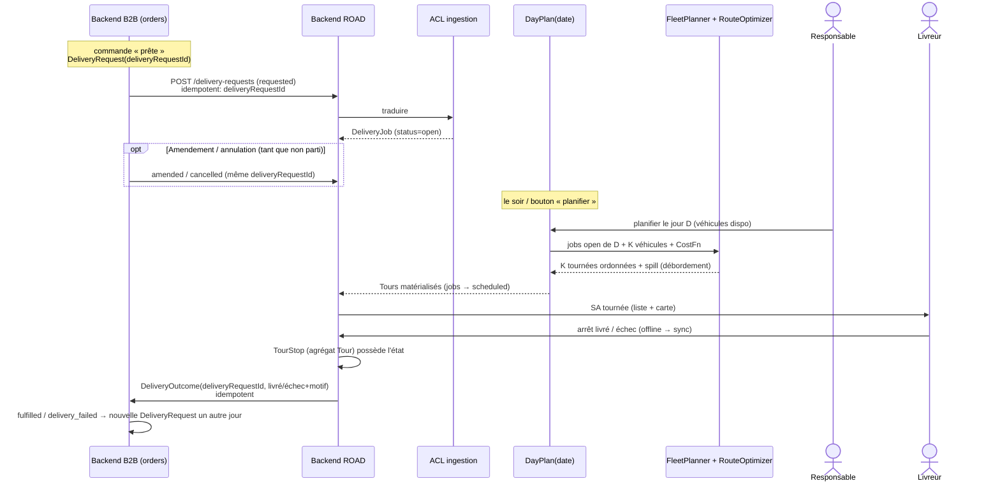
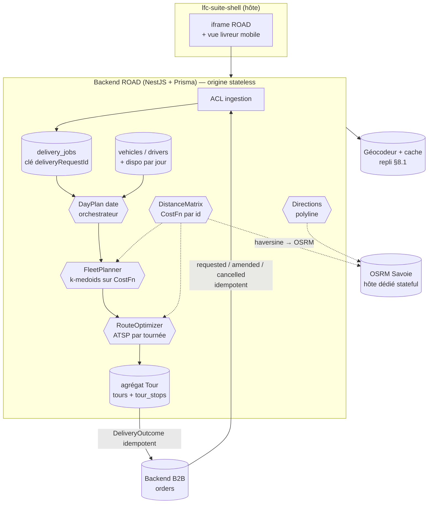

# ROAD — application de livraison & optimisation de tournées

> **Statut** : note de conception (doc-first). Rien n'est codé tant que cette
> note n'est pas validée. Écrite le 2026-08-06, durcie après **deux** revues
> adversariales (les contradictions introduites par la 1re ronde sont corrigées).

## 1. Intention

**ROAD** est une nouvelle app de la suite interne LFC (au même titre que le PIM et
le B2B admin : NestJS + Prisma + Angular/fold, hébergée en **iframe** dans le
shell). Elle sert **les livreurs et le responsable des tournées**, pas les clients.

**Qui attaque ROAD** (déclencheur) : le **backend B2B**, et lui seul. Sur la
transition d'une commande vers **prête à livrer**, B2B émet une **demande de
livraison** (`DeliveryRequest`, id **`deliveryRequestId`** généré par B2B) et la
pousse à ROAD. Une commande peut engendrer **plusieurs** demandes dans le temps (ré-essai
après échec) → l'identité qui compte côté ROAD est `deliveryRequestId`, **pas**
`sourceOrderId`. ROAD n'est jamais appelé par le client ni par l'atelier.

Le fil conducteur :

1. Côté B2B, commande **prête** → **demande de livraison** (`deliveryRequestId`).
2. B2B **pousse** la demande à ROAD (**flux idempotent** : `requested` / `amended` /
   `cancelled`). ROAD la **traduit** (ACL) en `DeliveryJob` (statut `open`).
3. Le soir/à la demande, un **`DayPlan(date)`** rassemble les jobs `open` du jour et
   les **répartit** sur les **véhicules disponibles ce jour-là** → des tournées.
4. Pour chaque tournée, ROAD **résout le point** (§8.1), construit la **fonction de
   coût** et **ordonne** les arrêts (ATSP).
5. Le **livreur** suit **sa** tournée sur mobile ; chaque arrêt remonte un **résultat**
   (livré / échec + motif) qui **referme la boucle** côté commande.

## 2. Ce qui est facile vs ce qui est dur

| Brique | Difficulté | Pourquoi |
| --- | --- | --- |
| App dans la suite (shell iframe, Auth0 audience, backend+front) | **Facile** | Pattern déjà appliqué 3× (PIM, B2B admin, ops). |
| Domaine `DeliveryJob` / `Vehicle` / `Driver` / agrégats `Tour` & `DayPlan` | **Moyen** | **Pas** du CRUD : invariants forts (§6). |
| Ingestion PROD→ROAD (flux idempotent + ACL + annulation/amendement) | **Moyen** | §8. La boucle de retour exige un changement B2B (§9). |
| Répartir K véhicules + ordonner chaque tournée | **Moyen** | Clustering sur les **coûts** (k-medoids) + ATSP par véhicule. Pas d'OR-Tools à cette échelle. |
| Distances réelles | **Petit→Moyen** | Vol d'oiseau au MVP, OSRM self-host **sur hôte dédié** ensuite (§7, §11). |
| Carte livreur | **Petit** | Leaflet + tuiles OSM (gratuit). |

**Verdict** : MVP utile en **quelques jours**. À l'échelle boulangerie (quelques
véhicules, dizaines d'arrêts) une **heuristique** suffit **durablement** ; OR-Tools
ne devient utile que pour des **fenêtres horaires** ou une **capacité** dures (§7).

## 3. Périmètre

**MVP**
- Ingestion **flux** (idempotent : requested/amended/cancelled ; ACL → `DeliveryJob`).
- CRUD `Vehicle` + `Driver` ; **disponibilité par jour** ; attribution manuelle **et**
  répartition auto sur les véhicules disponibles.
- `DayPlan(date)` : résolution du point (§8.1) + **coûts vol d'oiseau** + **répartition
  k-medoids** + **ordonnancement ATSP** par tournée + **débordement** (spill) géré.
- Vue livreur mobile : **sa** tournée (liste + carte Leaflet) + **livré / échec**
  (file **offline** + sync).
- Boucle de retour vers la commande (succès **et** échec — cf. §9).

**Plus tard (hors MVP)**
- **OSRM Savoie** (distances routières réelles) en swap de la matrice **et** du
  clustering (l'affectation en profite, pas que l'ordre).
- **OR-Tools** *si* fenêtres horaires / capacités deviennent contraignantes.
- Live tracking, ETA client, preuve de livraison (photo/signature — **mise de côté**),
  re-planification **en cours** de tournée.

## 4. Flux de bout en bout



## 5. Architecture (dans la suite)



## 6. Agrégats & invariants (ce n'est pas du CRUD)

- **`DeliveryJob`** — la demande **ingérée** (via ACL, §8). Clé **`deliveryRequestId`**
  (pas `sourceOrderId` : une commande a 0..N demandes). Adresse **snapshot** + point
  résolu, `requestedDate`, résumé colis. Statut **grossier** :
  `open` → `scheduled` → `departed` → `closed` | `cancelled`. **Il ne stocke jamais
  l'état fin de livraison** (I1). Amendable/annulable **tant que non `departed`** (§8, N2).
- **`Vehicle`** — plaque, dépôt, capacité *(mode capacité, §7/§8)*. **`Driver`** —
  identité + **disponibilité par jour** (véhicule affecté ce jour, ou absent).
- **`DayPlan(date)`** *(orchestrateur)* — rassemble les jobs `open` de la date,
  appelle `FleetPlanner` sur les **véhicules disponibles ce jour**, matérialise les
  `Tour` et le **spill**. C'est le **seam** qui fait `open → scheduled` (sinon
  personne ne déclenche la planification). Ré-exécutable (re-plan avant départ).
- **`Tour`** *(racine d'agrégat)* — véhicule + date + **séquence ordonnée** de
  `TourStop`. Invariants portés par la racine :
  - **I1** — le `TourStop` **possède** l'état (`pending`/`delivered`/`failed`) ; le
    `DeliveryJob` l'apprend **par événement**. *(Une seule source de vérité.)*
  - **I2** — positions **contiguës et uniques** (1..n).
  - **I3** — un job sur **au plus un** `Tour` actif.
  - **I4** — un arrêt **livré/raté est immuable** (pas de ré-ordonnancement après coup).
  - **I5** — mode capacité activé ⇒ Σ poids ≤ capacité véhicule.
  - **I6** — un `Tour` **parti** (`departed`) est **gelé** sur ses arrêts déjà exécutés ;
    un re-plan ne peut recomposer que les arrêts **non encore exécutés**.
  - **I7** — recomposer (déplacer un job entre deux `Tour`) est **transactionnel** :
    retrait de A + renumérotation (I2) + ajout à B, tout ou rien.

**Règle** : toute mutation d'ordre/état passe par la racine `Tour` (méthodes de
domaine) ; la recomposition inter-tournées est le seul fait du service `FleetPlanner`,
piloté par `DayPlan`.

## 7. Ports : distances, ordonnancement, répartition, tracé

L'optimiseur **ne connaît pas les routes** : c'est du **pur combinatoire**, la
connaissance des vraies routes vit **dans les coûts**. Quatre ports séparés (SRP/DIP) :

```ts
// 1) domain/ports/distance-matrix.ts — « combien coûte i→j »
export interface GeoPoint { readonly lat: number; readonly lng: number; }

/** Coûts clés par ID d'arrêt. DÉFINIE UNIQUEMENT sur l'ensemble d'ids passé à build ;
 *  lève sur un id inconnu (jamais mélanger deux CostFn). */
export interface CostFn {
  meters(fromId: string, toId: string): number;
  seconds(fromId: string, toId: string): number;
}

export abstract class DistanceMatrix {
  /** Matérialise la matrice (OSRM /table est async) et retourne la CostFn (lookup sync). */
  abstract build(points: ReadonlyMap<string, GeoPoint>): Promise<CostFn>;
}

// 2) domain/ports/route-optimizer.ts — ordonne UNE tournée (ATSP, asymétrique)
export interface RouteStop { readonly jobId: string; }
export interface OptimizedRoute {
  readonly sequence: readonly RouteStop[];
  readonly totalMeters: number;
  readonly totalMinutes: number;
}
export abstract class RouteOptimizer {
  abstract order(depotId: string, stops: readonly RouteStop[], cost: CostFn): OptimizedRoute;
}

// 3) domain/ports/fleet-planner.ts — répartit M jobs sur K véhicules DISPONIBLES
export interface PlannedTour { readonly vehicleId: string; readonly route: OptimizedRoute; }
export interface FleetPlan {
  readonly tours: readonly PlannedTour[];
  readonly spill: readonly RouteStop[]; // jobs non casés ce jour (débordement)
}
export abstract class FleetPlanner {
  abstract plan(
    depotId: string,
    stops: readonly RouteStop[],
    vehicles: readonly { id: string; capacity?: number }[], // K = dispo du jour
    cost: CostFn,
  ): Promise<FleetPlan>;
}

// 4) domain/ports/directions.ts — polyline pour la CARTE (usage distinct des coûts)
export abstract class Directions {
  abstract polyline(ordered: readonly GeoPoint[]): Promise<string>;
}
```

**Décisions d'algo (durcies par la revue) :**
- **Clustering sur les COÛTS, pas sur l'angle.** Un sweep angulaire autour du dépôt
  est un heuristique de plan euclidien — **inadapté à la Savoie** (une vallée/un massif
  fait diverger proximité angulaire et proximité routière) et il **fige l'affectation
  sur un signal pauvre**. `FleetPlanner` clusterise par **k-medoids sur `CostFn`** :
  au MVP sur les coûts haversine, et **l'affectation profite d'OSRM** dès le swap
  (pas seulement l'ordre).
- **ATSP dès le départ.** Coûts **asymétriques** (sens interdits OSRM). L'ordonnanceur
  = NN **+ Or-opt** (déplacement d'1–3 arrêts) **+ 2-opt ATSP exact** (coût du segment
  inversé recalculé en O(n) — abordable à n ≤ ~40). Ainsi le swap Haversine→OSRM ne
  casse **rien** et la qualité reste bonne.
- **Tournée = aller-retour dépôt** par défaut *(knob open-tour)*.
- **Fenêtres horaires ignorées au MVP** : l'heuristique ne les respecte pas → **non
  affichées comme garanties** tant qu'OR-Tools absent.
- **Débordement (`spill`)** explicite : si les véhicules dispo ne couvrent pas tous les
  jobs, l'excédent reste `open` (jour suivant) + alerte responsable. Jamais de troncature
  silencieuse.

**Implémentations, dans l'ordre :**
- **Départ (MVP)** : `KMedoidsFleetPlanner` + `AtspRouteOptimizer` (NN + Or-opt +
  2-opt ATSP) + `HaversineDistanceMatrix`. Aucune dépendance externe.
- **Ensuite** : swap `HaversineDistanceMatrix` → `OsrmDistanceMatrix` (Savoie) +
  `OsrmDirections`. Planner/optimizer **inchangés** (grâce à `CostFn`) — et
  l'affectation gagne en justesse, pas que l'ordre.
- **Si besoin** : `OrToolsFleetPlanner` (fenêtres, capacités dures, équilibrage).

### Pipeline résolution → coûts → répartition → ordre


### OSRM Savoie — mise en place (slice « ensuite »)

1. Extrait OSM **Auvergne-Rhône-Alpes** (Geofabrik), **clippé** à la Savoie
   (`osmium extract` sur polygone) pour alléger le graphe.
2. Profil `car` : `osrm-extract` → `osrm-partition` → `osrm-customize`, puis
   `osrm-routed`. Services `/table` **et** `/route`.
3. **Limite `/table`** (~100 coords par défaut, `--max-table-size`) : bornée
   naturellement par le clustering (une matrice par cluster) → N² tenable.
4. **Hôte dédié** : OSRM tient le graphe en **RAM** (stateful) → **hors** du modèle
   « origines stateless » de la suite. C'est une **exception d'infra assumée** (comme
   Redis/BullMQ ailleurs) : un conteneur/box toujours-allumé, graphe sur disque,
   re-build mensuel.

### Option managée : backer les ports par un service (HERE / ORS)

Les 4 ports peuvent aussi être backés par un **service managé** au lieu du couple
« OSRM self-host + solveur maison » — zéro infra. Deux candidats sérieux, tous deux
avec free tier ; **le design ne change pas**, seul l'adaptateur change (`Here*` /
`Ors*` / `Osrm*`).

> ⚠️ Chiffres de free tier **à revérifier** (ils évoluent, post-cutoff).

**HERE** (propriétaire, données **UE** — atout RGPD ; usage commercial assumé sur le
free tier) :
- **Base Plan** (CB requise, **non débitée** sous quota) : **30 000 requêtes/mois** de
  Location Services (géocodage, matrice, directions).
- **Tour Planning** (VRP managé : flotte, capacités, fenêtres) : **500 transactions/mois**.
- **Limited** (sans CB) : 1 000 req/jour **mais exclut matrice + Tour Planning** →
  inutilisable pour le VRP.

**OpenRouteService** (OSM, moteur **VROOM** ; open, **self-hostable en repli** ;
free tier plutôt « faible volume / fair-use » → clause commerciale à vérifier).

**Deux configurations possibles :**
- **Config A — service pour la DONNÉE seulement + solveur maison** (`KMedoids` +
  `Atsp`, déjà prévus) : on ne consomme que géocodage + matrice + directions → on vit
  dans le **gros bucket** (30 000/mois HERE), **jamais** dans les 500 du Tour Planning.
- **Config B — VRP full-managé** (`HereTourPlanner` / `OrsFleetPlanner` remplacent
  `FleetPlanner` **et** `RouteOptimizer`) : **zéro solveur à écrire**, borné aux
  500 tx/mois côté HERE.

**Est-ce que ça tient pour ~200 clients ?** Oui — le **nombre de clients n'est pas le
driver de coût** : les géocodages sont **cachés** (≈200 one-shot), et le seul vrai
compteur est le **run d'optimisation** lancé **~1×/jour** (`DayPlan`) :
- Géocodage (one-shot caché) + directions (~qq/jour) → **une goutte** dans 30 000/mois.
- Optimisation ~30/mois (1/jour) : **très** sous les 500 **si** le Tour Planning compte
  **par run** ; à risque **si** compté **par job** (~800 livraisons/mois > 500). →
  **seul point à vérifier** : l'unité de comptage du Tour Planning (par requête vs par job).
- Même en débordant, l'addition pour une optimisation **1×/jour** ≈ **quelques €/mois**.

**Reco** : **Config A** (HERE data-only + solveur maison) = quota **bulletproof** (on
reste dans les 30 000, jamais dans les 500) et on garde ports + heuristique. Basculer
en **Config B** seulement pour zéro code d'optimisation, **après** avoir vérifié
l'unité de compte du Tour Planning. Réserve commune : en managé, les **adresses/GPS
clients partent chez un tiers** (HERE = **UE**, plus doux pour le RGPD que l'US) — le
self-host OSRM/VROOM reste l'option « PII 100 % maison ».

## 8. Contrat d'ingestion (flux) + ACL + idempotence

DTO partagés (`@lfd/road-contract`, type-only côté front). L'adresse est **figée**
(snapshot au push). Trois messages, tous **idempotents sur `deliveryRequestId`** :

```ts
export interface DeliveryRequested {
  deliveryRequestId: string;   // ← identité + clé d'idempotence (par tentative)
  sourceOrderId: string;       // traçabilité (N..1)
  orderNumber: string;
  address: { ligne1: string; ligne2: string; codePostal: string; ville: string };
  gps?: { lat: number; lng: number };      // point exact FACULTATIF (§8.1)
  requestedDate: string;                    // AAAA-MM-JJ (J+1 des paniers récurrents)
  parcel: { count: number; weightKg?: number }; // PAS les SKU (minimisation, ISP)
}
export interface DeliveryAmended { deliveryRequestId: string; address?: /*…*/; gps?: /*…*/; requestedDate?: string; }
export interface DeliveryCancelled { deliveryRequestId: string; reason: string; }
```

- **Idempotence** : upsert/patch/annulation sur **`deliveryRequestId`**. Un retry réseau
  ne crée **jamais** de doublon. *(Résout la contradiction clé-vs-ré-essai : la commande
  peut avoir N demandes, chacune idempotente.)*
- **Annulation / amendement** (N2) : `cancelled` ⇒ job → `cancelled` **tant qu'il n'est
  pas `departed`** ; `amended` ⇒ met à jour le **snapshot** avant départ. Après départ,
  refus + alerte responsable (le livreur est déjà parti).
- **Résumé colis, pas les SKU** (N9) : ROAD n'a pas besoin du catalogue B2B pour router.
  `parcel { count, weightKg }` suffit ; les SKU restent chez B2B.
- **Capacité = mode** (N11) : si `Vehicle.capacityMode` est activé, `weightKg` **requis**
  et validé à l'ingestion ; sinon best-effort, capacité ignorée. Pas de champ
  « requis-sous-condition » flou.
- **ACL** : mapper d'anti-corruption → **VO ROAD** `DeliveryJob` à la frontière. Un
  changement de modèle B2B ne fuit pas dans ROAD.
- **Transport** : POST backend→backend **signé** (comme le webhook Stripe), ou file.
  Bases **séparées**.

### 8.1 Résolution du point : livreur > client > géocodage

Le géocodage n'est **pas** la source de vérité — juste le **filet de sécurité** :

```
point = point_livreur (capté sur le terrain)   // le meilleur : l'entrée réelle
      ?? épingle_client (si posée sur la carte)  // bonus quand le client joue le jeu
      ?? géocodage(adresse)                       // repli au démarrage
```

- **Livreur (ossature)** : « enregistrer ce point » à la 1re livraison réussie →
  point d'or réutilisé. Zéro effort client, plus précis qu'un géocodeur.
- **Client (bonus)** : peut **glisser une épingle** (jamais saisir des chiffres).
- **Géocodage (repli)** : seulement si ni l'un ni l'autre n'existe.

Garde-fous : point **plausible** (bbox Savoie) ; OSRM **snappe** à la route ; point
**caché** par adresse ; un point livreur **écrase** le géocodage. **Snapshot assumé**
(N12) : l'adresse fige au push ; une correction B2B tardive passe par `amended` avant
départ, sinon elle ne s'applique qu'à la **prochaine** demande.

## 9. Boucle de retour (⚠ changement requis côté B2B)

L'échec **n'a nulle part où atterrir** dans le modèle B2B actuel (`OrderStatus` =
draft/placed/confirmed/in_production/fulfilled/cancelled). **Prérequis** :

- Côté B2B, un agrégat **`DeliveryAttempt`** rattaché à la commande : `deliveryRequestId`,
  date, résultat (`delivered`/`failed`), motif, n° de tentative. La commande dérive
  `fulfilled` (une tentative livrée) ou `delivery_failed` (échec en cours).
- `DeliveryOutcome` (ROAD→B2B) **idempotent** sur `deliveryRequestId`.
- Échec ⇒ B2B émet **une nouvelle `DeliveryRequest`** (nouveau `deliveryRequestId`) pour
  un autre jour. *(Cohérent avec §8 : une commande = N demandes ; pas de collision de clé.)*

Tant que ce prérequis n'est pas fait, le MVP ne referme **honnêtement** que le **succès**.

## 10. Identité & mur du livreur

- **Principal `driver`** (audience Auth0 dédiée, ou rôle dans l'audience suite),
  distinct du staff bureau.
- **Mur** : un livreur ne lit/écrit **que sa** tournée du jour (`Tour.driverId ==
  principal`). Le responsable voit toute la flotte. Distinct de l'`AdminAuthGuard` B2B.

## 11. Dépendances externes à trancher

1. **Géocodeur** *(repli — §8.1)* : source de vérité = point livreur puis épingle
   client. Privilégié : **BAN** (api-adresse.data.gouv.fr — gratuit, sans clé, FR, bulk).
   Repli self-host : Nominatim/Photon (OSM).
2. **Matrice / distances** *(à confirmer)* : vol d'oiseau au MVP, puis **soit**
   OSRM Savoie self-host (PII 100 % maison), **soit** un **service managé** (HERE /
   ORS) — cf. **« Option managée » (§7)**. Même `CostFn` dans les deux cas.
3. **Répartition/ordre** *(décidé, si solveur maison)* : **k-medoids (coûts) + ATSP
   (NN+Or-opt+2-opt)** ; sinon VRP managé (HERE Tour Planning / ORS-VROOM) remplace les
   deux ports. OR-Tools seulement si fenêtres/capacités dures et solveur maison.
4. **Rétention / PII** *(à trancher)* : ROAD recopie adresses + GPS clients → durée de
   conservation + **effacement coordonné** avec B2B (cascade d'erasure SH3PHERD). Un
   `cancelled`/`closed` déclenche la purge du snapshot après délai.

## 12. Découpage en slices

| Slice | Contenu | Résultat |
| --- | --- | --- |
| **1** | Scaffolder ROAD (backend+front+iframe), **auth livreur** (§10), agrégat `DeliveryJob` (clé `deliveryRequestId`), **ingestion flux ACL** (requested/amended/cancelled, idempotents), listing d'attribution | Les demandes arrivent, sans doublon, amendables/annulables, murées |
| **2** | `Vehicle`/`Driver` + **dispo par jour**, résolution du point (§8.1) + cache, attribution manuelle | Adresses situées, attribution à la main |
| **3** | `HaversineDistanceMatrix` (`CostFn`), **`DayPlan`**, `KMedoidsFleetPlanner` (+ spill), `AtspRouteOptimizer`, vue livreur mobile (Leaflet), **livré/échec offline + sync** (respecte I4/I6) | K tournées ordonnées, boucle **succès** fermée |
| **3b** | **Changement B2B** : agrégat `DeliveryAttempt` + `delivery_failed` (§9), `DeliveryOutcome` idempotent, ré-émission d'une nouvelle `DeliveryRequest` | Boucle **échec** fermée honnêtement |
| **4+** | Swap `OsrmDistanceMatrix` + `OsrmDirections` (hôte dédié) — l'affectation gagne aussi ; live tracking ; preuve de livraison ; **OR-Tools si** fenêtres/capacités | Optimisation « pro » |

## 13. Hypothèses & non-buts

- **Hypothèses** : ATSP (coûts asymétriques) ; tournée = aller-retour dépôt ; fenêtres
  horaires **ignorées** hors OR-Tools ; capacité = **mode** explicite (poids requis si
  activé) ; **snapshot** d'adresse figé au push (correction via `amended` avant départ) ;
  **K véhicules variable** = disponibles du jour, débordement = `spill`.
- **Cohérence des sync offline** : la remontée `livré/échec` respecte **I4** (arrêt
  exécuté immuable) et **I6** (tour parti gelé) — pas de last-write-wins qui ressuscite
  un arrêt déplacé.
- **Non-buts (MVP)** : temps réel, signature/preuve, ETA client, re-planification **en
  cours** de tournée, multi-dépôts.

## 14. Liens

- Déclencheur côté commande : [flux commande & PROD](architecture-flux-commande-prod.md),
  [zéro friction](architecture-flux-commande-zero-friction.md).
- Intégration suite / iframe : [scaling gateway](architecture-suite-gateway-scaling.md).
- Paniers récurrents (produisent des livraisons J+1) : contexte `subscriptions`
  (le planificateur alimentera aussi ROAD à terme).
