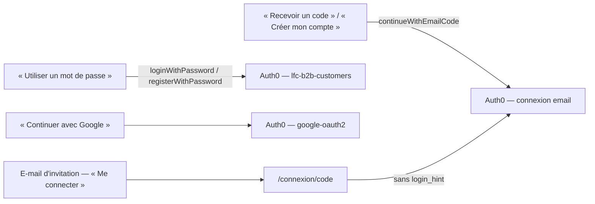

# La boutique se connecte par code e-mail

> ✅ **Doc d'état, 2026-10-09.** Bâti ce jour-là (lots C1 réduit, C2, C3 du
> plan v2, contredit par `vitruve` puis retiré). Demande d'Hugo : « la
> connexion par code par défaut pour la boutique ; on n'efface pas la capacité
> mot de passe ». Décrit le code et les réglages tels qu'ils sont ; ce qui
> reste ouvert est au § 5.

## 1. Les réglages hors du dépôt (faits le 2026-10-09)

| Où                   | Réglage                                                                                            |
| -------------------- | -------------------------------------------------------------------------------------------------- |
| Auth0 — connexion    | passwordless **`email`** : code à **6 chiffres**, valable **180 s**, inscriptions ouvertes         |
| Auth0 — expéditeur   | `La Folie Coffee <no-reply@lafoliecoffee.info>`                                                    |
| Auth0 — fournisseur  | e-mail d'Auth0 = **Resend**, clé `lfc-auth0-production`                                            |
| Auth0 — applications | connexion activée pour la **seule** app « La Folie Coffee E-commerce » ; le back-office ne l'a pas |

Un sujet de cette connexion s'écrit `email|…`. Le tenant est partagé entre dev
et prod ([`le-tenant-auth0-est-partage.md`](le-tenant-auth0-est-partage.md)).

## 2. La boutique

- **Par défaut, le code.** `AuthFacade.continueWithEmailCode(target, hint?, profile?)`
  part sur `EMAIL_CODE_CONNECTION = 'email'` (`auth/auth.config.ts`) : le
  bouton du dialogue « Se connecter », « Créer mon compte » de `/inscription`,
  la page `/login`, le panier et Mon compte.
- **Le mot de passe reste**, derrière le lien discret « Utiliser un mot de
  passe » (fr/en/it) : dans le dialogue (connexion, même adresse soufflée) et
  sur la carte d'inscription (mêmes trois champs, onglet inscription).
- **Google** inchangé ; **Facebook** toujours derrière son interrupteur.
- **La porte pro** (`registerPro`) reste au mot de passe : un compte pro change
  de mains.
- **Rien n'est perdu à l'inscription.** Prénom et téléphone sont saisis chez
  nous et font l'aller-retour dans l'`appState`, par code comme par mot de
  passe, puis `ClientOnboarding` les repose (`PATCH /me/profile`). Ce qui
  change : Auth0 ne demande plus de mot de passe, et la connexion sans mot de
  passe n'a pas d'onglet d'inscription — une adresse inconnue reçoit son code
  comme une autre.
- **`prompt: 'login'` dès qu'on change de connexion** (`auth/auth-redirect.ts`).
  Le tenant garde une seule session, quelle que soit la connexion qui l'a
  ouverte ; la connexion du dernier départ est retenue dans le stockage local,
  et une connexion inconnue compte comme un changement.
- **`/connexion/code`** part aussitôt sur la connexion par code, **sans
  `login_hint`** : l'adresse n'est jamais mise dans une URL.
- Un refus `account.identity.link_required` fait sortir la personne, et
  l'avis dit qu'un compte existe sous cette adresse, ouvert par un autre
  moyen — « reprenez ce chemin ».

## 3. L'API — un `sub` par personne, pas de rattachement

Le modèle est un `sub` par personne (`users.auth0_sub` unique). Un sujet
inconnu passe par `UnknownSubjectAdmission`
(`b2b/account/infrastructure/unknown-subject-admission.ts`) avant qu'un compte
lui soit créé :

| Le jeton            | Les comptes connectables sous l'adresse | Issue                                                           |
| ------------------- | --------------------------------------- | --------------------------------------------------------------- |
| sans adresse        | —                                       | compte créé                                                     |
| adresse             | aucun                                   | compte créé                                                     |
| adresse **prouvée** | **un seul**, `invited` (jamais entré)   | **rattaché** : `auth0_sub` réécrit, compte activé, fait journal |
| tout autre cas      | au moins un                             | refus `account.identity.link_required`, qui nomme le moyen      |

- **Plus d'exemption `auth0|…`.** Elle supposait qu'Auth0 refuse une seconde
  inscription sous la même adresse : vrai dans une connexion, faux entre deux.
- **Le refus nomme le moyen** du compte existant, déduit du préfixe de son
  `sub` (`SignInRoute` : mot de passe, code e-mail, Google, Facebook, « votre
  moyen habituel »). L'erreur s'appelle `AccountExistsUnderAnotherSignInError`
  (anciennement `SocialSignInAccountExistsError`).
- **La première entrée d'un invité.** 43 pros invités en production le
  2026-10-09 avaient une identité `auth0|…` créée à l'invitation, jamais
  utilisée. L'invitation a été envoyée à cette boîte, qui pouvait déjà entrer
  par son lien : la prouver par un code ne donne rien de plus. La réécriture
  est conditionnelle (`id`, `status = invited`, ancien `sub`) et active le
  compte dans le même geste ; deux premières entrées simultanées n'en font
  gagner qu'une. Le fait `user.login_method_switched_at_first_entry` porte le
  fournisseur, jamais le `sub`.
- ⚠️ **L'ancienne identité `auth0|…` n'est pas supprimée chez Auth0** : aucun
  appel à l'API de gestion. Elle n'ouvre plus rien chez nous ; si son lien de
  mot de passe est suivi plus tard, la session qui en sort tombe sous la règle
  anti-doublon et est refusée.
- **Réinitialiser son mot de passe** : un compte sans identité à mot de passe
  est refusé (`identity.no_password_login`) en nommant son moyen — « vous vous
  connectez par code reçu par e-mail ».

## 4. L'e-mail d'invitation

`customer.access-opened` (`platform/mailer/customer-access-opened-mail.ts`,
français seulement) dit « Connectez-vous avec votre adresse … : vous recevrez
un code par e-mail », avec un bouton vers `/connexion/code` ; le lien de
création de mot de passe reste en lien secondaire (« Ou choisissez un mot de
passe »). Sans racine publique du client configurée (`clientBaseUrl`), l'e-mail
retombe sur le lien de mot de passe seul. L'invitation crée toujours
l'identité `auth0|…` et son ticket. Les invitations déjà envoyées ne changent
pas.

## 5. Ce qui reste ouvert

- **S1** — un acheteur sans compte (commande en invité, `auth0_sub` nul) qui
  entre par code obtient un compte neuf à côté de ses commandes invitées,
  comme par mot de passe.
- **S4** — un compte né par code n'a pas de mot de passe et ne peut pas en
  ajouter ([`todo-ajouter-un-mot-de-passe.md`](todo-ajouter-un-mot-de-passe.md)).
- **Le rattachement d'identités** n'existe pas ; celui d'un compte avec
  société par adresse reste interdit
  ([`plan-connexion-sociale.md`](plan-connexion-sociale.md)).
- L'avis de conflit côté boutique ne nomme pas le moyen exact : le refus de
  l'API le nomme, en français ; l'enveloppe d'erreur ne porte que des nombres
  publiables.
