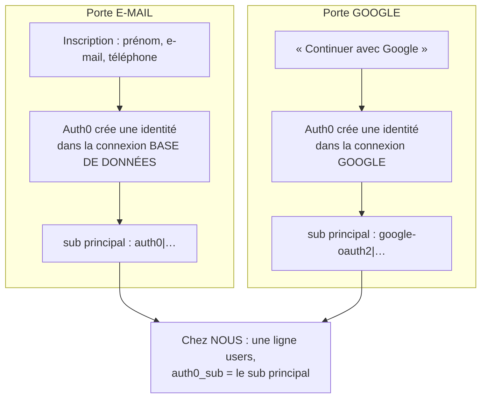
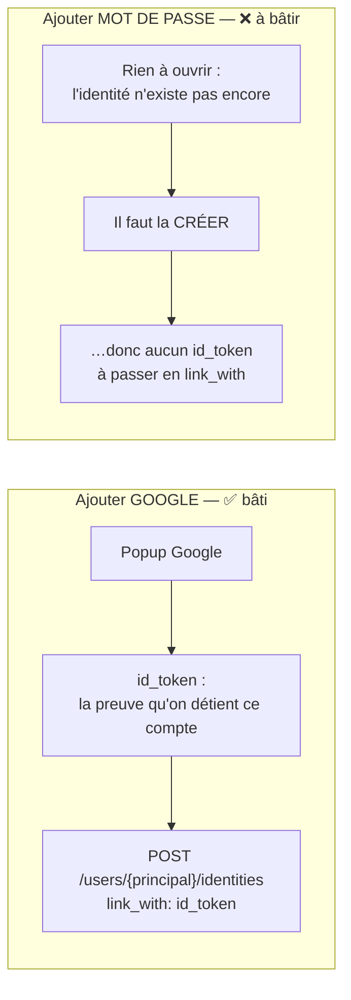
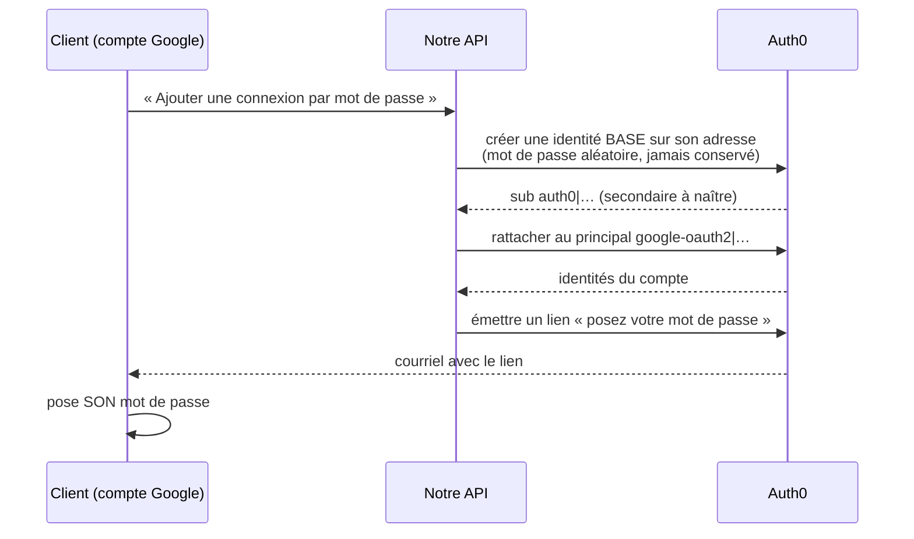
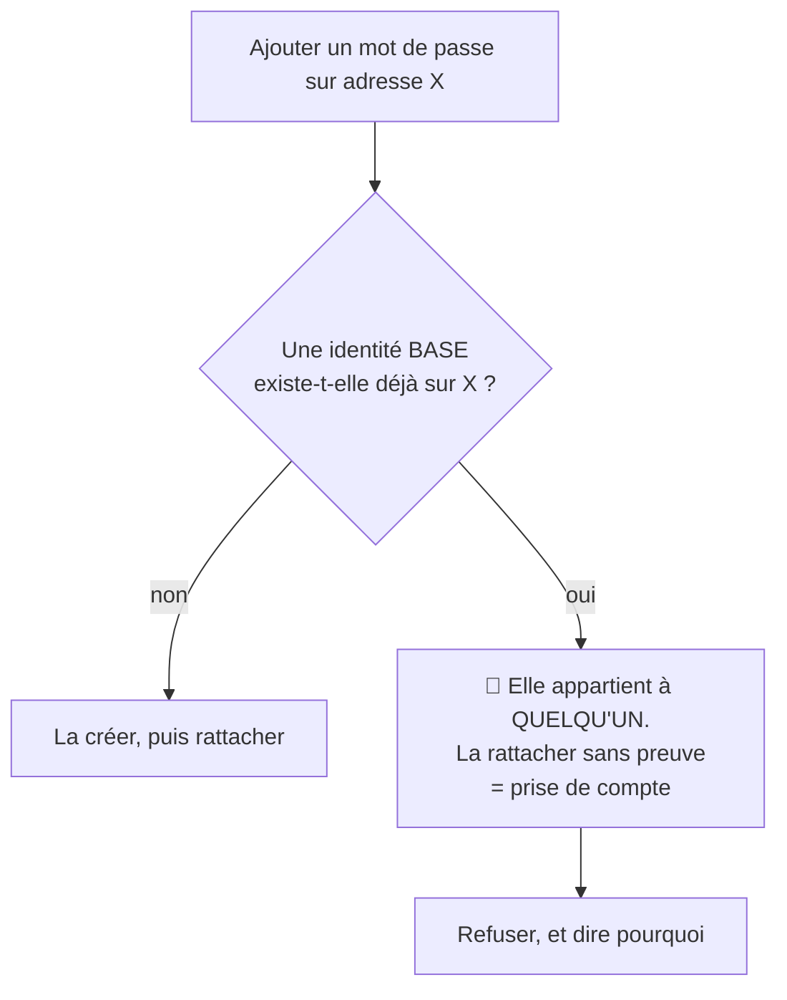
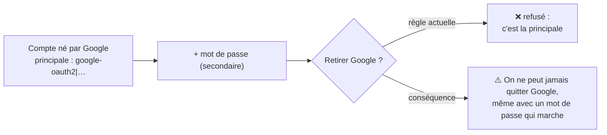
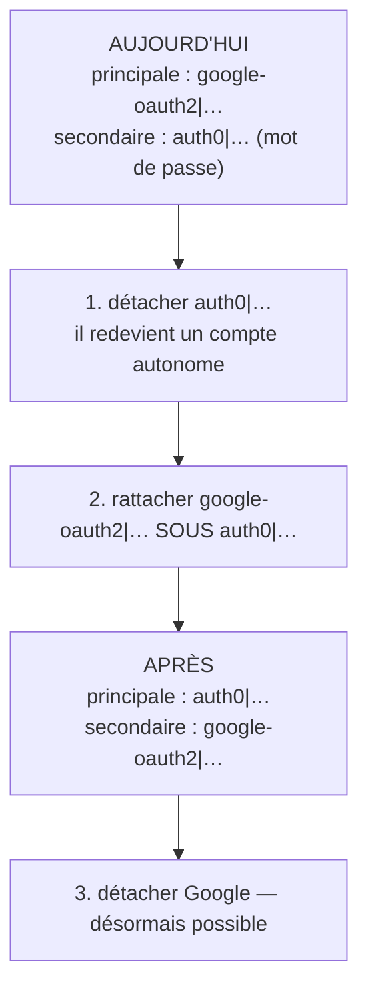
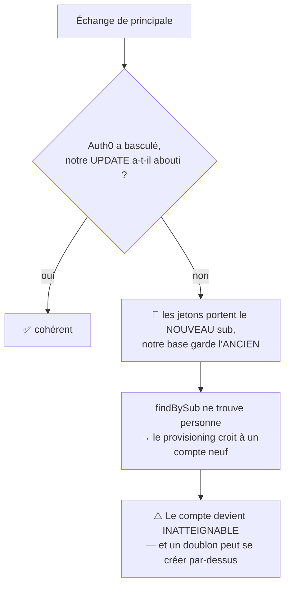

# Les deux origines d'un compte, et ce que chacune permet

> **Écrit le 2026-09-22**, à la demande de Hugo : « j'ai besoin de diagrammes
> avec les besoins et les chemins — compte créé depuis Google, compte créé
> depuis e-mail et Auth0 ».
>
> Ce document **décrit l'existant** et nomme le manque. Il ne conçoit rien : le
> geste à bâtir (§5) devra passer par un plan, et par `vitruve`, parce qu'il
> déplace une frontière de sécurité.

---

## 1. Un compte naît par une porte, et la porte décide de son identité PRINCIPALE



🔴 **Le `sub` principal ne change JAMAIS.** C'est lui qui identifie la personne
dans notre base (`users.auth0_sub`), et c'est la raison pour laquelle le
rattachement se fait **chez Auth0** : l'identité ajoutée est absorbée comme
**secondaire**, et nos jetons continuent de porter le principal.

---

## 2. Ce que chaque compte porte, et ce qu'il peut faire

|                                     | Compte né par **e-mail** | Compte né par **Google**    |
| ----------------------------------- | ------------------------ | --------------------------- |
| Identité principale                 | `auth0\|…`               | `google-oauth2\|…`          |
| Se connecter par mot de passe       | ✅                       | ❌ **aucune identité base** |
| « Mot de passe oublié »             | ✅                       | ❌ rien à réinitialiser     |
| Ajouter **Google** depuis le profil | ✅ **bâti**              | — (il l'a déjà)             |
| Ajouter **e-mail + mot de passe**   | — (il l'a déjà)          | 🔴 **N'EXISTE PAS**         |

⚠️ La dernière ligne est le sujet de ce document. Elle est **écrite** dans le
code, et assumée : le JSDoc de `NoPasswordLoginMethodError` dit que le refus
« ne promet pas d'ouvrir une connexion par mot de passe depuis le profil — ce
geste n'existe pas, et un refus qui envoie vers une porte fermée ne vaut pas
mieux que pas de refus ».

---

## 3. Pourquoi l'un marche et pas l'autre : PREUVE contre CRÉATION

C'est toute l'asymétrie, et elle n'est pas un oubli d'implémentation.



**Ajouter Google, c'est rattacher ce qui existe.** La popup prouve la
possession ; on ne fait que relier.

**Ajouter un mot de passe, c'est fabriquer une identité.** Il n'y a personne à
qui demander une preuve — et c'est précisément ce qui rend le geste sensible :
on ouvre une porte d'entrée de plus sur un compte.

---

## 4. Le point dur, concret

`linkIdentity` de notre passerelle ne sait rattacher que par **`link_with`**,
c'est-à-dire avec un jeton de session :

```ts
// auth0-identity.gateway.ts
await this.api.call("POST", `/api/v2/users/${primarySubject}/identities`, {
  link_with: idToken,
});
```

Auth0 accepte une **seconde forme** — `{ provider, user_id, connection_id }` —
qui ne demande aucune session. Elle exige en revanche l'**identifiant** de la
connexion, alors que nous n'en connaissons que le **nom**
(`AUTH0_CUSTOMER_CONNECTION`).

⚠️ **Non vérifié** : cette seconde forme est écrite de mémoire de l'API Auth0.
Elle doit être confrontée à la documentation de la version utilisée **avant**
d'être inscrite dans un plan — c'est exactement la faute que `vitruve` a
relevée le 2026-09-22 sur `paymentIntents.cancel`.

---

## 5. Le geste tel qu'il se dessine



🔴 **Le client ne voit jamais le mot de passe intermédiaire.** Il n'existe que
le temps de créer l'identité, et il n'est ni affiché, ni journalisé, ni
conservé.

---

## 6. Ce qu'il faut trancher AVANT d'écrire une ligne

### 🔴 Q1 — Et si une identité mot de passe existe déjà sur cette adresse ?



C'est le même raisonnement que le refus de 2026-09-17 sur la connexion
sociale : **on ne rapproche jamais deux identités par l'adresse seule.**

### ⚠️ Q2 — Peut-on ensuite retirer Google ?

Sur un compte né par Google, **la principale EST Google**. Or la règle actuelle
dit qu'une identité principale ne se délie jamais — elle porte le `sub`, donc
le compte.



Cette règle a été écrite quand la principale était **toujours** `auth0|`. Elle
tient toujours techniquement, mais son effet change de sens ici, et il faut le
dire plutôt que le découvrir.

### ⚠️ Q3 — Sur quelle adresse ?

Celle que porte Auth0, ou celle de notre base ? Elles peuvent diverger depuis
que le changement d'adresse existe. Et créer une connexion par mot de passe sur
une adresse **non vérifiée** donne à qui la contrôle une porte d'entrée par
« mot de passe oublié ».

---

## 8. Changer de méthode principale — et donc pouvoir retirer Google

> Question de Hugo, 2026-09-22 : « on peut changer Q2 ? changer de méthode
> principale ? » puis « si on voulait retirer Google ? »

### 8.1 Le mécanisme : inverser le sens du rattachement

Retirer une identité **secondaire** est bâti. Retirer la **principale**
n'existe pas — elle porte le compte. Il faut donc l'échanger :



🔴 **Le `sub` du compte CHANGE.** C'est tout le coût, et c'est ce qui distingue
ce geste de tous les autres rattachements : le plan du 2026-09-22 tenait sa
simplicité d'une phrase — « relié chez Auth0, donc `users.auth0_sub` ne bouge
jamais : aucune migration, aucun registre ». Cette phrase cesse d'être vraie
ici.

### 8.2 Ce que le changement de `sub` irrigue — mesuré, pas supposé

| Ce qui range un `sub`   | Concerné ?                                                        |
| ----------------------- | ----------------------------------------------------------------- |
| `users.auth0_sub`       | 🔴 **oui** — la clé du compte                                     |
| `staff_users.auth0_id`  | non — staff                                                       |
| `staff_subject_aliases` | non — staff                                                       |
| Journal (`actor_id`)    | **non** : pour un `customer`, c'est **notre identifiant interne** |

⚠️ **Une seule colonne, et par compte.** Ce n'est pas une migration de parc,
c'est une écriture au moment du geste. Le dégât redouté n'a pas lieu — mais il
fallait le mesurer pour le dire.

### 8.3 🔴 Le vrai danger : la panne entre les deux écritures



**Et l'ordre inverse n'aide pas** : écrire chez nous d'abord laisse une base qui
désigne un `sub` qui n'est pas encore le principal, donc les jetons en cours ne
correspondent plus non plus. **Aucun ordre ne ferme ce trou** — contrairement à
l'annulation Stripe, où « annuler d'abord » rendait la course impossible.

La direction qui le ferme est celle du `CLAUDE.md` §0, appliquée à un compte :
**étendre, basculer, resserrer.** Accepter les DEUX `sub` pendant la bascule,
puis resserrer une fois Auth0 confirmé. Ça suppose une colonne de transition —
ou une table — et c'est la décision la plus lourde de ce chantier.

⚠️ **Non conçu**, volontairement : c'est au plan de le trancher, et à `vitruve`
de le contredire.

### 8.4 Ce que ça change pour Q2

Si l'échange est bâti, la réponse à Q2 devient **oui** : on peut quitter Google.
S'il ne l'est pas, ajouter un mot de passe donne **une seconde clé sur la même
serrure**, pas une seconde porte — et il faut le dire à l'écran plutôt que le
laisser découvrir.

---

## 7. Ce que ce document ne fait pas

Il ne conçoit pas le geste, ne choisit pas entre les réponses de §6, et
n'autorise rien. Le plan qui en sortira **déplace une frontière de sécurité** :
`vitruve` est obligatoire avant toute soumission (CLAUDE.md §9 bis).

⚠️ Il ne traite pas non plus le **doublon par adresse différente** — un compte
Google dont l'adresse diffère de celle d'un compte existant crée aujourd'hui un
second compte en silence. C'est un sujet voisin et distinct, constaté le
2026-09-22 sur le compte de Hugo.
