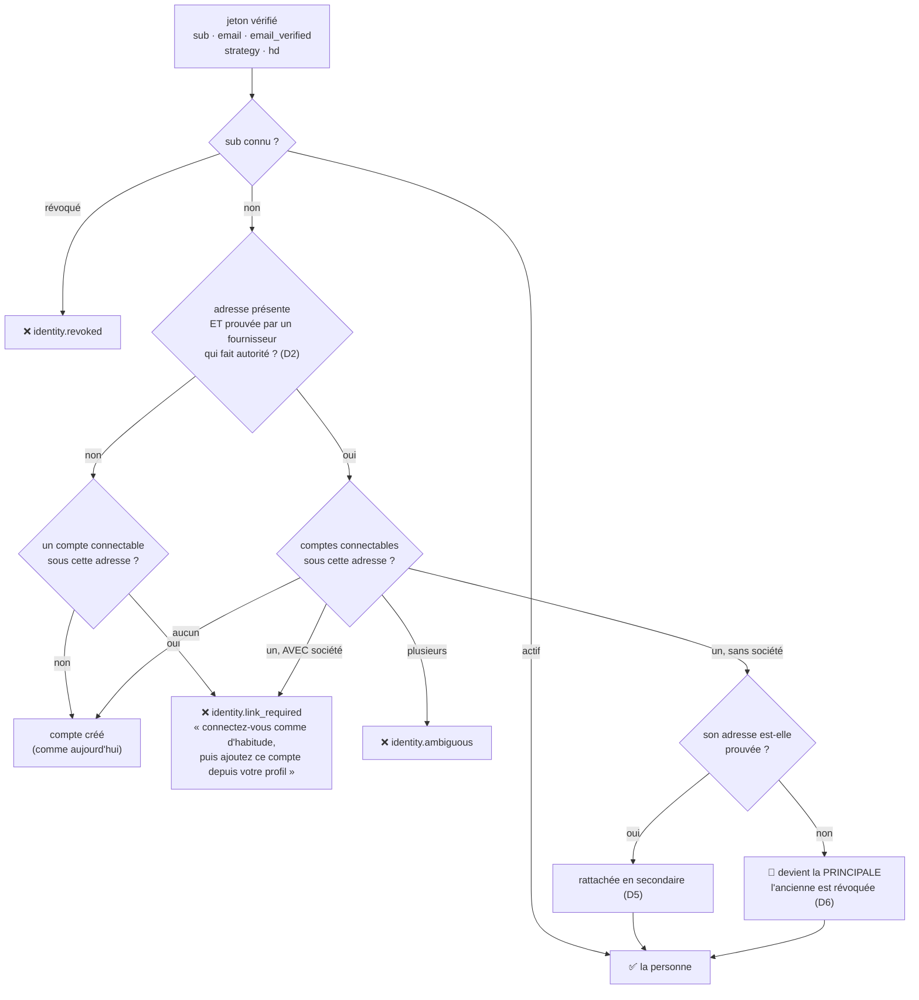
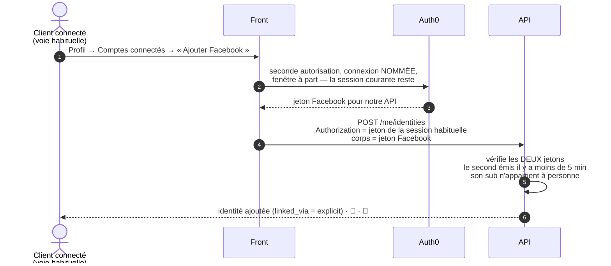

# Plan — se connecter avec Google, Facebook ou Apple, et garder son compte

**Statut** : 📐 plan, **version 2 du 2026-09-17**. **Rien n'est bâti.** Déplace
une **frontière de sécurité** — qui entre dans quel compte — et revient sur une
décision écrite
([`architecture-inscription-zero-friction.md`](architecture-inscription-zero-friction.md) :
« la porte Continue with Google disparaît du parcours »).

La version 1 (rattachement automatique par adresse, sans condition sur le
compte cible) a été **contredite par `vitruve` : 4 BLOQUANT, 11 SÉRIEUX**. Cette
version est réécrite sur le modèle que les grands services ont adopté depuis la
publication du « pre-account hijacking » ; le sort de chaque objection est au
§10.

🔴 **La version 2 a été contredite à son tour le même jour : 4 BLOQUANT,
11 SÉRIEUX** (§11). D6 (la promotion automatique) et le mécanisme de D7 ne
tiennent pas, et le lot 0 ne ferme pas le trou staff. **Ne pas bâtir** : une
version 3 attend les décisions du §11.3.

✅ **Le lot 0 est bâti le 2026-09-17** (non commité à cette date), dans sa forme
corrigée par le §11 (B4, S7) — détail au §5. Google est **coupé sur
l'application admin** du tenant le même jour (« La Folie Coffee Admin Suite » ;
« LFD Back Office » l'était déjà).

⚠️ **Un compte Facebook n'a pas toujours d'adresse**, et un compte sans adresse
ne reçoit **pas** le courriel qui porte son QR de retrait (trou existant,
vérifié le 2026-09-17) : §12.

**Portée** : les **clients** (`lfc-b2b-customers`), particuliers et pros. Le
**staff** n'aura jamais de connexion sociale — mais un défaut de son accès,
trouvé en chemin, est corrigé **avant** ce chantier (lot 0).

---

## 0. La demande

> « est-ce que je peux faire un social login et même register en cliquant sur
> se connecter ? » · « on ne peut pas faire en sorte d'avoir juste le jeton
> Facebook, Google, et moi je garde tout mon user ? » · « et si le Facebook
> dépend d'un autre mail que celui avec lequel il s'est inscrit ? » · « mon
> patron voudrait ça pour les clients […] le fait qu'un B2C puisse aussi avoir
> un espace pro complexifie » · « si je veux Google et Facebook ? » — Hugo,
> 2026-09-17.

Référence montrée : l'écran d'entrée de Sushi Shop — « Continuer avec
Facebook / Apple / Google », puis un champ e-mail. Un seul écran pour entrer,
qu'on ait un compte ou non.

**En une phrase pour la direction** : un particulier se connecte avec Google,
Facebook ou Apple en un clic ; un client pro le peut aussi, après l'avoir activé
une fois depuis son compte.

---

## 1. L'existant (ouvert et vérifié le 2026-09-17)

**Côté client**

- **Une personne = un `sub`.** `users.auth0_sub` est **unique et nullable**
  (`account.prisma`). `CustomerPrincipalResolver` retrouve la personne par ce
  seul `sub` ; un `sub` inconnu est **provisionné au vol** (compte `active`,
  sans société, adresse = claim du jeton **même non vérifiée**).
- **L'adresse n'est pas unique en base** : « l'inscription libre crée un compte
  par sujet d'identité, pas par adresse » (`prisma-company-member.repository.ts`).
  Un `sub` nouveau sous une adresse connue crée donc **déjà** un second compte,
  en silence.
- **`auth0_sub IS NOT NULL` sert de marqueur « compte connectable »** à trois
  endroits : le registre des invités de la boutique
  (`prisma-guest-buyer.registrar.ts`), le préavis aux propriétaires
  (`prisma-guest-order-notice.reader.ts`), et
  `PrismaCompanyMemberRepository.findAccountByEmail`. Quatre autres fichiers
  lisent la colonne : `customer-principal.resolver.ts`,
  `prisma-pending-access.reader.ts`, `prisma-impersonation-subjects.ts`,
  `prisma-account.reader.ts` (`/me` rend `auth0_sub`).
- **Le jeton client porte l'adresse et sa preuve** : l'Action `add-email-claim`
  pose `…/email` et `…/email_verified` (`auth0-claims.ts`). `record()` recopie
  `emailVerified` quand le jeton prouve l'adresse **en base**
  (`tokenProvesAddress`) — **sans regarder le fournisseur**.
- **Sur `users.email_verified` s'appuient** : le rattachement d'une société par
  le staff (`grant-account-access.service.ts`), les dérogations d'accès par
  adresse (`feature-level-resolution.ts`).
- **Le staff rattache déjà une identité par adresse** —
  `GrantAccountAccess.adoptIdentity` puis `rebindSubject` —, mais seulement
  pour un invité ou un sujet périmé, et jamais depuis une surface publique. Une
  cliente **active** passe par `attachToActive`, sans toucher au `sub`.
- **Le changement d'adresse vise le `sub` du jeton**
  (`UpdateMyProfileHandler` → `identity.changeEmail(command.subject, …)`).
- **Le front nomme la connexion** `lfc-b2b-customers` à `login()`,
  `register()`, `registerPro()` (`CUSTOMER_CONNECTION`). C'est de l'**ergonomie**,
  pas un contrôle : le paramètre `connection` est choisi par le client.
- La note d'inscription relève « Connexions activées sur l'application :
  `lfc-b2b-customers` seule (**+ Google**) » : **Google est peut-être déjà
  actif** sur l'application cliente. Non vérifié sur le tenant.
- **Aucun code ne lit la connexion d'origine d'un jeton.**
- **Les actes sont attribués à la personne, jamais au `sub`** :
  `AuthGuard` pose `{ type: "customer", id: userId }`.
- **Un refus pendant la résolution sort en 401**, et aucun code du front ne
  traite un 401.

**Côté staff** — le défaut trouvé en chemin

- La frontière staff/client est l'**audience** du jeton
  (`admin-token.verifier.ts`). Rien ne vérifie l'application, la connexion ni
  `azp`.
- `PrismaStaffAccessResolver.findStaff` rapproche une fiche **par adresse**, et
  le jeton staff **ne porte pas `email_verified`** : la preuve n'est pas lue.
- `recordEntry` **réécrit `auth0Id`** dès qu'il diffère du `sub` présenté, même
  s'il était déjà posé.

---

## 2. Le modèle

Trois principes, empruntés à la pratique établie (Firebase « une adresse, un
compte », guides d'Auth0 sur le rattachement) :

1. **Notre `User` est la seule identité métier.** Un fournisseur ne donne
   qu'une preuve : « ce porteur est ce `sub` ». Profil, sociétés, commandes,
   rôles restent chez nous.
2. **La preuve la plus forte gagne.** Une identité qui **prouve** la boîte
   l'emporte sur une identité qui ne l'a jamais prouvée — l'inverse n'arrive
   jamais.
3. **Le rattachement dépend de ce que le compte détient.** Un compte qui porte
   une société ne se rattache jamais par adresse : la personne le fait
   elle-même, connectée.



---

## 3. Décisions

### D1 — Un registre des identités, sans toucher au sens de `auth0_sub`

`users.auth0_sub` **reste l'identité principale** et le marqueur
« connectable » que trois lecteurs utilisent. Les autres identités vont dans :

```
user_identities
  id          text         PK  (IdGenerator)
  user_id     text         FK → users.id  ON DELETE RESTRICT
  subject     text         UNIQUE           -- google-oauth2|…, facebook|…, apple|…, auth0|…
  strategy    text                          -- stratégie Auth0 telle quelle
  linked_at   timestamptz
  linked_via  text                          -- 'verified_email' | 'explicit' | 'promotion'
  revoked_at  timestamptz  NULL
  revoked_why text         NULL
```

Et une colonne additive `users.auth0_strategy` (nullable) : la stratégie de la
principale, posée à la provision et à la promotion. `NULL` = principale
antérieure à ce lot.

🔴 **Un sujet n'appartient qu'à une personne, et la base le tient.** `UNIQUE`
sur chaque table ne suffit pas : deux déclencheurs (`users`, `user_identities`)
prennent `pg_advisory_xact_lock(hashtext(subject))` et refusent un sujet déjà
présent dans l'autre table, sauf pour la même personne. Migration relue par
`lecteur-de-migrations`.

**Jamais de `DELETE`** : une identité se **révoque**. Une ligne effacée serait
rattachée de nouveau à la connexion suivante.

### D2 — Les stratégies et leur autorité sur l'adresse

| Stratégie Auth0                           | Fait autorité sur l'adresse ?                                                                                                            |
| ----------------------------------------- | ---------------------------------------------------------------------------------------------------------------------------------------- |
| `google-oauth2`                           | **oui** si l'adresse finit par `@gmail.com`, ou si le claim `hd` est présent et égal au domaine de l'adresse (Workspace) ; **non** sinon |
| `apple`                                   | **oui** — une adresse masquée (`@privaterelay.appleid.com`) ne correspond de toute façon à aucun compte                                  |
| `facebook`                                | **non**, jamais                                                                                                                          |
| `auth0` (base de données)                 | la preuve vient de la vérification d'adresse d'Auth0 ; **elle ne rattache jamais** une identité à un autre compte                        |
| `google-apps`, autre, ou **claim absent** | **non**                                                                                                                                  |

La stratégie et `hd` se lisent sur des claims posés par l'Action
(`…/connection_strategy`, `…/google_hd`), jamais sur le préfixe du `sub`.
**Claim absent = pas d'autorité.**

⚠️ **`tokenProvesAddress` suit la même table.** Une adresse ne devient
« prouvée » en base (`record()`) que si le jeton vient d'une stratégie qui fait
autorité, ou de la base de données après vérification. Un compte ouvert par
Facebook n'a donc jamais d'adresse prouvée par ce chemin — ce qui ferme la voie
par laquelle Facebook ouvrait le rattachement d'une société par le staff.

### D3 — La résolution, dans l'ordre (schéma du §2)

1. **sujet connu** : principale, ou secondaire active → la personne ;
   secondaire **révoquée** → refus `identity.revoked` ;
2. **adresse absente ou vide** → aucune recherche : compte créé ;
3. **adresse non prouvée par une autorité** (D2) : si un compte connectable la
   porte → refus `identity.link_required` ; sinon → compte créé ;
4. **adresse prouvée par une autorité** : zéro compte → créé ; plusieurs →
   `identity.ambiguous` ; un compte **avec** au moins une société →
   `identity.link_required` ; un compte **sans** société → D5 ou D6.

🔴 **Plus jamais de second compte silencieux** sous une adresse déjà portée par
un compte connectable. C'est un changement pour les connexions existantes aussi
— et c'est pour ça que chaque refus a un **geste de sortie** (D9).

⚠️ La comparaison d'adresses reste `trim` + minuscules. `j.doe@gmail.com` et
`jdoe@gmail.com` ne se rejoignent pas : Google les tient pour une même boîte,
nous non. Assumé — normaliser les points Gmail rattacherait sur une règle
propre à un fournisseur.

### D4 — Les espaces pro ne se rattachent jamais par adresse

Un compte qui porte **au moins un rattachement de société** refuse tout
rattachement automatique, quel que soit le fournisseur. La personne se connecte
par sa voie habituelle et ajoute Google, Facebook ou Apple depuis son profil
(D7).

La raison n'est pas l'origine du compte mais **ce qu'il vaut** : un compte pro
commande au compte, voit des prix négociés et des factures, et son détenteur
invite des membres. Une adresse tapée par un commercial peut comporter une
faute ; une boîte peut changer de mains dans un restaurant.

**Le cas limite, et le choix proposé** : un particulier rattaché par adresse
(D5, D6) à qui le commercial ouvre ensuite une société **garde** son identité
Google. Elle a prouvé la boîte même que le commercial a enregistrée — autant
qu'un code envoyé par courriel l'aurait fait. Le commercial vérifie la personne
à l'ouverture. **À confirmer par Hugo** (§8).

### D5 — Compte particulier, adresse prouvée des deux côtés : rattachement

La cible a déjà prouvé la boîte, le fournisseur la prouve aussi : c'est la même
personne, au sens où une connexion par code e-mail le dirait. L'identité est
ajoutée en **secondaire** (`linked_via = verified_email`).

### D6 — Compte particulier à l'adresse jamais prouvée : la preuve gagne

C'est le **compte piège** de `vitruve` (B1) : quelqu'un ouvre un compte sous
l'adresse d'autrui sans la prouver, et attend. Le titulaire de la boîte arrive
par Google.

Le titulaire gagne, dans **une seule transaction** :

1. l'identité Google devient la **principale** (`users.auth0_sub`,
   `users.auth0_strategy`) ;
2. l'ancienne principale entre dans `user_identities`, **révoquée**
   (`revoked_why = 'unproven_address_superseded'`) ;
3. l'adresse du compte devient **prouvée**.

Puis, hors transaction et **rejouable** (D8) : l'identité révoquée est
**bloquée chez Auth0** (`blocked: true`) et ses sessions sont révoquées.
Endpoints de la Management API **à vérifier** avant le lot B.

**L'effet chez nous est immédiat, sans attendre Auth0** : un jeton encore
valide de l'ancienne identité présente un `sub` révoqué → refus
`identity.revoked` (D3, étape 1).

⚠️ Ce qui reste : ce que l'occupant a saisi (profil, panier) reste sur le
compte. Pas de société possible (D4), donc pas d'argent au compte. Le courriel
de D8 le dit au titulaire.

⚠️ **Le cas honnête** : quelqu'un ouvre son compte par Facebook (adresse jamais
prouvée), puis clique Google avec la même adresse. Sa connexion Facebook est
révoquée ; il la rajoute en un clic depuis son profil (D7). C'est le prix de la
règle, et le courriel le dit.

### D7 — Le rattachement explicite, depuis le profil

La **seule** voie pour : Facebook, une adresse différente du compte, un compte
pro, une adresse Apple masquée.



- La preuve est « **la même personne tient les deux sessions** ». L'adresse du
  fournisseur n'est ni lue, ni recopiée.
- Le jeton **habituel** doit venir d'une identité active de la personne.
- Un `sub` déjà utilisé ailleurs est refusé : « ce compte Facebook ouvre déjà un
  autre compte chez nous ».
- **Retirer** une connexion depuis la même page la **révoque** (D1). La
  principale ne se retire pas.

**Ce que D7 ne rattrape pas : le doublon déjà créé** par une première entrée
Facebook sous une autre adresse. Pas de fusion de comptes dans ce plan. L'écran
d'entrée le prévient (D11), et un compte social sans commande ni société
s'abandonne sans perte.

### D8 — Tout rattachement et toute révocation se voient

- **Une commande applicative** (`LinkIdentity`, `RevokeIdentity`), pas un effet
  de bord du resolver : le resolver décide et délègue ; l'écriture a son
  **unité de travail**.
- **Un fait publié après commit** (`IdentityLinkedEvent`,
  `IdentityRevokedEvent`), d'où :
  - 📓 `account.identity_linked` / `account.identity_revoked` — charge =
    stratégie, voie, `sub`, raison. Clé d'idempotence **explicite**
    `<type>:<subject>` : le port `Journal` doit gagner ce paramètre (il la
    dérive aujourd'hui du `traceId`) ;
  - 📧 à l'adresse du compte : « Une connexion Google a été ajoutée à votre
    compte » / « … a été retirée ». Hors requête (`BackgroundWork`), clé
    déterministe ;
  - le **blocage Auth0** de D6, rejouable.
- **L'acteur porte le `sub`** : `AuthGuard` pose
  `{ type: "customer", id: userId, subject }`. Sans lui, on ne sait jamais ce
  qu'une identité abusive a fait.

⚠️ Le courriel ne protège pas contre D6 (il part chez le titulaire, qui vient
de cliquer) : il protège contre D5 et D7, où un tiers aurait agi.

### D9 — Chaque refus dit quoi faire

Les refus de D3 sont des `BusinessError` (409) avec un **code**, levés depuis la
résolution. Le front les attrape sur `GET /me` et ouvre une page dédiée :

| Code                     | Ce que la page dit                                       | Geste                                                                                                  |
| ------------------------ | -------------------------------------------------------- | ------------------------------------------------------------------------------------------------------ |
| `identity.link_required` | « Un compte existe déjà avec cette adresse. »            | « Me connecter autrement » (déconnexion, puis connexion habituelle), puis « Ajouter Google » au profil |
| `identity.ambiguous`     | « Plusieurs comptes utilisent cette adresse. »           | « Nous contacter » (formulaire de demande)                                                             |
| `identity.revoked`       | « Cette connexion n'est plus autorisée pour ce compte. » | « Me connecter autrement »                                                                             |

**Les comptes au `sub` périmé** (identité supprimée chez Auth0, sujet `dev|…`
écrit en production) tombent sur `link_required` sans pouvoir « se connecter
comme d'habitude ». « Nous contacter » est aussi proposé sur cette page, et le
runbook (§6) dit comment l'équipe les rétablit.

### D10 — Les autres gestes sur l'identité visent la principale

- `changeEmail` part sur `users.auth0_sub`, plus sur `command.subject`. Si la
  principale n'est pas `auth0` (`users.auth0_strategy`), le changement est
  **refusé** : « votre adresse est gérée par Google ».
- **Changer d'adresse révoque les identités `verified_email`** : leur preuve
  portait sur l'ancienne boîte. Les identités `explicit` restent — la personne
  les avait ajoutées elle-même —, et le courriel de D8 les liste.
- `issuePasswordLink` et `rebindSubject` ne changent pas.

### D11 — Le front

**Voie proposée** : notre écran d'entrée, comme la référence.

- « Continuer avec Google », « Continuer avec Facebook », « Continuer avec
  Apple », puis l'e-mail. Chaque bouton nomme **sa** connexion ; l'e-mail garde
  `lfc-b2b-customers` et sa passkey.
- Sous les boutons : « Vous avez déjà un compte avec une autre adresse ?
  Connectez-vous comme d'habitude, puis ajoutez Facebook depuis votre profil. »
- « Se connecter » et « Créer mon compte » y mènent tous les deux : un bouton
  social crée le compte à la première connexion.
- **Profil → Comptes connectés** : la liste, « Ajouter », « Retirer » (D7).
- **Le téléphone** ne vient d'aucun fournisseur : `ClientOnboarding` le demande
  après coup, comme pour qui n'est pas passé par `/inscription`.
- La page des refus (D9).

---

## 4. Ce que ce plan ne fait pas

- **Le staff** : aucune connexion sociale, jamais. Son défaut d'accès est
  corrigé au lot 0, indépendamment.
- **Fusionner deux comptes.**
- **Rendre ses commandes d'invité** à qui ouvre un compte sous la même adresse
  (§8).
- **La connexion par code e-mail** comme voie universelle — le complément
  naturel, plus tard.
- **Une règle par société** (« chez nous, pas de connexion sociale ») ou une
  **vérification renforcée** pour les gestes sensibles — si les restaurants le
  demandent.

---

## 5. Les lots

**Lot 0 — le staff, avant tout** (indépendant, déployable seul) — ✅ **bâti le
2026-09-17**, contredit par `vitruve` le même jour (aucun bloquant) :

- `PrismaStaffAccessResolver` refuse tout `sub` hors connexion base de données
  (`isOutsideDatabaseConnection`), même lié — **avant** le cache ;
- le rapprochement par adresse exige `email_verified === true` (claim lu par
  `AdminTokenVerifier`) **et** une fiche sans `auth0Id` ; la liaison est
  conditionnée en base (`updateMany … auth0Id: null`), une course perdue est
  un refus ;
- **la sortie** d'une fiche liée à un `sub` mort ou refusé est la
  réinvitation : `OpenStaffAccess` rouvre par l'adresse (`provision`) et relie
  (S7) ;
- ce qui reste hors du code est au runbook, « Avant de déployer « le staff
  n'entre plus par son adresse » ».

La conception d'origine, pour mémoire :

- Le jeton staff porte `email_verified` (même Action).
- `findStaff` ne rapproche par adresse **que si elle est prouvée**.
- `recordEntry` **ne réécrit jamais** un `auth0Id` déjà posé : il ne le pose que
  s'il est vide.
- Tests de non-régression sur les deux refus.
- ⚠️ Avant de déployer : vérifier que le lien d'invitation staff produit bien
  une adresse prouvée chez Auth0 — sinon plus aucun nouveau membre n'entre.
- Côté tenant (Hugo) : quelles applications peuvent demander l'audience admin,
  quelles connexions sont actives sur l'application admin.

**Lot A — le registre et la résolution** : migration (`user_identities`,
`users.auth0_strategy`, déclencheurs) ; claims `connection_strategy` et
`google_hd` dans `VerifiedToken` ; règles pures `identityAuthority(…)` (D2) et
`resolutionOutcome(…)` (D3 à D6), testées cas par cas ; commandes
`LinkIdentity` et `RevokeIdentity` ; `tokenProvesAddress` aligné sur D2 ; refus
codés (D9) ; `AuthGuard` pose le `sub` dans l'acteur.

**Lot B — Auth0** : `blockIdentity`, `revokeSessions` sur le port d'identité
(endpoints à vérifier) ; l'abonné rejouable de D6.

**Lot C — le rattachement explicite** : `POST /me/identities`,
`DELETE /me/identities/:id` (révocation), `GET /me/identities` ; vérification
du second jeton ; D10.

**Lot D — ce qui se voit** : journal (clé explicite sur le port), courriels
fr/en/it.

**Lot E — le front** : écran d'entrée, comptes connectés, page des refus,
téléphone après coup.

**Lot F — la documentation** : note d'inscription, JSDoc de
`CUSTOMER_CONNECTION` et de `register()` (qui annonce un statut « invité » que
la provision ne pose pas), runbook (§6).

**Tests e2e minimum** : chaque branche du schéma du §2 ; le compte piège (D6) —
l'ancienne identité refusée aussitôt ; deux premières requêtes simultanées d'un
même `sub` ; un compte pro refuse l'automatique ; le mur tenant tient à travers
une secondaire ; une identité révoquée ne revient pas.

**Retour arrière** : une fois des identités rattachées, retirer le code les rend
inconnues et la provision leur recrée des comptes. Le retour arrière garde donc
la **lecture** du registre (étape 1 de D3), même si le rattachement est coupé.

---

## 6. Ce que le runbook devra dire

**Retirer une identité abusive** — jamais de suppression :

1. `revoked_at` + `revoked_why` sur la ligne (effet immédiat chez nous) ;
2. **bloquer** l'utilisateur chez Auth0 (ne pas le supprimer : une identité
   sociale supprimée se recrée à l'identique) ;
3. révoquer ses sessions et jetons de rafraîchissement ;
4. lire le journal par `sub` (D8) pour savoir ce qu'elle a fait.

**Rétablir un compte au `sub` périmé** (D9) : rattacher sa nouvelle identité
par le geste staff existant (`adoptIdentity`), après avoir vérifié la personne.

---

## 7. Réglages hors du code — gestes de Hugo

1. **Vérifier d'abord** : Google est-il déjà actif sur l'application cliente ?
   Combien de comptes ont un `sub` qui n'est pas `auth0|` en production ?
2. Activer **Google, Facebook, Apple sur l'application cliente seulement**.
3. Étendre l'Action : `connection_strategy` (`event.connection.strategy`),
   `google_hd`, et `email_verified` sur le jeton staff.
4. **Politique d'accès aux API** : l'application cliente ne doit pas pouvoir
   demander l'audience admin.
5. **Meta** : application en production, politique de confidentialité en
   ligne, URL de suppression des données.
6. **Apple** : Service ID et clé ; **déclarer le domaine d'envoi** des
   courriels (Resend) dans le service de relais privé — sans quoi nos messages
   aux adresses masquées rebondissent, et une adresse en rebond dur entre dans
   la liste de suppression (`CLAUDE.md` §0).
7. **App Store** : si l'app cliente y part un jour, Apple exige « Se connecter
   avec Apple » dès qu'on propose Google ou Facebook (règle 4.8, telle que
   connue au 2026-09-17 — à revérifier). D'où les trois boutons dès la V1.

---

## 8. À trancher par Hugo

1. **Le cas limite de D4** : un particulier rattaché à Google, qui devient pro,
   garde sa connexion Google — d'accord ? (Alternative : la bloquer sur les
   espaces pro jusqu'à confirmation explicite.)
2. **La révocation de D6 sur le cas honnête** (Facebook puis Google) — d'accord ?
3. **L'écran d'entrée** à nous (D11), plutôt que l'Universal Login avec ses
   boutons ?
4. **Les commandes d'invité** : dans ce plan, ou plus tard ?
5. **Le lot 0** peut-il partir tout de suite, avant le reste ?

---

## 10. La contradiction de `vitruve` sur la version 1, et son sort

| #       | Objection                                                                                                               | Sort dans la version 2                                                                          |
| ------- | ----------------------------------------------------------------------------------------------------------------------- | ----------------------------------------------------------------------------------------------- |
| **B1**  | le compte piège : on rattachait la victime au compte d'un attaquant                                                     | **corrigée** — D6 : la preuve gagne, l'ancienne identité est révoquée, effet immédiat chez nous |
| **B2**  | Facebook restait une preuve via `tokenProvesAddress`                                                                    | **corrigée** — D2 s'applique aussi à `record()`                                                 |
| **B3**  | le staff n'est pas protégé ; rapprochement par adresse non prouvée et réécriture d'`auth0Id` (**vérifié dans le code**) | **lot 0**, avant tout, et vérification du tenant (§7)                                           |
| **B4**  | détacher se défait tout seul ; enquête impossible                                                                       | **corrigée** — révocation, jamais de `DELETE` (D1) ; `sub` dans l'acteur (D8) ; runbook (§6)    |
| S1      | « un sujet, une personne » n'était qu'une vérification                                                                  | déclencheurs avec verrou par sujet (D1)                                                         |
| S2      | le scénario de `rebindSubject` n'existait pas ; stratégie de la principale inconnue                                     | point retiré ; `users.auth0_strategy` (D1)                                                      |
| S3      | le refus bloque les `sub` périmés ; aucun 401 affiché                                                                   | refus codés en 409 et page dédiée (D9) ; runbook                                                |
| S4      | Google peut-être déjà actif ; nommer la connexion n'est pas un contrôle                                                 | constaté au §1, vérification en tête du §7                                                      |
| S5      | une identité survit au changement d'adresse                                                                             | D10                                                                                             |
| S6      | ni clé d'idempotence, ni acteur, ni unité de travail                                                                    | D8                                                                                              |
| S7      | logique dans une classe d'infrastructure                                                                                | commandes applicatives (D8)                                                                     |
| S8      | normalisation, Apple relay et rebonds                                                                                   | assumé et écrit (D3) ; domaine déclaré chez Apple (§7)                                          |
| S9      | Google ne fait autorité que sur `@gmail.com` ou avec `hd`                                                               | D2                                                                                              |
| S10     | adresse absente                                                                                                         | D3, étape 2                                                                                     |
| S11     | retour arrière                                                                                                          | §5                                                                                              |
| Mineurs | noms et comptes faux au §1, stratégies, générateur d'identifiant                                                        | corrigés au §1 et en D1                                                                         |

## 11. La contradiction de `vitruve` sur la version 2 (2026-09-17)

Les quatre bloquants ont été **rouverts dans le code** et se confirment.

### 11.1 Les bloquants

**B1 — D6 prend un compte légitime.** `users.email_verified` ne dit pas
« jamais prouvée », il dit « prouvée **en ce moment** » :
`PrismaUserProfileRepository` le remet à `false` à chaque changement d'adresse
(vérifié). Une cliente installée qui change son adresse avec une faute de
frappe a une adresse non prouvée ; le titulaire de la boîte fautive clique
Google, D6 le promeut, et l'identité de la cliente est révoquée puis bloquée.
Il récupère l'historique et les commandes à retirer.

**B2 — Le « cas honnête » de D6 est une perte définitive.** L'identité bloquée
ne peut plus produire de jeton, son `sub` reste révoqué, et D7 refuse un `sub`
déjà connu : « la rajouter en un clic » est impossible. Pire, dans le cas le
plus courant — mot de passe jamais vérifié, puis Google —, l'identité bloquée
est celle de `lfc-b2b-customers`, et Auth0 refuse une seconde inscription sous
la même adresse : la personne perd **pour toujours** mot de passe et passkey.

**B3 — D7 ne tient pas dans le front.** Vérifié dans `@auth0/auth0-spa-js`
2.24.1 : un échange `authorization_code` d'un autre `sub` **vide le cache** et
remplace la session. La « fenêtre à part » connecterait tout le front sous
Facebook. Et une identité sociale qui a déjà appelé l'API a été provisionnée à
sa première requête : « son `sub` n'appartient à personne » exclut presque tous
les vrais cas. La vérification du second jeton ignore aussi `azp`, et n'a ni
nonce ni protection contre le rejeu.

**B4 — Le lot 0 ne ferme pas le trou staff.** `resolve()` construit l'accès à
partir de la fiche **trouvée**, que `recordEntry` écrive ou non (vérifié). Ne
plus réécrire `auth0Id` laisse un second `sub` obtenir les droits d'un membre
déjà lié, à chaque requête, sans jamais être lié. Il faut **refuser** le
rapprochement par adresse quand `auth0Id` est déjà posé.

### 11.2 Les sérieux, en bref

| #   | Objection                                                                                                                                                    | Direction                                                                                         |
| --- | ------------------------------------------------------------------------------------------------------------------------------------------------------------ | ------------------------------------------------------------------------------------------------- |
| S1  | la promotion n'a pas de mécanisme contre deux requêtes simultanées ; déclencheurs : ordre des verrous, `IS DISTINCT FROM`, erreur brute vers `rebindSubject` | écriture conditionnelle ; verrous dans un ordre fixe ; erreur catégorisée                         |
| S2  | D4 se juge sur une lecture non verrouillée ; une société « sans propriétaire » échappe à D4                                                                  | lecture verrouillée ; D4 regarde aussi les sociétés à réclamer                                    |
| S3  | « pas d'argent au compte » est faux : commandes particulier, paniers, abonnements, QR de retrait                                                             | dire ce qu'on fait de ce que l'occupant a laissé                                                  |
| S4  | l'acteur est posé après `resolve()` ; `activity_events` n'a pas de colonne pour un `sub` client                                                              | migration `growth`, évolution d'`Actor`                                                           |
| S5  | un fait « publié après commit » contredit le port `Journal`, qui écrit dans la transaction                                                                   | `uow.run(… publishTraced …)`, le motif en place                                                   |
| S6  | un 409 levé dans le garde frappe toutes les routes ; le front ne distingue aucun code                                                                        | intercepteur sur `identity.*` ; le pro invité sans mot de passe a le lien d'invitation pour geste |
| S7  | le lot 0 supprime la seule réparation d'un membre du staff dont l'identité a été recréée ; le renvoi d'invitation lève sans reprise                          | un geste staff de réalignement, et la reprise côté staff                                          |
| S8  | D2 dépend de l'Action : sans le claim, plus aucune adresse n'est prouvée                                                                                     | ordre écrit : l'Action d'abord, vérifiée                                                          |
| S9  | un compte social sans adresse ne pourrait jamais en recevoir une                                                                                             | D10 l'autorise quand l'adresse est vide                                                           |
| S10 | le blocage Auth0 ne se défait qu'à la main ; `rebindSubject` réécrit la principale sans la consigner                                                         | le dire ; consigner                                                                               |
| S11 | le resolver est en `infrastructure/` et déclencherait des commandes applicatives                                                                             | le déplacer, ou lui donner un port                                                                |

Mineurs : le §9 manque ; l'Action pose probablement déjà `email_verified` sur
tout jeton (c'est `AdminTokenVerifier` qui ne le lit pas) ; deux lecteurs de
`auth0_sub` oubliés (`client.seed.ts`, `prisma-user-profile.repository.ts`) ;
`ON DELETE RESTRICT` casse `reset.seed.ts` ; `linked_via`/`revoked_why` en
chaînes libres au lieu d'énumérés ; `googlemail.com` ; la clé d'idempotence
d'une seconde révocation.

Constaté en chemin : **le lien d'invitation staff pose déjà
`mark_email_as_verified: true`** (`auth0-identity.gateway.ts`) — la réserve du
lot 0 sur les invitations est levée pour les invitations passées par ce lien.

### 11.3 Ce qui doit être décidé avant une version 3

1. **Supprimer la cause plutôt que la traiter : exiger une adresse vérifiée
   avant qu'un compte par mot de passe puisse entrer** (règle dans l'Action de
   connexion). Un compte non vérifié ne reçoit alors jamais de jeton : le compte
   piège n'existe plus, et **D6 disparaît** — avec B1, B2, S1 et S3. C'est la
   parade recommandée par les auteurs du « pre-account hijacking ». Le prix :
   un e-mail à ouvrir avant la première commande, ce que la note d'inscription
   avait choisi d'éviter (« on économise l'attente »).
2. **Le rattachement explicite** ne peut pas passer par le SDK du front. Deux
   voies :
   - **côté API** : l'API mène elle-même l'autorisation Facebook (client
     confidentiel, `state` lié à la personne connectée), reçoit le code, et
     rattache ;
   - **par Auth0** (« Account Linking ») : **absent de l'offre Free** du tenant
     (vérifié le 2026-09-17 sur la page d'abonnement : coché à partir
     d'Essentials, 35 $/mois).
3. **Un compte social vide déjà provisionné** (B3) : autoriser le rattachement
   à le « reprendre » quand il n'a ni commande, ni société, ni panier.
4. **Le lot 0 corrigé** (B4, S7) peut partir seul, dès l'accord de Hugo.

---

## 12. Facebook ne donne pas toujours d'adresse (Hugo, 2026-09-17)

Un compte Facebook peut être ouvert avec un **numéro de téléphone**, et la
personne peut refuser de partager son adresse à l'autorisation. Le jeton arrive
alors sans claim `email`, et le provisioning crée le compte avec une adresse
**vide** — comportement actuel, assumé et documenté
(`access-token.verifier.ts` : « absent = provisioning JIT avec e-mail vide »).

### 12.1 Ce que ça casse aujourd'hui, avant même Facebook

**Vérifié dans le code le 2026-09-17** :

- rien n'empêche une commande d'un compte sans adresse ;
- `PrismaOrderRecipientReader` (`prisma-order-recipient.reader.ts:23`) rend
  `null` quand l'adresse est vide, et `OrderPlacedMailService` n'envoie alors
  **rien**, sans erreur ni trace.

Or ce courriel porte le **QR de retrait**. Un client paierait donc sans rien
recevoir pour venir chercher sa commande. Ce n'est pas propre à Facebook : tout
compte à l'adresse vide est concerné — le trou existe déjà.

### 12.2 La direction

1. **Demander l'adresse au panier**, pas à l'entrée : « il nous manque votre
   e-mail pour vous envoyer la confirmation et le QR de retrait », champ dans
   l'écran, passation impossible tant qu'il est vide. C'est la ligne de
   [`architecture-inscription-zero-friction.md`](architecture-inscription-zero-friction.md) :
   on ne demande qu'au moment où l'on en a besoin, et seulement à qui commande.
2. **La même règle côté API** — un refus nommé sur la passation. Le front seul
   ne tient rien : un appel direct passerait à côté, et c'est le courriel du
   client qui manquerait.
3. **Cette adresse est une adresse de CONTACT, pas de connexion.** Deux
   conséquences :
   - elle n'est pas prouvée, donc elle ne rattache **rien** (D2, D4, D5) ;
   - elle ne doit pas être propagée au fournisseur comme identifiant de
     connexion. ⚠️ À vérifier : le changement d'adresse du profil appelle
     aujourd'hui `changeEmail` chez Auth0, ce qui n'a pas de sens pour une
     identité Facebook — et Auth0 refuse la modification sur la plupart des
     connexions sociales.
4. **Même question pour le téléphone**, si on le veut obligatoire à la
   passation.

### 12.3 Reste à trancher

- **Où demander** : au panier (recommandé) ou juste après la connexion sociale.
- **Que fait-on des comptes vides déjà créés** — sujet commun avec B3 (§11.3,
  point 3).
