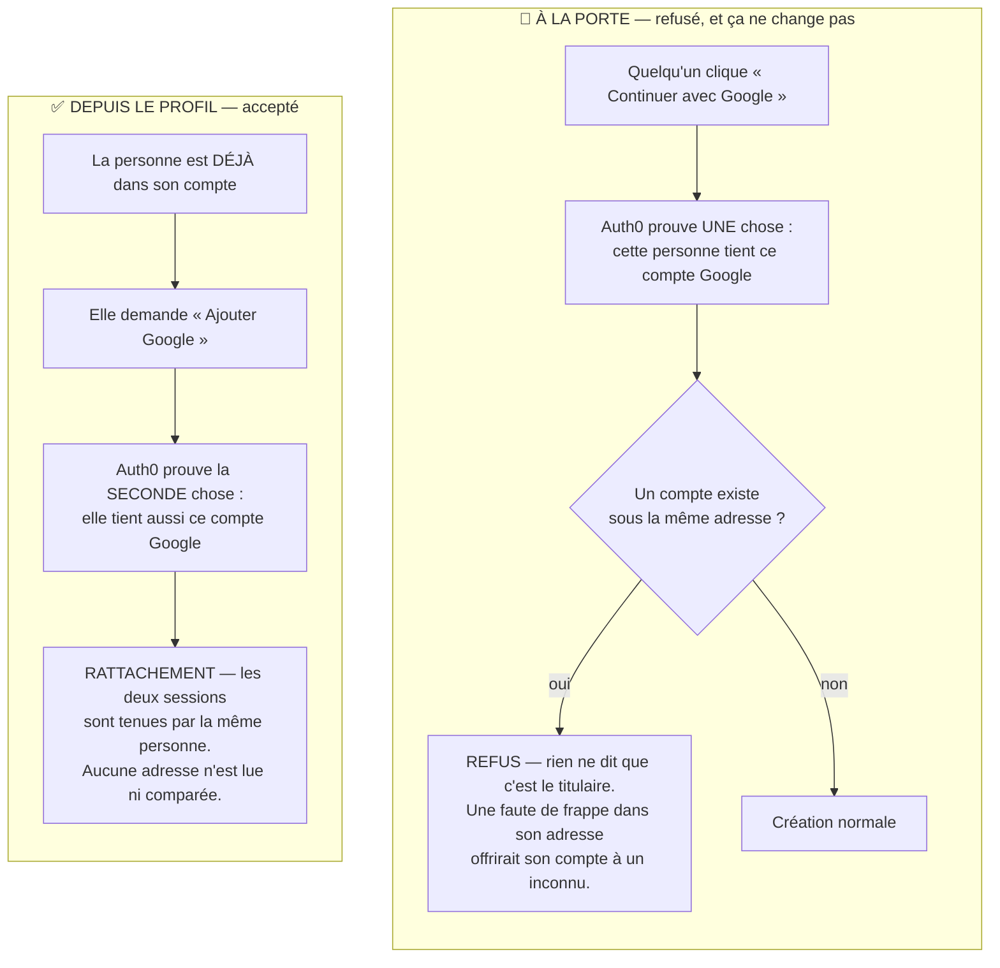
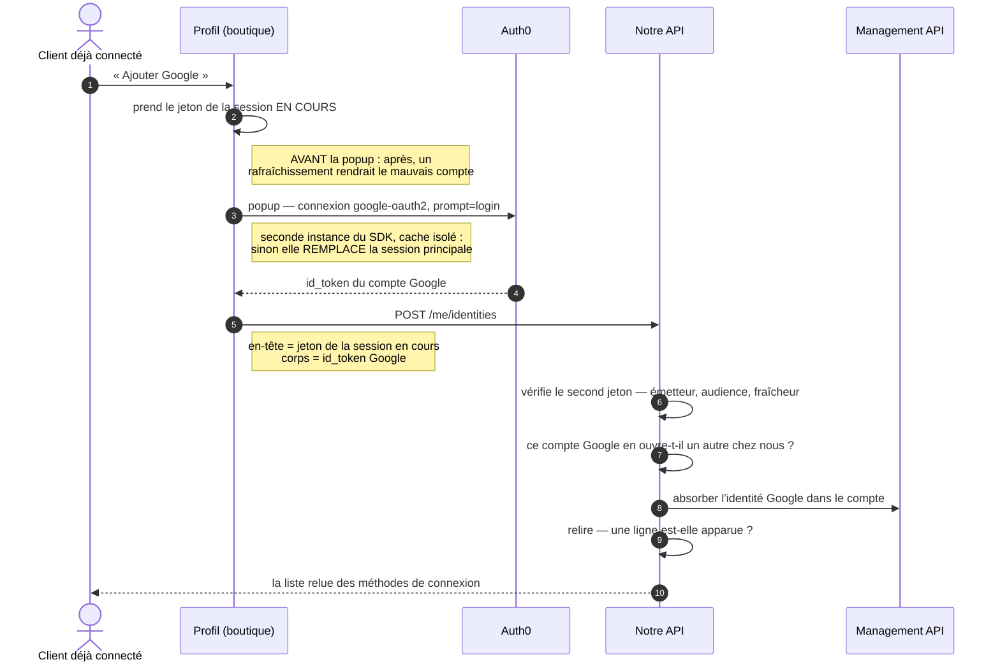
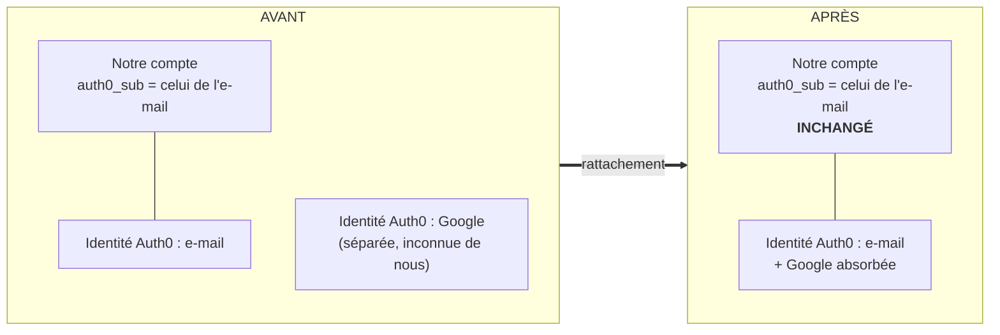
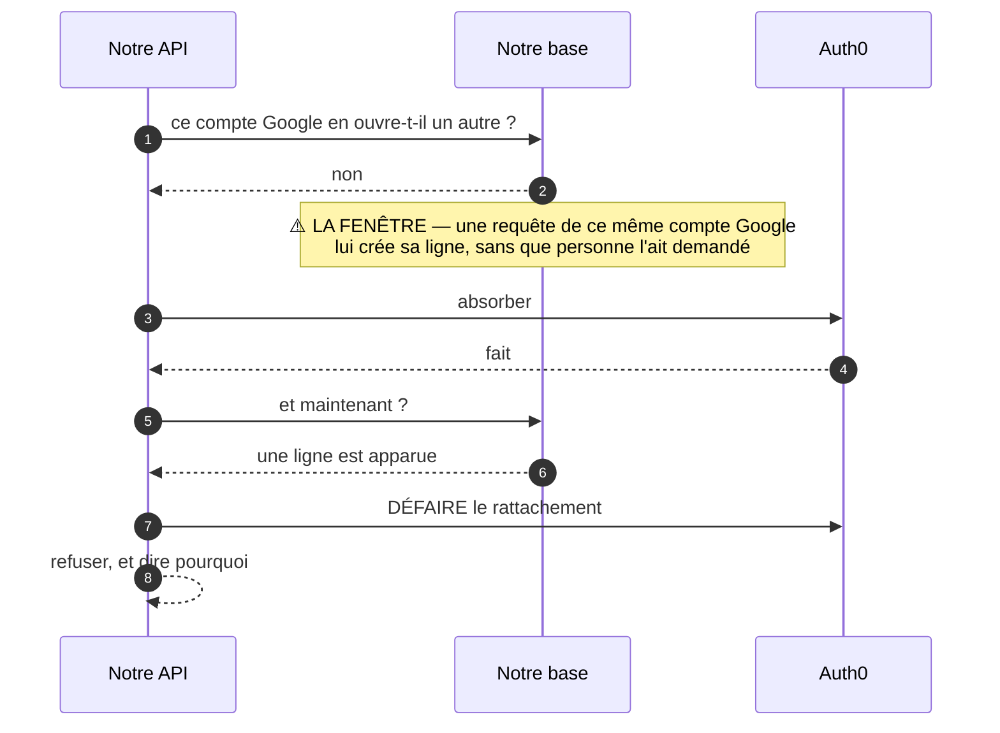

# Plan — ajouter Google ou Facebook à son compte, depuis son profil

**Statut** : 📐 plan, **version 1 du 2026-09-22**. Rien n'est bâti.
Déplace une **frontière de sécurité** (qui peut ouvrir quel compte) → `vitruve`
obligatoire avant soumission (CLAUDE.md §9 bis).

**Portée décidée par Hugo le 2026-09-22** : **le profil SEUL**, en **popup**,
et **Google d'abord** (« fais google pour l'instant »).

🔴 **Facebook est REPORTÉ, pas abandonné.** Ce que ça change, et ce que ça ne
change pas :

- **Rien dans la mécanique.** La connexion est un **paramètre** partout — c'est
  déjà la règle d'`Auth0IdentityGateway` (« la connexion est un paramètre […]
  en faire un paramètre plutôt que deux classes jumelles garantit qu'une
  correction faite pour l'un profite à l'autre »). Aucune route, aucune
  commande, aucun refus n'est écrit « pour Google » : ajouter Facebook sera une
  **entrée de liste**, pas une branche.
- **Ce que ça retire vraiment** : le geste de tenant n° 1 du §6 — savoir si
  Facebook est activé — et le démarchage Meta du n° 3. Google est déjà servi à
  la porte d'entrée aujourd'hui, donc la connexion existe et fonctionne.
- ⚠️ **Le piège à éviter** : écrire l'écran pour UN bouton. La section « Méthodes
  de connexion » se dessine sur une **liste** de fournisseurs qui n'en compte
  qu'un ; une section écrite au singulier se réécrit entièrement au second.

---

## 0. La demande

> « je pense qu'on va commencer par le mon profil dialog, commence par faire le
> truc pour ajouter les méthodes de connexion google facebook » · « pour
> l'instant on fait seulement depuis mon profil » · « tout le monde fait ça en
> popup » — Hugo, 2026-09-22.

Issu du §1 de
[`todos/todo-releve-version-deployee.md`](../todos/todo-releve-version-deployee.md) :
le compte de la **personne** n'a nulle part où vivre — ouverture pro, méthodes
de connexion, mot de passe. Celui-ci ne traite que les **méthodes de connexion**.

---

## 1. Ce que ce plan NE fait pas, et pourquoi c'est ce qui le rend petit

🔴 **La porte d'entrée ne bouge pas.** Cliquer « Continuer avec Google » sous
l'adresse d'un compte existant continue de **refuser**
(`SocialSignInAccountExistsError`, message inchangé). Le rattachement
**automatique par adresse** — D5 et D6 de
[`plan-connexion-sociale.md`](plan-connexion-sociale.md) — reste **non bâti et
non planifié ici**.

C'est délibéré, et ça évite **deux** de ses quatre bloquants : B1
(une faute de frappe dans son adresse offre son compte au titulaire de la boîte
fautive), B2 (perte définitive du mot de passe), S1 et S3 en découlent. **Tous
supposent qu'on rattache sans preuve de possession du compte cible.** Ici la
preuve est structurelle : pour ajouter Google à un compte, il faut **déjà être
dedans**.

⚠️ **Corrigé le 2026-09-22** : ce paragraphe disait « les quatre ». B3 n'est pas
évité mais _prétendu corrigé_ — et `vitruve` a montré que la correction était
incomplète (§8.1). Et **B4, le trou d'accès staff, est indépendant** du
rattachement par adresse : ni évité, ni traité, ni mentionné. Compter quatre
là où il y en a deux, c'est exactement ce qu'un plan ne doit pas faire.

⚠️ Conséquence assumée, à dire à l'écran (§5) : quelqu'un qui a **déjà** ouvert
un compte par Google sous une autre adresse a **deux comptes**, et ce plan ne
les fusionne pas. Il le **refuse** explicitement (§3, R3) plutôt que d'orpheliner
le second.

---

## 1 bis. Les quatre schémas

### A. Pourquoi ce geste-ci est sûr, et pas l'autre

La différence tient en une phrase : **à la porte d'entrée, on ne prouve qu'UNE
chose ; depuis le profil, on en prouve DEUX.**

⚠️ **L'adresse ne sert à rien dans la voie de droite**, et c'est exactement ce
qui la rend sûre : on ne peut pas s'approprier un compte en écrivant son adresse
quelque part.

### B. Le rattachement, de bout en bout

### C. Pourquoi notre base ne bouge pas d'une ligne

C'est la décision qui rend le chantier petit : **on relie chez Auth0, pas chez
nous**. L'identité Google est absorbée, et le compte garde son identifiant.

Se connecter par Google produit désormais un jeton portant **le sujet du compte
principal**. D'où : aucune migration, aucune table, rien à changer dans la
résolution d'accès.

### D. La course, et pourquoi on ne peut que la détecter

Le refus « ce compte Google en ouvre déjà un autre » se lit **chez nous**, et le
rattachement s'écrit **chez Auth0**. Rien ne tient la fenêtre entre les deux — et
ce qui la peuple est **automatique** : une première requête d'un compte inconnu
lui crée sa ligne.

🔴 **C'est une détection avec compensation, pas un verrou.** La fenêtre existe
toujours. Ce qui change : on ne la traverse plus en silence. Sans la relecture,
la ligne apparue serait devenue **inatteignable** — son identifiant ne
produirait plus jamais de jeton — et personne ne l'aurait su.

---

## 2. L'existant (ouvert et vérifié le 2026-09-22)

| Fait                                                                                                                                                                                                                                                                                                         | Où                                                                                                   |
| ------------------------------------------------------------------------------------------------------------------------------------------------------------------------------------------------------------------------------------------------------------------------------------------------------------ | ---------------------------------------------------------------------------------------------------- |
| `GOOGLE_CONNECTION = 'google-oauth2'` et `FACEBOOK_CONNECTION = 'facebook'` existent déjà, et servent la porte d'ENTRÉE                                                                                                                                                                                      | `apps/lfc-ecommerce-frontend/src/app/auth/auth.config.ts`                                            |
| ⚠️ Facebook n'est peut-être pas activé dans le tenant — le JSDoc de `FACEBOOK_CONNECTION` le signale comme un réglage de console jamais confirmé                                                                                                                                                             | idem                                                                                                 |
| `Auth0ManagementClient.call(method, path, body)` est **générique** : `DELETE` passe sans rien ajouter                                                                                                                                                                                                        | `platform/identity/auth0-management.client.ts`                                                       |
| `update:users` est **déjà** dans `REQUIRED_MANAGEMENT_SCOPES` — link et unlink n'en demandent pas d'autre                                                                                                                                                                                                    | `platform/identity/identity-diagnosis.ts:30`                                                         |
| ⚠️ `Auth0IdentityGateway` lit le tableau `identities`, mais par une fonction **privée de module** qui ne rend que des **noms de connexion** (`connectionsOf`). R6 a besoin de `provider` + `user_id` : **rien ne les lit aujourd'hui**                                                                       | `platform/identity/auth0-identity.gateway.ts`                                                        |
| `Principal.subject` existe et est **déjà** lu par une commande de `/me` (`UpdateMyProfileCommand`)                                                                                                                                                                                                           | `platform/auth/principal.ts:50`, `b2b/account/http/me.controller.ts:64`                              |
| 🔴 Un lecteur de plus de `Principal.subject` **fait échouer `lint:subject-readers`** tant qu'il n'est pas inscrit dans sa liste admise **avec sa raison**                                                                                                                                                    | `dev-toolbox/gates/subject-readers.mjs`                                                              |
| `@auth0/auth0-spa-js` **2.24.1** accepte un `cache` custom (`ICache`) — une seconde instance `Auth0Client` avec `new InMemoryCache()` est **isolée** du cache de l'instance Angular                                                                                                                          | paquet `@auth0/auth0-spa-js` 2.24.1, ses déclarations de types — `ICache` l. 166 et son export l. 24 |
| La clé de transaction est `a0.spajs.txs.<clientId>`, partagée — mais **inoffensive ici** : `loginWithPopup` n'appelle jamais `transactionManager.create`, seul `loginWithRedirect` le fait (corrigé le 2026-09-22)                                                                                           | même paquet, bundle de développement, l. 1926-1932                                                   |
| Un id_token décodé expose son jeton brut en `claims.__raw`                                                                                                                                                                                                                                                   | même paquet, bundle de développement, `decode$1`                                                     |
| ⚠️ Le profil ÉTAIT un dialogue centré (`ProfilePanel`), hors de `/mon-compte` — quatre champs, `PATCH /me/profile`. **Il est devenu une PAGE le 2026-09-22** et le dialogue a été supprimé, ce qui a déplacé le lot C : les méthodes de connexion sont une section de `/mon-profil`, plus un dialogue empilé | `plan-page-mon-profil.md`                                                                            |

**Ce qui n'existe pas** : aucune table `user_identities`, aucune route
`/me/identities`, aucun geste de rattachement nulle part (vérifié le
2026-09-22).

---

## 3. Les décisions

### R1 — On relie **chez Auth0**, pas chez nous. Notre base ne change pas.

Le rattachement se fait par la Management API :
`POST /api/v2/users/{principal}/identities` avec `{ link_with: <id_token secondaire> }`.
L'identité secondaire est **absorbée** dans l'utilisateur principal.

**Conséquence, et c'est tout l'intérêt** : après rattachement, se connecter par
Google produit un jeton dont le `sub` est **celui du compte principal**.
`users.auth0_sub` ne bouge pas, `CustomerPrincipalResolver` ne bouge pas, le mur
tenant ne bouge pas.

> **Aucune migration Prisma. Aucun registre. Aucune ligne dans `b2b/account/domain`.**

Le plan complet prévoyait `user_identities` parce qu'il visait la porte
d'entrée, où il faut décider AVANT de connaître la personne. Ici on la connaît.

⚠️ **Le prix de R1** : la liste des méthodes de connexion est chez Auth0, donc
`GET /me/identities` est un appel réseau sortant. Il ne doit pas être sur le
chemin de `/me` — voir R6.

### R2 — La preuve est « la même personne tient les deux sessions »

L'adresse du fournisseur n'est **ni lue, ni comparée, ni recopiée**. C'est ce
qui rend le scénario B1 impossible : une adresse ne rattache rien.

### R3 — Quatre refus, chacun avec son geste de sortie

| Refus                          | Quand                                                                    | Ce qu'on dit                                                                                          |
| ------------------------------ | ------------------------------------------------------------------------ | ----------------------------------------------------------------------------------------------------- |
| `identity.already_linked_here` | ce `sub` secondaire est déjà l'`auth0_sub` d'un **autre** de nos comptes | « Ce compte Google ouvre déjà un autre compte chez nous. Connectez-vous avec lui pour le retrouver. » |
| `identity.already_linked`      | cette connexion est déjà rattachée à CE compte                           | l'écran ne propose pas le bouton ; le refus est le filet                                              |
| `identity.last_method`         | retirer la dernière méthode, ou la principale                            | « C'est votre seule façon de vous connecter. »                                                        |
| `identity.proof_expired`       | l'id_token secondaire a plus de **5 minutes**                            | « La vérification a expiré, recommencez. »                                                            |

🔴 **`already_linked_here` est le refus qui compte.** Sans lui, rattacher
orphelinerait le second compte — ses commandes, son historique — sans que rien
ne le dise. C'est une **lecture en base** (`users.auth0_sub = `),
donc elle échappe à Auth0.

### R4 — Ce qu'on vérifie du second jeton, nous-mêmes

L'API ne se contente **pas** de relayer à Auth0 :

- signature et `iss` = notre tenant ;
- `aud` = le `clientId` de la **SPA cliente**, et `azp` aussi **quand il est
  présent**.

  ⚠️ **Corrigé le 2026-09-22, avant toute ligne.** La v1 de ce paragraphe
  exigeait `aud` **et** `azp`. C'est faux : sur un id_token d'OIDC, `azp` n'est
  posé que lorsqu'il y a plusieurs audiences, donc l'exiger aurait refusé le cas
  NORMAL — tous les rattachements auraient échoué. Le contrôle porteur est
  `aud` ; `azp` n'est qu'une vérification de plus quand le jeton le porte.

  🔴 **Ce contrôle demande une variable d'environnement que l'API n'a pas.**
  `AuthConfig` ne connaît que `issuer` et `audience` (l'identifiant de l'**API**),
  jamais le `clientId` de la SPA (vérifié le 2026-09-22,
  `platform/auth/auth.config.ts`, `platform/config/app-config.ts`). Il faut
  l'ajouter — valeur **publique**, donc une variable GitHub, pas un secret : le
  `clientId` d'une SPA voyage déjà en clair dans chaque URL `/authorize` et dans
  le bundle. Sans elle, `aud` n'est comparé à rien et R4 ne tient plus.

- `exp` valide **et** `iat` de moins de 5 minutes (R3) ;
- `sub` ≠ `Principal.subject` (on ne se relie pas à soi-même) ;
- `sub` n'est l'`auth0_sub` d'aucun autre compte (R3).

⚠️ **Le `nonce` n'est pas vérifiable côté API** : il est posé et contrôlé par le
SDK dans le navigateur. La fraîcheur (`iat` < 5 min) et l'`azp` sont ce qui
remplace l'anti-rejeu — un jeton volé reste rejouable pendant 5 minutes **par
qui tient aussi une session du compte cible**. Assumé : c'est la même personne,
par construction.

### R5 — La popup, et les trois précautions que Hugo a demandées sans les nommer

Voie retenue : seconde instance `Auth0Client`, `loginWithPopup`.

1. **Cache isolé** — `new Auth0Client({ …, cache: new InMemoryCache() })`. Sans
   lui, l'échange de code **vide le cache** de la session principale et la
   remplace (constaté par `vitruve` le 2026-09-17 sur le même SDK, B3). C'est
   la correction exacte de cette objection : elle visait l'instance **unique**.
2. **Le jeton principal est pris AVANT d'ouvrir la popup**, et c'est CE jeton
   qui porte le `POST /me/identities`. Sans ça : si le jeton principal expire
   entre la popup et l'appel, le rafraîchissement silencieux repart chez Auth0,
   dont la session SSO est maintenant celle de Google, et rend le **mauvais**
   `sub`.
3. **Aucune autorisation concurrente** — la clé de transaction est partagée
   (§2). Le bouton n'est cliquable que depuis un état authentifié et posé ; il
   se verrouille pendant l'aller-retour.

⚠️ **À vérifier en tenant réel, pas à déduire** : ce que rend
`getAccessTokenSilently()` sur la session principale **juste après** un
rattachement réussi. L'utilisateur secondaire est absorbé — sa session SSO
devrait se résoudre sur le principal, mais ce plan ne l'affirme pas. Le lot C
le mesure, et la parade si elle manque est de relire `/me` et de demander une
reconnexion sur échec.

### R6 — Trois routes, et la liste n'est pas dans `/me`

- `GET /me/identities` — les méthodes de connexion actuelles.
- `POST /me/identities` — corps `{ idToken }`.
- `DELETE /me/identities/:provider` — retire. ⚠️ **Corrigé** : la v1 écrivait
  `:provider/:userId`, ce que §9.5 a défait — un identifiant tiers dans une URL
  finit dans tous les journaux d'accès.

Elles ne passent pas par `/me` : ce serait un appel Auth0 sortant sur le chemin
d'amorçage de **toutes** les pages, pour une information que seul le profil
affiche.

⚠️ **`DELETE` chez Auth0 ne supprime pas l'identité** : il en **refait un
utilisateur autonome**. Conséquence à dire (§5) : retirer Google puis cliquer
« Continuer avec Google » rouvre un compte **vide** — que `SocialSignInAccountExistsError`
refusera si l'adresse est la même. C'est cohérent, mais ce n'est pas ce qu'on
devine.

### R7 — Ce qui se voit

- 📓 `account.identity_linked` / `account.identity_revoked` — charge : le
  fournisseur, la voie (`profile`), le `sub` secondaire. Clé d'idempotence.
- 📧 à l'adresse du compte : « Une connexion Google a été ajoutée à votre
  compte. » **C'est la seule alerte** si un jour la preuve de R4 était
  contournée.

⚠️ `lint:journal-tracked` et `lint:events-tracked` exigent que tout fait
nouveau soit déclaré — à faire dans le même lot, pas après.

---

## 4. Les lots

| Lot                   | Contenu                                                                                                                                                                  | Dépend de |
| --------------------- | ------------------------------------------------------------------------------------------------------------------------------------------------------------------------ | --------- |
| **A — la passerelle** | `listIdentities`, `linkIdentity`, `unlinkIdentity` sur `Auth0IdentityGateway` ; la vérification R4 ; tests unitaires sur les refus                                       | —         |
| **B — l'API**         | les trois routes de R6, commandes `LinkIdentity` / `RevokeIdentity` + query, les quatre refus de R3, l'inscription dans `lint:subject-readers`, journal et courriel (R7) | A         |
| **C — le front**      | section « Comptes connectés » dans `ProfilePanel`, seconde instance SDK (R5), la mesure de l'avertissement de R5                                                         | B         |
| **D — la doc**        | ce plan marqué bâti, le JSDoc de `CUSTOMER_CONNECTION` (qui affirme « aucun rattachement de comptes »), l'index                                                          | C         |

**Tests e2e minimum** : rattachement nominal ; `sub` déjà pris par un autre
compte ; jeton périmé ; `azp` étranger ; retrait de la dernière méthode ; le mur
tenant tient après rattachement.

---

## 5. Ce que l'écran dit

Dans le dialogue **Mon profil**, sous les quatre champs : « Méthodes de
connexion ».

- La méthode actuelle, nommée, non retirable si elle est seule.
- « Ajouter Google », « Ajouter Facebook » — grisés si déjà rattachés.
- Sous les boutons, une phrase : **« Vous vous connecterez au même compte, avec
  les mêmes commandes. »** C'est ce que personne ne devine, et c'est la question
  que pose le refus actuel de la porte d'entrée.
- Au retrait, une confirmation qui dit la conséquence de R6.

---

## 6. Réglages hors du code — gestes de Hugo

1. **Vérifier que Facebook est activé** dans le tenant et branché à
   l'application cliente — le JSDoc de `FACEBOOK_CONNECTION` dit que ça n'a
   jamais été confirmé. Sans ça, Auth0 répond « connection not found ».
2. **Vérifier que le M2M a bien `update:users`** — il est dans la liste
   attendue, mais c'est le tenant qui l'accorde. Le contrôle existe déjà :
   `ops-identity-check.controller.ts` le rapporte.
3. **Meta** (si Facebook part en production) : application en production,
   politique de confidentialité en ligne, URL de suppression des données.

---

## 7. Ce qui reste ouvert

- **Apple** n'est pas dans ce plan. Si l'app cliente part un jour sur l'App
  Store, Apple exige « Se connecter avec Apple » dès qu'on propose Google ou
  Facebook (règle 4.8, telle que connue au 2026-09-17 — à revérifier).
- **Le compte Facebook sans adresse** (§12 de
  [`plan-connexion-sociale.md`](plan-connexion-sociale.md)) : trou **existant**,
  indépendant de ce plan — un compte à l'adresse vide ne reçoit pas le courriel
  qui porte son QR de retrait. Ce plan ne l'ouvre pas et ne le referme pas.
- **Fusionner deux comptes déjà séparés** : hors périmètre (§1).

---

## 8. La contradiction de `vitruve` (2026-09-22) — **5 BLOQUANT, 10 SÉRIEUX**

**Ne pas bâtir en l'état.** Une version 2 attend ce que liste le §8.4.

✅ Le bloquant principal (B-1) est **refermé depuis le 2026-09-22** — voir §8.1.

### 8.1 B-1 + B-5 — la popup emporte la session du tenant, et il n'y a pas de

### route qui l'évite

C'est le bloquant qui change la forme du chantier, et il naît de deux faits
vérifiés qui ne se voient qu'ensemble :

- **L'app n'a pas de jeton de rafraîchissement.** `provideAuth0` ne déclare ni
  `useRefreshTokens` ni `cacheLocation`
  (`apps/lfc-ecommerce-frontend/src/app/auth/auth.providers.ts:28-34`). Donc
  `checkSession()` à chaque amorçage et **tout** `getAccessTokenSilently()`
  sont une iframe `prompt=none` **contre le cookie de session du tenant**.
- **La popup s'authentifie chez ce même tenant.** Le cookie appartient ensuite
  à l'identité Google.

Au premier rechargement qui suit, le front obtient donc un jeton du `sub`
**secondaire**. Ce qui arrive alors est écrit dans notre code :

| Cas                  | Ce qui se passe                                                                                                                                                     |
| -------------------- | ------------------------------------------------------------------------------------------------------------------------------------------------------------------- |
| adresses différentes | `provision()` crée une **ligne `users` neuve** et publie `UserRegisteredEvent` — la personne se retrouve dans un compte vide, et `growth` enregistre un faux signal |
| adresses identiques  | `refuseSecondAccount` lève, et `identity-conflict.ts:74` appelle `auth.logout()` — **la personne est éjectée de son propre compte**                                 |

🔴 **Mon plan ne traitait que le cas de SUCCÈS**, et le renvoyait au lot C
comme « à mesurer ». Or le chemin d'échec est **fréquent par construction** :
R3 prévoit quatre refus, et la popup peut simplement être annulée. Sur tous ces
chemins le rattachement n'a pas eu lieu, l'absorption non plus, et la session
reste celle de Google **jusqu'à une déconnexion explicite**.

⚠️ **Sur le chemin de succès, le défaut se soigne tout seul** — l'identité
Google EST devenue le compte principal, donc la session résout sur lui. C'est
l'échec qui blesse.

**B-5 ferme la porte de sortie facile.** Le plan ne posait aucun `prompt`, et le
SDK n'en pose pas non plus (vérifié dans `_prepareAuthorizeUrl`). Une personne
qui clique « Ajouter Google » a **par définition** une session ouverte sur son
compte principal : sans `prompt`, le tenant peut honorer cette session et rendre
un jeton du **principal**, que R4 refuserait par « on ne se relie pas à
soi-même » — un message qui décrit le contraire de ce qu'elle a fait. Il faut
donc `prompt: 'login'` — **ce qui garantit le remplacement de session de B-1**.

> Les deux objections sont donc **une seule** : forcer la ré-authentification est
> nécessaire pour que le rattachement soit juste, et c'est exactement ce qui
> casse la session principale.

⚠️ **Changer de voie n'y change rien.** La voie « menée par l'API » que j'avais
recommandée subit le même sort : toute autorisation interactive, quel que soit
le client qui la demande, réécrit le cookie de session du tenant.

**La seule parade connue** : **découpler la session principale du cookie du
tenant**, c'est-à-dire passer l'app en `useRefreshTokens: true` (+
`cacheLocation: 'localstorage'` pour que le jeton survive au rechargement). Le
renouvellement silencieux cesse alors de dépendre du cookie.

✅ **FAIT le 2026-09-22**, et ce n'était pas une décision : le **back-office
les portait déjà**, avec sa raison écrite (« sans repasser par une iframe
`checkSession` que les navigateurs bloquent désormais »). La boutique ne les
avait jamais reçus. B-1 se referme donc par un **alignement**, pas par un
arbitrage — et il refermait au passage un défaut de production qui n'avait rien
à voir avec ce chantier : les déconnexions silencieuses au bout de sept jours
sur Safari.

⚠️ `offline_access` a dû être ajouté au `scope` : sans lui, `useRefreshTokens`
retombe **en silence** sur l'iframe qu'on voulait quitter.

⚠️ Reste à vérifier en console : la rotation des jetons de rafraîchissement sur
l'application Auth0 **de la boutique** — c'en est une autre que celle du
back-office, et le réglage est par application.

### 8.2 Les trois autres bloquants, et leur sort

- **B-2 — `azp` obligatoire refusait TOUS les rattachements.** ✅ **Déjà
  corrigé** le 2026-09-22 avant le retour de `vitruve`, qui le confirme
  indépendamment : `azp` n'est émis que si `aud` porte plusieurs valeurs. Le
  contrôle porteur est `aud`.
- **B-3 — `@auth0/auth0-spa-js` n'est pas une dépendance du front.** Il n'est
  que **transitif** de `@auth0/auth0-angular`, et pnpm est strict : l'import du
  lot C ne se résoudrait pas. À déclarer — au **catalogue**, à la version exacte
  qu'épingle `auth0-angular`, sinon deux copies du SDK entrent au bundle, sous
  le budget Cloudflare de la boutique.
- **B-4 — les refus d'Auth0 sortent en `500`.** `Auth0ManagementClient.call`
  ne distingue que `409` et `404` ; tout le reste devient
  `IdentityProviderUnavailableError`, qui **est un `TechnicalError`** (vérifié :
  `platform/shared/errors/identity-errors.ts:16`). Or Auth0 refuse un
  `link_with` invalide ou déjà lié par un **400**. Deux des quatre refus promis
  par R3 seraient donc des 500 anonymes — contre le CLAUDE.md §0 (« un refus
  doit nommer le cas réel et le geste de sortie »).

### 8.3 Les dix sérieux — ce qu'ils imposent

| #    | À faire en v2                                                                                                                                                                                                                                                                                                     |
| ---- | ----------------------------------------------------------------------------------------------------------------------------------------------------------------------------------------------------------------------------------------------------------------------------------------------------------------- |
| S-1  | `already_linked_here` n'a **aucune parade contre la course**, alors que le plan le désigne comme « le refus qui compte » ; et le peupleur de la fenêtre est automatique (`provision()` crée la ligne à la première requête d'un `sub` inconnu). Verrou, ou relecture après écriture, ou compensation par `DELETE` |
| S-2  | `lint:auth0-id-readers` **aussi**, pas seulement `lint:subject-readers` : R3 lit `users.auth0_sub` dans un fichier neuf                                                                                                                                                                                           |
| S-3  | 🔴 R7 remettait le **`sub` dans la charge du journal**, trois jours après l'en avoir sorti en six déploiements. À remplacer par `provider` + un identifiant **à nous**                                                                                                                                            |
| S-4  | `DELETE …/:provider/:userId` met un identifiant tiers **dans une URL**, donc dans tous les journaux d'accès — la panne du 2026-09-18 sous une autre forme. Passer par le corps, ou un identifiant opaque                                                                                                          |
| S-5  | La variable d'environnement du `clientId` SPA — ✅ déjà relevée par moi, mais absente des lots et du §6                                                                                                                                                                                                           |
| S-6  | `identity.last_method` **ne peut jamais se déclencher** : la Management API ne délie que des identités secondaires. La personne réellement en danger (compte dont la seule méthode est sociale) n'est protégée par rien                                                                                           |
| S-7  | §6 ne liste pas les réglages que la popup exige : **Allowed Web Origins** (l'origine nue, pour le `web_message`) en plus des callbacks — alors que l'app configure `redirect_uri` en origine **+ chemin**                                                                                                         |
| S-8  | Ce que R6 dit du `DELETE` est faux des deux côtés : adresse identique → **déconnexion** de toute l'app, pas « un compte rouvert » ; adresse différente → compte vide **et** `UserRegisteredEvent`, donc un faux lead dans `growth`                                                                                |
| S-9  | L'irréversibilité de R1 n'est pas chiffrée : Auth0 devient le **seul** registre. Gratuit à défaire tant que personne n'a rattaché ; plus après                                                                                                                                                                    |
| S-10 | La fraîcheur `iat` **ne mesure pas** l'authentification (`auth_time` le ferait), et rien n'est à usage unique. À écrire comme « pas d'anti-rejeu, et voici pourquoi on l'accepte »                                                                                                                                |

**Mineurs** : quatre numéros de ligne faux dans le tableau du §2 (corrigés
ci-dessous) ; `connectionsOf` est privée et ne rend que des **noms**, pas les
`provider` + `user_id` dont R6 a besoin ; la clé de transaction partagée est
inoffensive — `loginWithPopup` n'appelle jamais `transactionManager.create` —,
donc le verrou de R5.3 gardait contre un risque inexistant ; et le §1 disait
« les quatre bloquants », alors que **deux** sont évités (B1, B2), un est
prétendu corrigé (B3 → §8.1) et le quatrième (le trou d'accès **staff**) est
indépendant et reste ouvert.

### 8.4 Ce qu'il reste à faire pour une version 2

B-1 est refermé (§8.1). Restent, avant de bâtir :

1. **B-3** — déclarer `@auth0/auth0-spa-js` au front, **au catalogue**, à la
   version exacte qu'épingle `@auth0/auth0-angular`, et vérifier qu'une seule
   copie entre au bundle.
2. **B-4** — nommer les refus d'Auth0 : `Auth0ManagementClient.call` ne
   distingue que `409` et `404`, et le `400` d'un `link_with` refusé devient un
   `500` anonyme.
3. **B-5** — décider `prompt: 'login'` ici, et non au lot C. ⚠️ Il **faut**
   désormais mesurer contre le tenant ce que rend `/authorize?connection=…`
   quand une session existe : c'est la seule inconnue que le dépôt ne peut pas
   trancher, et elle décide du chemin nominal.
4. Les dix **sérieux** du §8.3, dont les trois qui touchent une règle déjà
   tenue par une porte : S-2 (`lint:auth0-id-readers`), S-3 (le `sub` hors du
   journal), S-4 (le `sub` hors des URL).

⚠️ **S-1 reste le plus sérieux des sérieux** : `already_linked_here` est
désigné comme « le refus qui compte » et n'a aucune parade contre la course,
alors que le peupleur de la fenêtre est **automatique**.

---

## 9. Version 2 (2026-09-22) — ce qui est tranché, et on bâtit

### 9.1 B-5 — `prompt: 'login'`, toujours. La mesure devient sans objet.

`vitruve` demandait de mesurer ce que rend `/authorize?connection=google-oauth2`
quand une session existe déjà. **La mesure ne servait qu'à savoir si on pouvait
s'en passer.** On ne s'en passe pas : la seconde autorisation porte
**toujours** `prompt: 'login'`, donc Auth0 ne peut jamais honorer la session
courante et rendre le compte principal. L'inconnue disparaît par décision plutôt
que par expérience — et c'est moins cher qu'une session de console dont le
résultat n'aurait rien changé à ce qu'on écrit.

Ce que ça garantissait de dangereux (le remplacement de session SSO) est
**refermé** depuis le 2026-09-22 : la boutique tient sa session par jeton de
rafraîchissement, et le tenant a bien la rotation active, expiration absolue
30 jours, inactivité 15 jours (lu en console le 2026-09-22).

### 9.2 B-3 — `@auth0/auth0-spa-js` au catalogue, en `2.24.1`

`@auth0/auth0-angular` 2.11.0 le déclare en `^2.21.0` et pnpm le résout
aujourd'hui en **2.24.1** (vérifié le 2026-09-22). Déclarer exactement cette
version **dédoublonne** au lieu d'ajouter une copie.

Au **catalogue**, bien qu'il n'ait qu'un consommateur : c'est la seconde clause
de la règle du CLAUDE.md — « ou dont un décalage se paierait au démarrage
plutôt qu'à la compilation ». Deux copies du SDK, ce sont deux classes
`Auth0Client` et deux caches, c'est-à-dire un défaut d'exécution muet.

⚠️ À vérifier après installation : **une seule** copie dans le bundle, et
`pnpm install --frozen-lockfile` vert avant tout push (un manifeste change).

### 9.3 B-4 — une troisième sentinelle, `BAD_REQUEST`

`Auth0ManagementClient.call` ne distingue que `409` et `404` ; tout le reste
devient `IdentityProviderUnavailableError`, **qui est un `TechnicalError`**,
donc un `500` anonyme. Or Auth0 refuse un `link_with` invalide, expiré ou déjà
lié par un **400**.

On ajoute `BAD_REQUEST`, exactement comme les deux autres et pour la même
raison : « le fournisseur refuse ce geste » est un **fait**, pas un incident.

🔴 **Le corps de la réponse ne remonte pas.** Il reste au journal, comme
aujourd'hui — il peut porter des détails du tenant. La sentinelle dit « refusé »,
et c'est **nous** qui nommons le refus en français.

### 9.4 S-1 — détecter et défaire, à défaut d'empêcher

`already_linked_here` se lit en base et le rattachement s'écrit chez un tiers :
rien ne tient la fenêtre, et **le peupleur est automatique** (`provision()` crée
une ligne à la première requête d'un `sub` inconnu).

Le geste, en trois temps, et il est **écrit comme tel** plutôt que promis
atomique :

1. **avant** — refus immédiat si le `sub` secondaire est déjà l'`auth0_sub`
   d'un autre compte. Ferme le cas courant, sans coût ;
2. **le rattachement** chez Auth0 ;
3. **après** — on relit. Si une ligne est apparue entre les deux, on **défait le
   rattachement** (`DELETE`) et on refuse. La ligne serait devenue inatteignable
   — son `auth0_sub` ne produirait plus jamais de jeton — et personne ne l'aurait
   su.

⚠️ Ce n'est pas une prévention, c'est une **détection avec compensation**. La
fenêtre existe toujours ; ce qui change, c'est qu'on ne la traverse plus en
silence. L'écrire ainsi vaut mieux que de laisser croire à un verrou.

### 9.5 S-3 et S-4 — le `sub` ne sort pas, ni au journal ni dans une URL

- **Journal** : la charge porte `provider`, `connection` et `linkedVia`
  (`"profile"`). **Pas le `sub`.** Il n'y en a pas besoin : un compte n'a qu'une
  identité par fournisseur chez nous. Remettre le `sub` dans le journal serait
  rouvrir en un plan la dette que six déploiements ont fermée
  (`architecture-journalisation.md` §12).
- **URL** : la révocation devient **`DELETE /me/identities/:provider`** —
  `google-oauth2`, un **nom de connexion**, déjà public dans le code du front.
  L'API retrouve elle-même l'identifiant secondaire chez Auth0. Aucun
  identifiant tiers ne traverse une URL, donc aucun journal d'accès ne
  l'écrit.

### 9.6 S-6 — `identity.last_method` est supprimé, et voici pourquoi

Il ne pouvait **jamais** se déclencher : la Management API ne délie que des
identités **secondaires**, et la principale reste toujours. Un refus qui ne peut
pas partir est pire qu'absent — il fait croire à une protection.

La personne réellement exposée est celle dont la **seule** méthode est sociale
(compte ouvert au vol par `provision()` avec un `sub` `google-oauth2|…`). Elle
n'a aucune secondaire, donc rien à retirer : l'écran lui montre **une** méthode
et aucun geste de retrait. Cohérent, et sans promesse en trop.

### 9.7 S-10 — il n'y a pas d'anti-rejeu, et on l'accepte

`iat` date l'**émission** du jeton, pas l'authentification — un jeton réémis sur
une vieille session a un `iat` de la seconde. Et rien n'est à usage unique : le
même jeton rattache autant de fois qu'on veut pendant cinq minutes.

**On l'accepte**, parce que le rejeu demande de tenir **en plus** une session
vivante du compte cible — c'est-à-dire d'être déjà dedans, ce qui est
précisément ce que le rattachement prouve. `prompt: 'login'` (9.1) rend par
ailleurs le jeton frais **au sens de l'authentification**, pas seulement de
l'émission.

C'est écrit comme une acceptation, pas comme une parade : la v1 disait que la
fraîcheur « remplace l'anti-rejeu », ce qui était faux.

### 9.8 Les lots, à jour

| Lot   | Contenu                                                                                                                                                                            | État    |
| ----- | ---------------------------------------------------------------------------------------------------------------------------------------------------------------------------------- | ------- |
| **A** | `IdTokenVerifier` dans `platform/auth/` (à côté d'`AccessTokenVerifier`, même JWKS) ; `BAD_REQUEST` (9.3) ; `listIdentities` / `linkIdentity` / `unlinkIdentity` sur la passerelle | à bâtir |
| **B** | `GET`/`POST /me/identities`, `DELETE /me/identities/:provider` ; commandes ; les refus ; les deux portes (`subject-readers`, `auth0-id-readers`) ; journal et courriel             | après A |
| **C** | La section « Méthodes de connexion » du profil, seconde instance SDK à cache isolé, `prompt: 'login'`                                                                              | après B |
| **D** | Doc : ce plan marqué bâti, le JSDoc de `CUSTOMER_CONNECTION` qui affirme « aucun rattachement de comptes », l'index                                                                | après C |

🔴 **S-5 est dans le lot A** : la variable d'environnement du `clientId` SPA.
Sans elle, `IdTokenVerifier` n'a rien à quoi comparer `aud`. Valeur **publique**
(variable GitHub, pas secret) : le `clientId` voyage déjà en clair dans chaque
URL d'autorisation et dans le bundle.

### 9.9 Une seule variable pour le `client_id`, pas deux (Hugo, 2026-09-22)

> « mais j'avais déjà `AUTH0_LFC_BOUTIQUE_CLIENT_ID` »

Il l'avait, et elle alimente déjà le **build du front** de la boutique
(`deploy_lfc_boutique.yml`, vérifié le 2026-09-22), exactement comme sa jumelle
`AUTH0_LFD_BACKOFFICE_CLIENT_ID` alimente le back-office. Le lot A en avait
créé une seconde sous un autre nom — un doublon que rien n'aurait tenu
d'accord.

**Le workflow de l'API lit donc la MÊME variable** : le `client_id` que la
boutique MET dans ses jetons et celui que l'API ATTEND d'eux viennent d'une
source unique. C'est de l'« interdire plutôt que vérifier » : deux variables
auraient pu dériver, et la panne aurait été **muette** — l'API comparant `aud`
à un `client_id` périmé et refusant chaque rattachement sans rien pour
l'expliquer.

⚠️ Le nom diffère des deux côtés (`AUTH0_CUSTOMER_CLIENT_ID` dans l'API), et
c'est la convention déjà en place : une variable **GitHub** est nommée d'après
l'**application Auth0** qu'elle désigne, une variable d'**app** d'après
l'**usage** qu'elle en fait. Le back-office fait de même
(`B2B_ADMIN_AUTH0_CLIENT_ID` ← `AUTH0_LFD_BACKOFFICE_CLIENT_ID`). Le
rapprochement tient en une ligne de workflow, et elle est commentée.

✅ **Doublon supprimé par Hugo le 2026-09-22.** La variable GitHub
`AUTH0_CUSTOMER_CLIENT_ID` n'existe plus ; `AUTH0_LFC_BOUTIQUE_CLIENT_ID` est
la source unique, lue par le build du front **et** par le déploiement de l'API.
Rien à poser : la valeur était déjà au bon endroit avant ce chantier.

---

## 10. Le lot B est bâti (2026-09-22) — trois corrections au plan

Le lot B a été bâti et vérifié vert. Trois endroits où **le plan avait tort**, et
la correction est celle du code, pas l'inverse.

### 10.1 🔴 Le fait se nomme `user.identity_linked`, pas `account.identity_linked`

§3 R7 écrivait `account.*`. **Le journal range un fait par son PRÉFIXE** —
`activity-module.ts` en tient la table, et un test confronte chaque type du
catalogue à cette table, donc un orphelin ne passe pas (vérifié le 2026-09-22).
Or `account.` n'est **aucun** module : la ligne aurait été invisible dans le
filtre « comptes » du back-office.

Le sujet est la **personne**, et `user.` existe déjà sous le module `comptes`
(`user.profile_updated`). D'où `user.identity_linked` / `user.identity_revoked`.

C'est exactement le genre d'erreur qu'un plan produit : nommer un fait d'après
le **dossier du code** (`b2b/account/`) plutôt que d'après ce que la **donnée**
dit. Le dossier n'est pas le module.

### 10.2 `proof_expired` reste en 400, pas en 409

Le plan mettait les quatre refus en `BusinessError` (409). Pour celui-là c'est
faux, et le lot A avait déjà raison : une preuve périmée n'est pas un **conflit
d'état**, c'est une **entrée invalide**. `IdentityProofExpiredError` est un
`DomainError` (400), et la redéclarer en 409 aurait donné deux erreurs pour un
seul cas.

⚠️ Le lot C doit donc distinguer **400** (recommencer) de **409** (ce compte
ouvre autre chose) — deux gestes différents à l'écran.

### 10.3 `lint:subject-readers` n'avait rien à inscrire

§9.8 annonçait une entrée dans cette porte. Elle est inutile : le handler ne lit
pas `Principal` — le **contrôleur** lui passe le `subject` dans la commande,
exactement comme `UpdateMyProfileCommand`, et `me.controller.ts` est déjà admis.
Inscrire un fichier qui ne lit pas aurait fait **échouer** la porte, qui refuse
aussi les lecteurs admis devenus muets.

Seule `lint:auth0-id-readers` a gagné une entrée : le lecteur de
`users.auth0_sub` qui sert le refus « ce compte ouvre déjà un autre compte ».

### 10.4 Ce que le plan ne disait pas, et qui a été tranché

- **Ce que rendent les routes** : `POST` et `DELETE` renvoient la liste relue,
  comme `PATCH /me/profile` renvoie le compte relu.
- **Si la compensation de §9.4 échoue** : on journalise l'écart (sans le `sub`)
  et on lève quand même le refus — la personne doit lire pourquoi rien n'a été
  rattaché.
- Un **port de preuve** à part (`IdentityProofVerifier`) plutôt que d'injecter
  le vérificateur de `platform/` dans un handler : ISP, et le domaine ne connaît
  pas Auth0.
