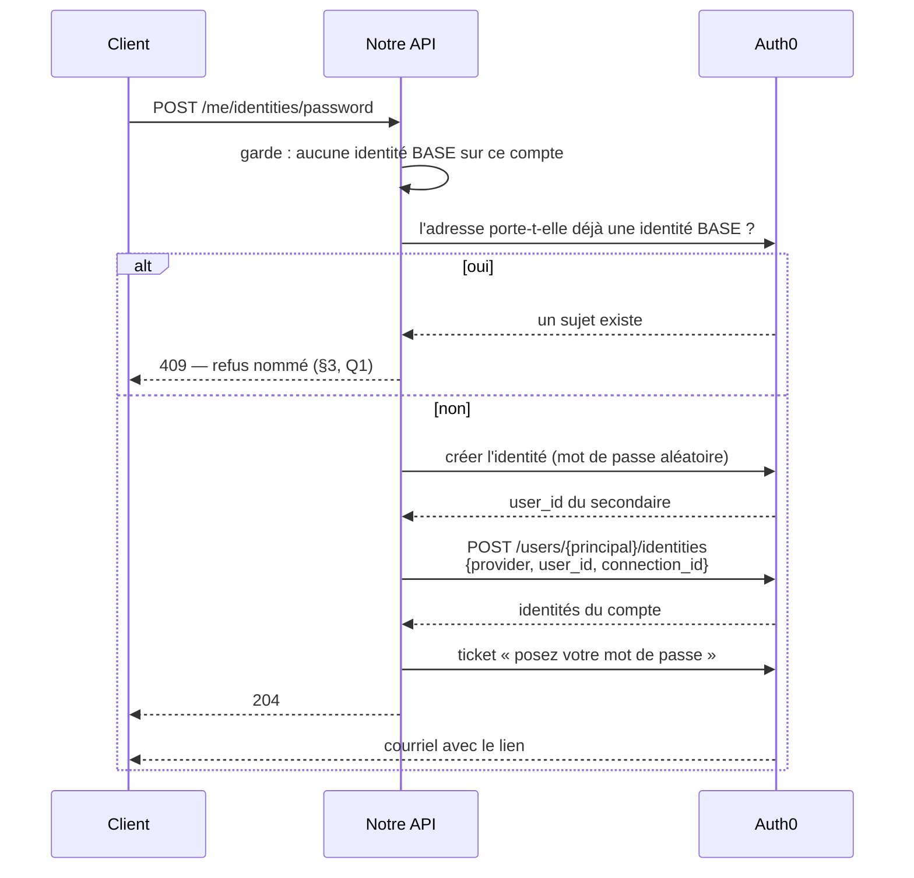

# TODO — ajouter une connexion par mot de passe à un compte social

> **Ouvert le 2026-09-22**, à la demande de Hugo : « je voudrais pouvoir ajouter
> la méthode de connexion par mail dans ce cas de figure et je n'ai pas
> l'option » — sur un compte qu'il venait d'ouvrir par Google.
>
> 🔴 **Ce document était un PLAN ; il est redevenu un TODO le 2026-09-22**, après
> le verdict de `vitruve` (4 BLOQUANT, 8 SÉRIEUX) reporté au §9. Sa conception
> ne tient pas : le §2 émet le ticket sur un sujet qui n'existe plus, et le §4
> livre à l'écran le geste qui **détruit** ce qu'on vient de bâtir. Il n'est donc
> plus soumis à décision — **il n'y a rien à trancher aujourd'hui**.
>
> ⚠️ **Rien n'est cassé en attendant.** Un compte né par Google se connecte, se
> déconnecte et se reconnecte. Il lui manque une seconde porte, ce qui est une
> gêne, pas une panne.
>
> L'état des lieux et les diagrammes sont dans
> [`les-deux-origines-d-un-compte.md`](les-deux-origines-d-un-compte.md).

---

## 1. Ce qu'on bâtit, et ce qu'on ne bâtit pas

|                                                                                 |                                     |
| ------------------------------------------------------------------------------- | ----------------------------------- |
| ✅ **Ajouter** une connexion par mot de passe à un compte né par un fournisseur | lots 1 à 5                          |
| ❌ **Changer d'identité principale** (donc retirer Google)                      | **lot 6, séparé et optionnel** — §6 |
| ❌ Rapprocher deux comptes existants par leur adresse                           | jamais — §3, Q1                     |

🔴 **Le lot 6 est ce qui décide si le geste donne une seconde PORTE ou une
seconde CLÉ sur la même serrure.** Sans lui, un compte né par Google garde
Google comme principale pour toujours — le mot de passe marche, mais on ne peut
jamais quitter le fournisseur. C'est acceptable, à condition de le **dire à
l'écran** (§5) plutôt que de le laisser découvrir.

---

## 2. Le geste, avec les appels vérifiés



**Ce qui existe déjà** dans `Auth0IdentityGateway` : `createUser`,
`findSubjectByEmail`, `issuePasswordLink`, `unlinkIdentity`, `listIdentities`.

**Ce qui manque**, et c'est tout :

1. `linkIdentity` gagne la **seconde forme** — `{ provider, user_id, connection_id }`.
   Vérifié à la source le 2026-09-22 : `provider` et `user_id` requis,
   `connection_id` optionnel « quand plus d'un fournisseur base de données
   `auth0` existe ». 🔴 **C'est notre cas** : le tenant porte
   `lfc-b2b-customers` **et** `lfc-staff`.
2. **L'identifiant de la connexion client.** On n'en connaît que le nom.
   🔵 À trancher : le résoudre au démarrage (`GET /api/v2/connections?name=…`)
   ou le poser en variable ? La seconde option ajoute une valeur à tenir
   d'accord avec le tenant ; la première ajoute un appel et un cache.

⚠️ **Le mot de passe intermédiaire n'existe que le temps de l'appel.** Ni
affiché, ni journalisé, ni conservé, ni renvoyé. C'est le ticket qui donne la
main au client.

---

## 3. Les trois refus, et pourquoi

### 🔴 Q1 — Une identité base existe déjà sur cette adresse → **REFUS**

Elle appartient à quelqu'un, et rien ne prouve que c'est le demandeur. La
rattacher serait une **prise de compte** — exactement ce que le refus du
2026-09-17 sur la connexion sociale écarte déjà.

Le refus **nomme la sortie** : se connecter avec ce mot de passe, puis rattacher
Google depuis le profil. Le chemin existe et il est bâti.

⚠️ Le refus confirme qu'un compte existe sous cette adresse. C'est le même
arbitrage que `SocialSignInAccountExistsError`, qui l'assume : l'information
n'est pas nouvelle — l'inscription d'Auth0 la donne déjà à qui retape son
adresse.

### 🔴 Q3 — L'adresse doit être **prouvée**

On crée la connexion sur l'adresse que **le fournisseur a vérifiée**, pas sur
celle de notre base. Les deux peuvent diverger depuis que le changement
d'adresse existe, et notre colonne n'atteste rien.

**Si elle n'est pas vérifiée : refus.** Ouvrir un « mot de passe oublié » sur
une adresse non prouvée donne le compte à qui contrôle cette boîte.

⚠️ 🔵 **À mesurer avant de s'y fier** : le 2026-09-22, `email_verified` valait
`true` sur le compte Google de Hugo mais `false` sur son compte historique. Si
la proportion de comptes non vérifiés est forte, ce refus bloque du monde — et
c'est alors une décision de Hugo, pas une évidence technique. C'est la même
erreur que la règle R1, retirée du plan de `/mon-profil` parce qu'elle aurait
refusé **tout le monde** (0/5 comptes vérifiés, mesuré).

### ⚠️ Q-bis — Le compte a déjà une identité base

Rien à faire : la ligne « E-mail » est déjà là. L'écran ne propose pas le geste,
et le serveur le refuse quand même — le filet de la vue périmée, comme
`LoginMethodAlreadyLinkedError`.

---

## 4. Ce que l'écran devient

La section « méthodes de connexion » de `/mon-profil` liste aujourd'hui les
fournisseurs **ajoutables** (`ADDABLE_PROVIDERS`, qui ne contient que Google).

Le mot de passe n'y entre **pas** : ce n'est pas un fournisseur, et le mettre
dans la même liste ferait croire à une popup. Il devient une **ligne propre**,
avec son bouton :

- compte **avec** identité base → la ligne « E-mail » actuelle (adresse +
  changer + lien de mot de passe) ;
- compte **sans** → « Ajouter une connexion par mot de passe », qui envoie le
  lien.

---

## 5. 🔴 Ce que l'écran doit DIRE, et c'est le point le plus important

Tant que le lot 6 n'est pas bâti, **Google reste la principale et ne se retire
pas**. La section doit donc l'annoncer, sans quoi la personne croira s'être
donné une porte de secours qu'elle n'a pas.

Une phrase, sous la ligne du fournisseur principal : « Cette méthode ouvre votre
compte : elle ne peut pas être retirée. »

⚠️ **Sans cette phrase, le geste est un piège** — il promet une indépendance
qu'il ne donne pas.

---

## 6. 🔵 Lot 6 — l'échange de principale (optionnel, et lourd)

Le mécanisme et sa mesure sont au §8 de
[`les-deux-origines-d-un-compte.md`](les-deux-origines-d-un-compte.md) :
détacher, rattacher dans l'autre sens, puis détacher Google. **Le `sub`
change**, et `users.auth0_sub` est la **seule** colonne concernée (mesuré : le
journal porte l'identifiant interne pour un client).

🔴 **Aucun ordre d'écriture ne ferme la panne** entre Auth0 et notre base : dans
les deux sens, un arrêt au milieu rend le compte **inatteignable**, et le
provisioning peut créer un doublon par-dessus.

La direction proposée, qui est celle du `CLAUDE.md` §0 appliquée à un compte :

1. **étendre** — accepter les DEUX `sub` (colonne de transition) ;
2. **basculer** — l'échange chez Auth0 ;
3. **resserrer** — ne garder que le nouveau, une fois Auth0 relu.

⚠️ Ça ajoute une colonne, une lecture de repli dans le résolveur, et un chemin
de reprise. **C'est plus lourd que les lots 1 à 5 réunis** — d'où sa séparation.

🔵 **À trancher par Hugo** : lot 6 dans ce chantier, ou TODO à part ?

---

## 7. Les lots

| Lot | Contenu                                                                          | Bloque par |
| --- | -------------------------------------------------------------------------------- | ---------- |
| 1   | `linkIdentity` gagne la forme sans session + l'identifiant de connexion          | —          |
| 2   | La garde Q1 (identité base déjà présente sur l'adresse) et son refus nommé       | —          |
| 3   | La commande, le handler, la route `POST /me/identities/password`, le mur         | 1, 2       |
| 4   | Le journal (`user.password_login_added`) — préfixe `user.`, routé vers `comptes` | 3          |
| 5   | Le front : la ligne propre, le bouton, et **la phrase du §5**                    | 3          |
| 6   | 🔵 L'échange de principale — **optionnel**, §6                                   | 3          |

⚠️ Le lot 4 touche `packages/contracts` (catalogue des faits, spec de fermeture,
phrase du back-office) : la règle « la racine dès que `packages` bouge »
s'applique.

---

## 8. À trancher avant de bâtir

1. **L'identifiant de connexion** : résolu au démarrage, ou posé en variable ?
2. **L'adresse non vérifiée** : refus, ou toléré ? — **à mesurer d'abord** (§3).
3. **Le lot 6** : dans ce chantier, ou TODO à part ?
4. **Le journal** : un ajout de méthode de connexion est-il un acte à tracer ?
   (Le rattachement Google l'est déjà — `user.identity_linked`.)

---

## 9. Le verdict de `vitruve` — ce qui fait que ce plan n'est pas bâtissable

> Rendu le 2026-09-22 sur la version « plan » de ce document. Gardé ici ENTIER :
> c'est ce qui coûte le plus cher à refaire, et le §8 ci-dessus est périmé par
> lui (ses questions 2 et 4 ont déjà leur réponse, voir B-R et S2).

### 🔴 B1 — La séquence du §2 émet le ticket sur un sujet qui n'existe plus

Après le rattachement, le secondaire est **absorbé** : `issuePasswordLink` sur
lui rend `NOT_FOUND` et lève `IdentitySubjectUnknownError`
(`auth0-identity.gateway.ts:168-170`). Sur le principal, le ticket part avec
`user_id` **seul**, sans `connection_id` (`:159-167`) — et ce `user_id` vaut
`google-oauth2|…`, qui n'est pas un utilisateur de connexion base.

**Sortie** : émettre le ticket **avant** de rattacher, ou donner à
`issuePasswordLink` la forme `email` + `connection_id`.

### 🔴 B2 — L'état intermédiaire est irrattrapable, et Q1 le verrouille

Création réussie, appel suivant en échec → une identité base **autonome** reste
sur l'adresse. Q1 refuse alors **pour toujours**, sur un déchet que nous avons
produit. Et si un ticket était parti, poser le mot de passe crée un **second
compte vide** sous la même adresse : `refuseSecondAccount` sort immédiatement
sur les sujets base (`customer-principal.resolver.ts:137`).

### 🔴 B3 — L'écran offre le geste qui détruit ce qu'on vient de bâtir

La nouvelle identité base est **secondaire**, et `login-methods-section.html:55`
affiche « Retirer » sur toute méthode non principale. Détacher chez Auth0 ne
supprime pas : l'identité **redevient autonome**.

```
ajouter un mot de passe → « Retirer » sur la ligne E-mail
   → se connecter avec ce mot de passe
   → compte NEUF et VIDE, même adresse, commandes disparues
   → et Q1 refuse de recommencer
```

🔴 **C'est le bloquant qui change la CONCEPTION**, pas la rédaction : le §5
s'inquiétait de dire que la **principale** ne se retire pas, et n'a pas vu qu'il
rendait retirable la **secondaire** — celle qui coûte un compte.

### 🔴 B4 — Le §4 contredit une décision écrite, sur trois adresses confondues

Il fait apparaître « Changer l'adresse » sur un compte à principale Google, ce
que `plan-connexion-sociale.md` D10 **refuse**. Et « l'adresse » en désigne
trois, jamais distinguées : celle que le fournisseur a vérifiée, celle de notre
base qu'affiche l'écran, celle sur laquelle porte la garde d'unicité.

### 🔴 B-R — Q3 rouvre une question déjà tranchée, et sa justification est fausse

Le §3 demande de « mesurer avant de s'y fier ». **La mesure existait déjà,
écrite le même jour** (`request-password-reset.handler.ts`) : aucun compte de la
base ne porte `email_verified = true`, et aucune route client ne permet de
demander un courriel de vérification. Exiger une adresse vérifiée refuserait
donc **tout le monde**, en désignant une porte qui n'existe pas — exactement la
faute R1 que le §3 citait comme à éviter.

Et « notre colonne n'atteste rien » est **factuellement faux** : elle porte la
preuve recopiée par un jeton de la même adresse.

### Les SÉRIEUX qui changent le chiffrage

| #   | Ce que le plan dit                              | Ce qui est vrai                                                                                                                                                                                      |
| --- | ----------------------------------------------- | ---------------------------------------------------------------------------------------------------------------------------------------------------------------------------------------------------- |
| S1  | « Ce qui manque, et c'est tout : deux points »  | `createUser` / `findSubjectByEmail` sont **privées** ; les handlers dépendent de `CustomerIdentityPort` — une méthode de port de plus, ses **3 implémentations**, et **~25 fichiers** qui le nomment |
| S2  | §7 : « le lot 4 touche `packages/contracts` »   | Il touche **deux applications** en plus du paquet                                                                                                                                                    |
| S3  | §7 : la route est décrite sans garde de débit   | Sa jumelle en a un (3/heure) — une route qui **envoie un courriel** sans débit est un amplificateur                                                                                                  |
| S4  | §6 : « `users.auth0_sub` est la seule colonne » | Vrai pour les colonnes, mais le §6 oublie les **lecteurs** du `sub`, tenus par `lint:subject-readers` et `lint:auth0-id-readers`                                                                     |
| S5  | Q1 « une identité base sur cette adresse »      | **Laquelle** ? Le tenant en porte deux (`lfc-b2b-customers`, `lfc-staff`). Non tranché                                                                                                               |

---

## 10. Par où reprendre, le jour où on reprend

1. **B3 d'abord** : décider ce que devient « Retirer » sur une identité mot de
   passe **avant** d'écrire quoi que ce soit. Tant que ce n'est pas tranché, les
   lots 1 à 5 fabriquent un piège.
2. **Puis B1** : la séquence se réécrit autour de « émettre avant de rattacher ».
3. **Q3 est close** : l'adresse vérifiée ne peut pas être une condition, la
   mesure le dit. On part de l'adresse du fournisseur.
