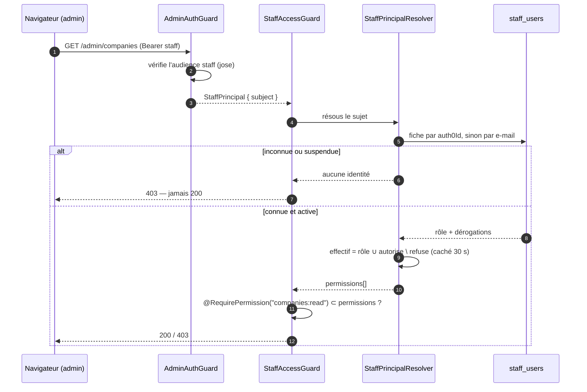
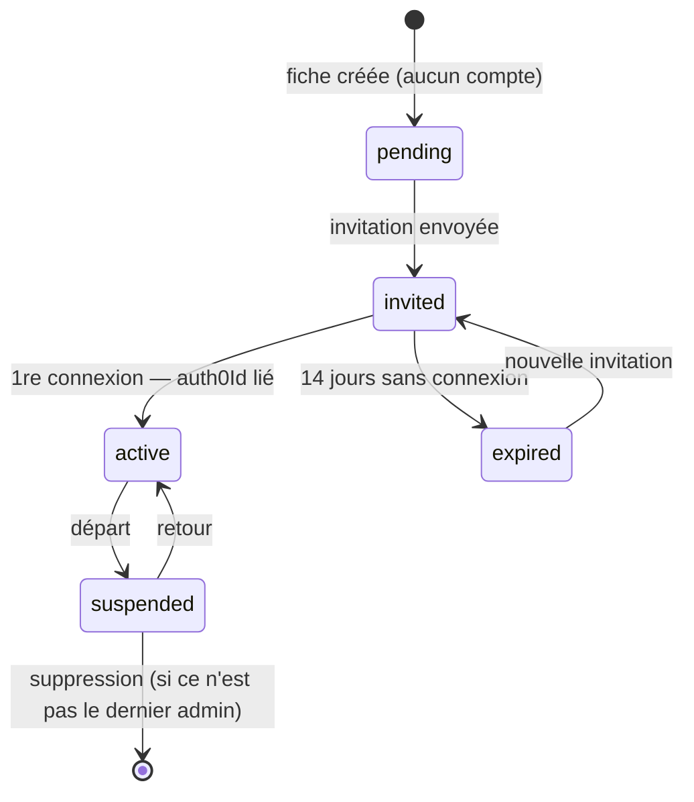

# Accès staff — rôles, permissions et invitations du back-office

**État : 🟡 le mur existe.** Tranches 1 à 3 livrées le 2026-08-12 : le catalogue,
le schéma et les invariants, puis **le mur lui-même** — toute surface `/admin/*`
exige désormais une fiche d'annuaire connue et le bon périmètre. Restent
l'écran (§11, tranches 4 à 7).

Il répond à une seule question : **qui, dans l'équipe, peut faire quoi dans le
back-office** — et comment on garde la certitude de pouvoir toujours entrer.

Lié à [`../suite/architecture-iam-access.md`](../suite/architecture-iam-access.md)
(la cible à trois outils) et à
[`architecture-identite-auth-tenancy.md`](architecture-identite-auth-tenancy.md)
(le mur client, dont celui-ci est le pendant staff).

---

## 1. L'état des lieux, sans complaisance

La moitié du chemin est faite, et c'est la moitié structurante :

| Pièce                                                                    | Où                                          | État |
| ------------------------------------------------------------------------ | ------------------------------------------- | ---- |
| Table `staff_users` — identité, `scopes[]`, `auth0Id` nullable           | `prisma/schema.prisma`                      | ✅   |
| Module DDD/CQRS complet — port, repo Prisma, commandes, contrôleur admin | `src/staff-users/`                          | ✅   |
| **Admin racine ineffaçable**, semé au boot, non rétrogradable            | `src/staff-users/domain/bootstrap-admin.ts` | ✅   |
| Porte staff — audience Auth0 dédiée, fail-closed sans elle               | `src/infra/auth/admin-auth.guard.ts`        | ✅   |
| Écran Réglages → Utilisateurs — liste, création, édition, suppression    | `reglages/staff-users/`                     | ✅   |

Et voici le trou tel qu'il était, gardé ici parce qu'il explique tout le reste :

> **Les `scopes` d'une personne n'étaient lus nulle part.** Hors du module
> `staff-users`, la seule occurrence du mot dans le backend était le `scope` du
> _jeton_ — jamais celui de la fiche.

Conséquence opérationnelle : **tout porteur d'un jeton staff valide pouvait tout
faire.** Le périmètre était saisi dans un écran, écrit en base, et sans effet.
C'était le pire des trois états possibles — pas de mur du tout serait au moins
honnête ; un mur peint sur le sol laisse croire qu'on est protégé.

**Fermé le 2026-08-12** par les tranches 1 à 3 : `scopes` a laissé place à un
rôle et à des dérogations, `auth0Id` se lie à la première connexion, et
`StaffAccessGuard` refuse tout ce qui n'est ni connu ni autorisé.

Ce qui reste ouvert à cette date :

- **Le front admin n'a aucun guard** : le serveur refuse, l'écran ne cache pas
  encore. On clique et on prend un `403` (tranche 4).
- **Aucune invitation.** Créer une fiche ne crée pas de compte ; les deux gestes
  ne sont pas cousus (tranche 6).

---

## 2. La fourche : ici maintenant, IAM plus tard

[Le document IAM](../suite/architecture-iam-access.md) tranche un backend dédié
`lfc-IAM-backend` vers lequel `staff_users` migre. **Cette décision reste juste**
— au troisième outil. Aujourd'hui il y a un back-office, une poignée de
personnes, et une bêta commerciale à sortir. Construire un backend, une base, une
audience et un déploiement de plus _avant_ que le premier `403` n'existe, c'est
payer la facture de la généralisation avant d'en toucher le bénéfice.

**Décision : le modèle complet se construit dans le backend B2B**, avec une
discipline unique qui rend la migration mécanique le jour venu.

### La couture de sortie

Le front ne consomme **jamais** la table, ni les rôles, ni les dérogations. Il
consomme un seul point :

```
GET /admin/me → { person, role, permissions[] }
```

C'est tout ce qu'il sait. Le jour où IAM existe, on change **qui répond** à cette
question — pas un écran, pas un guard, pas une route. La forme de la réponse est
délibérément celle que le doc IAM prévoit déjà (`{ personId, status, grants[] }`
projeté en permissions par l'app cible) : la traduction est un adaptateur, pas
une réécriture.

**Ce qui ne doit jamais arriver** : qu'un écran lise `role === "admin"` pour
décider quoi afficher. Le rôle est un moyen de produire des permissions ; seule
la permission est une réponse. Un écran qui lit le rôle est un écran qu'il
faudra rouvrir à chaque nouveau rôle.

---

## 3. Le modèle

Trois notions, et une formule.

### Permission — `ressource:action`

L'unité atomique. `action` vaut `read` ou `write`, jamais autre chose : trois
niveaux de finesse (`delete`, `approve`…) se paient en confusion bien avant de se
payer en sécurité, et rien dans le back-office actuel ne les réclame.

**`write` implique `read`.** On ne modifie pas ce qu'on ne voit pas ; laisser les
deux se séparer produirait des écrans qui refusent d'afficher ce qu'ils
acceptent d'enregistrer.

### Rôle — un paquet nommé, défini dans le code

`admin` · `commercial` · `comptabilite` · `support` · `dev`.

Le catalogue vit dans `@lfd/contracts`, **pas en base**. À l'échelle d'une
équipe qui se compte sur une main, un éditeur de rôles est une interface qu'on
maintient pour zéro usage ; dans le code, le catalogue est typé, testé,
diffable en revue et versionné avec les écrans qu'il gouverne.

C'est la même logique que les
[feature flags](architecture-feature-flags.md) : le catalogue dans le code,
l'écart en base.

### Dérogation — un delta par personne, à trois états

Par couple (ressource, action) : `hérite` · `autorise` · `refuse`.

C'est la réponse au vrai besoin du terrain : « Marc est commercial **mais** il
gère aussi les relances » et « Léa est commerciale **sauf** qu'elle ne touche
pas aux prospects ». Sans le delta, chacun de ces cas invente un rôle sur
mesure, et on se retrouve à six rôles pour cinq personnes.

**Le refus l'emporte toujours.** Un droit retiré doit être retirable sans
négocier avec le rôle — sinon la seule façon de restreindre quelqu'un est de le
rétrograder entièrement, ce qui lui retire dix capacités pour en enlever une.

### La formule

```
effectif = permissions(rôle) ∪ dérogations.autorise \ dérogations.refuse
```

Pure, déterministe, testable sans base ni réseau. C'est la première brique à
écrire et la seule qu'on n'aura jamais à déboguer en production.

---

## 4. Les ressources

Elles sont calquées sur les surfaces `/admin/*` **réellement montées**, pas sur
une taxonomie d'intention :

| Ressource      | Ce qu'elle couvre                                                                                                                |
| -------------- | -------------------------------------------------------------------------------------------------------------------------------- |
| `companies`    | `admin/companies` et ses sous-routes, `admin/activations`, `admin/companies/:id/alert-rules`, `admin/companies/:id/members`      |
| `orders`       | `admin/orders`, `admin/handover`, les alertes de compte (`admin/alerts/*`)                                                       |
| `growth`       | `admin/cockpit`, `admin/growth`, `admin/leads`, `admin/prospects`, `admin/commercial/market`                                     |
| `appointments` | `admin/availability`, `admin/appointments`                                                                                       |
| `support`      | `admin/support-requests`, `admin/notifications`                                                                                  |
| `settings`     | `admin/platform-settings`, `admin/delivery-zones`, `admin/pickup-addresses`, `admin/order-cutoffs`, `admin/alert-rules` (global) |
| `staff`        | `admin/staff-users` — l'annuaire lui-même                                                                                        |
| `tech`         | La page Tech (feature flags, diagnostics). N'existe pas encore ; la ressource est posée avec le rôle `dev`.                      |

**Deux ressources absentes, volontairement.** `catalog` appartient au PIM, pas à
ce backend. `billing` n'existe pas — la
[facturation mensuelle](architecture-facturation-mensuelle.md) est encore
doc-first ; la ressource naîtra avec ses routes, pas avant. Nommer une ressource
sans surface, c'est écrire un droit que personne ne peut ni exercer ni tester.

`admin/recompute` reste hors du modèle : c'est le cron Cloudflare, gardé par son
propre `RecomputeGuard`, et aucune personne ne s'y authentifie.

---

## 5. Les rôles

`w` = lecture + écriture · `r` = lecture seule · `—` = aucun accès.

| Ressource      | `admin` | `commercial` | `comptabilite` | `support` | `dev` |
| -------------- | ------- | ------------ | -------------- | --------- | ----- |
| `companies`    | w       | w            | r              | r         | —     |
| `orders`       | w       | r            | w              | r         | —     |
| `growth`       | w       | w            | r              | —         | —     |
| `appointments` | w       | w            | —              | w         | —     |
| `support`      | w       | w            | —              | w         | —     |
| `settings`     | w       | r            | r              | —         | r     |
| `staff`        | w       | —            | —              | —         | —     |
| `tech`         | w       | —            | —              | —         | w     |

Trois choix méritent leur justification.

**`staff` n'est ouvert qu'à `admin`.** Accorder des droits est le seul geste qui
permet de s'en accorder : le laisser à un autre rôle, c'est le rendre équivalent
à `admin` par un chemin détourné.

**`dev` ne lit pas les données clients.** C'est contre-intuitif et c'est
délibéré : un rôle « technique » qui voit tout est un `admin` qui n'ose pas dire
son nom. Le besoin réel de `dev` est la page Tech et la lecture des réglages. Le
diagnostic ponctuel sur un compte se règle par une **dérogation datée**, qui
laisse une trace — pas par un rôle qui ouvre tout, tout le temps, en silence.

**`comptabilite` écrit les commandes mais ne lit pas `growth`.** Le pipeline
commercial n'est pas de la donnée comptable, et l'exposer par défaut brouille la
question « qui a vu quoi » le jour où elle se pose.

---

## 6. Ne jamais pouvoir se verrouiller dehors

Un système de permissions a une façon spectaculaire d'échouer : fonctionner
parfaitement, et enfermer tout le monde à l'extérieur. Quatre garde-fous, tous
**dans le domaine** — jamais dans un écran, qui n'est qu'une suggestion.

1. **L'admin racine est ineffaçable et non rétrogradable.** Il est semé au boot
   s'il manque, donc il réapparaît même supprimé directement en base. _(Déjà
   codé — `bootstrap-admin.ts`.)_
2. **Il reste toujours au moins un admin actif.** La suppression, la suspension
   **et** le changement de rôle vérifient l'invariant. Le point 1 seul ne suffit
   pas : il protège une ligne, pas la propriété.
3. **On ne retire pas son propre `admin`.** Le pied dans le plat le plus courant,
   et le seul qu'on ne peut pas réparer soi-même.
4. **Une dérogation ne peut pas refuser `staff:write` à un admin.** Sinon le
   delta contourne l'invariant 2 par la porte de derrière.

Ces quatre règles se testent sans base et sans HTTP. Elles sont la première
chose à écrire après la formule, et la dernière qu'on touchera.

---

## 7. Comment une requête est autorisée

**Le jeton porte l'identité, jamais les droits.** C'est la décision reprise du
doc IAM et elle ne se négocie pas : un jeton vit une heure ; un accès retiré doit
prendre effet tout de suite. Des droits dans le jeton, c'est un départ
d'entreprise qui garde ses accès jusqu'à l'expiration.

Le prix — une lecture par requête — se paie par un **cache court côté serveur**
(30 s d'ordre de grandeur) : assez court pour qu'une révocation soit ressentie
comme immédiate, assez long pour que l'annuaire ne devienne pas le goulot de
chaque clic.



**Fail-closed, sans exception.** Un sujet inconnu de l'annuaire n'obtient rien :
porter un jeton valide prouve qu'on est authentifié, pas qu'on est de l'équipe.
Aujourd'hui c'est exactement l'inverse, et c'est le trou décrit en §1.

**Le bypass de développement** (`AUTH_ADMIN_DEV_BYPASS`, déjà fail-closed en
prod) doit résoudre vers **l'admin racine**, pas vers une identité synthétique
sans fiche — sinon la mise en place du mur ferme le poste de travail local le
jour même.

---

## 8. Le front : cacher n'est pas refuser

Deux murs, et un seul fait autorité.

- **Le serveur refuse.** `@RequirePermission("settings:write")` sur la route.
- **L'écran cache.** Menu filtré, routes gardées, boutons absents.

Un front qui cache sans serveur qui refuse est une décoration — c'est l'état
actuel, à ceci près qu'aujourd'hui il ne cache même pas. L'inverse (serveur qui
refuse, écran qui montre) est seulement désagréable : on clique et on prend un
`403`. **On construit donc les deux, dans cet ordre, sans laisser d'écart entre
les deux tranches.**

Côté Angular, trois pièces et pas une de plus :

- **`PermissionsStore`** — un signal chargé une fois au boot depuis
  `GET /admin/me`, exposant `can(permission)` en `computed`.
- **`permissionGuard(permission)`** — `CanActivateFn` sur les routes, qui
  redirige vers la première page autorisée plutôt que d'afficher une page vide.
- **`*canWrite`** — directive structurelle pour les affordances (boutons,
  entrées de menu). Une affordance qu'on ne peut pas exercer ne se grise pas :
  elle disparaît. Un bouton grisé pose une question à laquelle l'écran ne peut
  pas répondre.

**Le menu se déduit des permissions, jamais du rôle.** Même règle qu'en §2 : le
jour où une dérogation ouvre `growth` à quelqu'un, le menu doit suivre sans
qu'on y touche.

---

## 9. L'identité : coudre le jeton à la fiche

`auth0Id` est nullable, et l'ordre naturel est **fiche d'abord, compte ensuite** :
on saisit l'arrivante de lundi avant qu'elle n'ait un mot de passe. Ce que ce
modèle interdit, c'est l'inverse — qu'une personne existe uniquement chez Auth0
et se retrouve autorisée sans fiche.



**L'entrée se constate, elle ne se déclare pas** — exactement comme pour le
détenteur d'un compte client
([cycle de vie](architecture-compte-client-cycle-de-vie.md)) : au premier appel
authentifié, on rapproche par e-mail et on **lie `auth0Id`**. À partir de là, le
rapprochement se fait par `sub`, qui ne bouge plus même si l'e-mail change.

**`suspended` ferme tout, immédiatement, sans rien détruire.** C'est le geste du
départ : on ne supprime pas une personne dont le nom est attaché à des décisions
datées ailleurs — un RDV posé, une activation, une dérogation accordée.

### Dépendance externe à ne pas découvrir en cours de route

Le rapprochement par e-mail suppose une **Action Auth0 posant `email` sur le
jeton staff**. Elle n'existe pas plus côté staff que côté client (voir le TODO
`Auth0 · Action posant email + email_verified`). Sans elle, on ne peut lier
qu'un `sub` — donc une personne ne devient rattachable qu'**après** s'être
connectée, et l'invitation ne boucle pas.

---

## 10. L'invitation

Créer une fiche et ouvrir un compte sont deux gestes ; **le bouton « Inviter »
les coud**. Mécanique identique à celle du détenteur client, déjà en place :
création de l'utilisateur Auth0, **ticket de mot de passe** (scope M2M
`create:user_tickets` — celui qu'on oublie), e-mail porteur du lien.

**Validité : 14 jours.** La règle est déjà écrite et testée pour les détenteurs
clients (`invitation-expiry.ts`). C'est donc son **deuxième usage réel** — le
moment prévu pour l'extraire vers un emplacement partagé plutôt que de la
copier. Une règle d'expiration dupliquée est une règle qui divergera.

**L'écran dit la vérité entre deux balayages** : `expired` se calcule à la
lecture, comme côté client. Le lien est de toute façon périmé chez le
fournisseur — on cesse simplement de l'ignorer.

---

## 11. Le plan de mise en œuvre

| #    | Tranche                  | Contenu                                                                                                                                                                             | Risque    |
| ---- | ------------------------ | ----------------------------------------------------------------------------------------------------------------------------------------------------------------------------------- | --------- |
| 1 ✅ | **Contrat et catalogue** | `@lfd/contracts` : `StaffRole`, `StaffPermission`, `ROLE_GRANTS`, `StaffMeView`, payload étendu. `resolveStaffPermissions()` pure + tests.                                          | nul       |
| 2 ✅ | **Domaine et schéma**    | Migration Prisma (`phone`, `jobTitle`, `role`, `status`, `staff_permission_overrides`), reprise des `scopes` en rôles, `staff-access.policy.ts` portant les 4 invariants du §6.     | faible    |
| 3 ✅ | **Le mur**               | `StaffAccessResolver` (liaison `auth0Id` constatée, cache 30 s), `StaffAccessGuard`, `@AdminSurface` sur les **24** surfaces `/admin/*`, `GET /admin/me`, suite e2e `staff-access`. | **élevé** |
| 4    | **Socle front**          | `PermissionsStore`, `permissionGuard`, `*canWrite`, menu filtré.                                                                                                                    | moyen     |
| 5    | **Écran Utilisateurs**   | Identité complète, sélecteur de rôle, grille de dérogations, suspension.                                                                                                            | faible    |
| 6    | **Invitation**           | Extraction de la règle d'expiration, ticket Auth0, e-mail, `invited → active` constaté.                                                                                             | moyen     |
| 7    | **Preuve**               | e2e : un vrai `403` par rôle, et le test « on ne peut pas se verrouiller dehors ».                                                                                                  | nul       |

**Ordre** : 1 → 2 → **3 et 4 sans écart** → 5 → 6 → 7.

Les tranches 1 et 2 ne cassent rien et peuvent partir immédiatement. **La 3 est
le seul moment où la bêta peut tomber** : c'est elle qui transforme « tout le
monde peut tout » en « chacun son périmètre », et une erreur de mappage y ferme
un écran à quelqu'un qui en a besoin. Elle se relit route par route, avec le
tableau du §4 en main.

La 4 suit immédiatement, sinon l'écran offre des boutons qui rendent `403`.

---

## 12. Ce que ce document ne tranche pas

- **Les groupes.** Accorder à une équipe plutôt qu'à une personne est la
  généralisation évidente, et prématurée tant qu'on compte les collaborateurs sur
  une main.
- **Le journal des accès.** `grantedAt` / `grantedBy` sur une dérogation rendent
  l'état courant imputable, pas son historique. Un vrai journal viendra quand il
  sera demandé.
- **Les dérogations datées.** Le §5 en évoque l'usage pour `dev` ; une date de
  fin est une colonne et un balayage de plus. À faire au premier besoin réel.
- **Le MFA staff.** Il appartient à la connexion Auth0, pas à ce modèle.
- **Le PIM.** Il n'a aujourd'hui aucun modèle de rôles ; il consommera le même
  contrat quand il en aura un.

---

## 13. À vérifier avant la production

- [ ] **Audience staff Auth0 provisionnée** — sans elle, `/admin/*` refuse tout,
      indépendamment de ce modèle.
- [ ] **Action Auth0 posant `email` sur le jeton staff** — sinon aucun
      rapprochement, donc aucune invitation qui boucle (§9).
- [ ] **App M2M avec `create:user_tickets`** — sinon le bouton « Inviter » rend
      un 500 (§10).
- [ ] **Clé Resend + domaine vérifié** — sinon l'invitation part dans le vide,
      silencieusement.
- [ ] **L'admin racine correspond à une vraie boîte** que quelqu'un relève :
      c'est la porte de secours, elle ne sert que si elle est écoutée.
- [ ] **Le bypass de dev résout vers l'admin racine** (§7) — vérifié en local
      _avant_ de déployer la tranche 3.
