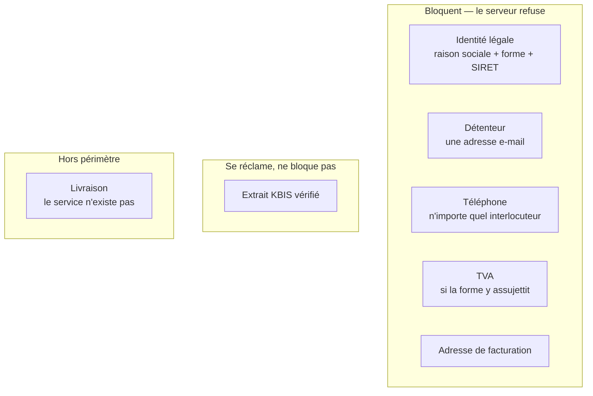

# Le dossier d'activation : ce qui bloque, ce qui se réclame

✅ **État au 2026-08-14.** Ce document décrivait une **configuration** — un mode
`hidden` / `optional` / `required` par pièce, réglable depuis Réglages →
Activation client. Elle a été **supprimée**. Ce qui suit décrit ce qui la
remplace, et pourquoi.

## 1. Pourquoi la configuration a disparu

Le parcours d'ouverture est arrêté. Une fois arrêté, il n'a plus à se redéfinir
depuis un écran : une case cochée un mardi soir changeait la définition de
« client » pour toute la plateforme — sans revue, sans test, sans trace, et sans
que personne puisse dire le lendemain pourquoi un compte était passé.

La règle vit désormais dans **une seule fonction**, `activationGate`
(`apps/lfc-B2B-platform-backend/src/account/domain/services/activation-gate.ts`),
pure, testée, et lue par les deux chemins qui comptent : la fiche staff (qui
l'affiche) et la commande d'activation (qui refuse). L'écran n'a plus le droit
de la rejouer.

## 2. La règle

**Le KBIS est une convention interne.** On veut voir l'extrait ; on ne veut pas
perdre la commande de demain matin pour un PDF. Le risque qu'il couvre — une
société qui n'est pas celle qu'elle dit — se matérialise à la **facturation**,
pas à la commande, sur des clients que le commercial a rencontrés. Il reste donc
demandé, son état reste vrai (« certifié », jamais « déposé »), et il ne tient
aucune porte.

Corollaire assumé : **rien ne suspend un compte pour un KBIS**. Ni le retrait de
vérification, ni le remplacement de l'extrait. Ces deux gestes menaient au même
état avec deux conséquences différentes — le second (ouvert au client sur sa
propre société) ne suspendait déjà pas. C'était l'incohérence, pas la règle.

**La livraison** n'est plus une pièce. Le jour où le service ouvre, elle revient
dans un commit avec ses tests. Côté écrans, une seule ligne commande son
affichage : `DELIVERY_SERVICE_OPEN` (`@lfd/b2b-ui/flags`), lue par cinq écrans.

## 3. Ce qui reste à construire : la ligne d'avertissements

Une pièce qui ne bloque jamais devient décorative si personne ne la regarde. Le
KBIS non vérifié doit donc **se voir**, et pas sur la fiche — qu'on n'ouvre que
lorsqu'on a déjà un problème — mais sur la **liste des comptes clients**, l'écran
qu'on ouvre pour travailler.

Décision prise : un **badge sur la ligne du compte**, pas une entrée dans la
`play-queue` du cockpit. Cette file est un modèle de **scoring commercial**
(`LeadScoreView`, « les meilleurs coups du jour ») ; y verser une tâche de
back-office fausserait le score.

⚠️ **Ce badge est le premier d'une famille, et il faut le construire comme tel.**
Il ne sera pas seul longtemps :

| Avertissement             | Ce qu'il dit                                  |
| ------------------------- | --------------------------------------------- |
| KBIS à vérifier           | l'extrait est là, personne ne l'a ouvert      |
| Pièce manquante           | le dossier est incomplet, l'activation attend |
| En attente depuis N jours | le compte est ouvert et n'avance plus         |
| Mandat SEPA absent        | un moyen de paiement annoncé qui n'existe pas |

Ces quatre-là partagent la même forme : un **fait par compte**, daté, avec un
degré d'urgence qui croît avec l'âge, et un geste. La bonne cible est donc une
**ligne de données par compte** — un tableau d'avertissements calculé côté
serveur et rendu par la liste — et non quatre calculs dispersés dans le front.

Ce qu'il faudra trancher au moment de la construire :

- **Où le calcul vit.** Probablement à côté de `activationGate`, qui connaît déjà
  l'état des pièces — mais l'ancienneté et l'inactivité n'en font pas partie.
- **Qui porte l'âge.** `kbisUploadedAt` existe ; « en attente depuis » se déduit
  de `createdAt`, mais « n'avance plus » demanderait une date de dernier geste
  qui n'est aujourd'hui écrite nulle part.
- **Le bruit.** Quatre badges sur chaque ligne d'une liste de 250 comptes, c'est
  une liste illisible. Il faudra un ordre de priorité, et probablement un seul
  badge visible plus un compteur.

En attendant, le badge KBIS se pose seul — mais sa donnée doit déjà venir du
serveur, dans un champ qui pourra devenir un tableau.

## 4. À lire ensuite

- [`architecture-compte-client-cycle-de-vie.md`](architecture-compte-client-cycle-de-vie.md) — ouverture, activation, suspension
- [`architecture-alertes-compte-client.md`](architecture-alertes-compte-client.md) — les alertes de **commande** (à ne pas confondre avec ces avertissements de **dossier**)
