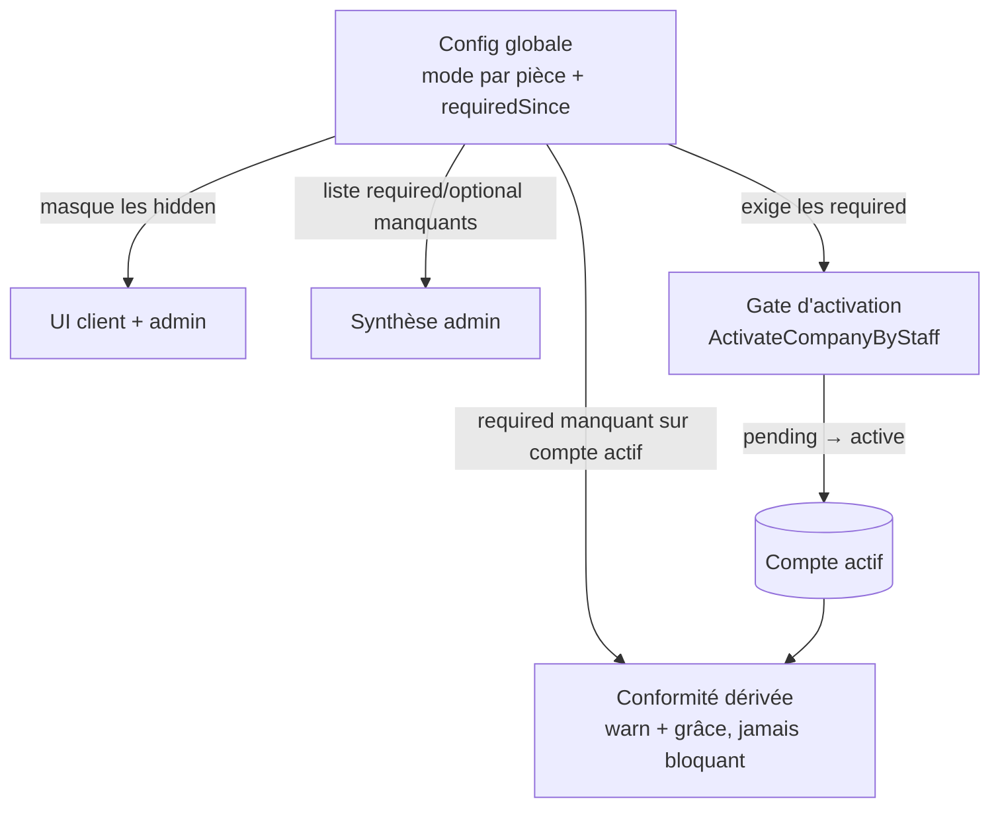

# Activation & configuration des pièces B2B — design

> Ce qu'il faut pour **activer** un compte client, rendu **configurable** par le
> staff, sans jamais re-bloquer un compte déjà actif.
>
> Trois couches distinctes : une **config globale** (quelles pièces sont cachées /
> optionnelles / requises), un **gate d'activation** (le bouton « Activer », gaté
> côté serveur), et une **conformité dérivée** (les comptes actifs à qui il manque
> une pièce nouvellement requise sont _avertis_, jamais bloqués).
>
> Décidé le **2026-08-03**. Prérequis lus :
> [`architecture-compte-client-cycle-de-vie.md`](architecture-compte-client-cycle-de-vie.md)
> (deux portes, dossier `pending` validé côté commercial) et la fiche client admin
> livrée (synthèse d'activation + mutations staff Porte B).
>
> **Statut : Slice A LIVRÉE (2026-08-03)** — config + page Réglages + masquage UI
>
> - commande `ActivateCompanyByStaff` gatée + CTA « Activer ». **Slice B**
>   (conformité / grâce, §4) reste à faire.

---

## 0. Le problème

La fiche client admin sait déjà **refléter** les pièces manquantes (synthèse) et
les **compléter** à la place du client (Porte B). Trois manques :

1. **Aucune activation.** `active` est censé être « validé par une activation
   commerciale explicite » (cf. `company-status.ts`), mais **aucune commande ne
   fait `pending→active`** aujourd'hui. Le staff n'a pas de bouton pour activer.
2. **Les exigences sont figées dans le code.** La synthèse liste TVA, KBIS,
   facturation, livraison, règlement en dur. Or **la livraison n'existe pas encore
   comme service** — la demander est un mensonge — et **la vérification KBIS**
   devrait pouvoir être optionnelle selon le moment.
3. **Aucun garde-fou anti-rétro-blocage.** Rendre une pièce obligatoire plus tard
   ne doit **jamais** re-bloquer un compte déjà actif.

## 1. Trois couches, trois règles

Le point qui rend le tout cohérent : **une pièce `required` gate l'ACTIVATION, pas
l'ACCÈS runtime**. Le mur des commandes (statut `active` requis) reste inchangé ;
la conformité ne touche jamais au statut ni aux commandes.

## 2. Config globale — un **mode** par pièce (pas un flag par feature)

Une config **globale** (à l'échelle LFC, pas par société — « la livraison n'existe
pas » est une réalité business), éditée depuis une **page Réglages** dans le menu
admin. Chaque pièce d'activation porte **un mode** :

| Mode       | UI                                             | Gate d'activation     | Ex.                             |
| ---------- | ---------------------------------------------- | --------------------- | ------------------------------- |
| `hidden`   | **cachée** client + admin (cartes ET synthèse) | jamais exigée         | livraison (service absent)      |
| `optional` | visible, déposable                             | **n'exige pas**       | KBIS avant sa mise en place     |
| `required` | visible                                        | **exige la présence** | facturation, TVA (si assujetti) |

Un **seul enum** couvre les deux besoins de Hugo (masquer la livraison ; rendre le
KBIS optionnel), au lieu de deux flags ad hoc qui divergeraient. Extensible : une
nouvelle pièce = une entrée dans le registre, pas une branche de plus (OCP).

Chaque pièce requise porte aussi un **`requiredSince`** (date de bascule vers
`required`) — l'ancre de la grâce, cf. §4.

**Pièces au catalogue initial** : `tva` (conditionné par l'assujettissement, cf.
`vatNumberRequired`), `kbis`, `billing`, `delivery`, `paymentTerm`. La TVA garde
sa condition métier : `required` **et** assujetti.

## 3. Gate d'activation — le bouton « Activer »

- Nouvelle commande **`ActivateCompanyByStaffCommand(companyId)`** (Porte B, sans
  mur membership, comme les autres mutations staff). Le handler charge la config,
  vérifie que **toutes les pièces `required` applicables** sont présentes → sinon
  `BusinessError` 409 « pièces manquantes ». Sur succès : `pending → active`
  (+ `activatedAt`).
- **Fiche admin** : un CTA **« Activer le compte »** près de la synthèse —
  **désactivé** tant qu'une pièce `required` manque, **solide** dès que OK. Le
  front lit la même synthèse pour l'état visuel ; **le serveur retranche** (jamais
  de confiance au front).
- **KBIS = présence, pas certification.** L'activation exige que le KBIS soit
  _déposé_ ; sa _certification_ (le flag `certified` posé par le staff) relève de
  la conformité douce, pas du gate. _(Décision 1.)_

## 4. Conformité dérivée — jamais de rétro-blocage

Rendre une pièce `required` a **deux effets séparés** :

- **Sur le futur (le gate)** : les prochaines activations doivent la respecter.
- **Sur l'existant (comptes `active`)** : **on ne touche pas leur statut**. La
  conformité est **calculée en lecture** à partir de (config, état société) :

  > pièce `required` **et** absente **et** compte `active`
  > → **non conforme**, avec `graceUntil = requiredSince + N jours`.

  Avant `graceUntil` : warn discret. Après : le warn **monte en intensité**
  (bandeau fiche, colonne liste), mais **n'a jamais d'effet sur l'accès ni les
  commandes**. _(« activer le KBIS en cours de route → grâce puis warn, jamais
  bloquant ».)_

Aucune migration, aucun re-scan : la non-conformité est **dérivée**, comme la
synthèse. Le jour où la config change, rien n'est écrit sur les sociétés.

## 5. Impact sur l'existant

- **Synthèse admin** (`fiche-client`) : filtre les `hidden`, annote `optional` vs
  `required`, et calcule le `canActivate` du CTA.
- **Cartes adresses / KBIS** (client + admin) : masquées si la pièce est `hidden`.
  La section livraison disparaît des deux fronts tant que `delivery = hidden`.
- **Mur des commandes** (statut `active`) : **inchangé**. La conformité ne le
  touche pas.
- **Réglages admin** : nouvelle page (menu admin) éditant la config — un seul
  écran, une ligne par pièce (mode + aperçu du nombre de comptes impactés).

## 6. Périmètre & découpage

- **Hors périmètre pour l'instant** : la **désactivation / suspension**
  (`active → suspended`) — on ne fait que `pending → active`. _(Décision 2.)_
- **Slice A** ✅ **LIVRÉE** : config (`b2b_platform_settings`, un `PieceMode` par
  pièce) + page Réglages admin + `GET /platform-settings` public + `PATCH` staff +
  masquage UI (synthèse admin, cartes client+admin via `showDeliveries`) + commande
  `ActivateCompanyByStaff` gatée serveur (`missingRequiredPieces`) + CTA « Activer ».
- **Slice B** (ensuite) : la couche **conformité / grâce** — indépendante et plus
  subtile, dérivée en lecture. _(Décision 3.)_

## 7. Décisions actées (2026-08-03)

1. **KBIS** : l'activation exige la **présence**, pas la certification.
2. **Suspension / désactivation** : hors périmètre ; uniquement `pending→active`.
3. **Découpage** : Slice A (activation + config) avant Slice B (conformité/grâce).
