# Alertes de compte client

**État : 📐 doc-first — rien n'est codé.**

Ce que le commercial n'a aujourd'hui aucun moyen d'apprendre : qu'un client
vient de commander un produit qu'il n'avait jamais pris, ou qu'il en a pris
trois fois moins que d'habitude. L'information est dans les commandes ; personne
ne la regarde, parce que la regarder suppose de comparer une commande à
l'historique du compte — à la main, compte par compte.

Une **alerte de compte client** est cette comparaison, automatisée : une règle
paramétrée globalement, évaluée à chaque commande, dérogeable compte par compte.

---

## 1. Le vocabulaire

| Terme                    | Ce que c'est                                                                                      |
| ------------------------ | ------------------------------------------------------------------------------------------------- |
| **Type d'alerte** (kind) | Un **détecteur** — du code : `first_order`, `quantity_drift`, `quantity_outlier`. Ouvert au code. |
| **Règle globale**        | Un type + ses paramètres + ses canaux, valables pour **tous** les comptes. Une ligne par type.    |
| **Dérogation de compte** | Ce qu'un compte fait de cette règle : l'ignorer, ou en porter une version à lui.                  |
| **Règle effective**      | `dérogation ?? règle globale`. C'est elle qu'on évalue, et elle seule.                            |
| **Alerte** (déclenchée)  | Un fait daté : « le 11/08, sur la commande LFC-1042, 12 baguettes contre 4,3 en moyenne ».        |

La distinction qui porte tout le modèle : un **type** est du code (un détecteur
a besoin d'un algorithme), une **règle** est de la donnée (seuils, canaux, on/off).
Ajouter un type de détection = ajouter un fichier détecteur, jamais une branche
dans un `switch` (OCP). Ajouter un seuil = écrire une ligne.

---

## 2. Les trois types du premier lot

### `product.first_order` — un produit jamais pris

Une ligne de commande dont le SKU n'apparaît dans **aucune** commande antérieure
du compte.

| Paramètre           | Défaut | Pourquoi                                                                                                    |
| ------------------- | ------ | ----------------------------------------------------------------------------------------------------------- |
| `minPreviousOrders` | `1`    | Sur la **toute première** commande d'un compte, _tout_ est nouveau : 20 lignes = 20 alertes, donc 0 signal. |

### `product.quantity_drift` — un écart à sa propre moyenne

La quantité d'un SKU s'écarte de plus de `thresholdPercent` de sa moyenne sur ce
compte.

| Paramètre           | Défaut          | Pourquoi                                                                                                    |
| ------------------- | --------------- | ----------------------------------------------------------------------------------------------------------- |
| `tiers`             | 200/100/50/25 % | L'écart déclencheur **par palier**, indexé sur la moyenne de ce compte pour ce SKU (§2.1).                  |
| `direction`         | `both`          | `up` \| `down` \| `both` — on veut savoir qu'il monte (opportunité) **et** qu'il baisse (signal de départ). |
| `baselineOrders`    | `6`             | Les N dernières commandes **contenant ce SKU**, la commande courante exclue.                                |
| `minBaselineOrders` | `3`             | En dessous, « la moyenne » n'est pas une moyenne — la règle se tait plutôt que de mentir.                   |

La **moyenne de ce compte pour ce SKU est la référence la plus adaptable dont on
dispose** : elle sait, elle, que ce client-là prend ce produit-là à l'unité ou par
palettes, là où une norme catalogue ne connaît qu'une moyenne d'usages qui n'ont
rien à voir. C'est pour ça qu'elle a la priorité dès qu'elle existe, et que ses
paliers sont **plus serrés** que ceux de l'aberration produit : à référence plus
fine, même écart plus significatif.

> Un ancien `minQuantity` (plancher plat sur la quantité) a disparu : les paliers
> font le même travail, mais **par échelle** au lieu d'un seuil unique. Deux
> boutons pour un seul métier, c'est un de trop.

**La moyenne se calcule sur les commandes qui contiennent le SKU**, pas sur
toutes. Un SKU absent d'une commande **n'est pas** un « 0 commandé » : sinon
chaque commande lèverait une alerte de chute pour tout le catalogue non commandé.

### `product.quantity_outlier` — une quantité aberrante **pour le produit**

Le pendant de la précédente là où elle est structurellement aveugle : une
**première commande** n'a aucun historique de compte, donc aucune moyenne à
laquelle se comparer — et c'est précisément là qu'un 5 tapé 500 passe sans que
rien ne bronche. On change alors de référence : non plus « ce que ce client prend
d'habitude », mais **« ce qu'on prend habituellement de ce produit »**, tous
comptes confondus.

| Paramètre                    | Défaut                 | Pourquoi                                                                             |
| ---------------------------- | ---------------------- | ------------------------------------------------------------------------------------ |
| `tiers`                      | 4 paliers (ci-dessous) | Le seuil **descend quand la norme monte** — voir juste après.                        |
| `windowDays`                 | `180`                  | La fenêtre sur laquelle la norme du produit se mesure.                               |
| `minSampleLines`             | `20`                   | Sous ce nombre de lignes observées, il n'y a pas de « norme » à invoquer.            |
| `onlyWithoutAccountBaseline` | `true`                 | Le compte a sa propre moyenne ? Elle est plus fine, elle fait autorité — on se tait. |

### 2.1 Le seuil est une **échelle**, pas un nombre — pour les deux règles

Un pourcentage unique ne peut pas couvrir les deux bouts du catalogue. Sur un
produit qu'on prend à l'unité, passer de 1 à 5 (+400 %) n'a rien d'anormal ; sur
un produit qu'on prend par 100, +30 % fait déjà trente unités de trop. Le seuil
doit donc **baisser à mesure que la norme monte**.

C'est de la **donnée**, pas une formule cachée — on veut pouvoir la lire et la
corriger à l'écran, et elle se règle par tâtonnement une fois qu'on voit ce que
les alertes disent vraiment :

| Référence  | `quantity_drift`<br/>(sa moyenne pour ce SKU) | `quantity_outlier`<br/>(la norme du produit) |
| ---------- | --------------------------------------------- | -------------------------------------------- |
| jusqu'à 2  | 200 %                                         | 400 %                                        |
| jusqu'à 10 | 100 %                                         | 200 %                                        |
| jusqu'à 50 | 50 %                                          | 80 %                                         |
| au-delà    | 25 %                                          | 30 %                                         |

Le palier se choisit sur la **référence**, jamais sur la quantité commandée :
c'est la référence qui dit si l'on est sur un usage à l'unité ou à la centaine.
Et les deux colonnes ne sont pas les mêmes parce que les deux références ne se
valent pas — voir §2.

Deux invariants tenus par le contrat (`alertThresholdTiersSchema`) : les bornes
sont **strictement croissantes**, et le **dernier palier est ouvert**. Sans ce
dernier, une norme au-dessus du plus haut seuil ne serait couverte par rien — et
la règle se tairait précisément sur les plus gros volumes, ceux qui coûtent.

Les deux invariants et l'éditeur d'échelle sont **partagés** — c'est le second
usage réel qui les a justifiés, pas une symétrie décidée d'avance.

Ce dernier paramètre est ce qui empêche les deux règles de crier ensemble pour un
même écart. Décoché, l'écran de réglages le dit là où on le décoche.

C'est **le seul type coché « client » par défaut** : c'est un garde-fou de
saisie, et il sert surtout au moment où personne côté staff ne peut le rattraper
— la toute première commande d'un compte qu'on ne connaît pas encore.

> **Conséquence assumée : `quantity_drift` ne détecte pas un arrêt.** Un client qui
> cesse complètement un produit n'a plus de ligne, donc plus d'écart. C'est un
> **quatrième type** (`product.dropped` — silence de N jours sur un SKU habituel),
> évalué **par le temps** et non par une commande : il n'y a pas de commande sur
> laquelle l'accrocher. Hors lot 1, noté ici pour qu'on ne croie pas la chute
> couverte.

---

## 3. Portée : le sujet d'une alerte est la **société**

Une alerte se lit sur une fiche client, donc son sujet est une `Company`.

**Une commande « zéro friction » (`companyId = null`) ne produit aucune alerte.**
Elle n'appartient à aucun compte ; il n'y a ni historique auquel la comparer ni
fiche où l'afficher. Le jour où le rapatriement d'une commande vers une société
existe (cf. `architecture-flux-commande-zero-friction.md`), la question se
reposera — rétro-évaluer ou non. Aujourd'hui : silence, explicitement.

---

## 4. La dérogation est **tout-ou-rien**

Par (compte × type), trois états — et **pas de ligne du tout** quand le compte
suit le réglage global :

```
inherited   (aucune ligne)   → la règle globale, telle quelle
off         (ligne, mode=off) → ce type ne s'évalue pas sur ce compte
custom      (ligne, mode=custom) → params + canaux COMPLETS, propres au compte
```

Le mode `custom` copie **l'intégralité** des paramètres, pas un diff. C'est le
même choix que l'héritage gamme → produit du PIM, pour la même raison : un
override partiel oblige à répondre « que se passe-t-il quand le global change un
champ que le compte avait à moitié dérogé ? », et il n'y a pas de bonne réponse.
Tout-ou-rien : soit le compte suit, soit il a sa propre règle, et on peut
toujours dire laquelle il applique.

**La résolution vit côté serveur, une seule fois.** Le front n'implémente pas
`dérogation ?? global` : l'API de la fiche rend les trois choses ensemble
(`global`, `override`, `effective`), et l'écran les affiche. Deux
implémentations de la même résolution finiraient par diverger, et c'est
l'affichage qui aurait tort sans qu'on le voie.

---

## 5. Les canaux

Une alerte atterrit **toujours** dans le journal d'alertes du compte — c'est ce
qui rend l'onglet Alertes utile. Les canaux sont ce qu'on fait **en plus** :

```ts
delivery: {
  staffInApp: boolean; // « Me prévenir → notifications »
  staffEmail: boolean; // « Me prévenir → e-mail »
  customerVisible: boolean; // « Afficher l'alerte chez le client »
}
```

- **`staffEmail`** — un template de plus dans `infra/mailer/mail-templates.ts`.
  Le socle existe (`staff.appointment-booked` et `staff.support-requested` le
  prouvent).
- **`staffInApp`** — ⚠️ **ce socle n'existe pas.** Il n'y a pas de notion de
  notification staff dans le back-office : ni table, ni endpoint, ni cloche. La
  tâche J2 « notification à l'équipe » la réclamait déjà pour les rendez-vous.
  **Décidé : on le construit** (tranche D), en socle **générique** — un sujet, un
  lien, un état lu/non-lu — dont les alertes sont le premier consommateur et J2
  le second. Pas une cloche à alertes.
- **`customerVisible`** — la case n'existe que pour les types **montrables au
  client** (§8). Un type déclare ce trait ; `product.first_order` ne l'est pas.

Pas d'invariant « au moins un canal » : une règle sans canal reste utile, elle
alimente le journal sans réveiller personne.

---

## 6. L'évaluation

```mermaid
flowchart LR
  A[OrderPlacedEvent] --> B{companyId ?}
  B -- null --> Z[rien]
  B -- société --> C[règles effectives du compte]
  C --> D[historique par SKU<br/>AccountOrderHistoryReader]
  D --> E[détecteurs purs<br/>kind → AlertDraft&#91;&#93;]
  E --> F[persister<br/>clé idempotente]
  F --> G[canaux : e-mail / in-app / client]
```



- **Déclencheur** : `OrderPlacedEvent`, qui existe et est déjà écouté par
  `growth/`. Un nouveau contexte `alerts/` s'y abonne à son tour.
- **Les détecteurs sont purs** : `(context, params) => AlertDraft[]`. Testables
  sans Nest, sans base, sans horloge — c'est là que vit toute la logique.
- **Un registre** `kind → détecteur` remplace le `switch`. Nouveau type = nouveau
  fichier + une entrée.
- **Idempotence** : clé déterministe `${kind}:${orderId}:${sku}`, `@unique`, comme
  le fait déjà `ActivityRecorder`. Un événement rejoué n'invente pas de doublon.
- **Le message est figé au déclenchement** (« 12 contre 4,3 en moyenne »), pas
  recalculé à l'affichage : la moyenne d'aujourd'hui ne doit pas réécrire ce
  qu'on a constaté en mars.
- **Synchrone dans le handler d'événement** au volume actuel. Si l'évaluation
  devient coûteuse (plus de types, historiques longs), elle passe en file — la
  frontière est déjà au bon endroit pour ça.

### Découpage DDD

Nouveau bounded context `src/alerts/` (langage propre : règle, dérogation,
détecteur, alerte — ce n'est ni de l'acquisition ni de la commande) :

```
src/alerts/
├── domain/
│   ├── entities/account-alert.ts          # new → acknowledged (une transition)
│   ├── value-objects/alert-delivery.ts    # les 3 canaux
│   ├── detectors/first-order.ts           # purs
│   ├── detectors/quantity-drift.ts
│   ├── detectors/registry.ts
│   ├── rules/resolve-effective-rules.ts   # dérogation ?? global (pur)
│   └── ports/{alert-rules.store,account-alert.repository,order-history.reader}.ts
├── application/{commands,queries,handlers}/
├── infrastructure/prisma-*.ts
└── http/{admin-alert-rules,admin-account-alerts}.controller.ts
```

Les réglages globaux et les dérogations sont de la **config sans transition** :
CRUD honnête `Payload ↔ View`, validation dans les value-objects (§3.1 du
CLAUDE.md). Seule l'alerte déclenchée porte une transition, donc une entité.

`alerts/` ne lit **jamais** les tables `orders` directement : un port
`AccountOrderHistoryReader` déclaré dans son domaine, implémenté en Prisma dans
son infrastructure — exactement ce que fait déjà `prisma-order-metrics.reader`
côté `growth/`.

---

## 7. Persistance

```prisma
model AlertRuleSetting {          // réglage GLOBAL, une ligne par type
  kind      String   @id          // product.first_order | product.quantity_drift
  enabled   Boolean  @default(true)
  params    Json                  // validé par le schéma Zod du type
  delivery  Json                  // { staffInApp, staffEmail, customerVisible }
  updatedAt DateTime @updatedAt
}

model AccountAlertOverride {      // dérogation, SEULEMENT si dérogation
  companyId String
  kind      String
  mode      String                // off | custom
  params    Json?                 // complet si custom, null si off
  delivery  Json?
  @@id([companyId, kind])
}

model AccountAlert {              // le fait déclenché
  id             String   @id     // ULID
  companyId      String
  kind           String
  orderId        String
  sku            String
  idempotencyKey String   @unique // kind:orderId:sku
  occurredAt     DateTime
  payload        Json             // quantité, moyenne, écart, nom produit figés
  acknowledgedAt DateTime?
  acknowledgedBy String?          // sub staff
  @@index([companyId, occurredAt])
  @@index([companyId, acknowledgedAt])
}
```

`kind` en `String` (union validée au bord par Zod), pas en enum Prisma : ajouter
un type ne doit pas coûter une migration.

---

## 8. Les surfaces

### Réglages → Commercial → « Alertes »

⚠️ **Collision de noms à traiter.** La section `alertes` existe déjà et porte les
seuils de couleur du calendrier d'acquisition (`alerts-card`, persistés en
`localStorage` — dette P1-8). Ce n'est **pas** la même chose.

Proposition : la section devient **« Alertes »** et porte deux cartes —
_Alertes d'activation_ (l'existante, inchangée) et _Alertes compte client_ (la
nouvelle). Une carte par type de règle : on/off, ses paramètres, ses trois cases
de canaux.

### Fiche client → 5ᵉ onglet « Alertes »

Deux blocs :

1. **Les règles, rappelées.** Pour chaque type : ce que dit le réglage global,
   ce que ce compte applique, et deux actions — _Désactiver sur ce compte_ /
   _Modifier sur ce compte_. Quand le compte déroge : un _Revenir au réglage
   global_, et l'écran dit **en clair** qu'il déroge (une dérogation invisible
   est un piège pour le prochain commercial).
2. **Ce qui s'est déclenché.** Le journal du compte, acquittable.

### Liste des comptes clients

Une pastille sur la ligne d'un compte qui a des alertes non acquittées. Sans ça,
la feature n'existe que pour qui pense à ouvrir la fiche.

### Plateforme client → **un callout d'une ligne sous la ligne concernée** (tranché)

`customerVisible` s'affiche **au moment de commander**, pas après coup dans « Mes
commandes » : à ce moment-là le client peut encore corriger, alors qu'après la
commande est partie en production.

La forme est un **`fold-callout` d'une ligne, juste sous la ligne de panier
concernée** — pas une modale, pas une étape de confirmation à franchir. La
distinction n'est pas cosmétique : une alerte qui **bloque** transforme un
service en contrôle, et sera cliquée sans être lue dès la deuxième fois. Sous la
ligne, elle est là où le regard est déjà, elle désigne sans ambiguïté **quelle**
ligne est en cause, et elle s'ignore sans friction quand la quantité est voulue.

C'est donc un **garde-fou de saisie**, pas un rapport de surveillance, et le mot
doit le dire :

> « Habituellement **4 kg** — cette commande en porte **12**. »

Trois conséquences sur le modèle :

- **Le message client est écrit par le type**, à côté du message staff. Un
  détecteur rend donc **deux** formulations : `staffMessage` (« écart +180 % vs
  moyenne 4,3 sur 6 commandes ») et `customerMessage` (la question ci-dessus).
  Sans ça on montrerait le vocabulaire interne à un client.
- **Il faut une évaluation AVANT la passation**, en plus de celle qui suit
  `OrderPlacedEvent` : une lecture pure sur le panier (`POST /orders/preflight`),
  qui ne persiste rien et ne notifie personne. Les détecteurs sont purs, donc
  c'est le même code appelé deux fois — pas une seconde implémentation. Elle rend
  les alertes **par SKU**, puisque l'affichage se rattache à une ligne.
- **`product.first_order` ne se montre jamais au client.** « Vous n'aviez jamais
  pris ce produit » n'est pas une erreur de saisie possible, c'est une évidence.
  Chaque type déclare s'il est **montrable au client** ; la case n'apparaît en
  Réglages que pour ceux qui le sont.

---

## 9. Les tranches

| #     | Contenu                                                                                          | Dépend de |
| ----- | ------------------------------------------------------------------------------------------------ | --------- |
| **A** | Contrats Zod + Prisma + réglages **globaux** (CRUD backend + section Réglages)                   | —         |
| **B** | Détecteurs purs + évaluation sur `order.placed` + journal + onglet Alertes (liste, acquittement) | A         |
| **C** | Dérogations par compte (backend + rappel/désactiver/modifier sur la fiche)                       | B         |
| **D** | Canaux staff : e-mail + **socle de notification** (table, endpoints, cloche du back-office)      | B         |
| **E** | Garde-fou client : `POST /orders/preflight` + confirmation de commande                           | B         |

B avant C, même si la dérogation est ce qui a motivé la demande : une règle qu'on
peut désactiver mais qui ne détecte rien ne se vérifie pas.

**La tranche D construit un socle, pas un canal.** Le back-office n'a aucune
notion de notification staff ; on la crée ici, et les alertes en sont le premier
consommateur. Deuxième consommateur immédiat : J2 (« RDV pris », « demande de
contact déposée »), qui attendait exactement ça — la cloche doit donc être
**générique** (un sujet, un lien, un état lu/non-lu), pas une cloche à alertes.

---

## 10. Décisions

1. ✅ **Cloche staff in-app** — construite dans la foulée (tranche D), en socle
   générique réutilisé par J2.
2. ✅ **Affichage client** — à la **confirmation de commande** (§8), comme un
   garde-fou de saisie. Implique `customerMessage` par type et une évaluation
   pré-passation.
3. ✅ **Rétro-évaluation** — **l'avenir seulement**. Activer une règle ne rejoue
   pas l'historique : ça produirait d'un coup des centaines d'alertes que
   personne n'acquitterait, et la première chose qu'on ferait serait de les
   effacer en masse — ce qui apprend à ignorer la liste.
