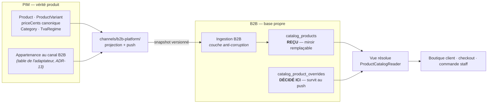

# Le catalogue synchronisé — le PIM pousse, la plateforme accueille et altère

**État : 🟡 partiellement implémenté.** C1 à C4 sont codés et testés ; C5 livre
sa comparaison de parité, mais la bascule attend deux blocages hors code (voir
« La bascule »). C6 et C7 ne sont pas commencés. Date : 2026-08-17.

Voisins :

- [`architecture-conditionnements-pricing.md`](architecture-conditionnements-pricing.md)
  — la frontière PIM / B2B, tranchée le 2026-08-04 : le PIM porte le prix
  canonique, le B2B porte les altérations. **Ce document l'implémente**, il ne la
  rediscute pas ;
- [`architecture-resolution-de-prix.md`](architecture-resolution-de-prix.md) — les
  étages datés. Sa slice S2 déclare explicitement dépendre de ce chantier ;
- [`audit-catalogue-boutique-b2b.md`](audit-catalogue-boutique-b2b.md) — le
  constat qui a ouvert le sujet ;
- [`../pim/adr.md`](../pim/adr.md) — **ADR-13** : un canal possède ses propres
  tables, le socle ne pointe jamais vers un canal. La règle qui structure tout
  ce qui suit côté PIM.

---

## L'état réel, qui n'est pas « pas encore branché »

Le catalogue B2B est **copié trois fois**, et les copies ont déjà divergé.

| Copie            | Où                                              | Sert à                             |
| ---------------- | ----------------------------------------------- | ---------------------------------- |
| PIM              | `products.seed.ts` (importé du CSV Shopify)     | l'original                         |
| Front client B2B | `app/data/catalogue-seed.ts` — **1 079 lignes** | tout l'affichage boutique          |
| Backend B2B      | `orders/infrastructure/product-catalog.seed.ts` | **l'autorité de prix au checkout** |

Le backend B2B **n'a aucune table produit**. Vingt-deux fichiers du front
importent le seed. Le taux de TVA y est codé en dur à 5,5 % alors que le PIM
porte un `TvaRegime` par catégorie.

Ce n'est donc pas une intégration à ajouter : c'est une duplication à supprimer,
sur un chemin qui facture de l'argent réel depuis le 2026-08-17.

---

## Le principe

**La plateforme est un canal du PIM, au même titre que Shopify.** Le PIM a déjà
driver, projection, snapshot, push et réconciliation pour Shopify. Un canal de
plus est un driver de plus — pas une branche de plus, pas une mécanique neuve.
C'est ce que l'OCP demande, et ça évite de réinventer le versionnement de
snapshot et le rollback qui existent déjà.

---

## Le point dur : le reçu et l'altéré ne partagent pas leurs colonnes

C'est **la** décision de structure, et elle se prend une seule fois.

Si le back-office écrit son prix dans `catalog_products.price_cents`, le push
suivant n'a que deux issues, toutes deux fausses : écraser le travail commercial,
ou refuser de s'appliquer. Il n'existe pas de troisième branche — l'information
« ce prix a été décidé ici » n'est stockée nulle part.

**Deux tables, donc.** `catalog_products` est un **miroir** : remplacé
intégralement à chaque push, jamais édité à la main, sans valeur propre — on peut
le perdre et le reconstruire par un re-push. `catalog_product_overrides` porte les
**décisions de la plateforme** : une ligne par SKU altéré, avec son auteur et sa
date, et rien d'autre. Le reçu bouge, l'override reste.

Trois bénéfices qui ne s'obtiennent pas autrement :

- l'écran peut dire **« prix PIM 2,40 € · prix B2B 2,10 €, posé par Cécile le
  12/08 »** au lieu d'un nombre sans provenance ;
- « revenir au prix du PIM » est une **suppression de ligne**, pas une ressaisie ;
- un produit dont le PIM change le prix fait apparaître un **écart visible**, au
  lieu d'une valeur qui se met à mentir en silence.

C'est le même raisonnement que la réconciliation 3-voies BASE/OURS/THEIRS déjà en
place pour Shopify. La logique est acquise dans cette maison ; on l'applique.

---

## Décisions verrouillées le 2026-08-17

1. **Altérable côté plateforme : le prix et la visibilité. Rien d'autre.**
   - _Prix_ — le tarif de liste **du canal B2B**, pré-altération. C'est
     l'entrée du pipeline de [`architecture-resolution-de-prix.md`](architecture-resolution-de-prix.md),
     pas un de ses étages : la mercuriale, le dégressif et les promos viendront
     **par-dessus**, et n'ont rien à faire ici.
   - _Visibilité_ — masquer un produit du catalogue B2B sans le retirer du PIM,
     et marquer les mis en avant.
2. **Les textes ne sont pas altérables.** Le travail éditorial du PIM est bon ;
   on part de ses modèles et on décidera plus tard de ce qu'on affiche. Une
   couche éditoriale par canal se rajoute quand un besoin réel la réclame — pas
   avant, sinon on maintient deux fiches produit qui divergent sans que personne
   ne l'ait demandé.
3. **Le rangement n'est pas altérable.** Un produit ne change pas de famille. En
   revanche, des **catégories supplémentaires** propres au B2B sont attendues :
   c'est un chantier distinct, à ouvrir quand le besoin se précise, pas une
   duplication préventive de la taxonomie PIM.
4. **Le périmètre poussé est une appartenance explicite au canal.** Un produit
   part en B2B parce que quelqu'un l'y a publié, exactement comme pour Shopify
   (le pattern `membership` existe). `ProductStatus = published` ne suffit pas :
   il ferait de « publié chez Shopify » et « vendu aux pros » la même décision,
   et les deux catalogues ne pourraient jamais diverger.
5. **Le push est un snapshot complet et versionné**, pas un delta. Un delta
   suppose que les deux côtés sont d'accord sur l'état de départ ; un snapshot
   est vrai tout seul, rejouable, et diffable. Le versionnement et le rollback
   sont ceux du canal Shopify.
6. **L'ingestion est une couche anti-corruption.** Le B2B mappe le payload vers
   **son** modèle au bord. Aucun type du PIM ne franchit `infrastructure/` —
   même règle que pour Prisma.

---

## Ce que le push transporte

Le contrat de fil vit dans un package dédié, importé par les deux backends. Ni
`@lfd/contracts` (langage B2B) ni `@lfd/pim-contracts` (DTO du PIM) ne conviennent :
c'est un format de **synchronisation entre deux contextes**, donc réellement
transverse — le seul cas où un type partagé est légitime.

Par SKU : identifiant, nom, catégorie, prix canonique HT en centimes, **taux de
TVA résolu** depuis le `TvaRegime` de la catégorie, poids, statut. Plus la liste
des catégories, pour que la plateforme range sans deviner.

Le taux de TVA réel est un gain immédiat : le B2B code aujourd'hui 5,5 % en dur
pour tout, y compris le non-alimentaire.

---

## Comment le PIM prouve son identité au B2B — secret partagé (2026-08-17)

Le push est un appel **backend → backend**, sans utilisateur. Décision : un
**secret partagé porté par un en-tête**, comparé en temps constant par un guard,
symétrique du `RECOMPUTE_TOKEN` déjà en place. Retenu pour sa portabilité : il
fonctionne en local, en CI, et chez n'importe quel hébergeur — le jour où l'un
des deux backends déménage, rien à refaire.

Un **service binding** Cloudflare serait strictement plus solide : l'identité y
est topologique, il n'y a pas de secret à fuiter ni à faire tourner, et le
trafic ne touche jamais le réseau public. Il n'est pas écarté — c'est une
**amélioration disponible**, pas une dette : binding et secret ne s'excluent
pas (l'un est un transport, l'autre une preuve d'identité), et l'ajouter plus
tard ne change **aucune ligne de code**, seulement la topologie.

L'écart entre les deux est d'ailleurs plus étroit qu'il n'y paraît : l'endpoint
d'ingestion n'est **pas joignable nu** — `workers.dev` est fermé sur les deux
backends, seule la passerelle route (cf.
[`../ops/securite-frontiere-de-confiance.md`](../ops/securite-frontiere-de-confiance.md)).
Le secret ne garde pas une porte ouverte sur Internet ; il empêche qu'un
appelant **déjà admis par la passerelle** réécrive le catalogue vendu.

Un jeton M2M Auth0 sur une troisième audience a été écarté : il ajouterait une
dépendance externe sur un chemin qui n'en a pas, et consommerait le quota de
1 000 jetons/mois du plan Free — déjà partagé avec la Management API qui ouvre
les accès clients.

---

## `catalog-ui` — et pourquoi il ne fusionne pas avec `b2b-ui/catalog`

`packages/b2b-ui/src/catalog` existe déjà : c'est le catalogue **du client** —
rayons, carte produit, achat. `catalog-ui` est un autre métier, le
**paramétrage** : liste éditable, champ de prix avec sa provenance, bascule de
visibilité, indicateur d'écart avec le PIM.

Deux consommateurs réels dès le premier jour — le PIM (prix canonique,
appartenance au canal) et l'admin B2B (prix B2B, visibilité) — donc l'extraction
est justifiée d'emblée, sans attendre le second usage.

Ce que le package ne contient **jamais** : un `isAdmin`, ou quoi que ce soit qui
sache lequel des deux hôtes l'affiche. Même règle que `@lfd/b2b-ui`.

---

## La bascule, qui est le vrai risque

Couper le seed pour la base change **le prix servi à des clients qui commandent
pour de vrai**. La bascule ne se fait pas parce que le code compile :

1. le push tourne, la base B2B est peuplée ;
2. on **compare les 92 SKU** — nom, prix, TVA — entre le seed et la base, et on
   explique chaque écart avant de continuer ;
3. le port `ProductCatalogReader` bascule sur l'adaptateur Prisma ;
4. le front client cesse d'importer le seed ;
5. les deux seeds sont **supprimés**, pas laissés « au cas où » — une copie
   morte est une copie qui redeviendra vivante par erreur.

Le seed backend est l'autorité de prix : tant que l'étape 2 n'est pas faite, un
écart silencieux facture le mauvais montant sans que rien ne le signale.

**L'étape 2 est outillée** : `GET /admin/catalog/parity` compare les deux
implémentations réelles — le seed tel que le checkout le résout, le catalogue
reçu tel que la boutique le lirait — et le workflow `ops_b2b_catalog_parity`
l'imprime en tableau lisible. Comparer les fichiers sources aurait prouvé que
deux tableaux se ressemblent, pas que la caisse rend la même monnaie.

### 🔴 Deux blocages, tous deux HORS code (constatés le 2026-08-17)

**1. Cinq familles sur six n'ont pas de régime de TVA dans le PIM.** Seul
« Pains » (18 produits) en porte un. Un push aujourd'hui emmènerait **18 produits
sur 93**, et la projection nommerait 74 exclusions `famille_sans_tva`. C'est le
refus qui fonctionne comme prévu — mais la bascule attend une **saisie dans le
PIM**, pas une ligne de code. (Au passage : deux familles « Viennoiseries »
coexistent, dont une portant un seul produit — à fusionner.)

**2. Le SKU vendu change de forme.** Le seed vend le SKU **produit**
(`VIE-001`) ; le PIM pousse celui de la **déclinaison** (`VIE-001-1`), parce que
c'est elle qui porte le prix. Conséquences :

- la comparaison de parité rapproche donc par `productSku` **sur la déclinaison
  par défaut** — sans quoi elle rendrait 92 disparitions et 92 apparitions ;
- les `OrderLine` déjà écrites gardent l'ancienne chaîne, et c'est correct : ce
  sont des snapshots, pas des clés étrangères ;
- **mais** « les SKU déjà commandés » (le rappel de commande) joint les lignes
  passées au catalogue. Après la bascule, il ne trouverait plus rien pour les
  commandes antérieures, **en silence**. À traiter avec la bascule, pas après.

**3. Corollaire de séquencement : C5 et C7 ne se séparent pas.** Le front client
appelle le catalogue par SKU produit. Basculer le backend sans le front donnerait
une boutique dont chaque ajout au panier est refusé par la caisse. Les deux
slices partent ensemble, ou aucune.

---

## Chantier

- [ ] **C1 — Le contrat de fil.** Package de synchronisation : payload snapshot
      versionné + appartenance au canal. Rien d'autre ne peut commencer avant.
- [ ] **C2 — PIM : appartenance au canal B2B.** Table de l'adaptateur (ADR-13),
      geste de publication, endpoint.
- [ ] **C3 — PIM : `channels/b2b-platform/`.** Projection + push + snapshot, sur
      le moule Shopify.
- [ ] **C4 — B2B : contexte `catalog/`.** Les deux tables, l'ingestion
      anti-corruption, le port de lecture. **Dépend de l'arbitrage d'identité.**
- [~] **C5 — B2B : la comparaison de parité est livrée** (`/admin/catalog/parity` + workflow `ops_b2b_catalog_parity`). **La bascule du port reste à faire**,
  et attend les deux blocages ci-dessus — dont un qui est de la saisie PIM.
- [ ] **C6 — `catalog-ui` + écran admin.** Prix B2B et visibilité, avec la
      provenance affichée.
- [ ] **C7 — Front client sur l'API.** Les 22 fichiers, puis suppression des deux
      seeds.

C1 à C3 ne touchent pas la production. Le risque se concentre sur C5, et c'est
là que la comparaison SKU à SKU est non négociable.
