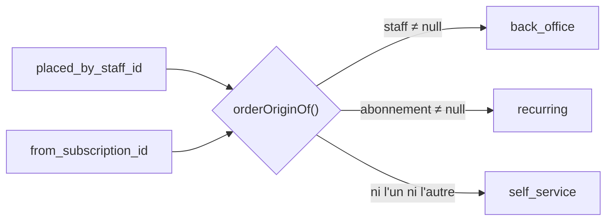

# La commande saisie par l'équipe — au téléphone, en clientèle

**État : ✅ livré le 2026-08-15.** Le commercial peut passer une commande à la
place d'un client depuis le back-office : `POST /admin/orders`, écran
`/comptes-clients/:id/nouvelle-commande`.

---

## 1. Ce que ce n'est pas : une autre nature de commande

Le réflexe, en voyant arriver une seconde porte d'entrée, est d'introduire une
union discriminée — `customer_order | platform_order`. Elle a été écartée, et
c'est la décision structurante de ce chantier.

**Le test.** Qu'est-ce qui _se comporte_ différemment ? Les lignes, les prix, la
TVA, l'acheminement, le jeton de retrait, la frise d'avancement : identiques. Ne
diffèrent que l'auteur enregistré et le chemin de règlement. Une union qui
discrimine deux formes portant les mêmes vingt-cinq champs est une étiquette
déguisée en type : chaque lecteur doit narrower pour n'apprendre rien, et la
balise descend jusque dans l'app client, où la distinction n'a aucun sens.

**Le fond.** Une commande saisie par le commercial _pour_ un client reste **la
commande de ce client** : elle apparaît dans « Mes commandes », elle se règle à
son nom, elle porte son QR de retrait. Il n'y a pas deux natures de commande, il
y a deux portes d'entrée.

**La preuve était déjà au schéma.** `from_subscription_id` dit exactement le même
genre de fait — « d'où vient cette commande » — et il a été modélisé en colonne
nullable. Un `kind` devrait donc naître à trois valeurs sans être fermé pour
autant.

### Le modèle retenu

| Fait                                 | Où il vit                                       |
| ------------------------------------ | ----------------------------------------------- |
| À qui elle est portée                | `orders.placed_by_user_id` — toujours un client |
| Qui l'a saisie chez LFC              | `orders.placed_by_staff_id` — nullable          |
| Quel abonnement l'a produite         | `orders.from_subscription_id` — nullable        |
| **Par quelle porte elle est entrée** | `origin`, **dérivé** des deux colonnes          |

⚠️ **« Portée à » n'est pas « visible par ».** La commande appartient au
**compte** ; l'interlocuteur choisi est celui qu'on rappelle et à qui un lien de
règlement est adressé. Il ne la verra pas dans son « Mes commandes » : `GET
/orders/mine` ne liste que les commandes **personnelles** (`company_id IS
NULL`). L'écran de saisie l'annonçait — « la commande apparaîtra dans l'espace de
cette personne » — et faisait promettre au commercial un écran qui n'affiche
rien. Le jour où le client verra les commandes de son compte, c'est cette
requête-là qui changera, pas le modèle.

`origin` n'est **pas** une colonne : ce serait un troisième endroit où
l'information vit, donc un troisième endroit où elle peut se désaccorder des
deux autres. La règle est une fonction pure et testée
(`orders/domain/services/order-origin.ts`), les vues de lecture l'appellent.

La saisie humaine l'emporte quand les deux marques coexistent. Le cas n'existe
pas encore — le planificateur d'abonnements ne passe pas par le back-office —
mais l'arbitrage est gravé dans un test, pour qu'il ne soit pas rendu un jour
par l'ordre des `if`.

**Pas de clé étrangère** vers `staff_users` : une commande est une pièce
comptable, elle ne doit ni disparaître ni bloquer le jour où l'on retire du
personnel de l'annuaire. Un identifiant et non un instantané du nom — l'inverse
de `handed_over_by`, qui fige le `sub` parce que c'est une **attestation**, pas
un affichage.

---

## 2. Les deux règles propres à cette surface

Le panier se compose exactement comme celui du client : `OrderDrafting` est
partagé par les deux passations. Prix ré-résolus au catalogue, remise de retrait
du point choisi, zone déduite du code postal — une seconde implémentation aurait
fini par diverger, et sur le chemin qu'on teste le moins.

### 2.1 Le mur porte sur l'ACHETEUR, pas sur l'acteur

Un commercial n'est membre d'aucune société cliente. Vérifier **son**
appartenance refuserait toutes les commandes ; l'oublier les autoriserait
toutes. C'est `buyerUserId` qui doit être membre — il vient du corps de la
requête, donc il se vérifie. Le droit d'être là, lui, a déjà été tranché par la
porte staff, et l'identité du saisisseur vient de cette porte : un client au nom
de qui commander se choisit à l'écran, l'auteur d'une trace ne se choisit pas.

### 2.2 Aucune carte n'est saisie par l'équipe

Deux modes, et pas de troisième :

| `settlement` | Ce qui se passe                                                                    |
| ------------ | ---------------------------------------------------------------------------------- |
| `account`    | `payment_status: not_required` — à facturer. **Refusé** sans crédit accordé (409). |
| `link`       | Intention Stripe + une URL que le client suit lui-même (`/commandes/:id/regler`).  |

Il n'y a délibérément pas de « carte saisie au comptoir » : un numéro dicté au
téléphone et tapé par un commercial est exactement ce qu'on ne veut pas rendre
possible.

`settlement` **n'a pas de défaut**. Choisir entre facturer et réclamer un
règlement est une décision commerciale ; un défaut silencieux la prendrait à la
place du commercial, et toujours dans le même sens.

Le refus du compte sans crédit est le mur de cette surface. Sans lui, un écran
de back-office suffirait à accorder un délai de paiement que personne n'a
négocié — et la plateforme livrerait à crédit sans jamais l'avoir décidé.

---

## 3. ⚠️ « Intégré à la période en cours » — ce que ça veut dire aujourd'hui

L'écran de confirmation annonce, en mode `account` : _« facturée sur la période
en cours »_. **Cette période n'existe pas encore.** La facturation mensuelle est
doc-first — aucune facture, aucune échéance, aucun prélèvement :
[`architecture-facturation-mensuelle.md`](architecture-facturation-mensuelle.md).

Ce que la commande porte réellement est `payment_status: not_required`, avec le
même sens que pour une commande passée par le client sur son terme : **à
facturer hors ligne**. La phrase est donc une promesse qui tiendra le jour où la
boucle de facturation existera, et une description honnête de l'intention
aujourd'hui.

Ce qui rendrait la phrase fausse : accorder le mensuel à des sociétés sans avoir
livré la facturation. C'est déjà le risque nommé par le document ci-dessus ;
cette surface l'augmente seulement en volume.

---

## 4. La pertinence, qui est tout l'écran

Devant 92 produits, un commercial au téléphone n'a pas besoin d'un catalogue. Il
a besoin des trente lignes que ce client-là reprend chaque semaine.

Trois colonnes, dans l'ordre où se déroule l'appel :

| Colonne | Ce qu'elle porte                                                          |
| ------- | ------------------------------------------------------------------------- |
| Gauche  | Ses commandes passées — **cliquables** : « refais-moi la même que mardi » |
| Milieu  | La source : ses habitudes (défaut), le catalogue, ou une commande choisie |
| Droite  | Le panier, l'acheminement, le règlement, la confirmation                  |

`GET /admin/catalog/companies/:id` agrège les lignes des douze derniers mois par
SKU, **triées par reprise puis récence** : le chiffre d'affaires ferait remonter
les articles chers, pas les articles habituels. La quantité proposée est la
**moyenne par commande**, pas le cumul de l'année — sinon le panier part avec 480
croissants.

Deux décisions qui se lisent dans les tests :

- le nom et le prix viennent du **catalogue d'aujourd'hui**, jamais du snapshot
  de la vieille commande. Un commercial qui lit cette liste au téléphone annonce
  donc le tarif que le serveur appliquera ;
- un SKU **retiré du catalogue** descend quand même, sous son dernier nom
  facturé, barré et sans prix. Le filtrer laisserait croire que le client ne l'a
  jamais pris, et il le reproposerait.

### Le catalogue vient du serveur

Il existait déjà trois copies de la table des produits : le PIM, le seed du front
client (visuels, descriptions), le seed du backend (les prix qui font foi au
checkout). Une quatrième dans l'app admin aurait été **la copie de trop** : celle
où le commercial annonce un prix que le serveur refuse ensuite. `GET
/admin/catalog` sert donc le catalogue **du checkout**, et un test vérifie que
`all()` et `resolve()` parlent des mêmes articles.

La famille d'un produit se lit dans son préfixe de SKU (`VIE`/`PAI`/`PAT`/`SAL`/
`CHO`) — elle y est déjà, et une colonne à côté aurait pu la contredire.

---

## 5. Ce que l'écran refuse de faire

- **Calculer de l'argent.** Le seul montant affiché est le sous-total HT — une
  multiplication et une somme. Remise, TVA par taux et total TTC restent au
  serveur, et le panier le dit à l'écran. Les recopier donnerait deux
  implémentations de la même règle d'arrondi, donc deux résultats à un centime
  près, et un client qui compare son écran à sa facture (cf.
  [`architecture-commande-immuable-avenants.md`](architecture-commande-immuable-avenants.md)).
- **Saisir une adresse de livraison à la volée.** Le sélecteur d'acheminement
  propose retrait **ou** coursier, comme le panier du client — mais les adresses
  viennent du **carnet de la société**. Côté client, l'adresse libre sert à
  commander sans compte ; ici le compte existe, et une adresse dictée au
  téléphone appartient à sa fiche, pas à une commande. Carnet vide ⇒ l'écran
  renvoie à la fiche au lieu d'ouvrir un champ.

  Une adresse **dictée** peut rejoindre le carnet, par une case à cocher
  décochée par défaut : une commande livre parfois un lieu de passage, et
  l'enregistrer d'office remplirait le carnet d'adresses où l'on ne retournera
  jamais. L'ajout se fait **après** la commande, et son échec ne la remet pas en
  cause — annoncer une erreur enverrait le commercial la ressaisir.

  ⚠️ `DELIVERY_SERVICE_OPEN` reste à **faux** et ne gouverne plus que la carte
  Adresses et la checklist d'activation : les zones se règlent dans Réglages →
  Livraisons & retraits, et le panier client offre les deux acheminements depuis
  le pivot « zéro friction ». Le drapeau et la réalité ont divergé ; c'est la
  réalité que le back-office suit.

- **Modifier une commande passée.** Ajouter un fait n'est pas en réécrire un.
  Faire avancer ou annuler viendront avec les avenants.

---

## 5 bis. Le brouillon

Un appel s'interrompt. La saisie se met de côté (`PUT /admin/order-drafts/:companyId`)
et se reprend — **depuis n'importe quel poste**, ce qui est la seule raison de
l'avoir sortie du navigateur.

**Un brouillon par société, partagé par l'équipe** — pas un par personne. C'est le
compte qu'on sert : un commercial qui reprend l'appel d'un collègue doit
retrouver ce qui a été saisi. La contrepartie est assumée — deux saisies
simultanées sur le même compte, la dernière écrase l'autre — d'où
`saved_by_staff_id`, qui dit au moins à qui demander. Un verrou optimiste
viendrait le jour où deux commerciaux se marchent dessus pour de vrai.

**Aucun invariant.** Zéro ligne, pas d'acheteur, pas de date : ce sont des états
normaux d'un appel interrompu. Les invariants (au moins une ligne, une adresse
quand on livre, un acheteur membre) valent pour la **passation**, et c'est
`adminPlaceOrderPayloadSchema` qui les porte. Un brouillon qu'on refuserait de
garder parce qu'il ne passerait pas serait un brouillon qui ne sert à rien. C'est
aussi pourquoi il n'y a **pas d'agrégat** derrière ce port : il n'y a rien à
protéger, et une entité serait de la cérémonie autour d'un `upsert`.

**Des faits, pas l'état de l'écran.** On garde l'adresse _retenue_, pas « la
troisième du carnet » ; les lignes sont des SKU et des quantités, **sans prix**.
À la reprise, l'écran rapproche l'adresse du carnet par sa rue et son code postal
(sinon il rouvre la saisie, garnie), et **re-résout les prix au catalogue du
jour** — une saisie de la semaine dernière ne doit pas rouvrir sur un tarif
périmé qu'on annoncerait au téléphone. Un SKU disparu du catalogue est retiré et
signalé.

La lecture est **enveloppée** (`{ draft: … | null }`) : « pas de brouillon » est
une réponse ordinaire, pas un 404 ; et un `null` nu se sérialise en corps vide,
que le client relit en `{}` — un objet qui ressemble à un brouillon sans en être
un.

---

## 6. Le droit qui a changé

`commercial` avait `orders: "read"` — la personne même pour qui cette surface
existe ne pouvait pas poster de commande. Il a `orders: "write"` depuis le
2026-08-15.

**Élargissement assumé** : ce droit couvre aussi l'attestation de remise au
comptoir (`POST /admin/handover/:token`). Celui qui prend la commande est
souvent celui qui remet le sac. Il ne couvre toujours pas la modification d'une
commande passée — aucune route ne l'expose.

---

## 7. Ce qui reste ouvert

- **La facturation mensuelle** (§3) — la seule dette réelle de cette surface.
- **Le lien de règlement ne part par aucun e-mail.** Il est copié dans le
  presse-papier du commercial et dicté dans un toast si la copie échoue, parce
  que le canal e-mail n'a encore jamais envoyé un message en production (cf.
  [`../todos/todo-notifications.md`](../todos/todo-notifications.md)). Le jour où
  il enverra, l'envoi s'ajoutera **sans remplacer** la copie : une commande prise
  au téléphone se conclut au téléphone.
- **Sans `CLIENT_BASE_URL`**, la commande part quand même et le lien est absent —
  le commercial le voit. Il n'y a pas d'autre chemin aujourd'hui pour retrouver
  la page de règlement que le lien lui-même : « Mes commandes » ne propose pas
  encore « régler » sur une commande en attente.
