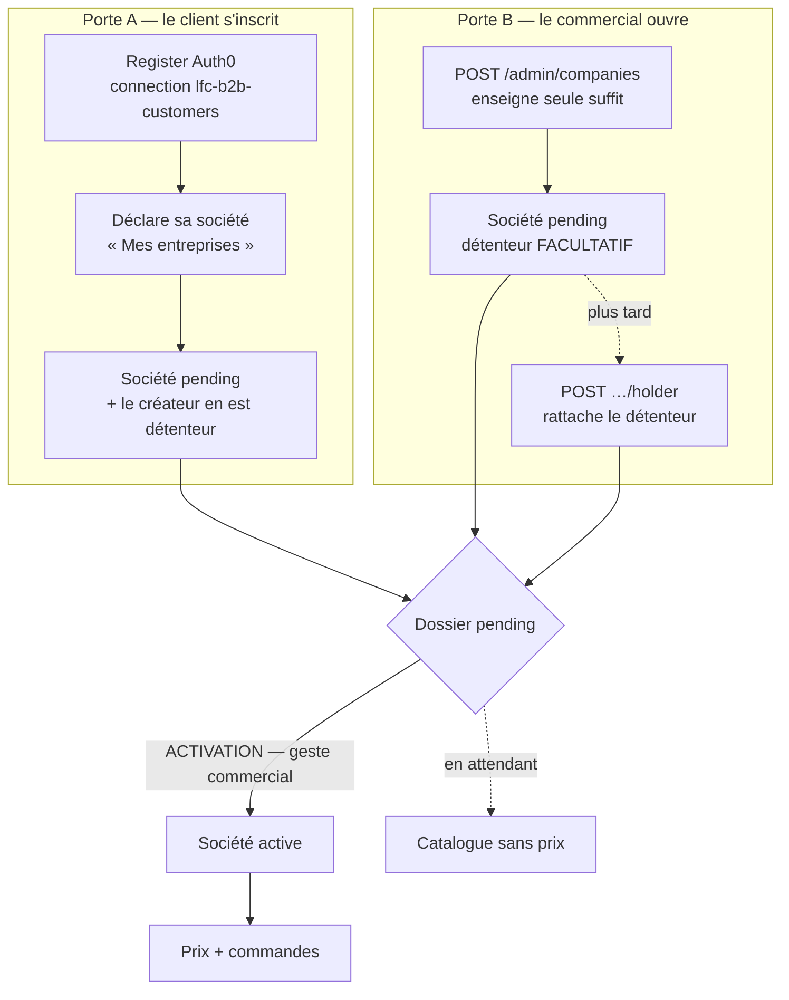
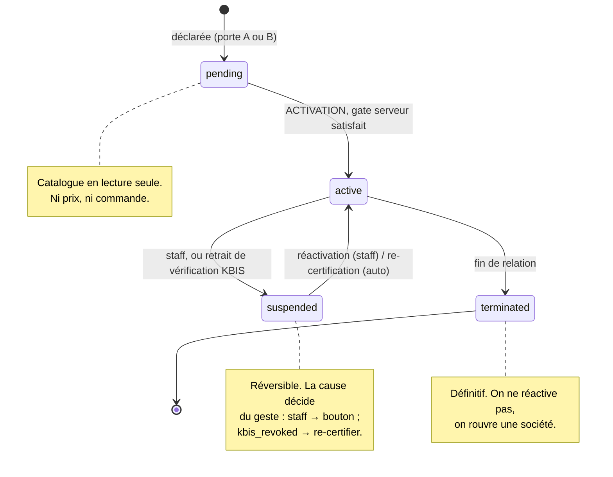
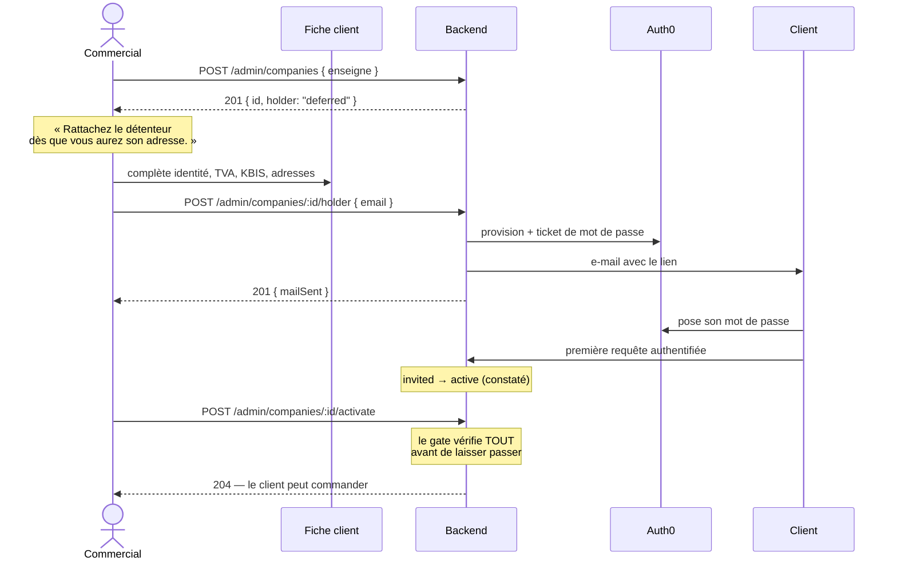
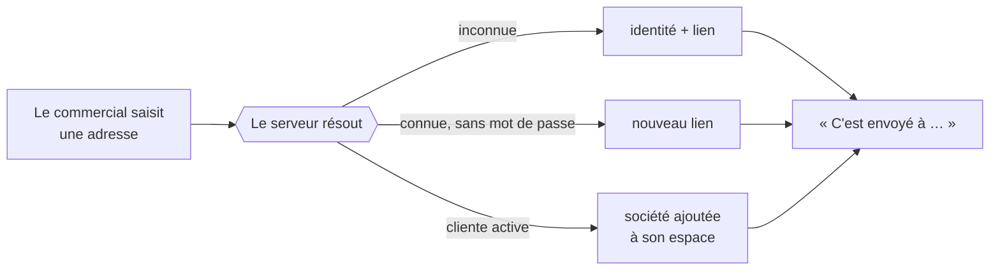
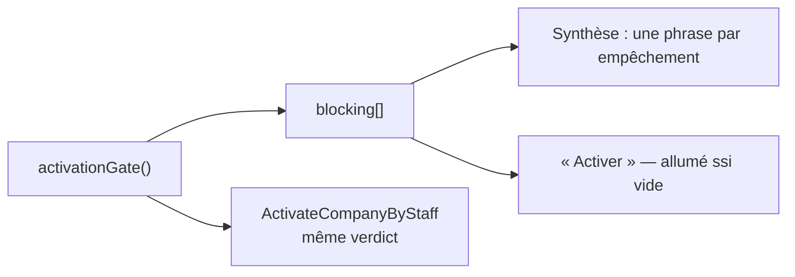
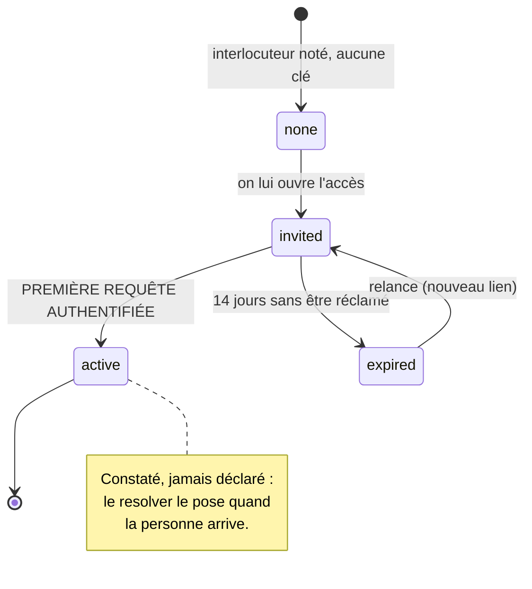

# Compte client — de l'ouverture à l'accès

> **Le cycle de vie complet d'un compte client B2B** : comment il s'ouvre (par le
> client ou par le commercial), qui le détient, comment il s'active, et comment
> l'accès d'une personne naît, se prouve et se périme.
>
> Le fil : **une société et une personne sont deux choses**. Le dossier s'ouvre
> sans détenteur, le détenteur se rattache sans être encore entré, et l'entrée se
> constate — elle ne se déclare pas.
>
> Consolidé le **2026-08-12**. Remplace et **supprime** quatre documents :
> `architecture-onboarding-provisioning-b2b.md`, `admin-commercial-comptes-clients.md`,
> `decision-discretion-recherche-personnes.md` et
> `todos/post-release-detention-et-acces.md`.
>
> Prérequis lus : [`architecture-identite-auth-tenancy.md`](architecture-identite-auth-tenancy.md)
> (Auth0 authentifie, notre base autorise ; le mur `company_id`) et
> [`architecture-activation-configuration-b2b.md`](architecture-activation-configuration-b2b.md)
> (quelles pièces sont exigées — la config que le verdict d'activation consomme).
>
> **Statut : ✅ livré**, sauf §8 (gestes de fin de vie) et §9 (branchements prod,
> **aucun essai réel n'a encore eu lieu**).

---

## 0. Le vocabulaire, d'abord

Quatre mots qu'on confond vite, et dont la confusion a produit la moitié des bugs
de ce sujet :

| Mot               | Ce que c'est                                                      | Où ça vit                     |
| ----------------- | ----------------------------------------------------------------- | ----------------------------- |
| **Société**       | Le dossier client : identité légale, pièces, adresses, conditions | `companies`                   |
| **Détenteur**     | La personne **du** compte — celle qu'on rappelle et qui commande  | colonnes `contact_*` aplaties |
| **Interlocuteur** | Quelqu'un qu'on appelle, qui n'a pas forcément de clés            | `company_contacts`            |
| **Accès**         | Le droit d'entrer dans l'espace, pour **une** société             | `memberships` + `users`       |

Le détenteur **est** le contact principal : celui qu'on rappelle est celui qui
commande. Les séparer était une distinction de modèle sans réalité commerciale.

Et l'accès n'est **pas une catégorie de personnes** : c'est un **état** de
chacune. Le responsable réception qui prend les livraisons n'a aucune raison de
se connecter — `none` est le cas le plus fréquent et parfaitement légitime.

## 1. Deux portes, un seul dossier

Le **dossier** est la société ; les deux portes y mènent, et **la validation
n'appartient qu'au commercial**. Un e-mail ne s'auto-attribue jamais des
conditions négociées.

**Différence essentielle entre les deux portes** : par la porte A il y a un
créateur, donc un détenteur d'office. Par la porte B, il n'y a personne — le
staff n'est pas le client. La société naît donc **sans membership**, et c'est
légitime : le staff la voit par la lecture cross-tenant (`AdminCompanyReader`),
pas par « Mes entreprises ».

## 2. Ce qui s'ouvre avec quoi

**Une enseigne. C'est tout.**

Le commercial a le client au téléphone et n'a souvent que le nom de la maison.
Tout le reste — raison sociale, forme juridique, SIRET, TVA, KBIS, adresses,
**et le détenteur** — se complète après. Ce qui bloquerait ici bloquerait une
saisie faite pendant l'appel, donc un compte qui ne serait jamais ouvert.

Le minimum est tenu par l'**agrégat** (`Company.declare` exige l'enseigne), pas
par la frontière HTTP. La charge `createCompanyPayload` n'exige plus rien : elle
l'a fait, et refusait alors une ouverture que le domaine autorisait.

## 3. Le parcours réel, côté admin

**L'issue du rattachement a trois valeurs, pas deux** (`HolderOutcome`) :
`attached`, `deferred` (aucune adresse saisie — un **choix**), `failed` (le canal
d'identité n'a pas répondu — une **panne**). Les confondre faisait annoncer un
incident à qui venait simplement de remettre le rattachement à demain.

## 4. Le détenteur : trois gestes, et un seul par intention

| Intention                    | Geste                              | Écrit                       |
| ---------------------------- | ---------------------------------- | --------------------------- |
| **Désigner** la personne     | `POST /admin/companies/:id/holder` | contact **et** accès, en un |
| **Corriger** ses coordonnées | `PATCH …/primary-contact`          | le contact seul             |
| Ouvrir l'accès d'un collègue | `POST …/members`                   | l'accès seul                |

`changePrimaryContact` **refuse** de créer un détenteur (`CompanyHasNoHolderError`),
et `attachHolder` refuse d'en remplacer un (`CompanyAlreadyHasOwnerError`). Sans
ces deux refus, il existait deux chemins vers le même état — dont un en deux
temps où l'on pouvait s'arrêter au milieu, laissant un nom en fiche **sans la clé
de l'espace**.

**L'ordre du rattachement compte** : l'accès d'abord, la fiche ensuite. Un échec
du fournisseur d'identité ne laisse alors rien derrière lui, et la reprise
repasse (l'ouverture d'accès est idempotente sur l'adresse). Dans l'autre sens,
la seconde tentative se ferait refuser par l'agrégat, qui verrait la place prise.

## 5. On ne cherche pas les personnes

**L'adresse e-mail est la seule clé, et rien ne se cherche.** Aucune route ne
répond « cette adresse est-elle connue ? » — `GET /admin/customers?q=` et
`by-email` ont été supprimés.

Dans un circuit fermé, savoir **qui travaille avec qui** est une information
commerciale. Trois personnes ne doivent pas l'apprendre :

| Qui                | Ce qu'il ne doit pas apprendre                       |
| ------------------ | ---------------------------------------------------- |
| Le **détenteur A** | que son comptable travaille aussi chez B             |
| Le **commercial**  | que l'adresse qu'il saisit est déjà cliente ailleurs |
| Un tiers           | que telle adresse existe dans notre fichier          |

Le commercial est pourtant interne. On le tient quand même à l'écart : ce qu'il
ne sait pas, il ne peut ni le répéter en clientèle ni le laisser fuir. Et il n'en
a **pas besoin** — c'est l'intéressé qui apprend, par l'e-mail qu'il reçoit,
qu'une société a rejoint son espace.

**Un seul libellé pour trois chemins** : c'est le cœur du dispositif. L'issue
(`AccessOutcome`) reste au serveur, où elle choisit seulement quel e-mail part.

C'est aussi le choix qui tient à l'échelle : la recherche par nom était un
`ILIKE %terme%` sur trois colonnes — un balayage de toute la table des personnes
à chaque frappe. La résolution par adresse est un accès par index.

**Ce que ça coûte, assumé.** La faute de frappe n'a plus de filet :
`jean@comptior.fr` crée une seconde personne et envoie un lien dans le vide. Le
garde-fou honnête serait de traiter les **rebonds d'e-mail** comme un signal —
ce que nous ne faisons pas encore, et qui est la contrepartie logique de cette
décision.

**Règles qui en découlent :**

1. **Le nom d'une personne lui appartient.** Nos e-mails s'adressent à elle avec
   **son** prénom, jamais celui qu'un commercial vient de taper.
2. **Aucune réponse d'API ne révèle l'existence d'une adresse.** Pas
   d'`attachedToExisting`, pas d'`outcome`, pas de compteur.
3. **Une exception se documente ici** — le jour où un annuaire interne ou une
   fusion de doublons en aura besoin.

## 6. L'activation : un seul verdict, celui du serveur

`activationGate(company, settings)` est **la seule autorité**. Il rend
`canActivate`, la liste des **empêchements** (des codes, pas des phrases) et
l'état pièce par pièce. L'écran ne rejoue rien : il donne un titre et un bouton.

Les empêchements : `identite_legale`, `detenteur`, `telephone`, `tva`,
`kbis_absent`, `kbis_non_verifie`, `facturation`, `livraison`. Les quatre
derniers dépendent de la config plateforme (`hidden` / `optional` / `required`) ;
les trois premiers ne se désactivent pas.

Deux d'entre eux méritent leur raison d'être :

- **`detenteur`** — un compte s'**ouvre** sans détenteur, il ne devient pas
  **client** sans. Activer sans personne à qui ouvrir l'espace fabriquerait un
  compte actif dont la porte est murée.
- **`telephone`** — un livreur qui cherche une porte doit pouvoir appeler
  quelqu'un. N'importe lequel des interlocuteurs, pas forcément le détenteur.

Cette règle a été écrite deux fois par le passé — une fois au serveur, une fois à
l'écran — et les deux ont dérivé : « Activer » s'allumait sur un KBIS déposé mais
non vérifié, et le serveur répondait 409. **Une règle écrite deux fois est une
règle qui finira par se contredire.**

La **traçabilité** est figée à l'acte : qui a activé, à quel titre, quand
(`activatedBy` : sub + nom + rôle, recopiés, jamais re-joints à l'affichage). Un
nom d'aujourd'hui ne vaut pas pour l'acte d'hier.

## 7. Le cycle de vie d'un accès

**L'entrée se constate.** `invited → active` se fait tout seul, à la première
requête authentifiée (`customer-user.resolver.ts`). Rien à instrumenter.

**L'invitation périme au bout de 14 jours** (`INVITATION_LIFETIME_DAYS`). Ce
n'est pas une contrainte inventée : le lien de mot de passe du fournisseur a
**déjà** une durée de vie limitée. Une invitation qui traîne trois semaines est
donc déjà morte — simplement, rien ne le disait.

Le compteur est le `createdAt` du **membership**, pas celui du compte : la même
personne a pu être invitée ailleurs il y a un an et ici hier.

La règle (`isInvitationExpired`) est **pure et écrite une seule fois**, parce
qu'elle sert deux endroits : l'écran, qui doit dire vrai entre deux balayages, et
le balayage lui-même. À l'échéance, l'accès tombe ; **le contact reste en fiche**
— le commercial ne perd pas sa saisie, et « relancer » refait une demande neuve.

> ⚠️ **La lecture est faite, la révocation ne l'est pas.** La fiche affiche
> `expired`, mais aucun balayage ne supprime encore le membership. Cf. §8.

## 8. Ce qui reste à faire

Les trois manques se tiennent : ils portent tous sur la **fin** d'un accès, alors
que tout ce qui précède porte sur son ouverture.

### 8.1 Balayer les invitations périmées — _le plus proche_

La décision est prise, la règle est écrite, l'hôte existe : le **Cloudflare Cron
Trigger** qui appelle déjà `POST /admin/recompute` trois fois par jour, derrière
`RecomputeGuard`. Reste :

- une commande `ExpireStaleInvitationsCommand` qui supprime les **memberships**
  dont l'utilisateur est encore `invited` au-delà du délai ;
- **le membership seulement, pas le compte** : une personne invitée ailleurs ne
  doit pas perdre son identité parce qu'une société l'a oubliée. Un `user`
  `invited` sans membership est inoffensif, et une ré-invitation lui réémettra
  simplement un lien ;
- le compteur dans la réponse, pour que le cron laisse une trace lisible.

C'est le seul écart **déjà en production** entre ce que l'écran dit et ce que la
base contient.

### 8.2 Révoquer un accès depuis l'admin

Le cas qui arrivera **en premier** : le commercial se trompe d'adresse.
Aujourd'hui, l'accès ouvert par erreur ne se retire pas sans toucher la base.

Son piège propre : **révoquer l'accès n'est pas retirer le contact**. La personne
peut rester l'interlocutrice qu'on appelle sans pouvoir se connecter.

À décider :

1. **Que devient l'identité chez le fournisseur ?** Retirer le membership suffit
   à couper l'accès _à cette société_. Désactiver le compte Auth0 le pénaliserait
   **ailleurs** — s'il travaille avec un autre de nos clients, on vient de le
   sortir de chez lui. Recommandation forte : **on ne touche qu'au membership**.
2. **Le détenteur est-il révocable ?** Non — sinon on fabrique une société sans
   détenteur _après_ activation, l'état que le gate refuse. C'est le §8.3.
3. **Trace** : qui, quand, pourquoi.

Forme pressentie : `DELETE /admin/companies/:id/members/:userId`, refus si la
cible est le détenteur, inline confirm nommant **l'adresse** — pas « cette
personne ».

### 8.3 Transférer la détention

Le rôle `owner` est **constaté et définitif** ; `ensureNoRivalOwner` interdit d'en
poser un second — bonne règle, sans porte de sortie. Trois situations réelles,
qui n'appellent pas la même chose :

- **Passation** — le gérant part, son associée reprend. Les deux existent, la
  sortante peut confirmer. Cas nominal.
- **Vente du fonds** — la question n'est plus « qui détient l'espace » mais « est-ce
  toujours le même client » : historique, mandat SEPA, conditions négociées.
- **Décès / départ brutal** — personne ne confirme rien. Le staff agit sur pièce,
  et la trace de **qui a décidé** devient l'essentiel.

À trancher **avant** d'écrire une ligne :

1. L'ancien détenteur perd-il tout accès, ou devient-il `admin` ?
2. **Le mandat SEPA survit-il ?** Il est signé par une personne pour une société.
   Sur une vente, le maintenir revient à prélever quelqu'un qui n'a rien signé.
3. Les commandes suivent-elles ? Elles portent `placedByUserId` — l'historique ne
   se réécrit pas, mais la facturation vise la société. À vérifier.
4. **Vente = transfert, ou nouveau compte ?** Le plus honnête est souvent
   d'ouvrir une nouvelle société et de clore l'ancienne. Le transfert resterait
   réservé à la **passation**.

Forme pressentie : `TransferOwnershipCommand(companyId, newHolderEmail, reason, staffSub)`
où `reason` est une union fermée (`passation | vente | deces | erreur`) qui
**choisit** les effets ci-dessus — pas un commentaire libre.

### 8.4 Plus petit, mais dû

- **Rebonds d'e-mail** comme signal — la contrepartie assumée du §5.
- **Recherche et tri** sur la liste des comptes (référence `C-XXXXXX`, SIRET,
  raison sociale). La data-table le supporte, rien n'est câblé.
- **Notifier le client à l'activation** de son compte.

## 9. À vérifier avant la préprod — la chaîne n'a jamais tourné

> **Aucun parcours réel n'a été joué de bout en bout.** Ce qui suit n'est pas du
> code manquant : ce sont des branchements. Tant qu'ils ne sont pas faits, le
> rattachement d'un détenteur **échoue en production**.

| #   | À brancher                                | Sans quoi                                                     |
| --- | ----------------------------------------- | ------------------------------------------------------------- |
| 1   | **Audience staff Auth0**                  | `/admin/*` refuse **tout** — on n'atteint même pas l'écran    |
| 2   | **Application M2M**                       | `IdentityProviderUnavailableError` — le rattachement rend 500 |
| 3   | **Clé Resend + domaine vérifié**          | `mailSent: false` — le client ne reçoit **rien**              |
| 4   | **Action Auth0 `email`/`email_verified`** | la personne pose son mot de passe et reste `invited` à jamais |

Détails qui se paient cher si on les découvre tard :

- **L'app M2M a besoin de `create:user_tickets`**, en plus de `create:users`,
  `read:users`, `update:users`. C'est ce scope-là qui fabrique le lien de mot de
  passe, et c'est celui qu'on oublie.
- `AUTH_ADMIN_DEV_BYPASS` est **interdit en production** (le boot refuse de
  démarrer) : il n'y a pas de contournement, l'audience staff est obligatoire.
- La clé mailer est **optionnelle** dans la config : l'API démarre sans, et le
  seul symptôme est un `mailSent: false` que l'écran annonce honnêtement. Rien ne
  crie.
- En développement, un **fournisseur d'identité local** prend le relais quand le
  M2M est absent (`DevCustomerIdentity`, sujet déterministe `dev|adresse`). Il ne
  se monte **jamais** en production — là, Auth0 reste en place et refuse
  clairement plutôt que de fabriquer des identités fantômes chez un vrai client.

**Le seul essai qui vaut** : ouvrir un compte en prod, y rattacher une de vos
adresses, recevoir le lien, poser le mot de passe, et vérifier que la fiche passe
de « invité » à « accès actif ». Tant que ce parcours n'a pas été joué **une
fois**, la chaîne est théorique.

Un écran Ops « état des canaux » (identité : configurée / e-mail : pas de clé)
éviterait de le découvrir au premier client.

## 10. Décisions verrouillées

| Date       | Décision                                                                            |
| ---------- | ----------------------------------------------------------------------------------- |
| 2026-07-29 | Self-signup **autorisé** mais gaté : produit un dossier, pas un client              |
| 2026-07-29 | Activation `pending → active` **manuelle**, jamais automatique                      |
| 2026-07-29 | Compte non validé : **catalogue sans prix ni commande**                             |
| 2026-07-30 | Personne ≠ société : `memberships` 0..N, `Principal` **sans** `companyId`           |
| 2026-08-02 | `terminated` = fin de relation, distinct de `suspended` (réversible)                |
| 2026-08-03 | Création admin = société **sans propriétaire** ; `pending` toujours                 |
| 2026-08-11 | **On ne cherche pas les personnes** — l'adresse est la seule clé (§5)               |
| 2026-08-12 | Le **détenteur est facultatif** à l'ouverture, exigé à l'activation                 |
| 2026-08-12 | Une invitation non réclamée **périme à 14 jours** ; l'accès tombe, le contact reste |
| 2026-08-12 | L'invitation en cours **ne bloque pas** l'activation — elle se voit, c'est tout     |

## 11. Où est le code

| Quoi                  | Où                                                                      |
| --------------------- | ----------------------------------------------------------------------- |
| Domaine + CQRS        | `apps/lfc-B2B-platform-backend/src/account/`                            |
| Verdict d'activation  | `.../account/domain/services/activation-gate.ts`                        |
| Échéance d'invitation | `.../account/domain/services/invitation-expiry.ts`                      |
| Ouverture d'accès     | `.../account/application/services/grant-account-access.service.ts`      |
| Fiche staff           | `apps/lfc-B2B-admin-frontend/src/app/fiche-client/`                     |
| Cartes partagées      | `packages/b2b-ui/src/company/`                                          |
| Espace client         | `apps/lfc-B2B-platform-frontend/src/app/account/` et `.../entreprises/` |
