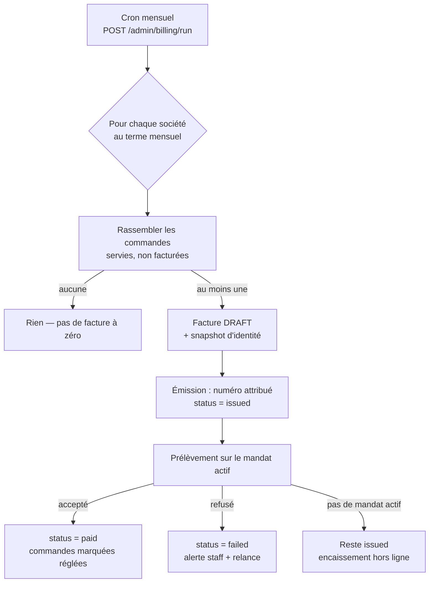

# Facturation mensuelle — la boucle qui manque

**État : 📐 doc-first.** Rien de ce document n'est codé. Décidé le 2026-08-12.

> **Le trou, en une phrase.** Une commande passée sur terme différé est écrite
> `payment_status = not_required`, avec en commentaire « facturée hors ligne ».
> Il n'existe **aucune facture, aucune échéance, aucun prélèvement** : le mandat
> SEPA est enregistré chez Stripe et n'est **jamais débité**. Accorder le mensuel
> aujourd'hui, c'est laisser partir des commandes dont l'application ne garde
> aucune trace de ce qui est dû.

> ⚠️ **Le trou s'est élargi le 2026-08-15.** Le back-office peut désormais
> porter une commande **au compte** en un clic
> ([`architecture-commande-saisie-par-l-equipe.md`](architecture-commande-saisie-par-l-equipe.md)),
> et son écran de confirmation annonce « facturée sur la période en cours ».
> Cette période n'existe toujours pas. La surface est murée — le compte est
> refusé sans crédit accordé — mais elle rend le manque décrit ici plus facile à
> alimenter, donc plus urgent à combler.

---

## 1. Les décisions déjà prises

| Décision                                          | Ce qu'elle implique                                                                                             |
| ------------------------------------------------- | --------------------------------------------------------------------------------------------------------------- |
| **La facture reste chez nous** (in-app)           | Stripe **encaisse**, il n'émet rien. Numérotation, mentions, TVA et PDF sont à nous.                            |
| **Un seul terme : `monthly`**                     | 60 et 90 jours dégagent. Payer à la commande n'est pas un terme, c'est l'absence de crédit — il reste le socle. |
| **KBIS certifié = porte d'activation**            | Livré (cf. `e063fe9`). L'identité qui figure sur une facture a été confrontée à un document officiel.           |
| **Crédit accordé ⇒ KBIS certifié + mandat actif** | Le mensuel ne s'accorde pas sans de quoi identifier ET de quoi encaisser. Voir §4.                              |

**Pourquoi in-app.** La TVA est déjà résolue par produit à la commande
(5,5 % alimentaire, 20 % livraison) et `orders.vat_cents` la porte. Une facture
est un document légal : sa forme, sa numérotation et sa conservation ne doivent
pas dépendre du modèle de facturation d'un prestataire, ni changer le jour où il
fait évoluer le sien. Le coût est un pourcentage en moins, et surtout un
document dont on répond.

---

## 2. Ce qui existe déjà, et qu'il ne faut pas réécrire

- `orders` : `total_cents` **TTC**, `vat_cents`, `subtotal_cents`, `order_number`
  (référence humaine unique), `company_id` **nullable** (commande zéro friction).
- `payment_status` : `pending | paid | failed | refunded | not_required`. Les
  termes différés tombent en `not_required` — c'est ce statut que la boucle va
  cesser de laisser en cul-de-sac.
- `payment_mandates` : mandat SEPA Stripe (customer, payment method, RUM, IBAN
  masqué), **un seul actif par société** (index partiel), révocation datée.
- `MandateGateway` : `registerMandate` / `revokeMandate`. **Aucune méthode de
  débit** — c'est le premier manque côté port.
- Porte machine-à-machine déjà en place : `POST /admin/recompute`, gardée par
  `RECOMPUTE_TOKEN` et déclenchée par un Cron Trigger Cloudflare. Le cycle
  mensuel réutilise **ce patron**, pas un nouveau mécanisme.

---

## 3. Le modèle

### 3.1 La facture est un agrégat, pas une vue

Une facture n'est pas un résumé recalculable des commandes : c'est un **document
figé**. Le jour où un prix change, où une commande est annulée, où une société
est renommée, la facture émise ne doit pas bouger d'un centime. Elle **copie**
donc ce qu'elle facture, elle ne le référence pas seulement.

```
Invoice
  id, number            ← numérotation SÉQUENTIELLE, sans trou (cf. 3.2)
  company_id            ← le mur ; jamais nullable ici (pas de facture sans société)
  period_start/end      ← la fenêtre facturée
  status                ← draft | issued | paid | failed | cancelled
  issued_at, due_at
  subtotal_cents, vat_cents, total_cents
  billing_snapshot      ← raison sociale, SIRET, TVA, adresse de facturation, FIGÉS
  lines[]               ← une ligne PAR COMMANDE : numéro, date, HT, TVA, TTC
  order_ids[]           ← ce qui a été consommé, pour l'idempotence
```

**`billing_snapshot` n'est pas de la dénormalisation paresseuse** : c'est
l'exigence légale. Une facture porte l'identité du client **au jour de
l'émission**. La résoudre à la lecture ferait changer une facture de 2026 le jour
d'un changement d'adresse — même raisonnement que la trace de certification du
KBIS.

### 3.2 La numérotation

Séquentielle, continue, sans trou, par année : `FA-2026-000123`. Un trou dans une
séquence de facturation est un problème comptable, pas cosmétique. Conséquences :

- le numéro est attribué **à l'émission** (`issued`), jamais à la création du
  brouillon — un brouillon abandonné ne doit pas consommer de numéro ;
- l'attribution passe par une **séquence Postgres** ou un `SELECT … FOR UPDATE`
  sur un compteur, dans la **même transaction** que le passage à `issued` ;
- une facture émise ne se supprime pas. Elle s'**annule** (`cancelled`) et, si
  besoin, se compense par un avoir. À trancher : les avoirs sont **hors périmètre
  de la première tranche** (voir §6).

### 3.3 Ce qui entre dans une facture

Les commandes de la société, sur la période, en `payment_status = not_required`
(donc portées au compte) et **livrées ou retirées** — on facture ce qui a été
servi, pas ce qui a été commandé. Une commande annulée n'entre jamais.

Le rattachement se fait par `order.company_id`. Les commandes zéro friction
(`company_id = null`) ne sont **pas** facturables tant qu'elles n'ont pas été
rapatriées — c'est le TODO déjà ouvert côté flux de commande, et il devient
bloquant ici.

---

## 4. Le cycle



**Chaque étape est idempotente et rejouable.** Un cron qui tourne deux fois ne
doit pas produire deux factures ni deux prélèvements :

- une commande déjà portée sur une facture n'est jamais reprise (`order_ids`
  consommés, contrainte d'unicité côté ligne) ;
- le prélèvement porte une **clé d'idempotence** dérivée de l'`invoice.id`,
  passée à Stripe. C'est la seule protection réelle contre le double débit ;
- l'émission et l'attribution du numéro sont dans la même transaction.

**Émettre avant d'encaisser, jamais l'inverse.** Si le débit précédait la
facture, un échec applicatif entre les deux laisserait de l'argent prélevé sans
document en face. Dans l'ordre retenu, le pire cas est une facture émise non
encaissée — un état visible, réparable, et qui correspond à la réalité comptable.

---

## 5. Le risque à connaître : SEPA Core, 8 semaines

Stripe fait du **SEPA Core**, pas du SEPA B2B. Un client professionnel peut donc
réclamer le remboursement d'un prélèvement **sous 8 semaines, sans motif**, et
jusqu'à 13 mois si le prélèvement était non autorisé.

Ce n'est pas un détail d'implémentation, c'est une exposition de trésorerie sur
des encours mensuels. Conséquences pour le modèle :

- le webhook Stripe doit traiter le **rejet tardif** (`charge.dispute.created` /
  échec de débit) et faire repasser la facture en `failed` — une facture `paid`
  peut redevenir impayée des semaines plus tard, le modèle doit l'admettre ;
- le plafond d'encours par société (§6) n'est pas un luxe.

---

## 6. Hors périmètre de la première tranche (assumé, et écrit)

- **Avoirs et notes de crédit.** Une facture fausse s'annule et se refait.
- **Relance automatique** en cas d'échec : le staff est alerté, il rappelle.
- **Plafond d'encours** par société : souhaitable, pas bloquant pour démarrer.
- **Export comptable** (FEC, journal de ventes).
- **Rapatriement des commandes zéro friction** — pré-requis, mais tranche à part.

---

## 7. Les tranches

| #   | Tranche                        | Contenu                                                                                                                    | Preuve attendue                                                                    |
| --- | ------------------------------ | -------------------------------------------------------------------------------------------------------------------------- | ---------------------------------------------------------------------------------- |
| 1   | ✅ **Réduire les termes**      | `deferredTermSchema` → `["monthly"]`, enum Postgres recréé, sociétés en net60/net90 basculées au mensuel, écrans nettoyés. | Une société ne peut plus se voir accorder que le mensuel (e2e : `net60` → 400).    |
| 2   | **L'agrégat facture**          | Domaine pur : période, lignes, snapshot, totaux, transitions d'état. Zéro Prisma, zéro Nest.                               | Une facture émise ne change plus quand la société change de nom.                   |
| 3   | **Persistance + numérotation** | Tables `invoices` / `invoice_lines`, séquence, index d'unicité sur la commande facturée.                                   | Deux émissions concurrentes ⇒ deux numéros distincts, sans trou (test e2e).        |
| 4   | **Le cycle**                   | `POST /admin/billing/run` (même garde que `recompute`) + Cron Trigger. Rassemble, émet.                                    | Le cron rejoué deux fois produit UNE facture (test e2e).                           |
| 5   | **Le prélèvement**             | `MandateGateway.charge(...)` + clé d'idempotence + webhook (payé / échoué / rejeté tardivement).                           | Un rejeu du webhook ne double aucun encaissement.                                  |
| 6   | **Le PDF et sa conservation**  | Rendu de la facture, dépôt dans le stockage objet (le vrai flux existe déjà, cf. MinIO en dev), lecture murée.             | La facture téléchargée par le client est l'octet-pour-octet celle qui a été émise. |
| 7   | **Les écrans**                 | Admin : file des factures, état, relance manuelle. Client : « Mes factures », téléchargement.                              | Parcours Playwright de bout en bout.                                               |
| 8   | **La porte du crédit**         | Accorder `monthly` exige KBIS certifié + mandat actif ; retirer le mandat alerte sur l'encours.                            | L'octroi est refusé (409) sans mandat actif.                                       |

La tranche 1 est indépendante et peut partir tout de suite. Les tranches 2 → 5
forment le cœur et se suivent. La 8 peut passer avant la 6 si l'on veut fermer la
porte avant d'ouvrir le robinet.

---

## 8. Ce que cette note ne tranche pas

- **La date de facturation** : fin de mois calendaire pour tout le monde, ou date
  d'anniversaire par société ? La première est plus simple et suffit tant qu'il
  n'y a pas de raison métier de faire autrement.
- **Le délai de paiement** (`due_at`) : prélèvement immédiat à l'émission, ou à
  J+X ? Le prélèvement immédiat est le plus simple ; un délai est un crédit
  supplémentaire, à décider comme tel.
- **Le seuil de facturation** : facture-t-on une période à 12 € ? Les frais fixes
  d'un prélèvement rendent les très petits montants absurdes.
