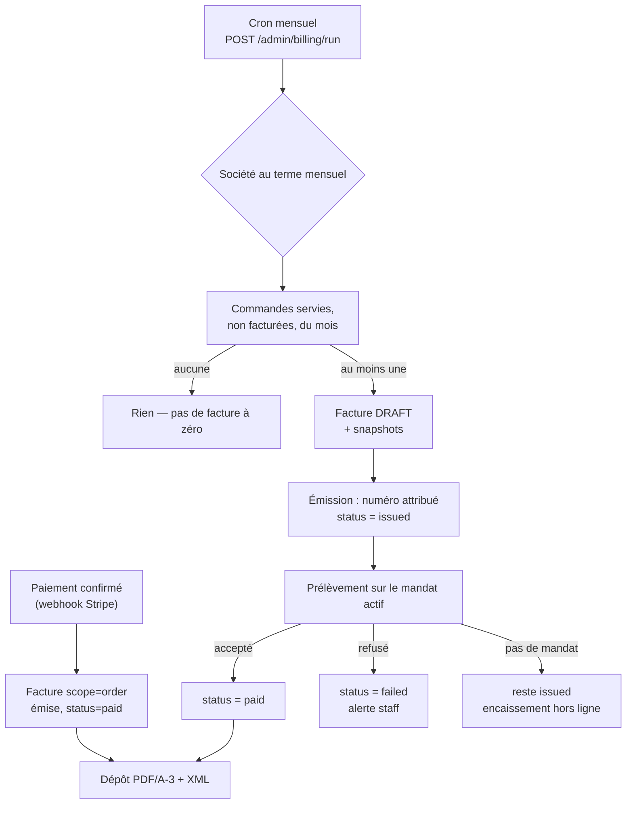

# Facturation — le document qui manque

**État : 📐 doc-first.** Rien de ce document n'est codé. Première version le
2026-08-12 (« facturation mensuelle »), **élargie et réorientée le 2026-08-15**.

> **Le trou, en une phrase.** LFC vend, encaisse, livre — et n'émet **aucune
> facture**. Ni pour les commandes réglées par carte au checkout (qui tombent en
> `paid` et s'arrêtent là), ni pour celles portées au compte (`not_required`,
> avec en commentaire « facturée hors ligne »). Le mandat SEPA est enregistré
> chez Stripe et n'est **jamais débité**.

## Ce que la révision du 2026-08-15 change

La note du 12 août ne traitait que la **boucle mensuelle**. Deux décisions
l'élargissent :

1. **Une facture pour toute vente**, pas seulement pour le terme différé. Une
   vente B2B appelle une facture ; celles payées par carte n'en avaient aucune,
   et ce trou-là est plus large que celui du mensuel.
2. **Factur-X dès le départ.** Le document cible n'est pas un PDF, c'est un
   **PDF/A-3 porteur d'un XML structuré**. Concevoir un PDF maison en 2026 puis
   le refaire pour la réforme reviendrait à écrire deux fois le même document —
   et la seconde fois sous contrainte de date.

> ⚠️ **Le calendrier réglementaire est à confirmer avec le comptable.** À la
> connaissance de cette note, la réforme française impose la **réception** de
> factures électroniques à toutes les entreprises au **1ᵉʳ septembre 2026**, et
> l'**émission** au 1ᵉʳ septembre 2026 pour les grandes entreprises et ETI, au
> **1ᵉʳ septembre 2027** pour les PME et TPE — via une **PDP** (plateforme de
> dématérialisation partenaire), en format structuré (Factur-X, CII, UBL). LFC
> relève a priori de l'échéance 2027 pour l'émission. **Cette note ne fait pas
> autorité** : elle en tire une contrainte de conception, pas une date de
> livraison.

---

## 1. Les décisions

| Décision                                          | Ce qu'elle implique                                                                                                      |
| ------------------------------------------------- | ------------------------------------------------------------------------------------------------------------------------ |
| **Une facture par vente**                         | Deux régimes (§3), un seul agrégat, une seule numérotation.                                                              |
| **La facture reste chez nous** (in-app)           | Stripe **encaisse**, il n'émet rien. Numérotation, mentions, TVA, document et conservation sont à nous.                  |
| **Factur-X (PDF/A-3 + XML CII)** dès le départ    | La **donnée structurée fait foi**, le PDF n'en est qu'un rendu. Impose des champs obligatoires aujourd'hui absents (§4). |
| **Un seul terme différé : `monthly`**             | Payer à la commande n'est pas un terme, c'est l'absence de crédit — il reste le socle.                                   |
| **Crédit accordé ⇒ KBIS certifié + mandat actif** | Le mensuel ne s'accorde pas sans de quoi identifier ET de quoi encaisser.                                                |

**Pourquoi in-app.** La TVA est déjà résolue par produit à la commande (5,5 %
alimentaire, 20 % livraison) et `orders.vat_cents` la porte. Une facture est un
document légal : sa forme, sa numérotation et sa conservation ne doivent pas
dépendre du modèle de facturation d'un prestataire, ni changer le jour où il fait
évoluer le sien.

**Pourquoi la donnée d'abord.** En Factur-X, le XML est la facture ; le PDF en est
la représentation lisible. C'est aussi le bon sens applicatif : un agrégat complet
peut produire un PDF, un e-mail, un export comptable et un flux PDP, alors qu'un
PDF ne peut rien produire du tout.

---

## 2. Ce qui existe déjà, et qu'il ne faut pas réécrire

- `orders` : `total_cents` **TTC**, `vat_cents`, `subtotal_cents`, `order_number`
  (référence humaine unique), `company_id` **nullable** (commande zéro friction).
- `payment_status` : `pending | paid | failed | refunded | not_required`.
- `payment_mandates` : mandat SEPA Stripe, **un seul actif par société**,
  révocation datée. `MandateGateway` sait enregistrer et révoquer — **pas
  débiter** : c'est le premier manque côté port.
- `companies` : `siret`, `tva_intracom` (défaut `""` — donc **souvent vide**,
  cf. §4.3), adresse de facturation, raison sociale, enseigne.
- Porte machine-à-machine : `POST /admin/recompute`, gardée par `RECOMPUTE_TOKEN`
  et déclenchée par un Cron Trigger Cloudflare. Le cycle réutilise **ce patron**.

---

## 3. Les deux régimes, un seul agrégat

| Régime                          | Quand la facture est émise                        | Ce qu'elle porte                           | État à l'émission          |
| ------------------------------- | ------------------------------------------------- | ------------------------------------------ | -------------------------- |
| **À la commande** (carte, lien) | À l'**encaissement confirmé** (webhook Stripe)    | Une commande                               | `paid` — déjà réglée       |
| **Au compte** (`monthly`)       | Au **début du mois suivant**, pour le mois écoulé | Toutes les commandes servies de la période | `issued`, puis prélèvement |

**Un seul agrégat, deux portées.** `Invoice.scope = order | period`. Ce n'est pas
un type discriminé avec deux comportements : c'est le même document, la même
numérotation, les mêmes mentions et le même rendu — seule change la façon dont on
rassemble ce qu'il facture. (Le raisonnement est celui d'`origin` sur les
commandes, cf.
[`architecture-commande-saisie-par-l-equipe.md`](architecture-commande-saisie-par-l-equipe.md).)

**La facture périodique est un droit, pas un raccourci.** Le regroupement de
plusieurs livraisons d'un même mois pour un même client sur une facture
récapitulative est admis en France, à condition qu'elle soit émise **dans le mois
de la livraison** et que chaque opération y reste identifiable. D'où : une ligne
par commande, avec sa date et son numéro.

**Ce qui n'est jamais facturé** : une commande annulée, et une commande **zéro
friction** (`company_id = null`) tant qu'elle n'a pas été rapatriée sur un
compte — le TODO ouvert côté flux de commande devient bloquant ici.

---

## 4. Le modèle

### 4.1 La facture est un agrégat figé

Une facture n'est pas un résumé recalculable des commandes : c'est un **document
figé**. Le jour où un prix change, où une société est renommée, la facture émise
ne bouge pas d'un centime. Elle **copie** ce qu'elle facture.

```
Invoice
  id, number              ← séquentiel, sans trou, attribué à l'ÉMISSION
  scope                   ← order | period
  company_id              ← le mur ; jamais nullable
  period_start/end        ← la fenêtre facturée (= la date de commande, en scope=order)
  status                  ← draft | issued | paid | failed | cancelled
  issued_at, due_at, delivered_on
  document_type_code      ← 380 (facture) | 381 (avoir)
  currency                ← EUR
  seller_snapshot         ← identité LFC au jour de l'émission (§4.3)
  buyer_snapshot          ← identité client FIGÉE : raison sociale, SIRET, TVA, adresse
  payment_terms_text      ← mentions légales figées (§4.3)
  lines[]                 ← par commande : numéro, date, HT, taux, TVA, TTC
  vat_breakdown[]         ← par TAUX : base HT, montant TVA
  subtotal_cents, vat_cents, total_cents
  paid_cents, paid_at     ← ce qui a été encaissé, et quand
  order_ids[]             ← ce qui a été consommé (idempotence + unicité)
```

`buyer_snapshot` n'est pas de la dénormalisation paresseuse : une facture porte
l'identité du client **au jour de l'émission**. La résoudre à la lecture ferait
changer une facture de 2026 le jour d'un déménagement.

`vat_breakdown` **par taux** est une exigence de la norme autant que du droit :
deux taux cohabitent déjà chez LFC (5,5 % marchandise, 20 % livraison). La somme
des bases doit égaler le HT, et la somme des TVA le total de TVA — c'est un
**invariant de l'agrégat**, pas un contrôle d'écran.

### 4.2 La numérotation

Séquentielle, continue, sans trou, par année : `FA-2026-000123`. **Une seule
séquence pour les deux régimes** — un numéro par régime ferait deux séquences,
donc deux trous à justifier.

- le numéro est attribué **à l'émission**, jamais à la création du brouillon ;
- l'attribution passe par une séquence Postgres (ou un compteur verrouillé) dans
  la **même transaction** que le passage à `issued` ;
- une facture émise ne se supprime pas : elle s'annule, et se compense par un
  **avoir** (`document_type_code = 381`), qui porte son propre numéro dans la
  même séquence.

### 4.3 Ce qui manque en base aujourd'hui

Factur-X ne se contente pas de ce qu'on a. À combler avant la première émission :

| Manque                                 | Où                          | Pourquoi c'est bloquant                                           |
| -------------------------------------- | --------------------------- | ----------------------------------------------------------------- |
| **Identité du vendeur** (LFC)          | nulle part                  | Raison sociale, SIRET, TVA intracom, adresse, RCS, capital, IBAN. |
| `tva_intracom` **vide** chez le client | `companies` (défaut `""`)   | Obligatoire en B2B dès que le client est assujetti.               |
| Date de **livraison effective**        | `orders` (on a la demandée) | La norme veut la date de l'opération, pas celle du souhait.       |
| Mentions de **retard**                 | nulle part                  | Pénalités + indemnité forfaitaire de recouvrement (40 €).         |
| Code **unité** des lignes              | catalogue                   | La norme code l'unité (`H87` = pièce, `KGM` = kg…).               |

La colonne `tva_intracom` par défaut vide est le piège le plus discret : elle
laisse aujourd'hui créer une société sans numéro de TVA, et une facture sans
numéro de TVA client est irrégulière. Ce n'est **pas** au moteur de facturation
de l'inventer — c'est à l'activation de l'exiger, ou à la facture de refuser de
s'émettre.

### 4.4 Le rendu et la conservation

- **Le XML fait foi**, le PDF est son rendu. Profil visé : **BASIC** ou
  **EN 16931**, à trancher avec le comptable (BASIC suffit à une facture de
  marchandises simple ; EN 16931 est plus riche et plus contraignant).
- PDF/A-3 avec le XML **embarqué** ; conservation **10 ans**, immuable, dans le
  stockage objet (le flux existe déjà — cf. le KBIS).
- **La PDP est un port, pas une dépendance** : `EInvoiceTransport.send(invoice)`
  et un flux de statuts entrants. Tant qu'aucune PDP n'est choisie, l'adaptateur
  est un dépôt local + e-mail — et le jour venu, on branche sans toucher au
  domaine. C'est la raison même de sortir la donnée structurée d'abord.

---

## 5. Le cycle



**Chaque étape est idempotente et rejouable.** Un cron qui tourne deux fois ne
produit ni deux factures ni deux prélèvements :

- une commande déjà portée sur une facture n'est jamais reprise (unicité sur la
  commande facturée, en base) ;
- le prélèvement porte une **clé d'idempotence** dérivée de l'`invoice.id`, seule
  protection réelle contre le double débit ;
- l'émission et l'attribution du numéro sont dans la même transaction.

**Émettre avant d'encaisser, jamais l'inverse.** Si le débit précédait la
facture, un échec entre les deux laisserait de l'argent prélevé sans document en
face. Dans l'ordre retenu, le pire cas est une facture émise non encaissée — un
état visible, réparable, et conforme à la réalité comptable.

---

## 6. Le risque à connaître : SEPA Core, 8 semaines

Stripe fait du **SEPA Core**, pas du SEPA B2B. Un client professionnel peut donc
réclamer le remboursement d'un prélèvement **sous 8 semaines, sans motif**, et
jusqu'à 13 mois s'il n'était pas autorisé. Conséquences :

- une facture `paid` peut redevenir impayée des semaines plus tard : le modèle
  doit l'admettre (webhook de rejet tardif → `failed`) ;
- le plafond d'encours par société n'est pas un luxe.

---

## 7. Hors périmètre de la première tranche (assumé, et écrit)

- **Relance automatique** en cas d'échec : le staff est alerté, il rappelle.
- **Plafond d'encours** par société.
- **Export comptable** (FEC, journal de ventes).
- **Rapatriement des commandes zéro friction** — pré-requis, tranche à part.
- **Raccordement PDP** : le port existe dès la tranche 4, l'adaptateur attend le
  choix du prestataire.

Les **avoirs**, eux, entrent au périmètre : la norme les code (381), et une
facture fausse ne se corrige pas autrement.

---

## 8. Les tranches

| #   | Tranche                         | Contenu                                                                                                       | Preuve attendue                                                       |
| --- | ------------------------------- | ------------------------------------------------------------------------------------------------------------- | --------------------------------------------------------------------- |
| 0   | **Les données manquantes**      | Identité vendeur (réglages), `tva_intracom` exigé à l'activation, date de livraison effective, unité au SKU.  | Une société sans TVA intracom ne peut pas passer au terme mensuel.    |
| 1   | ✅ **Réduire les termes**       | `deferredTermSchema` → `["monthly"]`, sociétés basculées, écrans nettoyés.                                    | Une société ne peut plus se voir accorder que le mensuel.             |
| 2   | **L'agrégat facture**           | Domaine pur : portée, lignes, ventilation TVA, snapshots, totaux, transitions, avoir. Zéro Prisma, zéro Nest. | La ventilation TVA somme au total ; une facture émise ne change plus. |
| 3   | **Persistance + numérotation**  | Tables `invoices` / `invoice_lines` / `invoice_vat_lines`, séquence, unicité sur la commande facturée.        | Deux émissions concurrentes ⇒ deux numéros distincts, sans trou.      |
| 4   | **Le rendu Factur-X**           | XML CII depuis l'agrégat + PDF/A-3 embarquant le XML + dépôt objet. Port `EInvoiceTransport`.                 | Le XML produit valide contre le schéma du profil retenu.              |
| 5   | **Le régime « à la commande »** | Émission à l'encaissement confirmé, branchée sur le webhook existant.                                         | Un rejeu du webhook n'émet pas deux factures.                         |
| 6   | **Le cycle mensuel**            | `POST /admin/billing/run` (garde de `recompute`) + Cron Trigger.                                              | Le cron rejoué deux fois produit UNE facture.                         |
| 7   | **Le prélèvement**              | `MandateGateway.charge(...)` + idempotence + webhook (payé / échoué / rejeté tardivement).                    | Un rejeu du webhook ne double aucun encaissement.                     |
| 8   | **Les écrans**                  | Admin : onglet **Facturation** sur la fiche (factures, encours, état). Client : « Mes factures ».             | Parcours Playwright de bout en bout.                                  |
| 9   | **La porte du crédit**          | Accorder `monthly` exige KBIS certifié + mandat actif ; retirer le mandat alerte sur l'encours.               | L'octroi est refusé (409) sans mandat actif.                          |

La **tranche 0 est nouvelle et bloquante** : sans identité vendeur ni TVA client,
aucune facture régulière ne peut sortir, et l'agrégat de la tranche 2 se
concevrait autour de champs qu'on n'a pas.

L'**onglet Facturation de la fiche client** (tranche 8) est ce qui a déclenché
cette révision. Il ne sera pas construit avant : un onglet qui n'aurait à montrer
ni facture ni encours réel ne serait qu'un écran d'attente.

---

## 9. Ce que cette note ne tranche pas

- **Le profil Factur-X** : BASIC ou EN 16931 — à voir avec le comptable.
- **Le délai de paiement** (`due_at`) : prélèvement immédiat à l'émission, ou à
  J+X ? Le prélèvement immédiat est le plus simple ; un délai est un crédit
  supplémentaire, à décider comme tel.
- **Le seuil de facturation** : facture-t-on une période à 12 € ? Les frais fixes
  d'un prélèvement rendent les très petits montants absurdes — mais on ne peut
  pas _ne pas_ facturer une vente : le seuil ne peut porter que sur le
  **prélèvement**, pas sur l'émission.
- **La date de facturation périodique** : fin de mois calendaire pour tout le
  monde, ou date d'anniversaire par société ? La première est plus simple et
  suffit tant qu'aucune raison métier n'impose l'autre.
