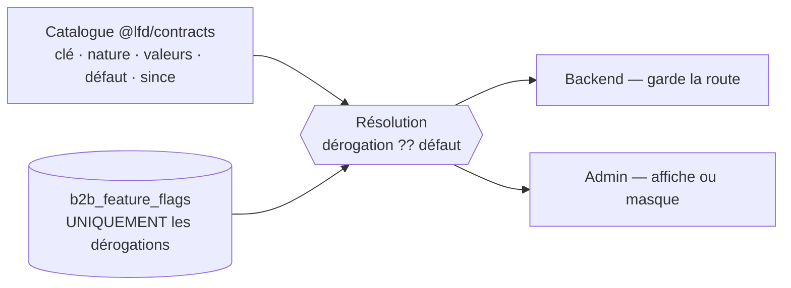
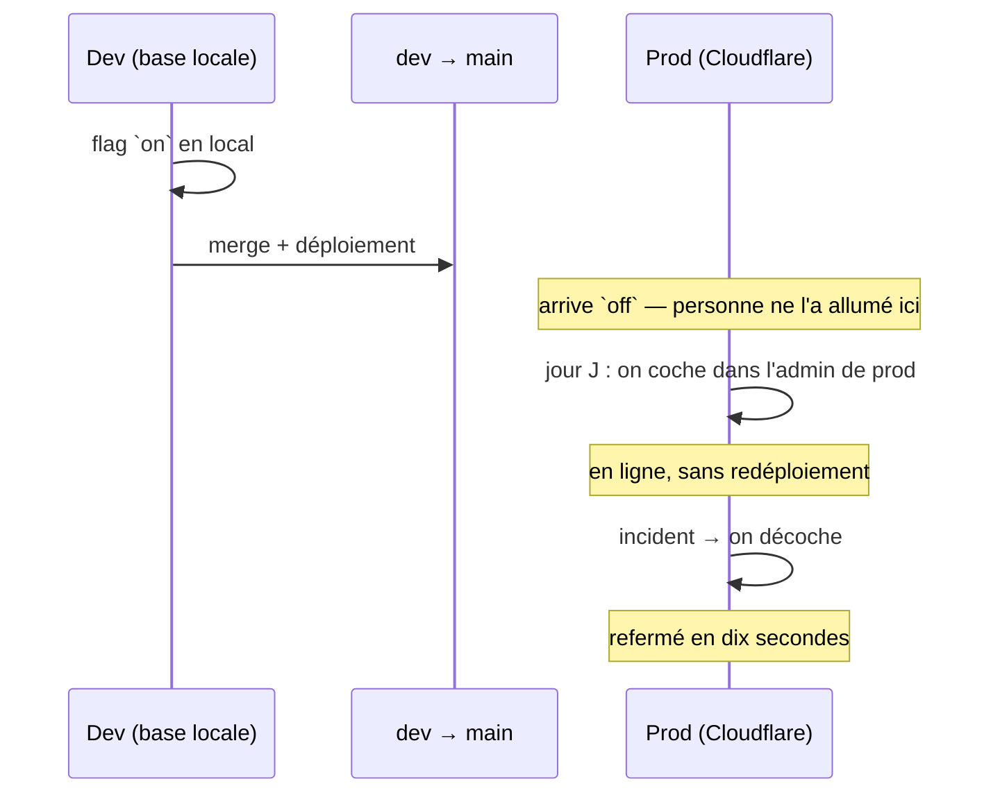

# Feature flags — design

> **Couper ou versionner l'accès à une fonctionnalité sans redéployer.** Une page
> **Tech → Feature flags** dans l'admin, des cases à cocher, et une valeur qui
> vaut **par environnement** parce qu'elle vit en base.
>
> Le fil conducteur : le **catalogue** est dans le code, la base ne porte que les
> **écarts**. Un flag est une décision **datée**, pas un réglage permanent — et
> ce qui est permanent n'est pas un flag, c'est de l'autorisation.
>
> Décidé le **2026-08-12**. Prérequis lu :
> [`architecture-activation-configuration-b2b.md`](architecture-activation-configuration-b2b.md)
> — la config plateforme, dont ce système reprend la forme (une config globale,
> un module backend, une page de réglage staff) mais **pas** la sémantique : là
> ce sont des exigences métier durables, ici des interrupteurs temporaires.
>
> **Statut : 📐 doc-first — rien n'est codé.** Seul le déplacement de « Réglages »
> au pied du menu (pour faire de la place à « Tech ») est livré.

---

## 0. Le problème

Trois besoins qu'aucun mécanisme actuel ne couvre :

1. **Livrer du code avant de l'ouvrir.** Un écran admin se construit sur
   plusieurs jours. Aujourd'hui, soit il est dans `dev` et visible de tous, soit
   il vit sur une branche qui diverge. Il manque le troisième chemin : **fusionné,
   déployé, éteint**.
2. **Refermer en dix secondes.** Une fonctionnalité qui se comporte mal en prod
   n'a aujourd'hui qu'un remède : redéployer la version précédente. Pour un écran
   interne c'est disproportionné ; pour une intégration tierce (Shopify, Stripe)
   c'est trop lent.
3. **Versionner.** « v1 ou v2 de l'écran commandes » n'est pas un booléen, et le
   modéliser comme tel obligera à une migration le jour où la troisième arrive.

## 1. Ce qu'un flag **est**, et ce qu'il n'est pas

| C'est un flag                           | Ce n'en est pas un                                  |
| --------------------------------------- | --------------------------------------------------- |
| « L'onglet Croissance est-il ouvert ? » | « Ce client a-t-il droit aux paniers récurrents ? » |
| « Coupe l'export Shopify, il sature. »  | « La livraison existe-t-elle comme service ? »      |
| « Écran commandes : v1 ou v2. »         | « Le KBIS est-il exigé pour activer ? »             |
| Global, temporaire, technique           | Par société, durable, métier                        |

La colonne de droite a déjà ses maisons : les **exigences d'activation** sont dans
`b2b_platform_settings` (cf. le doc d'activation), les **droits par société** dans
le domaine (`account`, memberships, dérogations d'alertes). Les y laisser n'est pas
un détail de rangement : une case à cocher dans une page « Tech » n'a ni
traçabilité métier, ni portée par client, ni sens pour un commercial.

**Deux natures** de flag, et elles ne vivent pas la même vie :

- **`release`** — temporaire. Ouvre une fonctionnalité en préparation. **Se
  supprime** une fois la fonctionnalité stable, avec le chemin mort qui va avec.
- **`kill_switch`** — durable et assumé. Coupe une intégration qui peut mal
  tourner. Reste en place indéfiniment ; c'est son travail.

L'écran affiche la nature et la **date de naissance** du flag : un `release` de
trois mois est une dette qui doit se voir.

## 2. Catalogue dans le code, **écarts** en base



La table ne contient **pas** une ligne par flag : une ligne par flag **dont on a
changé la valeur**. Trois conséquences directes :

- **Ajouter un flag = éditer une union TypeScript.** Aucune migration, aucun
  seed, rien à synchroniser entre les bases.
- **Une base fraîche démarre juste.** Prod au premier jour, base de test, base
  d'un collègue : tout le monde part des défauts du code.
- **« Revenir au défaut » supprime la ligne**, il n'écrit pas la valeur par
  défaut. Écrire figerait une valeur qui ne suivrait plus le code le jour où on
  change le défaut — le piège classique du réglage qui se met à mentir.

Corollaire de discipline : une clé présente en base mais **absente du catalogue**
(flag supprimé du code) est **ignorée** et signalée à l'écran. Jamais interprétée,
jamais silencieuse.

## 3. La valeur vaut **par environnement**

Il n'y a pas de champ `environment`, et il ne faut pas en ajouter : dev tourne sur
`lfc_b2b_dev` (Postgres Docker) et la prod sur Prisma Postgres hébergé. **Deux
bases, donc deux valeurs, pour le même code.**

C'est précisément le cycle d'une release :



Ce qu'il faut avoir en tête : **il faudra aller cocher en prod**. Un flag allumé
en dev ne l'est nulle part ailleurs — c'est la propriété qu'on cherche, pas un
oubli.

## 4. Résolution, cache, et **direction du repli**

- **Front admin** : lu **une fois au chargement** de l'app, gardé en signal. Pas
  d'appel par composant, pas d'onglet qui scintille. Recharger la page suffit à
  prendre un changement — acceptable pour un outil interne où une seule personne
  bascule.
- **Backend** : lu par requête, avec un cache mémoire court (30 s). Pas de Redis :
  l'écrivain est unique et la fenêtre d'incohérence est sans conséquence.
- **Repli** : si la lecture échoue, on retombe sur **le défaut du code**, pas sur
  « éteint » par réflexe. La direction appartient au flag — un écran en
  préparation retombe éteint, un kill-switch retombe **allumé** (couper par
  accident est pire que le risque qu'on couvrait). Même raisonnement que le
  fail-open des alertes.

## 5. Le flag frontend **ne cache pas le code**

Masquer un onglet dans l'admin ne retire rien du bundle : le JavaScript est servi
au navigateur, flag ou pas, et qui ouvre les devtools voit l'écran inachevé.

Pour un écran staff en préparation, sans importance. Mais la règle générale est :

> **C'est la route API qu'on coupe, pas le bouton.** L'écran suit, il ne décide
> pas.

Une même clé sert donc deux fois — le backend la lit pour refuser (`403`), le
front la lit pour masquer. C'est le même principe que le `activationGate` : le
serveur tranche, l'écran formule.

## 6. Cycle de vie : un `release` **se supprime**

C'est la discipline qui décide si ce système vieillit bien ou devient un mur de
cases que personne n'ose toucher.

1. Flag créé `off` par défaut, avec sa date.
2. Développement derrière le flag, `on` en dev.
3. Déploiement ; `on` en prod le jour J.
4. Stable une semaine → **on retire le flag ET le chemin mort**, dans le même
   commit. La ligne de dérogation en base devient orpheline : l'écran la signale,
   on la supprime.

L'étape 4 est celle qu'on saute. L'écran la rend visible en affichant l'âge de
chaque `release`.

## 7. Modèle

**Contrat** (`@lfd/contracts`) — le catalogue, source de vérité :

```ts
featureFlagKeySchema; // union FERMÉE des clés
featureFlagKindSchema; // "release" | "kill_switch"
FEATURE_FLAGS; // clé → { label, description, kind, values, defaultValue, since }
FeatureFlagView; // { key, value, defaultValue, overridden, updatedAt, updatedBy }
```

La **valeur** est une chaîne d'une union fermée **par flag** (`values`), pas un
booléen : `["off","on"]` couvre le cas courant, `["off","v1","v2"]` le
versionnement, sans changer ni la table ni l'écran (l'UI rend une case à cocher
quand les valeurs sont exactement `off`/`on`, un sélecteur sinon).

**Prisma** — `b2b_feature_flags` : `key` (PK), `value`, `updatedAt`,
`updatedBySub/Name/Role` (trace figée, même patron que l'activation et la
certification KBIS).

**HTTP**, calqué sur `platform-settings` :

| Route                              | Qui   | Effet                                      |
| ---------------------------------- | ----- | ------------------------------------------ |
| `GET /admin/feature-flags`         | staff | catalogue + valeur effective + provenance  |
| `PATCH /admin/feature-flags/:key`  | staff | pose une dérogation (valeur validée)       |
| `DELETE /admin/feature-flags/:key` | staff | **supprime la dérogation** → retour défaut |

Le module exporte son repository, comme `PlatformSettingsModule`, pour que les
contextes qui gardent une route puissent le lire.

## 8. L'écran — Tech → Feature flags

**Tech** est une nouvelle entrée de menu (première section : Feature flags),
distincte de **Réglages** : l'une porte des interrupteurs techniques et
temporaires, l'autre des règles métier durables. Les mélanger ferait voisiner « le
KBIS est-il exigé ? » et « coupe l'export Shopify ».

Au passage, **Réglages descend au pied du menu**, au-dessus de Déconnexion : on
n'y va pas pour travailler, on y va pour régler quelque chose et repartir. Au
milieu des destinations de travail, il pesait autant que « Comptes clients », qu'on
ouvre vingt fois par jour.

Chaque ligne montre : le libellé et sa description, la **valeur effective**, si
elle vient du code ou d'une **dérogation** (et alors qui l'a posée, quand), la
nature, et l'âge pour un `release`.

## 9. Tranches

| #   | Contenu                                                                        | État |
| --- | ------------------------------------------------------------------------------ | ---- |
| 0   | Menu : Réglages au pied, place faite pour Tech                                 | ✅   |
| A   | Contrat : catalogue, natures, vue, charges                                     | 📐   |
| B   | Prisma `b2b_feature_flags` + migration                                         | 📐   |
| C   | Backend : module, résolution (défaut + dérogation), 3 routes staff, cache 30 s | 📐   |
| D   | Front : page Tech + onglet Feature flags + service lu au chargement            | 📐   |
| E   | **Un consommateur réel de bout en bout** — l'écran masqué ET sa route gardée   | 📐   |

La tranche **E** n'est pas cosmétique : sans elle on livre un tableau de cases qui
ne commandent rien, et on n'a prouvé aucune des deux moitiés de la chaîne.

## 10. Ouvert

- **Quel écran sert de premier cobaye (tranche E).** Proposition : l'onglet
  _Croissance_ du Commercial — il existe, il est isolé, et son API
  (`/admin/growth-stats`) est facile à garder. À trancher.
- **Portée par client** — hors périmètre, et volontairement. Le jour où le besoin
  est réel, c'est le modèle des dérogations d'alertes qu'on étend, pas cette
  table (cf. §1).
- **Client B2B et PIM comme consommateurs** — différés. La lecture devrait alors
  devenir publique et mise en cache, ce qui est une autre conversation.
