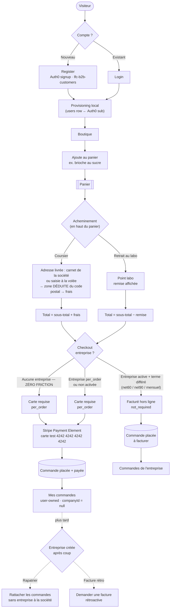

# Flux de commande B2B — « zéro friction » (register → 1re commande)

> Pivot **2026-08-06**. Le checkout n'est plus adossé à une entreprise : on peut
> commander (ex. une brioche au sucre) sans aucun paramétrage préalable. Détail du
> modèle + TODO rapatriement dans
> [`architecture-flux-commande-prod.md#commande-zéro-friction`](architecture-flux-commande-prod.md).

Tous les chemins possibles — premier achat sans entreprise (chemin court),
commande avec entreprise (terme négocié), et l'après-coup (rapatriement des
factures quand l'entreprise est créée plus tard).



## Légende du modèle

| Chemin             | Règle                                                                                                                                                                                              |
| ------------------ | -------------------------------------------------------------------------------------------------------------------------------------------------------------------------------------------------- |
| **Zéro friction**  | Register → panier → coursier/retrait → carte. Aucune entreprise requise, aucun gate d'activation. La commande appartient au client connecté (`Order.companyId = NULL`, mur = `placed_by_user_id`). |
| **Paiement carte** | Sans entreprise, ou entreprise en `per_order` / non activée → carte au checkout (Stripe, mode test). C'est le chemin de la brioche.                                                                |
| **Terme différé**  | Entreprise **active** avec un terme négocié (net60/90, mensuel) → pas de carte, facturé hors ligne (`payment_status = not_required`).                                                              |
| **Après-coup**     | Quand l'entreprise est créée plus tard, on relie l'historique personnel à la société et on émet les factures manquantes (TODO).                                                                    |

## Le panier s'ouvre sur la préférence, la zone se déduit

Deux règles complètent le pivot, posées le **2026-08-12** :

1. **Point de départ, pas contrainte.** Le panier s'ouvre sur la _préférence
   d'acheminement_ de la société sélectionnée (retrait à tel point, livraison à
   telle adresse — cf. `FulfillmentPreferenceView`). Le premier geste du client
   la supplante pour la durée du panier ; rien n'est réécrit côté serveur. Un
   pointeur `null` dans la préférence veut dire « la défaut **du moment** » : il
   se résout sur le carnet d'aujourd'hui, jamais sur celui du jour où la
   préférence a été posée.
2. **La zone n'est plus un choix.** Le client choisit une **adresse** — l'une de
   celles de sa société (compte **actif**), ou une adresse saisie à la volée — et
   le **code postal** décide du secteur (exact ou par préfixe, le plus long
   gagne). Le serveur applique la même règle à la passation via
   `DeliveryZoneRepository.resolveForPostalCode`, et `deliveryZoneId` a disparu
   de `placeOrderPayloadSchema`.

   Le motif est un trou refermé : tant que le client annonçait sa zone, il
   pouvait annoncer la moins chère avec une adresse ailleurs — le serveur
   re-résolvait bien le _frais_, mais depuis la zone _qu'on lui donnait_. Un
   secteur non couvert est désormais un **refus** (409
   `orders.delivery_zone.not_served`) et non une livraison à 0 € : c'est un
   secteur dont la tournée n'a pas de coût connu.

## Provisioning local JIT (prérequis auth)

L'authentification (`CustomerUserResolver`) relie le `sub` Auth0 à un `User`
**local** — la seule autorité d'autorisation. Avant le pivot, un `sub` valide
**sans `User`** local était refusé (`401 Compte inconnu`) : l'onboarding
self-signup n'ayant jamais été câblé, un inscrit ne pouvait ni voir `/me` ni
commander.

**Fix (2026-08-06) : provisioning JIT.** La **1re requête authentifiée** d'un
`sub` inconnu **crée** la personne automatiquement, compte `active`, sans société
(`CustomerUserResolver.provision`). Idempotent (une course retombe sur le
re-lookup). Un compte **existant mais non `active`** (invité par le staff,
désactivé) reste refusé — le provisioning ne crée que l'absent, il ne réactive
jamais.

Le **mur d'accès** reste : la **connexion Auth0** (seuls les clients
`lfc-b2b-customers` obtiennent un token) + la tenancy `company_id` sur ce qui est
muré. Ce n'est **pas** l'existence d'une ligne locale.

**E-mail stocké chez nous.** L'access token ne porte pas l'e-mail par défaut
(Auth0 strippe les claims non namespacés). Pour le capturer au provisioning,
ajouter une **Action Auth0** (flow _Login_, ou _Client Credentials_ si M2M) qui
pose un claim namespacé :

```js
exports.onExecutePostLogin = async (event, api) => {
  api.accessToken.setCustomClaim("https://lafoliedouce.eu/email", event.user.email);
};
```

Sans cette Action, on provisionne avec un e-mail **vide**, que le client peut
renseigner ensuite via son profil (`PATCH /me/profile`, qui le propage aussi à
Auth0).

## TODO — rapatriement (à la création d'une entreprise)

1. **Rapatrier les commandes sans entreprise** : rattacher les commandes
   personnelles (`company_id = NULL`, `placed_by_user_id = moi`) à la société.
2. **Facture rétroactive** : émettre une facture _a posteriori_ pour une commande
   personnelle déjà réglée par carte.
