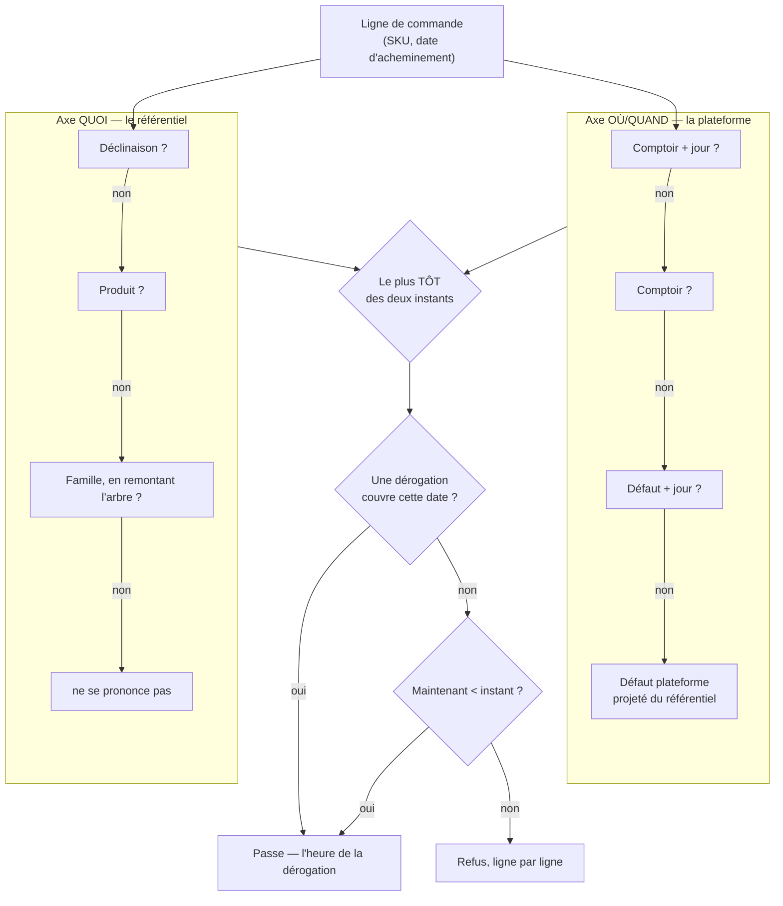

# L'heure limite de commande — globale, puis par famille, puis par produit

> Écrit le 2026-09-04. Décrit **ce qui existe** (section 1) et **ce qui est
> proposé** (sections 3 et suivantes). Rien de la proposition n'est codé.

## 1. Ce qui existe déjà — et qui n'est branché à rien

L'heure limite n'est pas à inventer. Elle est **modélisée, contractualisée,
testée et administrable** depuis le back-office :

| Pièce                                                         | État                                                        |
| ------------------------------------------------------------- | ----------------------------------------------------------- |
| `model OrderCutoff` (`schema.prisma:1068`, schéma `public`)   | table `order_cutoffs`                                       |
| `packages/contracts/src/order-cutoff.ts`                      | payload Zod, vue, et **deux fonctions pures** de résolution |
| `packages/contracts/src/__tests__/order-cutoff.spec.ts`       | 12 tests                                                    |
| `GET/POST/PATCH/DELETE /admin/order-cutoffs`                  | muré `@AdminSurface("b2b_settings")`                        |
| `reglages/retraits-livraisons/cutoffs-section/` (front admin) | l'écran de saisie                                           |

Une règle dit : « pour tel **point de retrait**, tel **jour d'acheminement**, il
faut avoir commandé `daysBefore` jours avant à telle **heure locale** ».
`resolveOrderCutoff` arbitre en quatre rangs — point+jour, point, défaut+jour,
défaut — et `orderCutoffInstant` en tire l'instant butoir.

### 🔴 Personne ne l'applique

`resolveOrderCutoff` et `orderCutoffInstant` **ne sont appelés nulle part** hors
de leur propre spec. Vérifié sur `apps/lfd-api/src`, `apps/lfd-api/test`,
`packages/*/src` et les deux fronts, hors client Prisma généré.

`PlaceOrderHandler` ne vérifie qu'une chose avant de passer commande :
l'appartenance à l'entreprise. Aucune garde temporelle, ni dans le handler, ni
dans `OrderDrafting`, ni sur le devis.

**Ce que ça change pour cette demande.** Le travail n'est pas « ajouter une heure
limite » : c'est **la brancher**, et profiter du branchement pour lui donner
l'axe qui lui manque. Un écran de réglages qui ne refuse rien est pire qu'une
absence de règle — quelqu'un le remplit et croit la limite tenue.

## 2. L'échelle demandée est déjà écrite ailleurs

`global → famille → produit` existe mot pour mot dans le dépôt, du côté des prix
(`packages/contracts/src/pricing.ts:83`) :

```ts
export const PRICE_SCOPE_LABELS: Readonly<Record<PriceScopeType, string>> = {
  global: "Tout le catalogue",
  category: "Famille",
  product: "Produit",
  variant: "Déclinaison",
};
```

**On réutilise `priceScopeSchema`, on n'invente pas un second vocabulaire de
portée.** Deux échelles nommées différemment pour la même idée finiraient par
diverger sur un cas limite, et le back-office montrerait « Famille » d'un côté et
« Catégorie » de l'autre pour la même chose.

Elle apporte un quatrième rang que la demande ne nommait pas et qui est le plus
utile : **la déclinaison**. C'est elle qu'on commande — une `OrderLine` porte un
SKU, et un SKU est une déclinaison. Un produit dont le pot de 200 g se prépare la
veille et le seau de 5 kg trois jours avant n'a pas d'heure limite « du produit ».

## 3. Deux axes, pas une seule échelle

C'est la décision structurante, et s'en tromper coûte cher.

|            | Axe **OÙ / QUAND** (existant)             | Axe **QUOI** (demandé)                      |
| ---------- | ----------------------------------------- | ------------------------------------------- |
| Dimensions | point de retrait × jour d'acheminement    | global → famille → produit → déclinaison    |
| Répond à   | « quand ferme la journée de ce comptoir » | « combien de préavis demande cet article »  |
| Nature     | contrainte **opérationnelle**             | contrainte **physique** (production, appro) |

Ces deux axes ne sont **pas** deux rangs d'une même échelle. Les fusionner en un
seul « le plus spécifique gagne » produit des égalités indécidables : une règle
_produit, tous les jours_ contre une règle _comptoir, le dimanche_ — laquelle est
la plus spécifique ? Il n'y a pas de réponse, et celle qu'on coderait par défaut
serait l'ordre de lecture.

**Donc : deux résolutions séparées, puis une composition.**



```
instant_ligne = min(  résoudre_QUOI(sku),  résoudre_OÙ_QUAND(point, jour)  )
```

Le **plus tôt des deux** gagne, parce que les deux sont des murs et qu'aucun ne
peut percer l'autre :

- une bouteille de `resale` a beau se commander tard, elle ne peut pas se
  commander **après la fermeture du comptoir** qui la remet ;
- un article qui demande 48 h de préavis ne les perd pas parce que le comptoir
  du jeudi ferme tard.

## 4. La résolution sur l'axe QUOI

**Sémantique de remplacement, pas de cumul.** Le rang le plus précis qui se
prononce **remplace** les autres, il ne s'y ajoute pas.

```
déclinaison ?? produit ?? famille la plus proche en remontant l'arbre ?? (rien)
```

**Le rang `global` n'est pas au bout de cette échelle**, et c'est une conséquence
de §5.2 : une fois déclaré dans le référentiel, il est projeté sur le rang 4 de
l'axe OÙ/QUAND — le défaut plateforme. Le compter deux fois n'aurait rien changé
au résultat (`min(x, x) = x`), mais aurait laissé croire à deux valeurs
distinctes, donc à deux endroits à corriger le jour où l'une paraît fausse.

Trois points, chacun pour une raison :

1. **`null` = « ne se prononce pas »**, et c'est distinct de « aucune limite ».
   La distinction n'est pas cosmétique : sans elle, on ne peut pas déclarer une
   famille entière libre sous un global contraignant.
2. **La remontée d'arbre est obligatoire.** `Category` porte `parentId`
   (auto-relation `CategoryTree`) : « Viennoiseries » peut hériter de
   « Boulangerie ». On prend **le plus proche ancêtre qui se prononce**, pas la
   racine.
3. **Le remplacement doit pouvoir RELÂCHER.** C'est le cas d'usage central : le
   `ProductKind` distingue déjà `daily`, `made_to_order` et `resale`, et une
   canette de `resale` se commande légitimement plus tard qu'une viennoiserie
   `daily`. Une règle « le plus contraignant gagne » sur cet axe interdirait
   exactement ce pour quoi on la pose. Le garde-fou n'est pas ici : c'est le
   `min` de la section 3 qui empêche de promettre l'impossible.

### Le défaut ne change rien à l'existant

Si aucune règle famille / produit / déclinaison n'est saisie, `résoudre_QUOI`
rend `null`, le `min` retombe sur le seul axe OÙ/QUAND, et le comportement est
**exactement** celui d'aujourd'hui — le défaut ayant simplement changé d'écran
de saisie, pas de valeur. C'est ce qui rend la bascule additive : personne ne
voit de différence tant que personne n'a rien rempli.

## 5. Où la règle est déclarée, où elle est appliquée

| Rang                                   | Déclaré dans                                    | Pourquoi                                                        |
| -------------------------------------- | ----------------------------------------------- | --------------------------------------------------------------- |
| **global** (le défaut du catalogue)    | **le PIM**, section générale                    | c'est une phrase sur ce qu'on vend, pas sur un comptoir         |
| famille, produit, déclinaison          | **le PIM**                                      | c'est un fait sur l'article : il suit la fiche, pas le commerce |
| point de retrait × jour d'acheminement | **le B2B** (il ne peut pas descendre, cf. §5.1) | c'est un fait sur l'exploitation                                |
| l'**application**                      | **le B2B**                                      | c'est une commande qu'on refuse, pas une fiche qu'on édite      |

Le référentiel **déclare**, la plateforme **applique**. C'est la frontière du
document racine, et elle est déjà celle du prix canonique (le PIM tarife, le B2B
altère et facture).

### 5.1 Pourquoi l'axe OÙ/QUAND ne peut pas descendre dans le référentiel

Une règle `OrderCutoff` est dimensionnée par `pickupAddressId` — une ligne de
`PickupAddress`, schéma `public` (`schema.prisma:1024`). Le référentiel a bien
une notion de lieu, `PointOfSale` (schéma `pim`, `:3124`), mais **ce n'est pas la
même table et rien ne les relie** : `PickupAddress` porte une adresse postale,
des heures d'ouverture et une remise de retrait ; `PointOfSale` porte un genre,
des contextes de vente, des tables à QR et ce qu'on y vend. Un grep de
`PointOfSale` dans `src/b2b` ne rend rien.

Déplacer l'axe entier demanderait donc l'un des deux gestes que le document
racine interdit : une clé étrangère `pim → public`, ou l'import du modèle Prisma
de l'autre contexte. **Seul le rang global descend** — c'est le seul qui ne nomme
aucun comptoir.

Ce n'est pas une consolation : c'est exactement ce qui a été demandé. Le défaut
est une phrase sur le catalogue (« chez nous, on commande la veille avant 18 h »),
les exceptions par comptoir sont une phrase sur l'exploitation.

### 5.2 Déplacer le défaut sans casser la résolution

Le rang 4 de `resolveOrderCutoff` — `pickupAddressId = null, weekday = null` —
**reste une ligne d'`order_cutoffs`**. Ce qui change n'est pas sa place, c'est
**qui l'écrit** : le push du référentiel, et plus le back-office.

Garder la ligne plutôt que la déplacer a une raison exacte : les quatre rangs et
leurs 12 tests ne bougent pas, et l'écran de réglages continue de montrer
laquelle s'appliquerait. Une seconde source pour le rang 4 aurait obligé à
réécrire la résolution — donc à la retester — pour un déménagement.

🔴 **Mais une ligne écrite par le push et modifiable à l'écran est un piège
silencieux** : le staff la corrige, le push suivant la réécrit, et personne ne
voit passer l'annulation. On n'écrit pas ça dans une consigne, on le rend
impossible :

- `OrderCutoff` gagne `source String @default("local")` — `local` | `referential` ;
- `@@unique([pickupAddressId, weekday])` garantit déjà **une seule** ligne
  défaut, donc le push l'`upsert` sans ambiguïté ;
- le repository **refuse** `update` et `remove` sur une ligne `referential` ;
- l'écran la rend en lecture seule, avec « déclaré dans le référentiel » et un
  lien vers l'écran PIM.

L'interdiction descend d'un cran à chaque ligne : c'est l'ordre voulu.

### 5.3 La bascule, en trois déploiements

Une valeur de production est en jeu — la ligne défaut existante — donc jamais de
suppression dans le même passage.

1. **Étendre** : `source` sur `OrderCutoff` (défaut `local`, toutes les lignes
   existantes restent `local`), le réglage global dans le PIM, l'écran de
   section générale. Rien ne lit encore le nouveau champ.
2. **Basculer** : recopier la valeur de la ligne défaut existante dans le
   réglage PIM, puis laisser le push l'`upsert` en la passant à `referential`.
   Le back-office bascule en lecture seule sur ce rang.
3. **Resserrer** : le back-office cesse d'offrir la **création** d'une ligne
   défaut. Les rangs point et point×jour, eux, restent pleinement éditables.

⚠️ La section générale du PIM **n'existe pas** : `pim.routes.ts` déclare
`catalogue`, `tva`, `regles-comptables`, `contextes`, `emplacements`,
`allergenes`… et aucune route de réglages généraux. C'est un écran à créer, pas
un champ à poser dans un existant.

### Ce qui doit traverser le fil

Le fil PIM → boutique passe par `packages/catalog-sync/src/snapshot.ts`
(`CATALOG_SNAPSHOT_VERSION = 5`). Il faut y ajouter, en **optionnel**, le préavis
résolu par le PIM pour chaque déclinaison :

```ts
// syncVariantSchema
orderLeadTime: z
  .object({ daysBefore: z.number().int().min(0).max(14), time: clockTimeSchema })
  .nullable(),
```

Deux exigences, et elles ne sont pas négociables :

- **Le PIM envoie la valeur RÉSOLUE**, pas les trois rangs. La plateforme n'a
  pas à connaître l'arbre des familles pour savoir quand un SKU ferme — c'est le
  même raisonnement qui a mis `vatRatePercent` sur `CatalogItem` plutôt que sur
  la famille (`schema.prisma:2036` : « c'est l'article qu'on vend, c'est lui qui
  doit savoir se facturer »).
- **Le champ est nullable et le schéma monte de version.** Un contrat déjà servi
  ne se casse pas : `version: 6`, le champ optionnel, et les lignes de
  `CatalogItem` d'avant le premier push complet portent `NULL` — c'est-à-dire
  « on ne sait pas », donc « l'axe QUOI ne se prononce pas ».

## 6. La dérogation

> **Lecture retenue** : « par appel » = un membre de l'équipe prend la commande
> **au téléphone** et accorde l'exception. Le dépôt la porte déjà — `Order`
> distingue `placedByUserId` (au nom de qui) et `placedByStaffId` (qui l'a
> saisie), et `orderOriginOf` en dérive l'origine `back_office`.

Une dérogation n'est **pas** une règle. Elle ne modifie rien dans le référentiel
ni dans les réglages : c'est une **autorisation de passer**, nommée, datée,
bornée et tracée.

```
DÉROGATION = { entreprise, date d'acheminement, nouvelle heure, motif, auteur, expiration }
```

Sept propriétés, chacune parce que son absence a un coût :

1. **Elle porte sa propre heure.** C'est la demande explicite : « exceptionnellement,
   jusqu'à 11 h ». Sans heure, elle serait un blanc-seing.
2. **Elle vise UNE date d'acheminement.** Pas « ce client est dispensé » — une
   dispense permanente est un réglage, et elle doit se voir comme tel.
3. **Elle ne s'applique qu'à une entreprise.** C'est le mur : une dérogation
   accordée par téléphone à un client ne peut pas ouvrir la porte aux autres.
4. **Elle peut percer les deux axes**, et c'est sa raison d'être. Elle est le
   seul mécanisme qui le peut.
5. **Elle porte un motif obligatoire.** Une exception sans raison écrite devient
   la règle en trois mois.
6. **Elle nomme son auteur** (`StaffUser.id`, pas une clé étrangère — même
   raisonnement que `placedByStaffId` : une pièce ne disparaît pas parce qu'on
   retire quelqu'un de l'annuaire).
7. **Elle expire.** Au plus tard à la date d'acheminement qu'elle vise : une
   dérogation qui traîne est une porte qu'on a oublié de refermer.

Elle est **consommée**, pas supprimée : `usedByOrderId` renseigné au passage.
« Pas de DELETE physique » vaut ici comme ailleurs, et une dérogation accordée
puis non utilisée est une information de gestion.

**Où elle vit** : côté B2B (schéma `public`). Elle parle d'une commande et d'un
client, pas d'un article — le référentiel n'a rien à en connaître.

**Qui peut l'accorder** : une ressource dédiée dans `ROLE_GRANTS`. Ni
`b2b_settings` (qui donne le droit d'éditer _la règle_, ce qui n'est pas le même
geste), ni un simple droit de saisie de commande.

## 7. Ce que la boutique en montre

Puisque c'est un élément de la boutique B2B, il ne suffit pas de refuser :

- **Sur la fiche et la vignette** : « Commandez avant 18 h pour jeudi ». C'est
  un argument de vente autant qu'une contrainte.
- **Au panier, ligne par ligne.** La résolution étant par SKU, le panier ferme
  quand **sa ligne la plus urgente** ferme. On n'annonce donc pas « trop tard »
  en bloc : on nomme les articles concernés et on laisse commander les autres.
  Un refus global sur un panier de vingt lignes fait perdre les dix-neuf qui
  passaient.
- **Au moment du choix de date.** Une date d'acheminement dont l'heure limite
  est passée se grise à la sélection, pas à la validation.

⚠️ Aujourd'hui la boutique lit `client/mock-shop.ts` et ne parle à aucune route
catalogue. Tant que le **lot 1** de
[`plan-boutique-sur-api.md`](plan-boutique-sur-api.md) n'est pas fait, il n'y a
rien pour porter cet affichage — l'application côté serveur, elle, ne l'attend
pas.

## 8. 🔴 Le piège du fuseau, à régler AVANT de brancher quoi que ce soit

`orderCutoffInstant` construit son instant avec le constructeur `Date` local :

```ts
return new Date(year, month - 1, day - rule.daysBefore, hours, minutes, 0, 0);
```

« Heure locale » signifie **heure locale du process**. Or :

- le `Dockerfile` de `lfd-api` ne pose **aucun `TZ`** (vérifié : il n'y déclare
  que `NODE_ENV`, `PORT` et `APP_REVISION`) ;
- `wrangler.jsonc` n'a **pas de bloc `vars`** ;
- l'image tourne donc en **UTC**, et `wrangler.jsonc:143` le dit déjà pour les
  crons : « ⚠️ Les crons Cloudflare sont en **UTC** ».

Une limite saisie à `18:00` devient donc **20 h à Paris en été, 19 h en hiver**.
Le décalage est dormant tant que rien n'applique la règle. Il devient une heure
de commandes acceptées à tort le jour où on la branche — et il **change avec la
saison**, ce qui est la pire façon de découvrir un bug.

Trois choses, dans cet ordre :

1. **Poser `ENV TZ=Europe/Paris`** dans le `Dockerfile`, et l'écrire.
2. **Ne pas s'en contenter.** Le calcul doit être explicite quant à son fuseau,
   parce qu'une variable d'environnement se perd en migrant d'image. La
   conversion se fait par `Intl.DateTimeFormat` avec `timeZone: "Europe/Paris"`,
   pas par le constructeur local.
3. **Un test qui échoue avant le correctif**, exécuté sous `TZ=UTC` — sinon il
   passe sur le poste d'Hugo et nulle part ailleurs.

⚠️ `lint:clock-port` ne couvre pas ce code : sa racine de scan est
`apps/lfd-api/src` (`dev-toolbox/gates/clock-port.mjs:36`), et
`orderCutoffInstant` vit dans `packages/contracts`. La porte n'a rien laissé
passer — elle ne regarde pas là.

## 9. Le modèle de données

**Additif, en trois déploiements, aucune colonne resserrée.**

### PIM (schéma `pim`)

Une table, pas des colonnes sur `Product` et `Category` : le rang `variant` en
demanderait une troisième, et un champ nul sur trois tables ne dit pas d'où vient
la valeur.

```prisma
model OrderLeadTime {
  id String @id

  /// `category` | `product` | `variant` — mêmes valeurs que `PriceScopeType`.
  scopeType String  @map("scope_type")
  scopeId   String  @map("scope_id")

  daysBefore Int    @map("days_before")
  /// `HH:MM` en heure d'Europe/Paris.
  time       String

  @@unique([scopeType, scopeId])
  @@map("order_lead_time")
  @@schema("pim")
}
```

Le rang **`global`** y est aussi, et c'est le déménagement de §5.2. Il ne prend
pas de `scopeId` : une portée « tout le catalogue » qui nomme quelque chose dit
deux choses contradictoires — le même refus, dans les deux sens, que
`priceScopeSchema`. Une ligne `scopeType = 'global'`, `scopeId = ''`, tenue par
l'unicité.

### B2B (schéma `public`)

- `CatalogItem` gagne `orderLeadDaysBefore Int?` et `orderLeadTime String?` —
  la valeur **résolue** reçue du fil, `NULL` = ne se prononce pas.
- Une table `order_cutoff_waiver` pour les dérogations de la section 6.
- `OrderCutoff` gagne **une seule** colonne, `source` (§5.2). Ses quatre rangs,
  sa contrainte d'unicité et ses 12 tests ne bougent pas.

### Migration

`Order.requestedDeliveryDate` est **nullable** (`schema.prisma`, `@db.Date`). Une
commande sans date demandée n'a aucun instant butoir à comparer : elle passe.
C'est le comportement à écrire explicitement, pas à laisser tomber d'un `if`.

## 10. Les lots

| #   | Lot                                                                                                               | Dépend de                               |
| --- | ----------------------------------------------------------------------------------------------------------------- | --------------------------------------- |
| 0   | **Le fuseau** (§8) : `TZ`, conversion explicite, test sous `TZ=UTC`                                               | —                                       |
| 1   | **Brancher l'existant** : garde dans `OrderDrafting`, erreur métier nommée, e2e sur le refus                      | 0                                       |
| 2   | **La section générale du PIM** : l'écran (il n'existe pas), la table, le rang `global`                            | —                                       |
| 3   | **Le déménagement du défaut** : `source`, refus au repository, écran B2B en lecture seule, §5.3 en trois passages | 1, 2                                    |
| 4   | **Les rangs famille / produit / déclinaison** : écrans, résolution par remontée d'arbre                           | 2                                       |
| 5   | **Le fil** : `snapshot` v6, colonnes miroir, `min()` dans la garde                                                | 1, 4                                    |
| 6   | **La dérogation** : table, ressource d'accès, geste depuis la saisie back-office                                  | 1                                       |
| 7   | **La boutique** : annonce, grisage des dates, refus ligne à ligne                                                 | 5 + lot 1 de `plan-boutique-sur-api.md` |

Le lot 1 a une **valeur propre** : il ferme le trou entre un écran de réglages
qui promet et un serveur qui ne refuse pas. Il ne demande rien au PIM, et il
doit passer **avant** le lot 3 — déménager un réglage que rien n'applique
reviendrait à déplacer un écran, pas une règle.

## 11. Ce qui a été vérifié, et où

| Affirmation                                                  | Vérifié                                                                    |
| ------------------------------------------------------------ | -------------------------------------------------------------------------- |
| `OrderCutoff` existe, point × jour, heure locale             | `apps/lfd-api/prisma/schema.prisma:1068-1092`                              |
| Résolution en quatre rangs, 12 tests                         | `packages/contracts/src/order-cutoff.ts`, `__tests__/order-cutoff.spec.ts` |
| **Aucun appelant** hors spec                                 | grep `resolveOrderCutoff\|orderCutoffInstant`, hors client généré          |
| `PlaceOrderHandler` ne vérifie que l'appartenance            | `apps/lfd-api/src/b2b/orders/application/commands/place-order.handler.ts`  |
| `PriceScopeType` = global/category/product/variant           | `packages/contracts/src/pricing.ts:83`                                     |
| `Category.parentId` auto-relation                            | `schema.prisma:2812-2845`                                                  |
| `ProductKind` = daily / made_to_order / resale               | `schema.prisma:2766`                                                       |
| Snapshot en version 5, `syncVariantSchema`                   | `packages/catalog-sync/src/snapshot.ts:24,110`                             |
| `Order.requestedDeliveryDate` nullable                       | `schema.prisma`, section `Order`                                           |
| `placedByStaffId` → origine `back_office`                    | `src/b2b/orders/domain/services/order-origin.ts`                           |
| **Aucun `TZ`** dans le `Dockerfile` ni dans `wrangler.jsonc` | `apps/lfd-api/Dockerfile`, `apps/lfd-api/wrangler.jsonc`                   |
| `lint:clock-port` ne scanne que `apps/lfd-api/src`           | `dev-toolbox/gates/clock-port.mjs:36`                                      |
| La boutique lit un mock, pas une route catalogue             | `apps/lfc-B2B-platform-frontend/src/app/client/mock-shop.ts`               |
| `PickupAddress` (public) et `PointOfSale` (pim) sans lien    | `schema.prisma:1024` et `:3124` ; grep `PointOfSale` dans `src/b2b` : vide |
| Le PIM n'a **aucune** route de réglages généraux             | `apps/lfc-B2B-admin-frontend/src/app/pim/pim.routes.ts`                    |
