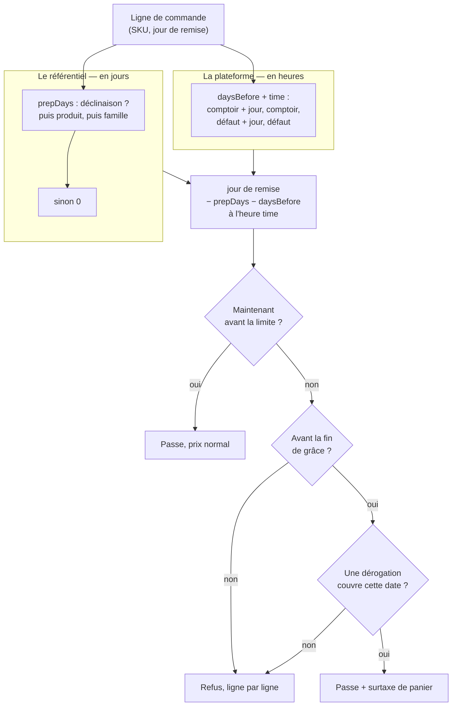

# L'heure limite de commande, la grâce, et la surtaxe de retard

> Écrit le 2026-09-04. Décrit **ce qui existe** (§1) et **ce qui est proposé**
> (§3 et suivantes).
>
> ✅ **Lots 0, 1 et 2 livrés le 2026-09-04** : le fuseau est explicite, la règle
> est opposée aux commandes client, et le **rattrapage** existe — il change le
> message, pas encore le verdict. Le reste — dérogation, surtaxe, chaîne de
> fabrication — n'est pas codé.

## En bref

**Le problème.** Un client ne peut pas commander du pain pour demain à 23 h ce
soir. Il faut une heure limite, réglable globalement puis nuançable par famille
et par produit.

**La surprise.** Cette heure limite **existait déjà** : une table, un écran de
réglages, des tests. Mais **rien ne la faisait respecter** — le code qui décide
« trop tard » n'était appelé nulle part. On pouvait remplir cet écran et croire
que ça bloquait. ✅ **C'est branché depuis le 2026-09-04** : une commande client
arrivée trop tard est refusée, et rien n'est écrit (§1).

**Deux choses décident, et elles s'additionnent** (§5) :

|                | Ce que ça dit                                      | Unité         | Où on le règle   |
| -------------- | -------------------------------------------------- | ------------- | ---------------- |
| **La cuisine** | combien de temps il faut pour fabriquer l'article  | des **jours** | le PIM           |
| **La journée** | quand on arrête de prendre pour une journée donnée | une **heure** | les réglages B2B |

| Pour samedi  | Fabrication                      | Commander avant |
| ------------ | -------------------------------- | --------------- |
| Un croissant | samedi                           | vendredi 18 h   |
| Un entremets | inserts vendredi, montage samedi | **jeudi 18 h**  |

L'entremets recule d'un jour parce que sa fabrication commence un jour plus tôt.
La recette dit des **jours**, jamais une heure : une heure recopiée sur la fiche
resterait figée le jour où le labo change la sienne.

**Trois situations, pas deux** (§4) :

| Quand                      | Ce qui se passe                                            |
| -------------------------- | ---------------------------------------------------------- |
| avant l'heure limite       | ça passe, prix normal                                      |
| juste après — la **grâce** | ça passe **si** quelqu'un l'autorise, **et** c'est surtaxé |
| après la grâce             | c'est non, et personne ne peut ouvrir                      |

La grâce est une durée qu'on règle ; la **dérogation** est le geste du commercial
au téléphone (§7) ; la **surtaxe** est ce que ça coûte, et elle s'ajoute au panier
comme des frais de livraison — **jamais au prix de l'article** (§8).

⚠️ **Aujourd'hui la grâce ne laisse encore passer personne.** Elle est réglable
et opposée, mais dans sa fenêtre le client est refusé par une **autre erreur**
(`orders.cutoff.grace`), celle qui invite à appeler — au lieu du refus sec
(`orders.cutoff.past`), qui ne renvoie vers rien. Elle deviendra un passage au
lot 3, pour qui l'accorde.

**Qui règle quoi** (§3) :

- **le PIM** : une seule chose — les jours de fabrication d'une famille, d'un
  produit, d'une déclinaison ;
- **les réglages B2B**, page Retraits & livraisons : tout le reste — les heures,
  les exceptions par comptoir et par jour, la grâce, le montant de la surtaxe ;
- **la commande** : ce qui a été décidé ce jour-là, figé. Changer le tarif demain
  ne réécrit pas ce qui est parti.

**Deux choses à savoir avant de coder :**

- ✅ le calcul lisait l'heure locale du **serveur**, qui tourne en UTC : « 18 h »
  y valait 20 h à Paris en été. Corrigé — la conversion passe explicitement par
  `Europe/Paris`, et les tests des contrats tournent en UTC pour que la panne se
  reproduise ici plutôt qu'en production (§10) ;
- ⚠️ le **taux de TVA de la surtaxe** n'est pas tranché : c'est une question
  comptable, et la seule du dossier qui coûte rétroactivement (§8).

**Et ce que la limite ne dit pas :** aucune capacité maximale n'existe. Elle
répond « trop tard », **jamais « complet »** — une commande acceptée n'est pas
une commande dont la production est garantie faisable (§5).

**L'ordre des travaux** (§12) : ~~réparer le fuseau~~, ~~faire respecter la règle
existante~~ — **faits** —, puis la grâce, la dérogation, la surtaxe, et en
parallèle les jours de fabrication dans le PIM. Les deux premières avaient une
valeur propre et n'ont pas touché au référentiel.

---

## 1. Ce qui existait déjà — et que rien n'appliquait

L'heure limite n'est pas à inventer. Elle est **modélisée, contractualisée,
testée et administrable** depuis le back-office :

| Pièce                                                       | État                                                        |
| ----------------------------------------------------------- | ----------------------------------------------------------- |
| `model OrderCutoff` (`schema.prisma:1068`, schéma `public`) | table `order_cutoffs`                                       |
| `packages/contracts/src/order-cutoff.ts`                    | payload Zod, vue, et **deux fonctions pures** de résolution |
| `packages/contracts/src/__tests__/order-cutoff.spec.ts`     | 12 tests                                                    |
| `GET/POST/PATCH/DELETE /admin/order-cutoffs`                | muré `@AdminSurface("b2b_settings")`                        |
| `reglages/retraits-livraisons/cutoffs-section/`             | l'écran de saisie                                           |

Une règle dit : « pour tel **point de retrait**, tel **jour d'acheminement**, il
faut avoir commandé `daysBefore` jours avant à telle **heure locale** ».
`resolveOrderCutoff` arbitre en quatre rangs — point+jour, point, défaut+jour,
défaut — et `orderCutoffInstant` en tire l'instant butoir.

### 🔴 Personne ne l'appliquait — corrigé le 2026-09-04

`resolveOrderCutoff` et `orderCutoffInstant` n'étaient appelés **nulle part** hors
de leur propre spec. Vérifié sur `apps/lfd-api/src`, `apps/lfd-api/test`,
`packages/*/src` et les deux fronts, hors client Prisma généré.

`PlaceOrderHandler` ne vérifiait qu'une chose avant de passer commande :
l'appartenance à l'entreprise. Aucune garde temporelle, ni dans le handler, ni
dans `OrderDrafting`, ni sur le devis.

**Ce que ça a changé pour cette demande.** Le travail n'était pas « ajouter une
heure limite » : c'était **la brancher**, et profiter du branchement pour lui
donner l'axe qui lui manque. Un écran de réglages qui ne refuse rien est pire
qu'une absence de règle — quelqu'un le remplit et croit la limite tenue.

**Depuis, la garde existe** : `ensureWithinOrderCutoff`
(`src/b2b/orders/domain/services/order-cutoff-guard.ts`), appelée par
`OrderDrafting` après la résolution de l'acheminement, sur les deux portes
d'entrée. Elle refuse en **409 `orders.cutoff.past`** et n'écrit rien.

⚠️ Le constat reste écrit plutôt qu'effacé : il dit pourquoi le lot 1 passait
avant tout le reste, et c'est la seule chose que le code ne raconte pas.

## 2. L'échelle demandée est déjà écrite ailleurs

`global → famille → produit` existe mot pour mot dans le dépôt, du côté des prix
(`packages/contracts/src/pricing.ts:83`) :

```ts
export const PRICE_SCOPE_LABELS: Readonly<Record<PriceScopeType, string>> = {
  global: "Tout le catalogue",
  category: "Famille",
  product: "Produit",
  variant: "Déclinaison",
};
```

**On réutilise `priceScopeSchema`, on n'invente pas un second vocabulaire de
portée.** Deux échelles nommées différemment pour la même idée finiraient par
diverger, et le back-office montrerait « Famille » d'un côté et « Catégorie » de
l'autre pour la même chose.

Elle apporte un quatrième rang que la demande ne nommait pas et qui est le plus
utile : **la déclinaison**. C'est elle qu'on commande — une `OrderLine` porte un
SKU, et un SKU est une déclinaison. Un produit dont le pot de 200 g se prépare la
veille et le seau de 5 kg trois jours avant n'a pas d'heure limite « du produit ».

## 3. La frontière, en une phrase

> **Le référentiel déclare des propriétés d'ARTICLES.
> La plateforme déclare des propriétés d'EXPLOITATION.
> La commande fige ce qui a été convenu.**

| Ce qu'on règle                                                | Où                                        |
| ------------------------------------------------------------- | ----------------------------------------- |
| Le **préavis** d'une famille, d'un produit, d'une déclinaison | **PIM** — ça suit la fiche                |
| Le **défaut**, les exceptions par comptoir et par jour        | **B2B**, Réglages → Retraits & livraisons |
| La **durée de grâce**, le **montant de la surtaxe**           | idem                                      |
| La **dérogation accordée**, la **surtaxe appliquée**          | **figées sur la commande**                |

### Pourquoi le défaut reste au B2B

Il a d'abord été proposé de le remonter au référentiel, avec les autres rangs.
C'était une erreur, et elle se voyait à son coût : il fallait une colonne
`source`, un refus d'écriture au repository, une ligne en lecture seule à
l'écran et une bascule en trois déploiements — **tout cet appareillage n'existait
que pour empêcher une boucle que la coupure elle-même créait** (le staff corrige
la ligne, le push suivant la réécrit, personne ne voit passer l'annulation).

Quand une conception a besoin d'un garde-fou contre un problème qu'elle
introduit, c'est la conception qu'il faut changer. Les trois raisons de fond :

1. **C'est une échelle, pas quatre réglages.** Le rang 4 de `resolveOrderCutoff`
   est le plancher des trois autres. Le mettre dans une autre application met une
   seule échelle dans deux écrans.
2. **C'est la même personne qui règle les quatre rangs.** « On ferme la veille à
   18 h, sauf à Courchevel où c'est 16 h » est une seule phrase. La couper en
   deux applications force un aller-retour pour l'écrire.
3. **Le défaut parle d'exploitation, pas de catalogue.** Il dit quand la journée
   du labo ferme — pas ce que l'article demande.

Et une contrainte qui, de toute façon, l'interdisait en partie : l'axe est
dimensionné par `pickupAddressId`, une ligne de `PickupAddress` (schéma `public`,
`schema.prisma:1024`). Le référentiel a bien une notion de lieu — `PointOfSale`,
schéma `pim`, `:3124` — mais **ce n'est pas la même table et rien ne les relie**
(grep `PointOfSale` dans `src/b2b` : vide). Descendre l'axe demanderait une clé
étrangère `pim → public`, que le document racine interdit.

### La page devient cohérente

`reglages/retraits-livraisons/` porte déjà trois sections : **points de
retrait**, **heures limites**, **zones de livraison**. La grâce et la surtaxe y
entrent sans forcer, parce que les cinq répondent à la même question : _à quelles
conditions on achemine_. Le PIM, lui, garde exactement une chose — **combien de
préavis un article demande**.

## 4. Trois états, pas deux

La limite n'est pas un instant, c'en sont **deux** : la limite, et la fin de
grâce. Ce qui donne trois états, et non un binaire passe/refuse.

| Quand                              | Ce qui se passe                       | Qui intervient          |
| ---------------------------------- | ------------------------------------- | ----------------------- |
| avant la limite                    | passe, prix normal                    | personne                |
| entre la limite et la fin de grâce | passe **si** autorisé, **et** surtaxé | un humain, au téléphone |
| après la grâce                     | refus                                 | personne ne peut ouvrir |

🔴 **Après la grâce, aucune dérogation n'ouvre.** Sinon la grâce n'est qu'un
affichage, et la vraie limite devient « quand le commercial a envie ». C'est une
borne dure, pas un défaut surchargeable.

**Les deux bornes sont incluses** : à la seconde de la limite on est encore
`open`, à la seconde de la fin de grâce encore `grace`. Une limite affichée
« 18 h » doit accepter 18 h 00 min 00 s — c'est ce que lit celui qui commande, et
l'exclure ferait refuser quelqu'un qui a cliqué à l'heure dite.

✅ **Livré le 2026-09-04** : `decideOrderCutoff` (contrat) → `ensureWithinOrderCutoff`
(garde), avec `graceMinutes` par rang. **Deux erreurs distinctes** plutôt qu'un
drapeau, parce que ce qui les sépare n'est pas un détail d'affichage mais **ce
que le lecteur doit faire** : changer de date, ou décrocher. Un code unique
aurait fait dire la même phrase aux deux, et le rattrapage n'aurait servi à
personne.

La grâce est **une durée** (minutes), pas une seconde heure : `limite + grâce`
suit automatiquement chaque rang de l'échelle, alors qu'une heure absolue aurait
dû être ressaisie sur chacun — et se serait retrouvée, un jour, avant sa propre
limite.

## 5. La résolution — deux contraintes de natures différentes

C'est ici que la première version se trompait, et l'exemple qui le montre est
celui d'un entremets à **inserts gelés** : les inserts se font la veille du
montage.

### La cuisine se compte en JOURS, l'exploitation en HEURES

|               | **Contrainte de cuisine**                               | **Contrainte de la journée**                            |
| ------------- | ------------------------------------------------------- | ------------------------------------------------------- |
| Dit quoi      | « cet article demande N jours de fabrication en amont » | « on arrête de prendre pour une journée à telle heure » |
| Unité         | des **jours**                                           | une **heure**                                           |
| Change quand  | la recette change                                       | les horaires du labo changent                           |
| Déclarée dans | le **PIM**                                              | le **B2B**                                              |

La première version donnait au référentiel un couple `daysBefore` **et** `time`,
c'est-à-dire une heure à lui. C'était la même faute que celle corrigée en §3, en
plus discret : le jour où le labo passe de 18 h à 16 h, chaque article portant sa
propre heure **reste à 18 h**, silencieusement, et il faut les rouvrir un par un.

**Le référentiel ne déclare donc qu'un nombre de jours.** Aucune heure.

### La composition est une addition, pas un arbitrage

Les deux ne se disputent pas : elles mesurent des choses différentes et elles
**s'empilent**.

```
instant limite = (jour de remise − prepDays − daysBefore) à l'heure `time`
                                   └ cuisine ┘   └──── exploitation ────┘
```

- `prepDays` — la longueur de la chaîne de fabrication **en amont** de la remise.
  0 pour un croissant qu'on cuit le matin même, 1 pour l'entremets dont les
  inserts prennent la veille.
- `daysBefore` + `time` — le préavis dont l'exploitation a besoin **avant** qu'une
  journée de fabrication démarre. C'est la règle `OrderCutoff` existante,
  inchangée.

L'entremets, concrètement, avec une règle « pour samedi, commander vendredi
avant 18 h » :

| Article                 | `prepDays` | Chaîne                           | Il faut commander avant |
| ----------------------- | ---------- | -------------------------------- | ----------------------- |
| Croissant, remis samedi | 0          | cuisson samedi                   | **vendredi 18 h**       |
| Entremets, remis samedi | 1          | inserts vendredi, montage samedi | **jeudi 18 h**          |

### Ce que ça supprime

Trois choses que la première version portait tombent, et c'est le signe que le
modèle est meilleur :

1. **Le `min` de deux instants** devient une soustraction de plus. Un entier
   s'explique à quelqu'un qui remplit un écran ; une composition de deux instants,
   non.
2. **Le débat « remplacer ou cumuler »** n'a plus d'objet. `prepDays ≥ 0`, donc le
   référentiel ne peut que **retarder** la limite, jamais l'avancer.
3. **L'argument « il faut pouvoir relâcher »** était faux. Je l'avais écrit en
   pensant qu'une canette de `resale` doit pouvoir se commander plus tard qu'une
   viennoiserie. C'est vrai, mais ce n'est pas une affaire de fabrication : une
   canette a `prepDays = 0` comme le croissant. Ce qui la distingue, c'est
   qu'**elle ne passe pas par la production du tout** — voir la question ouverte
   ci-dessous.

### L'échelle sur `prepDays`

Elle reste celle de §2, remontée d'arbre comprise, mais elle ne porte plus qu'un
entier :

```
déclinaison ?? produit ?? famille la plus proche en remontant l'arbre ?? 0
```

- **`null` = « ne se prononce pas »**, distinct de `0` = « aucune fabrication en
  amont ». Sans la distinction, on ne peut pas déclarer une famille explicitement
  sans chaîne sous un défaut qui en a une.
- **La remontée d'arbre est obligatoire** : `Category` porte `parentId`
  (auto-relation `CategoryTree`), on prend le plus proche ancêtre qui se prononce.
- **Le rang déclinaison porte son poids** : le pot de 200 g et le seau de 5 kg
  d'un même produit n'ont pas la même chaîne.

Si rien n'est saisi côté PIM, tout vaut `0`, l'addition se réduit à la règle B2B,
et le comportement est **exactement** celui d'aujourd'hui.



### La limite dit « trop tard », jamais « complet »

Aucune **capacité maximale** n'est écrite nulle part dans le dépôt, et il n'est
pas prévu d'en écrire une ici : le volume se régule aujourd'hui au jugement.

Il faut donc que le refus le dise. « Trop tard pour jeudi » et « jeudi est plein »
sont deux phrases différentes, et une commande **acceptée** par l'heure limite
n'est pas une commande dont la production est garantie faisable. Quiconque lit un
refus — client sur la boutique, commercial au téléphone — ne doit pas pouvoir en
déduire l'inverse.

C'est aussi pourquoi la **dérogation** (§7) reste un geste humain : la personne
qui l'accorde est celle qui sait s'il reste de la place. Automatiser l'ouverture
supposerait une capacité écrite, qui n'existe pas.

### ⚠️ Question ouverte : les articles qui ne passent pas par la production

Une canette de `resale` pourrait légitimement s'ajouter le matin même, alors que
le pain a fermé la veille. Ce n'est ni une chaîne de fabrication (`prepDays = 0`)
ni un comptoir : c'est un **flux** différent — du stock qu'on met dans un sac, pas
une fournée.

`ProductKind` (`daily` | `made_to_order` | `resale`) nomme déjà ce flux, et il
traverse déjà le fil (`syncProductSchema`). Deux sorties :

- **une dimension de plus sur `OrderCutoff`** (`productKind` nullable) — cohérent
  avec les dimensions existantes, mais la résolution passe de 4 à 8 rangs, et
  chacun doit être testé ;
- **rien**, et on assume que tout ferme à la même heure.

Non tranché, et volontairement : ça ne bloque aucun lot avant le 6, et le trancher
maintenant se ferait sans savoir si le cas se présente vraiment.

### ⚠️ Question ouverte : la dimension « point de retrait » nomme mal son sujet

L'objection, posée le 2026-09-04 : _l'heure limite est un fait de commande, pas
un fait de point de retrait._ Elle est juste, et elle va plus loin qu'un
renommage.

Un `PickupAddress` n'est **ni un lieu de production, ni un lieu de livraison** :
c'est l'endroit où un client vient chercher. Ce qui fait varier une heure limite,
lui, est ailleurs — c'est le dernier moment où l'on peut encore glisser une
commande dans **ce qui part** : une fournée, un chargement, une tournée. Le
modèle a pris le seul objet à portée qui ressemblait à un lieu.

Ça tient tant que le comptoir est le labo et qu'il n'y en a qu'un. Deux
symptômes disent que ça ne tiendra pas :

- 🔴 **Une livraison ne peut matcher aucune règle de point**, par construction
  (`packages/contracts/src/order-cutoff.ts:131`). Toute la moitié livrée du
  commerce n'a donc **qu'une seule** heure limite, celle du défaut. Un secteur de
  vallée dont le camion part à 5 h ne peut pas fermer plus tôt qu'une livraison
  en ville — et c'est exactement le genre d'écart que
  [`architecture-road-livraison-tournees.md`](architecture-road-livraison-tournees.md)
  décrit par ailleurs.
- Le jour où un point de retrait cesse d'être un labo — un relais, une boutique
  qui reçoit —, la règle resterait accrochée à lui alors que la contrainte
  viendrait de qui l'approvisionne.

**Trois sorties, non tranchées :**

|                           | Ce que ça donne                                              | Ce que ça coûte                                                     |
| ------------------------- | ------------------------------------------------------------ | ------------------------------------------------------------------- |
| **Garder**                | rien à faire                                                 | la livraison reste à une seule heure limite                         |
| **Généraliser**           | une portée de **remise** : un point OU une zone de livraison | une colonne nullable de plus, et la résolution passe de 4 à 6 rangs |
| **Retirer le rang point** | l'échelle tombe à `jour` puis `défaut`                       | une colonne supprimée sur une table servie : trois déploiements     |

**Le déclencheur, et il est simple :** _deux acheminements du même jour ferment-ils
à des heures différentes ?_ Si la réponse est oui pour deux **zones de livraison**,
c'est « généraliser », et l'ajout est additif. Si elle est non partout, c'est
« retirer », et l'échelle se simplifie. Tant que la question n'est pas posée à
l'exploitation, changer le modèle serait deviner.

⚠️ Ce qui n'est **pas** en cause : le `weekday`. Le jour d'acheminement est bien
un fait de la commande, et « le samedi ne ressemble pas au mardi » reste vrai
quel que soit l'objet auquel on accroche l'autre dimension.

### ⚠️ Conséquence hors périmètre : la journée de production n'est plus unique

`packages/contracts/src/order.ts:114` dit de `requestedDeliveryDate` : « Jour de
retrait/livraison. **Obligatoire** : c'est la journée de production. » Cette
identité est vraie tant que tout se fabrique le jour de la remise. Un entremets à
inserts gelés la rompt : il occupe **vendredi et samedi**.

Ça ne gêne pas l'heure limite — l'addition ci-dessus suffit à la calculer. Ça
gênera le jour où un plan de production existera : le plan du vendredi devra
contenir « faire les inserts du samedi ». Il n'y en a pas aujourd'hui — le seul
existant est `GetProductionBatchHandler`, qui lit les commandes d'une date sans
rien planifier. **Noté ici pour ne pas être redécouvert** au moment de l'écrire,
pas pour être traité maintenant.

## 6. Ce qui traverse le fil

Seule la **chaîne de fabrication** voyage : le reste est déjà du bon côté.

Le fil PIM → boutique passe par `packages/catalog-sync/src/snapshot.ts`
(`CATALOG_SNAPSHOT_VERSION = 5`). On y ajoute, en **optionnel**, le préavis
résolu pour chaque déclinaison :

```ts
// syncVariantSchema
prepDays: z.number().int().min(0).max(14).nullable(),
```

Deux exigences non négociables :

- **Le PIM envoie la valeur RÉSOLUE**, pas les trois rangs. La plateforme n'a pas
  à connaître l'arbre des familles pour savoir quand un SKU ferme — même
  raisonnement que `vatRatePercent` sur `CatalogItem` (`schema.prisma:2036` :
  « c'est l'article qu'on vend, c'est lui qui doit savoir se facturer »).
- **Le champ est nullable et le schéma monte de version.** Un contrat déjà servi
  ne se casse pas : `version: 6`, champ optionnel, et les lignes de `CatalogItem`
  d'avant le premier push complet portent `NULL` — « on ne sait pas », donc
  traitées comme `0` : le comportement d'aujourd'hui, à l'identique.

## 7. La dérogation

> **Lecture retenue** : « par appel » = un membre de l'équipe prend la commande
> **au téléphone** et accorde l'exception. Le dépôt la porte déjà — `Order`
> distingue `placedByUserId` (au nom de qui) et `placedByStaffId` (qui l'a
> saisie), et `orderOriginOf` en dérive l'origine `back_office`.

Une dérogation n'est **pas** une règle. Elle ne modifie rien dans le référentiel
ni dans les réglages : c'est une **autorisation de passer**, nommée, datée,
bornée et tracée.

```
DÉROGATION = { entreprise, date d'acheminement, motif, auteur, expiration }
```

Six propriétés, chacune parce que son absence a un coût :

1. **Elle vise UNE date d'acheminement.** Pas « ce client est dispensé » — une
   dispense permanente est un réglage, et elle doit se voir comme tel.
2. **Elle ne s'applique qu'à une entreprise.** C'est le mur : une exception
   accordée par téléphone ne peut pas ouvrir la porte aux autres.
3. **Elle ne peut ouvrir que DANS la grâce** (§4). Elle ne porte donc **pas**
   d'heure à elle : la borne est celle de la grâce, et une heure propre lui
   permettrait de la dépasser — ce que §4 interdit.
4. **Elle porte un motif obligatoire.** Une exception sans raison écrite devient
   la règle en trois mois.
5. **Elle nomme son auteur** (`StaffUser.id`, pas une clé étrangère — même
   raisonnement que `placedByStaffId` : une pièce ne disparaît pas parce qu'on
   retire quelqu'un de l'annuaire).
6. **Elle expire.** Au plus tard à la fin de grâce qu'elle vise.

Elle est **consommée**, pas supprimée : `usedByOrderId` renseigné au passage.
« Pas de DELETE physique » vaut ici, et une dérogation accordée puis non utilisée
est une information de gestion.

⚠️ **Elle vivait avec une heure à elle dans la première version de ce document.**
C'était avant que la grâce existe : l'heure de la dérogation jouait le rôle de
borne. Maintenant que la borne est un réglage, une seconde heure sur l'acte ne
ferait que permettre de la contourner.

**Où elle vit** : côté B2B (schéma `public`). Elle parle d'une commande et d'un
client, pas d'un article.

**Qui peut l'accorder** : une ressource dédiée dans `ROLE_GRANTS`. Ni
`b2b_settings` (qui donne le droit d'éditer _la règle_, ce qui n'est pas le même
geste), ni un simple droit de saisie de commande.

## 8. La surtaxe n'est pas un prix

C'est la frontière la plus facile à rater. Le schéma porte la formule du total :

```
total = max(0, subtotal − discount) + deliveryFee + vat
```

Deux modificateurs de panier existent déjà, **hors du moteur de prix** :
`discountCents` (remise de retrait, portée par `PickupAddress`) et
`deliveryFeeCents` (frais de zone, porté par `DeliveryZone`), tous deux en
`CartAdjustmentMode` — `percent | amount`. **La surtaxe de retard est un
troisième terme de la même forme.**

Pourquoi elle ne descend pas dans `PRICE_STAGES` (`mercuriale`, `volume`,
`promotion`, `geste`) :

- ces quatre-là répondent à _« ce que **cet article** vaut pour **ce client** »_.
  La surtaxe répond à _« comment **cette commande** a été passée »_. Sujet
  différent ;
- elle se battrait avec les **planchers**, qui protègent une marge sur l'article.
  Une surtaxe n'est pas de la marge sur le croissant ;
- la boutique ne pourrait pas l'afficher : le même article montrerait deux prix
  pour une raison qui ne le concerne pas ;
- elle est **par commande, pas par ligne**. Un panier où 3 lignes sur 20 sont
  hors limite ne produit pas 3 surtaxes — ce qu'on facture est la reprise d'une
  production close, un coût fixe.

Comme `discountAdjustment`, l'ajustement qui l'a produite est **figé sur la
commande** : changer le tarif demain ne doit pas réécrire ce qu'une commande
partie disait.

### ⚠️ Le taux de TVA de la surtaxe n'est pas tranché ici

Le moteur sait déjà porter un terme non-marchandise à son propre taux —
`DELIVERY_VAT_RATE = 20`, avec sa raison écrite : le transport est une
prestation, son taux ne se paramètre pas.

Une majoration pour commande tardive est **probablement accessoire à la livraison
des marchandises**, donc suivant leurs taux au prorata (5,5 / 20) plutôt qu'un
20 % forfaitaire. **Probablement** : c'est une question comptable, et c'est la
seule du dossier qui coûte de l'argent si on se trompe — sur toutes les commandes
tardives, rétroactivement. À trancher avant le lot correspondant, par quelqu'un
dont c'est le métier.

## 9. Ce que la boutique en montre

Puisque c'est un élément de la boutique B2B, il ne suffit pas de refuser :

- **Sur la fiche et la vignette** : « Commandez avant 18 h pour jeudi ». C'est un
  argument de vente autant qu'une contrainte.
- **Au panier, ligne par ligne.** La résolution étant par SKU, le panier ferme
  quand **sa ligne la plus urgente** ferme. On n'annonce donc pas « trop tard »
  en bloc : on nomme les articles concernés et on laisse commander les autres.
  Un refus global sur un panier de vingt lignes fait perdre les dix-neuf qui
  passaient.
- **Au moment du choix de date** : une date dont l'heure limite est passée se
  grise à la sélection, pas à la validation.
- **La grâce ne s'annonce pas en libre-service.** Un bandeau « encore 40 min pour
  commander en retard, +8 % » ferait de l'exception un mode de commande normal.
  Elle se dit au téléphone, par quelqu'un qui décide.

⚠️ Aujourd'hui la boutique lit `client/mock-shop.ts` et ne parle à aucune route
catalogue. Tant que le **lot 1** de
[`plan-boutique-sur-api.md`](plan-boutique-sur-api.md) n'est pas fait, il n'y a
rien pour porter cet affichage — l'application côté serveur, elle, ne l'attend
pas.

## 10. ✅ Le piège du fuseau — réglé le 2026-09-04

`orderCutoffInstant` construit son instant avec le constructeur `Date` local :

```ts
return new Date(year, month - 1, day - rule.daysBefore, hours, minutes, 0, 0);
```

« Heure locale » signifie **heure locale du process**. Or :

- le `Dockerfile` de `lfd-api` ne pose **aucun `TZ`** (il n'y déclare que
  `NODE_ENV`, `PORT` et `APP_REVISION`) ;
- `wrangler.jsonc` n'a **pas de bloc `vars`** ;
- l'image tourne donc en **UTC**, et `wrangler.jsonc:143` le dit déjà pour les
  crons : « ⚠️ Les crons Cloudflare sont en **UTC** ».

Une limite saisie à `18:00` devient **20 h à Paris en été, 19 h en hiver**. Le
décalage est dormant tant que rien n'applique la règle. Il devient une heure de
commandes acceptées à tort le jour du branchement — et il **change avec la
saison**, ce qui est la pire façon de découvrir un bug.

Les trois gestes, faits, et dans cet ordre :

1. **`ENV TZ=Europe/Paris`** dans le `Dockerfile`, avec sa raison écrite.
2. **Sans s'en contenter** : une variable d'environnement se perd en migrant
   d'image, et la panne serait alors silencieuse. Le calcul convertit désormais
   explicitement par `Europe/Paris` — il ne consulte plus le fuseau du process.
3. **Le runner des contrats tourne en `TZ=UTC`**
   (`packages/contracts/jest.config.cjs`), c'est-à-dire comme la production. Les
   assertions portent sur l'instant absolu (`toISOString`), jamais sur
   `getHours()` — qui aurait passé sur un poste réglé sur Paris et nulle part
   ailleurs. Deux cas couvrent **l'été et l'hiver** : un décalage figé en dur
   passerait l'un et casserait l'autre.

### Ce qui a servi, et qui existait déjà

La conversion n'a pas été réécrite. `paris-time.ts` la portait depuis les
créneaux de rendez-vous — deux passes, les deux bascules DST traitées, sa propre
spec. Il vivait dans `b2b/growth/domain/` ; il est **remonté dans
`@lfd/contracts`**, d'où le contrat des heures limites l'atteint. Une seconde
implémentation aurait divergé sur la bascule d'octobre, et l'écart ne se serait
vu qu'un dimanche par an.

⚠️ `lint:clock-port` ne couvre pas ce code : sa racine de scan est
`apps/lfd-api/src` (`dev-toolbox/gates/clock-port.mjs:36`), et `orderCutoffInstant`
vit dans `packages/contracts`. La porte n'a rien laissé passer — elle ne regarde
pas là.

## 11. Le modèle de données

**Additif, aucune colonne resserrée, aucune valeur de production déplacée.**

### PIM (schéma `pim`) — la chaîne de fabrication, et elle seule

Une table, pas des colonnes sur `Product` et `Category` : le rang `variant` en
demanderait une troisième, et un champ nul sur trois tables ne dit pas d'où vient
la valeur.

```prisma
model ProductPrepTime {
  id String @id

  /// `category` | `product` | `variant` — mêmes valeurs que `PriceScopeType`.
  /// Pas de `global` : le défaut est un fait d'exploitation (§3).
  scopeType String @map("scope_type")
  scopeId   String @map("scope_id")

  /// **Des jours, jamais une heure** (§5) : l'heure appartient à l'exploitation,
  /// et une heure recopiée ici resterait figée quand le labo change la sienne.
  prepDays Int @map("prep_days")

  @@unique([scopeType, scopeId])
  @@map("product_prep_time")
  @@schema("pim")
}
```

### B2B (schéma `public`)

- ✅ `OrderCutoff` porte `graceMinutes Int @default(0)` — la durée de §4, par
  rang, donc surchargeable comme l'heure elle-même. Migration additive
  `20260904100000_grace_apres_heure_limite` : `0` partout, donc aucune ligne
  existante ne se met à accepter quoi que ce soit de plus.
- Les réglages de plateforme gagnent le **montant de la surtaxe** :
  `lateFeeMode CartAdjustmentMode?` + `lateFeeValue Int?`, la même paire que
  `DeliveryZone` et `PickupAddress`.
- `CatalogItem` gagne `prepDays Int?` — la valeur **résolue** reçue du fil,
  `NULL` = ne se prononce pas, donc `0` au calcul.
- `Order` gagne `lateFeeCents Int @default(0)` et `lateFeeAdjustment Json?`,
  calqués sur `discountCents` / `discountAdjustment`.
- Une table `order_cutoff_waiver` pour les dérogations de §7.
- Les quatre rangs de `resolveOrderCutoff`, sa contrainte d'unicité et ses
  12 tests **ne bougent pas**.

### Il n'y a pas de commande sans date

La première version prévoyait le cas d'une commande sans jour de remise. Il
n'existe pas : `orderPayloadSchema` rend `requestedDeliveryDate` **obligatoire**
(`packages/contracts/src/order.ts:115`), avec sa raison écrite — « sans date elle
n'entre dans aucune journée de fabrication ». La colonne
`Order.requestedDeliveryDate` est nullable pour les lignes anciennes, pas pour ce
qu'on accepte aujourd'hui.

Toute commande a donc un instant butoir calculable. Il n'y a pas de branche à
écrire pour l'absence de date — il y en a une pour l'absence de **règle**, et
c'est déjà le comportement voulu : aucune règle ⇒ aucune limite.

## 12. Les lots

| #   | Lot                                                                                                   | Dépend de                               |
| --- | ----------------------------------------------------------------------------------------------------- | --------------------------------------- |
| ✅0 | **Le fuseau** (§10) : `TZ`, conversion explicite, test sous `TZ=UTC`                                  | —                                       |
| ✅1 | **Brancher l'existant** : garde dans `OrderDrafting`, erreur métier nommée, e2e sur le refus          | 0                                       |
| ✅2 | **La grâce** : `graceMinutes` par rang, les trois états, section de réglages                          | 1                                       |
| 3   | **La dérogation** : table, ressource d'accès, geste depuis la saisie back-office                      | 2                                       |
| 4   | **La surtaxe** : réglage, terme de panier, gel sur la commande, **TVA tranchée** (§8)                 | 3                                       |
| 5   | **La chaîne de fabrication côté PIM** : table, écrans famille / fiche / déclinaison, remontée d'arbre | —                                       |
| 6   | **Le fil** : `snapshot` v6, colonne miroir, l'addition dans la garde                                  | 1, 5                                    |
| 7   | **La boutique** : annonce, grisage des dates, refus ligne à ligne                                     | 6 + lot 1 de `plan-boutique-sur-api.md` |

### Ce que le lot 1 a laissé ouvert, volontairement

- **Le back-office n'est pas soumis à la limite.** Le membre de l'équipe au
  téléphone EST l'autorité qui déroge ; tant que la dérogation n'est pas un objet
  en propre, lui opposer la limite lui retirerait une capacité qu'il a
  aujourd'hui sans rien lui donner. L'exemption est écrite dans la garde, datée,
  et couverte par un test qui **changera de sens** au lot 3.
- **Le devis (`POST /orders/quote`) ne refuse rien.** Une lecture ne mute pas et
  n'a pas non plus à bloquer : c'est au lot 7 de griser une date à la sélection.
  Refuser au devis ferait découvrir la limite au moment le plus tardif et le
  moins explicable.
- ✅ **Les jours de service sont devenus relatifs.** `SERVICE_DAY = "2026-09-01"`
  vivait dans six suites e2e, et `admin-pricing` en portait trois de plus en dur
  — sept fichiers. Elles restaient vertes faute de règle semée, mais depuis le
  lot 1 **un jour de service est comparé à l'horloge** : la première suite qui
  aurait semé une règle avec cette constante aurait trouvé une bombe déjà armée.
  Toutes passent désormais par `serviceDay()` du harnais e2e, pendant de
  `daysAgo()`.

  ⚠️ Les fenêtres `validFrom` / `validTo` d'`admin-pricing` restent **absolues**,
  et c'est l'exception écrite du document racine : elles ne sont comparées
  qu'entre elles — adjacence, chevauchement —, jamais à l'horloge.

Deux remarques d'ordre :

- **Le lot 1 a une valeur propre.** Il ferme le trou entre un écran qui promet et
  un serveur qui ne refuse pas, et il ne demande rien au PIM. Tout le reste en
  dépend, parce que grâce, dérogation et surtaxe n'ont pas de sens tant que rien
  n'est refusé.
- **Le lot 5 est indépendant** et peut se mener en parallèle : il n'ajoute qu'une
  déclaration, sans consommateur, jusqu'au lot 6.

## 13. Ce qui a été vérifié, et où

| Affirmation                                                          | Vérifié                                                                           |
| -------------------------------------------------------------------- | --------------------------------------------------------------------------------- |
| `OrderCutoff` existe, point × jour, heure locale                     | `apps/lfd-api/prisma/schema.prisma:1068-1092`                                     |
| Résolution en quatre rangs, 12 tests                                 | `packages/contracts/src/order-cutoff.ts`, `__tests__/order-cutoff.spec.ts`        |
| **Aucun appelant** hors spec                                         | grep `resolveOrderCutoff\|orderCutoffInstant`, hors client généré                 |
| `PlaceOrderHandler` ne vérifie que l'appartenance                    | `src/b2b/orders/application/commands/place-order.handler.ts`                      |
| La page réglages porte déjà retraits + limites + zones               | `apps/lfc-B2B-admin-frontend/src/app/reglages/retraits-livraisons/`               |
| `PickupAddress` (public) et `PointOfSale` (pim) sans lien            | `schema.prisma:1024` et `:3124` ; grep `PointOfSale` dans `src/b2b` : vide        |
| `PriceScopeType` = global/category/product/variant                   | `packages/contracts/src/pricing.ts:83`                                            |
| `Category.parentId` auto-relation                                    | `schema.prisma:2812-2845`                                                         |
| `ProductKind` = daily / made_to_order / resale                       | `schema.prisma:2766`                                                              |
| Snapshot en version 5, `syncVariantSchema`                           | `packages/catalog-sync/src/snapshot.ts:24,110`                                    |
| `total = max(0, subtotal − discount) + deliveryFee + vat`            | `schema.prisma`, section `Order`                                                  |
| `CartAdjustmentMode` sert déjà à `DeliveryZone` et `PickupAddress`   | `schema.prisma:141, 1040, 1104`                                                   |
| `DELIVERY_VAT_RATE = 20`, terme non-marchandise à son taux           | `src/b2b/orders/domain/services/vat.ts`                                           |
| `requestedDeliveryDate` **obligatoire** au contrat, colonne nullable | `packages/contracts/src/order.ts:114-117` ; `schema.prisma`, section `Order`      |
| « c'est la journée de production » — l'identité que §5 nuance        | `packages/contracts/src/order.ts:114`                                             |
| Aucun plan de production n'existe, seulement une lecture par date    | `src/b2b/orders/application/queries/get-production-batch.handler.ts`              |
| `placedByStaffId` → origine `back_office`                            | `src/b2b/orders/domain/services/order-origin.ts`                                  |
| **Aucun `TZ`** dans le `Dockerfile` ni dans `wrangler.jsonc`         | `apps/lfd-api/Dockerfile`, `apps/lfd-api/wrangler.jsonc`                          |
| `lint:clock-port` ne scanne que `apps/lfd-api/src`                   | `dev-toolbox/gates/clock-port.mjs:36`                                             |
| `graceMinutes` par rang, migration additive à `0`                    | `prisma/migrations/20260904100000_grace_apres_heure_limite/`                      |
| Les trois états, les deux bornes incluses                            | `packages/contracts/src/__tests__/order-cutoff.spec.ts`                           |
| Deux codes distincts (`cutoff.grace` / `cutoff.past`)                | `src/b2b/orders/domain/errors/order-errors.ts` ; `test/order-cutoffs.e2e-spec.ts` |
| Une livraison ne peut matcher aucune règle de point                  | `packages/contracts/src/order-cutoff.ts:131`                                      |
| La boutique lit un mock, pas une route catalogue                     | `apps/lfc-B2B-platform-frontend/src/app/client/mock-shop.ts`                      |
