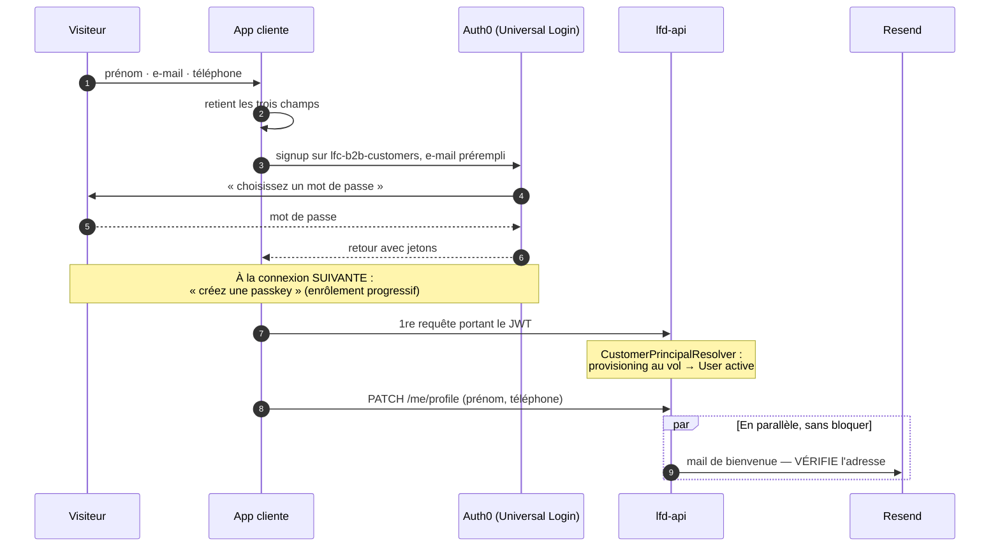

# Inscription client « zéro friction » — la première entrée

**Statut** : 🟢 branché et vérifié — 2026-08-27
**Correction du 2026-08-27** : la passkey n'arrive PAS à l'inscription. Voir
« Ce que le tenant fait vraiment ».
**Portée** : **la surface CLIENT uniquement** (`lfc-b2b-customers`). Le staff
(`lfc-staff`) ne change pas — voir « Ce qui déborde sur le staff ».

## La décision

Un visiteur donne **prénom, e-mail, téléphone**. Rien d'autre. Il pose un mot de
passe, il est dans son espace immédiatement — sans passer par sa boîte mail — et
c'est **à la connexion suivante** qu'Auth0 lui propose sa **passkey** (Face ID,
empreinte, code de l'appareil).

Les passkeys vivent sur la **connexion base de données client déjà en place**.
Une seule identité, un seul `sub`, aucun _account linking_.

### Ce que ça coûte : rien

Les passkeys sont incluses dans **tous** les plans Auth0, gratuit compris. Elles
**coexistent** avec les mots de passe sur la même connexion, et ne les invalident
pas : le « mot de passe plus tard » tient sans rien renégocier. Limite : 20
passkeys par personne — le téléphone, le portable, l'ordinateur du fournil.

### État du tenant — 2026-08-27

`lafoliedouce` (EU-2, production). Les deux réglages manquants ont été posés
ce jour, avec l'accord explicite du propriétaire du compte :

| Point                                      | État                                                 |
| ------------------------------------------ | ---------------------------------------------------- |
| Passkey sur `lfc-b2b-customers`            | ✅ **ACTIVE** (posée le 2026-08-27)                  |
| Password sur `lfc-b2b-customers`           | **Active** — les deux coexisteront                   |
| « Requires username » désactivé            | ✅ fait                                              |
| **Identifier First login flow**            | ✅ **activé** (posé le 2026-08-27) — prérequis READY |
| Custom Login Page désactivée               | ✅ fait                                              |
| Universal Login Experience                 | ✅ **déjà le Nouveau**                               |
| Domaine personnalisé                       | Aucun — et le tenant n'en fait PAS un prérequis      |
| `Disable Sign Ups` sur la connexion client | Désactivé : l'inscription publique est ouverte       |

**Le tenant est prêt.** Ce qui reste est du code, plus de la configuration.

⚠️ Deux effets immédiats, en production :

- l'écran de connexion demande désormais **l'e-mail d'abord**, le mot de passe
  ensuite — pour le staff comme pour les clients. Mêmes identifiants ;
- les prompts personnalisés d'Universal Login ont été réinitialisés par le
  changement de flux. Ils étaient aux valeurs par défaut d'Auth0 (« Welcome »,
  `${clientName}`) — vérifié avant de valider, rien n'a été perdu.

### Pourquoi pas le passwordless d'Auth0

1. Une connexion passwordless **ne porte pas de mot de passe**, et le mot de passe
   est au programme. La même personne aurait **deux identités, deux `sub`**.
2. Les rattacher demande l'_account linking_, **absent du tiers gratuit**.
3. Le lien magique n'existe qu'en Classic Login. Sur le Nouvel Universal Login,
   le passwordless e-mail est un **code**, pas un lien.

### Pourquoi pas un mot de passe généré pour la personne

Le montage marche : on génère le mot de passe, on le garde, et au clic sur notre
lien le backend s'authentifie à sa place (_Resource Owner Password Grant_). Il est
écarté pour trois raisons cumulées :

- il faudrait **détenir les mots de passe** de tous les clients — un identifiant
  complet et réutilisable, pas un jeton à durée de vie ;
- il faudrait **écrire quand même** le lien à usage unique, son expiration et sa
  limite de débit, c'est-à-dire la branche « jeton maison » **en plus** du risque ;
- le grant par mot de passe court-circuite la détection de force brute et tout
  second facteur futur. OAuth 2.1 le retire.

Tout ça pour supprimer **un écran, une fois par personne**.

## Le flux

La personne est entrée à l'étape 6. L'e-mail arrive après, et ne barre la route à
personne.

## Ce que le tenant fait vraiment — relevé du 2026-08-27

Cette note affirmait que l'inscription poserait une passkey. **C'est faux**, et
la cause n'est pas un réglage manquant : tout est en place.

| Point                                 | État relevé                              |
| ------------------------------------- | ---------------------------------------- |
| Passkey sur `lfc-b2b-customers`       | ACTIVE, prérequis `READY`                |
| UI passkey                            | Bouton + autofill                        |
| Enrôlement **progressif**             | Activé                                   |
| Enrôlement local                      | Activé                                   |
| Password sur la même connexion        | ACTIVE                                   |
| Connexions activées sur l'application | `lfc-b2b-customers` **seule** (+ Google) |

Le réglage le dit lui-même : _« Prompt users to create a passkey **after they log
in** »_. Quand passkey et mot de passe **coexistent**, Auth0 inscrit au mot de
passe et propose la passkey au retour suivant. La biométrie arrive, un écran plus
tard.

**Décision du 2026-08-27 : on garde le mot de passe.** Le rendre passkey-first
demanderait de désactiver Password sur la connexion — et tous les clients n'ont
pas de biométrie. Le mot de passe n'est donc pas une dette : c'est le chemin de
ceux dont l'appareil ne sait pas les reconnaître, et le filet de récupération de
tous les autres.

⚠️ **La connexion est nommée explicitement** (`connection: 'lfc-b2b-customers'`)
à la connexion comme à l'inscription. Elle l'était déjà par la configuration de
l'application ; l'écrire la protège du jour où une autre base sera activée.
Conséquence assumée : la porte « Continue with Google » disparaît du parcours —
une identité par personne, un seul `sub`, aucun rattachement de comptes.

## L'e-mail n'est pas facultatif

Une passkey prouve l'accès à **l'appareil**. Elle ne prouve pas l'accès à la
**boîte**. Et comme l'e-mail est le seul recours le jour où l'appareil disparaît,
il ne peut pas rester non vérifié.

C'est le point à ne pas rogner : on n'économise pas l'envoi, on économise
**l'attente**.

## Quand la personne change de téléphone

Trois cas, par ordre de fréquence :

1. **Même écosystème** (iPhone → iPhone, Android → Android) : la passkey est
   synchronisée par le trousseau de la plateforme. Rien à faire, rien à dire.
2. **Plusieurs appareils enrôlés** : les 19 autres passkeys fonctionnent.
3. **Changement d'écosystème, ou appareil unique perdu** : la passkey ne suit pas.
   Le **ticket `password-change` existant** redevient ce qu'il a toujours été — le
   chemin de récupération. Lien par e-mail, on reprend la main, on pose un mot de
   passe ou on enrôle une nouvelle passkey.

Le ticket reste donc dans le dépôt et garde tout son sens. Il n'est simplement
plus sur le chemin de tout le monde : c'est un filet, pas une porte.

## Ce qu'on réutilise, ce qu'on écrit

**Réutilisé tel quel** — c'est tout l'intérêt de cette branche :

- `CustomerPrincipalResolver` : provisioning au vol du `User` à la première
  requête, idempotent, avec son `UserRegisteredEvent`.
- `PATCH /me/profile` (`me.controller.ts`) : déjà écrit, déjà testé.
- `Auth0IdentityGateway` + `GrantAccountAccess` : inchangés, pour la récupération
  et pour l'ouverture d'accès par le staff.
- `@lfd/mailer` : Resend, disjoncteur, journal, webhook de rebond.

**À écrire** — peu de choses, et c'est le signe que la branche est la bonne :

- côté front : retenir les trois champs le temps de l'aller-retour Auth0, puis les
  poser par `PATCH /me/profile` au retour ;
- un gabarit `customer.welcome` qui **vérifie l'adresse** ;
- corriger la copie de `/bienvenue` (voir plus bas).

**Ce qu'on n'écrit PAS**, et qu'il aurait fallu écrire dans les autres branches :
aucune route publique, donc **aucune garde d'énumération, aucune limite de débit à
inventer, aucun jeton maison**. C'est Auth0 qui tient la porte.

## Ce que la copie de `/bienvenue` doit dire

Trois phrases affirment aujourd'hui l'inverse de ce qui sera vrai :

| Ce que la page disait                             | Ce qu'elle dit depuis le 2026-08-27                                              |
| ------------------------------------------------- | -------------------------------------------------------------------------------- |
| « on vous envoie un lien **à chaque connexion** » | « Un mot de passe pour ouvrir, puis votre appareil vous reconnaît. »             |
| « le lien est valable **une heure** »             | Aucun lien à attendre pour entrer.                                               |
| « Déjà client ? **Se connecter en un lien** »     | « Se connecter » → Universal Login (mot de passe, ou passkey si elle est posée). |

⚠️ Une première correction avait écrit « **Pas** de mot de passe : votre appareil
vous reconnaît ». C'était l'erreur inverse, et elle promettait au visiteur un
écran qu'il n'allait pas voir.

## Ce qui déborde sur le staff

⚠️ **Trois réglages sont au niveau du TENANT, pas de la connexion.** Les passkeys
s'activent bien sur la seule connexion client, mais leurs prérequis touchent tout
le monde :

- **Nouvel Universal Login** — nécessaire à WebAuthn. **Déjà actif** : rien à
  basculer, donc rien à casser pour le staff.
- **Flux « identifiant d'abord »** — le seul réglage à activer. Il change l'écran
  du staff aussi : l'e-mail d'abord, le mot de passe ensuite. Mêmes identifiants.
- **Domaine personnalisé** — **PAS un prérequis**, contrairement à ce que cette
  note affirmait. Le tenant ne le liste pas. Sans lui, la passkey s'enregistre
  sous `lafoliedouce.eu.auth0.com` : elle fonctionne, mais elle apparaît au nom
  d'Auth0 dans le trousseau de la personne, pas au vôtre. Question de marque, pas
  de faisabilité — traitable plus tard.

Et la conséquence à ne pas manquer : **un domaine personnalisé change le `iss` des
jetons**. `AccessTokenVerifier` contrôle l'émetteur (`auth.config.ts`), et les
trois fronts pointent vers le même tenant. Le basculement doit se faire **d'un
bloc** — fronts et backend ensemble — sinon la vérification tombe, pour le staff
comme pour les clients.

La connexion `lfc-staff`, elle, ne gagne pas de passkey et ne change pas de
mécanique.

**Les mots de passe du staff restent valides.** Les passkeys s'activent par
CONNEXION, et même là où elles le sont, elles s'ajoutent sans rien remplacer :
« Passkeys do not replace or invalidate a user's existing credentials ». Ce qui
change pour le staff, c'est l'écran — refait, et coupé en deux temps par le flux
« identifiant d'abord ». Rien d'autre. Le seul mécanisme capable d'enfermer
quelqu'un dehors est le basculement de domaine décrit juste au-dessus, et il ne
touche pas les identifiants : il touche l'émetteur.

⚠️ Si le tenant est encore en Classic Universal Login avec une page de connexion
personnalisée en HTML, elle serait perdue au passage. À regarder avant.

## Une alerte retirée

Cette note avertissait que le tiers gratuit n'autorisait **qu'une** connexion base
de données, et que provisionner `lfc-staff` franchirait la limite. **C'est faux** :
le tenant en porte déjà **trois** — `lfc-b2b-customers`, `lfc-staff` et le
`Username-Password-Authentication` par défaut. La page de tarifs annonce ce
chiffre, Auth0 ne l'oppose pas.

## Ce qui reste ouvert

- **Le domaine personnalisé** reste à décider — pas pour faire marcher les
  passkeys, mais pour qu'elles portent votre nom. Il demande une carte (jamais
  débitée) et changerait le `iss` des jetons : basculement d'un bloc.
- **La passkey depuis un appareil voisin** (QR) couvrirait une partie du
  changement d'écosystème tant que l'ancien téléphone est là. Non vérifié.
- **Le téléphone n'est pas vérifié.** Il sert au coursier qui cherche la porte,
  pas à l'authentification.
- **La révocation des invitations périmées** n'est toujours pas branchée
  (cf. `architecture-compte-client-cycle-de-vie.md` §8).
