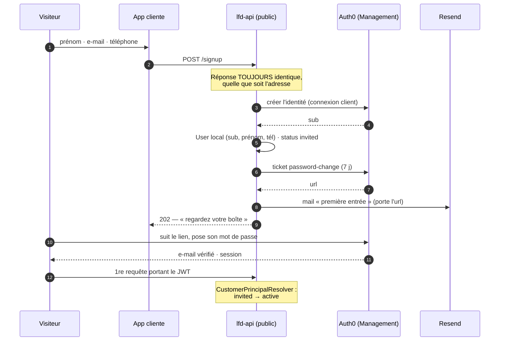

# Inscription client « zéro friction » — la première entrée

**Statut** : 📐 décidé, pas encore codé — 2026-08-27
**Concerne** : app cliente (`/bienvenue`), `lfd-api` (surface publique), tenant Auth0

## La décision

Un visiteur donne **prénom, e-mail, téléphone**. Rien d'autre. Il reçoit un lien
par e-mail ; le suivre lui ouvre son espace.

Sous le capot, ce lien est le **ticket `password-change` d'Auth0 déjà émis par
`Auth0IdentityGateway`**, sur l'**unique connexion base de données client**.

### Pourquoi pas le passwordless d'Auth0

Trois faits, dans cet ordre :

1. Une connexion passwordless **ne porte pas de mot de passe**. C'est un type de
   connexion distinct d'une connexion base de données.
2. Le mot de passe est au programme (décision produit du 2026-08-27). Une même
   personne aurait donc **deux identités et deux `sub`**, à rattacher par
   _account linking_.
3. L'account linking **n'est pas dans le tiers gratuit** d'Auth0. Le tenant est
   sur le gratuit.

Le passwordless d'Auth0 aurait donc coûté un abonnement pour résoudre un problème
créé par le passwordless lui-même. Et le lien magique n'existe qu'en Classic
Login : sur le Nouvel Universal Login, le passwordless e-mail est un **code**, pas
un lien.

> ⚠️ Le gratuit inclut **une** connexion base de données. `lfc-b2b-customers` la
> consomme. Provisionner `lfc-staff` en prod franchira la limite — à trancher
> avant, pas pendant.

## Ce que la décision change au produit

Le lien n'est **pas un lien de connexion**. C'est un lien de **première entrée**,
qui se termine par « posez votre mot de passe ». Trois conséquences que l'app
cliente affirme aujourd'hui à tort :

| Ce que dit `/bienvenue`                                                  | Ce qui sera vrai                                                                |
| ------------------------------------------------------------------------ | ------------------------------------------------------------------------------- |
| « Pas de mot de passe : on vous envoie un lien **à chaque connexion**. » | Un lien **à la première entrée**. Ensuite, le mot de passe.                     |
| « le lien est valable **une heure** »                                    | **7 jours** (`PASSWORD_TICKET_TTL_SECONDS`).                                    |
| « Déjà client ? **Se connecter en un lien** »                            | « Se connecter » → Universal Login. Le lien devient le « mot de passe oublié ». |

C'est le prix assumé du gratuit et de l'identité unique. Il se paie **une fois par
personne**, pas à chaque visite.

## Le flux

## Ce qu'on réutilise, ce qu'on écrit

**Réutilisé tel quel** — c'est l'intérêt de cette branche :

- `Auth0IdentityGateway.openIdentity()` : création idempotente sur l'e-mail +
  émission du ticket.
- `GrantAccountAccess` : les trois branches (inconnue / `invited` / `active`)
  sont déjà écrites et testées.
- `CustomerPrincipalResolver` : provisioning au vol, et `invited → active` à la
  première requête.
- `@lfd/mailer` : Resend, disjoncteur, journal, webhook de rebond.

**À écrire** :

- une route **publique** `POST /signup` (`@Public()`), la première de la surface
  client ;
- un gabarit de mail `customer.first-entry` — `customer.access-opened` parle la
  langue d'une invitation par un commercial, pas celle d'un visiteur ;
- la pose du **prénom** et du **téléphone** sur le `User` à la création : ils
  n'existent nulle part dans Auth0, et ne doivent pas attendre un second écran.

## Les gardes d'une route publique

C'est la première porte ouverte de la surface client. Trois règles, non
négociables :

1. **La réponse ne dit jamais si l'adresse est connue.** Même code, même délai,
   même phrase. Une inscription qui répond « déjà pris » est un annuaire.
2. **Le lien ne sort que par l'e-mail.** Jamais dans la réponse HTTP, jamais dans
   un log. (`IssuePasswordLink` le renvoie dans la réponse — c'est légitime pour
   une remise de la main à la main par le staff, ça ne l'est pas ici.)
3. **Débit limité** par adresse et par IP. Sans quoi la route est un canon à
   e-mails signé de votre domaine, et c'est votre réputation d'expéditeur qui
   paie.

## Les deux durées

Elles coexistent déjà et ne parlent pas de la même chose :

- **7 jours** — le ticket Auth0 (`PASSWORD_TICKET_TTL_SECONDS`) : la durée de vie
  du **lien**.
- **14 jours** — `INVITATION_LIFETIME_DAYS` : la durée de vie de l'**invitation**,
  comptée sur le `createdAt` du membership.

Pour une inscription en self-service il n'y a pas de membership : seule la
première compte. Le second lien s'obtient en redemandant, ce qui remet 7 jours.

## Ce qui reste ouvert

- **Le téléphone n'est pas vérifié.** Il sert au coursier qui cherche la porte,
  pas à l'authentification. Le SMS comme second canal reste à décider.
- **La révocation des invitations périmées** n'est toujours pas branchée
  (cf. `architecture-compte-client-cycle-de-vie.md` §8).
- **Le fournisseur d'e-mail d'Auth0** n'entre pas en jeu ici : c'est nous qui
  envoyons, par Resend. Rien à configurer côté tenant.
