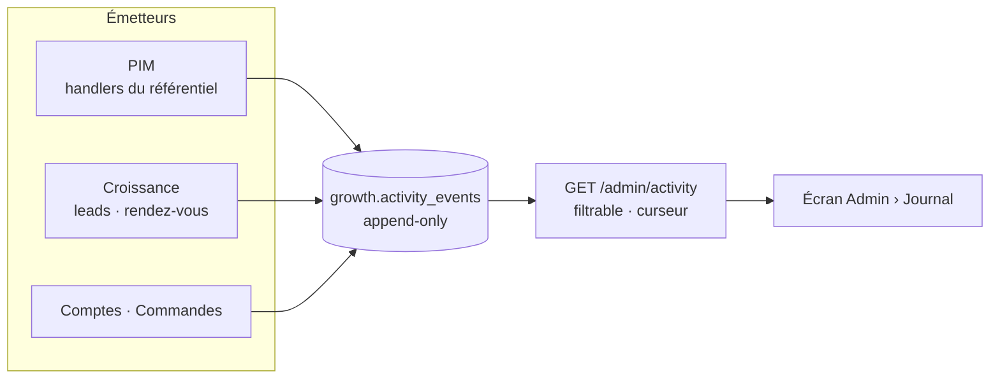
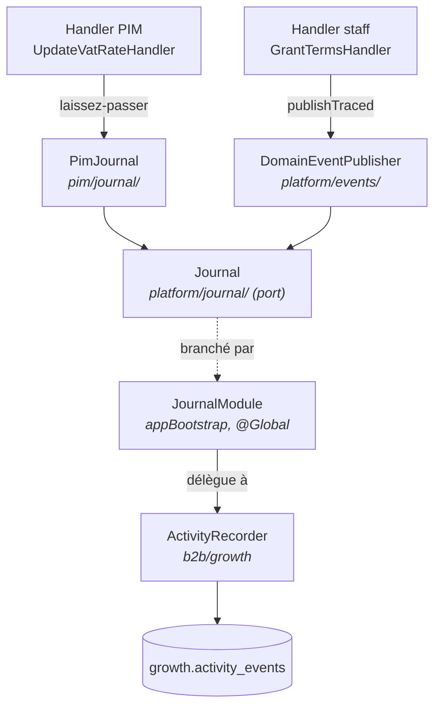
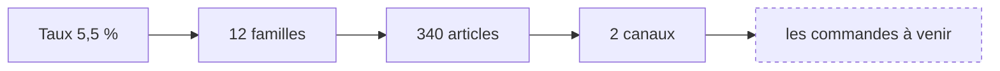

# Le journal d'activité

_Qui a fait quoi, tous modules confondus — et ce que ça touchait à ce
moment-là._

> Le journal existait avant cette page, en **écriture seule** : alimenté depuis
> dix-huit endroits du module croissance, lu par personne. Ce document décrit ce
> qu'il est devenu quand le référentiel s'est mis à y écrire et qu'un écran s'est
> mis à le lire.

---

## 1. Un seul journal, jamais deux

La tentation, en ouvrant le sujet depuis le PIM, est d'écrire « un journal
d'activité PIM ». C'est le mauvais réflexe : deux journaux, ce sont deux vérités
sur « qui a fait quoi », et la question qu'on pose à un journal — _que s'est-il
passé avant que ça casse ?_ — traverse les modules par nature. Un changement de
taux, une publication et une commande appartiennent à la même histoire.

Le journal est donc **un**, et « PIM » n'est pas un emplacement mais un
**filtre**.



**Ce n'est pas de l'event sourcing.** La vérité métier reste transactionnelle ;
on ne reconstruit jamais un état depuis ce journal. C'est un flux de faits
observés — une projection d'audit, avec un seul invariant : l'immuabilité.

### Ce que la ligne porte

| Colonne             | Pourquoi elle existe                                                 |
| ------------------- | -------------------------------------------------------------------- |
| `id` (ULID)         | Trie par le temps → curseur de pagination, sans index supplémentaire |
| `type`              | Le fait, en vocabulaire métier (`vat_rate.rate_changed`)             |
| `subjectType/Id`    | Ce dont il parle — c'est la clé de « l'histoire de ce taux »         |
| `actorId/actorName` | Le nom **figé au moment de l'acte** (cf. §4)                         |
| `traceId`           | Corrélation : tous les faits d'une même requête se retrouvent        |
| `idempotencyKey`    | Un rejeu ne compte pas deux fois                                     |
| `payload`           | Le « avant → après », et la **portée** sous la clé `blast`           |

---

## 2. Comment on y écrit sans voir la croissance

La matrice des frontières interdit à `pim` d'importer `b2b`. Chaque émetteur
déclare donc **son** port, et la racine de composition le branche sur le journal
réel — le montage de `B2bCatalogDriver`, pour la même raison.

**Le port a été promu en `platform/` le 2026-08-25**, comme ce doc l'avait prévu :
« au troisième bloc émetteur ». Le troisième est arrivé — les actes du staff sur
un compte client (`b2b/account`) — et la fiction « la croissance possède le
journal » a cessé de tenir. `platform/journal/` porte le fait nu et l'écriture
bloquante ; `pim/journal/` garde ce qui lui est propre, le laissez-passer et la
portée.



Le schéma Postgres `growth` reste, lui, un nom trompeur — il héberge le journal
de tout le monde. Le renommer est une migration de données à trois déploiements,
pour un bénéfice de lecture en `psql` : pas maintenant.

### Ce qu'on journalise, et ce qu'on ne journalise pas

Cette section décrivait une règle **abandonnée le 2026-08-25** : « on ne trace
que ce qui change ce qui est taxé ou vendu ». Elle triait selon l'usage qu'on
imaginait du journal ; la question qu'on lui pose est « qui a touché à ça ».
Le référentiel trace donc désormais **toutes** ses écritures, et les comptes
clients tous les **actes du staff** — cf.
[`../pim/journalisation-et-tracabilite.md`](../pim/journalisation-et-tracabilite.md).
Ce qui reste best-effort : les faits d'entonnoir et le parcours du client.

La table ci-dessous garde son intérêt : elle dit quelle **portée** chaque fait
fige.

| Type                           | Portée figée                           |
| ------------------------------ | -------------------------------------- |
| `vat_rate.created`             | — (un taux qui naît ne vise personne)  |
| `vat_rate.rate_changed`        | `familiesEmporter`, `familiesSurPlace` |
| `vat_rate.renamed`             | — (un nom qui change ne change rien)   |
| `vat_rate.deleted`             | —                                      |
| `product_category.vat_changed` | —                                      |
| `product.published`            | `variants`                             |
| `product.unpublished`          | `variants`                             |

Renommer et changer un taux sont **deux faits distincts** alors qu'ils passent
par la même route. Les confondre sous « taux modifié » obligerait à ouvrir le
payload pour savoir si l'événement compte.

---

## 3. La portée — « blast radius »

C'est la décision qui mérite le plus d'explication, parce que l'intuition mène
au mauvais choix.

### La question

Changer un taux de TVA a des conséquences. Le journal devrait-il les chiffrer ?

### Ce qu'on ne fait pas : le rayon transitif



Figer un nombre au bout de cette chaîne, c'est surtout figer **l'endroit où l'on
a choisi de s'arrêter**. Un tel nombre :

- n'est actionnable par personne, puisque sa valeur dépend d'une convention
  invisible ;
- devrait être recalculé à chaque nouvel aval branché — et les faits déjà
  écrits, eux, garderaient l'ancienne convention ;
- coûte plusieurs requêtes sur le chemin d'écriture d'un journal qui est
  best-effort.

### Ce qu'on fait : des comptes directs, nommés

On fige ce que le handler **sait déjà**, en une requête qu'il fait de toute
façon — pour un taux, le compte de familles qui le visent, qui est aussi ce
qu'affiche la colonne « Utilisé par ».

```json
{
  "name": "Réduit",
  "from": 5.5,
  "to": 10,
  "blast": { "familiesEmporter": 3, "familiesSurPlace": 1 }
}
```

Deux règles tiennent la décision :

1. **Les clés sont nommées par ce qu'elles comptent.** Jamais un `blastRadius`
   magique dont personne ne saurait dire ce qu'il additionne.
2. **Zéro est un compte ; l'absence n'en est pas un.** Un fait sans clé de portée
   est un fait sans aval, pas un fait dont l'aval vaut zéro. L'écran ne les
   confond pas.

### Et la profondeur, alors ?

Elle se **dérive à la lecture**, quand quelqu'un ouvre un événement et demande
« ça a touché quoi ». À ce moment-là c'est une requête, et elle peut être honnête
sur sa date : « aujourd'hui, ce taux est visé par 14 familles » est une phrase
vraie ; « ce jour-là il en touchait 3 » aussi. Un seul nombre stocké prétendrait
répondre aux deux.

---

## 4. Ce que le journal fige, et ce qu'il ne joint pas

**Le journal doit être lu par des humains.** Un écran qui affiche
`order.placed · 2026-08-21T12:32:00.000Z · auth0|abc` est lisible par une
machine et par personne d'autre. D'où deux lignes par fait :

```
Commande ORD-142 passée
21 août 2026 à 14:32, par Hugo Heynard (Commercial) pour Boulangerie Martin (SARL MARTIN)
```

Cela suppose de connaître, longtemps après, le nom de l'acteur, sa fonction, et
l'identité du client. Ces trois-là sont **figés à l'écriture**, pas rejoints à
l'affichage. Deux raisons, et la seconde est la vraie :

- une jointure par ligne coûterait une lecture par événement affiché ;
- surtout, elle supposerait que **le nom d'aujourd'hui vaut pour l'acte
  d'hier** — précisément ce qu'une trace ne doit jamais faire. Une enseigne
  change ; une commande de 2024 doit continuer de nommer son client comme il
  s'appelait en 2024.

### Le coût, compté

Figer n'est pas une excuse pour multiplier les lectures. Le budget, par fait :

| Donnée figée                     | Coût                                               |
| -------------------------------- | -------------------------------------------------- |
| `actorName`                      | 1 lecture de l'annuaire — elle existait déjà       |
| `actorRole`                      | **0** — une colonne de plus dans la fiche déjà lue |
| `clientName` / `clientLegalName` | 1 lecture, **sur `order.placed` seulement**        |

La société est résolue par l'**émetteur**, pas par le recorder : seul ce fait-là
parle d'un client, et le faire dans le recorder l'aurait fait payer à tous les
autres. Une commande sans société (zéro-friction personnelle) ne paie rien du
tout — on n'interroge pas l'annuaire pour un `null`.

### Quand on ne sait pas

Ni nom inventé, ni identifiant technique au milieu d'une phrase :

- acteur inconnu → sa **nature** : « un membre de l'équipe », « le système » ;
- société absente ou introuvable → **pas de « pour »** du tout ;
- raison sociale identique à l'enseigne → une seule fois, pas
  « Martin (Martin) » ;
- type d'événement inconnu de l'écran → le **type lui-même**, ce qui reste vrai.
  Le journal est ouvert : un module peut émettre un fait que l'écran ignore.

---

## 5. La lecture

`GET /admin/activity` — filtres `module`, `type`, `subjectType`, `subjectId`,
`actorId`, `since`, `until` ; pagination par **curseur** (`before` + `limit`).

**Par curseur et pas par offset** : le flux est append-only et se lit du plus
récent au plus ancien, donc un `skip` glisserait d'une ligne à chaque fait écrit
pendant la lecture. L'`id` étant un ULID, trier par `id` décroissant trie par le
temps.

Le **module** est dérivé du préfixe du type (`vat_rate.` → `pim`) plutôt que
stocké : la colonne n'existe pas, et l'ajouter obligerait à la remplir pour tous
les faits déjà écrits. Le jour où un type ne se range plus sous un préfixe, c'est
le type qu'il faut renommer.

### Le mur

Ressource **`activity`**, en lecture, **`admin` seul**. Pas `staff` : le journal
traverse les modules, donc le ranger sous l'un d'eux donnerait son activité aux
autres par la bande. Élargir plus tard — la tranche fiscale à la comptabilité,
par exemple — reste facile ; reprendre un accès déjà donné, non.

`admin` porte aussi `activity:write`, qu'aucune route ne vérifiera jamais : le
journal est append-only. C'est le prix de l'invariant qui compte le plus,
« l'administrateur couvre tout le catalogue, sans trou », qu'un test attrape.

---

## 6. Ce qui reste

La chaîne est prouvée de bout en bout sur **deux** blocs : le référentiel
(toutes ses écritures) et les actes du staff sur un compte client. Restent
best-effort, et par décision : le parcours du client, le chemin de commande et
les webhooks de paiement — là, le client passe avant la mémoire.

Le détail, les seuils et l'ordre :
[`../todos/todo-journal-activite.md`](../todos/todo-journal-activite.md).
