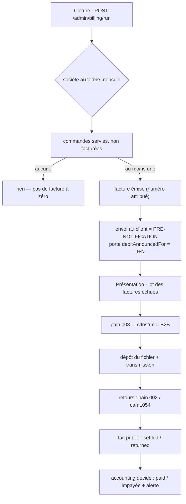

# Prélèvement SEPA émis en direct — découpage (V2)

> **Sortir de Stripe pour le prélèvement** et devenir nous-mêmes émetteur, sous
> notre propre ICS, en schéma **SDD B2B**.
>
> Trois décisions structurent tout : nous frappons la **RUM** (donc le mandat
> papier peut enfin être prérempli) ; nous **détenons l'IBAN** (retournement
> assumé de la décision B du doc précédent, avec sa facture) ; et un
> encaissement n'est plus un appel d'API mais un **lot déposé à la banque**.
>
> Décidé le **2026-09-01**. Prérequis lus :
> [`architecture-prelevement-sepa.md`](architecture-prelevement-sepa.md) (le
> socle Stripe, qui reste en place et gelé) et
> [`architecture-facturation.md`](architecture-facturation.md) (dont ce document
> périme la tranche 7 et la §6).
>
> ## ⏸️ CHANTIER EN PAUSE — décidé le 2026-09-01
>
> **Le prélèvement SEPA reste chez Stripe.** Rien de ce document n'est en cours
> d'implémentation, et personne ne doit s'y mettre sans une reprise explicite.
> Ce qui suit reste écrit parce que la conception, elle, a coûté cher : la
> §0 bis dit exactement où on s'est arrêté, ce qui a été bâti, et ce qu'il
> faudra relire avant de reprendre.
>
> **V2** — la V1 a été contredite avant d'être soumise, et n'a pas survécu :
> sept objections bloquantes. Les corrections sont marquées ⟲ dans le texte.
> La V2 a été contredite à son tour et garde **quatre objections bloquantes
> ouvertes**, listées en §0 bis. Elles ne sont pas résolues.

---

## 0. Ce qui change, en une phrase

Avec Stripe, encaisser était **N appels indépendants**, chacun idempotent,
chacun réussissant ou échouant seul. En direct, c'est **un fichier pour
quarante débiteurs** : le mode de défaillance devient « le lot a été rejeté »,
ou « le lot est passé et trois lignes reviennent dans six jours ».

Ce n'est pas un changement d'adaptateur. `MandateGateway` n'a plus d'objet :
en SDD direct, **enregistrer un mandat n'appelle personne** — c'est un acte
purement local. Le port qui apparaît est ailleurs et plus tard : transmettre un
lot, avaler des retours.

---

## 0 bis. La mise en pause — 2026-09-01

**La décision.** Le prélèvement continue de passer par Stripe. Le chantier
d'émission directe est arrêté le jour même où il a été conçu, avant toute
tranche de mise en service.

**Pourquoi le document reste.** Il ne coûte rien à garder et il économise deux
choses qui, elles, ont coûté : la conception, et **deux passes de contradiction**
qui ont trouvé onze objections bloquantes. Reprendre sans les relire reviendrait
à les redécouvrir une par une, en codant.

### Ce qui a été bâti, et qui vit toujours

Du **domaine pur**, sans module Nest, sans Prisma, sans route : rien n'est câblé,
rien ne tourne, rien ne peut casser. 51 tests verts, `tsc` propre, les 17 portes
passantes au moment du gel.

| Chemin                                                            | Ce que c'est                                                   | Sort si le chantier ne reprend pas                   |
| ----------------------------------------------------------------- | -------------------------------------------------------------- | ---------------------------------------------------- |
| `src/b2b/accounting/domain/entities/legal-entity.ts`              | l'entité juridique émettrice, ses invariants                   | **à garder** — voir ci-dessous                       |
| `src/b2b/accounting/domain/value-objects/`                        | `Siren`, `Iban` (mod-97), `CreditorIdentifier`, `LegalAddress` | **à garder** sauf l'ICS                              |
| `src/b2b/accounting/domain/creditor-snapshot.ts`, `ports/`        | l'émetteur figé, les deux ports                                | **à garder**                                         |
| `src/b2b/payments/domain/value-objects/rum.ts`                    | la RUM frappée par nous                                        | **orphelin** : sous Stripe, la référence vient d'eux |
| `InvalidRumError` dans `payments/domain/errors/mandate-errors.ts` | l'erreur associée                                              | **orpheline**, même raison                           |

**`LegalEntity` n'est pas du SEPA.** C'est la **tranche 0 de la facturation**,
qui la déclare bloquante depuis toujours : « Identité du vendeur (LFC) — _nulle
part_ — raison sociale, SIRET, TVA intracom, adresse, RCS, capital, IBAN »
([`architecture-facturation.md`](architecture-facturation.md)). Aucune facture
régulière ne sort sans elle, que l'encaissement passe par Stripe ou pas. Ce
morceau-là est à finir un jour de toute façon — persistance, écran, et il est
livré.

Ce qui manque pour qu'il serve : le modèle Prisma et sa migration, l'adaptateur,
les commandes CQRS, le contrôleur, et l'écran Comptabilité › Entités juridiques.

### Ce qui reste FAUX dans ce document

La V2 a été contredite et n'a pas été corrigée depuis. **Quatre objections
bloquantes sont ouvertes** — les écrire ici est le seul intérêt de la pause :

1. **L'index `UNIQUE (invoice_id) WHERE status <> 'returned'` (§3) ne libère pas
   assez.** Un rejet avant règlement (`pain.002` `RJCT`), un lot rejeté en bloc,
   un dépôt manqué laissent l'instruction en `pending` pour toujours, donc la
   facture verrouillée — alors que la §5 promet la reprise. Il manque un statut
   « morte sans règlement », et l'index doit l'exclure aussi.
2. **`(company_id, creditor_id)` (§2) vide l'invariant qu'il prétend étendre.**
   Le `creditor_id` est forcément nullable (les mandats Stripe n'en ont pas), et
   Postgres traite les `NULL` comme distincts : deux mandats Stripe actifs sur la
   même société passeraient. Il faut `NOT NULL` + backfill, ou `NULLS NOT
DISTINCT` — pas « une colonne ».
3. **La porte du crédit (§11 T12) est circulaire.** Exiger
   `firstCollectionSettledAt` pour accorder le mensuel, quand il faut le mensuel
   pour prélever : la condition n'est jamais satisfiable pour un client neuf.
4. **Le fait publié `payments → accounting` (§2) désigne le mauvais mécanisme.**
   Le contrôleur de webhook cité en exemple fait du `CommandBus` synchrone, pas
   de la publication ; le vrai mécanisme du dépôt est `DomainEventPublisher` /
   `publishTraced`. Et l'`EventBus` en mémoire n'est ni transactionnel ni
   rejouable : un abonné qui échoue sur `collection.settled` = argent encaissé,
   facture jamais `paid`, aucune trace. Il faut un import de retour **idempotent
   et rejouable à la demande**, pas un bus.

Et une correction que la §10 doit recevoir : elle justifie l'absence d'un
`CHECK (status <> 'active' OR proof_storage_key IS NOT NULL)` par des données
existantes — **la table est vide**. Ce qui l'empêche est le chemin de code, pas
la donnée, et ce chemin tombe dès la tranche 2.

### Ce qui aura pourri à la reprise

- **Les questions à la banque du §1** (délai de présentation, version `pain.008`,
  `FRST`/`RCUR`, caducité 36 mois en B2B) n'ont jamais été posées. Rien de ce
  document ne s'appuie sur une réponse — c'est voulu, et ça reste à faire.
- **Le quota de crons.** `wrangler.jsonc` en déclarait cinq au gel, dispatchés
  par un `switch` sur la chaîne exacte. Le chantier en demandait trois de plus.
  À revérifier : le nombre aura bougé.
- **Le calcul des frais**, qui est le motif d'origine, n'a jamais été chiffré
  ligne à ligne contre le coût d'un émetteur direct (convention bancaire,
  garantie éventuelle, temps humain du dépôt manuel des lots). Une reprise devrait
  commencer par là, pas par le code.

### Ce qui redevient vrai

Le §12 « ce que ce document périme » est **suspendu** : tant que le prélèvement
reste chez Stripe, la §6 de la facturation (le risque SEPA Core à 8 semaines) et
la décision B du doc précédent (aucune coordonnée bancaire chez nous) sont de
nouveau la description exacte du système. Seule la tranche 7 de la facturation
reste fausse, et elle l'était avant ce chantier :
`MandateGateway.charge(...)` n'existe pas.

## 1. Le schéma retenu : SDD B2B

|                                                      | SDD Core   | **SDD B2B** (retenu) |
| ---------------------------------------------------- | ---------- | -------------------- |
| Remboursement **sans motif** après encaissement      | 8 semaines | **aucun**            |
| Contestation d'une opération non autorisée           | 13 mois    | 13 mois              |
| Le débiteur enregistre le mandat auprès de sa banque | non        | **oui**              |
| Toutes les banques participent                       | oui        | **non**              |

⟲ **Ce que le choix n'achète pas.** La V1 écrivait « une facture `paid` reste
payée » : c'est faux, et c'est le genre de phrase qui fait dimensionner une
trésorerie de travers. B2B supprime le **remboursement discrétionnaire**, pas
les **R-transactions**. Reviennent toujours : provision insuffisante, compte
clos, mandat non enregistré chez la banque du débiteur, opposition. Une facture
peut donc redevenir impayée — plus rarement qu'en Core, et pour des raisons
qu'on peut nommer au client. C'est tout, et c'est déjà beaucoup.

Le point dur du schéma : **un mandat signé n'est pas un mandat utilisable**. Le
débiteur doit faire la démarche auprès de sa propre banque, et nous ne
l'apprenons qu'au premier rejet. D'où :

- le mandat porte un fait distinct de son statut — `firstCollectionSettledAt`.
  Tant qu'il est nul, l'écran dit « jamais encaissé : la banque du client a-t-elle
  enregistré le mandat ? », il n'affiche pas un mandat vert ;
- **certains clients seront inéligibles** (banque non participante). Le
  portefeuille se scinde, et l'encaissement hors système reste un chemin normal.

> ⚠️ À confirmer auprès de la banque, pas de mémoire : le délai de présentation
> exact, la version de `pain.008` acceptée, si la distinction `FRST`/`RCUR` est
> exigée, la longueur maximale de l'`EndToEndId`, l'applicabilité de la caducité
> 36 mois au schéma B2B, et le délai de pré-notification inscriptible au mandat.
> Le DAF fournit l'ICS. **On code et on teste sans attendre** : ces valeurs sont
> des **entrées** du système (§2), pas des préalables à sa conception.

## 2. Où ça vit

Tout est enfant de `b2b` : `accounting` est la comptabilité **de LFC-B2B**, pas
une comptabilité d'entreprise transverse.

```
src/b2b/
├── accounting/     l'entité juridique émettrice (ICS, IBAN créancier, mentions,
│                   délai de pré-notification) et, à terme, la facture
├── payments/       le mandat, le lot, les instructions, les retours
└── orders/         inchangé — il ne sait rien du prélèvement
```

**Les paramètres bancaires sont de la donnée, pas de la configuration de
déploiement.** ICS, IBAN créancier, délai de pré-notification `N` : portés par
`LegalEntity`, saisis dans Comptabilité › Entités juridiques. Un délai
renégocié avec la banque est alors une saisie, pas un déploiement — et il peut
différer d'une entité à l'autre, ce qu'une variable d'environnement ne saurait
pas dire.

⚠️ La frontière `accounting` ↔ `payments` n'est **pas** tenue par le gate :
`lint:context-boundaries` mappe les dossiers de **premier niveau** de `src/`, et
`b2b/accounting` ↔ `b2b/payments` est hors de sa portée. Elle repose sur la
revue — le cas que la §1 du CLAUDE.md signale comme le plus fragile.

⟲ **Et le mur annoncé en V1 était faux.** « `payments` n'écrit jamais chez
`accounting` » était contredit deux sections plus loin par « retour ⇒ facture
`failed` ». Le mécanisme qui tient réellement :

```
payments  publie un FAIT   (collection.settled / collection.returned)
accounting s'y abonne et DÉCIDE ce que ça fait à la facture
```

Le bus `@nestjs/cqrs` est déjà en place ; c'est le même couplage que le
contrôleur de webhook existant, qui dispatche sans importer `OrdersModule`.

### L'ordre, et pourquoi il ne s'inverse pas

```
b2b/orders      « le mois est clos, voici les commandes servies non facturées »
   ↓
b2b/accounting  émet : numéro sans trou, snapshots, ventilation TVA
   ↓
b2b/payments    prélève sur la facture émise
```

**Émettre avant d'encaisser, jamais l'inverse** — l'invariant est déjà écrit
dans le doc facturation : un échec entre les deux laisserait de l'argent prélevé
sans document en face.

`accounting` ne connaît pas les `Principal`. C'est `b2b` qui résout le mur et
passe le `companyId` — et le port de lecture client doit être **incapable**
d'exprimer « toutes les factures » : `CompanyInvoiceReader.list(companyId)` où le
paramètre n'est pas optionnel, et un port staff séparé pour la vue globale.

### Deux entités juridiques, et toujours une seule base

Une deuxième entité est une **ligne**, pas un déploiement.

Sortir `accounting` sur sa propre base casserait ce qui tient le cycle mensuel :
l'idempotence ne repose pas sur du code mais sur des contraintes de la **même**
base. Base séparée, plus de transaction commune — « émettre avant d'encaisser »
et « une commande jamais facturée deux fois » redeviennent de la discipline
distribuée, c'est-à-dire des bugs qui n'arrivent qu'en production. Et ce serait
refaire à l'envers ce que B4 a défait pour le référentiel.

⟲ **La V1 habillait de la prudence bon marché en irréversibilité.** Corrigé :
`creditorId`, `legalEntityId` et la numérotation par entité sont **réversibles**
(étendre → backfill → resserrer, le triptyque que le dépôt pratique déjà), et
l'unicité composite est **plus faible** que la globale, donc adoptable à tout
moment. Le vrai argument est plus simple : **ça coûte une colonne aujourd'hui,
avec une seule entité en base.** C'est suffisant.

**En revanche, une ligne manquait, et celle-là mord.** L'index partiel
`payment_mandates_one_active_per_company` porte sur `(company_id)` seul
(migration `20260811200000_mandat_prelevement`). Avec deux entités émettrices, un
client qui achète aux deux a besoin de **deux mandats actifs**, sous deux ICS —
et l'index l'interdit. Il doit devenir `(company_id, creditor_id)`. Le faire
maintenant est une ligne ; le faire avec des mandats directs actifs en base est
un chantier.

## 3. Le modèle

```
LegalEntity  (accounting)      ← plusieurs : LFC peut émettre sous deux entités
  raisonSociale, formeJuridique, siren, adresse, rcs, capital, tvaIntracom
  ics                          ← identifiant créancier SEPA, le nôtre
  creditorIban                 ← où l'argent arrive
  preNotificationDays          ← N, négocié avec la banque, par entité

PaymentMandate  (payments)     ← l'existant, étendu
  origin: stripe | direct      ← discriminant ; les mandats Stripe sont GELÉS
  creditorId                   ← quelle entité juridique encaisse
  reference                    ← la RUM (colonne existante, cf. §9)
  ibanRef                      ← pointeur vers le coffre ; jamais l'IBAN en clair
  last4, bankCode, country     ← pour reconnaître, pas pour débiter
  scheme: b2b
  signedAt, proofStorageKey    ← le papier signé
  firstCollectionSettledAt     ← la preuve que la banque du débiteur a enregistré
  status                       ← additif : awaiting_signature, expired

DirectDebitBatch  (payments)   ← LE LOT, agrégat de premier rang
  messageId (unique), creditorId, requestedCollectionDate
  status: draft | emitted | acknowledged | rejected

DirectDebitInstruction         ← une ligne du lot
  batchId, mandateId, invoiceId, amountCents, sequenceType, attempt
  endToEndId (unique)          ← invoice + n° de tentative
  status: pending | settled | returned
  returnReasonCode, returnedAt
```

### Les invariants, et par quoi ils sont tenus

| Règle                                                              | Tenue par                                        |
| ------------------------------------------------------------------ | ------------------------------------------------ |
| Au plus **une instruction vivante** par facture                    | `UNIQUE (invoice_id) WHERE status <> 'returned'` |
| Une commande n'est jamais facturée deux fois                       | table de jonction, `UNIQUE (order_id)`           |
| Une RUM unique chez un créancier                                   | `UNIQUE (creditor_id, rum)`                      |
| Un seul mandat actif par société **et par créancier**              | index partiel, à étendre                         |
| Pas de prélèvement avant la date annoncée                          | l'agrégat refuse l'instruction                   |
| Pas de preuve signée ⇒ pas d'actif                                 | l'agrégat refuse la transition (§10)             |
| Mandat dormant > 36 mois ⇒ caduc                                   | statut `expired`, posé par balayage (§3.1)       |
| L'IBAN n'est jamais rendu par une API ni rehydraté dans un agrégat | le mapper (§4)                                   |

⟲ **Trois corrections sur la V1.**

- L'unicité anti-double-débit portait sur `endToEndId = invoice.id`. Elle
  interdisait la **re-présentation** après rejet — que le cycle exige. Un rejet
  pour provision insuffisante devient un impayé définitif, recouvré à la main.
  Déplacée sur l'index partiel ci-dessus : deux débits simultanés restent
  impossibles, une seconde tentative redevient possible, et l'`endToEndId` porte
  le numéro de tentative pour rester traçable dans le fichier de retour.
- L'unicité de la RUM était annoncée sur `(ics, rum)` : **inexprimable**, l'ICS
  vit sur `LegalEntity` et un index ne traverse pas une clé étrangère.
- L'unicité de la commande facturée reposait sur `order_ids[]` : un index unique
  sur un tableau contraint le **tableau entier**, donc `{o1,o2}` et `{o1,o3}`
  passent tous les deux et `o1` est facturé deux fois.

### 3.1 La caducité : un statut, pas un calcul

⟲ La V1 confiait « dormant > 36 mois » à `debitable()` **et** ajoutait un statut
`expired` — deux mécanismes pour un invariant. Pire : un mandat caduc _calculé_
reste `active` en base, donc occupe le slot de l'index partiel et **bloque
l'enregistrement de son remplaçant**.

Retenu : un **statut**, posé par un balayage. `debitable()` continue de ne lire
que le statut, sa signature ne change pas, et le slot se libère.

## 4. L'IBAN : le retournement, et son prix

Le doc précédent écrivait « ce qu'on achète à Stripe, c'est précisément de ne
pas détenir la donnée bancaire ». On la détient désormais : il n'y a pas de
prélèvement direct sans IBAN dans le `pain.008`.

⟲ **La V1 promettait qu'une fuite serait « structurellement impossible », et se
contredisait trois sections plus loin.** La promesse tenable, et c'est celle-ci :
**l'IBAN n'est jamais rendu par une API de lecture, ni rehydraté dans un
agrégat.** Un mapper la tient. Le reste demande des gestes, listés ici pour
qu'aucun ne soit découvert en route.

**Le chemin d'écriture.** Sans l'iframe Stripe, l'IBAN est saisi au back-office
et traverse HTTP → Zod → handler. Donc : validation **mod-97** dans un value
object, dérivation de `last4` et du code banque à cet endroit, chiffrement avant
toute écriture, et **exclusion explicite des journaux** (le payload de la
commande n'est jamais journalisé tel quel). Le contrat servi aujourd'hui,
`registerMandatePayloadSchema`, n'accepte que `paymentMethodId` : il change, et
son JSDoc qui affirme l'inverse aussi.

**Le coffre.** Chiffrement symétrique au champ, par un port `platform` à créer —
il n'existe **aucun** chiffrement de ce type dans le dépôt (`node:crypto` n'y
sert qu'à hacher, signer, tirer de l'aléa). `keyVersion` stocké à côté du
chiffré **dès la première ligne** : sans lui la rotation devient impossible, et
on ne la rétro-ajoute pas.

**Le fichier de lot est lui-même un secret.** Un `pain.008` contient quarante
IBAN en clair. Conséquences, et la V1 les ignorait toutes les trois :

- il ne se télécharge pas comme une pièce jointe ordinaire : URL à durée de vie
  courte, geste tracé, jamais servi par la route de lecture des documents ;
- `DocumentStore` n'expose que `save` et `read` — **pas de `delete`**. La purge
  n'a aujourd'hui aucun mécanisme, ni pour le coffre ni pour les lots. Le port
  doit gagner la méthode, sinon la promesse RGPD est une phrase ;
- rétention propre au lot, plus courte que celle du mandat : le lot est un moyen,
  le mandat est une preuve.

## 5. Le cycle mensuel



**La facture émise vaut pré-notification** : elle porte le montant et la date de
débit annoncée. Une notification séparée serait un second document à tenir
d'accord avec le premier.

⟲ **Le verrou de la V1 était tautologique et bloquait sa propre reprise.** Il
exigeait `debitAnnouncedFor = requestedCollectionDate`, alors que la requête
sélectionne déjà les factures par cette égalité : le contrôle ne pouvait jamais
échouer sur le chemin nominal. Et si personne ne déposait le fichier ce jour-là
— week-end, cutoff dépassé, absence — la date annoncée était morte et l'égalité
interdisait de reconstruire le lot sans réécrire un document déjà envoyé.

La règle juste est une **inégalité** :

```
requestedCollectionDate >= invoice.debitAnnouncedFor
et  invoice.preNotifiedAt is not null
```

Prélever **plus tard** qu'annoncé est licite : le client a été prévenu en
avance. Plus tôt ne l'est pas. La reprise après un dépôt manqué devient un lot de
plus, à une date de plus — sans toucher à la facture.

Les dates d'échéance se calculent en **jours ouvrés TARGET2**. Service pur et
déterministe, mais pas trivial : le calendrier dépend de Pâques.

⚠️ **Le déclenchement reste à trancher.** `wrangler.jsonc` déclare déjà **cinq**
expressions de cron et Cloudflare a un plafond par Worker (à vérifier, je le
crois à 5). Deux rythmes de plus ne rentrent peut-être pas : un réveil unique qui
répartit selon l'heure est alors la sortie. Indépendamment, `worker.ts` départage
par `switch` sur la chaîne exacte du cron — un `Map` ferait d'un rythme de plus
une ligne de données au lieu d'une branche (OCP).

## 6. La transmission : commencer à la main, exprès

Le canal bancaire (EBICS, SFTP) est une **démarche**, pas du code, et le mettre
sur le chemin critique retarderait tout le reste.

Port `DirectDebitTransmitter`, premier adaptateur **manuel** : le lot est déposé
dans le stockage objet et le back-office en propose la remise (§4 : pas un
téléchargement ordinaire) ; un humain le porte sur le portail de la banque. Idem
en retour : le fichier de retour s'importe par un écran.

Ce n'est pas un pis-aller — c'est ce qui permet d'encaisser avant que la banque
nous ait ouvert un canal automatisé, et l'automatisation devient un second
adaptateur derrière un port déjà éprouvé.

## 7. Les faits à journaliser

⟲ **La V1 n'en parlait pas une seule fois**, alors qu'elle crée la série d'actes
les plus opposables du système. Et aucune porte ne le rattrapera :
`lint:journal-tracked` ne surveille que `src/pim/**` et `src/b2b/account/**`.

`mandate.drafted` (RUM frappée) · `mandate.activated` (preuve déposée) ·
`mandate.revoked` · `mandate.expired` · `batch.emitted` · `collection.settled` ·
`collection.returned` (avec le code motif) · `invoice.issued` · `invoice.paid`.

Deux ans plus tard, « sur quelle autorisation avez-vous prélevé, et qu'a répondu
la banque » doit se lire, pas se reconstituer.

## 8. La porte du déclenchement

⟲ La V1 branchait `POST /admin/billing/run` sur `RecomputeGuard` sans un mot. Ce
guard compare à un **unique** `RECOMPUTE_TOKEN`, partagé avec les crons de
recalcul des read-models, et `adminDevBypass()` ouvre la route sans jeton en
développement. Un jeton dont la compromission recalculait un score émettrait des
factures et armerait des prélèvements.

La facturation et la présentation ont leur **propre secret**, et le bypass de
développement n'y frappe pas de numéro de facture.

## 9. Ce qu'on ne touche pas

- **Le code Stripe reste**, gelé : plus aucun mandat `origin = stripe` n'est
  créé, aucun n'entre dans un lot. Pas de `switch` — deux intentions nommées, et
  le moteur de lot ne lit que `origin = direct`.
- **La carte reste chez Stripe.** Construire de l'acquisition carte n'est pas au
  programme (PCI DSS).
- **`reference` ne devient pas `rum`, `bank_code` ne devient pas `bic`.** Les
  deux colonnes existent, sont servies par un contrat que deux fronts lisent, et
  un renommage se paie en trois déploiements pour un gain de vocabulaire. Le
  JSDoc dit que `reference` **est** la RUM ; ça suffit.

> **Note — la bascule du portefeuille Stripe.** Il n'y a **aucun mandat en
> production** à ce jour, donc rien à basculer, et cette note existe pour que ça
> ne se redécouvre pas seul. Le jour où des mandats Stripe actifs coexisteraient
> avec des mandats directs, deux pièges attendent : l'index partiel n'autorise
> qu'un actif par société, tous `origin` confondus ; et `findCurrent` rend
> « l'actif, sinon le dernier » — donc `AttachMandateProofHandler` collerait le
> scan d'un mandat direct sur le mandat Stripe. Le port n'a aucune méthode qui
> désigne un mandat par `origin`.

## 10. Ce qui est assumé, pas corrigé

**« Pas de preuve ⇒ pas d'actif » est tenu par l'agrégat, pas par la base.** Un
`CHECK (status <> 'active' OR proof_storage_key IS NOT NULL)` serait strictement
plus fort. Il est **impossible aujourd'hui** : des mandats `active` sans preuve
existent déjà — le statut vient de la réponse de Stripe via `draftMandate`, et
`attachProof` n'a aucune garde. On choisit donc le plus fort mécanisme
_compatible avec les données existantes_, ce qui est une décision et non une
évidence. Le `CHECK` devient possible le jour où les mandats Stripe sont tous
révoqués ; à noter dans `documentation/todos/`.

Note au passage : T2 doit **inventer** la transition vers `active`. Il n'y a rien
à « refuser » aujourd'hui — aucun agrégat ne sait activer un mandat.

**Le nom `accounting` frôle une collision.** `AccountingRules` / table
`accounting_rules` existent déjà, **dans le schéma `pim`**. Un `b2b/accounting`
rend le raccourci tentant depuis le B2B — exactement la frontière franchie en
SQL que le CLAUDE.md dit être « arrivée deux fois », et que ni
`context-boundaries` ni `cross-schema-join` ne verraient. Le besoin réel est
déjà couvert : `OrderLine` snapshote son taux de TVA.

## 11. Le découpage

T0 n'est plus une tranche mais un **flux d'entrées** : l'ICS vient du DAF, les
paramètres bancaires se saisissent dans `accounting`. On code et on teste sans
attendre. Une seule chose ne se rattrape pas — **ne pas faire signer un mandat
avant d'avoir l'ICS** : le formulaire EPC le porte, et un mandat signé sans lui
est un mandat à refaire signer.

| #         | Tranche                                      | Contenu                                                                                                                                                                                                                                                                                                                                    | Preuve attendue                                                                                                                    |
| --------- | -------------------------------------------- | ------------------------------------------------------------------------------------------------------------------------------------------------------------------------------------------------------------------------------------------------------------------------------------------------------------------------------------------ | ---------------------------------------------------------------------------------------------------------------------------------- |
| **1**     | **L'entité juridique**                       | `b2b/accounting/` : agrégat `LegalEntity`, ICS, IBAN créancier, mentions, `preNotificationDays`. Écran Comptabilité › Entités juridiques. Port de lecture rendant un **snapshot**.                                                                                                                                                         | Un mandat et une facture peuvent citer un émetteur, et une seconde entité est une ligne.                                           |
| **1 bis** | **Les données manquantes de la facturation** | Les trois items restants de la T0 du doc facturation : `tva_intracom` exigé à l'activation, date de livraison effective, code unité au SKU.                                                                                                                                                                                                | Une société sans TVA intracom ne peut pas passer au mensuel.                                                                       |
| **2**     | **Le mandat direct**                         | `origin`, `creditorId`, value object `Rum` + unicité `(creditor_id, rum)`, value object `Iban` (mod-97) + coffre + port de chiffrement, statuts additifs (⚠️ casse le `Record` exhaustif du contrat : les deux fronts se redéploient), transition vers `active`, index partiel étendu à `(company_id, creditor_id)`, balayage de caducité. | Un mandat sans preuve **ne peut pas** devenir actif. Une RUM ne se réécrit pas. L'IBAN n'apparaît dans aucune réponse d'API.       |
| **3**     | **Le document**                              | Port `DocumentRenderer` (platform) + contenu EPC (payments). « Ouvrir un mandat » ⇒ PDF prérempli, RUM et ICS imprimés. Dépôt du signé ⇒ actif.                                                                                                                                                                                            | Un mandat prérempli sort en PDF et revient signé. Livrable dès que l'ICS est là, sans autre démarche.                              |
| **4**     | **L'agrégat facture**                        | Doc facturation T2 : domaine pur — portée, lignes, ventilation TVA, snapshots, totaux, transitions, avoir. Zéro Prisma, zéro Nest.                                                                                                                                                                                                         | La ventilation TVA somme au total ; une facture émise ne change plus.                                                              |
| **5**     | **Persistance + numérotation**               | Doc facturation T3, relocalisé dans `b2b/accounting/` : tables, séquence **par `(legalEntityId, année)`**, jonction `UNIQUE(order_id)`.                                                                                                                                                                                                    | Deux émissions concurrentes ⇒ deux numéros, sans trou. Une commande ne peut pas être portée par deux factures.                     |
| **6**     | **Le rendu Factur-X**                        | Doc facturation T4 : XML CII + PDF/A-3 + dépôt objet + port `EInvoiceTransport`.                                                                                                                                                                                                                                                           | Le XML valide contre le schéma du profil retenu.                                                                                   |
| **7**     | **Le régime « à la commande »**              | Doc facturation T5 : émission à l'encaissement carte confirmé, sur le webhook Stripe existant — toujours nécessaire puisque la carte reste.                                                                                                                                                                                                | Un rejeu du webhook n'émet pas deux factures.                                                                                      |
| **8**     | **La clôture mensuelle**                     | `POST /admin/billing/run`, porte dédiée (§8), déclenchement à trancher (§5). Envoi = pré-notification, `debitAnnouncedFor = J+N`.                                                                                                                                                                                                          | Le cron rejoué deux fois produit UNE facture.                                                                                      |
| **9**     | **Le lot et ses retours**                    | `DirectDebitBatch` / `Instruction`, calendrier TARGET2, `pain.008` `LclInstrm=B2B`, import `pain.002` / `camt.054`, faits publiés, `firstCollectionSettledAt`, alertes staff.                                                                                                                                                              | Un aller-retour complet sur un lot d'essai de la banque. Un retour tardif rend la facture impayée. Un rejeu n'ajoute pas de ligne. |
| **10**    | **Le rapprochement**                         | `camt.053`, encours par société.                                                                                                                                                                                                                                                                                                           | L'encours affiché égale le relevé.                                                                                                 |
| **11**    | **Les écrans**                               | Doc facturation T8 : onglet Facturation sur la fiche, « Mes factures » côté client.                                                                                                                                                                                                                                                        | Parcours de bout en bout.                                                                                                          |
| **12**    | **La porte du crédit**                       | Accorder `monthly` exige KBIS certifié **et** un mandat dont `firstCollectionSettledAt` n'est pas nul ; retirer le mandat alerte sur l'encours.                                                                                                                                                                                            | L'octroi est refusé (409) sur un mandat qui n'a jamais encaissé.                                                                   |

⟲ **Quatre corrections d'ordonnancement sur la V1.** T4 avalait trois tranches
de la facturation en une ligne — elles sont rendues (4, 5, 6). Deux tranches
disparaissaient en silence — elles reviennent (7, 11). T1 prétendait débloquer
une T0 dont il ne livrait qu'un item sur quatre — d'où la 1 bis. Et **T6 et T7
fusionnent** : un lot qui part sans mécanisme de retour est déployable et non
exploitable, et « le fichier valide contre le XSD » ne prouve rien — un
`pain.008` XSD-valide se fait rejeter sur les règles métier de la banque. La
seule preuve qui vaut est un aller-retour réel.

⟲ **T12 gate sur le bon champ.** La V1 exigeait « un mandat actif », alors que la
§1 venait d'établir qu'un mandat `active` peut être inutilisable jusqu'au premier
encaissement réussi.

## 12. Ce que ce document périme

- [`architecture-facturation.md`](architecture-facturation.md) **tranche 7** :
  `MandateGateway.charge(...)` — la méthode n'existe pas (le port ne fait que
  `registerMandate` / `revokeMandate`) et n'existera pas.
- [`architecture-facturation.md`](architecture-facturation.md) **§6** : « Stripe
  fait du SEPA Core » — remplacé par la §1 ci-dessus.
- [`architecture-prelevement-sepa.md`](architecture-prelevement-sepa.md)
  **décision B** (aucune coordonnée bancaire chez nous) : retournée, cf. §4.
- `documentation/README.md:81` classe le doc précédent en « Rien n'est codé »,
  alors que sa tranche 2 est livrée — la ligne d'index est fausse.

Les quatre se corrigent par bandeau **dans le même mouvement** que la tranche 1.
