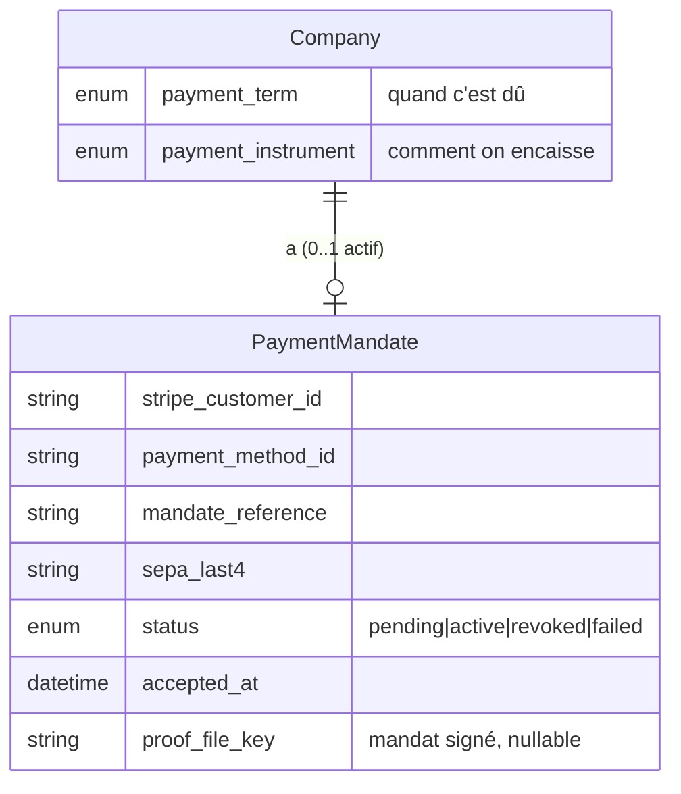
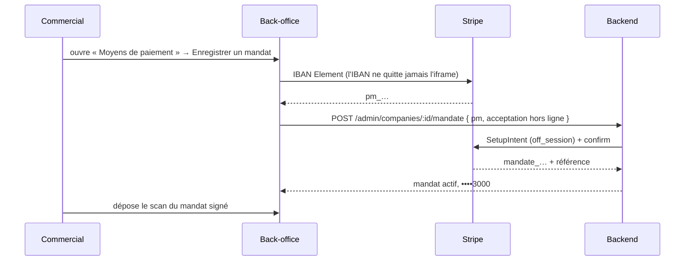

# Prélèvement SEPA — design

> Encaisser par **prélèvement** une clientèle qui ne saisira jamais rien
> elle-même : le registre existant arrive avec les coordonnées bancaires, et ce
> sont les **commerciaux** qui les reprennent.
>
> Trois décisions structurent tout : le prélèvement est un **instrument**, pas
> un terme de règlement ; **aucune donnée bancaire ne vit chez nous** ; et la
> pièce qui compte n'est pas le RIB mais le **mandat signé**.
>
> Décidé le **2026-08-11**. Prérequis lus :
> [`architecture-flux-commande-zero-friction.md`](architecture-flux-commande-zero-friction.md)
> (carte au checkout vs terme différé) et
> [`architecture-cycle-de-vie-commande.md`](architecture-cycle-de-vie-commande.md).
>
> **Statut : 🚧 tranche 2 livrée (2026-08-11).** L'enregistrement d'un mandat
> depuis le back-office fonctionne de bout en bout ; le **prélèvement** lui-même
> (tranches 3 et 4) n'existe pas encore. Les points ⚠️ restants sont signalés
> tranche par tranche au §7.

---

## 0. Le problème

Le socle paiement existant ne connaît qu'un chemin : `per_order` → carte au
checkout (Payment Element), sinon `not_required` → facturé hors ligne. Or la
majorité du portefeuille repris paie **par prélèvement**, sur un mandat déjà
signé, et n'ouvrira jamais un navigateur pour le redire.

Trois manques :

1. **Aucun instrument de paiement enregistré.** Une société n'a pas de moyen de
   paiement à elle ; chaque commande repart d'une carte saisie à la main.
2. **`PaymentTerm` mélange le quand et le comment.** `per_order` veut dire à la
   fois « dû à la commande » **et** « payé par carte ». Impossible d'exprimer
   « mensuel, prélevé en SEPA », qui est pourtant le cas central.
3. **Le cycle de règlement est synchrone.** `pending → paid|failed` suppose une
   réponse immédiate. Le SEPA répond en **jours**, et peut échouer _après_ la
   livraison.

## 1. Trois décisions

### A. L'instrument est distinct du terme

> **Révisé le 2026-08-11.** Entre-temps, `PaymentTerm` a disparu au profit de
> **crédits cumulatifs** (`grantedTerms`) : payer à la commande est le socle de
> tout le monde, et ce qui s'accorde, ce sont des délais. La confusion que cette
> décision voulait défaire n'existe donc plus au même endroit — un client au
> mensuel peut toujours régler une commande par carte.
>
> L'énumération `PaymentInstrument` ci-dessous **n'a pas été codée**, et ne le
> sera pas telle quelle : l'instrument se lit du mandat. Un mandat actif → on
> prélève ; pas de mandat → l'encaissement se fait hors système. Une colonne de
> plus serait une seconde source de vérité à tenir d'accord avec la première.

`PaymentTerm` répond à **quand** c'est dû. Un nouveau `PaymentInstrument` répond
à **comment** on encaisse :

| Instrument   | Ce que ça veut dire                                                 |
| ------------ | ------------------------------------------------------------------- |
| `card`       | carte saisie au checkout — le chemin actuel, défaut                 |
| `sepa_debit` | prélèvement sur mandat enregistré                                   |
| `offline`    | virement / chèque — encaissement hors système, réconcilié à la main |

Les deux se composent librement : `monthly` + `sepa_debit` est le contrat type du
portefeuille repris ; `per_order` + `card` reste la brioche du particulier.

> **Pourquoi pas une 5ᵉ valeur de `PaymentTerm`.** Ce serait plus court d'une
> table et faux d'une dimension : on ne pourrait plus prélever un client au mois
> sans lui inventer un terme « mensuel-mais-en-SEPA », et le jour où un client
> passe du prélèvement au virement, son échéance changerait avec — alors qu'elle
> n'a aucune raison de bouger.

### B. Aucune coordonnée bancaire dans notre base

L'IBAN ne transite ni par notre backend ni par nos colonnes. Le commercial le
saisit dans l'**IBAN Element** de Stripe (iframe Stripe.js) posé dans la fiche
client du back-office ; nous ne recevons qu'un identifiant de moyen de paiement.

Ce qu'on stocke, et rien d'autre :

> **Livré tel quel** — table `payment_mandates`, cf. migration
> `20260811200000_mandat_prelevement`. Une nuance : `stripe_customer_id` vit sur
> le mandat comme prévu, et le client Stripe est **réutilisé** d'un mandat au
> suivant pour la même société (sinon l'historique se fragmente côté Stripe).

| Champ                  | Exemple      | À quoi ça sert                           |
| ---------------------- | ------------ | ---------------------------------------- |
| `stripe_customer_id`   | `cus_…`      | rattache la société au client Stripe     |
| `payment_method_id`    | `pm_…`       | ce qu'on débite                          |
| `mandate_reference`    | `ABC-123`    | la référence opposable (RUM)             |
| `sepa_last4`           | `3000`       | « ••••3000 » à l'écran, pour reconnaître |
| `bank_code`, `country` | `BNPA`, `FR` | idem                                     |
| `status`               | `active`     | peut-on prélever, oui ou non             |
| `accepted_at`          | ISO          | date du consentement                     |
| `proof_file_key`       | clé R2       | le **mandat signé** scanné (cf. C)       |

Un IBAN en base, c'est de la donnée personnelle à chiffrer, tracer et purger,
pour un gain nul : sans ICS créancier ni lien bancaire, nous ne pourrions pas
prélever nous-mêmes de toute façon. Ce qu'on achète à Stripe, c'est précisément
de ne pas la détenir.

### C. La preuve, c'est le mandat signé — pas le RIB

Quand le client ne clique nulle part, l'acceptation déclarée à Stripe est **hors
ligne** ⚠️ : nous affirmons détenir un mandat signé. En contestation, la charge
de la preuve est sur nous — **8 semaines** sans justification, **13 mois** si le
débiteur conteste l'autorisation elle-même.

Donc la pièce à conserver est le **mandat signé scanné**, stocké comme le KBIS
(R2, port `KbisStore` généralisé en `DocumentStore`). Le RIB, lui, ne prouve
rien : il donne des coordonnées, pas un consentement. Il ne sera pas stocké.

> **Conséquence assumée.** Une société reprise sans mandat papier retrouvable est
> une société qu'on prélève **sans filet**. La fiche doit le dire — un mandat
> `active` sans `proof_file_key` s'affiche comme tel, pas comme un mandat normal.

## 2. Le modèle



Un agrégat à part plutôt que des colonnes sur `Company` : un mandat a un **cycle
de vie propre** (accepté, révoqué, remplacé), et on veut pouvoir en garder
l'historique — un mandat révoqué ne s'efface pas, il se date.

## 3. Les gestes

### Enregistrer un mandat (commercial, depuis la fiche)



Le commercial ne voit jamais l'IBAN qu'il vient de taper réapparaître, et le
backend ne l'a jamais eu.

### Reprendre le portefeuille existant ⚠️

**Ne pas recréer les mandats un par un via l'API.** Des mandats neufs perdent les
références historiques (RUM) et peuvent exiger une **re-signature** de toute la
clientèle — exactement ce que ce design cherche à éviter. Stripe expose un chemin
de **migration de mandats existants** (transmission du portefeuille à leur
support). C'est une démarche, pas du code : à engager **avant** la tranche 1.

## 4. Le cycle asynchrone — le vrai travail

Un prélèvement n'est pas une carte. Il faut ouvrir `PaymentStatus` :

```
not_required   facturé au terme, hors système
pending        intention créée, pas encore partie
processing     ← NOUVEAU : chez la banque, ~5 jours ouvrés
paid           encaissé
failed         rejeté (provision, compte clos, mandat révoqué)
refunded       remboursé
disputed       ← NOUVEAU : contesté après encaissement (8 sem. / 13 mois)
```

`processing` n'est pas cosmétique : c'est l'état où **la marchandise est livrée
et l'argent n'est pas là**. Le nier reviendrait à afficher « payée » sur une
commande qui peut encore échouer, et à découvrir l'impayé par le relevé bancaire.

Webhooks à traiter, en plus des deux actuels :

| Événement Stripe                | Effet                                                       |
| ------------------------------- | ----------------------------------------------------------- |
| `payment_intent.processing`     | `pending → processing`                                      |
| `payment_intent.succeeded`      | `processing → paid`                                         |
| `payment_intent.payment_failed` | `processing → failed` + **alerte staff**                    |
| `charge.dispute.created`        | `paid → disputed` + alerte staff                            |
| `mandate.updated` (révocation)  | mandat `revoked` → la société repasse à un autre instrument |

Le canal d'alerte existe déjà (cf.
[`architecture-alertes-compte-client.md`](architecture-alertes-compte-client.md)) :
un rejet de prélèvement est un fait commercial, il a sa place dans le même
journal que les autres.

## 5. Ce que ça change pour les paniers récurrents

Chaque échéance prélevée doit être **pré-notifiée** au débiteur (montant et date,
avant le débit). Le planificateur d'échéances devient donc émetteur d'un e-mail
de pré-notification — et cet e-mail est une **obligation**, pas un confort : sans
lui, le prélèvement est contestable.

## 6. À confirmer chez Stripe avant de coder ⚠️

Ces points sont donnés de mémoire et doivent être vérifiés dans la doc à jour :

1. Le nom et les conditions exactes de l'**acceptation hors ligne** d'un mandat
   SEPA (champ `mandate_data.customer_acceptance`).
2. Si une saisie d'IBAN **côté serveur** est permise, ou si l'IBAN Element est
   obligatoire — le design fait le choix de l'Element de toute façon, mais la
   réponse change ce qui est possible pour un import de masse.
3. La procédure de **migration de mandats existants** et ce qu'elle exige comme
   format de portefeuille.
4. Les délais réels de `processing` et les fenêtres de contestation applicables
   au schéma retenu (SEPA Core vs B2B — le schéma **B2B** raccourcit fortement la
   contestation, au prix d'une confirmation bancaire par le débiteur).

## 7. Découpage

| Tranche | Contenu                                                                                    | État                     |
| ------- | ------------------------------------------------------------------------------------------ | ------------------------ |
| **0**   | Démarche Stripe : migration du portefeuille + réponses aux 4 points du §6.                 | ⚠️ à engager             |
| **1**   | `PaymentInstrument` (contrat + Prisma + fiche).                                            | ❌ abandonnée (cf. §1.A) |
| **2**   | Agrégat `PaymentMandate`, port `MandateGateway`, enregistrement depuis le back-office.     | ✅ livrée                |
| **3**   | `processing` / `disputed` + webhooks + alertes staff. **La tranche qui protège l'argent.** | ⬜ à faire               |
| **4**   | Prélèvement des commandes au terme, puis pré-notification des échéances récurrentes.       | ⬜ à faire               |

**Ce que la tranche 2 permet, et ce qu'elle ne permet pas.** Un mandat peut être
enregistré, prouvé, révoqué et remplacé ; la fiche dit honnêtement lequel de ces
états tient. **Aucun euro ne part encore par prélèvement** : rien ne consomme le
mandat, et les échéances restent réclamées à la main. C'est volontaire —
encaisser sans la tranche 3 reviendrait à découvrir les impayés par le relevé
bancaire.

**Ce qu'il reste de plus urgent**, dans l'ordre : la démarche §0 auprès de Stripe
(sans elle, la reprise du portefeuille impose une re-signature de toute la
clientèle), puis la tranche 3.

## 8. Ce qui a été vérifié chez Stripe

Avant d'écrire la tranche 2, deux des quatre points du §6 ont été confirmés dans
la documentation à jour :

- **L'acceptation hors ligne existe** :
  `mandate_data[customer_acceptance][type] = offline`, avec `accepted_at`. C'est
  précisément le chemin prévu pour une clientèle dont les mandats sont sur
  papier — c'est ce que fait `StripeMandateGateway`.
- **L'IBAN Element reste la voie de saisie** : le navigateur crée le moyen de
  paiement, le serveur confirme un SetupIntent `off_session` avec ce moyen. Le
  backend ne voit jamais l'IBAN.

Les points **3** (procédure de migration du portefeuille) et **4** (délais réels
et fenêtres de contestation, SEPA Core vs B2B) restent ouverts : ce sont des
démarches, pas du code.
