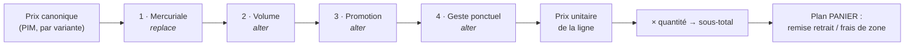

# La résolution de prix — un empilement d'étages datés

**État : 🟡 partiellement implémenté.** Les trois forks sont tranchés, et **S1 à
S3 sont livrés** : le domaine pur, la persistance branchée sur le checkout, et
l'écran de saisie. Restent **S4** (la trace figée sur la ligne et affichée au
client) et **S5** (la mercuriale par client). Date : 2026-08-15, forks et S1→S3
le 2026-08-17.

Voisins :

- [`architecture-conditionnements-pricing.md`](architecture-conditionnements-pricing.md)
  — la **frontière PIM / B2B**, tranchée le 2026-08-04 : le PIM porte le prix
  canonique par variante, le B2B porte les altérations. **Ce document ne la
  rediscute pas**, il traite ce que celui-là renvoyait à plus tard : « forme du
  dégressif B2B, à trancher au moment de coder » ;
- [`architecture-commande-immuable-avenants.md`](architecture-commande-immuable-avenants.md)
  — une commande est un fait clos. C'est de là que vient la règle de gel
  ci-dessous.

---

## Le problème

On veut un prix **granulaire** — par produit, par client, par quantité — et
**daté**, donc surchargeable dans le temps. Le mot qui manque est celui qui fait
tomber tout le reste :

> Deux règles visent le même produit. Elles **s'additionnent**, ou la plus
> spécifique **remplace** l'autre ?

Répondre « ça dépend » condamne le système : personne ne saura prédire un prix,
et le premier litige client sera invérifiable. Répondre « tout cumule » rend
impossible un tarif négocié qui _écrase_ le barème. Répondre « le plus
spécifique gagne » interdit d'appliquer une promo par-dessus une mercuriale.

Les deux réponses sont nécessaires. Elles ne peuvent simplement pas s'appliquer
au **même niveau**.

---

## La réponse : des étages ordonnés

- **À l'intérieur d'un étage** : une seule règle gagne, la plus spécifique. Elle
  **remplace** les autres candidates du même étage.
- **Entre étages** : ça **cumule**, dans un ordre déclaré une fois pour toutes.
- Un étage sans gagnante est **transparent** — il laisse passer le prix entrant.



| Étage          | Nature    | Porté par                       | Ce que c'est                                   |
| -------------- | --------- | ------------------------------- | ---------------------------------------------- |
| _(entrée)_     | —         | PIM                             | Le prix de liste de la variante                |
| 1 · Mercuriale | `replace` | Commercial, par client          | Le tarif négocié : **un prix**, pas une remise |
| 2 · Volume     | `alter`   | Réglages, barème global         | Paliers de quantité (100+ → −5 %)              |
| 3 · Promotion  | `alter`   | Commercial, datée par nature    | Opération temporaire                           |
| 4 · Geste      | `alter`   | Staff, sur une commande précise | Cas particulier, tracé                         |

L'intérêt de cette forme : le prix devient **explicable ligne à ligne**.

> Base 2,40 € → mercuriale Dupont 2,10 € → palier 100+ −5 % → **2,00 €**

C'est cette trace qu'il faut savoir rendre, pas seulement le nombre final.

---

## Deux natures, pas une

**`replace`** pose un prix. **`alter`** modifie le prix entrant.

Cette distinction n'est pas cosmétique, et c'est le piège principal du modèle.
Une mercuriale saisie en « −13 % » **suit le prix de base** : le jour où le
tarif de liste augmente, le prix négocié augmente avec lui. Ce n'est pas ce
qu'on a promis au client. Un tarif négocié est un **engagement en euros**, il
doit être stocké en euros.

L'inverse est vrai aussi : un dégressif de volume saisi en euros deviendrait
absurde si le prix de base doublait. Le volume est bien une altération.

`replace` n'a donc qu'une forme : un montant. `alter` porte une
[`PriceAlteration`](../../packages/b2b-ui/src/pricing/price-alteration.model.ts)
— sens, unité, grandeur.

---

## La spécificité, à l'intérieur d'un étage

Deux axes croisés :

| Portée produit                           | Audience                |
| ---------------------------------------- | ----------------------- |
| globale < catégorie < produit < variante | tous < segment < client |

La gagnante est la plus spécifique sur les deux axes. **Deux règles également
spécifiques dans le même étage, valides au même moment, sont une erreur de
saisie, pas un cas à arbitrer** : le résultat dépendrait de l'ordre de tri SQL,
donc du hasard.

On l'interdit **en base**, pas en applicatif — une contrainte d'exclusion
Postgres sur `(stage, scope, audience, tstzrange(valid_from, valid_to))`. Un
doublon devient impossible à insérer, et l'écran de saisie le dit au lieu de le
laisser passer.

---

## Le temps

Chaque règle porte `valid_from` / `valid_to` (borne haute exclue, `null` =
ouverte). La résolution prend un **instant de référence**.

**Quel instant : la passation.** Le prix résolu est ensuite **figé sur la ligne**
— ce que le code fait déjà, `unitPriceCents` est un snapshot. Sans ce gel, une
hausse tarifaire réécrirait le prix d'une commande déjà facturée. C'est
exactement le défaut qu'on vient de corriger sur le bon de production, en pire :
là, c'est de l'argent.

### ✅ Décidé le 2026-08-17 — un gabarit ne gèle pas de prix

La question posée ici — « jour de commande ou jour de service ? » — supposait
que le prix flotte entre les deux. Il ne flotte pas : **le prix se fige à la
passation**, et c'est déjà la règle. Ce qui manquait, c'était de dire **combien
de passations** a un panier récurrent.

**Réponse : une par échéance.** Un gabarit dit **quoi** commander, jamais
**combien** ça coûte. Chaque échéance qui part est sa propre passation : elle
résout le prix du jour, et le fige sur ses lignes comme n'importe quelle
commande.

Ce qui a tranché : l'alternative crée un **engagement tarifaire sans terme que
personne n'a signé**. Un client s'abonne un mardi, la farine augmente six mois
plus tard, et la marge s'érode sans que rien ne le signale — il faudrait alors
rendre la date de fin obligatoire pour borner l'engagement, donc compliquer
l'abonnement pour réparer une décision de prix.

Un client qui veut un prix tenu n'est pas sans réponse : c'est exactement ce que
fait la **mercuriale** (étage 1), datée, explicite et signée. Deux mécaniques,
deux intentions — les confondre donnerait un engagement implicite qu'aucun écran
ne montre.

Corollaire pour l'écran : une échéance à venir affiche un prix **estimé**, pas
promis. L'annoncer comme ferme serait mentir de bonne foi.

Attention à ne pas généraliser au-delà : une **commande ponctuelle** passée
aujourd'hui pour dans trois semaines garde le prix du jour où le client l'a
acceptée. Là, il y a bien eu une passation, et une seule.

---

## Trois garde-fous

**Arrondir une seule fois, en fin de chaîne.** Un arrondi par étage accumule
l'erreur ; à quatre étages on décale d'un centime, et un centime sur une facture
se voit. La chaîne travaille en rationnel, l'arrondi est la dernière opération.

**Des entiers persistés, jamais de flottant.** Déjà la règle ailleurs (`bp`,
`cents`), à ne pas relâcher ici.

**Le plancher.** Aujourd'hui `max(0, subtotal − discount)` ne protège que la
remise de panier. Une chaîne de quatre altérations peut passer sous le prix de
revient sans que rien ne bronche.

### ✅ Décidé le 2026-08-17 — un plancher à deux formes

Le plancher s'exprime **soit en fraction du prix canonique, soit en montant**,
au choix — exactement comme une altération porte un `mode` percent/amount. Même
vocabulaire, même value object, rien de neuf à apprendre :

```
PriceFloor = { mode: 'percent', value: bp }   // ex. 5000 bp = 50 % du canonique
           | { mode: 'amount',  value: cents } // ex. 150 = jamais sous 1,50 €
```

La fraction suit le tarif : le jour où le PIM augmente, le plancher monte avec
lui, sans que personne ait à le rouvrir. Le montant, lui, dit une limite absolue
— utile quand un article a un coût fixe connu (un emballage, une pièce achetée)
que le pourcentage ne saurait pas exprimer.

**Ce que ce plancher est, et n'est pas.** C'est un **garde-fou**, pas une règle
de marge. Il attrape le vrai risque — quatre étages qui se composent par
accident, une saisie à côté, un barème recopié une fois de trop — et il ne
prétend pas connaître un coût de revient qui n'existe nulle part dans le modèle.

Le prix de revient reste le plancher **juste**, et il reste hors d'atteinte : il
suppose un coût matière et une main-d'œuvre par déclinaison, donc un chantier PIM
entier. Le jour où il existera, il deviendra une troisième forme de `PriceFloor`
— l'union est ouverte pour ça, et rien de ce qui est décidé ici ne sera à défaire.

**Toucher le plancher n'est pas un détail à avaler en silence.** La résolution le
consigne dans sa trace (`floored: true`) : un prix qui a été relevé est un prix
dont une règle n'a pas produit son effet, et c'est exactement ce qu'on veut voir
avant qu'un client ne le remarque.

---

## La composition de deux pourcentages

### ✅ Décidé le 2026-08-17 — composition

−20 % puis −10 % font **−28 %** (0,8 × 0,9), jamais −30 %. Chaque étage
s'applique au prix **sortant** du précédent.

Deux raisons, et la première est la vraie : c'est la seule règle qui reste
cohérente quand on **insère un étage au milieu**. Avec l'addition, ajouter un
cinquième étage change rétroactivement le sens des quatre autres — le même
barème donnerait deux prix selon l'année où on l'a écrit. La seconde : la
composition ne peut jamais franchir zéro par accumulation, là où quatre étages
additifs à −30 % rendraient un prix négatif.

Le coût assumé : ce n'est **pas** ce qu'un commercial calcule de tête. Un client
au téléphone qui entend « −20 et −10 » comprendra −30. C'est précisément pour ça
que la **trace** existe (plus bas) : le prix ne s'annonce pas comme un
pourcentage global, il se lit ligne à ligne.

Corollaire : **l'ordre des étages est une règle commerciale**, pas un détail
d'implémentation. −20 % puis −5 € ≠ −5 € puis −20 %. Le tableau plus haut _est_
la décision.

---

## Ce que ce plan ne touche pas

Le pipeline vit sur le plan **ligne** : produit × client × date × quantité.

Les `CartAdjustment` actuels — remise de retrait, frais de zone — vivent sur le
plan **panier** : ils dépendent de l'**acheminement**, pas du produit. Ils se
composent **après**, sur le sous-total, exactement comme aujourd'hui. Les fondre
dans le même pipeline ferait passer un frais de livraison pour une altération de
prix produit, et le premier écran qui afficherait « pourquoi ce prix ? » y
mélangerait deux choses sans rapport.

---

## Où le sens devient enfin une donnée

Sur les deux réglages actuels, la **direction** d'une altération est
**structurelle** : une remise de retrait baisse, un frais de zone monte, et
l'emplacement où la valeur est lue suffit à le dire. C'est pourquoi
`price-alteration-field` les verrouille (`lockedDirection`) et pourquoi
`toCartAdjustment` laisse tomber le sens.

Ici, c'est différent : un **supplément** produit existe (une préparation
spéciale, un conditionnement particulier), et il vit dans le même étage qu'une
remise. Le sens doit donc être **persisté** avec la règle. C'est le premier
usage réel de `PriceAlteration.direction` — et la raison pour laquelle il a été
modélisé comme un type distinct du `CartAdjustment` du contrat.

---

## Esquisse de schéma

```
price_rules
  id              text pk
  stage           enum(mercuriale, volume, promotion, geste)
  nature          enum(replace, alter)          -- contraint par l'étage
  scope_type      enum(global, category, product, variant)
  scope_id        text null                     -- null ssi scope_type = global
  audience_type   enum(all, segment, company)
  audience_id     text null
  min_quantity    int null                      -- étage volume : le palier
  -- replace : amount_cents. alter : direction + mode + value.
  amount_cents    int null
  direction       enum(increase, decrease) null
  mode            enum(percent, amount) null
  value           int null                      -- bp ou cents, toujours > 0
  valid_from      timestamptz not null
  valid_to        timestamptz null
  created_by      text not null                 -- qui a posé cette règle
  created_at      timestamptz not null

  -- Plancher, deux formes (fork 3). NULL = pas de plancher propre : celui de la
  -- plateforme s'applique. `floor_mode` contraint `floor_value` comme ailleurs.
  floor_mode      enum(percent, amount) null
  floor_value     int null                      -- bp du canonique, ou cents

  EXCLUDE USING gist (
    stage WITH =, scope_type WITH =, scope_id WITH =,
    audience_type WITH =, audience_id WITH =, min_quantity WITH =,
    tstzrange(valid_from, valid_to) WITH &&
  )
```

La contrainte d'exclusion **est** la règle « deux règles également spécifiques
au même moment n'existent pas ». Elle vit en base parce qu'un contrôle
applicatif se contourne par une insertion concurrente.

`created_by` n'est pas décoratif : sur un tarif négocié, la question posée six
mois plus tard est toujours « qui a accordé ça ? ».

---

## Ce qui est figé sur la ligne

À la passation, la ligne garde **la trace**, pas seulement le nombre :

```
{
  basePriceCents,
  steps: [{ stage, ruleId, label, resultCents }],
  floored: false,          // le plancher a-t-il relevé le prix ?
  finalCents
}
```

Même raison que la provenance de l'acheminement : un chiffre seul ne se défend
pas. Avec la trace, le panier peut afficher « pourquoi ce prix », le service
client peut répondre, et une facture contestée se relit.

---

## Chantier

**Les trois forks sont tranchés** (2026-08-17). S1 peut commencer : ce qui restait
à décider portait sur le contenu de la fonction pure, pas sur son emballage.

Ce que les décisions ajoutent au chantier, et qui n'y était pas :

- l'échéance d'un panier récurrent **résout son prix au moment où elle part**,
  donc `resolvePrice` sera appelée par le planificateur, pas à la souscription ;
- la fonction pure porte le **plancher** et rend `floored` dans sa trace ;
- l'écran d'une échéance à venir affiche un prix **estimé**, jamais promis.

- [x] **S1 — le domaine, pur.** ✅ 2026-08-17 — `src/pricing/domain/` :
      `resolvePrice(canonical, rules, context, floor)`, la spécificité, l'ordre
      des étages, la composition, l'arrondi unique et le plancher. Sans Nest,
      sans base, sans horloge. 32 tests.

      Deux choses décidées **en écrivant**, et qui manquaient au doc :

                      - **l'audience prime sur la portée produit.** « La plus spécifique sur les
                        deux axes » ne suffisait pas : une règle *produit / tous* et une règle
                        *globale / ce client* ne se dominent pas. Sans ordre entre les axes, le
                        gagnant dépendait du tri SQL. Une règle qui vise CE client gagne — sinon
                        une promotion générale écraserait un engagement négocié ;
                      - **le calcul traverse la chaîne en `bigint`.** « Arrondir une seule fois »
                        oblige à porter un rationnel ; en `number`, trois pourcentages sur un
                        article à 1 000 € dépassent `MAX_SAFE_INTEGER`, donc le calcul devient
                        faux exactement sur les articles chers.

- [x] **S2 — la persistance.** ✅ 2026-08-17 — table `price_rules`, contrainte
      d'exclusion GiST, port de lecture, branchement dans
      `OrderDrafting.resolveLines`. 10 tests e2e sur un vrai Postgres.

      Trois choses apprises en branchant :

                  - **`valid_from/to` sont en `timestamptz`.** Sur des `timestamp` sans
                    fuseau, `tstzrange()` dépend du réglage de session, n'est donc pas
                    `IMMUTABLE`, et Postgres **refuse** la contrainte d'exclusion. Le type
                    juste était aussi le seul possible ;
                  - **`coalesce` dans la contrainte n'est pas cosmétique.** NULL n'entre
                    jamais en conflit avec NULL : sans lui, deux règles globales / tous
                    clients aux fenêtres superposées passaient — le cas le plus courant ;
                  - **zéro est un prix canonique valide.** `resolvePrice` le refusait par
                    réflexe de rigueur ; ça cassait le chemin existant d'une commande sans
                    rien à encaisser. Seul le négatif est refusé.

- [x] **S3 — Réglages → Tarification.** ✅ 2026-08-17 — le plancher devient une
      donnée posée sur une portée, les deux agrégats d'écriture, l'API admin, et
      l'écran en cinq colonnes de nœuds. 23 tests unitaires + 20 e2e.

      Ce que la slice a ajouté au modèle, et qui n'était pas au doc :

                  - **le plancher est SCOPÉ**, résolu comme une règle (le plus spécifique
                    gagne), et il n'a ni étage, ni audience, ni fenêtre. Chacune de ces
                    trois absences est une décision : ce n'est pas une couche de prix
                    mais la limite que l'empilement ne franchit pas ; il protège la
                    maison contre son propre barème, pas un client contre un autre ; et
                    un garde-fou daté s'ouvrirait tout seul un matin. Un plancher
                    d'article REMPLACE celui de sa famille — il peut donc l'abaisser,
                    et c'est le geste « cet article est une exception » ;
                  - **l'identifiant d'un plancher dérive de sa portée.** Deux limites sur
                    la même cible ne peuvent pas porter deux noms : re-poser devient un
                    upsert sur la clé primaire, sans lecture préalable ni course ;
                  - **un seul invariant contraint la nature d'un étage**, et non quatre
                    par symétrie : la MERCURIALE pose un prix. Les autres étages peuvent
                    poser ou altérer — « 100+ à 1,80 € fixe » et « cet article offert »
                    sont des gestes réels. Un invariant sans raison finit contourné
                    plutôt que compris.

              Trois choses apprises en branchant :

                  - **la contrainte d'exclusion ne remonte pas son SQLSTATE.**
                    L'adaptateur `pg` emballe la phrase de Postgres dans un
                    `DriverAdapterError` ; `23P01` n'apparaît ni dans le message ni dans
                    `meta`. On guette le NOM de la contrainte, qui est à nous et désigne
                    cette règle métier plutôt que n'importe quelle exclusion de la base ;
                  - **un segment de chemin vide ne s'apparie pas.** La limite globale a sa
                    propre route ; la supposition inverse rendait un 404 qui accusait la
                    donnée alors que c'était le routage ;
                  - **l'écran lit le catalogue qui FACTURE** (`ProductCatalogReader`), pas
                    la table du PIM. Les deux ne s'accordent pas encore (C5b) : un écran
                    de tarification bâti sur l'autre serait le simulateur d'un système
                    qu'on ne fait pas tourner.

              Ce que l'écran refuse de laisser croire :

                  - la limite est en 2ᵉ colonne mais s'applique en FIN de chaîne : elle est
                    dessinée en garde-fou, pas en étage, et ne s'allume que lorsqu'elle a
                    réellement relevé un prix ;
                  - une règle de famille supplantée par une règle d'article est **barrée**
                    et non masquée — sinon le lecteur additionne deux remises dont une
                    seule agit ;
                  - le prix montré est celui d'**un** article pour quelqu'un **sans tarif
                    négocié**. Un encart le dit avant la grille.

              **Reste ouvert** : la mercuriale n'est pas saisissable ici, faute de
              sélecteur de client — c'est S5.

- [ ] **S4 — la trace.** Figée sur la ligne, affichée au panier et sur la fiche
      commande.
- [ ] **S5 — la mercuriale par client.** L'étage 1, une fois les quatre autres
      éprouvés.

**Dépendance amont** : S2 suppose que le prix canonique vient du PIM plutôt que
du seed B2B hardcodé — c'est la « Phase B2B » de
[`architecture-conditionnements-pricing.md`](architecture-conditionnements-pricing.md).
S1 n'en dépend pas et peut se faire tout de suite.
