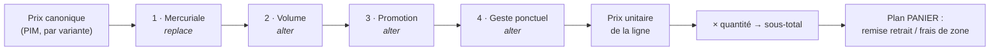

# La résolution de prix — un empilement d'étages datés

**État : 🟡 partiellement implémenté.** Les trois forks sont tranchés, et **S1 à
S3 sont livrés** : le domaine pur, la persistance branchée sur le checkout, et
l'écran de saisie. Restent **S4** (la trace figée sur la ligne et affichée au
client) et **S5** (la mercuriale par client). Date : 2026-08-15, forks et S1→S3
le 2026-08-17.

Voisins :

- [`architecture-conditionnements-pricing.md`](architecture-conditionnements-pricing.md)
  — la **frontière PIM / B2B**, tranchée le 2026-08-04 : le PIM porte le prix
  canonique par variante, le B2B porte les altérations. **Ce document ne la
  rediscute pas**, il traite ce que celui-là renvoyait à plus tard : « forme du
  dégressif B2B, à trancher au moment de coder » ;
- [`architecture-commande-immuable-avenants.md`](architecture-commande-immuable-avenants.md)
  — une commande est un fait clos. C'est de là que vient la règle de gel
  ci-dessous.

---

## Le problème

On veut un prix **granulaire** — par produit, par client, par quantité — et
**daté**, donc surchargeable dans le temps. Le mot qui manque est celui qui fait
tomber tout le reste :

> Deux règles visent le même produit. Elles **s'additionnent**, ou la plus
> spécifique **remplace** l'autre ?

Répondre « ça dépend » condamne le système : personne ne saura prédire un prix,
et le premier litige client sera invérifiable. Répondre « tout cumule » rend
impossible un tarif négocié qui _écrase_ le barème. Répondre « le plus
spécifique gagne » interdit d'appliquer une promo par-dessus une mercuriale.

Les deux réponses sont nécessaires. Elles ne peuvent simplement pas s'appliquer
au **même niveau**.

---

## La réponse : des étages ordonnés

- **À l'intérieur d'un étage** : une seule règle gagne, la plus spécifique. Elle
  **remplace** les autres candidates du même étage.
- **Entre étages** : ça **cumule**, dans un ordre déclaré une fois pour toutes.
- Un étage sans gagnante est **transparent** — il laisse passer le prix entrant.



| Étage          | Nature    | Porté par                       | Ce que c'est                                   |
| -------------- | --------- | ------------------------------- | ---------------------------------------------- |
| _(entrée)_     | —         | PIM                             | Le prix de liste de la variante                |
| 1 · Mercuriale | `replace` | Commercial, par client          | Le tarif négocié : **un prix**, pas une remise |
| 2 · Volume     | `alter`   | Réglages, barème global         | Paliers de quantité (100+ → −5 %)              |
| 3 · Promotion  | `alter`   | Commercial, datée par nature    | Opération temporaire                           |
| 4 · Geste      | `alter`   | Staff, sur une commande précise | Cas particulier, tracé                         |

L'intérêt de cette forme : le prix devient **explicable ligne à ligne**.

> Base 2,40 € → mercuriale Dupont 2,10 € → palier 100+ −5 % → **2,00 €**

C'est cette trace qu'il faut savoir rendre, pas seulement le nombre final.

---

## Deux natures, pas une

**`replace`** pose un prix. **`alter`** modifie le prix entrant.

Cette distinction n'est pas cosmétique, et c'est le piège principal du modèle.
Une mercuriale saisie en « −13 % » **suit le prix de base** : le jour où le
tarif de liste augmente, le prix négocié augmente avec lui. Ce n'est pas ce
qu'on a promis au client. Un tarif négocié est un **engagement en euros**, il
doit être stocké en euros.

L'inverse est vrai aussi : un dégressif de volume saisi en euros deviendrait
absurde si le prix de base doublait. Le volume est bien une altération.

`replace` n'a donc qu'une forme : un montant. `alter` porte une
[`PriceAlteration`](../../packages/b2b-ui/src/pricing/price-alteration.model.ts)
— sens, unité, grandeur.

---

## La spécificité, à l'intérieur d'un étage

Deux axes croisés :

| Portée produit                           | Audience                |
| ---------------------------------------- | ----------------------- |
| globale < catégorie < produit < variante | tous < segment < client |

La gagnante est la plus spécifique sur les deux axes. **Deux règles également
spécifiques dans le même étage, valides au même moment, sont une erreur de
saisie, pas un cas à arbitrer** : le résultat dépendrait de l'ordre de tri SQL,
donc du hasard.

On l'interdit **en base**, pas en applicatif — une contrainte d'exclusion
Postgres sur `(stage, scope, audience, tstzrange(valid_from, valid_to))`. Un
doublon devient impossible à insérer, et l'écran de saisie le dit au lieu de le
laisser passer.

---

## Le temps

Chaque règle porte `valid_from` / `valid_to` (borne haute exclue, `null` =
ouverte). La résolution prend un **instant de référence**.

**Quel instant : la passation.** Le prix résolu est ensuite **figé sur la ligne**
— ce que le code fait déjà, `unitPriceCents` est un snapshot. Sans ce gel, une
hausse tarifaire réécrirait le prix d'une commande déjà facturée. C'est
exactement le défaut qu'on vient de corriger sur le bon de production, en pire :
là, c'est de l'argent.

### ✅ Décidé le 2026-08-17 — un gabarit ne gèle pas de prix

La question posée ici — « jour de commande ou jour de service ? » — supposait
que le prix flotte entre les deux. Il ne flotte pas : **le prix se fige à la
passation**, et c'est déjà la règle. Ce qui manquait, c'était de dire **combien
de passations** a un panier récurrent.

**Réponse : une par échéance.** Un gabarit dit **quoi** commander, jamais
**combien** ça coûte. Chaque échéance qui part est sa propre passation : elle
résout le prix du jour, et le fige sur ses lignes comme n'importe quelle
commande.

Ce qui a tranché : l'alternative crée un **engagement tarifaire sans terme que
personne n'a signé**. Un client s'abonne un mardi, la farine augmente six mois
plus tard, et la marge s'érode sans que rien ne le signale — il faudrait alors
rendre la date de fin obligatoire pour borner l'engagement, donc compliquer
l'abonnement pour réparer une décision de prix.

Un client qui veut un prix tenu n'est pas sans réponse : c'est exactement ce que
fait la **mercuriale** (étage 1), datée, explicite et signée. Deux mécaniques,
deux intentions — les confondre donnerait un engagement implicite qu'aucun écran
ne montre.

Corollaire pour l'écran : une échéance à venir affiche un prix **estimé**, pas
promis. L'annoncer comme ferme serait mentir de bonne foi.

Attention à ne pas généraliser au-delà : une **commande ponctuelle** passée
aujourd'hui pour dans trois semaines garde le prix du jour où le client l'a
acceptée. Là, il y a bien eu une passation, et une seule.

---

## Trois garde-fous

**Arrondir une seule fois, en fin de chaîne.** Un arrondi par étage accumule
l'erreur ; à quatre étages on décale d'un centime, et un centime sur une facture
se voit. La chaîne travaille en rationnel, l'arrondi est la dernière opération.

**Des entiers persistés, jamais de flottant.** Déjà la règle ailleurs (`bp`,
`cents`), à ne pas relâcher ici.

**Le plancher.** Aujourd'hui `max(0, subtotal − discount)` ne protège que la
remise de panier. Une chaîne de quatre altérations peut passer sous le prix de
revient sans que rien ne bronche.

### ✅ Décidé le 2026-08-17 — un plancher à deux formes

Le plancher s'exprime **soit en fraction du prix canonique, soit en montant**,
au choix — exactement comme une altération porte un `mode` percent/amount. Même
vocabulaire, même value object, rien de neuf à apprendre :

```
PriceFloor = { mode: 'percent', value: bp }   // ex. 5000 bp = 50 % du canonique
           | { mode: 'amount',  value: cents } // ex. 150 = jamais sous 1,50 €
```

La fraction suit le tarif : le jour où le PIM augmente, le plancher monte avec
lui, sans que personne ait à le rouvrir. Le montant, lui, dit une limite absolue
— utile quand un article a un coût fixe connu (un emballage, une pièce achetée)
que le pourcentage ne saurait pas exprimer.

**Ce que ce plancher est, et n'est pas.** C'est un **garde-fou**, pas une règle
de marge. Il attrape le vrai risque — quatre étages qui se composent par
accident, une saisie à côté, un barème recopié une fois de trop — et il ne
prétend pas connaître un coût de revient qui n'existe nulle part dans le modèle.

Le prix de revient reste le plancher **juste**, et il reste hors d'atteinte : il
suppose un coût matière et une main-d'œuvre par déclinaison, donc un chantier PIM
entier. Le jour où il existera, il deviendra une troisième forme de `PriceFloor`
— l'union est ouverte pour ça, et rien de ce qui est décidé ici ne sera à défaire.

**Toucher le plancher n'est pas un détail à avaler en silence.** La résolution le
consigne dans sa trace (`floored: true`) : un prix qui a été relevé est un prix
dont une règle n'a pas produit son effet, et c'est exactement ce qu'on veut voir
avant qu'un client ne le remarque.

---

## La composition de deux pourcentages

### ✅ Décidé le 2026-08-17 — composition

−20 % puis −10 % font **−28 %** (0,8 × 0,9), jamais −30 %. Chaque étage
s'applique au prix **sortant** du précédent.

Deux raisons, et la première est la vraie : c'est la seule règle qui reste
cohérente quand on **insère un étage au milieu**. Avec l'addition, ajouter un
cinquième étage change rétroactivement le sens des quatre autres — le même
barème donnerait deux prix selon l'année où on l'a écrit. La seconde : la
composition ne peut jamais franchir zéro par accumulation, là où quatre étages
additifs à −30 % rendraient un prix négatif.

Le coût assumé : ce n'est **pas** ce qu'un commercial calcule de tête. Un client
au téléphone qui entend « −20 et −10 » comprendra −30. C'est précisément pour ça
que la **trace** existe (plus bas) : le prix ne s'annonce pas comme un
pourcentage global, il se lit ligne à ligne.

Corollaire : **l'ordre des étages est une règle commerciale**, pas un détail
d'implémentation. −20 % puis −5 € ≠ −5 € puis −20 %. Le tableau plus haut _est_
la décision.

---

## Ce que ce plan ne touche pas

Le pipeline vit sur le plan **ligne** : produit × client × date × quantité.

Les `CartAdjustment` actuels — remise de retrait, frais de zone — vivent sur le
plan **panier** : ils dépendent de l'**acheminement**, pas du produit. Ils se
composent **après**, sur le sous-total, exactement comme aujourd'hui. Les fondre
dans le même pipeline ferait passer un frais de livraison pour une altération de
prix produit, et le premier écran qui afficherait « pourquoi ce prix ? » y
mélangerait deux choses sans rapport.

---

## Où le sens devient enfin une donnée

Sur les deux réglages actuels, la **direction** d'une altération est
**structurelle** : une remise de retrait baisse, un frais de zone monte, et
l'emplacement où la valeur est lue suffit à le dire. C'est pourquoi
`price-alteration-field` les verrouille (`lockedDirection`) et pourquoi
`toCartAdjustment` laisse tomber le sens.

Ici, c'est différent : un **supplément** produit existe (une préparation
spéciale, un conditionnement particulier), et il vit dans le même étage qu'une
remise. Le sens doit donc être **persisté** avec la règle. C'est le premier
usage réel de `PriceAlteration.direction` — et la raison pour laquelle il a été
modélisé comme un type distinct du `CartAdjustment` du contrat.

---

## Esquisse de schéma

```
price_rules
  id              text pk
  stage           enum(mercuriale, volume, promotion, geste)
  nature          enum(replace, alter)          -- contraint par l'étage
  scope_type      enum(global, category, product, variant)
  scope_id        text null                     -- null ssi scope_type = global
  audience_type   enum(all, segment, company)
  audience_id     text null
  min_quantity    int null                      -- étage volume : le palier
  -- replace : amount_cents. alter : direction + mode + value.
  amount_cents    int null
  direction       enum(increase, decrease) null
  mode            enum(percent, amount) null
  value           int null                      -- bp ou cents, toujours > 0
  valid_from      timestamptz not null
  valid_to        timestamptz null
  created_by      text not null                 -- qui a posé cette règle
  created_at      timestamptz not null

  -- Plancher, deux formes (fork 3). NULL = pas de plancher propre : celui de la
  -- plateforme s'applique. `floor_mode` contraint `floor_value` comme ailleurs.
  floor_mode      enum(percent, amount) null
  floor_value     int null                      -- bp du canonique, ou cents

  EXCLUDE USING gist (
    stage WITH =, scope_type WITH =, scope_id WITH =,
    audience_type WITH =, audience_id WITH =, min_quantity WITH =,
    tstzrange(valid_from, valid_to) WITH &&
  )
```

La contrainte d'exclusion **est** la règle « deux règles également spécifiques
au même moment n'existent pas ». Elle vit en base parce qu'un contrôle
applicatif se contourne par une insertion concurrente.

`created_by` n'est pas décoratif : sur un tarif négocié, la question posée six
mois plus tard est toujours « qui a accordé ça ? ».

---

## Ce qui est figé sur la ligne

À la passation, la ligne garde **la trace**, pas seulement le nombre :

```
{
  basePriceCents,
  steps: [{ stage, ruleId, label, resultCents }],
  floored: false,          // le plancher a-t-il relevé le prix ?
  finalCents
}
```

Même raison que la provenance de l'acheminement : un chiffre seul ne se défend
pas. Avec la trace, le panier peut afficher « pourquoi ce prix », le service
client peut répondre, et une facture contestée se relit.

---

## Chantier

**Les trois forks sont tranchés** (2026-08-17). S1 peut commencer : ce qui restait
à décider portait sur le contenu de la fonction pure, pas sur son emballage.

Ce que les décisions ajoutent au chantier, et qui n'y était pas :

- l'échéance d'un panier récurrent **résout son prix au moment où elle part**,
  donc `resolvePrice` sera appelée par le planificateur, pas à la souscription ;
- la fonction pure porte le **plancher** et rend `floored` dans sa trace ;
- l'écran d'une échéance à venir affiche un prix **estimé**, jamais promis.

- [x] **S1 — le domaine, pur.** ✅ 2026-08-17 — `src/pricing/domain/` :
      `resolvePrice(canonical, rules, context, floor)`, la spécificité, l'ordre
      des étages, la composition, l'arrondi unique et le plancher. Sans Nest,
      sans base, sans horloge. 32 tests.

      Deux choses décidées **en écrivant**, et qui manquaient au doc :

                                                                      - **l'audience prime sur la portée produit.** « La plus spécifique sur les
                                                                        deux axes » ne suffisait pas : une règle *produit / tous* et une règle
                                                                        *globale / ce client* ne se dominent pas. Sans ordre entre les axes, le
                                                                        gagnant dépendait du tri SQL. Une règle qui vise CE client gagne — sinon
                                                                        une promotion générale écraserait un engagement négocié ;
                                                                      - **le calcul traverse la chaîne en `bigint`.** « Arrondir une seule fois »
                                                                        oblige à porter un rationnel ; en `number`, trois pourcentages sur un
                                                                        article à 1 000 € dépassent `MAX_SAFE_INTEGER`, donc le calcul devient
                                                                        faux exactement sur les articles chers.

- [x] **S2 — la persistance.** ✅ 2026-08-17 — table `price_rules`, contrainte
      d'exclusion GiST, port de lecture, branchement dans
      `OrderDrafting.resolveLines`. 10 tests e2e sur un vrai Postgres.

      Trois choses apprises en branchant :

                                                                  - **`valid_from/to` sont en `timestamptz`.** Sur des `timestamp` sans
                                                                    fuseau, `tstzrange()` dépend du réglage de session, n'est donc pas
                                                                    `IMMUTABLE`, et Postgres **refuse** la contrainte d'exclusion. Le type
                                                                    juste était aussi le seul possible ;
                                                                  - **`coalesce` dans la contrainte n'est pas cosmétique.** NULL n'entre
                                                                    jamais en conflit avec NULL : sans lui, deux règles globales / tous
                                                                    clients aux fenêtres superposées passaient — le cas le plus courant ;
                                                                  - **zéro est un prix canonique valide.** `resolvePrice` le refusait par
                                                                    réflexe de rigueur ; ça cassait le chemin existant d'une commande sans
                                                                    rien à encaisser. Seul le négatif est refusé.

- [x] **S3 — Réglages → Tarification.** ✅ 2026-08-17 — le plancher devient une
      donnée posée sur une portée, les deux agrégats d'écriture, l'API admin, et
      l'écran en cinq colonnes de nœuds. 23 tests unitaires + 20 e2e.

      Ce que la slice a ajouté au modèle, et qui n'était pas au doc :

                                                                  - **le plancher est SCOPÉ**, résolu comme une règle (le plus spécifique
                                                                    gagne), et il n'a ni étage, ni audience, ni fenêtre. Chacune de ces
                                                                    trois absences est une décision : ce n'est pas une couche de prix
                                                                    mais la limite que l'empilement ne franchit pas ; il protège la
                                                                    maison contre son propre barème, pas un client contre un autre ; et
                                                                    un garde-fou daté s'ouvrirait tout seul un matin. Un plancher
                                                                    d'article REMPLACE celui de sa famille — il peut donc l'abaisser,
                                                                    et c'est le geste « cet article est une exception » ;
                                                                  - **l'identifiant d'un plancher dérive de sa portée.** Deux limites sur
                                                                    la même cible ne peuvent pas porter deux noms : re-poser devient un
                                                                    upsert sur la clé primaire, sans lecture préalable ni course ;
                                                                  - **un seul invariant contraint la nature d'un étage**, et non quatre
                                                                    par symétrie : la MERCURIALE pose un prix. Les autres étages peuvent
                                                                    poser ou altérer — « 100+ à 1,80 € fixe » et « cet article offert »
                                                                    sont des gestes réels. Un invariant sans raison finit contourné
                                                                    plutôt que compris.

                                                              Trois choses apprises en branchant :

                                                                  - **la contrainte d'exclusion ne remonte pas son SQLSTATE.**
                                                                    L'adaptateur `pg` emballe la phrase de Postgres dans un
                                                                    `DriverAdapterError` ; `23P01` n'apparaît ni dans le message ni dans
                                                                    `meta`. On guette le NOM de la contrainte, qui est à nous et désigne
                                                                    cette règle métier plutôt que n'importe quelle exclusion de la base ;
                                                                  - **un segment de chemin vide ne s'apparie pas.** La limite globale a sa
                                                                    propre route ; la supposition inverse rendait un 404 qui accusait la
                                                                    donnée alors que c'était le routage ;
                                                                  - **l'écran lit le catalogue qui FACTURE** (`ProductCatalogReader`), pas
                                                                    la table du PIM. Les deux ne s'accordent pas encore (C5b) : un écran
                                                                    de tarification bâti sur l'autre serait le simulateur d'un système
                                                                    qu'on ne fait pas tourner.

                                                              Ce que l'écran refuse de laisser croire :

                                                                  - la limite est en 2ᵉ colonne mais s'applique en FIN de chaîne : elle est
                                                                    dessinée en garde-fou, pas en étage, et ne s'allume que lorsqu'elle a
                                                                    réellement relevé un prix ;
                                                                  - une règle de famille supplantée par une règle d'article est **barrée**
                                                                    et non masquée — sinon le lecteur additionne deux remises dont une
                                                                    seule agit ;
                                                                  - le prix montré est celui d'**un** article pour quelqu'un **sans tarif
                                                                    négocié**. Un encart le dit avant la grille.

                                                              **Reste ouvert** : la mercuriale n'est pas saisissable ici, faute de
                                                              sélecteur de client — c'est S5.

- [ ] **S4 — la trace.** Figée sur la ligne, affichée au panier et sur la fiche
      commande.
- [ ] **S5 — la mercuriale par client.** L'étage 1, une fois les quatre autres
      éprouvés.

**Dépendance amont** : S2 suppose que le prix canonique vient du PIM plutôt que
du seed B2B hardcodé — c'est la « Phase B2B » de
[`architecture-conditionnements-pricing.md`](architecture-conditionnements-pricing.md).
S1 n'en dépend pas et peut se faire tout de suite.

---

## L'élasticité : ce qu'une altération coûte en volume

**✅ Décidé le 2026-08-17.** Une remise ne se juge pas au pourcentage, elle se
juge à ce qu'elle **oblige à vendre**. Baisser de 20 % impose de vendre ×1,25
pour encaisser le même chiffre — et ce nombre-là est celui qu'un commercial doit
avoir sous les yeux au moment où il pose la règle, pas six mois plus tard.

### Iso-chiffre, pas iso-marge

Le ratio se calcule **à chiffre d'affaires constant** :

```
ratio = prix_avant / prix_après        (−20 % ⇒ 2,00 / 1,60 = ×1,25)
volume_requis = volume_de_référence × ratio
```

L'iso-**marge** serait plus juste commercialement et reste **hors d'atteinte** :
le prix de revient n'existe nulle part dans le modèle (cf. le plancher, plus
haut). Afficher une marge supposerait d'inventer un coût, et un chiffre inventé
dans un tableau de bord se lit comme une mesure. L'écran écrit donc « à chiffre
constant » en toutes lettres, et le calcul est structuré pour qu'un coût de
revient devienne une seconde base le jour où le PIM en portera un.

### Deux comparaisons, côte à côte

Elles répondent à deux questions différentes, et aucune ne remplace l'autre :

| Comparaison           | Ce qu'elle dit                                 | Sa limite                                         |
| --------------------- | ---------------------------------------------- | ------------------------------------------------- |
| **Avant / après**     | Est-ce que _cette règle_ a produit son effet ? | Sans recul, la fenêtre « après » ne prouve rien   |
| **Fenêtre glissante** | Où j'en suis aujourd'hui vs l'objectif         | Ne distingue pas la règle de ce qui bougeait déjà |

L'avant/après prend deux fenêtres de **même durée**, de part et d'autre de
`valid_from`. Quand la seconde est trop courte pour conclure, l'écran le dit
plutôt que d'afficher un écart qui n'a pas de sens.

---

## Ce que la limite EST — et ce qu'elle n'est pas

**✅ Décidé le 2026-08-17.** La limite exprime une **intention de performance**.
Ce n'est **pas** une marge calculée à partir de coûts opérationnels, et c'est un
choix, pas un manque.

### Une marge se dérive, une limite se décide

Calculer une marge oblige à trancher quinze arbitraires : matière seule ou
main-d'œuvre incluse, quelle clé pour l'amortissement du four, quel rendement,
quelles pertes, quelle moyenne mobile sur un beurre qui bouge chaque mois. Chacun
de ces arbitraires se propage ensuite **dans un prix**.

La limite court-circuite tout cela. Elle dit : « je ne descends pas sous 1,50 € ».
Un nombre, une intention, un auteur, une date.

### Le pire cas n'est pas l'absence de marge, c'est la marge FAUSSE

Un coût de revient à 15 % près — ce qui est optimiste sur du frais — affiché dans
un tableau de bord porte l'**autorité d'une mesure**. On prend alors des
décisions confiantes et fausses, et rien dans l'écran ne signale le problème.

Une limite ne prétend jamais être une mesure. C'est un **jugement**, donc elle se
conteste, se discute, et se change en un endroit.

Elle parle aussi la langue de celui qui décide. Personne ne dit « il me faut 62 %
de marge brute sur le croissant ». On dit « pas sous 1,50 ». Le modèle encode la
phrase réellement prononcée.

### Deux niveaux, deux intentions distinctes

| Niveau            | Nom dans le code | Ce qu'il exprime                                                           |
| ----------------- | ---------------- | -------------------------------------------------------------------------- |
| **Limite dure**   | `hard`           | la performance en dessous de laquelle on ne descend pas, quoi qu'il arrive |
| **Limite souple** | `dynamic`        | la performance qu'on **accepte de céder en échange** de volume             |

La limite souple n'est pas une exigence relâchée : c'est un **autre marché**.
Moins par unité contre plus d'unités. Les deux ensemble encodent une politique —
« ce que je veux par unité » et « ce que j'accepterais par unité si le volume
compense » — et cette politique se lit d'un coup d'œil, ce qu'une grille de coûts
ne permet jamais.

### La limite de ce choix, qu'il faut connaître

Une intention **date**. Le beurre prend 30 %, le tarif de liste bouge, et la
limite reste où elle était, en silence. Elle était juste en août, elle ne l'est
plus en février, et l'écran continue de l'afficher avec le même aplomb.

Le correctif n'est pas un coût de revient — ce serait revenir sur la décision. Il
tient en un **signal de dérive** : la limite porte déjà `createdBy` et
`updatedAt` ; comparer le canonique d'aujourd'hui à celui du jour où elle a été
posée suffit à demander « ton intention date de huit mois et le tarif a bougé de
12 %, tu la confirmes ? ». Ça ne calcule aucune marge et ne remplace aucune
décision : ça rappelle qu'une décision existe, et qu'elle a vieilli.

**✅ Livré le 2026-08-17.** La limite fige, à la pose, le tarif **représentatif**
des articles qu'elle vise — la **médiane** de leurs prix canoniques. Médiane et
non moyenne : une limite de famille ne doit pas se juger déplacée parce qu'une
pièce montée y côtoie des croissants.

Trois décisions y vivent :

- **une limite en FRACTION ne dérive pas.** « Jamais sous 50 % du tarif » suit le
  tarif par construction. Seule une limite en euros peut se retrouver décalée —
  et c'est ce qui rend ce signal petit plutôt qu'un tableau de bord de plus ;
- **l'âge seul n'alarme jamais.** Une limite posée il y a deux ans sur un tarif
  qui n'a pas bougé est aussi juste qu'au premier jour. Le seuil porte sur
  l'écart (5 %), pas sur l'ancienneté : alerter sur l'âge apprendrait au staff à
  ignorer l'alerte, ce qui est pire que ne pas l'avoir ;
- **confirmer est un geste à part** (`POST …/confirm`), pas un `PUT` déguisé. Sans
  lui, la seule façon d'éteindre le rappel serait de MODIFIER la limite — donc de
  changer une décision pour se débarrasser d'un signal.

Absence de référence ⇒ **silence**, jamais « 0 % d'écart » : ce serait faire
passer une absence de mesure pour une confirmation, et précisément sur les
limites les plus anciennes.

---

## Le plancher à deux étages

**✅ Décidé le 2026-08-17.** Un plancher unique force à choisir entre protéger et
laisser négocier. Il en faut donc deux, et une condition entre les deux :

- **le plancher dur** — jamais franchi, quoi qu'il arrive ;
- **le plancher dynamique** — plus bas, **déverrouillé** par le volume qui
  compense la baisse ;
- **la condition**, à deux termes, dont le défaut proposé par l'écran est
  exactement le ratio iso-chiffre calculé ci-dessus.

```
PriceFloorPolicy = {
  hard:    PriceFloor,                       // le mur
  dynamic: { floor: PriceFloor, unlock: {    // la porte, et sa clé
    minQuantity:      int | null,            // sur LA COMMANDE
    minVolumeRatioBp: int | null,            // sur une FENÊTRE observée
  }} | null,
}
```

**Les deux conditions doivent être remplies** — la plus stricte gagne. Une
condition `null` est réputée remplie ; les deux `null` feraient du plancher
dynamique un plancher tout court, et c'est refusé à la saisie.

### Le piège du volume observé, et ce qui le neutralise

Faire dépendre un prix de l'**historique** est dangereux : le même panier se
facturerait deux prix selon le mois, et le prix cesserait d'être explicable sans
rejouer l'historique. C'est la raison pour laquelle cette option a été signalée
avant d'être construite.

**Ce qui la rend tenable est la trace** (S4a, livrée le même jour). La décision
de déverrouillage est **évaluée une fois, à la passation, et figée avec le
prix** : quel étage de plancher a mordu, sur quel volume mesuré, contre quel
objectif. Une commande reste donc explicable à partir d'elle-même, même quand
l'historique a bougé — ce qui est exactement la propriété que le plancher
dynamique menaçait.

Corollaire, et il n'est pas négociable : **le volume observé ne se relit
jamais**. On ne recalcule pas le prix d'une commande passée.

### Faute de mesure, on protège

Si le volume de référence est absent (article neuf, aucun historique), la
condition de volume est **non remplie** : le plancher **dur** s'applique. Le
défaut penche du côté qui protège la maison — un déverrouillage par ignorance
serait une remise accordée par un trou dans les données.

## Le barème de volume : une échelle, pas N règles

_(2026-08-17 — implémenté)_

« 50+ à −10 % » et « 100+ à −5 % » sont **deux règles parfaitement
valides**, prises séparément. Ensemble, elles forment un barème que
personne n'a voulu : un client qui passe de 90 à 100 pièces voit sa remise
**fondre**. L'incohérence n'était exprimable nulle part — il n'existait
aucun objet d'où la voir.

L'échelle crée cet objet, et porte trois refus qui n'existaient pas :

| Refus                               | Pourquoi une règle isolée ne pouvait pas le porter |
| ----------------------------------- | -------------------------------------------------- |
| barème **régressif**                | chaque palier, seul, est valide                    |
| deux paliers **à la même quantité** | le gagnant dépendrait de l'ordre de saisie         |
| échelle **vide**                    | une règle vide n'existe pas, une échelle vide si   |

Deux décisions de modèle méritent leur ligne.

**Une seule unité pour toute l'échelle.** C'est ce qui rend la progression
_vérifiable_ : « 50+ à −5 %, 100+ à −0,20 € » ne se compare pas sans
connaître l'article. Un champ unique rend le mélange **impossible**, pas
interdit.

**Datée, et sans recouvrement.** Un barème a une fenêtre — on prépare
septembre au mois d'août — mais **deux barèmes ne se recouvrent jamais sur
la même cible**. Du coup l'identifiant ne dérive plus de la cible (deux
barèmes successifs coexistent), et l'unicité se déplace : elle n'est plus
absolue, elle vaut **à un instant donné**, tenue par une contrainte
d'exclusion GiST partielle. Un contrôle applicatif se contournerait par
une insertion concurrente ; l'agrégat, lui, ne voit qu'une échelle à la
fois.

**Le pipeline n'a pas bougé.** `ladderAsRule` rend l'échelle sous la forme
de la règle d'étage volume qu'elle est à cette quantité : la résolution
continue de ne connaître que des `PriceRule`, la spécificité continue
d'arbitrer (un barème de produit l'emporte sur celui de sa famille), et la
trace figée porte l'identifiant de l'échelle.

### Ce que l'écran en montre

La colonne du prix affiche la **grille** : le prix à chaque palier, sous le
prix unitaire. C'est la réponse à la question qu'un commercial pose au
téléphone — « à combien je lui fais les 100 ? » — et elle n'existait nulle
part, l'en-tête disant même que les paliers de volume ne s'y voyaient pas.

Chaque ligne est une **résolution complète** à la quantité du palier, pas
un « canonique × (1 − remise) » : ce dernier mentirait dès qu'une promotion
compose avec le palier, ou qu'un plancher le relève.

Le panneau saisit **tous les paliers ensemble**. Palier par palier, il
existerait un instant où « 50+ à −10 % » est posé et « 100+ à −5 % » pas
encore — un barème régressif, exactement ce que le modèle refuse.

### La porte fermée : l'étage volume ne se saisit plus

_(2026-08-17 — implémenté)_

Tant que le barème et la **règle volume libre** coexistaient, les trois
refus ci-dessus étaient contournables sans le vouloir : on posait « 100+ à
−5 % » comme une règle ordinaire, à côté d'un barème accordant −10 % dès
50, et le palier isolé l'emportait **par spécificité** — deux décisions au
même étage, dont aucune ne voyait l'autre.

L'étage est donc fermé à la saisie, sur trois épaisseurs :

| Où                              | Comment                                                     |
| ------------------------------- | ----------------------------------------------------------- |
| le fil (`@lfd/contracts`)       | `authoredPriceStageSchema` — `volume` hors de l'énumération |
| le domaine (`PricingRuleDraft`) | `AuthoredPriceStage` : l'étage est **inexprimable**         |
| l'écran (panneau Altération)    | l'option a disparu, le champ « à partir de » avec elle      |

Le type plutôt qu'un refus à l'exécution : un `throw` aurait laissé le code
appelant compiler puis échouer. Aucune erreur de domaine n'est née de ce
lot — il n'y a rien à refuser quand il n'y a rien à écrire.

**L'étage `volume` reste** dans `PRICE_STAGES`, et ce n'est pas une
inconséquence : `ladderAsRule` l'emprunte au moment du calcul, et toutes
les traces déjà figées le nomment. L'état persisté d'une règle l'accepte
donc toujours — les règles volume d'avant le barème existent, archivées, et
une facture les cite. Ce qui disparaît est la façon de l'écrire, pas
l'étage.

## Deux marqueurs : l'écran daté, et la comparaison

_(2026-08-17 — implémenté)_

Tout ce que l'écran montre est **déjà daté** : les fenêtres de validité, les
suspensions, les archivages, et `resolvePrice` qui prend un instant. Il ne
manquait qu'un paramètre — `GET /admin/pricing?at=<ISO>` — et **une clause à
corriger** :

> **« Archivée » se lit à l'instant demandé, pas au présent.**

La lecture excluait `archived_at IS NOT NULL`. Une règle rangée hier
s'appliquait pourtant le mois dernier : sans `OR archived_at > at`, le passé
s'appauvrissait à chaque rangement — silencieusement, ce qui est le pire des
deux. Même correction pour les limites et les barèmes, et les filtres de
suspension comparent désormais à l'instant lu plutôt qu'à `null`.

### Ce que la lecture datée dit, et ce qu'elle ne dit pas

| Elle répond à                                       | Elle ne répond PAS à                   |
| --------------------------------------------------- | -------------------------------------- |
| quelles **décisions** étaient en vigueur ce jour-là | quel prix a été **facturé** ce jour-là |

Le **tarif canonique vient du PIM au présent** — il n'est pas historisé. Une
lecture passée applique donc les décisions d'hier aux tarifs d'aujourd'hui.
L'écran l'écrit en toutes lettres, et la vérité de ce qui a été facturé vit
là où elle a toujours vécu : la **trace figée** sur la ligne de commande.
Historiser le canonique serait refaire le PIM ; ce n'est pas ce projet.

### La comparaison

`GET /admin/pricing/comparison?from=&to=` met les deux lectures côte à côte et
y ajoute ce qu'aucune des deux ne contient : le **volume vendu sur la fenêtre
qui les sépare**, comparé à la fenêtre **miroir** juste avant, de même durée —
comparer trente jours à quatre-vingt-dix ferait passer une saison pour un effet.

Par article : le prix aux deux instants, l'écart en points de base, les pièces
vendues et leur variation. Une variation depuis **zéro** rend `null` plutôt
qu'un chiffre : partir de rien n'est pas une variation, c'est une apparition, et
« +∞ % » sur une nouveauté ne dit rien de ce qu'on a décidé.

L'écran n'affiche que les articles **qui ont bougé**, du plus gros écart au plus
petit : quatre-vingt-douze lignes dont trois portent une information noieraient
exactement ce qu'on est venu chercher.

## Ce qu'une portée peut porter

_(2026-08-17 — implémenté)_

Une limite s'exprime de deux façons — une **fraction** du tarif, ou un
**montant** en euros — mais les deux n'ont pas la même portée d'emploi.

> **Un montant ne veut rien dire au-delà d'un article.**

« Jamais sous 1,50 € » sur tout le catalogue laisserait passer une pièce
montée à 1,50 € et relèverait un croissant qui se vend 2,00 € : le même
mur, deux effets opposés. Une fraction, elle, suit l'article — « jamais
sous 60 % du tarif » protège les deux à leur échelle.

| Portée                | Fraction (%) | Montant (€) |
| --------------------- | :----------: | :---------: |
| tout le catalogue     |      ✅      |     ❌      |
| famille               |      ✅      |     ❌      |
| produit / déclinaison |      ✅      |     ✅      |

Le refus vit dans l'**agrégat**, pas dans le schéma de fil : c'est une
règle du modèle, et l'import comme le seed doivent la rencontrer aussi.
Il vaut pour le mur **et** pour la porte — une porte est une limite, comme
lui. L'écran, de son côté, ne propose pas le choix au-delà d'un article et
écrit pourquoi : offrir une option pour la refuser ensuite est la façon la
plus sûre de faire saisir deux fois la même chose.

### Quand deux altérations se recouvrent

Une promotion du 1er au 20, un geste du 15 au 30 : **du 15 au 20, les
deux jouent**. Personne ne l'a décidé — chacune a été posée pour de bonnes
raisons, à des semaines d'intervalle — et le client, lui, paie le cumul.

Chaque famille porte donc une **frise** : une ligne par règle sur un axe de
dates commun, et sous les barres, les tranches où plusieurs règles sont en
vigueur. Le recouvrement se **voit** au lieu de se déduire en comparant
quatre dates de tête.

> **Elle porte la LIGNÉE — catalogue puis famille — et non le seul catalogue.**

_(déplacée là le 2026-08-17, après avoir vécu sur la bande du catalogue.)_
La raison est structurelle : deux règles de **même étage et même portée**
ne peuvent pas se recouvrir, la contrainte d'exclusion l'interdit. Une
frise du seul catalogue n'avait donc presque rien à montrer — au mieux une
promotion croisant un geste. C'est **entre niveaux** que le croisement
arrive, tout le temps : une promotion de famille recouvre la promotion du
catalogue, et **l'évince**.

Le tableau montrait déjà la règle barrée quand elle était supplantée. Il ne
disait ni **à partir de quand**, ni **jusqu'à quand** — les deux seules
choses qu'on veut savoir. La frise le dit en creusant la barre de
l'évincée sur la tranche exacte où elle perd : elle n'a pas disparu, elle
ne produit simplement rien.

Qui gagne se décide avec `compareSpecificity`, **la comparaison qui
facture** — la réimplémenter dans la frise aurait donné un écran qui
désigne un gagnant et une caisse qui en applique un autre.

Deux choses que cette frise ne confond pas :

- **le cumul n'est pas une somme.** −20 % puis −10 % font **−28 %**, parce
  que la seconde s'applique au prix sortant de la première. Le chiffre est
  calculé côté serveur, avec l'arithmétique exacte qui facture — un cumul
  recalculé dans le navigateur finirait par annoncer un prix que la caisse
  ne pratique pas ;
- **tout recouvrement n'est pas un cumul.** Dans un **même étage**, la
  règle la plus spécifique évince l'autre : elles ne s'additionnent pas.
  L'écran dit alors « la plus précise gagne » et ne montre aucun
  pourcentage. Confondre les deux ferait crier au danger là où il n'y a
  qu'une relève.

Le cumul se tait aussi dès qu'une des règles n'est pas une altération en
pourcentage : un montant en euros ne se compose pas en fraction sans
connaître l'article, et cette vue n'en connaît aucun.

Et le cumul ne compte **que les gagnantes** : une évincée ne produit rien,
et l'inclure afficherait un chiffre que la caisse ne facture pas. Sur une
tranche où la famille évince le catalogue puis compose avec un geste, c'est
la famille × le geste — jamais les trois.

Une règle **suspendue** ne recouvre rien — elle n'agit plus, et l'annoncer
ferait chercher un cumul qui n'existe pas.

### Le barème sur la frise

_(2026-08-17 — implémenté)_

Le barème a sa propre table, et la frise ne le voyait donc plus. Elle
disait **moins que la vérité**, ce qui est pire qu'en dire peu : une frise
sans barème se lit « rien d'autre ne joue », alors que « −20 % sur le
catalogue **et** −10 % dès 50 » est le cumul le plus banal du modèle.

Il y entre par `ladderAtTier`, qui rend l'échelle sous la forme de la règle
d'étage volume qu'elle est **à un palier donné**. Ni la résolution ni
l'arbitrage ne bougent : deux barèmes de niveaux différents s'évincent
comme deux règles, puisqu'ils partagent l'étage volume.

> **Un barème n'a pas un cumul — il en a autant que de paliers.**

Composer avec un seul chiffre obligerait à choisir un palier, donc à
afficher un pourcentage faux pour toutes les autres quantités. La frise
calcule les **deux bouts** — l'échelle à son premier palier, à son dernier
— et l'écran annonce « de −28 % à −36 % » quand ils diffèrent.

Les prix exacts, eux, restent dans la **colonne du prix** : là, chaque
palier est une résolution complète sur un article donné. Une frise couvre
une famille entière, elle ne peut pas être exacte au centime — et ne le
prétend pas.

### Les altérations du catalogue

Une règle de portée `global` existait dans le modèle depuis le premier
jour, et n'était visible nulle part : l'écran n'offrait de « + » que sur
les familles et les articles. La **bande du catalogue**, en tête de
l'écran, porte désormais les deux décisions les plus larges — la limite
dont chaque famille hérite, et les altérations que rien de plus précis n'a
évincées.

C'est le bon endroit pour la hausse de saison ou le geste de fin d'année :
un seul geste plutôt qu'un par famille, et une seule ligne à retirer quand
l'opération se termine.

## Le cycle de vie d'une décision, et le journal qui la raconte

_(2026-08-17 — implémenté)_

Une règle tarifaire cessait d'exister d'une seule façon : `DELETE`. C'est
un problème double. Le four tombe en panne un mardi après-midi et la
promotion doit s'arrêter aujourd'hui — la seule issue était de supprimer
la règle, ou de mentir sur sa fenêtre. Et une règle supprimée emporte
l'explication d'une facture qui, elle, reste.

### Trois états, deux sorties qui n'ont rien à voir

| État           | Elle agit ?             | Son créneau |
| -------------- | ----------------------- | ----------- |
| **en vigueur** | quand sa fenêtre le dit | occupé      |
| **en pause**   | non                     | **réservé** |
| **archivée**   | non, définitivement     | **libéré**  |

La différence entre les deux sorties **est** le sujet. Elle vit dans une
seule clause SQL :

```sql
ALTER TABLE price_rules
  ADD CONSTRAINT price_rules_no_overlap
  EXCLUDE USING gist (…)
  WHERE (archived_at IS NULL);
```

Archiver doit **libérer** le créneau : sinon une règle rangée l'an dernier
interdirait pour toujours d'en poser une semblable, et le staff n'aurait
d'autre issue que la suppression — donc l'effacement d'une explication.
Suspendre doit le **garder** : sans ça, quelqu'un poserait une jumelle
pendant la pause, et la reprise échouerait sur un chevauchement que
personne n'a vu venir. La promotion deviendrait irrécupérable le jour même
où l'on veut la rallumer.

### La pause ne touche pas la fenêtre

« Du 1er au 31 août » suspendue trois jours ne se prolonge pas jusqu'au
3 septembre. Elle a perdu trois jours, ce qui est exactement ce qui s'est
passé. Repousser la fin en douce réécrirait une décision commerciale pour
compenser un incident d'exploitation — et personne, en relisant la règle,
ne saurait plus quelle était l'intention d'origine. Le journal, lui, dit
que la promotion a été suspendue du 12 au 15, et pourquoi.

### Un seul champ pour le calcul

La résolution ne distingue pas la pause de l'archivage : `suspendedFrom`,
le plus tôt des deux. Les deux disent « cette règle n'agit plus », et ce
qui les sépare ne regarde que le staff et la base.

Il est comparé à l'instant **de résolution**, pas à « maintenant » : une
promotion suspendue le 12 s'appliquait encore le 10. Un booléen `paused`
aurait effacé cette distinction et fait mentir toute relecture d'une date
passée.

### Chaque refus protège d'un geste qui aurait eu l'apparence d'un effet

- **suspendre deux fois** → le second croirait avoir arrêté ce que le
  journal attribue au premier ;
- **suspendre une règle terminée** → l'écran afficherait « en pause » sur
  une promotion morte ;
- **toucher une règle archivée** → une décision close ne se rouvre pas ;
  on en pose une nouvelle, qui porte son auteur et sa date, ce qu'elle est
  réellement. C'est un `409`, pas un `404` : la règle existe, elle est
  scellée.

Une règle **pas encore commencée** se suspend très bien — c'est même le
cas le plus utile : désamorcer une promotion programmée avant qu'elle ne
parte.

### Le journal

`pricing_events` est **strictement additif** : aucune colonne mutable,
aucun `updated_at`, et aucun port applicatif n'expose de modification ni
d'effacement. Un journal réinscriptible ne prouve rien — le premier jour
où il servirait vraiment serait celui où quelqu'un aurait intérêt à le
corriger.

La garantie « aucun changement sans sa trace » est **structurelle** : les
ports d'écriture prennent l'acte en même temps que la mutation, et
l'adaptateur écrit les deux dans une seule transaction. Un argument
obligatoire ne s'oublie pas ; un second appel, si — au premier chemin
d'erreur, au premier rattrapage.

```
posed · paused · resumed · archived · confirmed · replaced
```

`confirmed` n'est pas un synonyme de `posed` : il dit « j'ai regardé
l'écart, et je maintiens ». Les confondre effacerait du journal la seule
chose qu'on y cherche — cette limite a-t-elle été **revue**, ou
traîne-t-elle depuis deux ans ?

Deux choix de forme méritent leur ligne. La **phrase** de chaque acte est
figée à l'écriture, avec un vocabulaire redéclaré : elle doit rester
lisible après l'archivage de la règle, et survivre au jour où l'écran
renommera « geste ». L'**auteur** n'est stocké que par son `sub`, sans
instantané du nom — contrairement aux traces client : l'annuaire staff est
à nous, un `sub` est stable, et afficher le nom d'aujourd'hui est la
réponse utile (on cherche qui aller voir, pas comment il s'appelait).

Il n'y a **pas** de clé étrangère vers `price_rules` : l'acte doit survivre
à son sujet, et une cascade emporterait exactement la trace qu'on gardait.

### Les limites suivent, sans versionnage

Une limite s'archive aussi. Mais son identifiant est **dérivé de la
portée** (`category:viennoiserie`), ce qui rend « une seule limite par
cible » structurel : il n'y a jamais qu'une ligne. Une limite retirée puis
re-posée reprend donc la sienne, et son histoire complète vit dans le
journal — l'endroit fait pour ça.

### À l'écran

Le journal se lit **là où la décision se voit** : un bouton sur le nœud de
la règle, un autre dans le panneau de la limite. Chercher qui a suspendu
une promo ne devrait pas demander d'ouvrir un autre écran.

« Retirer » ouvre un panneau qui **demande pourquoi**, plutôt qu'une
confirmation en ligne : « êtes-vous sûr ? » ne demande rien, alors que la
seule question utile six mois plus tard est celle-là. La décision qu'on
range reste sous les yeux pendant qu'on l'explique, et l'écran dit
**avant** que le geste ne se défait pas.

Côté fil, le motif voyage par `POST .../archive` et non par le `DELETE` :
un `DELETE` ne porte pas de corps de façon fiable à travers les
intermédiaires HTTP. Le `DELETE` reste, sans motif.

### Reste ouvert

- rien ne permet de relire une règle **archivée** autrement que par le
  journal — l'écran ne les liste pas ;
- le journal n'est pas paginé (il rend les 200 derniers actes d'un sujet,
  les 50 derniers tous sujets confondus) ;
- l'auteur s'affiche par son `sub`, pas par son nom : l'annuaire staff
  existe, la jointure n'est pas faite.
