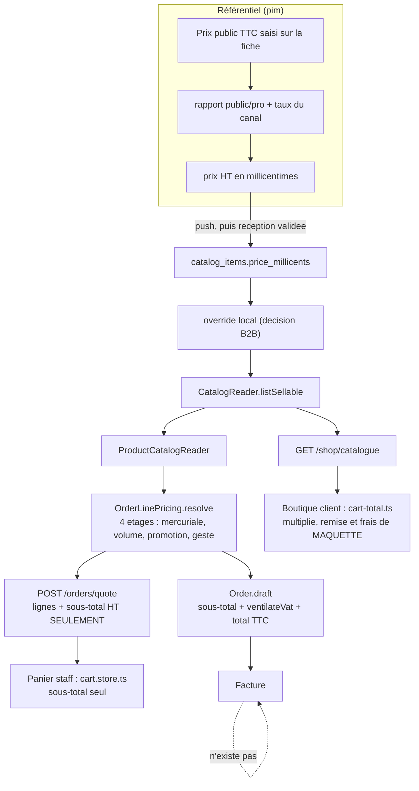

# Le calcul du panier et du prix — audit de l'existant

> **État : 🔎 audit, arrêté au 2026-09-05.** Une photo, pas un plan : il dit ce
> que le dépôt fait aujourd'hui, où l'argent se calcule, et ce qui y est faux.
> Il ne décide rien — le §7 propose des lots, il ne les ordonne pas à la place
> d'Hugo.
>
> 🔴 **Un défaut de production est trouvé et daté ici : `D1`.** Le sous-total du
> panier de saisie du back-office est affiché **mille fois trop grand**. Il ne
> fausse aucune facture — le serveur re-résout tout à la passation — mais c'est
> le nombre qu'un commercial lit au téléphone.
>
> Le **§3 bis** répond à une question distincte, posée après coup : le motif de
> résolution est-il le bon ? **Oui** — et il dit ce qu'il faut refuser de lui
> substituer. La seule faille de conception qu'il relève n'est pas dans le motif :
> c'est une **couture manquante**, que le plan de performance en cours construit
> à moitié sans le savoir.
>
> Un audit porte sa date. Celui-ci ne se mettra pas à jour tout seul.

**Ce qu'il couvre.** Tout ce qui transforme un catalogue en un montant : le
moteur d'étages et **le jugement porté sur son motif** (§3 bis), la ventilation
de TVA, les deux paniers, le devis, l'agrégat `Order`, et les onze documents de
prix du dépôt.

**Ce qu'il ne couvre pas.** L'encaissement (Stripe, SEPA), la facturation
(📐 zéro code, cf. §5), et le caviardage des montants — trois sujets voisins qui
ont chacun leur document.

---

## 1. La carte — où l'argent se calcule

Sept endroits, et **un seul** compose le décompte complet.



| #   | Où                                                  | Ce qu'il calcule                                                                                          | Autorité            |
| --- | --------------------------------------------------- | --------------------------------------------------------------------------------------------------------- | ------------------- |
| 1   | `pim/channels/b2b-platform/products/projection.ts`  | TTC public → TTC pro → **HT en millicentimes**                                                            | le référentiel      |
| 2   | `pricing/domain/resolve-price.ts`                   | les **quatre étages** (`mercuriale`, `volume`, `promotion`, `geste`), en composition, **un seul arrondi** | le serveur          |
| 3   | `packages/money/src/vat.ts` — `ventilateVat`        | la **ventilation par taux**, remise au prorata, un arrondi par groupe                                     | partagé, 3 lecteurs |
| 4   | `orders/domain/entities/order.ts` — `Order.draft`   | **le seul décompte complet** : sous-total, TVA, TTC                                                       | l'agrégat           |
| 5   | `orders/application/queries/quote-order.handler.ts` | lignes résolues + **sous-total HT, rien d'autre**                                                         | le serveur          |
| 6   | `client/cart/cart-total.ts` (boutique)              | sous-total, remise, coursier, TVA, TTC — **en local**                                                     | le navigateur       |
| 7   | `commandes/nouvelle-commande/cart.store.ts` (staff) | sous-total HT — **en local**                                                                              | le navigateur       |

**Le fait structurant : 4 est le seul complet, et il n'existe qu'APRÈS la
commande.** Aucune route ne rend un décompte HT → TVA → TTC avant la passation.
C'est pour ça que 6 et 7 recalculent, et c'est la racine de la moitié de ce qui
suit.

---

## 2. L'unité, et les trois endroits qui la trahissent

La règle est écrite, et elle est bonne (`packages/money/src/millicents.ts`) :

- un **prix unitaire dérivé** est en **millicentimes** (10⁻⁵ €) ;
- un **montant** — total de ligne, sous-total, facture — est en **centimes
  entiers** ;
- la traversée se fait par `lineTotalCents(unitMillicents, quantity)`, qui
  arrondit **une fois**.

Le dépôt porte deux formateurs, et c'est là que ça se joue :

| Fonction                            | Diviseur   | Attend                |
| ----------------------------------- | ---------- | --------------------- |
| `formatCents` (`@lfd/b2b-ui/order`) | `/100`     | des **centimes**      |
| `formatMillicents` (idem)           | `/100_000` | des **millicentimes** |
| `formatEuros` (`@lfd/catalog-ui`)   | `/100_000` | des **millicentimes** |

**Trois sites écrivent `unitPriceMillicents × quantity` et nomment le résultat
`*Cents`.** Deux tombent sur un formateur en millicentimes — la valeur est juste,
le nom ment. Le troisième tombe sur `formatCents`, et c'est `D1`.

C'est le mécanisme, pas la malchance : le même idiome fautif, écrit trois fois,
n'attendait qu'un site pour atterrir du mauvais côté.

---

## 3. Les défauts

### D1 🔴 Le sous-total du panier staff est mille fois trop grand

```
apps/lfc-B2B-admin-frontend/src/app/commandes/nouvelle-commande/cart.store.ts:99
  readonly subtotalCents = computed(() =>
    this.pricedLines().reduce((total, line) => total + line.unitPriceMillicents * line.quantity, 0),
  );
```

Affiché **deux fois**, par `formatCents` (donc `/100`) :
`barre-panier/barre-panier.ts:37` et `panier-commande/panier-commande.ts:169`.

**La chaîne est en millicentimes de bout en bout**, vérifiée fichier par
fichier : `catalog_items.price_millicents` (`schema.prisma:2143`) →
`ResolvedCatalogItem.unitPriceMillicents` (`prisma-catalog.reader.ts:165`) →
`CatalogItemView.unitPriceMillicents` (`list-catalog.handler.ts:23`) →
`CartLine.unitPriceMillicents`. Dix croissants à 2,00 € HT s'affichent donc
**20 000,00 €** au lieu de 20,00 €.

**Pourquoi personne ne l'a vu en test.** La fixture met une valeur en centimes
dans un champ de millicentimes :

```
__tests__/cart.store.spec.ts:5
  const CROISSANT = { sku: 'VIE-001', name: 'Croissant', unitPriceMillicents: 200 };
  …
  expect(cart.subtotalCents()).toBe(2_720);
```

Le test est vert **et** faux, ensemble. C'est exactement ce que la consigne du
dépôt dit d'un `as unknown as` dans un test : ce qui laisse un doublé dériver du
port qu'il prétend jouer sans que rien ne rougisse. Ici il n'y a même pas de
cast — juste un nombre dans le mauvais système.

**Ce que ça ne casse pas, et c'est important.** Rien n'est facturé faux : le
payload ne porte **aucun prix** (`toPayloadLines`, et un test le verrouille), et
`OrderDrafting` re-résout tout côté serveur. C'est un **nombre lu à voix haute**,
pas un montant encaissé.

**Second défaut sur la même ligne**, plus discret : la somme ne passe pas par
`lineTotalCents`. Même l'unité corrigée, `round(Σ)` n'est pas `Σ round()`, et la
règle du dépôt est un arrondi **par ligne**.

### D2 🟠 Le panier de la boutique multiplie — ce que son propre document interdit

`architecture-prix-boutique.md` §6, mot pour mot :

> **la règle de ce lot, et c'est la seule qui compte :** le front **ne multiplie
> jamais**. Il demande `POST /orders/quote`, qui résout chaque ligne à sa
> quantité réelle.

`cart-total.ts` multiplie (`lineHtCents` → `lineTotalCents(unitaire, quantité)`),
et **aucun fichier de `client/` n'appelle `/orders/quote`** — la route existe
pourtant, murée, dans `orders.controller.ts:87`.

Le prix montré vient de `GET /shop/catalogue`, qui rend le prix **du catalogue**
(référentiel, ou décision locale s'il y en a une) : `read-shop-catalogue.ts`
n'appelle pas `resolvePrice`. Donc, aujourd'hui, **aucun étage n'atteint la
boutique** — ni mercuriale, ni promotion, ni palier.

Ce n'est pas encore faux : sans palier posé, `unitaire × quantité` est exact. Ça
devient faux **le jour même** où un barème existe, et faux **en silence**, parce
que la multiplication continue de rendre un nombre plausible. Le document l'avait
prévu ; l'implémentation a fait l'inverse.

### D3 🟠 La remise et les frais de la boutique sont une maquette

`client/mock-station.ts` : remise de retrait **10 %** en dur, frais de zone
**20 €** et **50 €** en dur. `ClientCart.totals` les lit par `ServiceChoice`, qui
les porte depuis les dialogues de choix.

Côté serveur, les deux sont de la **donnée** : `pickup_addresses.discount` et
`delivery_zones.fee`, tous deux des `CartAdjustment` — c'est-à-dire
`{ mode: 'bp' }` **ou** `{ mode: 'amount' }` (`contracts/src/cart-adjustment.ts`).

Trois écarts, du plus grave au plus léger :

1. **La boutique ne sait pas représenter une remise en MONTANT.** `ServiceChoice.discount`
   est un pourcentage. Un point de retrait dont la remise serait `amount` s'afficherait
   à 0 % — puis la commande en déduirait le montant. L'écran et la facture
   diraient deux choses.
2. **Ni des frais en POURCENTAGE.** `ServiceChoice.fee` est un montant en euros.
3. **Les frais sont un flottant en euros**, converti par `Math.round(fee * 100)`
   au dernier moment (`client-cart.service.ts:86`). La règle du dépôt est
   « centimes, entiers », et la conversion tardive est précisément ce qui la
   contourne sans en avoir l'air.

### D4 🟠 Le devis ne rend ni TVA ni total — et c'est assumé

`OrderQuoteView` porte `lines` et `subtotalCents`, point. `OrderDrafting.quote`
l'explique, et l'argument tient :

> Elle s'arrête au sous-total HT, parce que remise de retrait, frais de zone et
> TVA dépendent d'un acheminement qu'une estimation ne connaît pas — les
> inventer donnerait un total que la validation contredirait.

**Mais la conséquence n'est écrite nulle part** : c'est ce trou qui oblige les
deux paniers à refaire de l'arithmétique d'argent dans le navigateur, donc c'est
lui qui a produit `D1`, `D2` et `D3`. Le panier staff l'assume à l'écran :

> Remise de retrait, frais de livraison, TVA et total TTC sont calculés à la
> validation.

C'est honnête, et c'est aussi un client qui ne voit jamais son total avant de
valider.

**La sortie n'est pas de deviner l'acheminement**, c'est de le **passer** : un
devis qui reçoit le mode, le point ou la zone, et rend le décompte complet en
appelant `ventilateVat` — la même fonction que `Order.draft`. Le devis reste une
lecture, il ne crée rien.

### D5 🟡 Le total est calculé deux fois, à deux endroits

`ventilateVat` rend un `totalCents` complet. `Order.draft` **le jette** et le
recompose :

```
order.ts:204
  const totalCents =
    Math.max(0, subtotalCents - input.discountCents) +
    input.deliveryFeeCents + input.lateFeeCents + vatCents;
```

Les deux tombent juste aujourd'hui, y compris sur le bornage de la remise
(`ventilateVat` la plafonne au sous-total, `Math.max(0, …)` fait la même borne au
même endroit). Rien ne garantit qu'ils continueront : la définition du TTC vit à
deux endroits, et un terme ajouté à l'un ne l'est pas à l'autre. C'est le
synonyme d'arithmétique d'argent que `@lfd/money` existe pour supprimer,
reconstitué juste au-dessus de lui.

### D6 🟡 Des `*Cents` qui portent des millicentimes

Le mécanisme de `D1`, aux deux autres endroits où il n'a pas mordu :

| Site                                                  | Nom                | Contenu réel  | Affiché par                      |
| ----------------------------------------------------- | ------------------ | ------------- | -------------------------------- |
| `b2b/tarification/simulateur/quote-bench.ts:72`       | `totalCents`       | millicentimes | `formatEuros` → **valeur juste** |
| `b2b/tarification/simulateur/commitment-bench.ts:129` | `lineTotalCents`   | millicentimes | idem                             |
| `commitment-bench.ts:142`                             | `averageUnitCents` | millicentimes | idem                             |

Deux dommages, moindres mais réels : le nom ment à la relecture, et un **total**
s'affiche avec jusqu'à cinq décimales, alors que le paquet de monnaie dit qu'un
montant s'arrête au centime parce qu'il est encaissé.

Deux JSDoc mentent au même endroit : `contracts/src/catalog.ts:50`
(« Prix unitaire **HT** en centimes ») et `cart.store.ts:9` (idem), tous deux
au-dessus d'un champ `…Millicents`. Ce sont des vestiges de la bascule d'unité,
et ce sont eux qu'on lit quand on écrit la ligne fautive.

### D7 🟡 Le panier hérité compte en euros flottants

`legacy/data/cart.service.ts` : `lineTotalEur`, `subtotalHtEur`, `vatTotalEur`,
`totalTtcEur` — des sommes de flottants. La TVA, elle, a été rendue à
`@lfd/money` le 2026-09-05 ; le sous-total et le total ne l'ont pas été.

Contredit frontalement `CLAUDE.md` : « **Argent en centimes**, entiers. Jamais de
flottant. » Dans `legacy/`, donc à faible portée — mais c'est du code qui tourne,
pas un dossier mort.

### D8 🟡 Le repli de TVA par famille est encore branché

`prisma-catalog.reader.ts:142`, `billableRate` — et son propre commentaire
dit quoi en faire :

> ⚠️ Ce repli est à retirer une fois que tous les articles ont reçu leur taux (un
> push suffit). Le garder indéfiniment ferait resurgir le défaut qu'on corrige :
> une ligne facturée qui dépend d'une jointure de famille.

Le push existe désormais et le seed le rejoue (2026-09-05). Tant que le repli
vit, un article sans taux propre est **facturé** au taux de sa famille — ce que
`plan-decompte-du-panier-ht.md` a précisément retiré du front, au motif que
« chaque ligne du catalogue doit avoir son taux ».

La sortie est une mesure, pas un geste : compter en production les
`catalog_items` à `vat_rate_percent IS NULL` dont la famille en a un. Zéro ⇒ le
repli tombe. Autre chose ⇒ le repli tient, et on sait enfin ce qu'il tient.

### D9 🟡 `minQuantity` veut dire deux choses selon l'étage

`specificity.ts`, `CONTRACT_STAGES` : `mercuriale` et `volume` lisent le seuil
sur `volumeQuantityOf(context)` — le cumul de l'engagement s'il y en a un —
tandis que `promotion` et `geste` le lisent sur `context.quantity`, la commande
en cours.

Le raisonnement est juste, et il est écrit : « à partir de 50 pièces » sur une
promotion est une incitation au panier, et la lire sur la saison l'accorderait
dès la première livraison d'un client annuel.

Ce qui n'est écrit nulle part, c'est la conséquence à la saisie : **la même
colonne, le même champ de formulaire, deux sémantiques**, et rien dans le nom ne
dit laquelle. Qui tape « 50 » sur l'écran de tarification obtient « 50 dans
cette commande » ou « 50 sur la saison » selon une liste déroulante placée
ailleurs dans le même formulaire. Le prix qui en sortira sera juste, et
inexplicable.

Ce n'est pas un défaut de motif, c'est un défaut de **nom**. Deux concepts
nommés, ou l'écran qui affiche la mesure à côté du seuil.

---

## 3 bis. Le moteur de résolution — le motif est bon, la couture manque

Un audit qui ne relève que des défauts laisse croire que tout est à refaire.
Ce n'est pas le cas ici, et le dire est utile : le moteur d'étages est la
pièce la mieux conçue de toute la chaîne d'argent. Cette section dit **pourquoi
il ne faut pas y toucher**, et **le seul endroit où il faut**.

### Ce qui le rend fiable, et qui n'est pas courant

Ce n'est pas « des règles empilées » : c'est un **pipeline ordonné à arbitrage
par étage**, plus un scellement, plus une contrainte finale. Quatre propriétés
portent sa fiabilité :

1. **`resolvePrice` est pure** — `(canonique, matériaux, contexte, plancher) →
(prix, trace)`. Ni base, ni horloge, ni réseau : l'instant est **dans** le
   contexte. Elle s'éprouve en énumérant des cas, pas en montant un environnement.
2. **Un seul arrondi**, en fin de chaîne, le calcul restant rationnel.
   `PriceStep.resultMillicents` est explicitement marqué « pour l'affichage
   seulement » — reprendre cette valeur rétablirait l'arrondi par étage.
3. **La trace est produite par la passe qui calcule.** L'explication ne peut pas
   diverger du prix parce qu'il n'y a pas deux passes.
4. **`compareSpecificity` et `winnerOf` sont exportés et réutilisés par l'écran.**
   C'est le geste anti-divergence qui compte le plus : la frise des recouvrements
   désigne le gagnant avec l'arbitrage qui **facture**, au lieu d'en
   réimplémenter un second.

`ladderAsRule` est un **Adapter** exemplaire : le barème est présenté comme la
règle d'étage volume qu'il est à cette quantité, donc ni la résolution ni la
spécificité n'apprennent un cas de plus.

### Ce qu'il faut refuser si on le propose

| Proposition                                                   | Pourquoi c'est pire                                                                                                                                                                                                                    |
| ------------------------------------------------------------- | -------------------------------------------------------------------------------------------------------------------------------------------------------------------------------------------------------------------------------------- |
| Des **handlers injectés** à la place de `PRICE_STAGES`        | **L'ordre EST la sémantique.** Un tableau le rend lisible en un endroit ; des handlers l'éparpillent dans un module de composition. Et ce n'est pas un `switch` : ajouter un étage coûte une ligne de donnée, la boucle ne change pas. |
| Faire du **plancher un étage**                                | Il gagnerait une fenêtre de validité et une audience qu'il n'a **délibérément pas** — c'est le sujet du §4 d'`optimisation-resolution-de-prix.md`. Un plancher est une **post-condition**, pas une transformation.                     |
| Un **moteur de règles** configurable (DSL, table de décision) | Perte du compilateur et d'une trace nommée dans le métier, contre une configurabilité que personne n'a demandée. Et une table de décision n'exprime pas la **composition** — chaque étage s'applique à la sortie du précédent.         |
| **Séparer** le calcul de la trace                             | C'est la propriété n°3. La casser est le moyen le plus sûr de faire mentir un écran.                                                                                                                                                   |
| **Formaliser un pattern Specification** sur `applies`         | Il l'est déjà en substance (`matchesScope`, `matchesAudience`, `isInForce`, composés). Le formaliser ajoute de la cérémonie sans rien fermer.                                                                                          |

### 🔴 La seule vraie faille : `resolvePrice` est pure, mais trop petite

Les décisions qui comptent ne sont pas dedans. Elles sont dans
`OrderLinePricing.resolveOne` — **quatre-vingt-dix lignes `async`** qui
tranchent : quel engagement couvre l'article, quelle mesure est retenue, quel
plancher le vise, quel étage du plancher s'ouvre, et comment le barème devient
une règle. Cette **recette** n'existe qu'à cet endroit, et elle ne se teste
qu'avec sept doubles.

Ce n'est pas une inquiétude théorique : `optimisation-resolution-de-prix.md`
compte **3 lectures par article** dans cette méthode, et
`plan-materiaux-de-prix.md` existe entièrement pour les hisser. Le design fait
déjà mal, et le dépôt le sait.

Ce qui manque n'est pas un motif exotique — c'est **une couture entre
« rassembler les matériaux » et « les appliquer »**, celle que `inForceFor`
esquisse déjà pour la fenêtre et l'audience.

**Et elle coûte moins cher qu'elle n'en a l'air.** L'objection évidente est que
les deux lectures de `resolveOne` sont **paresseuses** par conception — aucune
requête si le plancher n'a pas de porte, aucune si aucun engagement ne couvre
l'article — et qu'un hissage la perdrait. Vérifié : les deux gardes sont des
**prédicats purs sur des matériaux déjà chargés** —
`scoped.policy.dynamic?.unlock.minVolumeRatioBp == null` pour le ratio,
`commitmentFor(live, …)` pour l'engagement. La collecte se hisse donc **sans
perdre la paresse**, et sans protocole en deux phases.

```
priceLine(materials, evidence, context): ResolvedOrderLine   // pure
```

`resolveOne` se réduit alors à : construire le contexte → demander les preuves
que les prédicats purs réclament → appeler `priceLine`. La recette redevient
énumérable en test, sans doublé.

### 🔴 Le piège du plan en cours

Ce hissage est déjà écrit — mais dans `plan-materiaux-de-prix.md`, **comme un
lot de coût, pas de conception**. La différence n'est pas rhétorique : un plan
de performance s'arrête quand la facture cesse de faire mal, et laisse la
couture à moitié posée.

C'est déjà visible. Le lot 2 est livré, `pricing/domain/scope-index.ts` existe
avec ses six exports et son spec — et **son seul appelant est son propre spec**.
Une pièce de machinerie dont le seul consommateur est son test n'est pas une
optimisation livrée, c'est une couture ouverte.

Requalifier le lot 3 en lot de **conception** lui donne ce qui lui manque : un
consommateur, et une raison de finir.

---

## 4. Ce que la documentation promet et que le code ne fait pas

| Le doc dit                                  | Le code fait                                           | Où                                 |
| ------------------------------------------- | ------------------------------------------------------ | ---------------------------------- |
| « le front **ne multiplie jamais** »        | `cart-total.ts` multiplie                              | `architecture-prix-boutique.md` §6 |
| « il demande `POST /orders/quote` »         | aucun appel depuis `client/`                           | idem                               |
| le canonique **barré** quand il diffère     | `ShopItemView` ne porte pas le canonique               | idem, §4                           |
| « la validation vit dans le domaine »       | remise et frais de la boutique sont dans le navigateur | `CLAUDE.md` §3                     |
| « argent en centimes, entiers »             | `legacy/data/cart.service.ts` en euros flottants       | `CLAUDE.md` §3                     |
| le repli de TVA par famille est transitoire | toujours branché                                       | `prisma-catalog.reader.ts:138`     |

Aucun de ces écarts n'est un mensonge d'auteur : chacun est une phrase écrite
**avant** que la tranche suivante ne parte dans une autre direction. C'est le
mode de panne habituel du dépôt, et le seul remède connu est celui-ci — les
rouvrir périodiquement et les dater.

---

## 5. Les trous — ce qui n'existe pas encore

| Trou                                        | Conséquence aujourd'hui                                                         | Doc                                           |
| ------------------------------------------- | ------------------------------------------------------------------------------- | --------------------------------------------- |
| **Aucune facture n'est émise**              | la chaîne s'arrête au total de la commande ; le mandat SEPA n'est jamais débité | `architecture-facturation.md` 📐              |
| **La mercuriale par client (S5)**           | un compte négocié paie le tarif public sur la boutique                          | `architecture-resolution-de-prix.md` 🟡       |
| **La surtaxe de retard au panier (B5)**     | facturée par `Order.draft`, jamais annoncée au client                           | `plan-decompte-du-panier-ht.md` §7.2          |
| **La boutique ne passe aucune commande**    | numéro fabriqué dans le navigateur                                              | `client/shop/mock-order.ts`                   |
| **Les paliers de volume à la boutique**     | reportés — et `D2` est ce que le report a laissé                                | `architecture-prix-boutique.md` §6            |
| **Prix vivant / prix bloqué**               | non tranché, zéro code                                                          | `architecture-prix-vivant-prix-bloque.md` 🔵  |
| **Conditionnements**                        | le toggle unité/pack reste provisoire                                           | `architecture-conditionnements-pricing.md` 📐 |
| **Aucune porte CI sur les unités d'argent** | `D1` et `D6` étaient invisibles à `lint:gates`                                  | —                                             |

Le dernier mérite d'être dit en propre. Le dépôt a **23 portes**, dont une qui
lit les schémas Postgres dans le `datasource` plutôt que de les recopier, et une
qui interdit `new Date()` hors de l'adaptateur d'horloge. Il n'en a **aucune** sur
l'unité de l'argent — le seul endroit où se tromper coûte de l'argent. Une porte
qui refuse un identifiant `*Cents` affecté depuis une expression contenant
`Millicents` aurait attrapé `D1` **et** `D6` le jour où ils ont été écrits. Elle
tient en trente lignes, comme les autres.

C'est la hiérarchie déjà retenue ailleurs dans ce dépôt : rendre inexprimable
plutôt que vérifier. Ici, l'inexprimable serait un type nominal
(`Millicents`/`Cents` distincts) ; la porte CI est le cran d'en dessous, et elle
est disponible tout de suite.

---

## 6. L'état réel des onze documents de prix

| Doc                                        | État affiché | Ce que ce relevé constate                                                                                                         |
| ------------------------------------------ | ------------ | --------------------------------------------------------------------------------------------------------------------------------- |
| `plan-decompte-du-panier-ht.md`            | 🟢 sauf B5   | **exact.** Les trois copies délèguent bien à `@lfd/money`.                                                                        |
| `architecture-resolution-de-prix.md`       | 🟡           | **exact.** S1→S4 livrés, S5 (mercuriale) absente.                                                                                 |
| `architecture-prix-boutique.md`            | 📐           | **périmé, et c'est le plus coûteux.** La boutique est bâtie — mais contre la règle centrale du document (`D2`). Il faut le dater. |
| `plan-boutique-sur-api.md`                 | 🟢           | exact (daté le 2026-09-05).                                                                                                       |
| `optimisation-resolution-de-prix.md`       | 📐           | exact — un constat de coût, rien à implémenter.                                                                                   |
| `plan-materiaux-de-prix.md`                | 📐           | **sous-évalué** : lots 0, 1, 2 et 4 portent des encarts « ✅ Livré le 2026-09-05 ». L'index dit 📐.                               |
| `decision-qui-pose-une-promotion.md`       | 📐           | exact — une décision, pas un chantier.                                                                                            |
| `architecture-prix-vivant-prix-bloque.md`  | 🔵           | exact — zéro code, assumé.                                                                                                        |
| `architecture-conditionnements-pricing.md` | 📐           | exact.                                                                                                                            |
| `architecture-facturation.md`              | 📐           | exact — et c'est le plus gros trou du §5.                                                                                         |
| `pim/architecture-prix-ancre-ttc.md`       | ✅           | exact — l'assiette unique est livrée.                                                                                             |

**Deux lignes d'index à corriger** : `architecture-prix-boutique.md`
(📐 → 🟡, avec un bandeau disant que `D2` le contredit) et
`plan-materiaux-de-prix.md` (📐 → 🟡).

Le premier est le seul qui gèle vraiment quelque chose : quelqu'un qui l'ouvre
aujourd'hui pour brancher les paliers croira que le front ne multiplie pas.

---

## 7. Les lots proposés

Ordonnés par **ce que se tromper coûte**, pas par difficulté.

| Lot     | Ce qu'il fait                                                                                                                                                                                                       | Pourquoi maintenant                                                                |
| ------- | ------------------------------------------------------------------------------------------------------------------------------------------------------------------------------------------------------------------- | ---------------------------------------------------------------------------------- |
| **P1**  | `D1` : `subtotalCents` passe par `lineTotalCents`, la fixture prend de vrais millicentimes, un test de non-régression nommé d'après le symptôme.                                                                    | Un nombre faux est lu à voix haute par un commercial, aujourd'hui.                 |
| **P2**  | La porte `lint:money-units` — refuse `*Cents` affecté depuis une expression `*Millicents`. Inventaire chiffré des sites existants, comme `lint:code-language`.                                                      | Sans elle, P1 et P3 se réécrivent tout seuls dans six mois.                        |
| **P3**  | `D6` : renommer les trois `*Cents` du simulateur, corriger les deux JSDoc. La porte de P2 les tient ensuite.                                                                                                        | Ce sont les modèles qu'on recopie.                                                 |
| **P4**  | `D5` : `Order.draft` prend le `totalCents` de `ventilateVat` au lieu de le refaire.                                                                                                                                 | Une définition du TTC, pas deux.                                                   |
| **P5**  | Dater `architecture-prix-boutique.md`, corriger les deux lignes d'index.                                                                                                                                            | Une doc périmée gèle un chantier ; un bandeau daté coûte cinq minutes.             |
| **P6**  | `D8` : mesurer les articles sans taux propre en production, puis retirer le repli si c'est zéro.                                                                                                                    | Une ligne facturée ne doit pas dépendre d'une jointure de famille.                 |
| **P7**  | `D4` : le devis rend le décompte complet en recevant l'acheminement. **Ferme `D2` et `D3` en même temps** — la boutique cesse alors de calculer.                                                                    | C'est la racine commune ; les trois autres en sont les symptômes.                  |
| **P8**  | `D7` : le panier hérité passe en centimes entiers.                                                                                                                                                                  | À faire quand on y touche, pas avant.                                              |
| **P9**  | `D9` : nommer les deux mesures de quantité, ou afficher la mesure à côté du seuil sur l'écran de tarification.                                                                                                      | Un prix juste et inexplicable coûte un litige, pas un correctif.                   |
| **P10** | La **couture pure** du §3 bis : `priceLine(materials, evidence, context)`. Requalifier le lot 3 de `plan-materiaux-de-prix.md` en lot de **conception**, et lui donner le consommateur que `scope-index.ts` attend. | La recette qui fabrique un prix n'est aujourd'hui éprouvable qu'avec sept doubles. |

**Deux lots demandent une conception, et les deux touchent à l'argent** : `P7`
et `P10`. La convention du dépôt impose alors un contradicteur **avant** de les
soumettre. `P1` à `P6` et `P9` sont des corrections dont chacune tient dans un
commit.

⚠️ **`P10` ne se justifie pas par la performance, et c'est tout l'objet du §3 bis.**
Le présenter comme une optimisation, c'est reproduire ce qui a laissé le lot 2
sans appelant.

⚠️ **P1 n'est pas urgent au sens de la production** : rien n'est facturé faux, et
le geste ne détruit rien. Il est urgent au sens de l'usage — c'est un écran en
service.

---

## 8. Ce que ce document a ouvert

Chaque affirmation sur l'existant vient d'un fichier ouvert le 2026-09-05 :

- `packages/money/src/{vat,millicents,exact,index}.ts`
- `packages/contracts/src/{cart-adjustment,catalog,shop-catalogue}.ts`
- `packages/b2b-ui/src/order/{order-format,order-pricing}.ts`,
  `packages/catalog-ui/src/price-origin/format-euros.ts`
- `apps/lfd-api/src/b2b/orders/domain/{entities/order.ts,services/vat.ts}`
- `apps/lfd-api/src/b2b/orders/application/{services/order-drafting.service.ts,
services/order-line-pricing.service.ts, queries/quote-order.handler.ts,
queries/list-catalog.handler.ts}`
- `apps/lfd-api/src/b2b/pricing/domain/{resolve-price.ts,price-rule.ts,
specificity.ts, floor-policy.ts, volume-ladder.ts, scope-index.ts}`,
  `pricing/application/pricing-context.ts`
- `apps/lfd-api/src/b2b/catalog/{application/queries/read-shop-catalogue.ts,
infrastructure/prisma-catalog.reader.ts, domain/ports/catalog.reader.ts}`
- `apps/lfd-api/prisma/schema.prisma` (colonnes `price_millicents`)
- `apps/lfc-B2B-platform-frontend/src/app/client/{cart/cart-total.ts,
cart/client-cart.service.ts, order-context.store.ts, mock-station.ts,
shop/mock-order.ts}`, `legacy/data/{vat.ts,cart.service.ts}`
- `apps/lfc-B2B-admin-frontend/src/app/commandes/nouvelle-commande/{cart.store.ts,
barre-panier/…, panier-commande/…, source-produits/…, __tests__/cart.store.spec.ts}`
- `apps/lfc-B2B-admin-frontend/src/app/b2b/tarification/simulateur/{quote-bench.ts,
commitment-bench.ts, simulateur-page.{ts,html}}`
- les onze documents du §6, plus `documentation/README.md`

**Ce qu'il n'affirme pas :**

- que `D1` a produit une erreur commerciale réelle — il dit qu'il l'a **rendue
  possible**, et le dépôt ne sait pas ce qui a été dit au téléphone ;
- combien d'articles portent aujourd'hui un taux propre en production (`D8`) —
  c'est une mesure à faire, pas un chiffre connu ;
- que les valeurs de la maquette (10 %, 20 €, 50 €) soient celles de la
  production — `plan-decompte-du-panier-ht.md` §9 le disait déjà ;
- qu'il n'existe pas d'autre site de calcul : la recherche a porté sur
  `vatRate`, `Millicents`, `* quantity` et `formatCents`. Un calcul qui
  n'emploierait aucun des quatre lui échapperait.

Le §3 bis, en plus, n'affirme pas :

- que les **3 lectures par article** soient un chiffre mesuré ici — il vient
  d'`optimisation-resolution-de-prix.md`, et il n'a pas été recompté ;
- que la couture proposée soit la seule forme possible. Ce qui est **vérifié**,
  c'est que les deux gardes de paresse de `resolveOne` sont des prédicats purs
  sur des matériaux déjà chargés — donc qu'un hissage ne coûte pas la paresse.
  La forme exacte de `priceLine` reste à concevoir, et c'est le sens de `P10` ;
- qu'un jugement de motif soit un fait. « Le motif est bon » est un avis, appuyé
  sur quatre propriétés vérifiables une par une — c'est celles-là qu'il faut
  contredire, pas la conclusion.

**Ce qui n'a pas été fait :** le contradicteur. Ce document touche à l'argent, et
la convention du dépôt le rend obligatoire — il n'a pas été lancé, sur consigne
de session. C'est un **audit**, pas un plan : il ne propose aucune bascule que P7
ne devrait pas soumettre séparément. Mais `D1` et `D8` mériteraient d'être relus
par quelqu'un d'autre avant qu'on agisse dessus.
