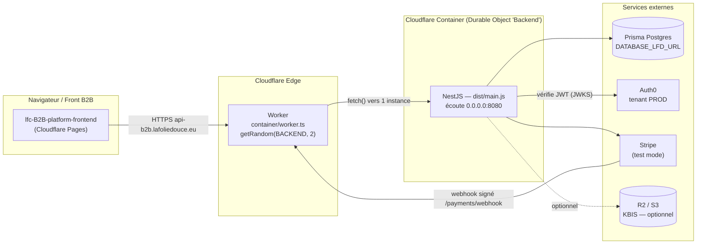
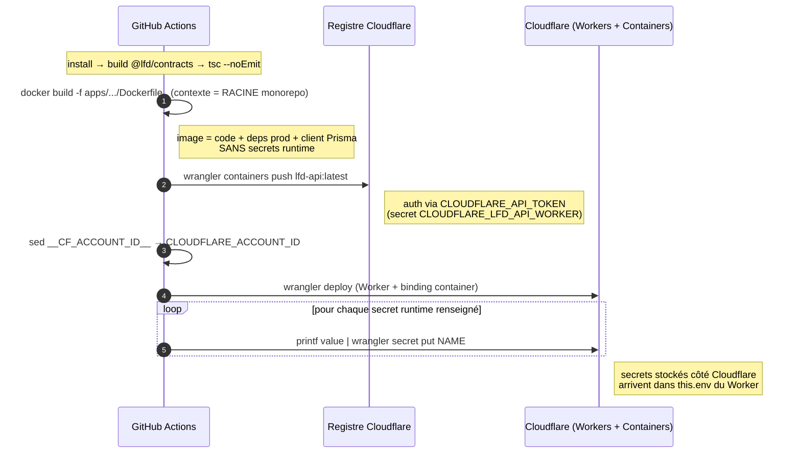
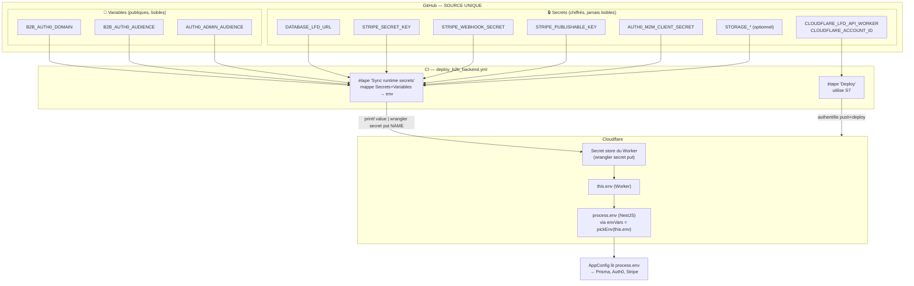
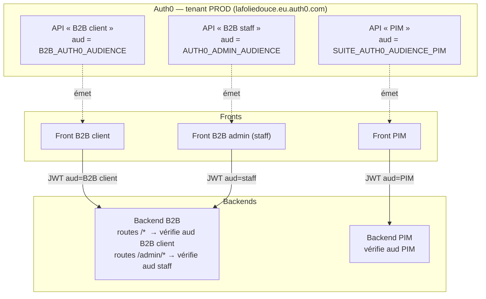
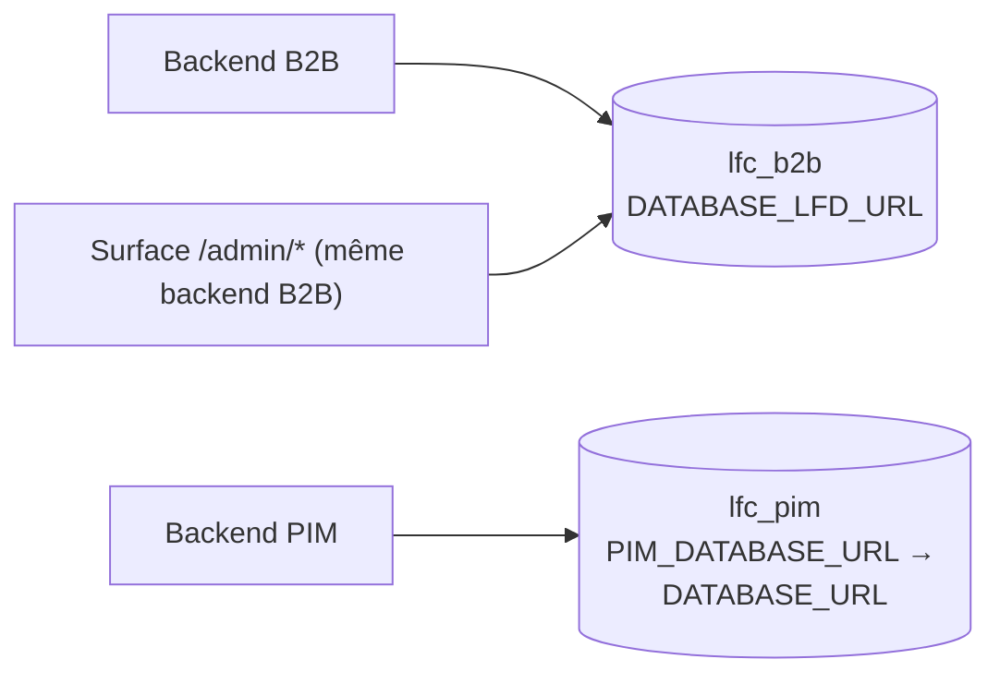
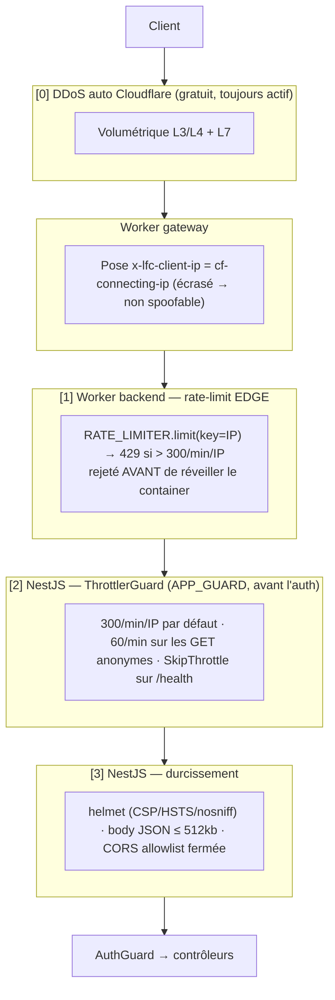

# Déploiement du backend B2B — Cloudflare Containers

> ⚠️ **SUPERSÉDÉ le 2026-08-13.** Ce document décrivait le _scaffold_ avant tout
> déploiement réel (« pas encore validé par un build Docker »). Depuis, tout a
> changé : les backends sont en production, leurs Workers n'ont **plus aucune
> adresse publique**, et la topologie passe par une passerelle. La référence à
> jour est [`../ops/architecture-deploiement.md`](../ops/architecture-deploiement.md)
> et [`../ops/pipelines.md`](../ops/pipelines.md).
>
> Conservé pour l'historique du raisonnement (choix d'audiences Auth0, chemins
> des secrets), **pas comme description de l'état actuel**.

> **État** : scaffold complet, typecheck vert. **Pas encore validé** par un 1er build Docker réel.
> Ce doc décrit le flow de déploiement, les secrets nécessaires, les chemins qu'ils
> empruntent, et le modèle d'audience Auth0. Le PIM suit le même patron (§7).

---

## 1. Vue d'ensemble — qui parle à qui

Le backend B2B est un process **NestJS** qui tourne dans un **Cloudflare Container**.
Un **Worker** minuscule sert de porte d'entrée : il ne fait que router la requête
vers une instance de container et **transférer les secrets** au process Node.



**Séparation des rôles :**

| Élément                            | Rôle                                          | Ce qu'il ne fait PAS                              |
| ---------------------------------- | --------------------------------------------- | ------------------------------------------------- |
| **Worker** (`container/worker.ts`) | Router + injecter `envVars` dans le container | Aucune logique métier, aucun accès DB             |
| **Container** (`Backend` DO)       | Faire tourner NestJS, port 8080               | N'est jamais joignable directement de l'extérieur |
| **Image** (`Dockerfile`)           | Embarque le code + deps prod + client Prisma  | Ne contient AUCUN secret runtime                  |
| **CI** (`deploy_b2b_backend.yml`)  | Build → push → deploy → sync secrets          | N'invente aucune valeur : tout vient de GitHub    |

---

## 2. Le flow de déploiement (4 étapes CI)

Déclencheur : push sur `main` touchant `apps/lfd-api/**`, `packages/**`,
`pnpm-workspace.yaml`, ou le yml lui-même. Aussi lançable à la main (`workflow_dispatch`).



Les étapes, dans l'ordre du yml :

1. **Prépare** — `pnpm install --frozen-lockfile`, build de `@lfd/contracts` (types partagés), puis `tsc --noEmit` (gate : un typecheck rouge stoppe le deploy).
2. **Build image** — `docker build -f apps/lfd-api/Dockerfile -t lfd-api:latest .`
   ⚠️ Le `.` final = **contexte racine du monorepo** : le build a besoin de `pnpm-workspace.yaml` + `packages/*`. C'est la seule voie ; `wrangler containers build` n'expose pas de build-context.
3. **Push + Deploy** — `wrangler containers push` (image → registre Cloudflare), puis `sed` injecte l'account id dans `wrangler.jsonc` (jamais commité en clair : le fichier contient `__CF_ACCOUNT_ID__`), puis `wrangler deploy` publie le Worker qui référence l'image.
4. **Sync des secrets runtime** — une boucle `wrangler secret put` pousse chaque secret **présent** (les vides sont sautés → feature simplement désactivée).

---

## 3. Les secrets, et le chemin qu'ils empruntent

C'est le cœur de la question : **où vit chaque secret, et comment il arrive jusqu'au code NestJS.**



### Deux natures de secret, deux usages

- **Secrets de _pipeline_** (`CLOUDFLARE_LFD_API_WORKER`, `CLOUDFLARE_ACCOUNT_ID`) : authentifient la CI auprès de Cloudflare (push image, deploy). Ne finissent **jamais** dans le container.
- **Secrets de _runtime_** (`DATABASE_LFD_URL`, `STRIPE_*`, `AUTH0_M2M_*`, `STORAGE_*`) : consommés par NestJS à l'exécution. Poussés dans le **secret store du Worker**, puis relayés au container.

### Le relais Worker → container (le point clé)

Un container Cloudflare **ne voit pas** automatiquement les secrets du Worker. Il faut les recopier explicitement dans `envVars` — c'est ce que fait `container/worker.ts` :

```ts
const RUNTIME_KEYS = ["DATABASE_LFD_URL", "AUTH0_DOMAIN" /* … */] as const;

function pickEnv(env: Env): Record<string, string> {
  const out: Record<string, string> = {};
  for (const key of RUNTIME_KEYS) {
    const value = env[key];
    if (value) {
      out[key] = value;
    } // absent = feature off, pas de crash
  }
  return out;
}

export class Backend extends Container<Env> {
  defaultPort = 8080;
  sleepAfter = "1h";
  envVars = pickEnv(this.env); // ← secrets du Worker → process.env du NestJS
}
```

Sans cette ligne `envVars`, NestJS démarrerait avec un `process.env` vide et planterait
(Auth0/DB manquants). C'est le maillon invisible entre « secret Cloudflare » et
« `process.env` du code ».

### Tableau de référence — chaque secret runtime B2B

| Nom (env NestJS)                                                                     | Nature GitHub                      | Obligatoire ? | Sert à                              | Absent ⇒                      |
| ------------------------------------------------------------------------------------ | ---------------------------------- | ------------- | ----------------------------------- | ----------------------------- |
| `DATABASE_LFD_URL`                                                                   | 🔒 Secret                          | **Oui**       | Connexion Prisma Postgres           | Boot échoue                   |
| `AUTH0_DOMAIN`                                                                       | 📢 Variable (`B2B_AUTH0_DOMAIN`)   | **Oui**       | Vérif JWT client                    | Boot échoue                   |
| `AUTH0_AUDIENCE`                                                                     | 📢 Variable (`B2B_AUTH0_AUDIENCE`) | **Oui**       | Audience API client                 | Boot échoue                   |
| `AUTH0_ADMIN_AUDIENCE`                                                               | 📢 Variable                        | Non           | Vérif JWT **staff** (`/admin/*`)    | `/admin` refuse tout token    |
| `BOOTSTRAP_ADMIN_EMAIL`                                                              | 📢 Variable                        | Non           | Admin racine semé au boot           | Défaut `dev@lafoliedouce.com` |
| `AUTH0_M2M_CLIENT_ID`                                                                | 🔒 Secret                          | Non           | Management API (changer email)      | Édition email refusée         |
| `AUTH0_M2M_CLIENT_SECRET`                                                            | 🔒 Secret                          | Non           | idem                                | idem                          |
| `STRIPE_SECRET_KEY`                                                                  | 🔒 Secret                          | Non\*         | Créer PaymentIntent                 | Paiement `per_order` refusé   |
| `STRIPE_PUBLISHABLE_KEY`                                                             | 🔒 Secret                          | Non\*         | Renvoyée au front (Payment Element) | idem                          |
| `STRIPE_WEBHOOK_SECRET`                                                              | 🔒 Secret                          | Non\*         | Valider signature webhook           | idem                          |
| `STORAGE_BUCKET` / `_ACCESS_KEY_ID` / `_SECRET_ACCESS_KEY` / `_ENDPOINT` / `_REGION` | 🔒 Secret                          | Non\*         | Dépôt/lecture KBIS (R2)             | KBIS indisponible             |

\* Les trois clés Stripe vont **ensemble** ; les cinq `STORAGE_*` vont **ensemble** (l'une sans les autres = erreur au démarrage).

> **Pourquoi Auth0 en Variable et pas en Secret ?** Voir §4. En un mot : `AUTH0_DOMAIN`
> et `AUTH0_AUDIENCE` sont des identifiants **publics** (ils circulent déjà dans chaque
> JWT et dans le front). Les mettre en Secret n'ajoute aucune sécurité et masque une
> valeur qu'on a régulièrement besoin de lire.

---

## 4. Le modèle d'audience Auth0

C'est le point le plus subtil. **Une audience = une API déclarée dans Auth0**, identifiée
par son _Identifier_ (une URL logique, ex. `https://api-b2b.lafoliedouce.eu`). Un JWT
émis pour une audience n'est **valide que pour cette API**. C'est le mécanisme qui isole
les publics.

### Trois audiences distinctes dans la suite



**Invariant clé (un seul backend B2B, deux publics)** : le backend B2B héberge le
client _et_ le staff. La séparation ne vient PAS de deux serveurs, mais de **deux
audiences vérifiées différemment** :

- routes publiques `/*` → le guard exige un JWT dont `aud === AUTH0_AUDIENCE` (client) ;
- routes `/admin/*` → l'`AdminTokenVerifier` exige `aud === AUTH0_ADMIN_AUDIENCE` (staff).

Un token client présenté sur `/admin/*` est **rejeté** (mauvaise audience), et
réciproquement. La confiance vient du JWT, jamais de l'URL ou d'un flag.

> ⚠️ **Piège à éviter absolument** : il ne doit jamais exister un `AUTH0_AUDIENCE`
> « partagé » entre les backends. Chaque backend a la sienne. C'est pour ça que les
> Variables GitHub sont **préfixées** (`B2B_…`, `SUITE_…_PIM`) : un nom générique
> avait déjà causé une confusion. Le mapping vers le nom d'env générique attendu par
> le code (`AUTH0_AUDIENCE`) se fait **dans le yml**, pas dans GitHub.

### Où se fait le mapping (yml)

```yaml
# deploy_b2b_backend.yml — étape Sync runtime secrets
AUTH0_DOMAIN: ${{ vars.B2B_AUTH0_DOMAIN }} # Variable → env générique
AUTH0_AUDIENCE: ${{ vars.B2B_AUTH0_AUDIENCE }} # Variable → env générique
AUTH0_ADMIN_AUDIENCE: ${{ vars.AUTH0_ADMIN_AUDIENCE }}
```

Le code NestJS ne connaît que `AUTH0_AUDIENCE` ; c'est le yml qui décide **quelle**
audience (B2B vs PIM) est injectée sous ce nom, selon le backend déployé.

> ⚠️ Un tenant **dev** (`dev-…`) traîne aussi dans les Variables GitHub. **Ne pas
> l'utiliser** pour la prod : les ymls pointent explicitement sur les variables PROD.

---

## 5. Le mur DB — chaque backend sa base

Chaque backend a sa **propre** base Postgres, jamais partagée :



Note de nommage : la Variable GitHub PIM s'appelle `PIM_DATABASE_URL`, mais le code PIM
lit `DATABASE_URL` (générique) — le yml PIM fait le mapping `DATABASE_URL: ${{ secrets.PIM_DATABASE_URL }}`.
Idem esprit que l'audience : nom explicite côté GitHub, nom générique côté code.

Le schéma d'URL choisit le transport Prisma :

- `prisma+postgres://…?api_key=…` → Accelerate (prod & dev applicatif) ;
- `postgresql://…` → Postgres direct (adapter pg, utilisé par les e2e).

---

## 6. Checklist de mise en ligne (première fois)

### Côté GitHub (Settings → Secrets and variables → Actions)

**🔒 Secrets à créer :**

- [ ] `CLOUDFLARE_LFD_API_WORKER` — token Cloudflare « Workers Scripts · Edit » + « Containers · Edit »
- [ ] `CLOUDFLARE_ACCOUNT_ID`
- [ ] `DATABASE_LFD_URL`
- [ ] `STRIPE_SECRET_KEY`, `STRIPE_PUBLISHABLE_KEY`, `STRIPE_WEBHOOK_SECRET`
- [ ] (optionnel) `AUTH0_M2M_CLIENT_ID`, `AUTH0_M2M_CLIENT_SECRET`
- [ ] (optionnel) `STORAGE_BUCKET`, `STORAGE_ACCESS_KEY_ID`, `STORAGE_SECRET_ACCESS_KEY`, `STORAGE_ENDPOINT`, `STORAGE_REGION`

**📢 Variables à créer :**

- [ ] `B2B_AUTH0_DOMAIN`, `B2B_AUTH0_AUDIENCE`
- [ ] (optionnel) `AUTH0_ADMIN_AUDIENCE`

### Côté Auth0 (tenant PROD)

- [ ] API « B2B client » créée → son Identifier = `B2B_AUTH0_AUDIENCE`
- [ ] (optionnel) API « B2B staff » → Identifier = `AUTH0_ADMIN_AUDIENCE`
- [ ] (optionnel) App M2M autorisée sur « Auth0 Management API », scopes `read:users`+`update:users`

### Côté Stripe (mode Test pour le lancement)

- [ ] Clés `sk_test_…` / `pk_test_…` reportées dans les Secrets
- [ ] Endpoint webhook `https://api-b2b.lafoliedouce.eu/payments/webhook`, events `payment_intent.succeeded` + `payment_intent.payment_failed`
- [ ] `whsec_…` de cet endpoint copié dans le Secret `STRIPE_WEBHOOK_SECRET`

### Points à dérisquer au 1er run (voir `CONTAINERIZE-NOTES.md`)

- [ ] Le `docker build` passe avec le contexte racine (packages/* présents)
- [ ] `pnpm deploy --prod /app` embarque bien `dist/` + le client Prisma généré
- [ ] `wrangler containers push` puis `wrangler deploy` aboutissent
- [ ] Si la 2e instance s'allume : prévoir un **pooler Postgres** (limite de connexions)

---

## 7. Le PIM, en miroir

Même patron, différences à connaître :

|                            | B2B                                       | PIM                                                                 |
| -------------------------- | ----------------------------------------- | ------------------------------------------------------------------- |
| Worker/Dockerfile/wrangler | idem structure                            | idem structure                                                      |
| DB (secret)                | `DATABASE_LFD_URL`                        | `PIM_DATABASE_URL` → env `DATABASE_URL`                             |
| Auth0 (variables)          | `B2B_AUTH0_DOMAIN` / `B2B_AUTH0_AUDIENCE` | `SUITE_AUTH0_DOMAIN` / `SUITE_AUTH0_AUDIENCE_PIM`                   |
| Secrets spécifiques        | `STRIPE_*`, `STORAGE_*`, `AUTH0_M2M_*`    | `SHOPIFY_ADMIN_TOKEN`, `SHOPIFY_CLIENT_ID`, `SHOPIFY_CLIENT_SECRET` |
| Staff/audience admin       | oui (`AUTH0_ADMIN_AUDIENCE`)              | non                                                                 |
| Token CI                   | `LFC_PIM_BACKEND_WORKER`                  | —                                                                   |

---

## 8. Sécurité : rate limiting, throttle & durcissement

Défense **en profondeur** — quatre couches, de l'edge vers le code :



**[0] DDoS automatique Cloudflare** — mitigation volumétrique L3-L7 sur tout trafic proxifié. Rien à coder ; c'est ce qui absorbe une attaque **distribuée** (des milliers d'IP), que le rate-limit par IP ne peut pas couvrir seul.

**[1] Rate-limit edge (Worker backend)** — binding `[[ratelimit]]` (`wrangler.jsonc`, `unsafe.bindings`), `300 req/min/IP`. Le flood d'**une IP** est rejeté en 429 à l'edge, sans jamais démarrer le container. Clé sur l'IP réelle :

- la **gateway** (seul maillon voyant l'IP client infalsifiable) recopie `cf-connecting-ip` dans `x-lfc-client-ip` et **écrase** toute valeur cliente → non spoofable ;
- le Worker backend lit `x-lfc-client-ip` puis `cf-connecting-ip` (accès direct).

**[2] Throttler applicatif (`@nestjs/throttler`)** — 2ᵉ ligne, granularité par route. `ThrottlerGuard` en `APP_GUARD` monté **avant** `AuthModule` → s'exécute avant l'authentification. Un seul bucket `default` (300/min/IP) ; resserré à **60/min** sur les 3 GET **anonymes** (`pickup-addresses`, `delivery-zones`, `platform-settings`), `@SkipThrottle()` sur `/` et `/health` (sondes). Tracker keyé sur l'IP réelle (`x-lfc-client-ip` → `cf-connecting-ip` → `req.ip`), jamais `req.ip` seul (= IP infra partagée).

**[3] Durcissement (`main.ts`)** — `helmet()` (en-têtes CSP/HSTS/nosniff/anti-clickjacking), corps JSON plafonné à **512 kb** (le `rawBody` du webhook Stripe reste géré), et **CORS allowlist fermée** : origines Pages en prod / localhost en dev, choisies par `NODE_ENV` — un site tiers est refusé par le navigateur.

### Choix de placement (chaîne gateway → backend)

Le rate-limit vit sur les **Workers backend** (pas la gateway) : la sécurité est portée par chaque app, et l'IP réelle est propagée par la gateway via `x-lfc-client-ip`. La protection distribuée reste au niveau [0] (Cloudflare automatique).

### Ce qui n'est PAS couvert (à faire au 1er déploiement)

- **Bypass de la gateway** : si les Workers backend gardent leur route `*.workers.dev`, un attaquant pourrait les atteindre en forgeant `x-lfc-client-ip`. **Désactiver la route `workers.dev`** des backends (Cloudflare → Worker → Settings → Domains & Routes) pour ne les rendre joignables que via la gateway.
- **Uploads KBIS** (multipart/multer) : non plafonnés par le body-limit JSON. Ajouter une limite de taille multer si le KBIS est activé.
- **CORS domaine custom** : quand un domaine réel remplace `*.pages.dev`, l'ajouter à `PROD_FRONT_ORIGINS` dans `@lfd/endpoints`.

### Réglages (où changer les valeurs)

| Réglage                 | Fichier                                                  | Valeur     |
| ----------------------- | -------------------------------------------------------- | ---------- |
| Limite edge par IP      | `apps/lfc-*/wrangler.jsonc` (`unsafe.bindings[].simple`) | 300 / 60 s |
| Limite throttler défaut | `apps/lfd-api/src/platform/security/security.module.ts`  | 300 / 60 s |
| Limite GET anonymes     | décorateur `@Throttle` sur les 3 contrôleurs publics     | 60 / 60 s  |
| Taille body JSON        | `apps/lfc-*/src/main.ts` (`JSON_BODY_LIMIT`)             | 512 kb     |
| Origines CORS           | `packages/endpoints/src/index.ts` (`PROD_FRONT_ORIGINS`) | Pages prod |

## 9. Fichiers de référence

| Fichier                                    | Rôle                                         |
| ------------------------------------------ | -------------------------------------------- |
| `apps/lfd-api/container/worker.ts`         | Worker : routage + relais `envVars`          |
| `apps/lfd-api/wrangler.jsonc`              | Config Worker + container (image, instances) |
| `apps/lfd-api/Dockerfile`                  | Image NestJS (build contexte racine)         |
| `apps/lfd-api/.env.example`                | Liste **autoritaire** des variables runtime  |
| `.github/workflows/deploy_b2b_backend.yml` | Pipeline CI (build → push → deploy → sync)   |
| `documentation/CONTAINERIZE-NOTES.md`      | Points à valider au 1er build Docker         |
