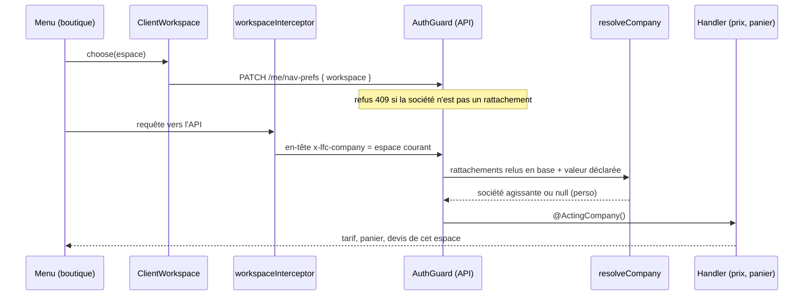

# L'espace de travail : perso ou pro

> **Statut : ✅ en service.** Bâti le 2026-09-15, déployé par le merge
> `585995b49` sur `main`. Relu dans le code le 2026-10-05 ; ce document remplace
> le plan qui l'a conçu.
>
> Le raisonnement d'origine (l'existant d'alors, les décisions D1 à D10, les
> réponses Q1 et Q2 de Hugo, la contradiction de `vitruve`) reste lisible par
> `git show 76738cc15:documentation/b2b/plan-espace-de-travail.md`.

## À quoi ça sert

Une même personne peut commander **pour elle** et **pour une ou plusieurs
maisons** auxquelles elle est rattachée. L'espace de travail dit, à chaque
requête, pour qui elle agit — et donc quel tarif, quel panier, quelles
adresses, quel historique et quelle clientèle s'appliquent. Elle le choisit
dans son menu ; le serveur le revérifie toujours.

## Le flux

## Les règles

**Côté serveur — `apps/lfd-api/src/platform/auth/resolve-company.ts`**,
appelée par `auth.guard.ts` avec les rattachements que
`customer-principal.resolver.ts` relit en base à chaque requête :

| Déclaré (`x-lfc-company`) | Rattachements | Société agissante                                         |
| ------------------------- | ------------- | --------------------------------------------------------- |
| `personal`                | n'importe     | `null` — le perso                                         |
| rien                      | aucun         | `null`                                                    |
| rien ou autre chose       | un seul       | **celui-là** — l'en-tête qui en nomme un autre est ignoré |
| une société rattachée     | plusieurs     | celle-là                                                  |
| rien, ou non rattachée    | plusieurs     | `null` — **jamais « la première »**                       |

- L'en-tête n'a **aucune autorité** : une valeur qui n'est ni `personal` ni un
  rattachement est ignorée, jamais servie. Un identifiant de société est un
  `cuid()`, qui ne peut pas valoir `personal`.
- Seul `@ActingCompany()` lit le résultat : vitrine reconnue
  (`/shop/catalogue/mine`), devis (`/shop/quote/mine`), panier (`/shop/cart`)
  et passation (`POST /orders`). Les routes `/companies/:companyId/*` passent
  par le rôle, pas par l'espace.
- **Le perso est ouvert à tout rattaché, sans condition** (Hugo, Q1) : tarif
  catalogue et carte, hors mercuriale, hors engagement de volume, y compris
  quand la société est suspendue. En accès, `null` ne franchit aucun mur ; en
  prix, il en ouvre — c'est assumé.

**Côté front — `apps/lfc-ecommerce-frontend/src/app/client/client-workspace.service.ts`** :

- `ClientWorkspace.current` vaut `null` **tant que `/me` n'a pas répondu** ; les
  lecteurs par espace attendent une valeur au lieu de partir sans en-tête.
- L'espace par défaut : la préférence si elle désigne encore `personal` ou un
  rattachement ; sinon la société si elle est **la seule** ; le perso à
  plusieurs sociétés comme sans société (Hugo, Q2). C'est exactement ce que le
  serveur sert sans en-tête : aucun changement de prix pour qui n'a rien choisi.
- `workspaceInterceptor` (`client-workspace.interceptor.ts`, enregistré dans
  `app.config.ts`) pose l'en-tête **vers l'API seulement** (`targetsApi`, sur
  une frontière de chemin), **seulement quand l'espace est connu**, et **jamais
  par-dessus** un en-tête déjà posé : l'écriture du panier pose l'espace capturé
  au geste, pour qu'un débounce parti après une bascule n'écrive pas les lignes
  d'un espace dans l'autre.
- La constante vit dans `packages/contracts/src/workspace.ts`, module sans
  import, et le front l'importe par `@lfd/contracts/workspace` : par le baril,
  zod entrait dans le bundle initial et le déploiement de la boutique a échoué
  sur son budget (2026-09-15).

## Le menu

- **Pas de sélecteur sans société** (`ClientWorkspace.hasChoice`) : qui n'a
  aucun rattachement n'a qu'un espace.
- Sinon, « Perso » puis une entrée par société (enseigne, raison sociale à
  défaut), l'espace courant marqué ; dessous, l'enseigne en cours ou « Compte
  perso ». Les deux menus — `shell/account-menu` (bureau) et `nav/client-menu`
  (poche) — partagent `workspaceEntries` et `currentWorkspaceLabel`.
- La bascule passe par `ClientWorkspaceSwitch` : préférence écrite de façon
  optimiste (`AccountService.setWorkspace`, retour arrière à l'échec), puis
  détour par `/changement-d-espace` (`WorkspaceReload`) pour que l'écran de
  destination se remonte à neuf et que ses gardes rejouent. `routeAfterSwitch`
  renvoie à l'accueil (`/bienvenue`) depuis un accueil ou depuis un écran de
  société quand on passe en perso ; ailleurs on reste.
- **Les écrans de société** — Mon compte, Mes factures, paniers récurrents —
  sont retirés du menu et fermés par `companyWorkspaceGuard` dès qu'aucune
  société n'est agissante : en perso, **et sans aucune société** depuis le
  2026-09-22. La règle est écrite une fois, dans `company-screens.ts`.

## Ce qui suit l'espace

| Surface                                | Effet                                                                                           |
| -------------------------------------- | ----------------------------------------------------------------------------------------------- |
| Société affichée, adresses, historique | relus pour l'espace (`ClientCompany`, `ClientAddresses`, `ClientOrderHistory`)                  |
| Vitrine, devis                         | relus : la photo des prix est prise pour un espace                                              |
| Panier                                 | **un par espace, perso compris** (ci-dessous)                                                   |
| Mode de service choisi                 | effacé (`OrderContextStore`) : une adresse appartient à une société                             |
| Commandes gardées en local             | clé `orders.<espace>`                                                                           |
| Tentative de passation                 | clé `order-attempt.<espace>` — sinon un renvoi après bascule réutiliserait la clé d'idempotence |
| Clientèle (B2B / B2C)                  | déduite de la société agissante par `CustomerAudiences`                                         |

**La clientèle** n'est jamais déclarée : `CustomerAudiences.of(companyId)`
(`b2b/orders/application/services/customer-audiences.service.ts`) rend B2C pour
`null` et B2B pour une société **active** seulement. `CartAdjustments` en tire
la remise d'un point de retrait et l'ouverture de la livraison
(`documentation/livraisons/plan-remise-et-livraison-par-clientele.md`). Une
société **suspendue** reste donc sélectionnable dans le menu — le rattachement
existe —, mais elle est servie comme une clientèle B2C : ni remise réservée aux
pros, ni livraison fermée au public.

## Où c'est stocké

- **La préférence** : `users.nav_prefs.workspace` (`personal`, un identifiant
  de société, ou `null` pour effacer). `PATCH /me/nav-prefs` est un patch
  (`catalogueView?`, `workspace?`, au moins un) ; le handler
  `update-nav-preferences.handler.ts` lève `WorkspaceOutOfReachError` (409) pour
  une société hors rattachements. L'écriture **fusionne** en une instruction —
  `COALESCE("nav_prefs", '{}') || $patch` dans
  `prisma-nav-preferences.repository.ts` : poser une vue de catalogue ne peut
  plus effacer l'espace.
- **Le panier serveur** : `shop_carts`, une ligne par `(user_id, company_id)`,
  `company_id` vide = le perso, unicité `NULLS NOT DISTINCT` en SQL brut
  (`prisma/schema/public/orders.prisma`). L'écriture est un
  `INSERT … ON CONFLICT ("user_id", "company_id")` brut
  (`prisma-shop-cart.repository.ts`) : Prisma n'accepte pas `null` dans une
  unicité composée, et deux écritures simultanées ne lèvent rien.
- **Le panier local** : `cart.ws.<espace>` (`cart/cart.store.ts`) ; la clé nue
  `cart` reste celle du visiteur non reconnu. La synchronisation
  (`shop-cart-sync.service.ts`) relit **par espace** ; à la bascule, le débounce
  en attente est abandonné et une relecture vide ne pousse rien.

## Ce qui n'existe pas, volontairement

- **Aucun « premier » par défaut** : à plusieurs sociétés sans déclaration, le
  serveur sert le perso.
- **Pas de tarif public** distinct : en perso, tarif catalogue et carte.
- **Pas d'espace deviné avant `/me`**, ni au rendu serveur : l'en-tête n'y part
  pas.
- **Le sélecteur de `legacy/commerce`** (`CommerceContextService`, sa règle
  `companies[0]`) ne lit pas l'espace : son composant `app-commerce-nav` n'est
  monté par aucun écran (vérifié le 2026-10-05).

## Ce qui va changer : les sous-comptes

Le chantier des sous-comptes
([`plan-sous-comptes.md`](plan-sous-comptes.md), §3 ; ledger T6 de
[`ledger-sous-comptes.md`](ledger-sous-comptes.md)) réécrit `resolveCompany` en
S6 : le sélecteur listera les rattachements **et les sous-comptes
atteignables**, et la branche « un seul rattachement sert d'office » ne tiendra
plus pour qui a une membership et N sous-comptes. Le menu devra lister les
mêmes espaces que le serveur accepte.

## Reste à faire

- **Le contrôle à l'écran d'un compte à deux sociétés.** Les e2e couvrent le
  serveur (`test/shop-cart.e2e-spec.ts` « Un panier par espace de travail »,
  `test/me.e2e-spec.ts`, `test/my-shop-catalogue.e2e-spec.ts`) et les specs du
  front couvrent chaque pièce, mais aucune ne joue une bascule réelle entre
  deux sociétés dans le navigateur. À faire à la main.
- **Le pré-vol CORS de `x-lfc-company`** n'a pas été rejoué en production. Il
  a lieu — la boutique (`lafoliecoffee.info`, `lfc-ecommerce.pages.dev`)
  appelle l'API sur une autre origine (`LFD_API_URL`, la passerelle
  `workers.dev`) — mais il est acquis par construction : `enableCors` ne déclare
  pas `allowedHeaders` (`apps/lfd-api/src/main.ts`), le paquet `cors` renvoie
  alors les en-têtes demandés, et la passerelle transmet `OPTIONS` au backend
  sans l'intercepter. Un appel authentifié était déjà pré-volé pour
  `Authorization`.
