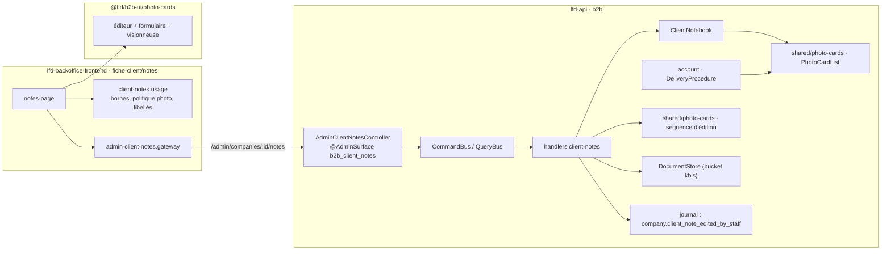
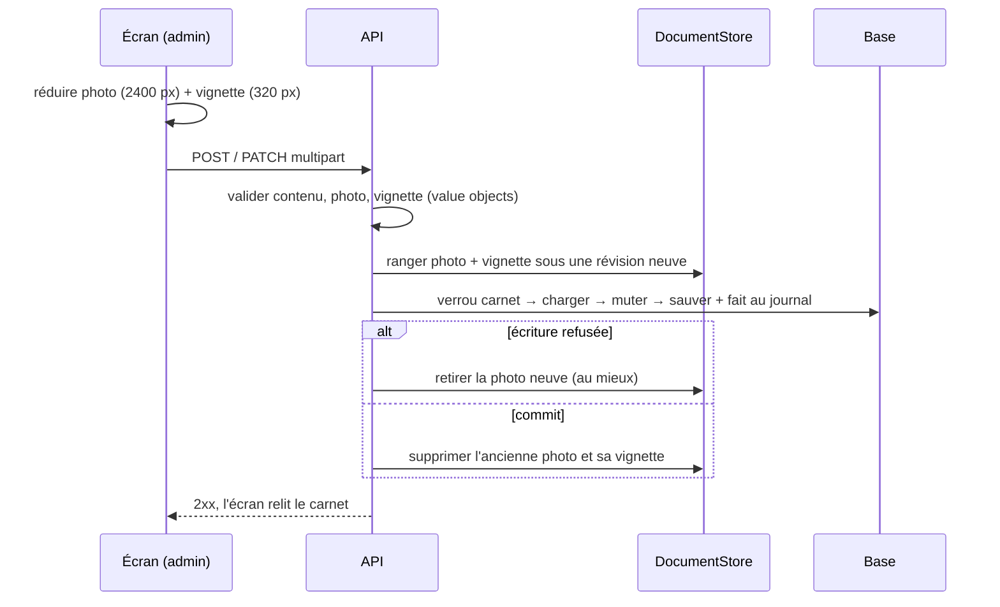

# Les notes du commercial sur un compte client

> **État au 2026-10-05** : ✅ implémenté (bâti le 2026-09-15, lots 0 à 4).
> Ce document décrit le code tel qu'il est, relu ce jour. Le raisonnement
> d'origine — demande de Hugo, décisions D1 à D12, contradiction de `vitruve` —
> est dans le plan, supprimé une fois bâti :
> `git show 58490c4a5:documentation/b2b/plan-notes-photo-du-commercial.md`.

**À quoi ça sert** : la commerciale range, sur la fiche d'un client, les photos
de ses notes papier, avec un titre et une description, dans l'ordre qu'elle
choisit.

## 1. Le modèle

Contexte `apps/lfd-api/src/b2b/client-notes/`, agrégat **`ClientNotebook`** :
le carnet d'UNE société. Il naît à la première note et ne se supprime jamais.

| Règle       | Valeur                                                                                      | Où                                       |
| ----------- | ------------------------------------------------------------------------------------------- | ---------------------------------------- |
| Borne       | 50 notes par société                                                                        | `CLIENT_NOTEBOOK_MAX_NOTES`              |
| Contenu     | titre obligatoire ≤ 80, description ≤ 2000, photo facultative                               | `client-note-content.ts`                 |
| Ordre       | nouvelle note **en tête** ; réordonnancement = permutation EXACTE, sinon refus              | `PhotoCardList`                          |
| Suppression | **définitive**, photo et vignette comprises — exception écrite à « pas de DELETE physique » | `removeNote`                             |
| Photo       | garder / remplacer / retirer (`clientNotePhotoChange`)                                      | `client-note-photo-change.ts`            |
| Auteur      | figé au dépôt : id de fiche staff + nom instantané (vide si l'annuaire ne le connaît pas)   | `created_by_staff_id`, `created_by_name` |

Pas de date de la note papier : la date de dépôt et l'auteur suffisent.

**Persistance** (`prisma/schema/public/client-notes.prisma`, migrations
`20260915230000_ressource_notes_du_commercial` puis
`20260915233000_notes_du_commercial`) : `client_notebooks` (`company_id`
unique, clé étrangère vers `companies`) et `client_notes` (`notebook_id` en
`CASCADE`, `position` 0-based, index `(notebook_id, position)` **sans unique** —
un unique non différé ferait échouer l'échange de deux lignes). L'adaptateur
n'écrit que ce qui a changé (`client-notebook-write-plan.ts`) : le contenu de la
note touchée et la position des lignes qui ont bougé.

## 2. Le socle partagé : les cartes photo ordonnées

`src/b2b/shared/photo-cards/` est le premier dossier partagé au niveau d'un
bloc métier (`CLAUDE.md` §3). Il porte la mécanique commune aux **étapes d'une
procédure de livraison** (`DeliveryProcedure`, `b2b/account/`) et aux **notes** ;
chaque agrégat garde son vocabulaire public et délègue.

| Couche      | Dans le socle                                                                                                    | En paramètre, propre à chaque usage                                                           |
| ----------- | ---------------------------------------------------------------------------------------------------------------- | --------------------------------------------------------------------------------------------- |
| Domaine     | `PhotoCardList` : ajout, révision, photo, retrait (rend la clé), permutation exacte                              | borne, **côté d'ajout** (fin pour les étapes, tête pour les notes), longueurs, mots des refus |
| Photo       | `CardPhoto` : poids, format aux octets, dimensions                                                               | borne de poids, message                                                                       |
| Application | `photo-card-editing.ts` : vérifier → ranger → verrou + charger/muter/sauver → nettoyer                           | identité et sa vérification, clé du verrou, clé de stockage, trace                            |
| HTTP        | `photo-card-http.ts` (multipart, service d'une image)                                                            | chemins, surface, permission                                                                  |
| Écran       | `packages/b2b-ui/src/photo-cards/` : brouillon, réduction, formulaire, éditeur, visionneuse, chargement à la vue | libellés, bornes, politique de photo, passerelle                                              |

La vignette est une option du socle : les notes l'activent, les étapes non
(1600 px, 1 Mo, pas de vignette).

## 3. Qui voit, qui écrit

Ressource de permission propre, **`b2b_client_notes`** — pas `b2b_companies`,
que `comptabilite` et `support` lisent (Hugo, 2026-09-15). Graine des rôles :
`write` pour `admin` et `commercial`, rien pour les autres
(`packages/contracts/src/staff-access.ts`). L'onglet « Notes » de la fiche
client est gardé par `b2b_client_notes:read` (`fiche-client.routes.ts`).
**Aucune route côté client.**

| Route (`/admin/companies/:companyId/notes…`) | Geste                    |
| -------------------------------------------- | ------------------------ |
| `GET  /notes`                                | lire le carnet           |
| `POST /notes`                                | ajouter (multipart)      |
| `PATCH /notes/:noteId`                       | réviser contenu / photo  |
| `DELETE /notes/:noteId`                      | supprimer définitivement |
| `PUT  /notes/order`                          | réordonner               |
| `GET  /notes/:noteId/photo`                  | photo lisible            |
| `GET  /notes/:noteId/thumbnail`              | vignette                 |

## 4. Le stockage des photos

- **Bucket** : `DocumentStore` (bucket `kbis`), comme les photos d'étapes.
  Changer de bucket après le premier dépôt demanderait une migration d'objets.
- **Clés** : `companies/{companyId}/client-notes/{noteId}-{révision}` et la
  vignette dérivée `companies/{companyId}/client-notes/thumbs/{noteId}-{révision}`
  (`client-note-photo-key.ts`). Pas de suffixe `-thumb` : la révision se lit
  après le dernier tiret. Une seule colonne (`photo_key`) : la vignette en est
  dérivée, elle ne peut pas désigner une autre révision.
- **Bornes** : photo lisible réduite par le navigateur à 2400 px, JPEG 0,75 →
  0,6 → 0,5, **600 Ko** ; vignette ~320 px, JPEG 0,7 → 0,5, **60 Ko**. Le
  serveur revérifie les deux (`client-note-photo.ts`) ; garde-fou multipart à
  2 × 600 Ko (`client-note-http.ts`).
- **Écran** : la liste ne charge que les vignettes, et seulement quand elles
  entrent à l'écran (`photo-card-in-view.ts`) ; la photo lisible ne part qu'à
  l'ouverture en grand, zoomable.

## 5. Le journal — sans contenu

Chaque geste publie `company.client_note_edited_by_staff`
`{ companyId, noteId, action }`, `action` ∈ `note_added` / `note_revised` /
`note_removed` / `notes_reordered` (sans `noteId` pour ce dernier : le geste
range tout le carnet). **Ni titre, ni description, ni clé de photo** : le
journal est append-only, et une note supprimée définitivement y resterait
lisible. La zone `client-notes` est surveillée par `lint:journal-tracked`.

## 6. Ce qui n'existe pas, volontairement

Pas de recherche ni d'OCR, pas de vignette fabriquée par le serveur, pas de
note sur un prospect (`Lead`), pas de note visible par le client ni exportée,
pas de glisser-déposer (monter / descendre seulement).

## 7. Reste à faire

- **Mesurer le poids sur de vraies photos de notes (D7 bis)** — toujours
  ouvert : `CLIENT_NOTE_PHOTO_MAX_BYTES` porte encore « estimée, pas encore
  mesurée » (vérifié le 2026-10-05). Les passes et les plafonds 600 Ko / 60 Ko
  se figent après cette mesure.
- **Alléger les photos d'étapes de livraison** (1600 px / 1 Mo, téléchargées
  en pleine taille pour la liste) et leur donner la vignette du socle :
  changement observable, laissé hors du chantier des notes.
- **Rendre lisibles les messages de contenu des étapes**, figés tels quels
  (messages Zod en anglais) par le filet de caractérisation
  `test/delivery-procedure-refusals.e2e-spec.ts`.
