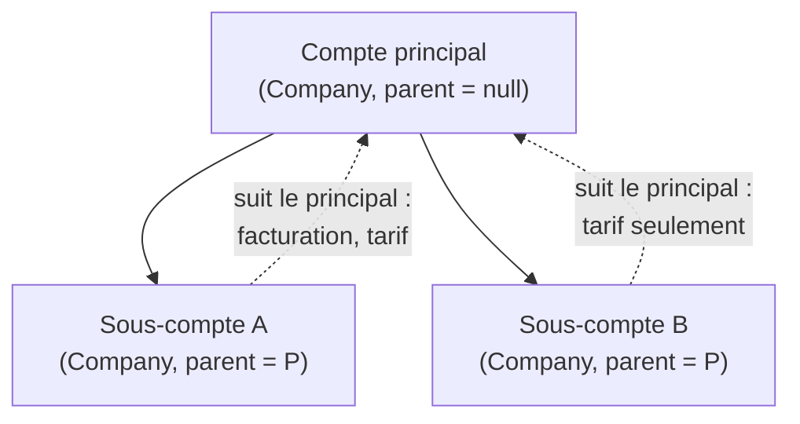

# Les sous-comptes d'un compte pro

> 📐 **Plan v3, rien n'est bâti** (2026-10-05). v3 : les deux cas de Hugo
> (chalets, Club Med), puis une seconde contradiction de `vitruve` (§9).
> La v1 a été contredite par
> `vitruve` le même jour : trois objections BLOQUANTES (le suivi du tarif sans
> date, le chargeur de prix à une seule clé, la course sur la profondeur), et
> sept SÉRIEUSES. Toutes sont reprises ci-dessous ; le §9 dit où.
> Demande de Hugo : « en admin, un
> compte pro peut créer des sous-comptes, avec leurs adresses, leur
> facturation, possibilité de partager une donnée avec le compte principal —
> prendre exemple sur la fiche produit et ses déclinaisons ».
>
> Touche **l'argent** (qui est facturé, qui est prélevé, quel tarif) et **le
> mur tenant** : passe par `vitruve` avant Hugo (CLAUDE.md §9 bis).

## 0. Ce qui existe (vérifié le 2026-10-05)

- **Un client est une `Company`, et une `Company` est un tenant fermé.** Aucun
  champ parent, groupe ou siège (`prisma/schema/public/account.prisma`,
  `model Company`). `siren` est indexé, non unique, et ne relie rien.
- **Une personne appartient à 0..N sociétés** : `Membership` unique sur
  `(userId, companyId)`, avec un `CustomerRole` par société (`owner`, `admin`,
  `orders`, `billing`). Le `Principal` porte la liste `memberships`
  (`src/platform/auth/principal.ts:71`) ; la requête **déclare** sa société et
  le mur la confronte à cette liste — jamais « la première » par défaut.
- **Tout ce qui compte est clé par `company_id`** :

  | Donnée                         | Où                                                      | Forme                                  |
  | ------------------------------ | ------------------------------------------------------- | -------------------------------------- |
  | adresses facturation/livraison | `Address` (`kind`)                                      | N par société, un défaut par `kind`    |
  | termes de règlement            | `Company.grantedTerms`                                  | sur la société                         |
  | RIB                            | `CompanyBankAccount`                                    | **`company_id @unique`** : un seul     |
  | mandat SEPA                    | `PaymentMandate`                                        | N par société, historique gardé        |
  | tarif négocié                  | `CompanyMercuriale`, `MercurialeDraft`                  | par société                            |
  | engagement de volume           | `VolumeCommitment`                                      | par société                            |
  | règles de prix                 | `PriceRule` / `VolumeLadder`                            | audience `all` / `segment` / `company` |
  | commandes, brouillon           | `Order.companyId` (optionnel), `OrderDraft` (`@unique`) | par société                            |
  | alertes, notes, fidélité       | `AccountAlert*`, `ClientNote`, `Loyalty*`               | par société                            |

- **Le modèle à imiter — la déclinaison** (`src/pim/catalogue/product/`) :
  `Product` est l'agrégat, `ProductVariant` n'est jamais chargée seule. Une
  déclinaison **suit** le défaut par aspect (`pricing_follows_default`,
  `regulatory_follows_default`…), un `CHECK` interdit au défaut de se suivre,
  la profondeur est 1. L'héritage est **vivant** (corriger le défaut corrige
  ceux qui le suivent) et la valeur propre **dort** quand on réaligne — rien
  n'est détruit. Le geste est une commande nommée
  (`AlignVariantOnDefaultCommand`), idempotente, journalisée.

## 1. La décision de fond : un sous-compte EST une `Company`

Un sous-compte est une société à part entière, avec un lien vers son principal.
Pas une sous-entité d'une `Company`.

**Pourquoi.** Tout le commerce est déjà clé par `company_id` : commande,
brouillon, adresses, mercuriale, alertes, colisage, livraison, bon de commande.
Un sous-compte qui serait autre chose qu'une `Company` obligerait à repasser
dans chacun de ces contextes pour leur apprendre une seconde clé. En faisant du
sous-compte une `Company`, **rien de ce qui existe ne change** : il commande,
il est livré, il a ses adresses, exactement comme un client seul. Ce qui est
neuf se limite au **lien** et au **partage**.

C'est aussi la lecture juridique la plus courante : un établissement a son
propre SIRET (même SIREN que le siège), une filiale a son propre SIREN. Les
deux sont des `Company` aujourd'hui, simplement non reliées.

## 2. Le modèle — calqué sur la déclinaison



| Déclinaison                        | Sous-compte                                                  |
| ---------------------------------- | ------------------------------------------------------------ |
| `product_variant.product_id`       | `companies.parent_company_id` (nullable)                     |
| la déclinaison par défaut          | le compte principal                                          |
| `*_follows_default` par aspect     | une **période de suivi datée** par aspect (§2.1)             |
| `CHECK` : le défaut ne se suit pas | `CHECK` : un compte sans parent ne suit rien                 |
| profondeur 1                       | profondeur 1 : un sous-compte n'a pas de sous-compte         |
| valeur propre qui dort             | adresses / RIB propres gardés, non lus pendant le suivi      |
| `AlignVariantOnDefaultCommand`     | `AlignSubAccountOnParentCommand(companyId, aspect, aligned)` |

**Différence assumée avec la déclinaison.** Une déclinaison n'existe pas sans
son produit (`ON DELETE CASCADE`). Un sous-compte, lui, a une vie propre :
statut, KBIS, commandes. Il n'est donc **pas** un enfant de l'agrégat
`Company` du principal. Le lien est une **référence** portée par l'enfant, et
les invariants qui traversent (profondeur 1, parent actif) se tiennent en base
et dans le handler du geste.

### 2.1 Les aspects partageables — et pourquoi ils sont DATÉS

Un aspect suivi n'est pas un booléen sur `companies`, contrairement à la
déclinaison. Le prix se **relit à date** : en relecture,
`pricing-materials.loader.ts:137-145` charge la mercuriale et les engagements
`liveAsOf(companyId, at)`. Un booléen vivant ne dit pas qui suivait qui à
cette date, et une relecture appliquerait le suivi d'aujourd'hui à une
commande d'hier. C'est exactement ce que `lint:dated-decisions` refuse.

Le suivi est donc une **période**, dans une table à part :

```
company_follows (
  company_id  → companies   -- le sous-compte
  parent_id   → companies   -- son principal au moment du suivi
  aspect      'billing' | 'pricing' | 'contacts'
  valid_from  timestamptz NOT NULL
  valid_to    timestamptz NULL   -- null = en cours
  EXCLUDE (company_id, aspect, tstzrange(valid_from, valid_to) WITH &&)
)
```

Suivre ouvre une période, et cesser de suivre la ferme. Rien ne s'efface, et
« qui suivait qui le 12 mars » a une réponse. `companies.parent_company_id`
porte seulement la **structure** actuelle, pour la fiche.

**Les deux cas réels qui fixent le modèle** (Hugo, 2026-10-05) :

- **Le gestionnaire de chalets privés.** Une seule société, plusieurs
  chalets. Chaque chalet a son adresse, son contact de livraison et ses
  **factures séparées**, mais tout est prélevé sur **le même RIB**. Un chalet
  n'a pas de SIRET : l'acheteur légal est la société.
- **Le Club Med.** Trois établissements, trois entités qui **règlent
  chacune**, mais avec **la même mercuriale**, négociée pour les trois.

D'où **trois** aspects. Dans les deux cas réels, l'identité facturée et le
RIB vont **ensemble** : le chalet prend les deux, le Club Med aucun. Les
séparer ouvrait le seul cas dangereux, prélever A pour une facture émise à
B, et obligeait à garder les deux en cohérence dans les deux sens. Ils
forment donc **un seul** aspect :

| Aspect         | « Suit le principal » veut dire                                                                                                                                                                                                                                                                                                            | Chalets  | Club Med |
| -------------- | ------------------------------------------------------------------------------------------------------------------------------------------------------------------------------------------------------------------------------------------------------------------------------------------------------------------------------------------ | :------: | :------: |
| **`billing`**  | facturé au nom du principal, et prélevé sur son compte pour les commandes passées **au compte** (un site peut aussi régler par carte à la commande, Hugo, 2026-10-05) : pas de SIRET propre, la facture nomme la société du principal avec le nom du sous-compte, et le prélèvement passe par le RIB, le mandat et les termes du principal |    ✅    |    —     |
| **`pricing`**  | la mercuriale et les engagements du principal                                                                                                                                                                                                                                                                                              |    ✅    |    ✅    |
| **`contacts`** | un contact du principal partagé avec le sous-compte                                                                                                                                                                                                                                                                                        | au choix | au choix |

**Toujours propres au sous-compte** : ses adresses de livraison, ses
contacts de livraison et ses commandes.

⚠️ **Corrigé le 2026-10-05.** Cette phrase disait « une facture est déjà
émise par commande ». C'était faux : la plateforme n'émet **aucune**
facture (T31). Hugo a décidé le même jour que **nous produirons la facture**,
plus tard, et qu'il faut d'abord des **vues d'agrégation des commandes**
([`../../order/plan-agregation-des-commandes.md`](../../order/plan-agregation-des-commandes.md)).

**Facturation groupée ou séparée — une case sur un site** (Hugo,
2026-10-05). Un site reste facturé au nom du principal. La case ne change
pas qui paie, elle change **comment c'est regroupé** :

|                                | Groupée (défaut)                      | **Séparée**                                                                            |
| ------------------------------ | ------------------------------------- | -------------------------------------------------------------------------------------- |
| Relevé du cycle (puis facture) | un pour la société, détaillé par site | **un par site**, au nom du principal, avec le nom et l'adresse du site                 |
| Prélèvement                    | une ligne pour la société             | **une ligne par site** : mandat du site, sur le RIB du principal ou le sien (§2.1 ter) |

La case est une décision **datée**, comme les suivis. Elle ne s'affiche
qu'une fois S4 bâti : une case qui ne fait rien encore ne doit pas promettre.

### 2.1 bis Un sous-compte qui suit `billing` n'a pas d'identité propre

Aujourd'hui, l'agrégat refuse d'activer une société sans SIRET :
`hasLegalIdentity` (`company.ts:301-303`) est exigé par `activate()`
(`company.ts:624-629`), par la porte staff (`activation-gate.ts:51`) et par
`company-warnings.ts:71`. Le modèle, lui, admet un SIRET absent
(`Siret.createOptional`). Il faut donc un **mécanisme**, et pas seulement
une permission :

- **Une checklist d'activation qui connaît le suivi.** `activate()` reçoit
  le suivi `billing` en cours, lu par le handler sous le verrou du §5, et le
  traite comme « identité légale portée par le principal » : pas de SIRET,
  pas de KBIS, pas de détenteur propre exigés. Le **principal**, lui, doit
  être actif. Même règle dans `activation-gate` et dans les avertissements.
- **Ce qui est levé** pour un sous-compte qui suit `billing` : SIRET, KBIS,
  détenteur propre, n° de TVA et adresse de facturation. Ce sont ceux du
  payeur.
- **Cesser de suivre `billing`** ne change pas le statut : il n'existe
  aucune transition `active → pending`, et en inventer une serait un
  second chantier. La fiche remontre alors les pièces manquantes
  (`identite_legale`, `detenteur`), et c'est au staff de les compléter
  (S1, 2026-10-05).
- **Le KBIS** est celui du principal, tant que `billing` est suivi.

- **Le statut** reste propre. Seul le **payeur** suspendu bloque (§2.4).
  Le KBIS suit `billing` (§2.1 bis).

### 2.1 ter Le prélèvement d'un sous-compte qui suit `billing` — trois formes

Un mandat SEPA lie un créancier, un **débiteur** et un compte. Un même
débiteur peut signer plusieurs mandats, chacun avec sa RUM, sur le même
IBAN ou sur des IBAN différents. Le sous-compte qui suit `billing` a donc
trois formes de prélèvement. Le **client** choisit (Hugo, 2026-10-05), et le
staff peut le régler à sa place :

| Forme                     | Débiteur nommé          | IBAN                 | Mandat                                  | Relevé bancaire      |
| ------------------------- | ----------------------- | -------------------- | --------------------------------------- | -------------------- |
| **mandat du principal**   | la société du principal | celui du principal   | celui du principal                      | une ligne par débit  |
| **mandat du sous-compte** | la société du principal | celui du principal   | un mandat du sous-compte, sa propre RUM | une ligne par chalet |
| **RIB propre**            | la société du principal | celui du sous-compte | un mandat du sous-compte, sa propre RUM | sur un autre compte  |

- **Le débiteur est toujours la société du principal**, avec son SIREN, sa
  forme juridique et sa raison sociale (les mentions obligatoires du
  mandat). La frappe d'un mandat de sous-compte lit donc l'**identité
  résolue** (`billing` suivi), et non la ligne du sous-compte, qui n'a pas
  de SIREN. Aujourd'hui, `mint-blockers.ts:58` bloquerait sur
  `siren_missing`.
- **Un RIB propre est un `CompanyBankAccount` du sous-compte.** Le sous-compte
  est une `Company` : la règle « un RIB par société » tient telle quelle.
- **Le seul cas interdit reste l'inverse** : une identité propre prélevée sur
  le compte d'une autre société.
- **Le choix du mandat à prélever** suit la forme en vigueur **à la date du
  prélèvement**. Forme 1 : le mandat du principal. Formes 2 et 3 : le mandat
  actif du sous-compte qui nomme le principal, et lui seul — sans lui, la
  commande sort `no_mandate` en nommant le site et le lot ne se dépose pas
  (Q2). Jamais de repli sur le mandat du principal : le site a choisi son
  mandat (Hugo, 2026-10-05, corrigé au bâti de S4). `debtor-mandate.reader.ts:72` (`activeFor`) devient
  « le mandat de ce payeur pour ce sous-compte ».
- La forme est une **décision datée** de plus, sur le même modèle que
  `company_follows`.

**Ce que le prélèvement doit gagner pour porter ces formes** (`vitruve`,
troisième passage, 2026-10-05) :

- **Le mandat désigne son compte.** Aujourd'hui, l'IBAN est celui du
  `CompanyBankAccount` de `mandate.companyId`
  (`payments/infrastructure/prisma-debtor-mandate.reader.ts`, ~47-70). Un
  mandat de sous-compte sur l'IBAN du principal serait **sauté**, et rendrait
  tout le fichier non déposable (`cycle-draft-support.ts`, ~87).
  `payment_mandates` gagne donc `bank_account_id`, posé à la frappe et lu
  par le lecteur.
- **Le mandat fige son débiteur.** `PaymentMandate` ne porte que
  `companyId`. Il gagne un instantané du débiteur à la frappe : SIREN,
  raison sociale, forme juridique. Un changement d'identité du principal ne
  réécrit pas un mandat signé : il en demande un nouveau.
- **L'assiette groupe par (payeur, mandat effectif)**, et non par
  `companyId`. Chaque commande résout son mandat selon la forme du site :
  le mandat du payeur en forme 1, celui du sous-compte en formes 2 et 3. On obtient ainsi une ligne par
  chalet dans les formes 2 et 3.
- **La frappe lit l'identité résolue** dans la lecture partagée
  `mint-readiness.ts:45-58` (`findHolder`), et pas seulement dans
  `mint-blockers.ts:58` : les deux écrans et la frappe la lisent.
- **Détacher, ou passer en identité propre, révoque** les mandats actifs du
  sous-compte qui nomment le principal. Sinon, le même mandat prélèverait
  pour une autre identité, ce qui est le cas interdit. La révocation est
  datée, et le mandat reste en base.
- **La forme est une décision datée** dans sa propre table
  (`company_collection_form`), à côté de `company_follows`. La date qui
  compte est la **clôture du cycle** (`cycleAt`), jamais l'heure du
  téléchargement.

### 2.1 quater Un sous-compte détaché avec des impayés — et ce qui manque pour le dire

**La décision (Hugo, 2026-10-05)** : le principal n'est jamais débité
d'office pour un sous-compte qui ne le suit plus. La commande sort du
prélèvement. Elle est signalée en admin et au principal, et se règle à la
main.

🔴 **Le code d'aujourd'hui ne peut pas le porter, et c'est un manque du
prélèvement lui-même, pas des sous-comptes.** Un lot n'est jamais
« constitué » : `buildCycleDraft` recalcule tout à chaque téléchargement
(`prisma-billable-orders.reader.ts:48-74`, fenêtre sur `created_at`). Trois
conséquences :

- deux téléchargements du même cycle peuvent différer, et rien ne dit
  lequel a été déposé ;
- une commande écartée n'est **enregistrée nulle part** : il n'y a rien à
  signaler ;
- une commande d'un cycle clos n'entre dans **aucun** lot ultérieur : rien
  ne peut la reprendre.

D'où un **prérequis de S4**, appelé **S4-0**, utile à tous les clients et pas
seulement aux sous-comptes :

- **un lot figé** : la constitution d'un cycle enregistre ses commandes,
  leur mandat et leur montant. Les téléchargements relisent ce lot, ils ne
  le recalculent pas ;
- **un état d'encaissement par commande** : à prélever, dans un lot,
  écartée (avec sa raison), réglée autrement. Une commande écartée entre
  dans l'assiette du lot suivant si son motif a disparu ;
- c'est ce qui donne ses données au signalement « 3 commandes du chalet X
  restent à régler ».

S4-0 touche l'argent et le fichier déposé à la banque : il a besoin de son
propre plan et de son propre passage `vitruve`.

### 2.2 Le tarif — deux clés, pas une

Le chargeur passe aujourd'hui **un seul** `parties.companyId` à trois
lectures, qui ne réagissent pas pareil au sous-compte :

| Lecture                                      | Clé lue avec `pricing` suivi     |
| -------------------------------------------- | -------------------------------- |
| règles d'audience `company` (`PriceRule`)    | le **sous-compte**               |
| mercuriale (`mercuriales.liveFor/liveAsOf`)  | le **principal** suivi à la date |
| engagements (`commitments.liveFor/liveAsOf`) | le **principal** suivi à la date |
| volume mesuré (`customerVolumes.volumesFor`) | voir Q6                          |

`parties` gagne donc une seconde clé, `pricingCompanyId`, résolue **à la
date** de la lecture par `pricingAccountOf(companyId, at)` sur
`company_follows`. Toutes les autres lectures gardent `companyId`. C'est un
changement du chargeur et de son port, pas de l'étage mercuriale seul,
comme le disait la v1.

### 2.3 Le payeur — copié sur la commande

`billingAccountOf(companyId, at)` résout le payeur sur `company_follows`.
Il est lu **une fois**, à la passation, et **copié** sur la commande :
`orders.billed_company_id`. Après ce moment, tout ce qui touche l'argent
lit `COALESCE(billed_company_id, company_id)`. Ce n'est plus la résolution
vivante : réaligner un sous-compte ne déplace jamais une commande déjà
passée d'un payeur à l'autre.

**Où poser la copie** : dans `PlaceOrderHandler`
(`place-order.handler.ts:102-123`, là où `companyId` est confronté au rôle),
passé à la factory de l'agrégat `Order`. Même chose pour la saisie staff et
la passation des abonnements. Les deux entrées sont à relire en S4 : je n'ai
pas encore ouvert leur chemin exact.

**Ceux qui lisent le payeur et basculent en S4** (relevés par `vitruve`,
chemins à rouvrir au lot) :

- le prélèvement : `accounting/infrastructure/prisma-billable-orders.reader.ts:48-74`
  (`groupBy companyId`), `domain/ports/debtor-mandate.reader.ts:72`
  (`activeFor`), `domain/services/pain008.ts` ;
- le mandat et les liens : `payments/application/mint-readiness.ts`,
  `get-mandate-mint-blockers.handler.ts`, `list-payment-links.handler.ts` ;
- le bon : `orders/application/queries/get-order-sheet-pdf.handler.ts`
  (adresse de facturation) ;
- le contrôle avant passation : `alerts/http/order-preflight.controller.ts`.

### 2.4 Les gardes de passation

- **Payeur suspendu.** La passation lit le statut du **payeur résolu**, pas
  seulement celui de la société déclarée. Un sous-compte qui suit `billing`
  d'un principal suspendu est refusé, avec un message qui nomme le
  principal.
- **Compte de groupe sans livraison** (§4) : la passation refuse une
  commande au nom du principal lui-même, aux trois entrées
  (`PlaceOrderHandler`, saisie staff, abonnements).
- **Le principal doit être actif** pour qu'un sous-compte commence à suivre
  `billing` : tenu par l'agrégat au geste « suivre », sous le verrou du §5.

## 3. Le mur tenant — ce que Hugo a décidé, et comment il tient

**La règle (Hugo, 2026-10-05)** : le principal **voit et gère** ses
sous-comptes ; un sous-compte ne voit **que lui-même**, jamais le principal ;
un contact du principal peut être partagé avec un sous-compte.

**Le mécanisme.** Le mur a **deux** voies d'autorisation aujourd'hui, et
S6 doit étendre les deux de la même façon :

1. `resolveCompany` (`platform/auth/resolve-company.ts`, appelé par
   `auth.guard.ts:87`) retient la société déclarée si elle figure dans
   `principal.memberships`, chargées par `customer-principal.resolver.ts:156`.
2. `MembershipReader.roleOf(userId, companyId)`
   (`b2b/account/domain/ports/membership.reader.ts:13`) relit la table pour
   **41 fichiers** de `src/b2b` : adresses, contacts, KBIS, identité,
   livraison, et les gestes réservés à l'owner (`company-access.ts:34,72,102`).

Une **seule** règle, écrite une fois dans une fonction pure, et lue par ces
deux voies (et par `company-orders.controller.ts`, à rouvrir en S6, qui
vérifie la société de l'URL) :

```
rôle effectif dans X =
    rôle de membership(X)                                  s'il existe
  | min(rôle de membership(P), admin)                      si X.parent = P
                                                            et ce rôle ∈ {owner, admin}
  | aucun
```

- **Le plafond vit dans cette fonction**, donc dans `roleOf` aussi : un
  `owner` du principal est `admin` dans le sous-compte, et les gestes
  réservés à l'owner (transfert, second détenteur) lui restent fermés.
- **Jamais dans l'autre sens** : une membership dans un sous-compte ne donne
  rien sur le principal ni sur ses frères.
- **Le sélecteur de société** (`resolve-company.ts`) liste les memberships
  **et** les sous-comptes atteignables. La branche « un seul rattachement
  sert d'office » ne vaut plus pour le gérant de chalets, qui a une
  membership et N sous-comptes. La fonction pure et ses cas sont réécrits.
- **Détacher** coupe l'accès à la requête suivante : le résolveur relit la
  base à chaque requête, sans cache (vérifié par `vitruve` le 2026-10-05).
- **Écran « qui a accès »** d'un sous-compte : il montre ses memberships, et,
  en lecture, « via _Principal_ : les owners et admins du principal ». Un
  admin hérité peut inviter dans le sous-compte, comme un admin propre.
  L'invité reçoit une membership **du sous-compte**, et ne voit donc que
  lui.
- Le contact partagé (aspect `contacts`) est **lu** par le sous-compte. Il
  n'en devient pas membre.

🔴 **Aucune route client ne résout vers le principal.** La résolution
`*AccountOf` sert aux lectures serveur (prix, payeur, prélèvement). Elle ne
sert jamais à répondre « mes données » :

| Route client                  | Sous-compte qui suit `billing`                                             |
| ----------------------------- | -------------------------------------------------------------------------- |
| `get-my-company-bank-account` | reste murée sur la société déclarée : « Facturé à _Principal_ », sans IBAN |
| `get-my-company-mandate*`     | idem : pas de mandat propre, mention du payeur seule                       |
| prix affichés, catalogue      | le prix résolu (deux clés, §2.2), jamais la mercuriale en objet            |
| bon de commande               | adresse de facturation du payeur copié (c'est une mention légale)          |

## 4. Les écrans d'administration

**L'onglet Informations d'un site montre l'hérité, il ne le réclame pas**
(Hugo, 2026-10-05 : « beaucoup de mélange avec les warnings »). L'identité
légale, l'adresse de facturation et le paiement sont ceux du principal, en
lecture, avec un lien. La liste des pièces ne réclame que ce que le serveur
dit bloquant pour un site. Une entité garde l'onglet d'un client normal.

**Un onglet « Sous-comptes »**, juste après « Informations » dans la fiche
client (Hugo, 2026-10-05). Sur un principal, il porte la liste des
sous-comptes, « Créer un sous-compte », « Rattacher un client existant » et
la case « compte de groupe ». Sur un sous-compte, il porte le bandeau « Site
de / Entité rattachée à », « Détacher » et le rappel des aspects suivis. Les
cases « Suivre le compte principal » restent dans leurs onglets.

- **Badge « Sous-compte de _Principal_ »**, cliquable vers le principal,
  partout où un client apparaît : liste des clients, cockpit commercial,
  fiche, commandes. Chaque sous-compte reste un client **à part entière**
  dans le cockpit, sans total de groupe (Hugo, 2026-10-05).
- **Case « Compte de groupe, sans livraison »** sur un principal : une
  holding qui négocie et ne commande jamais. Cochée, la checklist
  d'activation n'exige ni adresse de livraison ni préférence d'acheminement,
  et la passation refuse toute commande au nom du principal lui-même.

Calqués sur la barre de déclinaisons de la fiche produit.

- **Fiche client du principal** : un bloc « Sous-comptes » liste les enfants
  (enseigne, ville, statut, aspects suivis) et propose « Créer un
  sous-compte ».
- **Fiche client d'un sous-compte** : un bandeau « Sous-compte de
  _Principal_ » avec un lien. Dans chaque panneau concerné (Facturation,
  Tarif, Contacts), une case « Suivre le compte principal ». Cochée, le
  panneau montre les valeurs du principal en lecture, avec la mention
  « hérité de _Principal_ depuis le _date_ ». Décochée, il montre les
  siennes. C'est le geste « Aligner sur la déclinaison par défaut ».
- **Créer un sous-compte ne demande que le type et le nom** (Hugo,
  2026-10-05 : « plutôt qu'un panel complexe »). Valider crée le sous-compte
  en `pending` et ouvre sa fiche, où tout se complète par les écrans
  existants : adresse, identité légale pour une entité, contacts, et les
  cases « Suivre » dans leurs onglets. Un site naît en suivant `billing`.
  Le panneau détaillé ci-dessous est la première version, remplacée le
  même jour.
- **Créer un sous-compte** commence par un **choix explicite** (retour de
  Hugo sur le premier écran, 2026-10-05 : « si le sous-compte est un chalet,
  il a la même raison sociale et tout ? ça n'est pas clair ») :
  - **« Un site de cette société »** (le chalet) : seulement le nom du site,
    l'adresse et le contact de livraison. Aucun champ d'identité légale.
    L'écran montre en lecture « Facturé au nom de _raison sociale_ — SIRET,
    TVA du principal ». `billing` est suivi d'office : c'est ce que veut dire
    « site ».
  - **« Une entité distincte »** (l'établissement Club Med) : l'identité
    légale complète, avec le SIREN du principal proposé. `billing` n'est
    pas proposé.
  - Dans les deux cas : « Appliquer la mercuriale du principal » (seulement
    avec le droit de tarification, jamais cochée d'office) et « Partager les
    contacts du principal ».
  - Le sous-compte naît en `pending`, comme toute création staff. Le bandeau
    dit lequel des deux il est : « Site de _Principal_ » ou « Entité
    rattachée à _Principal_ ».
- 🔴 **Rattacher et détacher sont des gestes du personnel, jamais du
  client** (Hugo, 2026-10-05). Rattacher un client existant engage une
  autre société : côté client, il faudrait son consentement, donc un
  circuit de validation qui n'existe pas. Les routes sont sous
  `@AdminSurface("b2b_companies")` (`admin-company-hierarchy.controller.ts:38`,
  vérifié le 2026-10-05). Côté personnel, il reste à **l'admin et au
  commercial**, qui tiennent ce droit (Hugo, 2026-10-05) : pas de droit à
  part. En S6, le rôle `admin` hérité du principal ne donne **pas** ce
  geste.
- **Rattacher** un client existant comme sous-compte, et le **détacher**.
  Détacher ferme toutes ses périodes de suivi : le sous-compte reprend ses
  valeurs propres, qui dormaient.

## 5. Base de données — additive

```sql
ALTER TABLE companies
  ADD COLUMN parent_company_id text REFERENCES companies(id),
  ADD CONSTRAINT company_not_own_parent CHECK (parent_company_id <> id);
CREATE INDEX companies_parent_company_id_idx ON companies(parent_company_id);

CREATE TABLE company_follows ( … §2.1, avec l'EXCLUDE … );

ALTER TABLE orders
  ADD COLUMN billed_company_id text REFERENCES companies(id),
  ADD CONSTRAINT order_billed_needs_company
    CHECK (billed_company_id IS NULL OR company_id IS NOT NULL);
```

**Profondeur 1 et pas de cycle, sous concurrence.** Un trigger qui lit une
autre ligne en READ COMMITTED ne voit pas l'écriture concurrente : A→B
pendant B→C donne une profondeur 2, et A→B pendant B→A donne un cycle. Tout
geste qui change la structure (rattacher, détacher, créer un sous-compte)
prend donc d'abord **un seul verrou consultatif**,
`pg_advisory_xact_lock(<clé « hiérarchie des comptes »>)`, à la manière de
`prisma-delivery-procedure.lock.ts:51`. Il relit ensuite les deux lignes et
vérifie la profondeur dans l'agrégat. Ces gestes sont rares : un verrou
global ne coûte rien et ferme toutes les courses. Le trigger reste en
seconde ligne, contre une écriture faite hors du geste.

- `orders.billed_company_id` est nullable : `null` sur les commandes passées
  avant, et lu comme « la société de la commande ». Aucun remplissage
  rétroactif.
- Aucun droit accordé à un rôle (`lint:no-role-grants-in-migrations`). Les
  gestes réutilisent la ressource staff de la fiche client.

## 6. Les lots

| Lot      | Contenu                                                                                                                                                                                                                                                                                                                                                                                                                                                                                                                                    | Dépend de |
| -------- | ------------------------------------------------------------------------------------------------------------------------------------------------------------------------------------------------------------------------------------------------------------------------------------------------------------------------------------------------------------------------------------------------------------------------------------------------------------------------------------------------------------------------------------------ | --------- |
| **S1**   | migration §5 ; `Company` porte son parent ; table et port `company_follows` ; gestes staff `CreateSubAccount`, `AttachToParent`, `DetachFromParent`, `FollowParent(aspect)`, `StopFollowing(aspect)` sous le verrou ; fiche staff : parent et enfants ; e2e, dont les deux courses                                                                                                                                                                                                                                                         | —         |
| **S2**   | écrans admin §4                                                                                                                                                                                                                                                                                                                                                                                                                                                                                                                            | S1        |
| **S3**   | `pricing` : `pricingCompanyId` dans `parties`, résolu à la date ; Q6 tranchée et bâtie ; e2e : aligné, désaligné, puis **relecture d'une commande d'avant l'alignement** au tarif d'alors                                                                                                                                                                                                                                                                                                                                                  | S1        |
| **A1**   | prérequis, **son propre plan** ([`../../order/plan-agregation-des-commandes.md`](../../order/plan-agregation-des-commandes.md)) : le relevé de cycle (commandes une par une, groupes, TVA par taux sommée des `vat_shares`), export CSV                                                                                                                                                                                                                                                                                                    | —         |
| **S4-0** | prérequis, **son propre plan** : lot de prélèvement figé, état d'encaissement par commande (§2.1 quater)                                                                                                                                                                                                                                                                                                                                                                                                                                   | —         |
| **S4**   | `billing` : les trois formes de prélèvement (§2.1 ter), frappe sur l'identité résolue, choix du mandat à date ; impayés d'un sous-compte détaché (§2.1 quater) ; checklist d'activation du §2.1 bis ; copie de `billed_company_id` aux trois entrées de passation (il nomme aussi l'**acheteur** sur la facture : une facture relue après un « détacher » garde l'acheteur d'alors) ; export comptable lu par le payeur ; garde « payeur suspendu » ; bascule des lecteurs du §2.3 ; routes client du §3 ; e2e jusqu'au fichier `pain.008` | S1        |
| **S5**   | `contacts` : lecture combinée                                                                                                                                                                                                                                                                                                                                                                                                                                                                                                              | S1        |
| **S6**   | côté client (plateforme) : la voie d'accès du §3 dans le résolveur du mur ; le sélecteur de société liste les sous-comptes ; e2e : le principal agit dans un sous-compte, un sous-compte ne voit ni le principal ni ses frères, détacher coupe                                                                                                                                                                                                                                                                                             | S1–S4     |

**Ordre** : S1, S2, S3, puis A1 (agrégation des commandes), S4-0, S4.

🔴 **Condition de mise en service.** Aucun vrai site ne s'ouvre avant que
S4 soit en ligne. D'ici là, un chalet sans SIRET qui commande au compte n'a
pas de mandat à son nom, et bloque tout le fichier de prélèvement du cycle
(Q2 du lot figé : l'interdiction est gardée).

**Rôles dans un site** (Hugo, 2026-10-05) : la gouvernante est `admin` de
son chalet, et peut donc inviter ses collègues. C'est le mécanisme
d'invitation actuel. Entre S3 et S4, un sous-compte peut suivre
le tarif du principal tout en payant pour lui-même. C'est **voulu** : un
établissement qui a négocié au niveau du groupe et paie localement est un
cas réel, et il reste possible après S4.

⚠️ **Irréversible à partir de S4.** Dès que des commandes portent
`billed_company_id` et que des prélèvements sont émis sur le principal,
revenir en arrière demande une migration de données. S4 se déploie seul,
après le retour du cabinet sur Q3.

## 7. Questions — tranchées et ouvertes

**Tranchées par Hugo le 2026-10-05 :**

- **Q1 — Établissement ou filiale ?** Les deux existent : le chalet sans
  identité propre (`billing` suivi) et l'entité qui règle seule (le
  Club Med). Le même modèle couvre les deux.
- **Q2 — Qui voit quoi côté client ?** Le principal **voit** ses
  sous-comptes. Un sous-compte ne voit **que lui-même**, jamais le principal.
  Un contact peut être partagé depuis le principal. S6 entre donc dans le
  plan (voir §3).
- **Q3 — Payer pour une autre entité.** Aucun des deux cas ne le demande :
  identité facturée et prélèvement forment un seul aspect `billing` (§2.1).
- **Q5 — Le RIB unique.** Les chalets prélèvent le RIB du principal ; un
  sous-compte qui ne suit pas `billing` saisit le sien. Rien ne change au
  modèle du RIB.

**Q4 à Q8 : les défauts sont validés par Hugo le 2026-10-05.**

- **Q4 — Principal suspendu.** _Défaut : bloque les sous-comptes qui le
  suivent en `billing`, pas les autres (garde du §2.4)._
- **Q6 — Le volume des sous-comptes compte-t-il pour l'engagement du
  principal ?** Le Club Med a négocié pour trois : leurs commandes devraient
  faire avancer ensemble le palier. _Défaut : oui, en additionnant les
  sous-comptes qui suivaient `pricing` à la date de chaque commande._
- **Q7 — La fidélité** va-t-elle au sous-compte ou au payeur ?
  _Défaut : au payeur._
- **Q8 — Les dérogations au cut-off** restent-elles par sous-compte ?
  _Défaut : oui, c'est une affaire de site._

- **Q9 — Qui décide du tarif partagé.** C'est le **commercial** qui décide
  si la mercuriale du principal s'applique à un sous-compte (Hugo,
  2026-10-05). Le geste « suivre / cesser de suivre `pricing` » est donc
  derrière le droit de tarification (`@AdminSurface("b2b_pricing")`, celui
  de `admin-company-pricing.controller.ts`), et non derrière le droit de la
  fiche client. Il est journalisé au journal général
  (`company.parent_followed`, aspect `pricing`) **et** au journal des prix
  (Hugo, 2026-10-05 : « je le veux »), sous un sujet de prix neuf,
  `company` (le compte tarifaire d'un client). Une carte « Journal du
  tarif », dans l'onglet Tarifs, montre « suit la mercuriale de _Principal_
  depuis le… » chez le sous-compte, et « _Sous-compte_ suit votre
  mercuriale » chez le principal. L'acte est écrit par un port que `account`
  déclare et que `pricing` implémente, dans la transaction du geste. Sa copie
  au journal général remplace `company.parent_followed` pour cet aspect.
  Le journal est un affichage : la relecture du prix lit la table datée. Le
  client ne le voit pas et ne peut pas le changer. À la création d'un
  sous-compte, `pricing` n'est **pas** coché d'office : la case n'apparaît
  qu'à qui a le droit de tarification.

**Revue adversariale avec Hugo, 2026-10-05 :**

- **R1 — Prélèvement des sous-comptes.** Option donnée au client : mandat du
  principal, mandat par sous-compte, ou RIB propre (§2.1 ter).
- **R2 — Relevé mensuel** par sous-compte ou consolidé : **option donnée au
  client**. Il n'existe aujourd'hui aucun relevé, seulement une facture par
  commande. L'option se pose **avec** le relevé, dans son propre plan. Une
  colonne sans lecteur n'est pas posée d'avance.
- **R3 — Impayés d'un sous-compte détaché** : signalés en admin et au
  principal, jamais débités d'office (§2.1 quater).
- **R4 — Le Club Med renégocie pour un seul établissement.** _Pas tranché.
  Défaut : pas de copie de la mercuriale. Il retombe au tarif public
  jusqu'à ce que le commercial lui en pose une._
- **R5 — Un établissement sort pendant un engagement de volume.** _Pas
  tranché. Défaut : ses commandes passées restent comptées, les suivantes
  non (le suivi est daté)._
- **R6 — Le principal holding** qui ne commande pas : oui, par une case
  explicite (§4).
- **R7 — Le personnel d'un sous-compte** voit les prix : aucun rôle neuf.
- **R8 — Le principal choisit le sous-compte** avant de commander : pas de
  panier réparti.
- **R9 — Cockpit** : chaque sous-compte est vu seul, avec un badge cliquable
  vers son principal (§4).
- **R10 — Plus d'un niveau.** _Pas tranché. Défaut : un seul niveau._

## 8. Ce que ce plan ne fait pas

- Pas de groupe à plusieurs niveaux, ni de sous-compte d'un sous-compte.
- Pas de facture **consolidée** (une facture pour N sous-comptes). Le
  principal payeur reçoit une facture par commande, comme aujourd'hui.
- Pas de mercuriale « de groupe » distincte : le tarif partagé est celui du
  principal.

## 9. Ce que `vitruve` a changé (2026-10-05, deux passages)

| Objection                                          | Réponse                                           |
| -------------------------------------------------- | ------------------------------------------------- |
| BLOQUANT — le suivi du tarif sans date             | `company_follows` daté, résolu à la date (§2.1)   |
| BLOQUANT — le chargeur à une clé, le volume        | `pricingCompanyId`, Q6 (§2.2)                     |
| BLOQUANT — la course sur la profondeur             | verrou consultatif + relecture (§5)               |
| SÉRIEUX — les lecteurs du prélèvement non nommés   | listés au §2.3, basculés en S4                    |
| SÉRIEUX — le lieu de la copie, `company_id` nul    | `PlaceOrderHandler` + CHECK (§2.3, §5)            |
| SÉRIEUX — Q4 sans mécanisme                        | garde « payeur suspendu » (§2.4)                  |
| SÉRIEUX — Q3 sans gardien                          | refus par l'agrégat sous verrou (§2.4)            |
| SÉRIEUX — l'IBAN du principal par une route client | routes murées sur la société déclarée (§3)        |
| SÉRIEUX — fidélité, dérogations                    | Q7, Q8                                            |
| SÉRIEUX — l'irréversibilité                        | S4 seul, après le cabinet (§6)                    |
| MINEUR — tarif sans payeur entre S3 et S4          | dit et voulu (§6)                                 |
| v3 BLOQUANT — un chalet sans SIRET ne s'active pas | checklist qui lit le suivi `billing` (§2.1 bis)   |
| v3 BLOQUANT — deux voies d'autorisation            | une règle de rôle effectif, lue par les deux (§3) |
| v3 SÉRIEUX — sélecteur « un seul rattachement »    | réécrit (§3)                                      |
| v3 SÉRIEUX — invitations, écran des accès          | §3                                                |
| v3 SÉRIEUX — identité et paiement séparables       | fusionnés en un seul aspect `billing` (§2.1)      |
| v3 SÉRIEUX — l'acheteur relu après détachement     | `billed_company_id` le fige (S4)                  |

**Pas encore vérifié** : le chemin exact de la saisie staff et des
abonnements jusqu'à l'agrégat `Order` ; ce que scanne `lint:dated-decisions`
(une table neuve de décision datée devra peut-être y être déclarée) ; les
contacts (S5).
