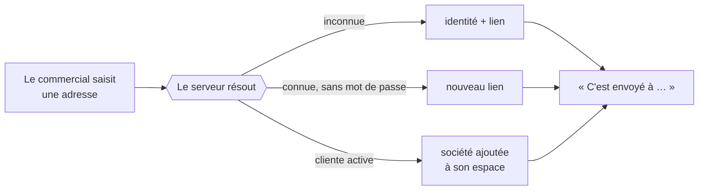

# Discrétion : on ne cherche pas les personnes — design

> Dans un circuit fermé, savoir **qui travaille avec qui** est une information
> commerciale. Un écran qui la laisse voir la répand ; un écran qui la tait la
> protège, sans rien perdre d'utile.
>
> Décidé le **2026-08-11**, appliqué le jour même. Renverse une décision
> antérieure : le choix du détenteur passait par une **recherche** qui affichait
> les sociétés déjà détenues par la personne trouvée.
>
> **Statut : ✅ livré** — la surface de recherche n'existe plus.

---

## 0. Ce qu'on protège, et de qui

La clientèle est un petit monde : un comptable sert douze restaurants, un gérant
tient deux enseignes, tout le monde se croise. Trois personnes ne doivent pas
apprendre la même chose :

| Qui                | Ce qu'il ne doit pas apprendre                       |
| ------------------ | ---------------------------------------------------- |
| Le **détenteur A** | que son comptable travaille aussi chez B             |
| Le **commercial**  | que l'adresse qu'il saisit est déjà cliente ailleurs |
| Un tiers           | que telle adresse existe dans notre fichier          |

Le commercial est pourtant du personnel interne. On le tient quand même à
l'écart : ce qu'il ne sait pas, il ne peut ni le répéter en clientèle, ni le
laisser fuir dans une conversation. Et surtout, il n'en a **pas besoin** — c'est
l'intéressé lui-même qui apprend, par l'e-mail qu'il reçoit, qu'une société a
rejoint son espace.

## 1. La décision

**L'adresse e-mail est la seule clé, et rien ne se cherche.**

- Aucune recherche de personnes. `GET /admin/customers?q=` et
  `GET /admin/customers/by-email` sont **supprimés** ; il n'existe plus aucune
  route qui réponde « cette adresse est-elle connue ? ».
- Le formulaire du détenteur est un **champ e-mail**, plus une recherche.
- Le serveur résout l'adresse et fait ce qu'il faut : ouvrir une identité,
  ré-émettre un lien, ou rattacher la société à un espace existant.
- **L'écran ne dit rien de différent** dans les trois cas. Le message d'ouverture
  est unique, et l'issue (`AccessOutcome`) reste au serveur, où elle choisit
  seulement quel e-mail part.

Un seul libellé pour trois chemins : c'est le cœur du dispositif.

## 2. Pourquoi c'est aussi le plus solide techniquement

La recherche par nom était un `ILIKE %terme%` sur trois colonnes : aucun index
ne s'y applique, donc un balayage de toute la table des personnes **à chaque
frappe débouncée**. À trois cents clients ça ne se voit pas ; à cinquante mille
c'est la requête la plus chère de l'application, déclenchée par le geste le plus
banal.

La résolution par adresse est un accès par index, constant. La confidentialité et
la tenue à l'échelle pointent ici dans la même direction — c'est rare, et c'est
ce qui rend la décision facile.

## 3. Ce que ça coûte, assumé

**La faute de frappe n'a plus de filet.** `jean@comptior.fr` crée une seconde
personne, envoie un lien dans le vide, et personne ne s'en aperçoit avant le
client. La recherche par nom rattrapait ce cas. Le garde-fou honnête serait de
traiter les **rebonds d'e-mail** comme un signal — ce que nous ne faisons pas
encore, et qui devient la contrepartie logique de cette décision.

**Le commercial ne peut plus dire « vous avez déjà un accès ».** C'est voulu.
S'il a besoin de le savoir pour aider quelqu'un au téléphone, la réponse n'est
pas de rouvrir la recherche : c'est que la personne le sait, elle, et qu'elle a
son e-mail.

## 4. Règles qui en découlent

1. **Le nom d'une personne lui appartient.** Quand l'adresse est déjà connue,
   nos e-mails s'adressent à elle avec **son** prénom, jamais avec celui qu'un
   commercial vient de taper. Un profil existant ne se réécrit pas depuis une
   fiche société.
2. **Aucune réponse d'API ne révèle l'existence d'une adresse.** Pas de
   `attachedToExisting`, pas d'`outcome`, pas de compteur. Ce qui ne sort pas ne
   fuit pas.
3. **Une exception se documente ici.** Le jour où un écran a besoin de chercher
   des personnes — un annuaire interne, une fusion de doublons — cette page dit
   ce qu'il faudra peser, et à qui la fuite profiterait.

Un test le tient côté écran (`holder-picker.spec.ts` échoue si une recherche est
rebranchée) et un Playwright vérifie que le message est **identique** pour une
adresse connue et pour une inconnue.
