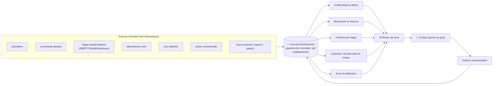
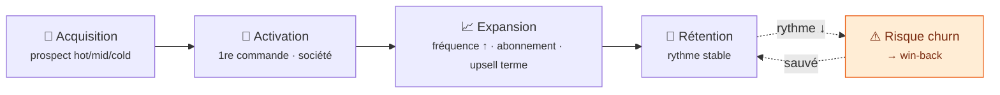
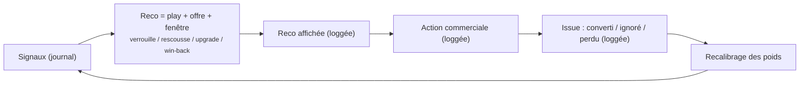

# Espace commercial — Acquisition, Suivi & Reco (concept v3)

> **Public** : commercial + produit + tech (cadrage). Vision d'un **moteur de
> croissance** couvrant tout le cycle de vie, **event-sourced** et en **boucle
> fermée**. Mise en œuvre phasée :
> [`espace-commercial-prospects-leads-todo-tech.md`](../todos/todo-commercial-acquisition.md).
> Étage client (sociétés) :
> [`admin-commercial-comptes-clients.md`](admin-commercial-comptes-clients.md).
>
> **v3 (post-review adversariale)** — retire deux faux garde-fous de la v2
> (« zéro écriture », « pas de ML ») remplacés par : **journal d'événements dès le
> jour 1** + **boucle fermée outcome-logged**. Ajoute cycle de vie complet,
> attribution/lift, identity resolution, moteur de play/offre, cohortes, garde-fous.

## 0. L'ambition : un moteur de croissance, pas un carnet d'adresses

Le zéro-friction **inverse le modèle** : le produit vend seul, le commercial
**amplifie et sauve**. La cible n'est pas une liste de leads, c'est un **cockpit**
qui, en continu, dit **quoi faire, à qui, quand, avec quel levier — et le prouve**.
Trois exigences non négociables qui distinguent un _top_ outil d'un tableau de bord :

1. **Event-sourced** — tout dérive d'un **journal d'événements**, jamais de l'état
   mutable (sinon on jette l'histoire).
2. **Boucle fermée** — chaque reco est **tracée jusqu'à son issue** et recalibre le
   modèle.
3. **Cycle de vie complet** — acquisition **→ activation → expansion → rétention**,
   un seul moteur (l'acquisition sans rétention = un seau percé).

## 1. Le socle non-négociable : le journal d'événements (CDP maison)

**La seule chose qu'on ne peut pas rattraper.** Momentum, cohortes, score,
attribution, apprentissage exigent tous de l'**histoire**. On capture donc, en
**append-only**, chaque fait significatif — **dès maintenant**, même si Phase 1 ne
l'exploite pas encore à fond.

> **Principe** : l'état courant (`Company.status`, etc.) reste la vérité
> _transactionnelle_ ; le **journal** est la vérité _analytique_. Les deux
> coexistent. Rien dans le journal ne pilote une décision métier transactionnelle —
> c'est de la lecture enrichie.

## 2. Les concepts — et le lead est un **établissement**, pas un login

| Concept                | C'est quoi                                  |
| ---------------------- | ------------------------------------------- |
| **Compte** (`User`)    | une identité de connexion                   |
| **Prospect / Lead**    | a montré de l'intention sans être client    |
| **Client** (`Company`) | l'entité commerciale (`pending` → `active`) |

`Compte ≠ Prospect ≠ Client`. **Correctif review** : un lead n'est pas un `User`,
c'est un **établissement réel** (un restaurant). D'où une **résolution d'identité** :
le même resto arrive en 3 comptes (perso + pro + faute de frappe), le **2ᵉ point de
vente** d'un client existant a l'air « nouveau ». On **fusionne** vers le business
(clé SIRET / e-mail / téléphone), sinon la queue est polluée **avant** le score.

## 3. Le cycle de vie complet (le « suivi »)

Le momentum qu'on bâtit pour les hot est **le même moteur** côté client (un client
dont le rythme s'effondre = **risque de churn** = play win-back). Un seul moteur,
tout le long :

## 4. Les leads — deux axes, trois températures **qui décroissent**

| Température | Source               | Signal                | Obtenu            |
| ----------- | -------------------- | --------------------- | ----------------- |
| 🔥 **hot**  | entrant (self)       | a passé commande      | dérivé du journal |
| 🌡️ **mid**  | entrant (self)       | inscrit, 0 commande   | dérivé du journal |
| ❄️ **cold** | sortant (commercial) | listé pour démarchage | saisi             |

hot & mid se **dérivent** ; cold se **saisit**. La température **décroît** avec la
**récence** — un hot sans commande depuis N jours refroidit ; ce n'est pas un état
gravé.

## 5. Le momentum — moteur d'acquisition **ET** de churn

Un hot (ou un client) n'est pas un état, c'est une **vitesse**, mesurée sur le
rythme de commande (fenêtre glissante), lisible dans le journal :

| Trajectoire  | Play                                | S'applique à                   |
| ------------ | ----------------------------------- | ------------------------------ |
| 📈 accélère  | **verrouille** (terme / abonnement) | prospect **et** client         |
| → stable     | candidat abonnement / fidélisation  | prospect **et** client         |
| 📉 refroidit | **win-back**                        | prospect **et** client (churn) |
| 💤 dormant   | ré-engager / archiver               | prospect **et** client         |

**Notre arme : l'abonnement.** Un panier récurrent = engagement à répéter =
**plus fort signal d'intention** (quasi-client), multiplicateur n°1 du score.

## 6. La conversion = LE jalon — un flow instrumenté qui **fuit**

L'acquisition est un **flow**, pas une case d'arrivée : `déclare → SIRET/TVA →
KBIS → adresses → terme`. **Chaque étape a un taux d'abandon**, lisible dans le
journal → double boucle :

- **Commercial** : un `pending` bloqué à une étape depuis N jours = **adoption-
  stalled** → file **rescousse** (le meilleur appel de la journée).
- **Produit (boucle fermée)** : « l'étape KBIS fuit à 40 % → la réparer = +X
  conversions/mois » → **priorisé dans le backlog**, puis **mesuré**. Une carte des
  frictions qui ne remonte pas au produit est un graphe que personne n'actionne.

## 7. adoption+ et son ombre, adoption-stalled

| Parcours             | Qui déclare          | Marqueur                           |
| -------------------- | -------------------- | ---------------------------------- |
| **self-served**      | le client, 0 contact | **adoption+** ✨ (KPI product-led) |
| **sales-assisted**   | staff / après RDV    | conversion assistée                |
| **adoption-stalled** | a tenté seul, bloqué | 🚑 rescousse (ROI max)             |

> **Deux contre-intuitions pour la visio.** ① Un auto-adoptant peut rester
> « pending qui paie par carte » indéfiniment — on ne le _close_ pas (il achète
> déjà), on l'**upgrade**. ② Un **stalled vaut plus qu'un cold** : il _voulait_
> devenir client, le produit l'a lâché — c'est là que le product-led **passe la
> main au sales**.

## 8. Le moteur de reco — **en boucle fermée** (le cœur du « top »)

Classer ≠ recommander. Une reco = un **quadruplet** `{play, cible, fenêtre, offre}`,
pas un score nu. Et surtout : **on trace l'issue et on recalibre.**

- **Play** — la **motion** (verrouille / rescousse / upgrade / win-back) : script,
  timing et urgence différents. On ne mélange pas les motions dans un tri unique.
- **Offre / levier** — matché au **comportement** : « il commande des croissants 5×/
  sem → propose l'abonnement croissants à prix volume ». Sans **moteur d'offre**,
  c'est une sonnette, pas une reco.
- **Fenêtre** — **bornée** : hot post-grosse-commande = 48 h ; stalled = fenêtre qui
  se referme. Les stats ne sont **pas temps réel** : **recalcul par cron 3×/jour**
  (04h / 12h / 20h — fenêtres creuses : atelier + services chefs sans commandes). Les
  fenêtres sont **évaluées à chaque recalcul** (fraîcheur ≤ ~8 h, assumé). La **capture
  des événements reste live** — on pourra passer certaines files en event-driven plus
  tard sans rien casser.
- **Boucle** — `reco → action → issue → recalibrage`. Départ **règle-based** (poids
  lisibles), **mais outcome-logged** dès le jour 1 pour pouvoir apprendre. Le coût,
  c'est la **capture**, pas l'algo.

## 9. La preuve : lift incrémental (sinon on ment)

adoption+ dit _combien_ se convertit seul ; il ne dit pas si **nos actions
causent** des conversions. Sans **groupe témoin (holdout)**, on s'attribuerait les
conversions que le produit fait tout seul. Donc : sur une fraction des leads
éligibles, **on n'agit pas** (témoin), et on compare le **taux de conversion
incrémental**. C'est ce qui rend le ROI commercial **falsifiable** — la marque d'un
outil sérieux.

## 10. Les métriques — chacune paire avec sa feature, **en cohortes**

Une métrique qui ne déclenche rien est vanity ; un compteur sans **dénominateur/
cohorte** ment (est-ce que ça **s'améliore** ?).

| Signal / métrique                                 | Feature déclenchée                            |
| ------------------------------------------------- | --------------------------------------------- |
| **Score** (RFM × momentum × récurrence)           | **« 5 meilleurs coups du jour »**             |
| Hot/client **accélère**                           | alerte « verrouille » → terme/abonnement      |
| **refroidit / dormant**                           | file **win-back**                             |
| **adoption-stalled**                              | file **rescousse** + fix produit              |
| **adoption+** actif                               | file **upgrade**                              |
| Complétion **par étape** du flow                  | où réparer le produit + qui rappeler          |
| **Lift incrémental** (vs holdout)                 | preuve que l'outil sert                       |
| **Taux adoption+ (self-served)**, par **cohorte** | KPI produit-vs-vente, dans le temps           |
| **GMV prospects**                                 | « le produit ramène du chiffre hors clients » |
| **Rétention / churn** par cohorte                 | santé du business, pas juste l'acquisition    |

## 11. L'opérationnel — contactabilité, consentement, fatigue

Une queue qui recommande l'**injoignable** ou le **harcèlement** n'est pas premium.
Avant d'afficher une reco, on **supprime** ce qu'on ne peut/doit pas contacter :

- **Contactabilité** — a-t-on un numéro / e-mail exploitable ?
- **Consentement** — base légale RGPD pour l'outbound.
- **Fatigue** — plafond de fréquence (déjà contacté 3× cette semaine → on retire).

Et **garde-fou anti-gaming** : dès qu'adoption+ pilote, quelqu'un l'optimisera
(éviter de toucher un self-server pour « préserver » son adoption+). On mesure la
**cohérence** (un adoption+ qu'on a en fait touché est requalifié).

## 12. Périmètre & séquencement — ambitieux, sans usine à gaz

Le top se **séquence**, il ne se fait pas d'un coup. Ce qui est **non-négociable
maintenant** vs **posé dans la vision** :

- **Maintenant (fondation)** : le **journal d'événements** + la **capture des
  issues**. Sans ça, rien du reste n'est rattrapable.
- **Tôt** : vues dérivées (hot/mid, momentum, frictions), score règle-based, la
  queue, cycle de vie côté client (churn).
- **Ensuite (vraie ambition, séquencée)** : boucle de recalibrage, **lift/holdout**,
  **moteur d'offre**, **identity resolution**, cohortes complètes.
- **Ce que ça N'est PAS** : un CRM lourd (pas d'assignation nominative au départ),
  une boîte noire ML (score **lisible** d'abord), du prédictif avant d'avoir la
  donnée d'entraînement.

## 13. Découpe UX du module « Commercial » (onglets)

Trois **altitudes** de lecture, une par question :

- **Tableau de bord** → _« que fais-je aujourd'hui ? »_
- **Listes** → _« qui ? »_
- **Fiche établissement** → _« pourquoi, et quoi ensuite ? »_

### Les onglets (ordre = usage quotidien)

| #   | Onglet                         | Rôle                                     | Contenu clé                                                                                                                                                        |
| --- | ------------------------------ | ---------------------------------------- | ------------------------------------------------------------------------------------------------------------------------------------------------------------------ |
| 1   | **Tableau de bord**            | le **cockpit du matin** (landing)        | queue **« 5 meilleurs coups du jour »** (scorée, typée play) · KPIs headline (adoption+, GMV prospects, conversion, churn) · alertes momentum · snapshot du funnel |
| 2   | **Prospects**                  | la **file entrante**                     | hot/mid/cold, tri par score, filtres (température, momentum, source), badges (récurrent / adoption+ / stalled), recherche                                          |
| 3   | **Comptes clients**            | l'**existant + le suivi**                | sociétés (`pending`/`active`/`suspended`/`terminated`, déjà spécifié) enrichies **cycle de vie** : à **upgrader** (expansion), **risque de churn**                 |
| 4   | **Activation &amp; frictions** | **où ça bloque**                         | funnel d'auto-création **instrumenté** (taux par étape) · file **rescousse** (adoption-stalled) · **lecture produit** des étapes qui fuient                        |
| 5   | **Calendrier / RDV**           | _déjà prévu_                             | les rendez-vous, reliés à la fiche (un RDV = jalon + play)                                                                                                         |
| 6   | **Croissance**                 | le **stratégique** (produit + direction) | cohortes · funnels dans le temps · tendance adoption+ · **lift incrémental** · rétention                                                                           |

> **Démarchage (cold)** : au départ un **filtre `source = sortant`** dans _Prospects_
>
> - un bouton de saisie ; on n'en fait un onglet dédié que si la motion outbound grossit.

### La fiche établissement — transverse, le cœur opérationnel

Accessible en **drill-down depuis n'importe quelle liste**, c'est la vue **360°** :

- **Frise d'événements** — le journal rendu visible (inscription → commandes →
  étapes société → abonnement → contacts → RDV).
- **Next best action** — le **play + l'offre + la fenêtre** recommandés, avec la
  **décomposition du score** (pourquoi ce lead, pourquoi maintenant).
- **Actions rapides** — logguer un appel, prendre un RDV, proposer une offre — qui
  **réécrivent dans le journal** (la boucle fermée passe par là).
- **Contexte** — commandes, abonnement, société (statut + pièces), historique.

C'est là que **tout converge** : la liste amène, la fiche décide et **capture l'issue**.

## 14. Glossaire

- **Compte / Prospect / Client** — login / intention sans société / société (`pending`→`active`).
- **Établissement** — le business réel derrière un ou plusieurs comptes (identity resolution).
- **hot / mid / cold** — a commandé / inscrit sans commande / saisi par un commercial.
- **Journal d'événements** — flux append-only, source de toute l'analytique (CDP maison).
- **Momentum** — trajectoire du rythme (accélère/stable/refroidit/dormant), acquisition **et** churn.
- **Friction / fuite** — abandon à une étape du flow d'auto-création société.
- **Reco** — quadruplet `{play, cible, fenêtre, offre}`, tracé jusqu'à son issue.
- **Play** — la motion : verrouille / rescousse / upgrade / win-back.
- **Boucle fermée** — reco → action → issue → recalibrage.
- **Lift incrémental** — conversions **causées** par nos actions vs un groupe témoin.
- **adoption+ / stalled** — conversion 0-touch / tentative bloquée (rescousse).
- **Cohorte** — population suivie dans le temps (par semaine d'inscription).
- **Rapatriement** — rattacher les commandes sans société à la société créée.
