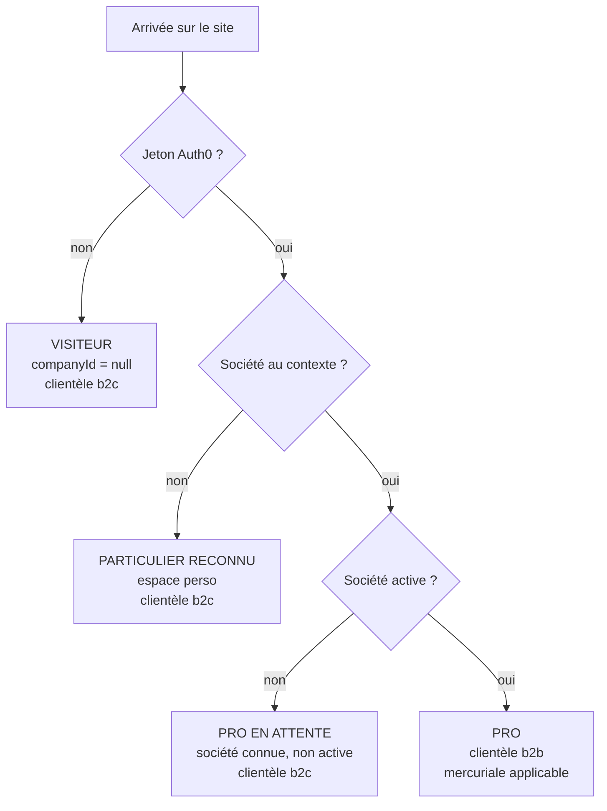
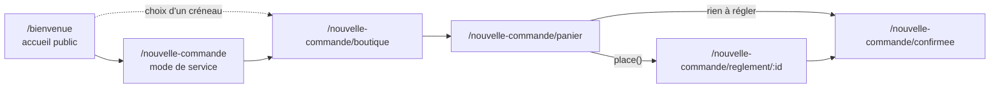
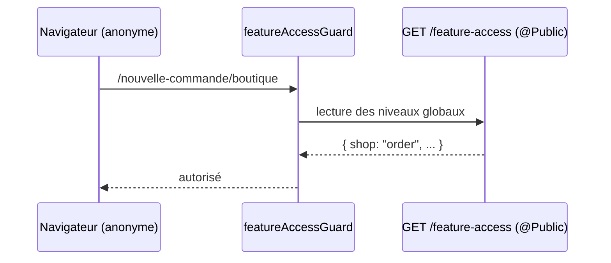
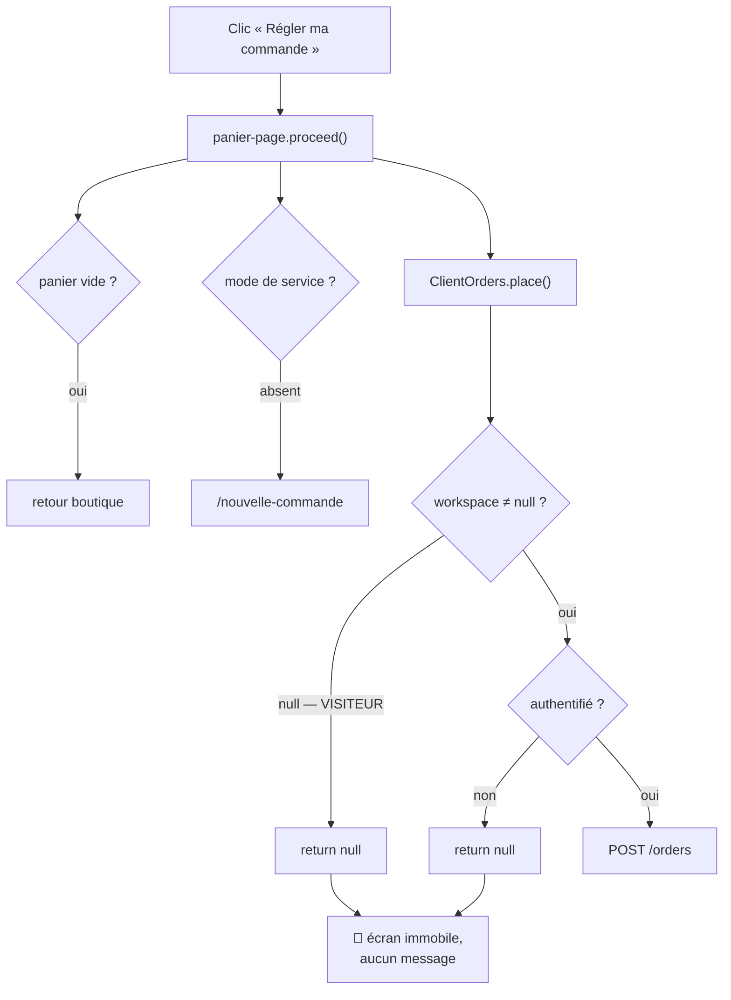

# Les parcours de commande — schéma de l'existant

> **État : description du code au 2026-09-17.** Ce document ne propose rien et
> ne décide rien. Il dessine ce qui EXISTE, pour que le plan
> [`plan-commande-sans-compte.md`](plan-commande-sans-compte.md) se décide sur
> une carte plutôt que de mémoire.
>
> Chaque affirmation porte le fichier qui la prouve. Ce qui n'a pas été ouvert est
> dit comme tel, au §7.

---

## 1. Les quatre entrées, et ce qui les sépare

Le dépôt ne connaît pas quatre « types de client ». Il connaît **trois
questions**, posées à des moments différents, et c'est leur combinaison qui
fabrique les parcours :

| La question                       | Qui y répond                 | Où                                                                               |
| --------------------------------- | ---------------------------- | -------------------------------------------------------------------------------- |
| Y a-t-il un jeton ?               | Auth0, puis le guard global  | `apps/lfd-api/src/platform/auth/auth.guard.ts`                                   |
| Y a-t-il un espace de travail ?   | le front, après `/me`        | `apps/lfc-B2B-platform-frontend/src/app/client/client-workspace.service.ts`      |
| Y a-t-il une société **active** ? | le serveur, à chaque requête | `apps/lfd-api/src/b2b/orders/application/services/customer-audiences.service.ts` |

La troisième décide la **clientèle** (`b2b` / `b2c`), et donc la remise et le
prix. Elle est **déduite, jamais déclarée** : ni un corps ni un en-tête ne la
portent.

⚠️ **Le « pro en attente » est un quatrième cas réel, pas une nuance.** Une
société non active rend `b2c` (`customer-audiences.service.ts`, via `audienceOf`)
— il voit donc les prix et les remises d'un particulier, tout en ayant un
dossier d'entreprise à l'écran.

---

## 2. Le tunnel, et où chaque branche s'arrête

Les six écrans sont les mêmes pour tout le monde. Ce qui change est **le point
où l'on bute**.

| Écran                      | Visiteur            | Particulier | Pro          |
| -------------------------- | ------------------- | ----------- | ------------ |
| `/bienvenue`               | ✅                  | ✅          | ✅           |
| boutique                   | ✅                  | ✅          | ✅           |
| panier (affichage + total) | ✅                  | ✅          | ✅           |
| **« Régler ma commande »** | 🔴 **ne fait rien** | ✅          | ✅           |
| règlement Stripe           | —                   | ✅          | ✅ / différé |

🔴 **C'est la seule marche du tunnel, et elle est muette.** Tout le reste
fonctionne déjà pour un visiteur.

---

## 3. Pourquoi un visiteur atteint la boutique et le panier

C'est contre-intuitif : les deux routes portent un garde.

- `/nouvelle-commande/boutique` → `featureAccessGuard('shop', 'browse')`
- `/nouvelle-commande/panier` → `featureAccessGuard('shop', 'order')`

Le garde (`apps/lfc-B2B-platform-frontend/src/app/client/feature-access/feature-access.guard.ts`)
n'est pas une protection — son propre JSDoc le dit : « Ce n'est pas une
protection — l'API refuse d'elle-même ». Il lit un niveau servi par le serveur,
et **la route qui le sert est publique** :

- `GET /feature-access` est `@Public()`
  (`apps/lfd-api/src/b2b/feature-access/http/feature-access.controller.ts`) ;
- elle résout avec un sujet `null`
  (`apps/lfd-api/src/b2b/feature-access/application/queries/get-feature-levels.handler.ts`) ;
- et le défaut de la clé `shop` au catalogue fermé est **`order`**
  (`packages/contracts/src/feature-access.levels.ts`).

Donc un anonyme reçoit `shop: "order"`, et `isAtLeast` le laisse passer sur les
deux routes. Le front choisit la bonne lecture selon la reconnaissance
(`client-feature-access.service.ts` : `/feature-access/mine` avec jeton,
`/feature-access` sans).

⚠️ **Conséquence à ne pas manquer** : fermer la boutique en admin
(`shop: closed`) renvoie aussi les visiteurs sur `/bienvenue`. Le même levier
tient les trois publics.

---

## 4. Ce qu'un visiteur obtient déjà du serveur

Quatre routes publiques couvrent tout le parcours **jusqu'au règlement** :

| Route                                | Fichier                                                                     | Ce qu'elle rend                                 |
| ------------------------------------ | --------------------------------------------------------------------------- | ----------------------------------------------- |
| `GET /shop/catalogue`                | `apps/lfd-api/src/b2b/catalog/http/shop-catalogue.controller.ts`            | le catalogue au prix résolu à `companyId: null` |
| `POST /shop/quote`                   | `apps/lfd-api/src/b2b/orders/http/shop-quote.controller.ts`                 | le **total exact** du panier, TVA ventilée      |
| `GET /pickup-addresses`              | `apps/lfd-api/src/b2b/pickup-addresses/http/pickup-addresses.controller.ts` | les maisons                                     |
| `GET /pickup-addresses/:id/creneaux` | même fichier                                                                | les créneaux, contre l'horloge **serveur**      |

Les quatre sont `@Public()` et bornées à 60 appels/minute.

🔴 **Le devis public n'est pas un affichage de complaisance.** Il passe par le
même service de prix que la caisse et ventile la TVA avec la fonction dont
`Order.draft` se sert (`quote-shop-cart.handler.ts`). Un visiteur voit donc
**le montant qu'il paierait**.

---

## 5. Le mur, et sa nature exacte

Le mur n'est ni dans les routes du front, ni dans `POST /orders`. Il est dans le
service de commandes du navigateur.

Deux sorties `null`, dans
`apps/lfc-B2B-platform-frontend/src/app/client/client-orders.service.ts` :
l'absence d'espace de travail, puis l'absence de jeton.

Et le commentaire de `proceed()`
(`apps/lfc-B2B-platform-frontend/src/app/client/cart/panier-page/panier-page.ts`)
affirme : « Le refus a déjà été dit, et le panier est intact ». **C'est vrai
d'un refus serveur, et faux de ces deux-là** — personne ne les a dits. Le
visiteur clique, et rien ne bouge.

Côté serveur, `POST /orders`
(`apps/lfd-api/src/b2b/orders/http/orders.controller.ts`) n'est pas public :
il prend `@CurrentUser() user: Principal` et la société vient du **contexte**,
jamais du corps.

---

## 6. Ce que le schéma apprend au plan

### 6.1 🔴 La précondition « prix pro » doit être requalifiée

Le §6 du plan pose : « un prix résolu sans société est le **prix pro** », et en
fait un verrou technique bloquant. **Le code ne dit pas ça.**

- `matchesAudience` (`apps/lfd-api/src/b2b/pricing/domain/specificity.ts`) :
  une règle `all` s'applique toujours ; une règle `segment` ou `company` exige
  une correspondance — donc `companyId: null` n'en déclenche aucune.
- Sans société, **aucune mercuriale** n'entre dans la chaîne
  (`apps/lfd-api/src/b2b/pricing/domain/resolve-price.ts`).
- Et la vitrine publique **sert déjà** ce prix-là à des prospects depuis le
  2026-09-09, en l'assumant par écrit (`shop-catalogue.controller.ts`).

Ce qu'un visiteur paie est donc le **tarif de liste du catalogue**, moins les
seules promotions ouvertes à tous.

Ce qui reste vrai, et c'est une autre question : **ce tarif de liste est-il
destiné au public ?** Ça ne se lit pas dans le code — c'est une décision
commerciale. La précondition passe donc de « verrou technique » à « arbitrage de
prix », et elle cesse de bloquer l'écriture de la route.

### 6.2 Le lot d'écran est indépendant, et il répare un défaut réel

Le silence du §5 n'est pas une conséquence de l'absence de route publique : même
avec la route serveur livrée, un visiteur cliquerait dans le vide tant que
`place()` rend `null` sans rien dire. Ce lot se fait seul, et il vaut d'être
fait même si la route n'arrive jamais.

### 6.3 Ce que la route publique devra refaire, et rien de plus

Le schéma montre que le tunnel public est **déjà entier jusqu'au panier**. Ce
qui manque est exactement : un porteur d'identité pour `POST /orders`, et une
clé d'idempotence qui ne soit pas indexée sur un `userId`
(`apps/lfd-api/prisma/schema/public/orders.prisma`).

---

## 7. Ce que ce document n'a pas ouvert

Dit ici plutôt que taire, pour que personne ne prenne un silence pour une
vérification :

- **le mode de règlement** (`settlement: 'due' | 'later' | 'paid'`) — je sais
  d'où il vient au front, pas quelle règle serveur le décide ;
- **la synchronisation du panier au serveur**
  (`apps/lfc-B2B-platform-frontend/src/app/client/cart/shop-cart-sync.service.ts`) :
  son brouillon exige un espace de travail non nul, donc elle ne part pas pour
  un visiteur — mais je n'ai pas lu ce qu'elle fait au moment où il se connecte ;
- **la reprise après connexion** : `AuthFacade.login(target)` restaure une
  cible, et le panier local (`cart`, en `localStorage`) est scopé par espace de
  travail (`cart.store.ts`). Ce que devient un panier composé anonymement au
  moment où un espace apparaît n'a pas été tracé.

Ce troisième point est la décision **D3** du plan, et le schéma explique
pourquoi elle est la plus coûteuse : le panier change de clé de stockage au
moment exact où le visiteur cesse d'en être un.
