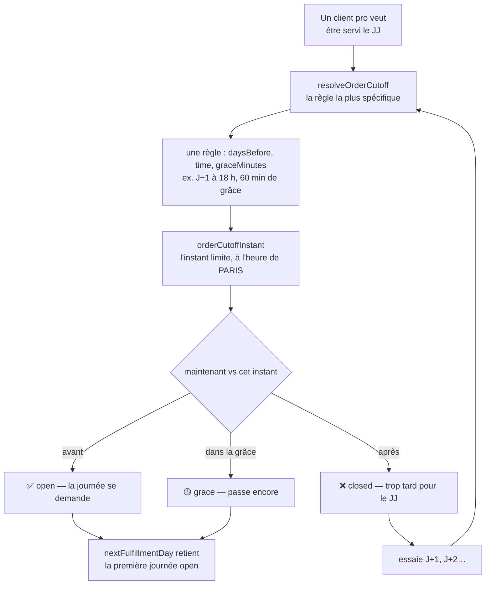
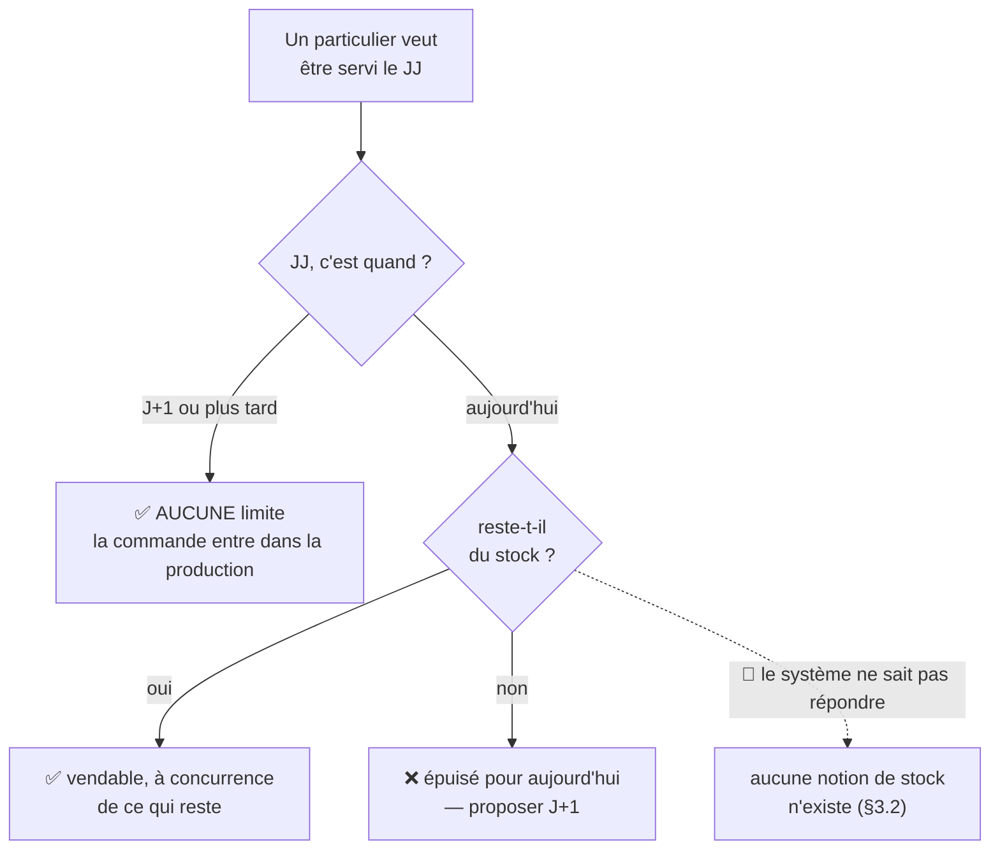
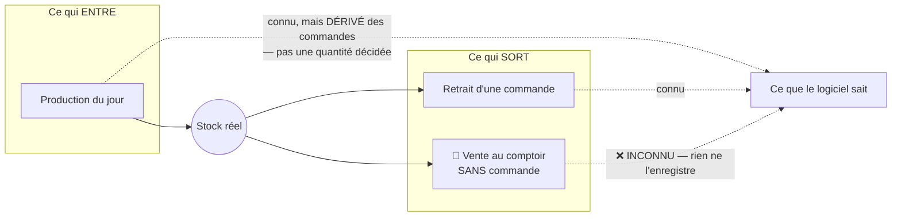

# La limite du B2C : pas de limite à J+N, le stock à J

**Statut** : 📐 conception, rien n'est bâti. Écrit le 2026-09-17, **contredit
par `vitruve`** le même jour (quatre BLOQUANTS), refondu, puis **réécrit** après
deux précisions métier de Hugo qui en ont déplacé l'objet. Le sort des
objections est au §9.
**Portée** : **quelle journée un client peut demander, et pourquoi**. Ni le
tarif public, ni la commande sans compte — ils ont leurs documents.

> 🔴 **Ce document décrit maintenant DEUX lots de tailles très différentes.**
> Le premier se livre (§4). Le second n'a pas de fondation dans le système et
> demande sa propre conception (§5). Les confondre ferait promettre à J0 ce que
> seul J+1 peut tenir.

## 0. La demande

> « au niveau des créneaux public, on doit avoir aujourd'hui aussi, c'est du
> public » — Hugo, 2026-09-17.
>
> « en fait sur du b2c notre limite n'est pas de prod, elle est en capacité de
> **stock existant**, pour jour J. J+1 ne sera jamais un problème car ajouté à
> la prod. »
>
> « pour moi **commande à J = limite de stock**, à **J+N pas de limite** » — pour
> le b2c.
>
> « il peut vendre **sans commande au comptoir**, mais on cherche un moyen
> d'avoir le **stock temps réel**. »

**La règle voulue tient en deux lignes** :

| Quand               | Limite B2C                                           |
| ------------------- | ---------------------------------------------------- |
| **J** (aujourd'hui) | ce qu'il reste **en stock**, rien d'autre            |
| **J+1 et au-delà**  | **aucune** — c'est de la production, elle a le temps |

## 1. Pourquoi la limite du B2B ne convient pas au B2C

Une heure limite existe pour une seule raison : **laisser au fournil le temps de
produire**. « Commandez avant 18 h la veille » n'est pas une contrainte de
vente, c'est un délai de fabrication.

Appliquée au public, elle répond à la mauvaise question. Un particulier qui
passe à 9 h ne demande pas qu'on produise pour lui : il demande **ce qui est
là**. Et pour après-demain, il n'y a rien à arbitrer — sa commande entre dans le
plan comme n'importe quelle autre.

C'est pourquoi ce document ne s'appelle plus « l'heure limite par clientèle » :
l'heure limite est l'outil du B2B. Le B2C en demande un autre, et un seul des
deux existe.

## 2. Comment la limite B2B fonctionne aujourd'hui

### 2.1 Le schéma

**Ce que ce schéma dit, et qui compte pour la suite** : la décision porte sur le
**temps**, jamais sur une quantité. Le système ne se demande nulle part s'il
reste quelque chose — la question ne s'est jamais posée, parce qu'un pro commande
ce qui sera **fabriqué pour lui**.

### 2.2 Les pièces, vérifiées le 2026-09-17

- la règle : `packages/contracts/src/order-cutoff.ts` — cinq champs
  (`pickupAddressId`, `weekday`, `daysBefore`, `time`, `graceMinutes`) ;
- l'ouverture de l'écran :
  `apps/lfd-api/src/b2b/order-cutoffs/application/list-fulfillment-days.handler.ts` ;
- le refus à la caisse :
  `apps/lfd-api/src/b2b/orders/domain/services/order-cutoff-guard.ts` ;
- l'unicité, tenue par **quatre** objets :
  `@@unique([pickupAddressId, weekday])` dans
  `apps/lfd-api/prisma/schema/public/orders.prisma`, plus trois index partiels
  dans
  `apps/lfd-api/prisma/migrations/20260810071500_order_cutoffs_unique_defaults/migration.sql`.

## 3. Ce que le B2C demande — et ce que le système en sait

### 3.1 Le schéma voulu

### 3.2 🔴 Le stock n'est pas « non modélisé » : il est **inobservable**

Trois flux font le stock d'une journée. Le système n'en connaît qu'un et demi.

**Deux trous, et le second est le plus grave :**

1. **Ce qui entre est dérivé, pas décidé.** `ProducedItemSnapshot` porte
   « le **compte à produire** : un article, une quantité, tous clients
   confondus » — dérivé des commandes de la journée. Le fournil coche ce qui est
   demandé (`batch/:date/sheets/:reference/packed`) et clôt la journée ; il n'a
   **aucun geste pour poser une quantité** qu'on produirait pour la vitrine.
2. **Ce qui sort au comptoir n'est enregistré nulle part.** Une vente directe
   existe en boutique et ne laisse aucune trace dans le système.

Conséquence : un stock calculé « produit − vendu » vaudrait **zéro en
permanence** au mieux, et **dériverait dès la première vente directe** au pire.
Il ne serait faux que d'une manière — toujours optimiste : on vendrait ce qui
est déjà parti.

⚠️ Le dépôt a déjà noté cette dette sans la trancher :
`apps/lfd-api/prisma/schema/growth.prisma` porte « Stock : décision _source de
vérité_ reportée (Shopify vs nous) ».

## 4. Lot 1 — J+N sans limite pour le B2C (livrable)

Ce lot **n'attend pas le stock**, et il livre la moitié de la demande : un
particulier peut commander pour demain et au-delà, sans heure limite.

La clientèle entre dans **l'identité** de la règle — il faut bien deux règles
concurrentes sur un même point, l'une pour les pros, l'autre pour le public.

🔴 **Et non comme un simple filtre** (des booléens `{b2b, b2c}` sur une règle
unique) : ce serait le précédent `pickupDiscountFor`, mais une remise est unique
par point et s'applique ou non, alors qu'ici on veut **deux limites
différentes** au même endroit.

### 4.1 Le coût réel : reconstruire l'unicité

Trois colonnes nullables d'identité = **sept** index partiels (2³ − 1) là où il
y en a trois, plus le `@@unique` à refaire. Sur une table servie, ce n'est pas
un `ADD COLUMN`.

⚠️ **Sans cette reconstruction, la fonctionnalité ne sert pas une seule fois** :
la première règle publique entre en collision avec le défaut existant sur
`order_cutoffs_default_all_days`, Postgres rend `P2002`, et l'écran affiche
« règle en double ».

### 4.2 L'ordre de spécificité : la clientèle vient EN DERNIER

Point, puis jour, puis clientèle. La clientèle **départage** deux règles de même
portée ; elle n'en renverse aucune.

La première version la mettait en tête. C'était faux : une seule règle « public,
défaut, tous les jours » aurait rendu inatteignable **toute** règle existante —
y compris « ce point, ce dimanche ». On croit ajouter une ligne, on éteint la
configuration. La raison empruntée au tarif ne se transpose pas : l'audience y
va jusqu'à une société **nommée**, ici elle s'arrête à « les particuliers ».

### 4.3 L'égalité devient atteignable, et rien ne la signale

`resolveOrderCutoff` est une suite de `rules.find(...)` : à rang égal, **le
premier du tableau gagne**, et ce tableau est trié par le libellé du comptoir.
Renommer « Le Village » changerait la règle appliquée. Il faut donc **refuser
explicitement** et poser la contrainte en base.

## 5. Lot 2 — le stock temps réel (à concevoir, pas à bâtir ici)

Ce lot ouvre J0. Il ne se résume pas à un champ : il demande de rendre
**observable** ce qui ne l'est pas.

Trois questions, dans cet ordre, et aucune n'est technique au départ :

1. **Qui décide de ce qui est produit pour la vitrine ?** Aujourd'hui personne :
   le compte à produire est dérivé des commandes. Il faut un geste du fournil
   qui dise « j'en fais trente de plus », sans quoi il n'y a jamais rien à
   vendre à J0.
2. **Comment une vente au comptoir entre-t-elle dans le système ?** C'est le
   trou décisif. Sans elle, tout stock affiché dérive dans le sens du survente.
   Une caisse, un décompte au retrait, un inventaire de fin de journée — ce sont
   trois produits différents, pas trois options techniques.
3. **Qui fait autorité ?** La note de `growth.prisma` pose déjà la question
   (« Shopify vs nous ») et la laisse ouverte. Un stock à deux sources de vérité
   est un stock faux.

⚠️ **Tant que 2 n'est pas tranchée, J0 ne doit pas s'ouvrir** — même avec un
stock affiché. Vendre ce qui vient d'être vendu au comptoir coûte plus qu'une
journée fermée : c'est un client qui se déplace pour rien, avec un QR valide.

## 6. 🔴 Ce qui peut vider les deux lots : la limite d'article

`order-cutoff-guard.ts` le dit en rouge : **« L'article ne peut pas RELÂCHER la
règle du commerce, il la remplace. »** Un article portant son `orderTimeLimit`
ignore la règle du commerce — donc la clientèle, donc « pas de limite ».

Une seule limite d'article de portée globale suffirait à ce que le public se
voie refuser à la caisse ce que l'écran vient de lui proposer — la pathologie
« proposer puis refuser » que `nextFulfillmentDay` a été écrite pour supprimer.

**Vérification requise avant de bâtir le lot 1** : existe-t-il une
`OrderTimeLimit` de portée globale en production ?

## 7. La route publique sert LES DEUX dates

`GET /fulfillment-days` est `@Public()`, sans paramètre, et son commentaire
affirme que sa réponse est « la même pour tout le monde ». Une clientèle casse
cette propriété.

Le précédent à suivre n'est pas `/mine` mais
`apps/lfd-api/src/b2b/delivery-availability/http/delivery-availability.controller.ts` :
public, sans paramètre, il sert **les deux clientèles** (`{openToB2b,
openToB2c}`), le front applique la sienne et le serveur refuse quand même à la
caisse. `FulfillmentDayView` porte donc **une date par clientèle** : une seule
route, cachable, et il devient **impossible** qu'un pro appelle la mauvaise.

⚠️ Ce n'est pas un confort : cette route est **déjà servie** à des pros
connectés. Le jour où une règle publique est posée, ce sont eux qui verraient
des journées qui ne sont pas les leurs — sur un contrat déjà servi.

## 8. Le coût du lot 1, fichier par fichier

**La règle** : `packages/contracts/src/order-cutoff.ts` (champ, résolution,
refus d'égalité) et `packages/contracts/src/__tests__/order-cutoff.spec.ts`.

**La base** : la migration d'unicité du §4.1.

**Le serveur** : `order-cutoff-guard.ts` (l'audience en entrée),
`apps/lfd-api/src/b2b/orders/application/services/order-drafting.service.ts`
(elle y est calculée, mais **dans** `resolveFulfillment` et non rendue — il faut
la hisser, sinon c'est une seconde lecture du statut de société par commande),
`list-fulfillment-days.handler.ts`, `admin-order-cutoffs.controller.ts`, le
dépôt Prisma et ses ports.

🔴 **Le journal** :
`apps/lfd-api/src/b2b/order-cutoffs/domain/order-cutoff.events.ts` fige **cinq
champs**, et dit pourquoi — « quand un client réclame, la question est de savoir
ce que la règle disait ce jour-là ». Une règle de clientèle dont le fait tait la
clientèle rend le journal inapte à sa raison d'être.

🔴 **Le semis** : `apps/lfd-api/src/dev/seeding/station.seed.ts` garde son
idempotence par `findFirst({ pickupAddressId: null, weekday: null })` — cette
garde devient fausse dès qu'une clientèle existe.

**Le back-office** : `order-cutoffs.service.ts`, `cutoffs-section/`,
`cutoff-format.ts`, `cutoff-panel/`, `order-cutoffs-page/`. Deux règles qui
s'afficheraient identiques en donnant des résultats différents seraient pires
que pas de fonctionnalité.

## 9. Le sort des objections de `vitruve`

| #                                                      | Sort                                                                                              |
| ------------------------------------------------------ | ------------------------------------------------------------------------------------------------- |
| **B1** la migration refuserait la première règle       | **assumée** — devenue le §4.1, c'est le travail                                                   |
| **B2** l'ordre proposé éteint la configuration         | **corrigée** — la clientèle en DERNIER (§4.2)                                                     |
| **B3** le précédent cité est un filtre, pas un rang    | **contestée et tranchée** (§4) — un filtre ne rend pas deux limites différentes sur un même point |
| **B4** les égalités deviennent atteignables            | **corrigée** — refus explicite + contrainte en base (§4.3)                                        |
| **S5** la limite d'article court-circuite la clientèle | 🔴 **entière** — §6, et elle peut vider les deux lots                                             |
| **S6** `/mine` est le mauvais motif                    | **corrigée** — une route, deux dates (§7)                                                         |
| **S7** sites omis (journal, semis, dépôt, tests)       | **corrigée** — §8                                                                                 |
| **S8** D3 n'est pas un lotissement                     | **corrigée** — non-régression pour les pros en service (§7)                                       |
| **S9** l'irréversibilité n'est pas dite                | **corrigée** — §10                                                                                |
| D4 (`graceMinutes`)                                    | **retirée** : le rattrapage est un champ de la règle, il la suit                                  |

## 10. Ce que le lot 1 rend irréversible, et à partir de quand

Le point de non-retour est **la première règle portant une clientèle**. Avant :
tout se défait. Après : la colonne ne se retire plus sans perdre une décision
commerciale, et **l'ordre de spécificité du §4.2 ne se change plus** sans
modifier silencieusement quelles commandes passent — sans qu'aucun test ne
rougisse, puisque les 25 cas existants portent tous sur des règles à clientèle
nulle.

## 11. Ce qui reste à trancher

- **D1 — une valeur `all` explicite, ou un `NULL` ?** Le dépôt a un précédent
  nommé côté prix (`all` / `segment` / `company`) plutôt qu'une absence.
- **D2 — la limite d'article (§6)** : on la laisse court-circuiter la clientèle,
  ou le lot 1 attend qu'elle soit traitée ?
- **D3 — le lot 2 se conçoit-il maintenant ?** J0 restera fermé au public tant
  qu'il n'existe pas. Le dire à l'écran (« aujourd'hui, passez au comptoir »)
  est peut-être la bonne réponse provisoire.

## 12. Ce qui n'a PAS été ouvert

- **Les règles d'heure limite en production** et leurs `daysBefore` — c'est ce
  qui dit ce qui change pour un client réel le jour du déploiement.
- **Une `OrderTimeLimit` de portée globale en production** : le §6 est établi
  comme mécanisme, pas comme fait.
- **La caisse du comptoir** : ce qui s'y passe aujourd'hui, avec quel outil, et
  ce qu'il en reste comme trace. Le §5 affirme qu'il n'en reste rien **dans ce
  système** ; il ne dit pas qu'il n'en existe aucune ailleurs.
- **La passerelle** et le rendu des deux composants d'admin.
