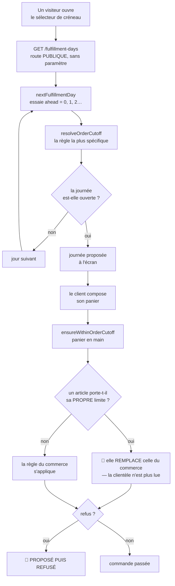
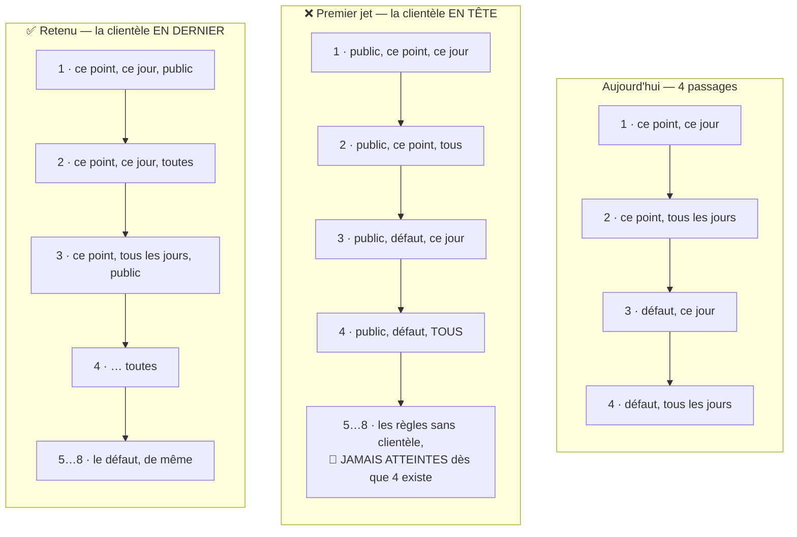

# L'heure limite par clientèle

**Statut** : 📐 conception, rien n'est bâti. Écrit le 2026-09-17, **contredit par
`vitruve` le même jour** (quatre BLOQUANTS, cinq SÉRIEUX), puis **refondu**. Le
sort de chaque objection est au §8.
**Portée** : **quelle journée est demandable, et par qui**. Ni le tarif public,
ni la commande sans compte — ils ont leurs documents.

> 🔴 **Ce plan porte une migration d'unicité, pas un simple ajout de colonne, et
> il décide si une commande passe.** Sa première version annonçait « additive,
> un déploiement » : c'était faux, et le §3 dit maintenant pourquoi.

## 0. La demande

> « au niveau des créneaux public, on doit avoir aujourd'hui aussi, c'est du
> public » — Hugo, 2026-09-17. Puis l'arbitrage, après constat que le jour même
> n'est pas exclu par le code : **« une clientèle sur la règle d'heure limite »**.

Ce qui l'a ouvert : `nextFulfillmentDay` commence sa boucle à `ahead = 0`, donc
aujourd'hui est proposé **dès qu'il est ouvert**. C'est le `daysBefore` de la
règle applicable qui le ferme, et cette règle vaut pour tout le monde.

**Ce que la demande exige vraiment, et c'est le cœur du coût** : deux limites
**différentes** sur le même point — aujourd'hui pour le public, J−1 pour les
pros. Pas une règle qu'on active ou non : deux règles concurrentes.

## 1. Ce qui existe (ouvert et vérifié le 2026-09-17)

### 1.1 La règle

`orderCutoffPayloadSchema` (`packages/contracts/src/order-cutoff.ts`) porte cinq
champs : `pickupAddressId` (`null` = défaut plateforme), `weekday` (`null` =
tous les jours), `daysBefore` (`0` = le jour même), `time`, `graceMinutes`.
Aucune clientèle, ni au contrat ni au modèle.

### 1.2 Les trois sites qui décident

| Site                                                                              | Ce qu'il fait                           | A-t-il l'audience ?     |
| --------------------------------------------------------------------------------- | --------------------------------------- | ----------------------- |
| `apps/lfd-api/src/b2b/order-cutoffs/application/list-fulfillment-days.handler.ts` | Ouvre l'écran : quelle journée proposer | 🔴 non — route publique |
| `apps/lfd-api/src/b2b/orders/domain/services/order-cutoff-guard.ts`               | Refuse une commande hors limite         | non (entrée à étendre)  |
| `apps/lfd-api/src/b2b/orders/application/services/order-drafting.service.ts`      | Appelle le garde, panier en main        | ✅ la calcule déjà      |

⚠️ **Nuance corrigée** : `order-drafting.service.ts` résout bien `audience`,
mais **dans** `resolveFulfillment`, et `ResolvedFulfillment` ne la rend pas. La
passer au garde demande un hissage — sinon c'est une seconde lecture du statut
de société à chaque commande. La dépendance est là ; le geste ne l'est pas.

### 1.3 🔴 Ce qui tient l'unicité, et que la première version avait manqué

**Quatre objets**, aucun ne connaissant la clientèle :

- `@@unique([pickupAddressId, weekday])`
  (`apps/lfd-api/prisma/schema/public/orders.prisma`) ;
- trois index partiels
  (`apps/lfd-api/prisma/migrations/20260810071500_order_cutoffs_unique_defaults/migration.sql`) :
  `order_cutoffs_default_all_days`, `order_cutoffs_default_by_weekday`,
  `order_cutoffs_point_all_days` — parce que Postgres traite chaque `NULL`
  comme distinct, et que le `@@unique` ne couvre donc que le cas sans `NULL`.

C'est écrit dans le schéma : « deux règles concurrentes rendraient la résolution
dépendante de l'ordre de lecture ».

### 1.4 Le schéma : qui décide qu'une journée est ouverte

**Deux décisions, à deux moments, et elles peuvent se contredire.** L'une ouvre
l'écran, l'autre refuse la commande — et c'est entre les deux que le plan se
joue.

🔴 **La branche de gauche est le §5.** Seule la caisse lit la limite d'article ;
l'écran ne la connaît pas. Une limite d'article de portée globale ferait donc
proposer « aujourd'hui » au public et refuser sa commande — la pathologie même
que `nextFulfillmentDay` a été écrite pour supprimer.

### 1.5 Le schéma : la règle qui gagne, avant et après

La résolution prend **la plus spécifique**. Aujourd'hui, quatre passages ; avec
une clientèle, huit — et leur ORDRE décide quelles commandes passent.

**Ce que le jet rejeté produisait** : une seule règle « public, défaut, tous les
jours » rendait inatteignables **toutes** les règles existantes. On croit
ajouter une ligne, on éteint la configuration.

**Ce que le retenu produit** : la clientèle départage deux règles de même
portée, elle n'en renverse aucune. Une règle « ce point, ce dimanche » continue
de s'appliquer à tout le monde tant que personne n'a écrit sa variante publique.

## 2. La décision

La clientèle entre dans **l'identité** de la règle, à côté du point et du jour.

🔴 **Et non comme un filtre**, bien que ce soit ce que la première version
annonçait en citant `pickupDiscountFor`. La contradiction a raison sur la
lettre — ce précédent est un couple de booléens d'applicabilité, pas un rang —
mais un filtre **ne répond pas à la demande** : une remise est unique par point,
elle s'applique ou non ; ici on veut **deux limites différentes** sur le même
point. Deux règles concurrentes, donc une identité à trois colonnes.

Conséquence assumée : le BLOQUANT sur la migration ne disparaît pas, il devient
le travail principal (§3).

## 3. 🔴 Le vrai coût : reconstruire l'unicité, pas ajouter une colonne

Trois colonnes nullables d'identité = **sept** index partiels (2³ − 1) là où il
y en a trois, plus le `@@unique` à refaire. Sur une table **servie**, ce n'est
pas un `ADD COLUMN` : c'est `DROP INDEX` puis `CREATE UNIQUE INDEX`, et le
CLAUDE.md §0 impose d'y regarder à deux fois.

⚠️ **Et sans cette reconstruction, la fonctionnalité ne peut pas être utilisée
une seule fois** : la première règle posée — « défaut plateforme, tous les
jours, public » — entre en collision avec la règle par défaut existante sur
`order_cutoffs_default_all_days`, Postgres rend `P2002`, et l'écran d'admin
affiche « règle en double ».

## 4. 🔴 L'ordre de spécificité : la clientèle vient EN DERNIER

La première version proposait la clientèle comme critère **le plus fort**, en
s'appuyant sur `apps/lfd-api/src/b2b/pricing/domain/specificity.ts`. C'était
faux, et la démonstration contraire est mécanique : avec la clientèle en tête,
**une seule** règle « public, défaut, tous les jours » rend inatteignable toute
règle à clientèle nulle — y compris « ce point, ce dimanche ». L'administrateur
croit ajouter une ligne ; il éteint sa configuration.

La raison du côté prix ne se transpose pas : l'audience y va jusqu'à `company`,
c'est-à-dire une **identité négociée**. Ici elle s'arrête à `b2c` — la moitié du
monde. Une règle « les particuliers » est ce qu'il y a de plus **général**.

**Ordre retenu** : point, puis jour, puis clientèle — la clientèle départage à
égalité, elle ne renverse rien.

### 4.1 L'égalité devient atteignable, et rien ne la signale

`resolveOrderCutoff` est une suite de `rules.find(...)` : à rang égal, **le
premier du tableau gagne**, et ce tableau est trié par le libellé du comptoir.
Renommer « Le Village » changerait la règle appliquée. Aujourd'hui le cas est
impossible — les quatre index l'interdisent ; ce plan le rend possible.

Il faut donc **refuser explicitement**, comme le fait la résolution des prix, et
poser la contrainte en base : interdit là où c'est inexprimable, revérifié en
pur. C'est la seule alternative à un tri sur un nom d'affichage.

## 5. 🔴 Ce que ce plan ne peut PAS tenir : la limite d'article

`order-cutoff-guard.ts` le dit en rouge : **« L'article ne peut pas RELÂCHER la
règle du commerce, il la remplace. »** Un article portant son `orderTimeLimit`
ignore donc la règle du commerce, donc la clientèle.

Conséquence, et elle vide la promesse : **une seule limite d'article de portée
globale suffit à ce que la règle publique ne serve jamais à la caisse**. Pire,
`list-fulfillment-days.handler.ts` ne connaît que les règles du commerce : il
proposerait « aujourd'hui » au public pendant que le garde refuse — exactement
la pathologie « proposer puis refuser » que `nextFulfillmentDay` a été écrite
pour supprimer.

La première version rangeait ceci en « hypothèse » au §7. C'était la seule
hypothèse fausse, et elle portait l'objectif.

**Vérification requise avant de bâtir** : existe-t-il une `OrderTimeLimit` de
portée globale en production ? Si oui, ce plan ne produit rien tant que la
question de l'article n'est pas tranchée.

## 6. La route publique sert LES DEUX dates

`GET /fulfillment-days` est `@Public()` et sans paramètre ; son commentaire
affirme que sa réponse est « la même pour tout le monde ».

La première version proposait le motif `/mine`. Meilleur précédent, à deux
portes de là :
`apps/lfd-api/src/b2b/delivery-availability/http/delivery-availability.controller.ts`
est public, sans paramètre, et sert **les deux clientèles** — `{openToB2b,
openToB2c}` —, le front appliquant la sienne et le serveur refusant quand même
à la caisse.

`FulfillmentDayView` porte donc **une date par clientèle**. Une seule route,
publique, cachable, et il devient **impossible** qu'un pro appelle la mauvaise —
au lieu de le lui interdire par convention.

⚠️ Ce n'est pas un confort : `GET /fulfillment-days` est **déjà servi
aujourd'hui** à des pros connectés. Le jour où une règle publique est posée, ce
sont eux qui verraient des journées qui ne sont pas les leurs — sur un contrat
déjà servi (CLAUDE.md §0).

## 7. Le coût, fichier par fichier

**La règle et le contrat** : `packages/contracts/src/order-cutoff.ts` (champ,
résolution, refus d'égalité), `packages/contracts/src/__tests__/order-cutoff.spec.ts`.

**La base** : la migration d'unicité du §3.

**Le serveur** : `order-cutoff-guard.ts` (l'audience en entrée),
`order-drafting.service.ts` (le hissage du §1.2),
`list-fulfillment-days.handler.ts` (deux dates),
`apps/lfd-api/src/b2b/order-cutoffs/http/admin-order-cutoffs.controller.ts` (le
champ traverse), le dépôt Prisma et ses ports.

🔴 **Le journal** : `apps/lfd-api/src/b2b/order-cutoffs/domain/order-cutoff.events.ts`
fige **cinq champs** dans le fait, et son commentaire dit pourquoi — « quand un
client réclame, la question est de savoir ce que la règle disait ce jour-là ».
Une règle de clientèle dont le fait tait la clientèle rend le journal inapte à
la question qu'il existe pour trancher.

🔴 **Le semis** : `apps/lfd-api/src/dev/seeding/station.seed.ts` garde son
idempotence par `findFirst({ pickupAddressId: null, weekday: null })`. Cette
garde devient fausse — elle retrouvera la règle publique et conclura que le
défaut est semé.

**Le back-office** : `order-cutoffs.service.ts`, `cutoffs-section/`,
`cutoff-format.ts`, `cutoff-panel/`, `order-cutoffs-page/`. Deux règles qui
s'afficheraient identiques en donnant des résultats différents seraient pires
que pas de fonctionnalité — et le filet y est quasi nul.

## 8. Le sort des objections

| #                                                      | Sort                                                                                                                                                          |
| ------------------------------------------------------ | ------------------------------------------------------------------------------------------------------------------------------------------------------------- |
| **B1** la migration refuserait la première règle       | **assumée, et devenue le §3** — elle ne disparaît pas, elle est le travail                                                                                    |
| **B2** l'ordre proposé éteint la configuration         | **corrigée** — la clientèle passe en DERNIER (§4), avec sa raison                                                                                             |
| **B3** le bon précédent est un filtre, pas un rang     | **contestée, et tranchée (§2)** — la lettre est juste, mais un filtre ne rend pas deux limites différentes sur un même point, donc ne répond pas à la demande |
| **B4** les égalités deviennent atteignables            | **corrigée** — refus explicite + contrainte en base (§4.1)                                                                                                    |
| **S5** la limite d'article court-circuite la clientèle | 🔴 **entière, et promue au §5** — elle peut vider le plan ; une vérification la précède                                                                       |
| **S6** `/mine` est le mauvais motif                    | **corrigée** — une route publique, deux dates (§6)                                                                                                            |
| **S7** sites omis (journal, semis, dépôt, tests)       | **corrigée** — §7                                                                                                                                             |
| **S8** D3 n'est pas un lotissement                     | **corrigée** — c'est une non-régression pour les pros en service (§6)                                                                                         |
| **S9** l'irréversibilité n'est pas dite                | **corrigée** — §9                                                                                                                                             |
| D4 (`graceMinutes`)                                    | **retirée** : fausse question, le rattrapage est un champ de la règle                                                                                         |

## 9. Ce que ce plan rend irréversible, et à partir de quand

Le point de non-retour est **la première règle portant une clientèle**. Avant :
tout se défait. Après : la colonne ne se retire plus sans perdre une décision
commerciale, et **l'ordre de spécificité du §4 ne se change plus** sans modifier
silencieusement quelles commandes passent — sans qu'aucun test ne rougisse,
puisque les 25 cas existants portent tous sur des règles à clientèle nulle.

## 10. Ce qui reste à trancher

- **D1 — trois valeurs ou deux ?** Le dépôt a un précédent nommé côté prix
  (`all` / `segment` / `company`) plutôt qu'une absence. Une valeur `all`
  explicite se lit mieux dans un `WHERE` qu'un `NULL`, mais ajoute un état.
- **D2 — la limite d'article (§5)** : on la laisse court-circuiter la clientèle,
  ou ce plan attend qu'elle soit traitée ?

## 11. Ce qui n'a PAS été ouvert

- **Les règles en production** et leurs `daysBefore` — le trou reste entier, et
  c'est lui qui dit ce qui change pour un client réel le jour du déploiement.
- **Une `OrderTimeLimit` de portée globale en production** : le §5 est établi
  comme mécanisme, pas comme fait.
- **La passerelle** et le rendu des deux composants d'admin.
