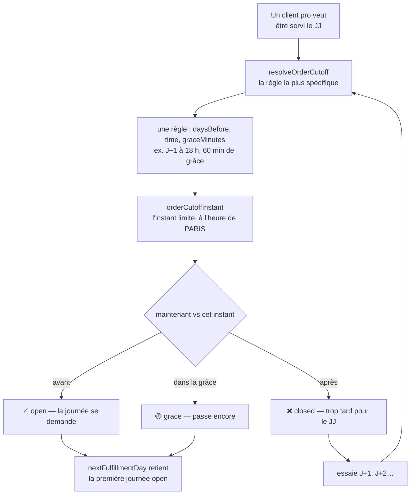
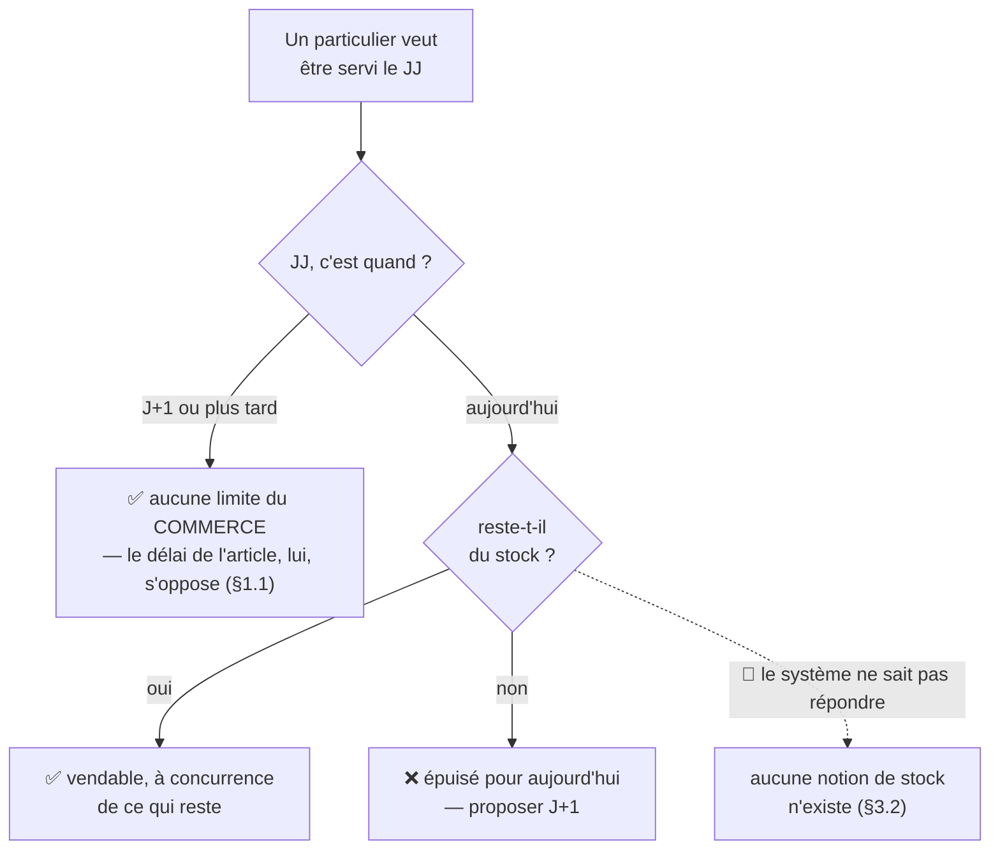
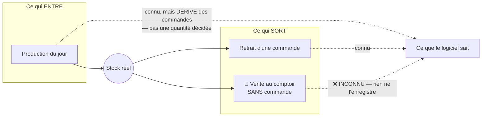
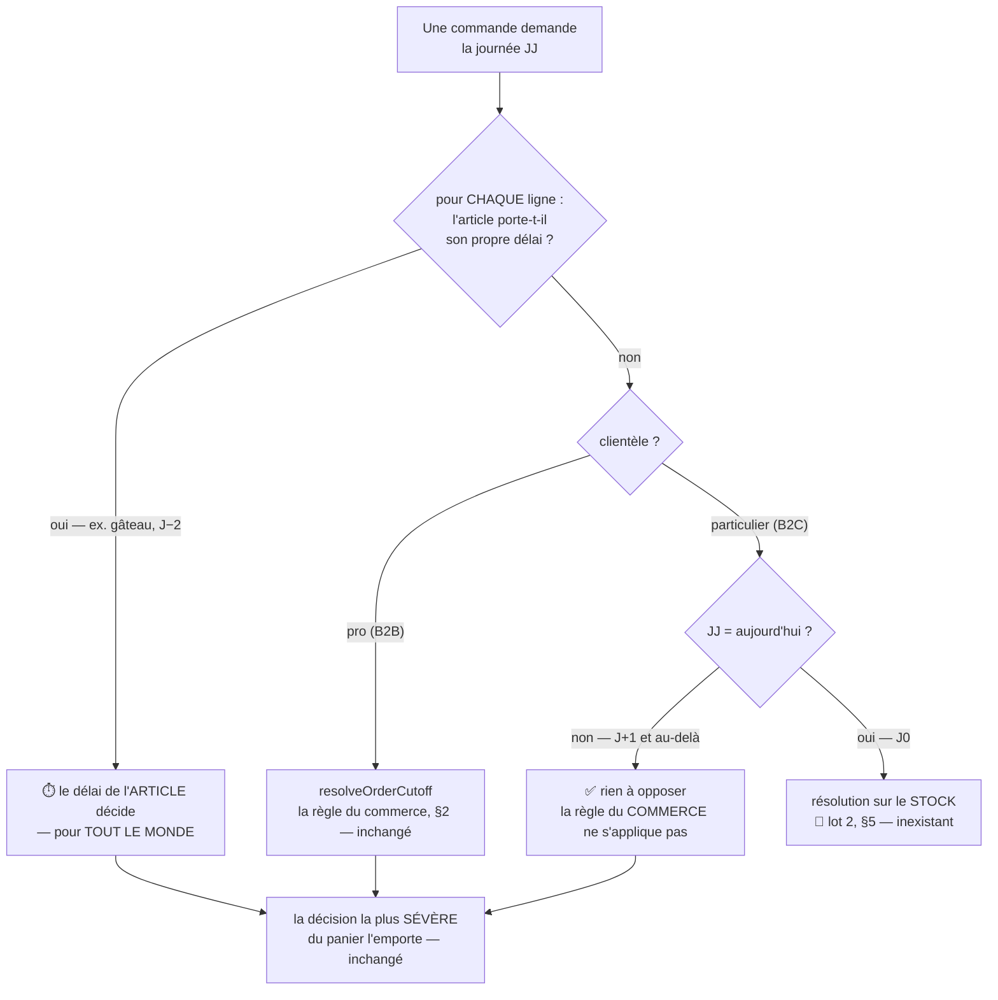

# La limite du B2C : le délai de l'ARTICLE à J+N, le stock à J

**Statut** : 📐 conception, rien n'est bâti. Écrit le 2026-09-17, **contredit
par `vitruve`** le même jour (quatre BLOQUANTS), puis refondu **trois fois** —
la dernière sur une correction de Hugo qui renverse la décision D2 et change le
titre du document. Le sort des objections est au §9.
**Portée** : **quelle journée un client peut demander, et pourquoi**. Ni le
tarif public, ni la commande sans compte — ils ont leurs documents.

> 🔴 **« Pas de limite » était faux, et c'est la correction du 2026-09-17.**
> Ce qui s'efface pour le public, c'est la règle du **commerce** — l'heure
> limite par point de retrait, qui existe pour laisser au fournil le temps de
> produire en gros. Le **délai propre à un article** reste opposable à tout le
> monde : un gâteau d'anniversaire se sait deux jours avant, qu'il soit commandé
> par un restaurant ou par un voisin.

> 🔴 **Ce document décrit DEUX lots, et l'écart entre eux s'est creusé.**
> Le premier se livre (§4) et **ne touche pas la base**. Le second n'a aucune
> fondation dans le système, et la correction de Hugo vient de lui ajouter une
> dimension qu'il n'avait pas : la **durée de vie** d'un article (§5).

## 0. La demande

> « au niveau des créneaux public, on doit avoir aujourd'hui aussi, c'est du
> public » — Hugo, 2026-09-17.
>
> « en fait sur du b2c notre limite n'est pas de prod, elle est en capacité de
> **stock existant**, pour jour J. J+1 ne sera jamais un problème car ajouté à
> la prod. »
>
> « pour moi **commande à J = limite de stock**, à **J+N pas de limite** » — pour
> le b2c.
>
> « il peut vendre **sans commande au comptoir**, mais on cherche un moyen
> d'avoir le **stock temps réel**. »

**La règle voulue tient en deux lignes** :

| Quand               | Limite B2C                                                       |
| ------------------- | ---------------------------------------------------------------- |
| **J** (aujourd'hui) | ce qu'il reste **en stock**, rien d'autre                        |
| **J+1 et au-delà**  | **aucune du commerce** — c'est de la production, elle a le temps |

⚠️ **« Aucune » a d'abord été lu comme « aucune limite du tout »**, et le §1.1
le corrige : le **délai propre à un article** (le gâteau qui se sait deux jours
avant) reste opposable. Ce qui s'efface, c'est la règle du comptoir.

## 1. Pourquoi la limite du B2B ne convient pas au B2C

Une heure limite existe pour une seule raison : **laisser au fournil le temps de
produire**. « Commandez avant 18 h la veille » n'est pas une contrainte de
vente, c'est un délai de fabrication.

Appliquée au public, elle répond à la mauvaise question. Un particulier qui
passe à 9 h ne demande pas qu'on produise pour lui : il demande **ce qui est
là**. Et pour après-demain, il n'y a rien à arbitrer — sa commande entre dans le
plan comme n'importe quelle autre.

C'est pourquoi ce document ne s'appelle plus « l'heure limite par clientèle » :
la règle du commerce est l'outil du B2B, et le B2C en demande un autre.

⚠️ **Cette phrase a dit « l'heure limite est l'outil du B2B » tout court**, et
c'était trop large — voir la correction immédiatement ci-dessous. Elle est
laissée visible plutôt que réécrite en silence : c'est elle qui a fondé la
version du plan qui effaçait les délais d'article.

### 1.1 ⚠️ Mais « l'heure limite est l'outil du B2B » ne vaut que pour le COMMERCE

Cette section a affirmé, jusqu'à la correction du 2026-09-17, qu'une heure
limite n'avait pas de sens pour le public. C'est vrai de la règle du commerce —
et **faux** de la limite portée par un article.

> « imaginons une survivabilité des articles, bûche glacée par exemple c'est du
> stock à temporalité autre, ou un gâteau d'anniversaire on a besoin de le
> savoir 2 jours avant » — Hugo, 2026-09-17.

Deux notions vivent dans cette phrase, et **une seule existe dans le système** :

| Ce que Hugo nomme     | Ce que c'est                                         | Où ça vit                                      |
| --------------------- | ---------------------------------------------------- | ---------------------------------------------- |
| gâteau d'anniversaire | un **délai de fabrication** — combien de jours AVANT | ✅ `OrderTimeLimit`, rang `product` (§1.2)     |
| bûche glacée          | une **durée de vie** — combien de jours APRÈS        | ❌ n'existe nulle part, et c'est du lot 2 (§5) |

Les deux se ressemblent parce qu'elles parlent de jours, et elles sont
**opposées** : l'une compte à rebours depuis l'acheminement, l'autre compte en
avant depuis la fabrication. Un champ qui prétendrait porter les deux serait
faux dans un sens sur deux.

### 1.2 Le délai d'un article existe déjà, et il traverse — vérifié le 2026-09-17

`packages/pim-contracts/src/order-time-limit.ts` porte exactement ce que le
gâteau demande : `daysBefore`, `time`, `graceMinutes`, sur l'échelle
`global → famille → produit → déclinaison`, avec un **héritage champ par champ**
(un rang pose ce qu'il change et hérite du reste).

Elle traverse jusqu'au panier : `snapshot-limits.ts` descend l'échelle côté
plateforme depuis la v7 du fil, et `order-cutoff-guard.ts` l'oppose ligne par
ligne. **Rien n'est à construire pour le gâteau** — il suffit de ne pas
l'effacer, ce que la version précédente de ce plan faisait.

🔴 **Aucune durée de conservation n'existe en revanche**, vérifié le
2026-09-17 : les seules « péremptions » du dépôt visent une invitation staff,
une signature réglementaire et un cache de tarification. Rien ne dit qu'une
bûche survit trois semaines et un croissant une journée.

## 2. Comment la limite B2B fonctionne aujourd'hui

### 2.1 Le schéma

**Ce que ce schéma dit, et qui compte pour la suite** : la décision porte sur le
**temps**, jamais sur une quantité. Le système ne se demande nulle part s'il
reste quelque chose — la question ne s'est jamais posée, parce qu'un pro commande
ce qui sera **fabriqué pour lui**.

### 2.2 Les pièces, vérifiées le 2026-09-17

- la règle : `packages/contracts/src/order-cutoff.ts` — cinq champs
  (`pickupAddressId`, `weekday`, `daysBefore`, `time`, `graceMinutes`) ;
- l'ouverture de l'écran :
  `apps/lfd-api/src/b2b/order-cutoffs/application/list-fulfillment-days.handler.ts` ;
- le refus à la caisse :
  `apps/lfd-api/src/b2b/orders/domain/services/order-cutoff-guard.ts` ;
- l'unicité, tenue par **quatre** objets :
  `@@unique([pickupAddressId, weekday])` dans
  `apps/lfd-api/prisma/schema/public/orders.prisma`, plus trois index partiels
  dans
  `apps/lfd-api/prisma/migrations/20260810071500_order_cutoffs_unique_defaults/migration.sql`.

## 3. Ce que le B2C demande — et ce que le système en sait

### 3.1 Le schéma voulu

### 3.2 🔴 Le stock n'est pas « non modélisé » : il est **inobservable**

Trois flux font le stock d'une journée. Le système n'en connaît qu'un et demi.

**Deux trous, et le second est le plus grave :**

1. **Ce qui entre est dérivé, pas décidé.** `ProducedItemSnapshot` porte
   « le **compte à produire** : un article, une quantité, tous clients
   confondus » — dérivé des commandes de la journée. Le fournil coche ce qui est
   demandé (`batch/:date/sheets/:reference/packed`) et clôt la journée ; il n'a
   **aucun geste pour poser une quantité** qu'on produirait pour la vitrine.
2. **Ce qui sort au comptoir n'est enregistré nulle part.** Une vente directe
   existe en boutique et ne laisse aucune trace dans le système.

Conséquence : un stock calculé « produit − vendu » vaudrait **zéro en
permanence** au mieux, et **dériverait dès la première vente directe** au pire.
Il ne serait faux que d'une manière — toujours optimiste : on vendrait ce qui
est déjà parti.

⚠️ Le dépôt a déjà noté cette dette sans la trancher :
`apps/lfd-api/prisma/schema/growth.prisma` porte « Stock : décision _source de
vérité_ reportée (Shopify vs nous) ».

## 4. Lot 1 — la règle du commerce s'efface, les délais d'article restent

🔴 **Cette section a été refondue deux fois le 2026-09-17.** D'abord parce que
la clientèle n'avait pas à entrer dans l'identité d'une règle `order_cutoffs` —
une valeur qui n'a rien à régler n'a pas à être stockée. Puis parce que
« aucune limite » était trop large : la correction de Hugo (§1.1) rend les
délais d'article opposables au public.

### 4.1 Ce que l'aiguillage dit, et où il se place

**L'aiguillage vit DANS le repli du commerce, pas au-dessus de lui.** C'est
toute la correction : `strictestOf` demande `commerce()` uniquement pour les
lignes **sans** limite d'article, et c'est cet appel-là — lui seul — que la
branche publique neutralise à J+N.

Le code existant s'y prête sans être retourné : `order-cutoff-guard.ts` calcule
déjà le repli du commerce paresseusement, une fois par panier. Il devient
conditionnel au lieu d'être inconditionnel.

### 4.2 Ce que ça garde, et ce que ça supprime

| Ce que la version à colonne demandait                 | Sort           |
| ----------------------------------------------------- | -------------- |
| une colonne d'audience sur `order_cutoffs`            | **supprimé**   |
| la reconstruction de l'unicité en sept index partiels | **supprimé**   |
| le refus d'égalité + sa contrainte en base            | **supprimé**   |
| le fait de journal, la garde du semis, le back-office | **supprimé**   |
| le point de non-retour                                | **supprimé**   |
| **D1** — valeur `all` explicite ou `NULL`             | **sans objet** |
| les délais d'article opposés au public                | **🔴 GARDÉ**   |

Il ne reste **aucune migration**. Ce qui se livre tient en trois endroits :

- **le contrat** — de quoi dire « ce repli-ci ne s'oppose pas », à côté de
  `decideOrderCutoff` ;
- **le serveur** — `order-cutoff-guard.ts` prend l'audience et la date du jour
  en entrée, et `order-drafting.service.ts` **hisse** l'audience hors de
  `resolveFulfillment`, où elle est déjà calculée sans être rendue (sinon : une
  seconde lecture du statut de société par commande) ;
- **la route** — `list-fulfillment-days.handler.ts` et le §7 : une route,
  **deux dates**.

### 4.3 Le prix : la règle publique vit dans le CODE

Une limite publique du commerce ne sera plus saisissable. Le jour où quelqu'un
voudra « commande pour demain avant 22 h », il faudra un déploiement là où une
règle B2B se saisit à l'écran.

**C'est assumé, parce que c'est la demande.** Et la correction de Hugo en réduit
la portée : le geste de contraindre un article précis, lui, reste entièrement
saisissable — c'est le rang `product` du référentiel.

⚠️ Le vrai risque n'est pas le déploiement, c'est le **silence** : une règle qui
n'apparaît sur aucun écran est une règle que personne ne sait opposable.
L'écran de réglages doit donc **afficher** la branche publique comme un fait —
« les particuliers : la règle du commerce ne s'applique pas à partir de demain,
les délais d'article restent » — sans rien y rendre modifiable.

## 5. Lot 2 — le stock temps réel (à concevoir, pas à bâtir ici)

Ce lot ouvre J0. Il ne se résume pas à un champ : il demande de rendre
**observable** ce qui ne l'est pas.

Quatre questions, dans cet ordre, et aucune n'est technique au départ :

1. **Qui décide de ce qui est produit pour la vitrine ?** Aujourd'hui personne :
   le compte à produire est dérivé des commandes. Il faut un geste du fournil
   qui dise « j'en fais trente de plus », sans quoi il n'y a jamais rien à
   vendre à J0.
2. **Comment une vente au comptoir entre-t-elle dans le système ?** C'est le
   trou décisif. Sans elle, tout stock affiché dérive dans le sens de la
   survente. Une caisse, un décompte au retrait, un inventaire de fin de
   journée — ce sont trois produits différents, pas trois options techniques.
3. 🔴 **Combien de temps un article survit-il ?** Ajoutée le 2026-09-17 par la
   correction de Hugo (§1.1). Un stock n'est pas un compteur par journée : une
   bûche glacée fabriquée lundi est encore vendable trois semaines plus tard,
   un croissant ne passe pas la journée. Sans cette durée, un stock à J0 ne
   peut être que « ce qui a été produit aujourd'hui » — ce qui efface toute la
   marchandise qui se garde, c'est-à-dire précisément celle qu'on aurait intérêt
   à vendre en ligne à J0.
4. **Qui fait autorité ?** La note de `growth.prisma` pose déjà la question
   (« Shopify vs nous ») et la laisse ouverte. Un stock à deux sources de vérité
   est un stock faux.

⚠️ **Tant que 2 n'est pas tranchée, J0 ne doit pas s'ouvrir** — même avec un
stock affiché. Vendre ce qui vient d'être vendu au comptoir coûte plus qu'une
journée fermée : c'est un client qui se déplace pour rien, avec un QR valide.

## 6. La limite d'article s'applique au public — décidé, et dans ce sens-là

`order-cutoff-guard.ts` le dit en rouge : **« L'article ne peut pas RELÂCHER la
règle du commerce, il la remplace. »** Un article portant son `orderTimeLimit`
décide seul.

**La version précédente de ce plan voyait là un danger et recommandait de passer
au-dessus.** Hugo a tranché dans l'autre sens, et il a raison : le mécanisme
qu'elle proposait d'écraser est exactement celui qui porte le gâteau
d'anniversaire. Passer au-dessus aurait promis au public un entremets pour
demain que le fournil ne peut pas faire — la pathologie « proposer puis
refuser » que `nextFulfillmentDay` existe pour supprimer, retournée contre
elle-même.

🔴 **Ce que ça déplace : la vérification de production change de sens.** Une
limite d'article de portée **globale** ne vide plus le lot — elle le rend
**sans effet** pour le public, puisqu'elle s'appliquerait à chaque ligne et
remplacerait partout le repli qu'on vient de neutraliser.

**À ouvrir avant de bâtir** : quelles limites d'article existent en production,
et à quels rangs ? Si une règle `global` porte un `daysBefore > 0`, le bon geste
n'est pas de la contourner dans le code — c'est de la **redescendre aux familles
qui la méritent**, ce que l'héritage champ par champ du référentiel permet déjà.

## 7. La route publique sert LES DEUX dates

`GET /fulfillment-days` est `@Public()`, sans paramètre, et son commentaire
affirme que sa réponse est « la même pour tout le monde ». Une clientèle casse
cette propriété.

Le précédent à suivre n'est pas `/mine` mais
`apps/lfd-api/src/b2b/delivery-availability/http/delivery-availability.controller.ts` :
public, sans paramètre, il sert **les deux clientèles** (`{openToB2b,
openToB2c}`), le front applique la sienne et le serveur refuse quand même à la
caisse. `FulfillmentDayView` porte donc **une date par clientèle** : une seule
route, cachable, et il devient **impossible** qu'un pro appelle la mauvaise.

⚠️ Ce n'est pas un confort : cette route est **déjà servie** à des pros
connectés. Le jour où la branche publique s'ouvre, ce sont eux qui verraient des
journées qui ne sont pas les leurs — sur un contrat déjà servi.

🔴 **Cette date reste une proposition d'ouverture, jamais une autorisation**, et
la correction de Hugo le rend plus vrai qu'avant : elle ne connaît que les
règles du commerce, alors qu'un gâteau porte la sienne. Le panier, lui, décide
ligne par ligne. L'écran de commande doit donc dire le délai **sur l'article**,
sinon la date d'en-tête promet ce qu'une ligne refusera.

## 8. Le coût du lot 1, fichier par fichier

**La règle** : `packages/contracts/src/order-cutoff.ts` et
`packages/contracts/src/__tests__/order-cutoff.spec.ts`. Les 25 cas existants
portent tous sur la branche pro et doivent rester verts sans retouche : c'est la
preuve que rien n'a bougé pour les clients en service.

**Le serveur** : `order-cutoff-guard.ts` (l'audience et la date du jour en
entrée ; le repli du commerce devient conditionnel — §4.1),
`order-drafting.service.ts` (hisser l'audience hors de `resolveFulfillment`),
`list-fulfillment-days.handler.ts`.

**La base** : **rien**.

**Le journal, le semis, le back-office** : **rien**, sauf l'affichage du §4.3.

**Le front public** : le §7 — une date par clientèle, le jour absent nommé, et
le délai dit **sur la ligne** d'un article qui en porte un.

## 9. Le sort des objections de `vitruve`

Les quatre BLOQUANTS visaient la conception **à colonne**. La refonte en
supprime trois par disparition de leur objet — ce qui est le meilleur sort qu'un
BLOQUANT puisse connaître, et une raison de ne pas confondre « objection
corrigée » et « objection devenue sans objet ».

| #                                                      | Sort                                                                                  |
| ------------------------------------------------------ | ------------------------------------------------------------------------------------- |
| **B1** la migration refuserait la première règle       | **sans objet** — il n'y a plus de migration (§4.2)                                    |
| **B2** l'ordre proposé éteint la configuration         | **sans objet** — la branche publique ne consulte aucune règle du commerce (§4.1)      |
| **B3** le précédent cité est un filtre, pas un rang    | **sans objet** — ce n'est plus un rang de spécificité                                 |
| **B4** les égalités deviennent atteignables            | **sans objet** — aucune règle nouvelle n'est écrite                                   |
| **S5** la limite d'article court-circuite la clientèle | 🔴 **retournée en décision** — elle DOIT s'appliquer au public (§6), Hugo, 2026-09-17 |
| **S6** `/mine` est le mauvais motif                    | **corrigée** — une route, deux dates (§7)                                             |
| **S7** sites omis (journal, semis, dépôt, tests)       | **sans objet** — aucun d'eux n'est touché (§8)                                        |
| **S8** D3 n'est pas un lotissement                     | **corrigée** — non-régression pour les pros en service (§7, §8)                       |
| D4 (`graceMinutes`)                                    | **retirée** : le rattrapage est un champ de la règle, il la suit                      |

⚠️ Le plan n'a **pas** été resoumis à `vitruve` après ces refontes. Il ne touche
ni l'argent, ni une migration de données, ni une frontière de sécurité, ni un
runbook — la règle du `CLAUDE.md` demande alors de vérifier ses propres
affirmations. Fait le 2026-09-17 : contrat du commerce, contrat du référentiel,
descente d'échelle, garde et schéma rouverts, et l'absence de durée de
conservation constatée plutôt que supposée.

## 10. Ce que le lot 1 rend irréversible

**Rien en base.** Sans colonne ni règle stockée, le lot se défait en retirant du
code.

Ce qui devient difficile à reprendre est du **commerce** : une fois que le
public commande pour demain sans que la règle du comptoir s'y oppose, refermer
se verra. La marche arrière est technique ; elle n'est pas gratuite pour autant.

## 11. Ce qui reste à trancher

- **D3 — le lot 2 se conçoit-il maintenant ?** J0 restera fermé au public tant
  qu'il n'existe pas, et la question 3 du §5 (la durée de vie) vient de lui
  ajouter une dimension. Dire à l'écran « aujourd'hui, passez au comptoir » est
  la réponse provisoire, et le §7 la porte.
- **D5 — que fait-on d'une limite d'article `global` en production ?** Si elle
  existe avec un `daysBefore > 0`, le lot 1 ne change rien pour le public tant
  qu'elle n'est pas redescendue aux familles concernées (§6).

**D1 est retirée** (plus de valeur stockée). **D2 est tranchée par Hugo** : les
délais d'article s'appliquent au public.

## 12. Ce qui n'a PAS été ouvert

- **Les règles d'heure limite du commerce en production** et leurs `daysBefore`
  — la branche pro est inchangée, mais c'est ce qui dit ce que le public voit
  changer le jour du déploiement.
- **Les limites d'article en production, et à quels rangs** : le §6 est établi
  comme mécanisme, pas comme fait, et c'est lui qui décide de D5.
- **La caisse du comptoir** : ce qui s'y passe aujourd'hui, avec quel outil, et
  ce qu'il en reste comme trace. Le §5 affirme qu'il n'en reste rien **dans ce
  système** ; il ne dit pas qu'il n'en existe aucune ailleurs.
- **La durée de vie des articles telle que le fournil la connaît** : elle existe
  dans les têtes et sur les étiquettes, pas dans le référentiel.
- **La passerelle**.
