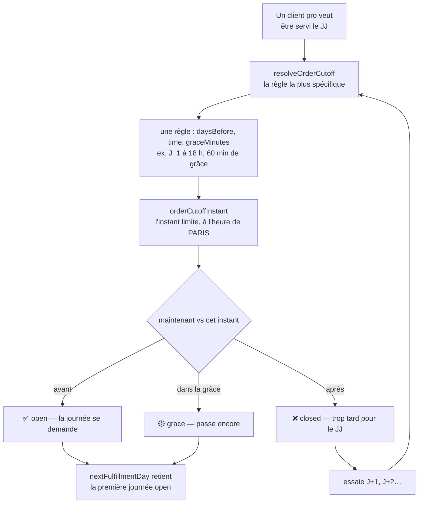
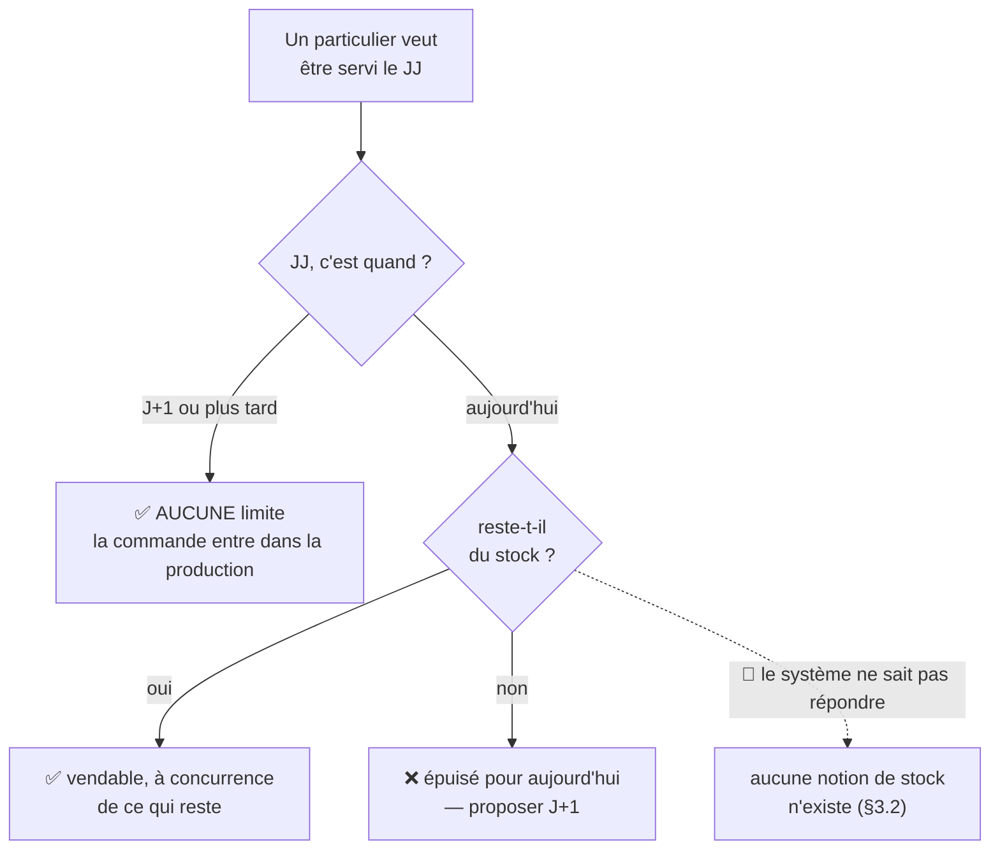
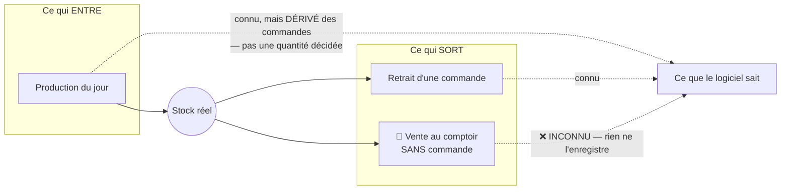
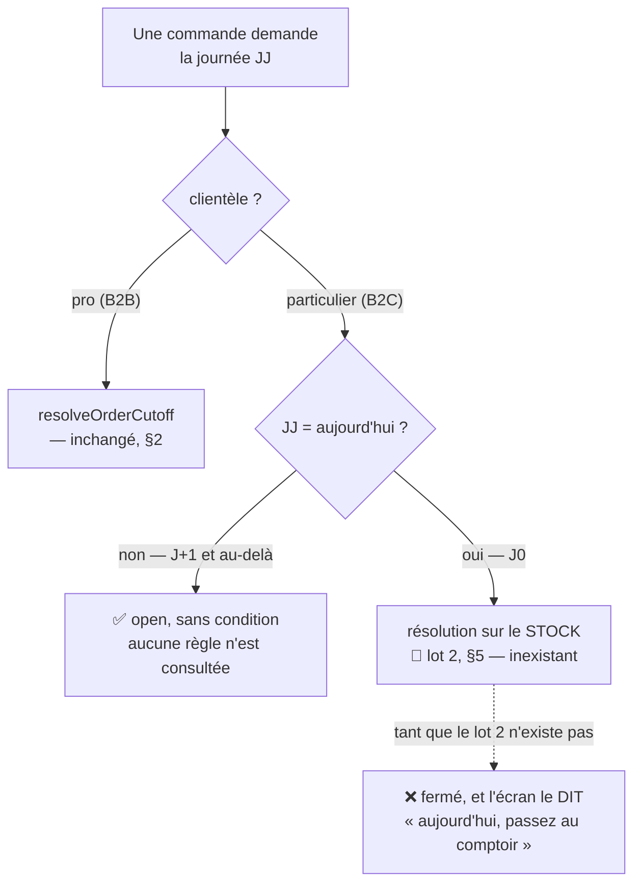

# La limite du B2C : pas de limite à J+N, le stock à J

**Statut** : 📐 conception, rien n'est bâti. Écrit le 2026-09-17, **contredit
par `vitruve`** le même jour (quatre BLOQUANTS), refondu, **réécrit** après deux
précisions métier de Hugo qui en ont déplacé l'objet, puis **refondu une
troisième fois** le même jour : le lot 1 n'est plus une colonne d'audience, mais
un **aiguillage** (§4). Le sort des objections est au §9 — trois des quatre
BLOQUANTS y sont devenus **sans objet**, ce qui n'est pas la même chose que
corrigés.
**Portée** : **quelle journée un client peut demander, et pourquoi**. Ni le
tarif public, ni la commande sans compte — ils ont leurs documents.

> 🔴 **Ce document décrit DEUX lots, et l'écart entre eux s'est creusé.**
> Le premier se livre (§4) et **ne touche plus la base du tout** : l'aiguillage
> a supprimé la colonne, ses sept index et son point de non-retour. Le second
> n'a aucune fondation dans le système et demande sa propre conception (§5).
> Les confondre ferait promettre à J0 ce que seul J+1 peut tenir.

## 0. La demande

> « au niveau des créneaux public, on doit avoir aujourd'hui aussi, c'est du
> public » — Hugo, 2026-09-17.
>
> « en fait sur du b2c notre limite n'est pas de prod, elle est en capacité de
> **stock existant**, pour jour J. J+1 ne sera jamais un problème car ajouté à
> la prod. »
>
> « pour moi **commande à J = limite de stock**, à **J+N pas de limite** » — pour
> le b2c.
>
> « il peut vendre **sans commande au comptoir**, mais on cherche un moyen
> d'avoir le **stock temps réel**. »

**La règle voulue tient en deux lignes** :

| Quand               | Limite B2C                                           |
| ------------------- | ---------------------------------------------------- |
| **J** (aujourd'hui) | ce qu'il reste **en stock**, rien d'autre            |
| **J+1 et au-delà**  | **aucune** — c'est de la production, elle a le temps |

## 1. Pourquoi la limite du B2B ne convient pas au B2C

Une heure limite existe pour une seule raison : **laisser au fournil le temps de
produire**. « Commandez avant 18 h la veille » n'est pas une contrainte de
vente, c'est un délai de fabrication.

Appliquée au public, elle répond à la mauvaise question. Un particulier qui
passe à 9 h ne demande pas qu'on produise pour lui : il demande **ce qui est
là**. Et pour après-demain, il n'y a rien à arbitrer — sa commande entre dans le
plan comme n'importe quelle autre.

C'est pourquoi ce document ne s'appelle plus « l'heure limite par clientèle » :
l'heure limite est l'outil du B2B. Le B2C en demande un autre, et un seul des
deux existe.

## 2. Comment la limite B2B fonctionne aujourd'hui

### 2.1 Le schéma

**Ce que ce schéma dit, et qui compte pour la suite** : la décision porte sur le
**temps**, jamais sur une quantité. Le système ne se demande nulle part s'il
reste quelque chose — la question ne s'est jamais posée, parce qu'un pro commande
ce qui sera **fabriqué pour lui**.

### 2.2 Les pièces, vérifiées le 2026-09-17

- la règle : `packages/contracts/src/order-cutoff.ts` — cinq champs
  (`pickupAddressId`, `weekday`, `daysBefore`, `time`, `graceMinutes`) ;
- l'ouverture de l'écran :
  `apps/lfd-api/src/b2b/order-cutoffs/application/list-fulfillment-days.handler.ts` ;
- le refus à la caisse :
  `apps/lfd-api/src/b2b/orders/domain/services/order-cutoff-guard.ts` ;
- l'unicité, tenue par **quatre** objets :
  `@@unique([pickupAddressId, weekday])` dans
  `apps/lfd-api/prisma/schema/public/orders.prisma`, plus trois index partiels
  dans
  `apps/lfd-api/prisma/migrations/20260810071500_order_cutoffs_unique_defaults/migration.sql`.

## 3. Ce que le B2C demande — et ce que le système en sait

### 3.1 Le schéma voulu

### 3.2 🔴 Le stock n'est pas « non modélisé » : il est **inobservable**

Trois flux font le stock d'une journée. Le système n'en connaît qu'un et demi.

**Deux trous, et le second est le plus grave :**

1. **Ce qui entre est dérivé, pas décidé.** `ProducedItemSnapshot` porte
   « le **compte à produire** : un article, une quantité, tous clients
   confondus » — dérivé des commandes de la journée. Le fournil coche ce qui est
   demandé (`batch/:date/sheets/:reference/packed`) et clôt la journée ; il n'a
   **aucun geste pour poser une quantité** qu'on produirait pour la vitrine.
2. **Ce qui sort au comptoir n'est enregistré nulle part.** Une vente directe
   existe en boutique et ne laisse aucune trace dans le système.

Conséquence : un stock calculé « produit − vendu » vaudrait **zéro en
permanence** au mieux, et **dériverait dès la première vente directe** au pire.
Il ne serait faux que d'une manière — toujours optimiste : on vendrait ce qui
est déjà parti.

⚠️ Le dépôt a déjà noté cette dette sans la trancher :
`apps/lfd-api/prisma/schema/growth.prisma` porte « Stock : décision _source de
vérité_ reportée (Shopify vs nous) ».

## 4. Lot 1 — un aiguillage, pas une colonne

🔴 **Cette section a été entièrement refondue le 2026-09-17**, sur une
proposition de Hugo : « l'ordre de résolution serait clientèle → date, pour
définir si J — et donc résolution sur stock — ou J+1, limite qu'on a déjà
écrite ».

La version précédente faisait entrer la clientèle dans **l'identité d'une règle
`order_cutoffs`** : une colonne, sept index partiels, un journal à étendre, un
back-office à rouvrir. Elle répondait à une question que personne n'a posée —
« quelle heure limite pour le public ? » — alors que la réponse voulue est
**aucune**. Et une valeur qui n'a rien à régler n'a pas besoin d'être stockée.

### 4.1 Ce que l'aiguillage dit

Deux questions, dans cet ordre, **avant** toute résolution de règle :

La clientèle ne **départage** plus deux règles : elle choisit **quel mécanisme
décide**. C'est pourquoi l'objection B2 du §9 — « la clientèle en tête éteint la
configuration » — tombe au lieu d'être corrigée : la branche publique ne
consulte aucune règle, elle n'en éteint donc aucune.

### 4.2 Ce que ça supprime, et c'est presque tout le lot

| Ce que la version à colonne demandait                 | Sort           |
| ----------------------------------------------------- | -------------- |
| une colonne d'audience sur `order_cutoffs`            | **supprimé**   |
| la reconstruction de l'unicité en sept index partiels | **supprimé**   |
| le refus d'égalité + sa contrainte en base            | **supprimé**   |
| le fait de journal étendu (`order-cutoff.events.ts`)  | **supprimé**   |
| la garde d'idempotence du semis (`station.seed.ts`)   | **supprimé**   |
| les cinq écrans du back-office                        | **supprimé**   |
| le point de non-retour (§10)                          | **supprimé**   |
| **D1** — valeur `all` explicite ou `NULL`             | **sans objet** |

Il ne reste **aucune migration**. Ce qui se livre tient en trois endroits :

- **le contrat** — une fonction d'aiguillage à côté de `decideOrderCutoff`,
  qui prend l'audience et la date du jour, et n'appelle la résolution existante
  que sur la branche pro ;
- **le serveur** — `order-cutoff-guard.ts` prend l'audience en entrée, et
  `order-drafting.service.ts` la **hisse** hors de `resolveFulfillment`, où elle
  est déjà calculée sans être rendue (sinon : une seconde lecture du statut de
  société par commande) ;
- **la route** — `list-fulfillment-days.handler.ts` et le §7, inchangé : une
  route, **deux dates**.

⚠️ Le §7 reste entier, et c'est le seul coût qui ne bouge pas. `GET
/fulfillment-days` est déjà servie à des pros connectés ; leur servir la date du
public serait une régression sur un contrat en service.

### 4.3 Le prix : la règle publique vit dans le CODE

Une limite publique ne sera plus saisissable. Le jour où quelqu'un voudra
« commande pour demain avant 22 h », il faudra un déploiement là où une règle
B2B se saisit à l'écran.

**C'est assumé, parce que c'est la demande** : « J+N pas de limite » n'a pas de
valeur à régler. Le geste qui redeviendrait nécessaire est celui qu'on vient de
supprimer — il se retrouve dans l'historique de ce document, et la table est
toujours là pour l'accueillir.

⚠️ Le vrai risque de ce choix n'est pas le déploiement, c'est le **silence** :
une règle qui n'apparaît sur aucun écran est une règle que personne ne sait
opposable. L'écran de réglages doit donc **afficher** la branche publique comme
un fait — « les particuliers : aucune limite à partir de demain » — même sans
rien à y modifier.

## 5. Lot 2 — le stock temps réel (à concevoir, pas à bâtir ici)

Ce lot ouvre J0. Il ne se résume pas à un champ : il demande de rendre
**observable** ce qui ne l'est pas.

Trois questions, dans cet ordre, et aucune n'est technique au départ :

1. **Qui décide de ce qui est produit pour la vitrine ?** Aujourd'hui personne :
   le compte à produire est dérivé des commandes. Il faut un geste du fournil
   qui dise « j'en fais trente de plus », sans quoi il n'y a jamais rien à
   vendre à J0.
2. **Comment une vente au comptoir entre-t-elle dans le système ?** C'est le
   trou décisif. Sans elle, tout stock affiché dérive dans le sens du survente.
   Une caisse, un décompte au retrait, un inventaire de fin de journée — ce sont
   trois produits différents, pas trois options techniques.
3. **Qui fait autorité ?** La note de `growth.prisma` pose déjà la question
   (« Shopify vs nous ») et la laisse ouverte. Un stock à deux sources de vérité
   est un stock faux.

⚠️ **Tant que 2 n'est pas tranchée, J0 ne doit pas s'ouvrir** — même avec un
stock affiché. Vendre ce qui vient d'être vendu au comptoir coûte plus qu'une
journée fermée : c'est un client qui se déplace pour rien, avec un QR valide.

## 6. 🔴 La limite d'article : l'aiguillage la règle au lieu de la subir

`order-cutoff-guard.ts` le dit en rouge : **« L'article ne peut pas RELÂCHER la
règle du commerce, il la remplace. »** Un article portant son `orderTimeLimit`
ignore la règle du commerce — donc, dans la version à colonne, il ignorait aussi
la clientèle. Une seule limite d'article de portée globale suffisait à ce que le
public se voie refuser à la caisse ce que l'écran venait de lui proposer.

**L'aiguillage du §4 règle ça par sa position**, et c'est son second gain :
placé **au-dessus de `ensureWithinOrderCutoff` en entier** — et non dans le
repli du commerce —, la branche publique à J+N rend `open` sans consulter ni les
règles du commerce, ni les limites d'article.

🔴 **C'est une décision, pas une conséquence.** Elle dit qu'un article
n'est **jamais** en retard pour le public à J+1, y compris un article
volontairement déclaré « à commander trois jours avant ». Si un tel article
existe, la décision est fausse et il faut la renverser — auquel cas la branche
publique retombe sur les limites d'article seules.

**Vérification requise avant de bâtir** : existe-t-il une `OrderTimeLimit` de
portée globale, ou une limite d'article à `daysBefore > 0`, en production ? Elle
ne vide plus le lot — elle dit si ce paragraphe est juste.

## 7. La route publique sert LES DEUX dates

`GET /fulfillment-days` est `@Public()`, sans paramètre, et son commentaire
affirme que sa réponse est « la même pour tout le monde ». Une clientèle casse
cette propriété.

Le précédent à suivre n'est pas `/mine` mais
`apps/lfd-api/src/b2b/delivery-availability/http/delivery-availability.controller.ts` :
public, sans paramètre, il sert **les deux clientèles** (`{openToB2b,
openToB2c}`), le front applique la sienne et le serveur refuse quand même à la
caisse. `FulfillmentDayView` porte donc **une date par clientèle** : une seule
route, cachable, et il devient **impossible** qu'un pro appelle la mauvaise.

⚠️ Ce n'est pas un confort : cette route est **déjà servie** à des pros
connectés. Le jour où la branche publique s'ouvre, ce sont eux qui verraient des
journées qui ne sont pas les leurs — sur un contrat déjà servi.

🔴 **La date publique est « demain », toujours**, tant que le lot 2 n'existe
pas : la branche J+N n'oppose rien, et J0 reste fermé faute de stock
observable. Le sélecteur de créneaux ouvre donc une semaine à partir de demain,
et l'écran nomme la raison du jour manquant plutôt que de le taire.

## 8. Le coût du lot 1, fichier par fichier

**La règle** : `packages/contracts/src/order-cutoff.ts` — l'aiguillage, à côté
de `decideOrderCutoff`, et `packages/contracts/src/__tests__/order-cutoff.spec.ts`.
Les 25 cas existants portent tous sur la branche pro et doivent rester verts
sans retouche : c'est la preuve que rien n'a bougé pour les clients en service.

**Le serveur** : `order-cutoff-guard.ts` (l'audience en entrée, l'aiguillage
au-dessus de tout — §6), `order-drafting.service.ts` (hisser l'audience hors de
`resolveFulfillment`), `list-fulfillment-days.handler.ts`.

**La base** : **rien**. C'est le changement le plus important de cette refonte.

**Le journal, le semis, le back-office** : **rien** à changer, sauf l'affichage
du §4.3 — dire la branche publique sur l'écran de réglages, sans rien y rendre
modifiable.

**Le front public** : le §7 — une date par clientèle, et la phrase du jour
absent.

## 9. Le sort des objections de `vitruve`

Les quatre BLOQUANTS visaient la conception **à colonne**. La refonte du §4 en
supprime trois par disparition de leur objet — ce qui est le meilleur sort qu'un
BLOQUANT puisse connaître, et une raison de ne pas confondre « objection
corrigée » et « objection devenue sans objet ».

| #                                                      | Sort                                                                                  |
| ------------------------------------------------------ | ------------------------------------------------------------------------------------- |
| **B1** la migration refuserait la première règle       | **sans objet** — il n'y a plus de migration (§4.2)                                    |
| **B2** l'ordre proposé éteint la configuration         | **sans objet** — la branche publique ne consulte aucune règle (§4.1)                  |
| **B3** le précédent cité est un filtre, pas un rang    | **sans objet** — ce n'est plus un rang de spécificité                                 |
| **B4** les égalités deviennent atteignables            | **sans objet** — aucune règle nouvelle n'est écrite                                   |
| **S5** la limite d'article court-circuite la clientèle | **tranchée** — l'aiguillage passe AU-DESSUS (§6), et c'est une décision, pas un effet |
| **S6** `/mine` est le mauvais motif                    | **corrigée** — une route, deux dates (§7)                                             |
| **S7** sites omis (journal, semis, dépôt, tests)       | **sans objet** — aucun d'eux n'est touché (§8)                                        |
| **S8** D3 n'est pas un lotissement                     | **corrigée** — non-régression pour les pros en service (§7, §8)                       |
| D4 (`graceMinutes`)                                    | **retirée** : le rattrapage est un champ de la règle, il la suit                      |

⚠️ Le plan n'a **pas** été resoumis à `vitruve` après cette refonte. Il touche
une frontière de décision commerciale sans toucher ni l'argent, ni une migration
de données, ni une frontière de sécurité, ni un runbook — la règle du `CLAUDE.md`
demande alors de vérifier ses propres affirmations, ce qui a été fait : contrat,
garde et plan rouverts le 2026-09-17.

## 10. Ce que le lot 1 rend irréversible

**Rien en base.** C'est la conséquence la plus utile de la refonte : sans
colonne ni règle stockée, le lot se défait en retirant du code.

Ce qui devient difficile à reprendre est ailleurs, et c'est du **commerce** :
une fois que le public commande pour demain sans limite, fermer à nouveau se
verra. La marche arrière est technique ; elle n'est pas gratuite pour autant.

## 11. Ce qui reste à trancher

- **D2 — la limite d'article (§6)** : l'aiguillage passe-t-il au-dessus des
  limites d'article, ou la branche publique doit-elle les respecter ? La
  recommandation est **au-dessus** — c'est ce qui rend la promesse « pas de
  limite » vraie sans exception —, et elle se renverse si un article
  volontairement contraint existe.
- **D3 — le lot 2 se conçoit-il maintenant ?** J0 restera fermé au public tant
  qu'il n'existe pas. Le dire à l'écran (« aujourd'hui, passez au comptoir »)
  est la réponse provisoire, et le §7 la porte.

**D1 est retirée** : sans valeur stockée, il n'y a plus de choix entre `all`
explicite et `NULL`.

## 12. Ce qui n'a PAS été ouvert

- **Les règles d'heure limite en production** et leurs `daysBefore` — c'est ce
  qui dit ce qui change pour un client réel le jour du déploiement. La refonte
  en réduit l'enjeu : la branche pro est inchangée.
- **Une limite d'article contraignante en production** : le §6 est établi comme
  mécanisme, pas comme fait, et c'est lui qui décide de D2.
- **La caisse du comptoir** : ce qui s'y passe aujourd'hui, avec quel outil, et
  ce qu'il en reste comme trace. Le §5 affirme qu'il n'en reste rien **dans ce
  système** ; il ne dit pas qu'il n'en existe aucune ailleurs.
- **La passerelle**.
