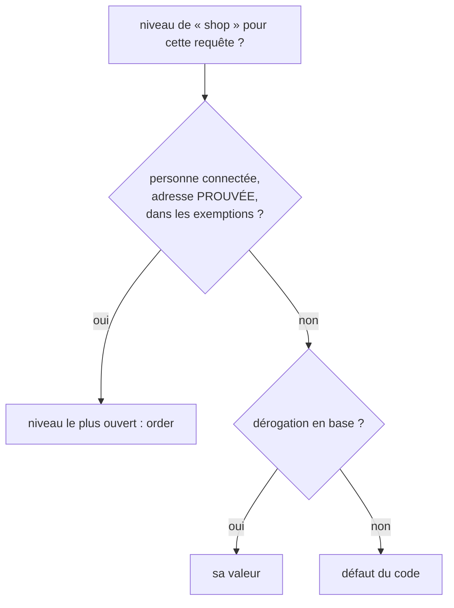
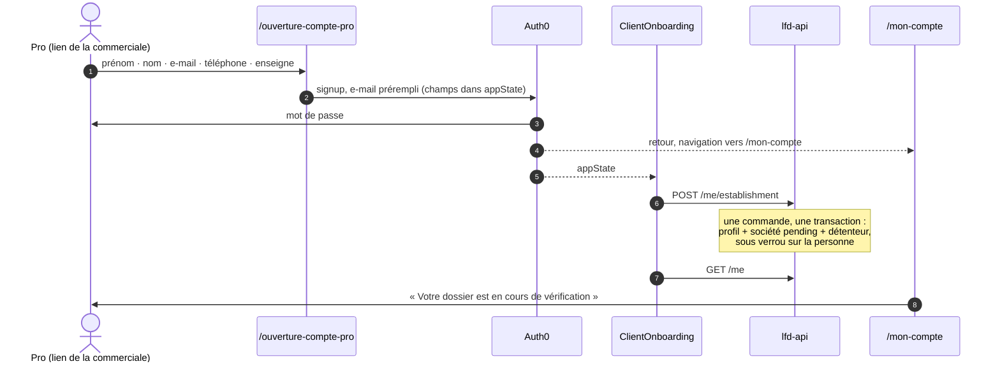

# L'ouverture de compte pro, et l'accès à la boutique piloté en admin

**Statut** : 🟡 lots 1 à 6 bâtis le 2026-09-14, non commités à l'écriture de
cette ligne ; lot 0 retiré. Ce que la construction a changé au plan est au §11.
**Écrit le 2026-09-14**, puis refondu le même jour sur deux décisions de Hugo :

- une **porte pro à elle**, `/pro/ouverture-compte-pro` : c'est le lien que donne
  la commerciale ;
- l'accès se **pilote en admin**, par des flags en base, avec une **liste
  d'exemption par e-mail** pour les comptes de test en production. La page est
  `/admin/feature-access`. Le premier flag est **boutique**, qui vaut `fermée`,
  `voir` ou `commander`.

`vitruve` a contredit deux versions de ce plan. Ce que ses objections ont changé
est au §9.

## 0. La demande

1. **Une porte d'entrée pour les pros.** La commerciale donne un lien. Le pro y
   crée son compte (e-mail et mot de passe, prénom, nom, téléphone, enseigne) et
   déclare son établissement. Il arrive sur **Mon compte**, où son dossier
   attend la vérification.
2. **`/bienvenue` n'est pas touchée** (décision du 2026-09-14) : ni son écran,
   ni son onboarding, ni sa destination. Tout le travail porte sur la nouvelle
   route.
3. **Ce qu'on peut faire de la boutique se règle en admin, sans redéployer.**
   Des e-mails désignés gardent l'accès à tout, pour tester en production.

## 1. Ce qui existe (relevé du 2026-09-14)

### 1.1 L'inscription est branchée, et elle perd le profil

`/bienvenue` prend prénom, e-mail et téléphone. `AuthFacade.register()` ouvre
l'onglet inscription d'Auth0 ; le mot de passe se pose chez Auth0, jamais chez
nous. Au retour, `ClientOnboarding` repose le profil par `PATCH /me/profile`,
puis la navigation part sur `/nouvelle-commande`.

🔴 **En production, le profil n'est jamais enregistré.** Le retour envoie
`lastName: ''`, et `PersonName.create` refuse une chaîne vide
(`value-objects/person-name.ts:22`). Le téléphone court le même risque :
`PhoneNumber` exige 6 chiffres (`phone-number.ts:4`), le formulaire se contente
d'un champ non vide. Aucun test ne couvre ce chemin : `ClientOnboarding` n'a pas
de spec.

⚠️ **Ce défaut reste en production** : `/bienvenue` est hors du périmètre de ce
plan. La porte pro ne le partage pas, elle passe par `POST /me/establishment`.

### 1.2 Une société ne se déclare pas depuis l'app cliente

- **`CreateCompanyHandler` exige un profil valide.** Il exige l'enseigne et
  relit le profil du créateur pour en faire le contact
  (`create-company.handler.ts:41-45`). Sans profil valide, pas de société. La
  société naît `pending`, son créateur en devient le détenteur.
- **Un compte provisionné au vol n'a que son e-mail**
  (`customer-principal.resolver.ts`, `provision`).
- **Aucun écran accessible n'appelle `createCompany`.** Le seul appel est dans
  `legacy/entreprises/creer-entreprise-panel/`, dont la route est coupée.

### 1.3 Pas de sélecteur d'espace

Le front client n'envoie jamais `x-lfc-company`. Quand la personne n'a qu'un
seul rattachement, c'est le serveur qui déduit la société (`resolve-company.ts`).
**Dès qu'un pro déclare son établissement, toute l'app bascule en contexte
société, sans le lui dire.** C'est ce qui justifie une porte pro distincte.

### 1.4 Rien n'est fermé aujourd'hui

- `main` sert toutes les routes clientes sous `/pro`, sans aucune garde.
- `POST /orders` accepte une commande sans société, ou pour une société
  `pending`, réglée par carte.
- `GET /shop/catalogue` est `@Public()`.
- `architecture-compte-client-cycle-de-vie.md` §2 affirme « pending : ni prix, ni
  commande ». **Le code et le handoff disent le contraire.**

### 1.5 Les flags : décrits, pas codés — et un précédent qui marche

`architecture-feature-flags.md` est **doc-first**. Il pose les règles suivantes :

- le catalogue vit dans le code, et la base ne porte **que les écarts** ;
- « revenir au défaut » supprime la ligne ;
- les valeurs sont une union fermée ;
- « **c'est la route API qu'on coupe, pas le bouton** ».

**Le précédent codé est `PublicationEnabledGuard`**
(`pim/publication/publication-switch.ts`). Un décorateur marque les routes
concernées, une garde globale (`APP_GUARD`, `app.module.ts:152`) les refuse par
une `BusinessError` 409. La raison y est écrite : « ce n'est pas une
autorisation […] d'où un refus métier (409) et non un 403, qui ferait chercher un
droit manquant ». Ce plan copie ce montage.

Les décisions de Hugo et ce précédent font dévier la doc des flags sur quatre
points. Le lot 7 les y inscrit, datés :

| La doc disait                          | Décidé le 2026-09-14                                           |
| -------------------------------------- | -------------------------------------------------------------- |
| Une entrée de menu **Tech**            | `/admin/feature-access`, dans la section **Admin**             |
| « Portée par client : hors périmètre » | **Exemption par e-mail vérifié**, pour les tests en production |
| Clients B2B consommateurs « différés » | L'app cliente est le **premier** consommateur                  |
| Refus en `403`                         | `409`, comme `PublicationEnabledGuard`, et pour la même raison |

### 1.6 Ce que le dépôt fournit

- **Droits staff** : `packages/contracts/src/staff-access.ts`, qui porte les
  ressources, les libellés et `ROLE_GRANTS`.
- **Section Admin** : `admin/admin.routes.ts`, des vues gardées par
  `permissionGuard`.
- **Unité de travail** : `PrismaService` est déjà le proxy `transactionalPrisma`
  (`database.module.ts:104`). Un `$transaction` en callback rejoint l'unité
  ouverte.
- **Journal** : le patron est `delivery-zones/application/delivery-zone.handlers.ts`
  (`UnitOfWork` puis `publishTraced`). `lint:journal-tracked` ne couvre que
  `src/pim/**` et une partie de `b2b/account/**`.
- **`Principal`** porte `email`, lu en base. `VerifiedToken` porte un
  `emailVerified` optionnel (`principal.ts:30`) ; la base a `users.email_verified`.
- **Instances** : l'API tourne en **une seule instance**
  (`wrangler.jsonc:56`, `max_instances: 1`).
- **La démo du 19/09 se joue en local** (`plan-demo-2026-09-19.md` §1.3).

### 1.7 🔴 Une adresse vérifiée le reste après avoir changé

`UpdateMyProfileHandler` passe par `identity.changeEmail`, qui repose
`email_verified: false` **chez Auth0** (`platform/identity/auth0-identity.gateway.ts:150`).
Il écrit ensuite la nouvelle adresse chez nous **sans toucher**
`users.email_verified`. Le resolver ne fait passer ce drapeau que de `false` à
`true` (`customer-principal.resolver.ts:98`).

Chez nous, une personne vérifiée **reste donc vérifiée** quelle que soit
l'adresse qu'elle tape ensuite. Pour l'exemption du §2.2, c'est un contournement
direct. Le lot 2 le corrige, avec son test de régression.

## 2. L'accès aux fonctionnalités

### 2.1 Le modèle

**Le catalogue** est un nouveau module `feature-access` de `@lfd/contracts`. Il
ne porte pour l'instant qu'une entrée :

| Clé    | Libellé  | Valeurs ordonnées, de la plus fermée à la plus ouverte | Défaut du code |
| ------ | -------- | ------------------------------------------------------ | -------------- |
| `shop` | Boutique | `closed` · `browse` · `order`                          | `order`        |

Une garde demande **« au moins »** un niveau. Un niveau ajouté plus tard
s'insère sans toucher aux gardes.

**Le défaut est `order`, l'état d'aujourd'hui.** Le dev, le semis et les suites
e2e qui passent commande n'ont rien à changer. **La production se ferme par un
geste d'admin** fait juste après le déploiement (§6).

**La base porte deux tables** dans le schéma `public`, dont le propriétaire est
`b2b/feature-access/` :

| Table                       | Colonnes                                                                                         |
| --------------------------- | ------------------------------------------------------------------------------------------------ |
| `feature_access_overrides`  | `key` (PK), `value`, `updated_at`, `updated_by_sub/name/role`                                    |
| `feature_access_exemptions` | `id`, `key`, `email` normalisé, `created_at`, `created_by_sub/name/role` ; unique `(key, email)` |

- **C'est de la configuration sans transition**, donc un CRUD, pas un agrégat
  (CLAUDE.md §3.1).
- **La suppression est physique**, parce qu'elle **est** le geste : « revenir au
  défaut », « retirer l'exemption ». La trace reste dans le journal, écrit dans
  la même unité de travail que la ligne, sur le patron de `delivery-zones`.
- **Le lot 1 étend `lint:journal-tracked`** à `b2b/feature-access/`. Sinon,
  « chaque écriture est tracée » ne serait qu'une promesse.
- **La migration est additive** : deux tables, rien de modifié. Elle passe par
  `lecteur-de-migrations` avant `main`.

**Pas de cache.** Une instance, et deux lectures indexées par requête gardée.
Un cache de 30 s laisserait passer des commandes pendant 30 s après la fermeture,
et survivrait au `ctx.reset()` des e2e. On le reconsidérera sur une mesure, pas
avant.

### 2.2 La résolution

- **L'exemption exige une adresse prouvée.** Sans cette condition, n'importe qui
  pourrait s'inscrire chez Auth0 avec l'adresse d'un testeur qui n'a pas encore
  de compte, et en hériter.
- **Le `Principal` gagne `emailProven: boolean`**, lu dans
  `users.email_verified`. Il ne s'appelle **pas** `emailVerified` : sur
  `VerifiedToken`, ce nom veut dire « optionnel, `undefined` n'est pas `false` ».
  Deux champs de même nom et de sens différent se confondraient.
- **Cette preuve suit l'adresse** grâce à la correction du §1.7, faite au lot 2 :
  changer d'adresse remet `email_verified` à `false` dans la même écriture.
- **Le resolver construit le `Principal` après avoir recopié ce que le jeton
  prouve.** Aujourd'hui il le construit sur la ligne lue avant la mise à jour, si
  bien que la première requête voit encore `false`. C'est corrigé au lot 2.
- **L'e-mail est normalisé** (trim, minuscules), à l'écriture comme à la lecture.

### 2.3 Les gardes serveur

C'est le montage de `PublicationEnabledGuard` : un marqueur
`@RequiresShop('browse' | 'order')` sur les routes, et une garde globale
`FeatureAccessGuard` enregistrée **après** `AuthGuard`, pour que le `Principal`
soit résolu. Sur une route `@Public()`, il n'y a pas de `Principal`, donc pas
d'exemption.

Le refus est `ShopClosedError`, une `BusinessError` 409 dont le message dépend
du niveau :

- « La boutique n'est pas encore ouverte. »
- « Les commandes en ligne ne sont pas encore ouvertes. »

| Niveau exigé | Routes                                                                                                                                                                                                             |
| ------------ | ------------------------------------------------------------------------------------------------------------------------------------------------------------------------------------------------------------------ |
| `browse`     | `GET /shop/catalogue`, `GET /shop/catalogue/mine`, `POST /shop/quote`, `POST /shop/quote/mine`, `GET /shop/cart`, `PUT /shop/cart`                                                                                 |
| `order`      | `POST /orders`, `POST /orders/quote`, `POST /orders/preflight` (`alerts/http/order-preflight.controller.ts`), `POST /subscriptions`, `PUT /subscriptions/:id/occurrences/:date`, `PATCH /subscriptions/:id/status` |
| **aucun**    | `POST /admin/orders` et toute la surface staff ; les commandes **existantes** du client (`GET /orders/mine`, `/orders/:id`, règlement, bon, QR de retrait) ; `/me`, `/companies`, `GET /feature-access`            |

Quatre précisions sur ce tableau :

- **Pourquoi un marqueur plutôt qu'un `if` dans les handlers.** Le refus aurait
  besoin de l'exemption, donc du `Principal`, et `PlaceOrderCommand` ne porte que
  `actorUserId` (`place-order.command.ts:20-24`). Le marqueur rend en plus la
  liste de ce qui est fermé **lisible en parcourant les contrôleurs**.
- **Une route oubliée ne doit pas passer en silence.** Le lot 3 écrit un **test
  de la table des routes** : toute méthode client (hors `admin`) des contrôleurs
  `orders`, `shop-*`, `subscriptions` et `order-preflight` porte le marqueur, ou
  figure dans une liste d'exceptions écrite avec sa raison. Une route ajoutée
  demain échoue tant que personne n'a tranché.
- **La garde passe avant le handler.** Le rejeu d'une commande passée avant la
  fermeture sera donc refusé. La commande existe pourtant, et le client la
  retrouve dans « Mes commandes ». Ce refus est assumé.
- **La mise en pause d'un panier récurrent** est fermée elle aussi, puisque
  `PATCH …/status` sert à la pause comme à la reprise (Q5). Aucun mécanisme
  n'a été trouvé qui transforme une échéance en commande (§10).

### 2.4 Les routes du module

| Route                                              | Qui                        | Effet                                                                                                                 |
| -------------------------------------------------- | -------------------------- | --------------------------------------------------------------------------------------------------------------------- |
| `GET /admin/feature-access`                        | `b2b_feature_access:read`  | Catalogue, valeur effective, provenance, exemptions ; pour chacune, **l'adresse est-elle prouvée sur un compte** (Q7) |
| `PUT /admin/feature-access/:key`                   | `b2b_feature_access:write` | Pose une dérogation, dont la valeur est validée par le catalogue                                                      |
| `DELETE /admin/feature-access/:key`                | `b2b_feature_access:write` | Supprime la dérogation : retour au défaut                                                                             |
| `POST /admin/feature-access/:key/exemptions`       | `b2b_feature_access:write` | Ajoute une adresse ; idempotent sur `(key, email)`                                                                    |
| `DELETE /admin/feature-access/:key/exemptions/:id` | `b2b_feature_access:write` | Retire une adresse                                                                                                    |
| `GET /feature-access`                              | `@Public()`                | Les niveaux globaux, sans exemption                                                                                   |
| `GET /feature-access/mine`                         | client connecté            | Les niveaux de cette personne ; ne dit **jamais** « vous êtes exempté »                                               |

**Une ressource staff dédiée, `b2b_feature_access`**, et non `b2b_settings` :
ouvrir la vente en ligne pèse plus que corriger une zone de livraison.

| Rôle                             | Droit    |
| -------------------------------- | -------- |
| `admin`                          | écriture |
| `commercial`                     | lecture  |
| `comptabilite`, `support`, `dev` | aucun    |

Le test `staff-access.spec.ts` exige que `admin` couvre tout, et il sera
satisfait. Les rôles personnalisés en base (`StaffRoleDefinition.grants`) ne
recevront pas cette ressource : ils n'auront **aucun** accès, ce qui est le sens
sûr.

## 3. La porte pro : `/pro/ouverture-compte-pro`

### 3.1 Le parcours

**Déjà client ?** La personne se connecte et arrive sur `/mon-compte`. Si elle
n'a pas de société, la carte du §3.3 l'y attend. C'est le cas du particulier
inscrit qui reçoit ensuite le lien de la commerciale.

**L'écran est un composant à lui**, dans son dossier sous `login/`. Il reprend le
chrome de `/bienvenue` (colonne bleue, `ClientPage`), mais pas son contenu ni sa
copie. `/bienvenue` ne change pas.

**La promesse suit le flag** (précisé par Hugo le 2026-09-14). Tant que
`boutique` est sous `order`, la porte pro **et** Mon compte le disent, au lieu
de laisser chercher une boutique qui n'est pas ouverte :

> « Notre boutique en ligne ouvre bientôt. En attendant, configurez votre
> espace. »

- **Où.** Sur `/ouverture-compte-pro`, sous le titre, avant le formulaire.
  Sur `/mon-compte`, en tête, au-dessus de la carte « Compléter mon dossier »
  ou du dossier.
- **Quand.** Seulement si le niveau lu par `ClientFeatureAccess` est `closed`
  ou `browse`. Au niveau `order`, la phrase disparaît d'elle-même : rien à
  retirer le jour de l'ouverture.
- **Au niveau `browse`**, la seconde phrase peut inviter à regarder le rayon
  (« … et découvrez déjà la boutique »). Copie à valider à l'écran.
- **La lecture échoue** : l'app se comporte comme en `closed` (§4), donc la
  phrase s'affiche. C'est le sens prudent : promettre « bientôt » à qui
  pourrait déjà commander coûte moins que l'inverse.
- **Pas une date.** Rien dans le système ne porte une date d'ouverture ; en
  écrire une ferait une promesse que personne n'est chargé de tenir.

### 3.2 `POST /me/establishment`

`DeclareMyEstablishmentCommand` prend `{ firstName, lastName, phone, enseigne }`
et vit dans `b2b/account/`.

- **Pas d'e-mail.** Il reste celui du compte ; le changer passe par Auth0.
- **Profil et société sont écrits dans une seule unité de travail.**
  `declareOwnedBy` la rejoint déjà par `transactionalPrisma` (§1.6) : rien à
  modifier dans le dépôt.
- **Un verrou transactionnel sur la personne** (`pg_advisory_xact_lock` en
  `$executeRaw`, dans la même transaction) sérialise deux requêtes simultanées.
- **Refus 409 si la personne a déjà un rattachement** : « Votre compte est déjà
  rattaché à un établissement. » La phrase vaut aussi pour un employé invité,
  qui n'a rien « déclaré » lui-même. Double clic, second onglet et rejeu
  finissent tous dans le même état.
- **Ce verrou ne protège que cette route.** `POST /companies` reste ouvert et
  n'empêche pas un second rattachement ; il n'est appelé que par le panneau
  hérité, dont la route est coupée. « Une seule société » n'est vrai que par la
  porte pro, et c'est écrit ici.

### 3.3 La carte « Compléter mon dossier »

La carte apparaît sur `/mon-compte` quand `hasNoCompany` est vrai et qu'aucune
déclaration n'est en cours d'envoi. Elle porte les quatre champs de la
déclaration, préremplis depuis `appState` si le retour d'Auth0 a échoué, sinon
depuis le profil. Elle appelle la même route.

Elle rattrape trois cas :

- le retour d'Auth0 a échoué ;
- un inscrit d'avant ce plan, dont le profil est vide ;
- un particulier qui devient pro.

Le serveur valide les champs ; l'écran affiche chaque erreur sous le champ
concerné.

### 3.4 Les champs

| Champ        | Où         | Pourquoi                                                                      |
| ------------ | ---------- | ----------------------------------------------------------------------------- |
| Prénom       | notre page | Nos e-mails s'adressent à la personne par son prénom                          |
| **Nom**      | notre page | Le domaine l'exige pour le profil **et** pour le contact de la société        |
| E-mail       | notre page | L'identité Auth0, préremplie sur son écran                                    |
| Téléphone    | notre page | Empêchement d'activation `telephone`, le livreur, la commerciale qui rappelle |
| Mot de passe | **Auth0**  | Jamais chez nous                                                              |
| **Enseigne** | notre page | Seul champ qu'exige `Company.declare`, et le nom que la commerciale a en tête |

**Écartés à l'entrée** : raison sociale, forme juridique, TVA, KBIS, adresses.

**Le SIRET non plus.** `SiretAlreadyRegisteredError` (`account-errors.ts:60-66`)
répond « cette maison est déjà cliente » à qui tape un numéro public. Cet oracle
existe déjà pour tout porteur de jeton client : `POST /companies` et la mise à
jour d'identité (`prisma-company.repository.ts:279-285`). Ce plan ne le met pas
dans un formulaire public, et le lot 7 ouvre une todo pour le fermer.

## 4. L'app cliente suit le niveau

**`ClientFeatureAccess`** lit `GET /feature-access` au démarrage, puis
`GET /feature-access/mine` une fois la personne connectée.

- **Si la lecture échoue**, l'app navigue comme en `closed` et affiche un
  `fold-callout` qui le dit. Elle ne reste jamais en attente : le serveur fait
  foi, et l'écran ne promet pas ce qu'il ignore.
- **Le code reste dans le bundle.** C'est le serveur qui ferme.

| Niveau   | Routes enfants du `ClientShell`                                                                                                                                                   | Menu                                    |
| -------- | --------------------------------------------------------------------------------------------------------------------------------------------------------------------------------- | --------------------------------------- |
| tous     | `bienvenue`, `ouverture-compte-pro`, `mon-compte`, `mes-commandes`, `mes-commandes/retrait/:id`, `nouvelle-commande/reglement/:id`, `nouvelle-commande/confirmee`, `mes-factures` | Mes commandes, Mes factures, Mon compte |
| `browse` | en plus : `mon-espace`, `nouvelle-commande/boutique`                                                                                                                              | en plus : Mon espace, Boutique          |
| `order`  | tout, comme aujourd'hui                                                                                                                                                           | inchangé                                |

**Les commandes existantes restent joignables à tous les niveaux.** Un client
qui a une commande en cours garde son QR de retrait et son règlement, et le
serveur ne les garde pas non plus (§2.3).

- **La garde** : `featureAccessGuard('shop', niveau)` renvoie vers `/mon-compte`
  si la personne est connectée, vers `/bienvenue` sinon.
- **La destination après l'entrée** : `/ouverture-compte-pro` mène toujours à
  `/mon-compte`. `/bienvenue` garde la sienne ; sous `order`, la garde de
  `/nouvelle-commande` renvoie à `/mon-compte`.
- **Sous `browse`**, `ClientCart` ne s'hydrate pas et ne lance pas
  `ShopCartSync` (`client/cart/client-cart.service.ts:43-60`). Il est injecté par
  `ClientOrders` et par l'espace ; sans cela, `GET /shop/catalogue` et
  `/shop/cart` partiraient en 409.
- **Sous `order`** :
  - disparaissent `ClientSubscriptions` dans `ClientNav`
    (`client-nav.service.ts:97`), `new-order-action`, la tuile du menu,
    `client-cart-pill`, les cartes **paiement** et **préférences** de Mon compte,
    et l'export des commandes de `data-card` ;
  - au niveau `browse`, « Ajouter au panier » devient une mention : « La commande
    en ligne ouvre bientôt. »

## 5. L'écran admin `/admin/feature-access`

C'est une vue de la section Admin, gardée par
`permissionGuard('b2b_feature_access:read')`. Son onglet s'ajoute à la page
parente, et `app.routes.spec.ts` gagne son cas.

Il affiche une carte par flag :

- **en-tête** : le libellé et la description du catalogue ;
- **valeur** : un `fold-listbox` sur les valeurs ordonnées ;
- **provenance** : « défaut du code », ou « posé par X le … » avec un bouton
  « Revenir au défaut » ;
- **liste d'exemption** : un champ e-mail et « Ajouter », puis une ligne par
  adresse. Chaque ligne dit qui l'a ajoutée, quand, et si l'adresse est
  **prouvée** : « vérifiée », « non vérifiée » ou « aucun compte ». On la retire
  par inline-confirm.

Une ligne dont la clé n'est plus au catalogue est signalée, jamais interprétée.

## 6. Les lots

| Lot | Qui         | Contenu                                                                                                                                                                                                                                                                                                                                                                               | Dépend de                                                                                                                                                                                                                                                                                                                                                                                                                    |
| --- | ----------- | ------------------------------------------------------------------------------------------------------------------------------------------------------------------------------------------------------------------------------------------------------------------------------------------------------------------------------------------------------------------------------------- | ---------------------------------------------------------------------------------------------------------------------------------------------------------------------------------------------------------------------------------------------------------------------------------------------------------------------------------------------------------------------------------------------------------------------------- |
| 1   | `batisseur` | **Le module `b2b/feature-access/`.** Catalogue au contrat, Prisma et migration, résolution sans cache (elle prend `{ email, emailProven }                                                                                                                                                                                                                                             | null`, pas le `Principal`, que le lot 2 enrichit), les routes du §2.4 sauf `GET /feature-access/mine`, reportée au lot 3 faute de preuve d'adresse, ressource `b2b_feature_access`, journal et extension de `lint:journal-tracked`. Unitaire : exemption prouvée, puis dérogation, puis défaut ; normalisation. E2E : dérogation et retour au défaut, exemptions, `commercial`refusé en écriture,`…/mine` muet sur la liste. | —   |
| 2   | `batisseur` | **`b2b/account` et `platform/auth`.** `Principal.emailProven` (`principal.ts`, le resolver construit après recopie, les doublés qui fabriquent un `Principal`) ; **remise à `false` de `email_verified` au changement d'adresse** (§1.7, régression) ; `POST /me/establishment` (§3.2). E2E : écriture atomique, second appel en 409, deux appels concurrents pour une seule société. | 1 (contrat)                                                                                                                                                                                                                                                                                                                                                                                                                  |
| 3   | `batisseur` | **Les gardes du §2.3**, et le test de la table des routes. E2E par niveau, avec exemption prouvée et non prouvée ; `POST /admin/orders` à tous les niveaux ; commandes existantes lisibles en `closed`.                                                                                                                                                                               | 1, 2                                                                                                                                                                                                                                                                                                                                                                                                                         |
| 4   | `pablo`     | **Écran admin** (§5).                                                                                                                                                                                                                                                                                                                                                                 | 1                                                                                                                                                                                                                                                                                                                                                                                                                            |
| 5   | `pablo`     | **App cliente** : `ClientFeatureAccess`, gardes, menu, panier conditionnel (§4). Specs dans les trois niveaux, et en échec de lecture.                                                                                                                                                                                                                                                | 1                                                                                                                                                                                                                                                                                                                                                                                                                            |
| 6   | `pablo`     | **Page `/ouverture-compte-pro`**, `ClientOnboarding`, carte « Compléter mon dossier », promesse « la boutique ouvre bientôt » selon le niveau (§3.1). Specs : un appel par retour, champs rendus en cas d'échec, carte affichée si et seulement si aucune société et aucune déclaration en vol.                                                                                       | 2                                                                                                                                                                                                                                                                                                                                                                                                                            |
| 7   | moi         | **Documentation.** Écarts datés dans `architecture-feature-flags.md` (§1.5) ; parcours pro dans `architecture-inscription-zero-friction.md` ; bandeau sur le §2 du cycle de vie ; geste de fermeture dans `documentation/ops/runbook.md` ; todo de l'oracle SIRET ; index.                                                                                                            | 1 à 6                                                                                                                                                                                                                                                                                                                                                                                                                        |

**Le lot 1 démarre seul** (le lot 0, correctif de `/bienvenue`, est retiré le
2026-09-14 avec elle). Ensuite 2, 4 et 5 dès que le contrat du lot 1
est posé. Les lots 1 et 2 touchent tous deux `packages/contracts/src/index.ts`,
d'où l'ordre. Le lot 2 touche `platform/auth/principal.ts` et le resolver
d'`account` : aucun autre lot n'y va.

**Avant le merge vers `main` :**

1. **Compter les commandes passées par `POST /orders` en production**, avec
   `~/.pgpass` et sans secret en ligne de commande. Si des clients commandent
   déjà depuis l'app, passer au niveau `browse` les coupe.
2. **`lecteur-de-migrations`** sur les deux tables.

**Après le déploiement, dans `/admin/feature-access`, dans cet ordre :**

1. ajouter les adresses de test ;
2. **vérifier que chacune affiche « vérifiée »**. Sinon, l'exemption ne jouera
   pas (§10, l'Action Auth0) ;
3. poser `boutique = voir`.

## 7. Ce que ce plan ne fait pas

- **Il ne ferme pas l'oracle SIRET** (§3.4). Une todo séparée le traitera, et
  passera par `vitruve`.
- **Pas d'e-mail de bienvenue ni de notification au staff.**
- **Un seul flag, `shop`.** Aucun autre pour l'instant. ⚠️ Dépassé le
  2026-09-14 : trois surfaces masquables s'y ajoutent, voir §11.
- **Pas de portée par société.** L'exemption sert à tester, pas à ouvrir la
  boutique à un client avant les autres.
- **Pas de règle « un dossier `pending` ne commande pas »** (Q6).

## 8. Questions à trancher

> ✅ **Tranchées le 2026-09-14** : Hugo retient les sept recommandations.

| #   | Question                                                                           | Recommandation                                                                                                                                                            |
| --- | ---------------------------------------------------------------------------------- | ------------------------------------------------------------------------------------------------------------------------------------------------------------------------- |
| Q1  | Défaut du code pour `shop` : `order` ou `browse` ?                                 | `order`. La production se ferme par le geste du §6                                                                                                                        |
| Q2  | Une ressource staff dédiée ?                                                       | Oui : écriture pour `admin`, lecture pour `commercial`                                                                                                                    |
| Q3  | L'exemption exige-t-elle une adresse prouvée ?                                     | Oui (§2.2), avec la correction du §1.7                                                                                                                                    |
| Q4  | `closed` ferme-t-il aussi la vitrine **publique** ?                                | Oui : « fermée » veut dire fermée                                                                                                                                         |
| Q5  | Les paniers récurrents suivent-ils `order`, **pause comprise** ?                   | Oui. Aucune échéance n'est aujourd'hui transformée en commande, donc personne n'est coincé                                                                                |
| Q6  | Un pro en attente de validation peut-il commander au niveau `order` ?              | Oui, comme aujourd'hui, par carte. Le fermer relève d'une règle par statut, qui est une autre décision                                                                    |
| Q7  | L'écran admin montre-t-il si une adresse exemptée correspond à un compte vérifié ? | Oui. Le runbook en dépend, et la ressource est réservée à `admin`. C'est une entorse assumée à « on ne cherche pas les personnes » (cycle de vie §5), limitée à cet écran |

## 9. Ce que la contradiction a changé

**Première version** (interrupteur par variable d'environnement). Ce qui en
reste valable est intégré :

- la carte de rattrapage prend les quatre champs ;
- le doublon de société est refusé par le serveur ;
- le menu réduit ne lit plus ce qu'il ne montre pas ;
- le semis et les e2e restent intacts.

**Deuxième version** (flags en base) :

| Objection                                                                                                                                                          | Suite                                                                                                          |
| ------------------------------------------------------------------------------------------------------------------------------------------------------------------ | -------------------------------------------------------------------------------------------------------------- |
| **B1.** Exemption contournable : changer d'adresse ne retire pas la vérification                                                                                   | **Vérifié et corrigé** (§1.7, lot 2)                                                                           |
| **B2.** Liste de routes incomplète (`orders/quote`, `preflight`, échéances et statut d'abonnement, `GET /shop/cart`)                                               | **Complétée**, plus un test de la table des routes (§2.3)                                                      |
| **B3.** Le handler de commande ne connaît ni le `Principal` ni l'exemption                                                                                         | **Vérifié** (`place-order.command.ts`) ; refus déplacé dans une garde marquée, sur le modèle de la publication |
| **S4.** Cache de 30 s jamais vidé, y compris entre deux e2e                                                                                                        | **Supprimé**                                                                                                   |
| **S5.** Vérification d'adresse non recopiée en production ; première requête qui voit l'ancien état                                                                | Resolver corrigé (lot 2) ; vérification à l'écran avant fermeture (§6)                                         |
| **S6.** QR de retrait et règlement coupés en `closed`                                                                                                              | **Corrigé** : commandes existantes joignables à tous les niveaux (§4)                                          |
| **S7.** Le panier s'hydrate depuis des écrans non gardés ; attente infinie                                                                                         | **Corrigé** : panier conditionnel, échec de lecture traité comme `closed` (§4)                                 |
| **S8.** Aucune porte ne tient le journal                                                                                                                           | **Porte étendue** au lot 1                                                                                     |
| **S9.** Les lots « disjoints » ne l'étaient pas                                                                                                                    | **Ré-ordonnés** (§6)                                                                                           |
| **Mineurs.** `emailVerified` homonyme ; unité de travail déjà branchée ; `POST /companies` hors verrou ; 403 contre 409 ; rôles sans droit ; compte des suites e2e | **Tous repris dans le texte** ; le compte des suites n'est plus avancé                                         |

## 10. Ce qui n'a pas été vérifié

- **L'Action Auth0 qui pose `email_verified` sur les jetons clients** en
  production. Le cycle de vie §9 #4 la range dans « à brancher ». Si elle ne
  tourne pas, aucune exemption ne jouera. Le §6 le détecte **avant** la
  fermeture, mais ne le répare pas.
- **L'envoi par Auth0 du mail de vérification** à l'inscription.
- **L'absence de tout mécanisme** qui transforme une échéance de panier
  récurrent en commande, hors de `b2b/subscriptions`.
- **Qu'une garde enregistrée après `AuthGuard` voit le `Principal`** sur les
  routes non publiques. C'est l'ordre de `app.module.ts:149-152` qui le suggère,
  pas un essai.
- **Le réglage « Disable Sign Ups » du tenant** et le gabarit
  `customer.welcome`.

## 11. Ce que la construction a changé (2026-09-14)

Le plan a été bâti le jour même, lots 1 à 6. Ce qui s'écarte du texte
ci-dessus, et pourquoi :

| Où                 | Écart                                                                                                                                                                                                                                                                                                                                               |
| ------------------ | --------------------------------------------------------------------------------------------------------------------------------------------------------------------------------------------------------------------------------------------------------------------------------------------------------------------------------------------------- |
| Lot 0              | **Retiré.** `/bienvenue` sort du périmètre (décision de Hugo) : son défaut du §1.1 reste en production.                                                                                                                                                                                                                                             |
| Migration          | Elle ajoute aussi la valeur `b2b_feature_access` à l'enum Prisma `StaffResource` — le plan ne l'avait pas vu. Toujours additive.                                                                                                                                                                                                                    |
| §2.2 — la preuve   | La preuve d'adresse n'est recopiée que si le jeton porte **l'adresse** en base. Sans ça, un jeton émis pour l'ancienne adresse re-prouvait la nouvelle, et la correction du §1.7 ne tenait que jusqu'à l'expiration du jeton.                                                                                                                       |
| §2.3 — une route   | `DELETE /subscriptions/:id` reste **sans marqueur** : supprimer un panier récurrent ne passe aucune commande. Inscrite avec sa raison dans le test de la table des routes.                                                                                                                                                                          |
| §2.3 — la table    | `GET /shop/catalogue` vit dans `b2b/catalog/http`, pas dans `orders` : ajouté à la table. Les autres contrôleurs non-admin de `catalog/http` ne sont pas surveillés par la découverte de fichiers.                                                                                                                                                  |
| Contrat, poids     | Les niveaux et `isAtLeast` vivent dans un module **sans zod**, publié `@lfd/contracts/feature-access-levels` (modèle : `content-values`). Importés depuis le baril, ils tiraient 355 ko de zod dans le bundle initial de l'app cliente : 1,45 Mo pour un budget d'erreur de 1,30 Mo en `cloudflare`, soit un déploiement en échec. Après : 1,10 Mo. |
| §4 — la lecture    | `ClientFeatureAccess` lit `/feature-access/mine` pour une personne reconnue (après `authGate$()`, pas `isAuthenticated`), `/feature-access` sinon. Le délai de 8 s couvre aussi la résolution de session Auth0.                                                                                                                                     |
| §4 — le panier     | Le panier ne s'hydrate qu'à partir de `order` (et non de `browse`) : la condition la plus stricte satisfait les deux lectures du plan.                                                                                                                                                                                                              |
| §3.3 — les erreurs | Prénom et nom partagent le code `account.person_name.invalid` : le front rattache l'erreur au champ par le début du message. Un message reformulé côté serveur la ferait remonter en tête du formulaire. Solide seulement avec un code par champ.                                                                                                   |

**Ajouté après les lots (2026-09-14, demande de Hugo) :** trois clés à deux
niveaux, `hidden` / `visible`, défaut `visible` — `orders` (la liste « Mes
commandes » et son entrée de menu), `invoices` (« Mes factures ») et
`desktopMenu` (la sous-barre d'onglets du bureau). **Elles ne gardent aucune
route serveur** : masquer n'est pas fermer, et une commande passée garde son
suivi, son règlement et son QR de retrait par lien direct. Aucune migration —
`key` est un `TEXT`. Tant que les niveaux ne sont pas lus, ces trois clés
valent leur défaut (`visible`), à l'inverse de `shop` : masquer ne protège
rien, et une API muette ne doit pas retirer « Mes commandes » du menu.

**Reste, hors lots :**

- l'écran admin ne peut pas retirer une exemption signalée « ignorée » (la vue
  ne porte pas son `id`), ni épingler une dérogation égale au défaut ;
- les faits `feature_access.*` ne sont rangés dans aucun module du journal et
  n'ont pas de libellé dans `admin/journal` ;
- la copie de la porte pro vit dans `pro-account.copy.ts`, hors du
  `ClientCopy` typé ; la phrase « browse » de la promesse est à valider à
  l'écran ;
- la porte pro ne se joue pas de bout en bout en local : le bypass dev
  n'aller-retourne pas chez Auth0, et l'utilisateur du semis est déjà rattaché ;
- l'oracle SIRET : [`../todos/todo-oracle-siret.md`](../todos/todo-oracle-siret.md).
