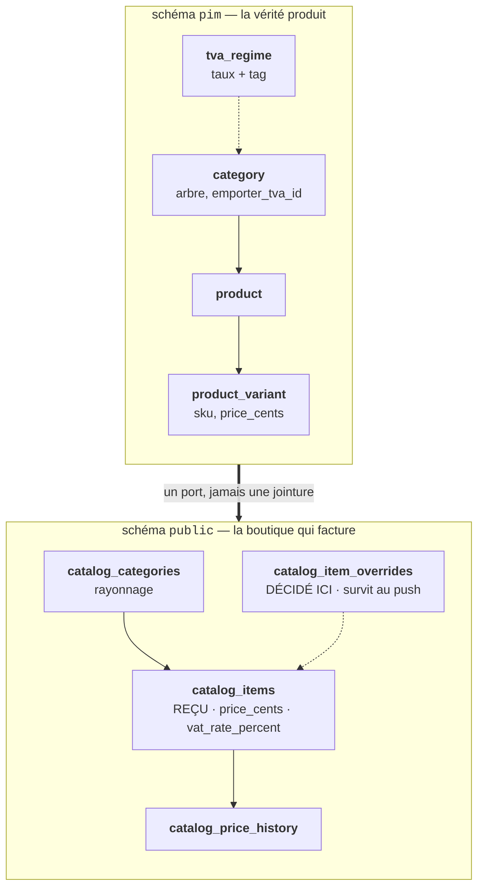
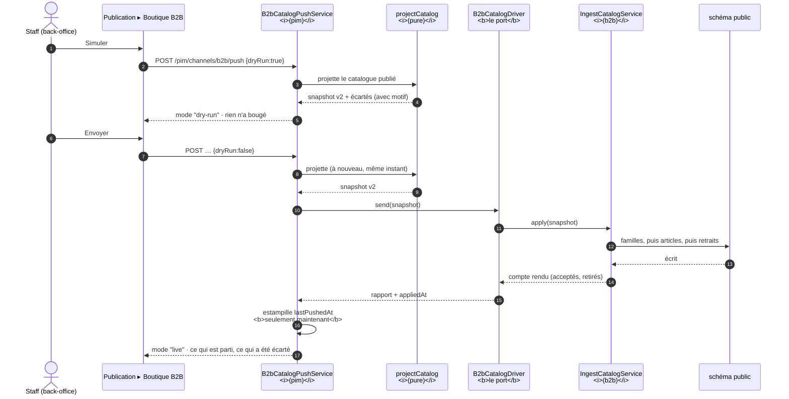
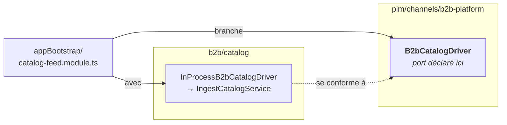
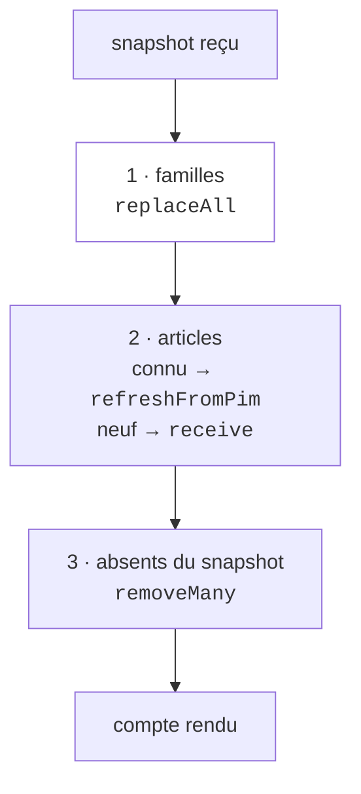
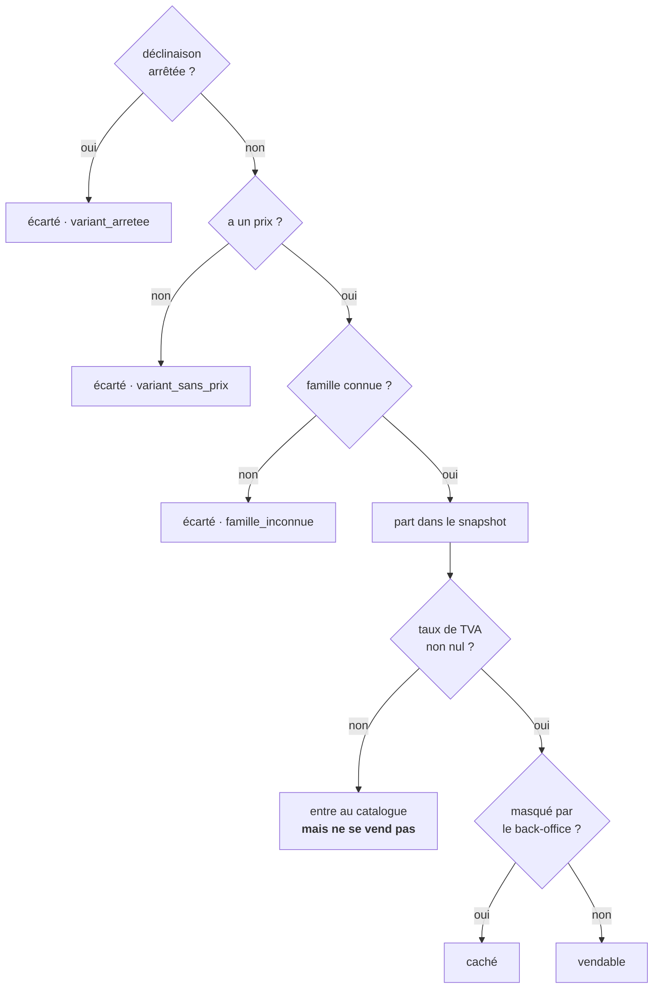

# Le push catalogue, de bout en bout — `pim` → `public`

> **Ce document décrit ce qui tourne.** Il répond à une question précise : par
> où passe un produit entre le moment où on le saisit dans le référentiel et
> celui où un client peut l'acheter, et **pourquoi** ce chemin est aussi
> indirect alors que tout vit dans le même processus.
>
> Le _pourquoi_ des décisions est ailleurs :
> [`architecture-catalogue-synchronise.md`](architecture-catalogue-synchronise.md).
> Ici, c'est la mécanique.

---

## En une phrase

Le référentiel **projette** un instantané de son catalogue, un **port** le
transporte, et la boutique **l'ingère par ses agrégats** dans ses propres
tables — sans qu'aucune requête ne joigne jamais les deux schémas.

---

## Les deux schémas, et le mur entre eux

Une seule base Postgres, **un schéma par propriétaire**. Ce n'est pas un
rangement : c'est ce qui rend chaque moitié déplaçable.

**Aucune requête ne joint `pim.*` à `public.*`.** Deux gardes le tiennent, et
ils gardent deux choses différentes :

| Garde                     | Ce qu'il tient | Pourquoi il ne suffit pas seul                      |
| ------------------------- | -------------- | --------------------------------------------------- |
| `lint:context-boundaries` | le **code**    | un graphe d'imports ne voit pas une requête SQL     |
| `lint:cross-schema-join`  | la **base**    | une jointure écrite à la main échappe à tout typage |

La matrice des frontières autorise `b2b` à connaître `pim`, **jamais l'inverse** :
le référentiel ignore qui le consomme. C'est ce qui permet d'ajouter un canal
sans toucher au PIM.

---

## Le chemin, du clic à la vente

**Deux détails qui ont l'air anodins et ne le sont pas :**

- `lastPushedAt` est posé **après** la réponse. Le poser avant ferait passer un
  échec pour un catalogue en ligne, et l'écran dirait « à jour » d'un produit
  que personne ne peut acheter.
- L'instant d'émission est pris **une seule fois** et traverse tout le
  snapshot. Deux `new Date()` dans la même opération dérivent de quelques
  millisecondes, et le snapshot porte alors un instant qui n'est celui de rien.

---

## Le port, et pourquoi il survit à « on est dans le même processus »

`B2bCatalogDriver` est déclaré par le **PIM** ; `InProcessB2bCatalogDriver`,
fourni par le **B2B**, s'y conforme. Le branchement des deux se fait dans
`appBootstrap/catalog-feed.module.ts` — le seul endroit autorisé à connaître les
deux côtés à la fois.

Quand les deux vivaient dans des conteneurs séparés, ce port était du HTTP avec
un secret partagé à faire tourner. Le rapprochement a supprimé le transport —
**pas le port**. Ce qui a disparu : un secret, une identité machine-à-machine,
un `fetch` qui pouvait échouer entre deux conteneurs, une revalidation du
rapport de retour. Ce qui reste est la seule chose que le fil ait jamais eu à
faire : appliquer un instantané.

Le garder coûte une indirection et achète le droit de re-séparer les deux
moitiés sans réécrire ni l'émetteur ni le récepteur.

---

## Ce que le snapshot transporte (contrat v2)

`@lfd/catalog-sync` — un schéma Zod, validé au bord.

| Niveau       | Champs                                                                                | À retenir                                                                     |
| ------------ | ------------------------------------------------------------------------------------- | ----------------------------------------------------------------------------- |
| **snapshot** | `version` · `generatedAt`                                                             | `version` est un littéral : une v inconnue est refusée, pas ingérée à moitié  |
| **famille**  | `id` `name` `slug` `parentId` `position` · `vatRatePercent`                           | le taux y est **descriptif** depuis la v2 — pour le rayonnage, pas la facture |
| **produit**  | `id` `sku` `name` `categoryId` `kind` · `variants` (≥ 1)                              | un produit sans déclinaison n'a rien à vendre                                 |
| **article**  | `sku` `name` `priceCents` `weightGrams` `isDefault` `position` · **`vatRatePercent`** | **c'est lui qui fait autorité sur le taux**                                   |

### Pourquoi le taux a changé d'étage (2026-08-21)

Il vivait sur la famille. La boutique retrouvait donc le taux à facturer **en
rejoignant la famille de l'article** : la ligne facturée dépendait d'une
jointure et d'un rafraîchissement de famille réussi.

Un article se vend seul ; il doit pouvoir se facturer seul. Le PIM résout le
taux à l'émission — depuis le régime **« à emporter »** de la famille, parce
qu'une vente B2B est une livraison ou un retrait : la marchandise repart, le
régime « sur place » décrit une consommation en boutique qui n'existe pas sur
ce canal.

`null` traverse tel quel. Il veut dire « famille non réglée dans le
référentiel », et **jamais** 5,5 % : l'article entre au catalogue local mais
n'est pas vendable.

---

## Ce que l'ingestion fait, dans l'ordre

1. **Les familles d'abord** — les articles y font référence.
2. **Les articles par leurs agrégats**, jamais par des colonnes. C'est ce qui
   met l'invariant hors de portée : `refreshFromPim` reporte la décision locale
   **sans avoir le pouvoir de la modifier**.
3. **Ce qui n'est plus publié est retiré**, et les SKU retirés sont **nommés**
   dans le compte rendu — un produit qui disparaît d'une boutique est une
   nouvelle, et la première question est « lesquels ».

Le tout dans **une transaction** : un catalogue à moitié écrit vend des articles
à des prix qui n'ont jamais été décidés ensemble.

### La ligne de partage : reçu vs décidé

| Table                    | Qui écrit          | Ce qu'un push en fait      |
| ------------------------ | ------------------ | -------------------------- |
| `catalog_items`          | le **push**        | remplacé                   |
| `catalog_item_overrides` | le **back-office** | **intact** — il y survit   |
| `catalog_price_history`  | le push ET l'admin | une ligne si le prix bouge |

Deux tables plutôt que des colonnes mélangées : sans ça, un push écraserait un
prix négocié, et personne ne saurait dire lequel des deux avait raison.

---

## Ce qui décide qu'un article est vendable

Les quatre premiers refus sont **dits** dans le compte rendu du push, avec leur
motif. Le cinquième — pas de taux — se joue côté boutique, dans `CatalogReader` :
l'article existe, se voit dans le paramétrage, et ne se vend pas. On n'invente
jamais 5,5 %.

---

## Ce qui se passe quand personne ne pousse

**Rien.** C'est la propriété la plus importante à comprendre, et la plus facile
à oublier : le push est **manuel**, il n'y a aucun automate.

Entre deux envois, la boutique vend l'état du dernier snapshot. Un prix corrigé,
un produit publié, un régime de TVA révisé **n'existent pas pour le client**
tant que personne n'a cliqué.

Deux garde-fous, à ne pas confondre :

| Outil                                                        | Répond à                                                | Ne répond pas à                   |
| ------------------------------------------------------------ | ------------------------------------------------------- | --------------------------------- |
| **Publication ▸ Boutique B2B** (back-office)                 | « qu'est-ce qui partirait si je poussais maintenant ? » | « ai-je poussé ? »                |
| **`ops_catalog_parity`** (workflow, `/admin/catalog/parity`) | « le miroir a-t-il dérivé de sa source ? »              | il **constate**, il ne répare pas |

La comparaison de parité confronte, par SKU : **présence**, **nom**, **prix
canonique** et — depuis le 2026-08-21 — **taux de TVA**. Ce dernier manquait :
elle prouvait donc que les deux côtés vendaient le même article au même prix HT
en laissant chacun libre d'y appliquer un taux différent.

---

## Où regarder quand ça ne marche pas

| Symptôme                                      | Regarder                                                                 |
| --------------------------------------------- | ------------------------------------------------------------------------ |
| Un produit n'apparaît pas dans la boutique    | le compte rendu du push : il est probablement **nommé dans les écartés** |
| Il est parti, mais reste invisible à l'achat  | son `vat_rate_percent` — famille sans régime « à emporter » dans le PIM  |
| Le prix affiché n'est pas celui du PIM        | `catalog_item_overrides` : une décision B2B gagne, et c'est voulu        |
| La parité signale un écart de TVA             | un régime révisé dans le PIM, jamais poussé — pousser                    |
| `persistence.migrations_pending` au démarrage | `pnpm --filter lfd-api exec prisma migrate deploy`                       |

---

## Les fichiers, si on veut lire le code

| Étape         | Fichier                                                                |
| ------------- | ---------------------------------------------------------------------- |
| Contrat       | `packages/catalog-sync/src/snapshot.ts`                                |
| Projection    | `apps/lfd-api/src/pim/channels/b2b-platform/products/projection.ts`    |
| Push          | `…/b2b-platform/products/push.service.ts` · `push.controller.ts`       |
| Port          | `…/b2b-platform/products/driver.ts` · `feed-preview.ts`                |
| Branchement   | `apps/lfd-api/src/appBootstrap/catalog-feed.module.ts`                 |
| Ingestion     | `apps/lfd-api/src/b2b/catalog/application/ingest-catalog.service.ts`   |
| Agrégat reçu  | `…/b2b/catalog/domain/entities/catalog-item.ts`                        |
| Lecture vente | `…/b2b/catalog/infrastructure/prisma-catalog.reader.ts`                |
| Parité        | `…/b2b/catalog/domain/catalog-parity.ts`                               |
| Écran         | `apps/lfc-B2B-admin-frontend/src/app/pim/publication/publication-b2b/` |
