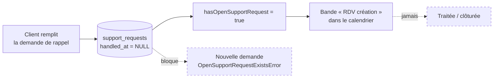

# Release de la partie commerciale — acquisition & prise de RDV

> **Objectif de ce document** : dire ce qu'il manque pour mettre en production
> **la seule tranche « commerciale »** (acquisition entrante, démarchage sortant,
> prise de rendez-vous), indépendamment du reste de la plateforme B2B.
>
> Compagnons : [`espace-commercial-prospects-leads.md`](espace-commercial-prospects-leads.md)
> (concept), [`espace-commercial-prospects-leads-todo-tech.md`](../todos/todo-commercial-acquisition.md)
> (décisions d'architecture gelées), [`audit-croissance-analytique.md`](audit-croissance-analytique.md)
> (justesse des chiffres du dashboard).
>
> Audit du code au 2026-08-09. Chaque constat porte sa référence de fichier :
> il est **falsifiable**, pas une impression.

---

## 1. Le périmètre qu'on veut releaser

**Dans le périmètre** — tout ce qui fait entrer un client et le fait avancer
jusqu'à l'activation :

| Surface                                      | Où                                             |
| -------------------------------------------- | ---------------------------------------------- |
| Tableau de bord commercial (top-5 du jour)   | `commercial/cockpit`                           |
| Prospects (hot / mid / cold unifiés)         | `commercial/prospects`                         |
| Activation & frictions                       | `commercial/activation`                        |
| Acquisition (calendrier + file à traiter)    | `commercial/acquisition`                       |
| Demande de rappel côté client                | panneau support d'activation + panneau contact |
| Réglages → Commercial (seuils, marché ciblé) | `reglages/commercial`                          |

**Hors périmètre pour cette release** : catalogue, panier, commandes, paiements,
abonnements, PIM. Le dashboard **Croissance** est dedans par la bande (il vit
dans le même onglet) mais il a été audité et corrigé séparément — il n'ajoute
aucun bloquant ici.

---

## 2. Ce qui tient déjà — à ne pas refaire

Les fondations posées en Phase 0/1 sont bonnes et **ne sont pas le sujet** :

- **Journal d'événements** `activity_event` : ULID, `occurredAt` / `recordedAt`
  distincts, `traceId` W3C, `idempotencyKey` unique, `schemaVersion`. Append-only.
- **`Clock` + `IdGenerator` + RequestContext (ALS)** — le temps métier a une
  autorité unique, les tests sont déterministes.
- **Agrégat `Lead`** ([`entities/lead.ts`](../../apps/lfc-B2B-platform-backend/src/growth/domain/entities/lead.ts)) :
  pipeline monotone (`new → contacted → qualified → negotiating`), terminaux
  `converted` / `lost`, horodatage du contact. Invariants testés.
- **Rapprochement automatique** lead ↔ compte par e-mail à `user.registered`.
- **Scoring** = fonction pure + read-model matérialisé `lead_score`, recalculé par
  **Cloudflare Cron Trigger** 3×/jour (`0 3,11,19 * * *` UTC) sur
  `POST /admin/recompute`, gardé par `RecomputeGuard`.
- **Cockpit** qui journalise `reco.shown` (capture de la boucle fermée, exploitation Phase 2).
- **Surface staff** : montage à deux portes cohérent sur tous les `/admin/*`
  (`@Public()` désarme le guard client, `AdminAuthGuard` réarme la porte staff).
- **Tests** : 501 verts, e2e sur `leads`, `prospects`, `cockpit`, `activations`,
  `growth-stats`, `activity-events`.

---

## 3. Le trou central : la prise de RDV n'existe pas

C'est **le** sujet de cette release, et c'est le plus mal en point. Trois constats
qui se cumulent, du plus visible au plus grave.

### 3.1 Le lien de réservation client est un placeholder

[`contact-panel.ts:38`](../../apps/lfc-B2B-platform-frontend/src/app/contact/contact-panel/contact-panel.ts) :

```ts
/** Lien de prise de rendez-vous — TODO : URL de réservation réelle. */
protected readonly bookingUrl = 'https://cal.com/lafoliecoffee';
```

Le téléphone (`+33 4 79 00 00 00`) et l'e-mail (`contact@lafoliecoffee.fr`) sont
également des placeholders assumés. Et même branché sur un vrai Cal.com : **un RDV
pris par ce chemin ne revient jamais dans le CRM**. C'est une fuite, pas une feature.

### 3.2 La demande de rappel est collectée puis jetée

`SupportRequest` collecte pourtant exactement ce qu'il faut — `channel`
(`phone` | `email`), `phoneNumber`, `asap`, `scheduledDate`, `slot`
(`morning` | `afternoon`), `message` — avec un schéma Zod qui refuse déjà les
incohérences (un e-mail sans créneau, un rappel sans numéro, une date passée).

Mais **aucune surface staff ne lit ces champs**. Le reader admin
([`prisma-admin-company.reader.ts:34`](../../apps/lfc-B2B-platform-backend/src/account/infrastructure/prisma-admin-company.reader.ts)) :

```ts
supportRequests: {
  where: { handledAt: null },
  select: { id: true },   // ← un booléen, rien d'autre
  take: 1,
},
```

→ la vue admin n'expose qu'un `hasOpenSupportRequest: boolean`. **Le commercial ne
voit ni la date demandée, ni la demi-journée, ni le numéro à composer, ni le message.**
Le client remplit un formulaire dont personne ne lira jamais le contenu.

### 3.3 `handled_at` n'est jamais écrit — le flux est bloqué à vie

Recherche exhaustive sur `handledAt` dans `src/` : **trois occurrences, toutes en
lecture** (`where: { handledAt: null }`). Aucune commande, aucun endpoint, aucun
chemin ne pose cette date.



Deux conséquences, toutes deux bloquantes :

1. **La bande « RDV création » ne s'éteint jamais.** La file « à traiter » du
   calendrier ne fait que grossir ; au bout de quelques semaines elle ne veut plus
   rien dire.
2. **Le client ne peut plus jamais redemander à être rappelé.** Le handler lève
   `OpenSupportRequestExistsError` tant qu'une demande est ouverte
   ([`request-activation-support.handler.ts`](../../apps/lfc-B2B-platform-backend/src/account/application/commands/request-activation-support.handler.ts)) —
   et comme aucune ne se ferme, c'est définitif.

C'est un **bug fonctionnel**, pas un manque de feature.

### 3.4 Le calendrier n'affiche pas des RDV

Ce que l'onglet Acquisition appelle « RDV » n'en est pas un
([`calendrier-page.ts`](../../apps/lfc-B2B-admin-frontend/src/app/commercial/calendrier/calendrier-page.ts)) :
c'est une **bande ouverte** allant de `createdAt` à aujourd'hui, teintée en rouge
parce que `hasOpenSupportRequest` est vrai. Elle n'est **pas posée au jour demandé
par le client**, et son intitulé (« Rappel demandé ») est tout ce qu'elle porte.

Et cliquer dessus ne fait rien —
[`calendrier-page.ts`](../../apps/lfc-B2B-admin-frontend/src/app/commercial/calendrier/calendrier-page.ts) :

```ts
/** Ouvre le dossier de la société depuis un événement — fiche à venir (side-panel). */
protected openCompany(event: AcquisitionEvent): void {
  void event.data;
}
```

### 3.5 Zéro filet de test

Le mot `support` n'apparaît **nulle part** dans `test/` (21 suites e2e). Le seul
flux client → staff de toute l'acquisition est le seul sans test d'intégration.

---

## 4. Les bloquants, classés

### P0 — la release n'a pas de sens sans

| #           | Constat                                                                   | Preuve                                                              |
| ----------- | ------------------------------------------------------------------------- | ------------------------------------------------------------------- |
| **P0-1**    | `handled_at` jamais écrit → file jamais purgée, client verrouillé         | §3.3                                                                |
| **P0-2**    | Créneau / canal / numéro / message non exposés au staff                   | `prisma-admin-company.reader.ts:34`                                 |
| **P0-3** 🔴 | **Aucune notification** — pas une seule dépendance mailer dans le backend | `package.json` : 0 occurrence `nodemailer\|resend\|sendgrid\|brevo` |
| **P0-4**    | Le calendrier ne mène nulle part (`openCompany` = no-op)                  | `acquisition-page.ts`                                               |
| **P0-5**    | Zéro e2e sur le flux support/RDV                                          | `test/`                                                             |

Sur **P0-3** : le schéma Prisma le documente lui-même (« notification e-mail
viendra avec l'infra mailer »). Aujourd'hui, une demande de rappel ne déclenche
strictement rien — le dispositif repose entièrement sur quelqu'un qui pense à
ouvrir l'onglet. C'est intenable dès le premier client réel.

### P1 — fort, arbitrable au cas par cas

| #        | Constat                                                                            | Preuve                                    |
| -------- | ---------------------------------------------------------------------------------- | ----------------------------------------- |
| **P1-1** | Le lead est un cul-de-sac : pas de fiche, pas d'édition, pas de suppression        | pas de route `commercial/leads/:id`       |
| **P1-2** | `editNotes()` sur l'agrégat est du **code mort** — aucune commande ne l'appelle    | 1 seule occurrence, sa définition         |
| **P1-3** | **Aucune dédup à la capture** : deux fois le même SIRET/e-mail = deux leads        | `capture-lead.handler.ts`                 |
| **P1-4** | Pas de propriétaire/assignation, pas de `nextActionAt` (« relancer le JJ/MM »)     | modèle `Lead`                             |
| **P1-5** | **Aucune entrée inbound** : l'app cliente est intégralement authentifiée           | `app.routes.ts` (login/boutique/panier/…) |
| **P1-6** | RGPD prospection sortante non traité (consentement, opt-out, rétention)            | §7 de la todo-tech, non implémenté        |
| **P1-7** | Pas de pagination : `/admin/leads`, `/admin/prospects`, `listAll()` renvoient tout | les 3 readers                             |
| **P1-8** | Seuils d'alerte en `localStorage` — par navigateur, non partagés                   | `acquisition-settings.service.ts`         |

Deux méritent un mot.

**P1-4 est le pendant sortant du §3.** Le pipeline fait avancer un lead, mais on ne
peut **pas planifier le rappel**. Or « prise de RDV » a deux faces : le client qui
demande à être rappelé (entrant, §3) et le commercial qui se donne une échéance
(sortant, ici). Sans `nextActionAt`, le calendrier reste unilatéral.

**P1-5 est le trou le plus stratégique.** Toutes les routes de l'app cliente sont
derrière l'authentification : il n'existe **aucun formulaire public** « être rappelé »
ou « demander un devis » qui créerait un `Lead`. Toute l'acquisition entrante dépend
d'une inscription Auth0 spontanée. Si la release _vise_ l'acquisition, c'est
paradoxal — à trancher explicitement plutôt qu'à subir.

### P2 — après la release

- Boucle fermée incomplète : `reco.shown` est journalisé, `action.logged` /
  `outcome.logged` n'existent pas → **impossible de prouver que le cockpit sert**.
- Pas de fiche établissement/prospect transverse avec frise d'événements (prévue
  §8 de la todo-tech).
- Coordonnées de contact placeholder à brancher sur un réglage plateforme.

---

## 5. Les lots, dans l'ordre

### Lot 1 — Le RDV devient un objet réel _(débloque P0-1, P0-2, P0-4, P0-5)_

> **Conçu en détail dans [`architecture-prise-de-rendez-vous.md`](architecture-prise-de-rendez-vous.md)** —
> ce lot y est découpé en 7 tranches (R1 → R7). Résumé ici.

Le parti pris : ne pas se contenter d'exposer et clore le `SupportRequest`
existant, mais **donner au commercial la maîtrise de ses disponibilités** et au
client de **vrais créneaux réservables**.

- **Disponibilités** = règles hebdomadaires + exceptions, les créneaux étant
  **dérivés** par une fonction pure (`slotsFor`) partagée par le client et l'admin.
- **`Appointment`** = nouvel agrégat (états `requested → confirmed → honored |
no_show | cancelled`), exclusivité garantie par un **index unique partiel**,
  sujet discriminé (`company | lead | user`) donc **non muré par la société**.
- **`SupportRequest`** est conservé pour les chemins **non datés** (e-mail, rappel
  au plus vite), et gagne enfin sa clôture (`handled_at`) + sa file staff — c'est
  la tranche R7, indépendante du reste.
- Le calendrier Acquisition passe en vue **semaine**, affiche les rendez-vous à
  leur heure réelle, et `openCompany()` ouvre le side-panel d'actions.

**Fini quand** : le commercial ouvre une plage, un client réserve dedans, les deux
sont notifiés, et le rendez-vous se clôt en honoré ou absent.

### Lot 2 — Notification _(débloque P0-3)_

- Infra mailer en `infra/` derrière un port (`Mailer`), adaptateur au choix,
  `NoopMailer` en dev/test.
- E-mail staff sur `support.requested` (avec le créneau et le message).
- Accusé de réception client (« on vous rappelle le … »).
- Best-effort, jamais bloquant pour la transaction métier — même discipline que
  l'`ActivityRecorder`.

**Fini quand** : personne n'a besoin d'ouvrir l'onglet pour savoir qu'un client attend.

### Lot 3 — La relance sortante _(P1-1 → P1-4)_

- `Lead` gagne `ownerStaffUserId` et `nextActionAt` (+ migration).
- Dédup à la capture sur SIRET normalisé, sinon e-mail : rendre le lead existant
  plutôt que d'en créer un second.
- Commande `EditLeadNotes` — câbler l'`editNotes()` déjà écrit.
- Fiche lead (side-panel) : identité, notes, historique journal, actions pipeline.
- Le calendrier acquisition affiche les `nextActionAt` échues et à venir.

**Fini quand** : le calendrier est bilatéral — RDV entrants **et** relances sorties.

### Lot 4 — Conformité et entrée publique _(P1-5, P1-6)_

- Base légale + opt-out + rétention sur les leads démarchés ; suppression
  appliquée **avant** tout affichage de reco (§7 de la todo-tech).
- Formulaire public « être rappelé » → `Lead` avec source `inbound`.

À trancher : le Lot 4 est-il dans la release, ou la release commerciale est-elle
d'abord un **outil interne** (staff only) qu'on ouvre au public ensuite ? Voir §7.

### Lot 5 — Durcissement _(P1-7, P1-8)_

- Pagination + tri serveur sur les trois listes.
- Seuils d'acquisition migrés de `localStorage` vers `platform_settings`
  (le reste des réglages y est déjà).

---

## 6. Critères de sortie

La tranche commerciale est releasable quand **tous** ces énoncés sont vrais :

- [ ] Une demande de rappel affiche au staff son **créneau réel**, pas un booléen.
- [ ] Une demande de rappel peut être **clôturée**, et une nouvelle déposée après.
- [ ] Une demande de rappel **notifie** quelqu'un sans intervention humaine.
- [ ] Cliquer un événement du calendrier **ouvre quelque chose**.
- [ ] Un commercial peut se donner une **échéance de relance** sur un lead.
- [ ] Saisir deux fois le même prospect ne crée pas deux leads.
- [ ] Le flux support est couvert en **e2e**.
- [ ] Les seuils d'alerte sont **partagés** entre commerciaux.
- [ ] Un prospect démarché peut demander à ne plus l'être.

Les deux derniers sont Lot 4/5 : ils peuvent sortir du périmètre par décision
explicite, pas par oubli.

---

## 7. Décisions ouvertes

1. **Release publique ou interne d'abord ?** Sans le Lot 4, la tranche est un
   outil staff — parfaitement défendable, mais il faut le dire.
2. **Cal.com ou RDV natif ?** Le Lot 1 fait du `SupportRequest` un vrai objet de
   RDV. Un Cal.com branché en plus (webhook → `Lead`/`SupportRequest`) réglerait
   la prise de RDV « froide » sans compte client. Les deux ne s'excluent pas.
3. **Le RDV est-il attaché à la société ou à la personne ?** Aujourd'hui à la
   société (`company_id`). Un lead cold n'a pas de société — donc pas de RDV
   possible. À arbitrer avec le Lot 3.
4. **Qui est notifié ?** Une adresse commerciale unique, ou le propriétaire du
   lead (ce qui suppose le Lot 3 avant le Lot 2) ?
5. **Fournisseur mailer** — à figer à l'implémentation du Lot 2.

---

## 8. Repères de code

| Sujet                                   | Où                                                                                                         |
| --------------------------------------- | ---------------------------------------------------------------------------------------------------------- |
| Demande de support (écriture client)    | `account/http/company-support.controller.ts`, `application/commands/request-activation-support.handler.ts` |
| Modèle `SupportRequest`                 | `prisma/schema.prisma` (~l.322)                                                                            |
| Contrat de la demande                   | `packages/contracts/src/support.ts`                                                                        |
| Lecture admin des sociétés (le booléen) | `account/infrastructure/prisma-admin-company.reader.ts`                                                    |
| Agrégat `Lead` + pipeline               | `growth/domain/entities/lead.ts`                                                                           |
| Capture / transition de lead            | `growth/application/commands/`                                                                             |
| Surfaces staff                          | `growth/http/admin-{leads,prospects,cockpit,activations,recompute}.controller.ts`                          |
| Page Calendrier (ex-Acquisition)        | `commercial/calendrier/calendrier-page.ts`                                                                 |
| Onglet Calendrier                       | `commercial/calendrier/calendrier-page.ts`                                                                 |
| Seuils d'alerte (localStorage)          | `commercial/settings/acquisition-settings.service.ts`                                                      |
| Panneau contact client (placeholders)   | `contact/contact-panel/contact-panel.ts`                                                                   |
