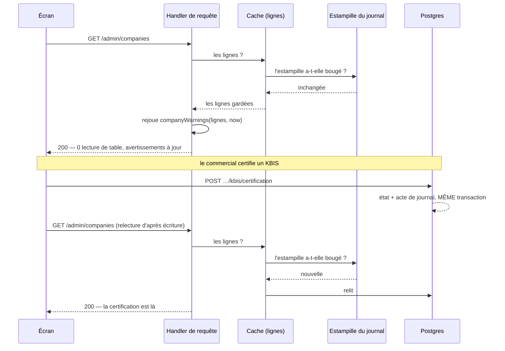

# Le cache des comptes clients — ce qu'on garde, et comment on le jette

> **État : doc-first.** Rien de ce qui suit n'est implémenté au 2026-09-09.
> Le dépôt n'a aucun cache de lecture sur cet écran, et il ne peut pas en avoir :
> la porte n'est pas ouverte (§2.1).
>
> 🔴 **Ce document a été contredit avant d'être soumis, et six de ses
> affirmations sont tombées.** Ce qu'elles ont changé est au §9 — c'est la
> section à lire si on a connu la première version.

Périmètre : l'onglet **Comptes clients** (`/commercial/comptes-clients`), la
**fiche** d'un compte, et les lectures serveur qui les servent. La tarification
a déjà son cache (`PricingMaterialsCache`) ; on ne le refait pas, on en tire les
leçons (§5).

---

## 1. Ce qu'un écran coûte aujourd'hui

Des **requêtes Postgres**, comptées en lisant les adaptateurs.

| Appel HTTP                                                                       | Requêtes               | Dont datées |
| -------------------------------------------------------------------------------- | ---------------------- | ----------- |
| `GET /admin/companies` (la liste)                                                | 1 racine + 5 relations | 0           |
| `GET /admin/companies/:id` (la fiche staff, relue après **chaque** modification) | 1 + 5 relations + 3    | 0           |
| `GET /admin/companies/:id/customer-sheet` (le tableau de bord du compte)         | 8 (7 sans membre)      | 2           |
| `GET /admin/growth/portfolio` (le bandeau de chiffres)                           | 5                      | 3           |
| `GET /admin/alerts/pending` (la pastille)                                        | 1                      | 0           |

Les cinq relations de la liste : demandes de support, membres `owner`, **le
`user` de ces membres** (un second niveau, donc une requête de plus), adresse de
facturation, mandat actif — toutes en `take: 1`.

**Ouvrir la liste coûte une douzaine de requêtes ; ouvrir une fiche une
vingtaine.**

🔴 **Et la liste est lue deux fois à chaque démarrage** : `app.ts:276` la demande
pour le compteur du menu, l'écran la redemande en s'ouvrant. Personne n'a écrit
ce doublon ; il naît de deux consommateurs qui veulent la même chose sans le
savoir. Aucun cache serveur ne le règle.

---

## 2. Pourquoi le taux est exactement 0 %, et pas réglable

### 2.1 La porte n'est pas ouverte

`PrismaService` branche Accelerate dès que l'URL est `prisma+postgres://`, ce
qui est le cas en production. Mais **Accelerate n'y sert que de pool et de
proxy** : le cache se demande par un `cacheStrategy` sur chaque lecture, et le
dépôt n'en porte aucun. Le mot n'apparaît **pas une seule fois** dans le client
généré (vérifié le 2026-09-09) : il vient de `@prisma/extension-accelerate`, qui
n'est pas installé. L'argument n'est donc pas inutilisé, il est indisponible.

⚠️ **Non vérifié** : que cette extension supporte Prisma 7.8 en `accelerateUrl`.
Tout le lot 4 en dépend.

### 2.2 Une clé par milliseconde — et le remède évident est un piège

Le cache d'Accelerate est indexé par la requête, arguments compris. Or cinq
lectures sont datées à l'instant vif, **aux deux bouts** :

```ts
// prisma-customer-sheet.reader.ts — la borne haute est le `now` brut
this.sumBetween(revenue, since, now); // → createdAt: { gte: from, lt: to }
```

Arrondir la seule fonction `trendWindows` (qui ne rend que les bornes **basses**)
n'achèterait donc rien : la borne haute continuerait de bouger à chaque
milliseconde.

**Et arrondir aussi la borne haute serait pire.** `lt: floorToHour(now)` exclut
des fenêtres **toutes les commandes de l'heure en cours** : un commercial qui
vient de passer une commande pour son client ouvre la fiche et voit le CA
inchangé pendant jusqu'à une heure. Une relecture d'après écriture périmée, sur
de l'argent.

**Le remède est asymétrique** : on arrondit la borne **basse**, et on **supprime**
la borne haute de la fenêtre courante. Une commande ne peut pas être passée dans
le futur — `gte: floorToHour(since)` sans borne haute dit exactement « les
30 derniers jours, jusqu'à maintenant ». La clé devient stable pendant une
heure **et** la commande de la minute compte immédiatement. Seule la fenêtre
précédente garde ses deux bornes, et elles sont toutes deux arrondies.

Ce que ça change à l'écran : une commande d'il y a 30 jours et 12 minutes peut
rester comptée jusqu'à la prochaine heure ronde. Ce que ça ne change pas : ce
qu'on vient de faire est compté tout de suite.

🔴 **Deux endroits, pas un.** La fiche calcule ses bornes dans le domaine
(`customer-stats.ts`), le portefeuille dans **son adaptateur**, avec ses propres
constantes (`prisma-portfolio-metrics.reader.ts:9-10`). Le lot 2 est donc soit
deux arrondis, soit un déplacement de la logique de fenêtre de `growth` vers un
domaine — décision à prendre avant d'écrire, et à ne pas prendre en douce.

### 2.3 Des ports de lecture qu'une écriture consulte

`ActivateCompanyByStaffHandler` — une **commande** — lit
`AdminCompanyReader.byId()` pour décider si l'activation est permise
(`activationGate`), puis écrit `isReachable(view)` **dans l'agrégat**. Servir
cette lecture depuis un cache, c'est ouvrir un compte sur un dossier périmé — ou
refuser d'en ouvrir un qui est complet depuis dix secondes.

Ce n'est pas propre à ce port. Dans `src/`, **trente-cinq** handlers de commande
injectent un port de lecture (compté le 2026-09-09) : `MembershipReader` douze
fois dans `account` — c'est lui qui vérifie le **mur tenant** —,
`ProductCatalogReader` deux fois dans la tarification (§3), et ainsi de suite.

**Donc pas de règle générale du genre « on ne cache jamais un port qu'une
commande injecte » : le dépôt la violerait trente-cinq fois le jour de son
écriture**, et on apprendrait à ne pas la lire.

La règle utile est plus étroite, et elle est vérifiable :

> Un **objet caché** n'est jamais joignable depuis un handler de commande.

Concrètement, le cache ne se pose **pas** en décorant un jeton Nest — c'est le
geste le plus court, et il met les trente-cinq chemins derrière une valeur
périmée d'un seul coup. Il se pose sur un **type distinct**, qui ne porte que
les méthodes de lecture d'écran (`listAll()`, jamais `byId()`), injecté par les
seuls handlers de requête. Une commande qui voudrait s'en servir ne trouverait
pas la méthode dont elle a besoin : c'est _inexprimable_ plutôt que surveillé.

---

## 3. Ce qu'on cache — la ligne, pas la vue

🔴 **La distinction qui fait tout ce chapitre.** La liste et la fiche staff ne
portent aucune date **en SQL** — mais leur _vue_ en dépend :

- `companyWarnings(row, now)` fait naître `attente_prolongee` **au seul passage
  du temps**, à 14 jours ;
- `projectContacts(row, …, now)` fait périmer une invitation à la même heure.

Cacher la **vue** ferait donc disparaître un avertissement qui devait apparaître
tout seul un vendredi soir — exactement ce pour quoi on refuse de cacher la
pastille d'alertes.

**On cache donc les LIGNES lues, et on rejoue la projection à chaque requête.**
`companyWarnings` et `projectContacts` sont des fonctions pures sur des données
déjà en mémoire : les rejouer coûte quelques microsecondes, et rend le problème
inexistant plutôt que surveillé.

| Ce qu'on garde                                            | Jusqu'à quand         | Ce qui le jette           |
| --------------------------------------------------------- | --------------------- | ------------------------- |
| **les lignes de la liste** (racine + 5 relations)         | la prochaine écriture | voir la liste ci-dessous  |
| **les lignes d'une fiche**                                | la prochaine écriture | idem                      |
| **les agrégats datés** (2 de la fiche, 3 du portefeuille) | la fin de l'heure     | l'arrondi lui-même (§2.2) |

**Ce qu'on ne cache pas, et c'est délibéré :**

- **`GET /admin/alerts/pending`** — une file d'attente. Une pastille périmée
  envoie sur un écran vide, ou laisse une alerte invisible.
- **Tout ce qu'une commande lit** (§2.3).
- **Le catalogue vendable** — voir §7, lot 4 : c'est un piège, pas une
  friandise.

---

## 4. Comment on invalide

### 4.1 L'estampille existe déjà, contrairement à ce que ce document disait

`b2b/account` journalise ses actes par `DomainEventPublisher.publishTraced`
(**dix-huit appels** dans ses handlers de commande : activation, certification
KBIS, changement de statut, identité, contacts, adresses), et `journal.module.ts`
branche ce journal sur `ActivityRecorder.recordOrFail`. `account-facts.ts` le dit
en toutes lettres : **la trace est dans la transaction**, une panne de journal
annule l'acte.

C'est l'analogue exact du journal tarifaire : un identifiant croissant, écrit
dans la même transaction que l'état, quelle que soit l'instance qui l'a écrit.
**Le passage obligé qu'on croyait à construire est en partie déjà là.**

### 4.2 Les deux trous, qui sont ailleurs

Ce que le journal d'`account` n'attrape pas, et qui change pourtant l'écran :

1. **`users`** — la liste affiche le nom et l'e-mail du propriétaire. Cette table
   est écrite par `customer-principal.resolver.ts:104`, qui bascule
   `invited → active` **à la première connexion du client**. Aucune écriture
   staff, aucune réponse HTTP de back-office à laquelle s'accrocher.
   _Ce n'est pas grave_ : ce resolver « écrit seulement si quelque chose
   change » (vérifié le 2026-09-09), donc une fois par personne, pas à chaque
   connexion. Une invalidation sur cette écriture est rare et supportable.
2. **`payment_mandates`** — écrit par `b2b/payments`, hors d'`account`.
   L'avertissement `mandat_absent` en dépend. Un flux de paiement n'est pas un
   geste de commercial : il faut l'inscrire explicitement, sans quoi la liste
   réclame un mandat qui existe.

**Toute table dont la liste tire une colonne doit figurer dans le jeu
d'invalidation** : `companies`, `company_contacts`, `memberships`, `users`,
`support_requests`, `company_addresses`, `payment_mandates`.

### 4.3 Ce que l'estampille ne protège pas

Le cache est jeté **par compte** dans l'idéal, mais l'estampille du journal est
**globale** : elle dit que quelque chose a bougé, pas chez qui. Deux choix, à
trancher au lot 3 et pas avant :

- **jeter tout** (ce que fait `PricingMaterialsCache`) — simple, et suffisant
  tant que les écritures sont rares ;
- **porter le `companyId` dans l'acte** pour ne jeter qu'une entrée — plus fin,
  et à ne faire que si la mesure montre que le premier ne suffit pas.

⚠️ **Le §3 ne promet donc pas « ce qui change chez A ne périme pas B ».** C'était
une promesse plus large que son mécanisme.



---

## 5. Où le cache doit vivre : en mémoire d'abord

Le déploiement porte **une seule instance** de l'API
(`ops/architecture-deploiement.md` §4, « Instances max : 1 » — un choix de
routage, pas un plafond de capacité), et le back-office compte cinq personnes.

- un cache **en mémoire** touché coûte **zéro** : ni réseau, ni facture, ni
  dépendance nouvelle ;
- un cache **Accelerate** touché coûte un aller-retour jusqu'à l'edge — moins
  que la base, mais pas rien — et se facture.

Accelerate gagne quand les instances se multiplient, quand plusieurs régions
lisent la même chose, ou quand le processus redémarre souvent. Ce n'est pas
notre situation. **Mémoire + estampille**, donc — et l'estampille est justement
ce qui gardera ce cache correct le jour où « Instances max » passera à 2.

### 🔴 Le harnais e2e, que le dépôt a déjà payé deux fois

`test/e2e-harness.ts` appelle explicitement `StaffAccessResolver.forgetAll()` et
`PricingMaterialsCache.invalidate()` dans son `reset()`, avec la raison écrite :
sans ça, « une suite tarifierait avec les règles de la précédente ». **Un
troisième cache mémoire doit être oublié au même endroit, dans le même commit.**

Et l'estampille n'y suffit pas : un `TRUNCATE` la fait **revenir en arrière**
(le journal repart vide), donc une entrée gardée sous l'ancienne valeur serait
resservie. Le `reset()` explicite n'est pas une précaution, c'est la seule chose
qui tienne.

---

## 6. L'arithmétique des 90 %

Un cache invalidé rate **une fois par changement**. Pour une clé :

```
taux ≈ 1 − (écritures) / (lectures)
```

**90 % exige dix lectures par écriture sur la même clé.**

| Clé                                  | Taux atteignable                                                           |
| ------------------------------------ | -------------------------------------------------------------------------- |
| les lignes de la liste               | **> 90 %** — lue à chaque retour à l'onglet, écrite quelques fois par jour |
| les agrégats datés, sur clé horaire  | **> 90 %** hors première lecture de l'heure                                |
| **la fiche du compte qu'on modifie** | **≈ 0 %, et c'est correct**                                                |

Trois réserves, et elles sont sérieuses :

1. **Le lot 1 abaisse le taux.** Supprimer le doublon du démarrage retire des
   lectures faciles à servir. C'est le bon geste quand même : un cache qui sert
   un doublon a un excellent taux et n'a rien économisé.
2. **Une session d'édition, ce n'est pas une écriture.** Régler l'identité, une
   adresse, un contact, les termes et le KBIS fait **cinq** invalidations.
3. **Aucun de ces chiffres n'est mesuré.** « Quelques écritures par jour » est
   une intuition. **La première chose à écrire n'est pas le cache, c'est le
   compteur qui dira si la cible est atteinte.**

Réponse honnête à « 90 % minimum » : **oui, mais sur les lectures collectives,
et seulement en cachant jusqu'à l'écriture** — pas avec une durée de vie. Un TTL
court, à ce trafic, rate presque tout ; un TTL long ment à celui qui vient de
saisir.

---

## 7. L'ordre de démontage

| Lot   | Ce qu'il fait                                                                                                                | Ce qu'il rapporte             | Ce qu'il risque                                       |
| ----- | ---------------------------------------------------------------------------------------------------------------------------- | ----------------------------- | ----------------------------------------------------- |
| **1** | une seule lecture de la liste au démarrage                                                                                   | −50 % des requêtes de l'écran | rien : aucune donnée ne vieillit                      |
| **2** | arrondir la borne **basse** des fenêtres, retirer la borne haute de la fenêtre courante ; **aux deux endroits** (§2.2)       | rend 5 lectures cachables     | **change un chiffre affiché** — voir ci-dessous       |
| **3** | cache mémoire des **lignes** + estampille du journal, sur un type qui n'expose que la lecture d'écran ; oubli dans `reset()` | l'essentiel du taux           | l'invalidation : `users` et `payment_mandates` (§4.2) |
| **4** | `cacheStrategy` sur le catalogue vendable                                                                                    | l'onglet Tarifs               | 🔴 **à ne pas faire tel quel** — ci-dessous           |

**Le lot 2 n'est pas neutre.** `CustomerSheetView.stats.trend` est un contrat
servi au back-office **en service depuis le 2026-08-17**. Arrondir change
silencieusement une valeur commerciale (CA 30 j, tendance %) sans changer la
forme du contrat, donc sans qu'un déploiement en trois temps ne s'applique. À
annoncer, pas à glisser.

### 🔴 Le lot 4 est un piège, et c'est le plus dangereux du document

`ProductCatalogReader.all()` n'est pas un port d'affichage. Il est appelé par
`SetPriceFloorHandler` et `ConfirmPriceFloorHandler`
(`pricing.handlers.ts:115`), dont la médiane est **figée dans
`PricingFloor.pose()`** et sert, six mois plus tard, à dire que l'intention a
vieilli. Le même adaptateur sert aussi `place-order` par `resolveMany`.

Un catalogue périmé de quelques minutes ne produit donc pas un affichage lent :
il produit une **référence de dérive fausse, écrite en base, pour six mois** —
et une référence fausse ne se rattrape pas en vidant un cache, elle se rattrape
par une migration de données.

**Le lot 4 ne se fait pas sans avoir d'abord séparé le port qui affiche de celui
qui fige.** C'est un lot de tarification, pas un lot de cache.

---

## 8. Ce que ce document n'a pas vérifié

- que `@prisma/extension-accelerate` fonctionne avec Prisma 7.8 en
  `accelerateUrl` (§2.1) ;
- les **volumes réels** de lecture et d'écriture : le §6 raisonne sur un ordre
  de grandeur, pas sur une mesure ;
- le compte exact de requêtes par relation Prisma (comportement par défaut,
  aucun `relationLoadStrategy` posé dans le dépôt) — aucune trace SQL n'a été
  exécutée ;
- si `b2b/growth` peut importer `customer-stats.ts` d'`account` : même bloc
  `b2b`, donc la porte ne s'y oppose pas, mais la question se pose avant de
  choisir où vit `floorToHour` ;
- la liste exhaustive des écritures sur les tables cachées : un `$executeRaw` ou
  un job n'apparaîtrait pas dans le filet posé.

---

## 9. Ce que la contradiction a renversé

La première version de ce document a été soumise à `vitruve` avant relecture
humaine. **Six affirmations sont tombées, et chacune aurait coûté quelque
chose :**

| Ce qui était écrit                                     | Ce qui est vrai                                                            |
| ------------------------------------------------------ | -------------------------------------------------------------------------- |
| « cacher le catalogue vendable »                       | ce port fige une référence de prix pour six mois (§7)                      |
| la liste et la fiche « ne sont pas datées »            | leurs **vues** le sont — d'où le cache de lignes, pas de vues (§3)         |
| arrondir `trendWindows` stabilise la clé               | elle ne rend que les bornes basses : l'arrondi seul achète **zéro** (§2.2) |
| six tables à invalider                                 | il en manquait deux, et elles s'écrivent **hors du back-office** (§4.2)    |
| « aucune valeur ne dit que quelque chose a changé »    | le journal d'`account` en est une, dans la transaction (§4.1)              |
| « on ne cache jamais un port qu'une commande injecte » | le dépôt violerait cette règle 35 fois le jour de son écriture (§2.3)      |

Et cinq comptes étaient faux — 9 requêtes pour 8, quatre relations pour cinq,
six lectures datées pour cinq, « vingt-et-un sites sur cinq dépôts » pour huit
fichiers. **Chacun avait été compté à la main sur un motif mécanique.** C'est le
même défaut que le registre des prix a nommé trois fois : _la liste écrite à la
main est le point faible_, pas le raisonnement qu'elle porte.
