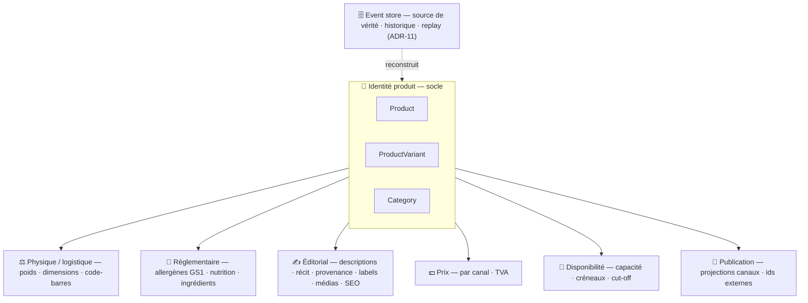
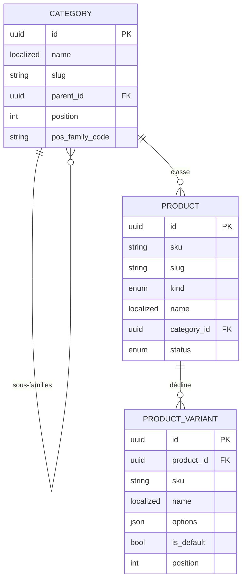

# 02 — Le produit, en couches (socle minimal)

> On définit d'abord le produit **simplement** : son **identité**. Tout le reste (poids, TVA, prix,
> dispo, allergènes, éditorial…) est une **couche** posée autour, avec son propre rythme de vie et son
> propre doc. Le socle ne mélange pas ces concerns.
>
> **Event-sourced** (ADR-11) : la source de vérité est le log d'events ; ces tables sont des
> **projections**. Donc **aucun `created_at` / `updated_at`** ici — le « qui / quand / version » vit
> sur l'event, pas sur l'entité.

## Le produit en couches

## Le socle, en relationnel

> Noter l'**absence de colonnes d'audit** : c'est voulu (event store).

---

## Entité : `Product` — l'identité, rien d'autre

| Champ | Type | Rôle |
|---|---|---|
| `id` | UUID | Identité interne stable — ne change **jamais** |
| `sku` | string | Référence métier lisible, **unique + immuable** — `VIEN-CROI-BEURRE` |
| `slug` | string | Identifiant URL canonique, unique |
| `kind` | enum | Nature : `daily` · `made_to_order` · `resale` |
| `name` 🌐 | LocalizedText | Désignation commerciale |
| `category_id` | UUID → Category | Famille de rattachement |
| `status` | enum | État projeté : `active` · `archived` (dérivé des events, pas une colonne d'audit) |

`kind` (boulangerie) : `daily` = frais du jour · `made_to_order` = sur commande · `resale` = revendu
tel quel. Il conditionne la **couche disponibilité**, mais reste ici car il définit *ce qu'est* le
produit.

## Entité : `ProductVariant` — la déclinaison vendable (identité)

**C'est la variante qui portera prix et disponibilité** (couches dédiées). Un produit sans déclinaison a
une variante « défaut » unique.

| Champ | Type | Rôle |
|---|---|---|
| `id` | UUID | Stable |
| `product_id` | UUID → Product | Parent |
| `sku` | string | **Unique + immuable** — `PATI-TARTE-FRAISE-6P` |
| `name` 🌐 | LocalizedText | « 6 personnes » |
| `options` | json `map<string,string>` | Axes — `{ "taille": "6 pers" }` |
| `is_default` | bool | Variante par défaut |
| `position` | int | Ordre d'affichage |

> Poids, code-barres, dimensions **ne sont pas ici** → couche **physique / logistique**.

## Entité : `Category` — la taxonomie

| Champ | Type | Rôle |
|---|---|---|
| `id` | UUID | |
| `name` 🌐 | LocalizedText | « Viennoiseries » |
| `slug` | string | Unique |
| `parent_id` | UUID? → Category | `null` = racine |
| `position` | int | Ordre |
| `pos_family_code` | string? | Code famille caisse PI |

---

## Conventions du socle (figées)

| Convention | Règle |
|---|---|
| **`LocalizedText`** 🌐 | `jsonb` `{ "fr": string, "en"?: string }` — `fr` obligatoire, fallback → `fr` |
| **`id` / `sku`** | Stables et **immuables** ; `sku` unique (espaces produits/variantes séparés) |
| **Pas d'audit** | Aucun `created_at`/`updated_at` — historique & auteur = event store (ADR-11) |
| **Cycle de vie** | `status` = **projection** des events (`ProductArchived`…) ; jamais de `DELETE` physique |
| **`attributes` (jsonb)** | Escape hatch d'extensibilité, **disponible par couche** (specs par famille), clés namespacées — **jamais** de donnée réglementée dedans |

## Invariants figés

1. `sku` **unique et immuable** (produits & variantes).
2. `has variants = false` ⇒ **exactement une** variante `is_default = true` (implicite).
3. **Exactement une** variante `is_default` par produit.
4. On ne crée une variante que si elle a un **prix OU une disponibilité propre** ; sinon = **option de
   préparation** (note de commande), pas une déclinaison.
5. `Category` = **arbre sans cycle** ; `parent_id null` = racine.
6. `slug` **unique** ; slugs par locale = concern de **projection** (Shopify).

---

## Les couches (chacune son doc, son rythme)

| Couche | Contenu | Où |
|---|---|---|
| **🧩 Identité** (ce doc) | `Product` / `ProductVariant` / `Category` | ici |
| **⚖️ Physique / logistique** | poids, dimensions, code-barres, unité de vente | *à définir* |
| **🥗 Réglementaire** | allergènes GS1 → INCO, nutrition (calories, macros, IG) | [`03-nutrition.md`](./03-nutrition.md) |
| **✍️ Éditorial** | descriptions, récit, provenance, labels, médias, SEO | [`01-produit.md`](./01-produit.md) |
| **💶 Prix** | par canal + TVA | `02-pricing-canaux.md` *(à porter)* |
| **📅 Disponibilité** | capacité, créneaux, cut-off | `03-disponibilite-production.md` *(à porter)* |
| **📡 Publication** | projections canaux, ids externes | `04-publication-versioning.md` *(à porter)* |
| **🗄️ Event store** *(transverse)* | source de vérité, historique, replay | [ADR-11](../adr.md#adr-11--catalogue-event-sourced-event-store-dès-le-départ) |
