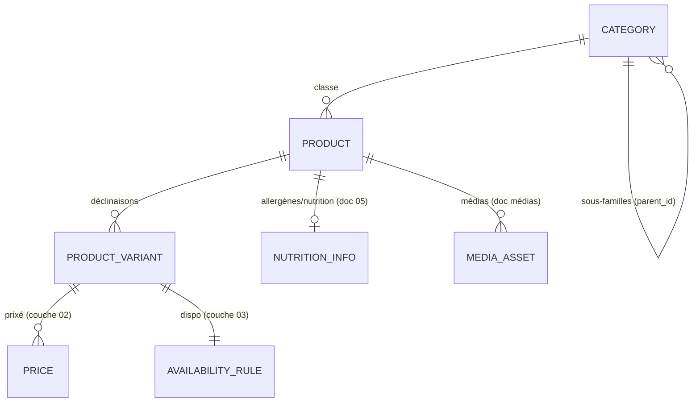

# 02 — Catalogue : modèle des items 🔒 FIGÉ v1 (2026-07-20)

> Le **cœur** du catalogue : les items vendables et leur taxonomie. **Aucun prix, aucune
> disponibilité, aucun id de plateforme** ici (couches 02-pricing / 03-dispo / 04-publication).
> Ce document est **figé** : les champs et invariants ci-dessous font foi pour le schéma Prisma.
> L'enrichissement éditorial premium (récit, provenance, labels, médias) est traité dans
> [`01-produit.md`](./01-produit.md) et n'altère pas ce socle.

## Conventions transverses (figées)

| Convention | Règle |
|---|---|
| **`id`** | UUID interne stable — ne change **jamais**, même si le nom change |
| **`sku`** | Référence métier lisible, **unique** et **immuable** |
| **`LocalizedText`** 🌐 | Champ traduisible, stocké en `jsonb` : `{ "fr": string, "en"?: string }`. **`fr` obligatoire**, autres locales optionnelles. Affichage : fallback → `fr` |
| **`attributes`** | `jsonb` fourre-tout, clés **namespacées par famille** (ex. `service.temperature`). **Jamais** de donnée réglementée dedans (allergènes → `NutritionInfo`) |
| **Soft-delete** | `is_active=false` retire du catalogue **sans suppression physique** (un item référencé n'est jamais supprimé) |
| **Audit** | `created_at` / `updated_at` sur chaque entité |

## Schéma relationnel (cœur figé)

Les entités grisées (`PRICE`, `AVAILABILITY_RULE`, `NUTRITION_INFO`, `MEDIA_ASSET`) sont **déclarées**
ici comme relations mais **définies ailleurs** — le socle items ne les possède pas.

---

## Entité : `Product` (produit)

Article vendable au niveau « concept » (« Croissant au beurre », « Tarte aux fraises »).

| Champ | Type | Notes |
|---|---|---|
| `id` | UUID | PK, stable |
| `sku` | string | Unique, immuable — ex. `VIEN-CROI-BEURRE` |
| `slug` | string | Identifiant URL canonique, unique — ex. `croissant-au-beurre` |
| `kind` | enum | `daily` \| `made_to_order` \| `resale` |
| `category_id` | UUID → Category | Famille de rattachement |
| `has_variants` | bool | Si `false` ⇒ une variante « défaut » implicite |
| `unit_of_sale` | enum | `piece` \| `weight_kg` \| `lot` \| `portion` |
| `name` 🌐 | LocalizedText | Désignation commerciale |
| `description_short` 🌐 | LocalizedText? | Résumé (caisse, listes) |
| `description_long` 🌐 | LocalizedText? | Fiche web (markdown) |
| `attributes` | jsonb | Specs libres namespacées par famille |
| `tags` | string[] | `signature`, `tradition`, `noel`, `bio`… |
| `is_active` | bool | `false` = retiré sans suppression |
| `created_at` / `updated_at` | timestamp | |

**`kind`** (spécifique boulangerie) : `daily` = frais du jour (dispo = capacité de production) ·
`made_to_order` = sur commande (dispo = date retrait + délai + cut-off) · `resale` = revendu tel quel
(seul cas de vrai stock inventaire).

**Relations non possédées ici** : `NutritionInfo` (allergènes/nutrition, doc 05) · `MediaAsset[]`
(médias) · `ProductVariant[]` (ci-dessous). Prix et disponibilité pendent de la **variante**, pas du
produit.

---

## Entité : `ProductVariant` (déclinaison)

**C'est la variante — pas le produit — qui porte le prix (couche 02) et la disponibilité (couche 03).**
Un produit sans déclinaison possède une variante « défaut » unique.

| Champ | Type | Notes |
|---|---|---|
| `id` | UUID | PK, stable |
| `product_id` | UUID → Product | Parent |
| `sku` | string | Unique, immuable — ex. `PATI-TARTE-FRAISE-6P` |
| `name` 🌐 | LocalizedText | Libellé déclinaison — « 6 personnes » |
| `barcode` | string? | EAN13 — caisse PI & `resale` |
| `options` | jsonb `map<string,string>` | Axes — `{ "taille": "6 pers", "format": "entier" }` |
| `weight_grams` | int? | Si vente au poids/portion |
| `attributes` | jsonb? | Specs libres au niveau variante |
| `is_default` | bool | Variante par défaut du produit |
| `is_active` | bool | Déclinaison vivante |
| `position` | int | Ordre d'affichage |
| `created_at` / `updated_at` | timestamp | |

> **Projection Shopify** : `options` (max 3 axes) → option1/2/3 ; les valeurs sont localisées à la
> projection, pas restockées. La localisation des valeurs d'axe est un sujet **projection**, pas socle.

---

## Entité : `Category` (famille / sous-famille)

Arborescence de classement, alignée sur les familles de caisse PI.

| Champ | Type | Notes |
|---|---|---|
| `id` | UUID | PK |
| `name` 🌐 | LocalizedText | « Viennoiseries » |
| `slug` | string | Identifiant web, unique |
| `parent_id` | UUID? → Category | `null` = racine |
| `position` | int | Ordre d'affichage |
| `pos_family_code` | string? | Code famille caisse PI (mapping compta/caisse) |
| `created_at` / `updated_at` | timestamp | |

Exemple : `Pains` › `Pains spéciaux` ; `Viennoiseries` ; `Pâtisseries` › `Individuels` / `Entremets` ;
`Traiteur` ; `Épicerie (revente)`.

---

## Invariants figés

1. `sku` **unique et immuable** (produits et variantes, espaces de noms séparés).
2. `has_variants = false` ⇒ **exactement une** variante `is_default = true` (implicite).
3. **Exactement une** variante `is_default` par produit.
4. **Règle de création de variante** : on ne crée une variante que si elle a un **prix OU une
   disponibilité propre**. Sinon c'est une **option de préparation** (« bien cuit ») = note de
   commande, pas une déclinaison.
5. `Category` = **arbre sans cycle** ; `parent_id null` = racine.
6. `slug` **unique** (canonique) ; les slugs par locale sont une concern de **projection** (Shopify).
7. `LocalizedText` : `fr` **obligatoire** ; fallback d'affichage → `fr`.
8. `attributes` : clés **namespacées** ; **interdit** d'y mettre de la donnée réglementée (allergènes,
   ingrédients → `NutritionInfo`).
9. Toute mise hors catalogue passe par `is_active = false` — **jamais** de `DELETE` physique.

---

## Enums figés

| Enum | Valeurs |
|---|---|
| `Product.kind` | `daily` · `made_to_order` · `resale` |
| `Product.unit_of_sale` | `piece` · `weight_kg` · `lot` · `portion` |

---

## Ce qui n'est PAS dans ce socle (pointeurs)

| Concern | Où |
|---|---|
| **Prix + catégorie TVA** | `02-pricing-canaux.md` (un prix *par canal*) |
| **Disponibilité / capacité** | `03-disponibilite-production.md` |
| **Ids Shopify / PI** | `04-publication-versioning.md` (table de mapping) |
| **Allergènes / nutrition** | `05-allergenes-gs1-inco.md` + `NutritionInfo` |
| **Récit / provenance / labels / médias premium** | `01-produit.md` (enrichissement, non figé) |
