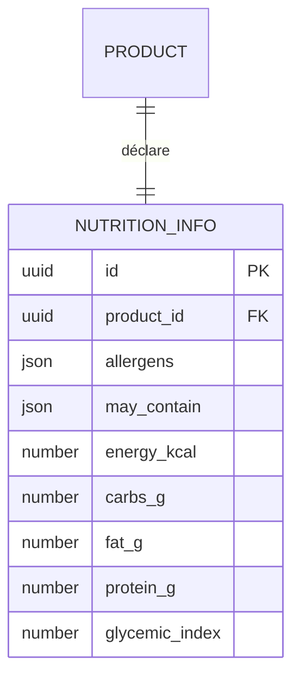

# 03 — Nutrition & allergènes (couche 🥗 réglementaire)

> La fiche `NutritionInfo` porte le **réglementaire** d'un produit : les **allergènes (obligatoires)**
> et, en optionnel, les valeurs nutritionnelles. Rattachée au **produit** (une fiche par produit).
>
> **Event-sourced** (ADR-11) : projection, donc **pas de `created_at`/`updated_at`**. Fait partie de
> l'**agrégat `Product`** (le produit possède sa nutrition) — cf. D6.

## Rattachement

## Entité : `NutritionInfo`

| Champ | Type | Requis | Rôle |
|---|---|:--:|---|
| `id` | UUID | ✅ | |
| `product_id` | UUID → Product | ✅ | Produit rattaché |
| `allergens` | `AllergenCode[]` (**GS1**) | ✅ **requis** | Allergènes présents. `[]` = déclaré « aucun » (une déclaration positive, pas une absence de donnée) |
| `may_contain` | `AllergenCode[]` (**GS1**) | optionnel | Traces — « peut contenir » |
| `energy_kcal` | number? | optionnel | **Calories** (pour 100 g) |
| `carbs_g` | number? | optionnel | **Glucides** (g / 100 g) |
| `fat_g` | number? | optionnel | **Lipides** (g / 100 g) |
| `protein_g` | number? | optionnel | **Protéines** (g / 100 g) |
| `glycemic_index` | number? | optionnel | **Indice glycémique** (0–100+) |

**Base de référence** : valeurs **pour 100 g** (standard INCO). Une base « par portion » pourra
s'ajouter plus tard sans casser celle-ci.

## Allergènes : GS1 canonique → INCO à l'affichage

`allergens` / `may_contain` stockent des **codes GS1** (canonique, interopérable B2B/GDSN). La
projection vers l'**INCO-14** (filtre + libellés + mise en forme) se fait à l'affichage — logique déjà
codée : [`src/allergens`](../../../apps/chevallot-PIM-backend/src/allergens) (`toInco` / `toGdsn`),
détail dans `05-allergenes-gs1-inco.md` *(à porter)*. Codes GS1 **provisoires** — à peupler depuis
`ref.gs1.org`.

## Invariants

1. **Allergènes obligatoires pour publier** : un produit ne peut être poussé vers un canal sans
   `allergens` déclaré (invariant de publication, couche 04). `[]` est une déclaration valide.
2. `may_contain` et `allergens` sont **disjoints** (un allergène présent n'est pas aussi une trace).
3. Valeurs nutritionnelles **≥ 0** ; cohérence macro non imposée (les valeurs déclarées font foi, on
   ne recalcule pas les calories depuis les macros).

## Questions ouvertes

1. **Stockage des allergènes** : `jsonb` (array de codes GS1, + index GIN) **ou** table de liaison
   `nutrition_allergen` ? Le besoin « filtrer les produits par allergène » (ex. « sans gluten »)
   penche pour la table de liaison ou l'index GIN — **décision à la phase Prisma**.
2. **Fiche complète INCO** : ajoute-t-on les champs légaux de la déclaration nutritionnelle
   (énergie en **kJ**, **acides gras saturés**, **sucres**, **sel/sodium**, **fibres**) ? Actuellement
   volontairement **lean** (calories + macros + IG). À trancher selon l'obligation d'affichage.
3. **`ingredients_text`** (liste d'ingrédients réglementaire) : ici (avec la nutrition) ou dans la
   couche éditoriale ? Légalement c'est du réglementaire → plutôt ici.
4. **Niveau** : une `NutritionInfo` par **produit** suffit, ou certaines **variantes** ont une recette
   assez différente pour porter la leur ?
